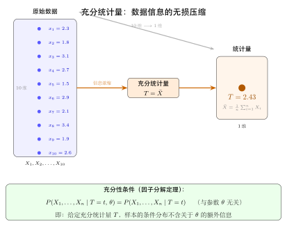

# 第 15 章 充分统计量（融合版）

> **难度**：★★★★
> **前置知识**：参数估计基础（第 13 章）、指数族分布概念、Fisher 信息量
> **本文件**：融合"原版严格推导 + 融合版直觉速记 / 套路 / 自测"。保留原版完整正文（学习目标 / 15.1–15.5 / 深度学习应用 / 练习题）+ 在最前置 + 最后追加思维训练。

> **一例速记**：
> **充分统计量定义**：$T(\mathbf{X})$ 充分 $\iff$ $P_\theta(\mathbf{X} \in A \mid T=t)$ 与 $\theta$ 无关；给定 $T$ 后原始数据不再提供关于 $\theta$ 的额外信息。
> **Fisher-Neyman 因子分解**：$f(\mathbf{x};\theta) = g(T(\mathbf{x}),\theta)\cdot h(\mathbf{x})$（$g$ 只通过 $T$ 依赖数据，$h$ 不含 $\theta$）。
> **最小充分**：所有充分统计量中"最细"的那个；Lehmann-Scheffé 判别：密度比 $f(\mathbf{x};\theta)/f(\mathbf{y};\theta)$ 与 $\theta$ 无关 $\iff$ $T(\mathbf{x})=T(\mathbf{y})$。
> **完备性**：$\mathbb{E}_\theta[g(T)]=0\;\forall\theta \implies g(T)=0\text{ a.s.}$；完备充分 + 无偏 = UMVUE（Lehmann-Scheffé 定理）。
> **Rao-Blackwell**：以充分统计量条件化任何无偏估计，方差不增：$\hat{\theta}(T)=\mathbb{E}[\tilde{\theta}\mid T]$，$\operatorname{Var}(\hat{\theta})\leq\operatorname{Var}(\tilde{\theta})$。
> **指数族**：$f(x;\theta)=h(x)\exp[\eta(\theta)T(x)-B(\theta)]$，自然充分统计量 $\sum_i T(X_i)$；正则指数族自然充分统计量完备。

---

## 引入：一道反直觉的充分性问题

> **题目**：设 $X_1,\ldots,X_n \overset{iid}{\sim} \mathcal{N}(\mu, \sigma^2)$，$\sigma^2$ 已知，$\mu$ 未知。
>
> (1) 直觉上 $\bar{X}$ "充分"吗？它为什么是 $\mu$ 的充分统计量？
>
> (2) 若改成 $\sigma^2$ 未知、$\mu$ 已知，$T = \sum_{i=1}^n (X_i - \mu)^2$ 充分吗？
>
> (3) 统计量 $T' = X_1$（只取第一个观测）是 $\mu$ 的充分统计量吗？

请先停下来想一想：压缩了 $n$ 个数据，真的不丢信息吗？

**反直觉之处**：
- 直觉说："从 $n$ 个数压缩到 1 个均值，丢了 $n-1$ 个数的信息，怎么可能充分？"
- 事实是：对正态总体，均值 $\bar{X}$ **确实**是 $\mu$ 的充分统计量——给定 $\bar{X}$ 后，数据的"剩余波动"完全由 $\sigma^2$ 决定，与 $\mu$ 无关。
- 而 $T' = X_1$ 则**不是**充分统计量——它只用了第一个观测，丢弃了 $X_2,\ldots,X_n$ 中关于 $\mu$ 的信息。

这道题点出了充分统计量的核心：**信息的完整性，不是数量的多少**。下面把解题者的内心独白完整还原。

---

## 思维路径还原（用因子分解判充分性的内心独白）

> "题目要判断 $\bar{X}$ 是否是 $\mu$ 的充分统计量，$\sigma^2$ 已知。
>
> **第一步**：写出联合密度 $f(\mathbf{x};\mu)$。
>
> $f(\mathbf{x};\mu) = \prod_{i=1}^n \frac{1}{\sqrt{2\pi}\sigma}\exp\!\left(-\frac{(x_i-\mu)^2}{2\sigma^2}\right) = \left(\frac{1}{\sqrt{2\pi}\sigma}\right)^n \exp\!\left(-\frac{\sum(x_i-\mu)^2}{2\sigma^2}\right)$。
>
> **第二步**：展开指数部分，尝试把含 $\mu$ 的部分"剥离"成只通过某个统计量 $T$ 依赖 $\mathbf{x}$。
>
> $\sum(x_i-\mu)^2 = \sum x_i^2 - 2\mu\sum x_i + n\mu^2$。
>
> 所以 $f(\mathbf{x};\mu) = \exp\!\left(\frac{\mu\sum x_i}{\sigma^2} - \frac{n\mu^2}{2\sigma^2}\right) \cdot \left(\frac{1}{\sqrt{2\pi}\sigma}\right)^n\exp\!\left(-\frac{\sum x_i^2}{2\sigma^2}\right)$。
>
> **第三步**：识别分解结构。令 $T(\mathbf{x})=\sum x_i$，则：
>
> - $g(T,\mu) = \exp\!\left(\frac{\mu T}{\sigma^2} - \frac{n\mu^2}{2\sigma^2}\right)$，只通过 $T$ 依赖数据，且含 $\mu$。
> - $h(\mathbf{x}) = \left(\frac{1}{\sqrt{2\pi}\sigma}\right)^n\exp\!\left(-\frac{\sum x_i^2}{2\sigma^2}\right)$，含 $\mathbf{x}$ 但不含 $\mu$。
>
> **第四步**：确认分解成立，由 Fisher-Neyman 定理断言 $T=\sum X_i$（等价地 $\bar{X}$）是 $\mu$ 的充分统计量。
>
> **延伸验证 $T'=X_1$**：若令 $T'=X_1$，则 $f(\mathbf{x};\mu)$ 中还剩 $\sum_{i=2}^n x_i$ 这部分，它含 $\mu$ 且无法只通过 $X_1$ 表达——无法完成因子分解。因此 $X_1$ 不是充分统计量。
>
> **关键内心判断**：充分性的判定就是"能否把联合密度中所有含 $\theta$ 的部分，都攒到只通过 $T(\mathbf{x})$ 与数据挂钩"。如果能，$T$ 充分；若做不到，$T$ 不充分。"

---

## 学习目标

学完本章后，你将能够：

- 理解充分统计量的核心思想：统计量对参数所含信息的完整捕获，以及 Fisher-Neyman 因子分解定理的条件与应用
- 掌握因子分解定理，能判断给定统计量是否为充分统计量，并在常见分布族中求出充分统计量
- 理解最小充分统计量的概念，区分"充分"与"最充分的压缩"，能利用 Lehmann-Scheffé 定理识别最小充分统计量
- 掌握完备统计量的定义与 Basu 定理，理解完备性在无偏估计理论（Rao-Blackwell 定理与 Lehmann-Scheffé 定理）中的核心作用
- 认识指数族分布的自然充分统计量，理解指数族的结构如何天然适配充分性理论，并将其与深度学习中的信息压缩、特征学习联系起来

---

## 15.1 充分统计量的定义

### 15.1.1 统计量的信息损失问题

在统计推断中，我们面对样本 $\mathbf{X} = (X_1, X_2, \ldots, X_n)$，希望通过统计量 $T(\mathbf{X})$ 来推断未知参数 $\theta$。

**基本问题**：将 $n$ 个观测值压缩为一个（或少数几个）统计量时，是否会**丢失关于 $\theta$ 的信息**？

**直观例子**：设 $X_1, \ldots, X_n \overset{iid}{\sim} \text{Bernoulli}(\theta)$。

- 统计量 $T_1 = X_1$：只用第一个观测，丢失了大量信息。
- 统计量 $T_2 = \sum_{i=1}^n X_i$：累计了所有观测中正面出现的次数。
- 统计量 $T_3 = (X_1, X_2, \ldots, X_n)$：保留了全部原始数据，显然不丢失任何信息。

$T_3$ 无压缩，$T_1$ 压缩过度丢失信息，$T_2$ 恰好是"刚好够用"的压缩——这正是**充分统计量**的直觉。

### 15.1.2 充分统计量的正式定义

**定义 15.1（充分统计量）**

设 $\mathbf{X} = (X_1, \ldots, X_n)$ 来自参数为 $\theta$ 的分布族 $\{P_\theta : \theta \in \Theta\}$。统计量 $T = T(\mathbf{X})$ 称为参数 $\theta$ 的**充分统计量**（sufficient statistic），若对任意给定的 $T = t$，条件分布

$$
P_\theta(\mathbf{X} \in A \mid T(\mathbf{X}) = t)
$$

与参数 $\theta$ 无关。

**等价地说**：在已知 $T(\mathbf{X})$ 的条件下，样本 $\mathbf{X}$ 的分布不再依赖 $\theta$。也就是说，$T$ 已经"充分地"捕获了样本中关于 $\theta$ 的所有信息。

### 15.1.3 直觉理解：信息瓶颈

充分统计量可以理解为**参数信息的无损压缩**：

$$
\underbrace{\mathbf{X}}_{\text{原始数据}} \xrightarrow{\text{充分压缩}} \underbrace{T(\mathbf{X})}_{\text{充分统计量}} \xrightarrow{\text{推断}} \theta
$$

关键性质：
- 知道 $T(\mathbf{X})$ 后，原始数据 $\mathbf{X}$ 的"剩余部分"不再提供关于 $\theta$ 的额外信息
- 任何基于 $\mathbf{X}$ 的统计推断都可以等价地只基于 $T(\mathbf{X})$ 进行

### 15.1.4 验证充分性的条件定义法

**例 15.1**：设 $X_1, \ldots, X_n \overset{iid}{\sim} \text{Bernoulli}(\theta)$，验证 $T = \sum_{i=1}^n X_i$ 是充分统计量。

**验证**：$T \sim \text{Binomial}(n, \theta)$。对 $t = 0, 1, \ldots, n$，计算条件概率：

$$
P_\theta(\mathbf{X} = \mathbf{x} \mid T = t) = \frac{P_\theta(\mathbf{X} = \mathbf{x},\, T(\mathbf{x}) = t)}{P_\theta(T = t)}
$$

当 $\sum x_i = t$ 时：

$$
P_\theta(\mathbf{X} = \mathbf{x} \mid T = t) = \frac{\theta^t(1-\theta)^{n-t}}{\binom{n}{t}\theta^t(1-\theta)^{n-t}} = \frac{1}{\binom{n}{t}}
$$

条件概率与 $\theta$ 无关，故 $T = \sum_{i=1}^n X_i$ 是充分统计量。$\square$

---

## 15.2 因子分解定理

直接用定义验证充分性往往繁琐。因子分解定理（Factorization Theorem）给出了一种更便捷的判断方法。

### 15.2.1 定理陈述

**定理 15.1（Fisher-Neyman 因子分解定理）**

设样本 $\mathbf{X} = (X_1, \ldots, X_n)$ 的联合密度（或概率质量函数）为 $f(\mathbf{x};\theta)$。统计量 $T(\mathbf{X})$ 是 $\theta$ 的充分统计量，当且仅当存在非负函数 $g$ 和 $h$，使得对所有 $\mathbf{x}$ 和 $\theta$：

$$
\boxed{f(\mathbf{x};\theta) = g(T(\mathbf{x}),\, \theta) \cdot h(\mathbf{x})}
$$

其中：
- $g(T(\mathbf{x}), \theta)$：仅通过 $T(\mathbf{x})$ 依赖于数据，且依赖于参数 $\theta$
- $h(\mathbf{x})$：仅依赖于数据 $\mathbf{x}$，与参数 $\theta$ 无关

**含义**：联合密度可以"因子分解"为依赖 $\theta$ 的部分（仅通过 $T$）和不依赖 $\theta$ 的部分之积。参数 $\theta$ 影响数据的方式"完全经由" $T$ 传递。

### 15.2.2 应用示例

**例 15.2**：正态分布的充分统计量

设 $X_1, \ldots, X_n \overset{iid}{\sim} \mathcal{N}(\mu, \sigma^2)$，$\sigma^2$ 已知，$\mu$ 未知。

联合密度：

$$
f(\mathbf{x};\mu) = \prod_{i=1}^n \frac{1}{\sqrt{2\pi}\sigma} \exp\!\left(-\frac{(x_i-\mu)^2}{2\sigma^2}\right)
$$

展开指数部分：

$$
\sum_{i=1}^n (x_i - \mu)^2 = \sum_{i=1}^n x_i^2 - 2\mu\sum_{i=1}^n x_i + n\mu^2
$$

因此：

$$
f(\mathbf{x};\mu) = \underbrace{\exp\!\left(\frac{\mu\sum x_i}{\sigma^2} - \frac{n\mu^2}{2\sigma^2}\right)}_{g(\sum x_i,\, \mu)} \cdot \underbrace{\left(\frac{1}{\sqrt{2\pi}\sigma}\right)^n \exp\!\left(-\frac{\sum x_i^2}{2\sigma^2}\right)}_{h(\mathbf{x})}
$$

由因子分解定理，$T = \sum_{i=1}^n X_i$（等价地，$\bar{X}$）是 $\mu$ 的充分统计量。$\square$

**例 15.3**：均匀分布的充分统计量

设 $X_1, \ldots, X_n \overset{iid}{\sim} \text{Uniform}(0, \theta)$，$\theta > 0$。

联合密度：

$$
f(\mathbf{x};\theta) = \prod_{i=1}^n \frac{1}{\theta} \mathbf{1}_{[0,\theta]}(x_i) = \frac{1}{\theta^n} \mathbf{1}\!\left\{0 \leq x_{(n)} \leq \theta\right\} \cdot \mathbf{1}\!\left\{x_{(1)} \geq 0\right\}
$$

其中 $x_{(n)} = \max_i x_i$，$x_{(1)} = \min_i x_i$。令 $T = X_{(n)}$：

$$
f(\mathbf{x};\theta) = \underbrace{\frac{1}{\theta^n}\mathbf{1}\{T \leq \theta\}}_{g(T,\,\theta)} \cdot \underbrace{\mathbf{1}\{x_{(1)} \geq 0\}}_{h(\mathbf{x})}
$$

故 $T = X_{(n)} = \max(X_1, \ldots, X_n)$ 是 $\theta$ 的充分统计量。$\square$

**例 15.4**：泊松分布的充分统计量

设 $X_1, \ldots, X_n \overset{iid}{\sim} \text{Poisson}(\lambda)$。

$$
f(\mathbf{x};\lambda) = \prod_{i=1}^n \frac{e^{-\lambda}\lambda^{x_i}}{x_i!} = \underbrace{e^{-n\lambda}\lambda^{\sum x_i}}_{g(\sum x_i,\,\lambda)} \cdot \underbrace{\prod_{i=1}^n \frac{1}{x_i!}}_{h(\mathbf{x})}
$$

故 $T = \sum_{i=1}^n X_i$ 是 $\lambda$ 的充分统计量。$\square$

### 15.2.3 充分统计量的非唯一性

充分统计量不唯一：若 $T$ 是充分统计量，则任何与 $T$ 一一对应的函数 $\phi(T)$ 也是充分统计量（因为 $T$ 可从 $\phi(T)$ 恢复）。

特别地，原始样本 $\mathbf{X}$ 本身总是充分统计量（但毫无压缩）。这引出了"最小充分统计量"的概念。

---

## 15.3 最小充分统计量

### 15.3.1 统计量的粗细之分

充分统计量实现了对数据的**无损压缩**，但压缩程度可以不同：

- $\mathbf{X} = (X_1, \ldots, X_n)$：充分但无压缩（最粗）
- $\bar{X}$：充分且压缩至一维（对正态均值问题）
- 顺序统计量 $X_{(1)} \leq X_{(2)} \leq \cdots \leq X_{(n)}$：充分（对无参数族），但比 $\bar{X}$ 粗

**最小充分统计量**是"最细"的充分统计量——在保持充分性的同时，实现了最大程度的数据压缩。

### 15.3.2 正式定义

**定义 15.2（最小充分统计量）**

充分统计量 $T^*(\mathbf{X})$ 称为**最小充分统计量**（minimal sufficient statistic），若对任意其他充分统计量 $T(\mathbf{X})$，存在函数 $\phi$ 使得

$$
T^*(\mathbf{X}) = \phi(T(\mathbf{X}))
$$

即 $T^*$ 是 $T$ 的函数。换言之，任何其他充分统计量都比 $T^*$ "粗"（包含更多冗余信息）。

### 15.3.3 Lehmann-Scheffé 判别定理

**定理 15.2（Lehmann-Scheffé 最小充分性定理）**

设样本密度（或质量函数）为 $f(\mathbf{x};\theta)$。若存在统计量 $T(\mathbf{X})$ 满足：

$$
\frac{f(\mathbf{x};\theta)}{f(\mathbf{y};\theta)} \text{ 与 } \theta \text{ 无关} \iff T(\mathbf{x}) = T(\mathbf{y})
$$

则 $T(\mathbf{X})$ 是 $\theta$ 的最小充分统计量。

**直觉**：$T(\mathbf{x}) = T(\mathbf{y})$ 当且仅当 $\mathbf{x}$ 和 $\mathbf{y}$ 对于所有 $\theta$ 提供"等量的关于 $\theta$ 的信息"（密度比不依赖于 $\theta$）。最小充分统计量正好将所有"信息等量"的样本点归为同一等价类。

### 15.3.4 例子

**例 15.5**：正态分布 $\mathcal{N}(\mu, \sigma^2)$（两参数均未知）

联合密度比：

$$
\frac{f(\mathbf{x};\mu,\sigma^2)}{f(\mathbf{y};\mu,\sigma^2)} = \exp\!\left(-\frac{\sum x_i^2 - \sum y_i^2}{2\sigma^2} + \frac{\mu(\sum x_i - \sum y_i)}{\sigma^2}\right)
$$

此比值与 $(\mu, \sigma^2)$ 无关，当且仅当：

$$
\sum_{i=1}^n x_i^2 = \sum_{i=1}^n y_i^2 \quad \text{且} \quad \sum_{i=1}^n x_i = \sum_{i=1}^n y_i
$$

因此，$T(\mathbf{X}) = \left(\sum_{i=1}^n X_i,\, \sum_{i=1}^n X_i^2\right)$ 是 $(\mu, \sigma^2)$ 的最小充分统计量。

等价地，$(\bar{X}, S^2)$ 也是最小充分统计量，其中 $S^2 = \frac{1}{n-1}\sum(X_i - \bar{X})^2$。$\square$

**例 15.6**：单参数正态 $\mathcal{N}(\mu, \sigma^2)$，$\sigma^2$ 已知

此时密度比不依赖于 $\mu$ 当且仅当 $\sum x_i = \sum y_i$，故 $T = \sum X_i$（即 $\bar{X}$）是最小充分统计量。

---

## 15.4 完备统计量

### 15.4.1 完备性的动机

充分统计量捕获了全部参数信息，但还有一个问题：**是否存在以充分统计量为基础的"多余"估计量**？

考虑 $X_1, \ldots, X_n \overset{iid}{\sim} \mathcal{N}(\mu, 1)$，$T = \bar{X}$ 是充分统计量。

$g(T) = \bar{X}$ 是 $\mu$ 的无偏估计，但 $g(T) = \bar{X} + c(\bar{X} - \bar{X}) = \bar{X}$ 也是。这里没有"多余"。

但若充分统计量不完备，就可能存在非零函数 $h(T)$ 满足 $\mathbb{E}_\theta[h(T)] = 0$ 对所有 $\theta$ 成立，这意味着存在关于 $\theta$ 无信息的"冗余方向"。

### 15.4.2 完备性的定义

**定义 15.3（完备统计量）**

统计量 $T(\mathbf{X})$ 称为**完备统计量**（complete statistic），若对任意可测函数 $g$：

$$
\mathbb{E}_\theta[g(T)] = 0 \text{ 对所有 } \theta \in \Theta \implies P_\theta(g(T) = 0) = 1 \text{ 对所有 } \theta \in \Theta
$$

即：若某函数 $g(T)$ 的期望对所有 $\theta$ 均为零，则 $g(T)$ 必然几乎处处为零。

**直觉**：完备性排除了以 $T$ 为基础的"有均值为零的非平凡估计量"——$T$ 没有"多余的自由度"。

### 15.4.3 完备充分统计量的重要性

当 $T$ 既是**充分**又是**完备**的（完备充分统计量，complete sufficient statistic），它具有极为优良的性质：

**定理 15.3（Rao-Blackwell 定理）**

设 $\tilde{\theta}(\mathbf{X})$ 是 $\theta$ 的无偏估计，$T$ 是充分统计量。令

$$
\hat{\theta}(T) = \mathbb{E}_\theta[\tilde{\theta}(\mathbf{X}) \mid T]
$$

则 $\hat{\theta}(T)$ 也是 $\theta$ 的无偏估计，且对所有 $\theta$：

$$
\operatorname{Var}_\theta(\hat{\theta}(T)) \leq \operatorname{Var}_\theta(\tilde{\theta}(\mathbf{X}))
$$

即以充分统计量为条件的"Rao-Blackwell 化"改进（或不劣于）原估计。

**定理 15.4（Lehmann-Scheffé 定理）**

若 $T$ 是**完备充分**统计量，$\hat{\theta}(T)$ 是基于 $T$ 的无偏估计，则 $\hat{\theta}(T)$ 是 $\theta$ 的**一致最小方差无偏估计量**（UMVUE）。

$$
\boxed{T \text{ 完备充分} + \hat{\theta}(T) \text{ 无偏} \implies \hat{\theta}(T) \text{ 是 UMVUE}}
$$

### 15.4.4 Basu 定理

**定理 15.5（Basu 定理）**

若 $T$ 是完备充分统计量，$V$ 是辅助统计量（ancillary statistic，其分布与 $\theta$ 无关），则 $T$ 与 $V$ 独立。

**推论**：对正态样本 $X_1, \ldots, X_n \overset{iid}{\sim} \mathcal{N}(\mu, \sigma^2)$（$\sigma^2$ 已知），$\bar{X}$ 是完备充分统计量。样本极差 $R = X_{(n)} - X_{(1)}$ 是辅助统计量，故 $\bar{X}$ 与 $R$ 独立。

### 15.4.5 完备充分统计量的求解示例

**例 15.7**：指数分布 $\text{Exp}(\lambda)$ 的完备充分统计量

设 $X_1, \ldots, X_n \overset{iid}{\sim} \text{Exp}(\lambda)$，密度 $f(x;\lambda) = \lambda e^{-\lambda x}$，$x > 0$。

由因子分解定理，$T = \sum_{i=1}^n X_i$ 是充分统计量（$T \sim \text{Gamma}(n, \lambda)$）。

对任意函数 $g$，设 $\mathbb{E}_\lambda[g(T)] = 0$ 对所有 $\lambda > 0$ 成立：

$$
\int_0^\infty g(t) \cdot \frac{\lambda^n t^{n-1} e^{-\lambda t}}{\Gamma(n)}\, dt = 0 \quad \forall\, \lambda > 0
$$

即 $\int_0^\infty g(t) t^{n-1} e^{-\lambda t} dt = 0$ 对所有 $\lambda > 0$，这是 Laplace 变换为零，由唯一性定理知 $g(t) t^{n-1} = 0$ 几乎处处，故 $g(t) = 0$ 几乎处处。

因此 $T = \sum X_i$ 是完备充分统计量，$\hat{\lambda}_{UMVUE} = \frac{n-1}{\sum X_i}$ 是 $\lambda$ 的 UMVUE。$\square$

---

## 15.5 指数族与充分统计量

### 15.5.1 指数族分布

许多常见分布（正态、泊松、二项、伽马、贝塔等）属于同一大类：**指数族**（exponential family）。

**定义 15.4（单参数指数族）**

密度（或质量函数）具有如下形式的分布族称为单参数指数族：

$$
\boxed{f(x;\theta) = h(x) \exp\!\left[\eta(\theta) T(x) - B(\theta)\right]}
$$

其中：
- $h(x) \geq 0$：基础测度，与参数无关
- $\eta(\theta)$：**自然参数**（natural parameter）
- $T(x)$：**自然充分统计量**（natural sufficient statistic）
- $B(\theta) = \log\int h(x)e^{\eta(\theta)T(x)}dx$：**对数配分函数**（log-partition function），确保归一化

**多参数推广**（$k$ 参数指数族）：

$$
f(x;\boldsymbol{\theta}) = h(x) \exp\!\left[\sum_{j=1}^k \eta_j(\boldsymbol{\theta}) T_j(x) - B(\boldsymbol{\theta})\right]
$$

### 15.5.2 指数族的自然充分统计量

**定理 15.6**

设 $X_1, \ldots, X_n \overset{iid}{\sim} f(x;\boldsymbol{\theta})$，其中 $f$ 是 $k$ 参数指数族。则

$$
\mathbf{T}(\mathbf{X}) = \left(\sum_{i=1}^n T_1(X_i),\, \sum_{i=1}^n T_2(X_i),\, \ldots,\, \sum_{i=1}^n T_k(X_i)\right)
$$

是 $\boldsymbol{\theta}$ 的充分统计量。若参数空间包含 $k$ 维开集（正则指数族），则 $\mathbf{T}$ 还是完备的。

**证明**：联合密度为

$$
f(\mathbf{x};\boldsymbol{\theta}) = \left[\prod_{i=1}^n h(x_i)\right] \exp\!\left[\sum_{j=1}^k \eta_j(\boldsymbol{\theta})\sum_{i=1}^n T_j(x_i) - nB(\boldsymbol{\theta})\right]
$$

取 $g(\mathbf{T}, \boldsymbol{\theta}) = \exp\!\left[\sum_j \eta_j \cdot \sum_i T_j(x_i) - nB(\boldsymbol{\theta})\right]$，$h(\mathbf{x}) = \prod_i h(x_i)$，由因子分解定理，$\mathbf{T}$ 是充分统计量。$\square$

### 15.5.3 常见指数族的充分统计量

| 分布 | 密度/质量函数 | 自然参数 $\eta$ | 充分统计量 $T(x)$ |
|------|-------------|----------------|-----------------|
| $\text{Bernoulli}(\theta)$ | $\theta^x(1-\theta)^{1-x}$ | $\log\frac{\theta}{1-\theta}$ | $x$ |
| $\mathcal{N}(\mu, \sigma^2)$（双参数） | $(2\pi\sigma^2)^{-1/2}e^{-(x-\mu)^2/2\sigma^2}$ | $(\mu/\sigma^2,\,-1/(2\sigma^2))$ | $(x,\, x^2)$ |
| $\text{Poisson}(\lambda)$ | $e^{-\lambda}\lambda^x/x!$ | $\log\lambda$ | $x$ |
| $\text{Exp}(\lambda)$ | $\lambda e^{-\lambda x}$ | $-\lambda$ | $x$ |
| $\text{Gamma}(\alpha, \beta)$ | $\frac{\beta^\alpha}{\Gamma(\alpha)}x^{\alpha-1}e^{-\beta x}$ | $(\alpha-1,\,-\beta)$ | $(\log x,\, x)$ |
| $\text{Beta}(\alpha, \beta)$ | $\frac{x^{\alpha-1}(1-x)^{\beta-1}}{B(\alpha,\beta)}$ | $(\alpha-1,\,\beta-1)$ | $(\log x,\, \log(1-x))$ |

### 15.5.4 指数族的信息论性质

对数配分函数 $B(\boldsymbol{\eta})$ 是**凸函数**，其梯度和 Hessian 分别给出充分统计量的期望和协方差：

$$
\nabla_{\boldsymbol{\eta}} B(\boldsymbol{\eta}) = \mathbb{E}_{\boldsymbol{\eta}}[\mathbf{T}(X)]
$$

$$
\nabla^2_{\boldsymbol{\eta}} B(\boldsymbol{\eta}) = \operatorname{Cov}_{\boldsymbol{\eta}}[\mathbf{T}(X)] = \mathbf{I}(\boldsymbol{\eta})
$$

其中 $\mathbf{I}(\boldsymbol{\eta})$ 是 **Fisher 信息矩阵**。这一关系揭示了指数族的深刻结构：**充分统计量的期望完全刻画了参数的信息**。

### 15.5.5 充分统计量与 Fisher 信息

**定理 15.7（充分统计量的 Fisher 信息保持性）**

若 $T$ 是 $\theta$ 的充分统计量，则

$$
I_T(\theta) = I_{\mathbf{X}}(\theta)
$$

充分统计量中包含原始样本的**全部** Fisher 信息。非充分统计量只含部分信息：$I_{T'}(\theta) \leq I_{\mathbf{X}}(\theta)$。

---

## 几何示意

### 图 15-1：充分统计量"信息浓缩"示意



**图解**：原始数据 $X_1,\ldots,X_n$（$n$ 维）经充分统计量 $T$ 压缩后，可以完整恢复关于参数 $\theta$ 的所有推断信息。维度从 $n$ 降至 $k$（指数族 $k$ 参数情形），但信息量关于 $\theta$ 无损。非充分统计量（如只取 $X_1$）则在箭头传递中"漏掉"了部分关于 $\theta$ 的信息，造成 Fisher 信息损失：$I_{T'}(\theta) < I_{\mathbf{X}}(\theta)$。

---

## 抽象成方法（套路总结）

### 核心公式速查表

| 名称 | 公式 / 条件 | 说明 |
|------|------------|------|
| **充分统计量定义** | $P_\theta(\mathbf{X}\in A\mid T=t)$ 与 $\theta$ 无关 | 条件分布与参数无关 |
| **因子分解定理** | $f(\mathbf{x};\theta)=g(T(\mathbf{x}),\theta)\cdot h(\mathbf{x})$ | 判充分性主要工具 |
| **最小充分（L-S）** | $f(\mathbf{x};\theta)/f(\mathbf{y};\theta)$ 与 $\theta$ 无关 $\iff T(\mathbf{x})=T(\mathbf{y})$ | 最大压缩的充分量 |
| **完备性** | $\mathbb{E}_\theta[g(T)]=0\;\forall\theta \implies g(T)=0\text{ a.s.}$ | 无零均值非平凡函数 |
| **Rao-Blackwell** | $\hat{\theta}=\mathbb{E}[\tilde{\theta}\mid T]$，$\operatorname{Var}(\hat{\theta})\leq\operatorname{Var}(\tilde{\theta})$ | 条件化降低方差 |
| **UMVUE（L-S）** | 完备充分 + 无偏 = UMVUE | 最优无偏估计 |
| **指数族充分量** | $\mathbf{T}=\bigl(\sum T_1(X_i),\ldots,\sum T_k(X_i)\bigr)$ | 正则族同时完备 |
| **Fisher 信息保持** | $I_T(\theta)=I_\mathbf{X}(\theta)$ | 充分量无信息损失 |

### 用因子分解判充分性：4 步流程

**步骤 1**：写出样本联合密度/质量函数 $f(\mathbf{x};\theta)$（将 $n$ 个独立因子相乘）。

**步骤 2**：展开或化简指数/多项式部分，将所有含 $\theta$ 的项提取到一起。

**步骤 3**：识别统计量 $T(\mathbf{x})$：它是联合密度中"桥接"数据与参数的中间项——参数只通过 $T$ 影响密度。

**步骤 4**：明确写出 $g(T(\mathbf{x}),\theta)$（含 $\theta$，只通过 $T$ 含数据）和 $h(\mathbf{x})$（不含 $\theta$），确认分解 $f=g\cdot h$，得出结论。

---

## 方法变形

### 变形 1：指数族识别与充分量直读

**适用**：分布已经属于或可改写为指数族标准形式。

**方法**：将密度改写为 $h(x)\exp[\eta(\theta)T(x)-B(\theta)]$，直接读取 $T(x)$ 为充分统计量；对 $n$ 个 i.i.d. 样本，充分统计量为 $\sum_i T(X_i)$。

**示例**：$\text{Gamma}(\alpha,\beta)$，$\alpha$ 已知 $\beta$ 未知：
$$f(x;\beta)=\frac{\beta^\alpha}{\Gamma(\alpha)}x^{\alpha-1}e^{-\beta x}=\underbrace{x^{\alpha-1}/\Gamma(\alpha)}_{h(x)}\exp[\underbrace{-\beta}_{=\eta}\cdot\underbrace{x}_{=T(x)}-\underbrace{(-\alpha\log\beta)}_{=B(\beta)}]$$
充分统计量：$\sum_{i=1}^n X_i$，同时是完备充分统计量（正则指数族）。

### 变形 2：求最小充分统计量（Lehmann-Scheffé 法）

**方法**：计算密度比 $R(\mathbf{x},\mathbf{y};\theta) = f(\mathbf{x};\theta)/f(\mathbf{y};\theta)$，化简后找出使 $R$ 与 $\theta$ 无关的充要条件，该条件给出的等价类即最小充分统计量的分组方式。

**注意**：最小充分统计量维度 = 参数维度（正则指数族情形）。

**示例**：$\text{Uniform}(\theta-1/2,\theta+1/2)$，密度比为 $\mathbf{1}\{x_{(n)}-1/2\leq\theta\leq x_{(1)}+1/2\}/\mathbf{1}\{y_{(n)}-1/2\leq\theta\leq y_{(1)}+1/2\}$，与 $\theta$ 无关当且仅当 $x_{(1)}=y_{(1)},x_{(n)}=y_{(n)}$，故 $(X_{(1)},X_{(n)})$ 是最小充分统计量。

### 变形 3：验证完备性

**方法 A（正则指数族）**：确认参数空间包含 $k$ 维开集，由定理 15.6 直接断言完备性。

**方法 B（Laplace 变换法）**：设 $\mathbb{E}_\theta[g(T)]=0$ 对所有 $\theta$ 成立，将其视为 Laplace 变换（或矩生成函数）恒为零，由唯一性定理推出 $g=0$ a.s.（见例 15.7）。

**陷阱**：充分统计量不一定完备（如非正则分布）；完备统计量也不一定充分（但完备充分统计量最有用）。

### 变形 4：Rao-Blackwell 改进估计

**步骤**：
1. 找到任意无偏估计 $\tilde{\theta}$（通常是简单的初始估计）。
2. 识别完备充分统计量 $T$。
3. 计算条件期望 $\hat{\theta}(T) = \mathbb{E}[\tilde{\theta}\mid T]$。
4. 验证 $\mathbb{E}[\hat{\theta}(T)]=\theta$（无偏性）。
5. 由 Lehmann-Scheffé 定理，$\hat{\theta}(T)$ 即为 UMVUE。

**示例**：$X_i\sim\text{Bernoulli}(\theta)$，初始估计 $\tilde{\theta}=X_1$（无偏）；充分统计量 $T=\sum X_i$。条件期望 $\mathbb{E}[X_1\mid T=t]=t/n=\bar{X}$。故 UMVUE 为 $\bar{X}$。

---

## 本章小结

**充分统计量理论的核心框架**：

$$
\underbrace{\text{充分性}}_{\text{无损压缩}} \xrightarrow{\text{完备性}} \underbrace{\text{UMVUE}}_{\text{最优无偏估计}}
$$

**关键概念回顾**：

1. **充分统计量**：给定 $T(\mathbf{X})$，样本的条件分布与 $\theta$ 无关；$T$ 捕获了样本中关于 $\theta$ 的全部信息。

2. **因子分解定理**：$T$ 充分 $\iff$ $f(\mathbf{x};\theta) = g(T(\mathbf{x}),\theta)\cdot h(\mathbf{x})$，是判断充分性的主要工具。

3. **最小充分统计量**：充分统计量中"最细"的那个，实现最大压缩。Lehmann-Scheffé 判别法：密度比 $f(\mathbf{x};\theta)/f(\mathbf{y};\theta)$ 与 $\theta$ 无关 $\iff$ $T(\mathbf{x}) = T(\mathbf{y})$。

4. **完备统计量**：$\mathbb{E}_\theta[g(T)] = 0\,\forall\theta \implies g(T) = 0$ a.s.；完备充分统计量是 UMVUE 的基础（Lehmann-Scheffé 定理），并与辅助统计量独立（Basu 定理）。

5. **指数族**：自然充分统计量为 $\sum_i T_j(X_i)$；正则指数族的充分统计量是完备的；$B(\boldsymbol{\eta})$ 的梯度给出 $\mathbb{E}[\mathbf{T}]$，Hessian 等于 Fisher 信息矩阵。

**理论链条**：

$$
\text{指数族} \implies \text{完备充分统计量} \xrightarrow{\text{Rao-Blackwell}} \text{UMVUE}
$$

---

## 思考路标（条件反射）

1. 看到"充分统计量" → 第一反应：**因子分解定理**，写联合密度，找 $g\cdot h$ 分解。
2. 看到"验证充分性" → 先看分布是否属于**指数族**，是则直接读充分统计量。
3. 看到"最小充分统计量" → 计算**密度比** $f(\mathbf{x};\theta)/f(\mathbf{y};\theta)$，找与 $\theta$ 无关的充要条件。
4. 看到"UMVUE" → 路线：完备充分统计量 + Rao-Blackwell 化 + Lehmann-Scheffé 定理。
5. 看到 $\bar{X}$ 对正态均值 → 充分且**最小充分**且**完备充分**（单参数正态情形）。
6. 看到"顺序统计量 $(X_{(1)},X_{(n)})$" → 考虑**均匀分布**族，这是最小充分统计量的经典。
7. 看到指数族密度 → 自然参数 $\eta$、充分统计量 $T(x)$、配分函数 $B$，三者同时标记。
8. 看到 $B(\boldsymbol{\eta})$ 的导数 → 一阶导是 $\mathbb{E}[\mathbf{T}]$，二阶导是 $\operatorname{Cov}[\mathbf{T}]$（Fisher 信息矩阵）。
9. 看到完备充分统计量 $T$ 和辅助统计量 $V$ → **Basu 定理**：$T \perp V$。
10. 看到"估计改进" → 以完备充分统计量条件化（Rao-Blackwell），方差严格不增。
11. 看到"充分但非最小充分" → $\bar{X}$ 对双参数正态不够，需要 $(\bar{X}, S^2)$。
12. 看到非指数族（如均匀族）→ 不能直接套指数族定理，用因子分解或 Lehmann-Scheffé。

---

## 易错点

1. **充分 $\neq$ 完备**：充分统计量只保证对参数无信息损失；完备性额外排除了"零均值的非平凡函数"。Uniform$(0,\theta)$ 的充分统计量 $X_{(n)}$ 是充分且最小充分的，同时也是完备的——但这是两个独立性质，须分别验证。

2. **"最小"指等价类最粗的分法，而非维数最小**：最小充分统计量维度通常等于参数维度（正则指数族），但"最小"的含义是：它是所有充分统计量的函数，而非它自身维度最低。均匀族 $(X_{(1)},X_{(n)})$ 是二维的，但对于单参数 $\text{Uniform}(0,\theta)$，$X_{(n)}$ 才是一维最小充分统计量。

3. **指数族不一定完备（非正则情形）**：$\text{Uniform}(0,\theta)$ 不属于指数族（支撑依赖参数），不能套指数族完备性定理。正则指数族要求参数空间包含 $k$ 维开集；截断分布等非正则情形须另行验证完备性。

4. **Rao-Blackwell 要求充分性（非完备性）**：以任意充分统计量条件化可降低方差（Rao-Blackwell）；要得到唯一最优（UMVUE），还需要**完备**充分统计量（Lehmann-Scheffé）。二者要求不同，不可混淆。

5. **密度比法的"当且仅当"两个方向**：Lehmann-Scheffé 判别定理要求双向等价——$T(\mathbf{x})=T(\mathbf{y})$ 蕴含密度比与 $\theta$ 无关，**且**密度比与 $\theta$ 无关蕴含 $T(\mathbf{x})=T(\mathbf{y})$。只验证一个方向是不完整的。

6. **因子分解中 $h(\mathbf{x})$ 可含 $T(\mathbf{x})$**：$h(\mathbf{x})$ 的要求是"不含参数 $\theta$"，并非"不含统计量 $T$"。只要 $h$ 中没有 $\theta$ 出现，就算含 $T(\mathbf{x})$ 也合法（但通常 $g$ 部分就包含了 $T$）。

---

## 典型应用例题

### 例题 1：因子分解定理证充分性——Gamma 分布

**题目**：设 $X_1,\ldots,X_n \overset{iid}{\sim} \text{Gamma}(\alpha,\beta)$，密度 $f(x;\beta)=\frac{\beta^\alpha}{\Gamma(\alpha)}x^{\alpha-1}e^{-\beta x}$，$\alpha$ 已知，$\beta>0$ 未知。利用因子分解定理证明 $T=\sum_{i=1}^n X_i$ 是 $\beta$ 的充分统计量。

**思路**：写联合密度，将含 $\beta$ 的部分归入 $g(T,\beta)$，其余归入 $h(\mathbf{x})$。

**解**：

联合密度：
$$
f(\mathbf{x};\beta) = \prod_{i=1}^n \frac{\beta^\alpha}{\Gamma(\alpha)} x_i^{\alpha-1}e^{-\beta x_i} = \underbrace{\frac{\beta^{n\alpha}}{\Gamma(\alpha)^n}e^{-\beta\sum x_i}}_{g(T,\,\beta)} \cdot \underbrace{\prod_{i=1}^n x_i^{\alpha-1}}_{h(\mathbf{x})}
$$

其中 $T=\sum_{i=1}^n x_i$，$g(T,\beta)=\frac{\beta^{n\alpha}}{\Gamma(\alpha)^n}e^{-\beta T}$ 仅通过 $T$ 依赖数据且含 $\beta$，$h(\mathbf{x})=\prod x_i^{\alpha-1}$ 不含 $\beta$。

由 Fisher-Neyman 因子分解定理，$T=\sum_{i=1}^n X_i$ 是 $\beta$ 的充分统计量。

此外，$\text{Gamma}(\alpha,\beta)$ 是正则指数族（参数空间 $\beta>0$ 为开集），故 $T$ 也是完备充分统计量。$\square$

---

### 例题 2：Lehmann-Scheffé 法求最小充分统计量——Cauchy 位置族

**题目**：设 $X_1,\ldots,X_n \overset{iid}{\sim}$ Cauchy$(\theta,1)$，密度 $f(x;\theta)=\frac{1}{\pi[1+(x-\theta)^2]}$，$\theta\in\mathbb{R}$ 未知。证明**顺序统计量** $(X_{(1)},\ldots,X_{(n)})$ 是 $\theta$ 的最小充分统计量。

**思路**：计算密度比，分析何时与 $\theta$ 无关。

**解**：

联合密度比：
$$
\frac{f(\mathbf{x};\theta)}{f(\mathbf{y};\theta)} = \prod_{i=1}^n \frac{1+(y_i-\theta)^2}{1+(x_i-\theta)^2}
$$

此比值对**所有** $\theta\in\mathbb{R}$ 均与 $\theta$ 无关，当且仅当 $\{(x_i-\theta)^2\}$ 和 $\{(y_i-\theta)^2\}$ 作为集合完全相同（每个 $\theta$ 都要成立），这等价于 $\mathbf{x}$ 和 $\mathbf{y}$ 是同一个排列，即 $x_{(k)}=y_{(k)}$ 对所有 $k$ 成立。

因此，密度比与 $\theta$ 无关 $\iff$ $(x_{(1)},\ldots,x_{(n)}) = (y_{(1)},\ldots,y_{(n)})$。

由 Lehmann-Scheffé 最小充分性定理，顺序统计量 $(X_{(1)},\ldots,X_{(n)})$ 是 $\theta$ 的最小充分统计量。

**注**：Cauchy 位置族不属于指数族，且顺序统计量无法进一步压缩——这是非指数族分布的典型特征，最小充分统计量维数可超过参数维数。$\square$

---

### 例题 3：Rao-Blackwell 改进——Bernoulli 分布

**题目**：设 $X_1,\ldots,X_n \overset{iid}{\sim} \text{Bernoulli}(\theta)$，$0<\theta<1$。

(1) 说明 $\tilde{\theta}=X_1$ 是 $\theta$ 的无偏估计。

(2) 识别完备充分统计量 $T$。

(3) 计算 $\hat{\theta}(T)=\mathbb{E}[X_1\mid T]$，得到 $\theta$ 的 UMVUE。

(4) 比较 $\operatorname{Var}(X_1)$ 与 $\operatorname{Var}(\hat{\theta}(T))$，体现 Rao-Blackwell 改进。

**解**：

**(1) 无偏性**：$\mathbb{E}[X_1]=\theta$，$\tilde{\theta}=X_1$ 是 $\theta$ 的无偏估计，但 $\operatorname{Var}(X_1)=\theta(1-\theta)$，仅用了一个观测。

**(2) 完备充分统计量**：$\text{Bernoulli}(\theta)$ 是指数族（$\eta=\log\frac{\theta}{1-\theta}$，$T(x)=x$），故 $T=\sum_{i=1}^n X_i \sim \text{Binomial}(n,\theta)$ 是完备充分统计量。

**(3) Rao-Blackwell 化**：

$$
\hat{\theta}(T) = \mathbb{E}[X_1\mid T=t] = P(X_1=1\mid T=t) = \frac{P(X_1=1,\, \sum_{i=2}^n X_i = t-1)}{P(T=t)}
$$

$$
= \frac{\theta\cdot\binom{n-1}{t-1}\theta^{t-1}(1-\theta)^{n-t}}{\binom{n}{t}\theta^t(1-\theta)^{n-t}} = \frac{\binom{n-1}{t-1}}{\binom{n}{t}} = \frac{t}{n}
$$

故 $\hat{\theta}(T) = T/n = \bar{X}$。

由 Lehmann-Scheffé 定理，$\bar{X}$ 是 $\theta$ 的 UMVUE。

**(4) 方差比较**：

$$
\operatorname{Var}(X_1) = \theta(1-\theta), \quad \operatorname{Var}(\bar{X}) = \frac{\theta(1-\theta)}{n}
$$

$$
\frac{\operatorname{Var}(X_1)}{\operatorname{Var}(\bar{X})} = n
$$

Rao-Blackwell 改进将方差降低为原来的 $1/n$——充分利用了 $n$ 个独立观测的全部信息。$\square$

---

## 深度学习应用：信息压缩、特征学习与表示学习

充分统计量的思想在深度学习中以多种形式出现：神经网络本质上是在学习**对预测目标充分的特征表示**。

### 信息瓶颈理论

**信息瓶颈（Information Bottleneck，IB）** 框架将充分性的思想形式化为深度学习的原理：

设输入 $X$、标签 $Y$、网络中间表示（特征）$Z = f_\theta(X)$。

**充分性目标**：$Z$ 对 $Y$ 的预测应尽可能好，即 $I(Z;Y) \to I(X;Y)$（保留关于 $Y$ 的信息）。

**压缩目标**：$Z$ 应尽可能压缩 $X$ 中与 $Y$ 无关的信息，即 $I(Z;X)$ 尽可能小。

**信息瓶颈目标函数**：

$$
\mathcal{L}_{IB} = I(Z;Y) - \beta \cdot I(Z;X)
$$

这与充分统计量的思想完全对应：
- 充分性 $\leftrightarrow$ $I(Z;Y) = I(X;Y)$（无损）
- 最小充分性 $\leftrightarrow$ $I(Z;X)$ 最小化（最大压缩）

### VAE 中的充分表示

变分自编码器（VAE）的编码器学习的是数据的**充分表示**。VAE 的 ELBO 目标函数：

$$
\mathcal{L}_{VAE} = \underbrace{\mathbb{E}_{q_\phi(z|x)}[\log p_\theta(x|z)]}_{\text{重建项（充分性）}} - \underbrace{D_{KL}(q_\phi(z|x) \| p(z))}_{\text{压缩项（最小化冗余）}}
$$

### PyTorch 实现：信息压缩与充分特征学习

```python
import torch
import torch.nn as nn
import torch.nn.functional as F
import torch.optim as optim
from torch.utils.data import DataLoader, TensorDataset


# ============================================================
# 1. 信息瓶颈网络：学习关于标签 Y 的充分表示
# ============================================================

class InformationBottleneckNet(nn.Module):
    """
    信息瓶颈网络：学习对 Y 预测充分、但对 X 压缩最大的表示 Z
    对应充分统计量：Z 是 Y 的充分统计量（无损），同时最小化与 X 的互信息（最小充分）
    """
    def __init__(self, input_dim, bottleneck_dim, output_dim):
        super().__init__()
        # 编码器：X -> Z（学习充分压缩表示）
        self.encoder_mu = nn.Sequential(
            nn.Linear(input_dim, 256),
            nn.ReLU(),
            nn.Linear(256, bottleneck_dim)
        )
        self.encoder_logvar = nn.Sequential(
            nn.Linear(input_dim, 256),
            nn.ReLU(),
            nn.Linear(256, bottleneck_dim)
        )
        # 解码器：Z -> Y（从充分表示预测标签）
        self.decoder = nn.Sequential(
            nn.Linear(bottleneck_dim, 128),
            nn.ReLU(),
            nn.Linear(128, output_dim)
        )

    def encode(self, x):
        """编码得到瓶颈表示的均值和对数方差"""
        mu = self.encoder_mu(x)
        logvar = self.encoder_logvar(x)
        return mu, logvar

    def reparameterize(self, mu, logvar):
        """重参数化技巧：从 N(mu, exp(logvar)) 采样"""
        std = torch.exp(0.5 * logvar)
        eps = torch.randn_like(std)
        return mu + eps * std

    def forward(self, x):
        mu, logvar = self.encode(x)
        z = self.reparameterize(mu, logvar)
        y_pred = self.decoder(z)
        return y_pred, mu, logvar

    def ib_loss(self, x, y, beta=0.01):
        """
        信息瓶颈损失函数：
        L = -I(Z;Y) + beta * I(Z;X)
        近似为：
        L = 交叉熵损失 + beta * KL(q(Z|X) || p(Z))

        beta 控制充分性与压缩的权衡：
        - beta -> 0：只关注充分性（保留全部信息）
        - beta -> inf：只关注压缩（极度压缩，可能损失充分性）
        """
        y_pred, mu, logvar = self.forward(x)

        # 充分性项：预测 Y 的交叉熵（对应 I(Z;Y) 最大化）
        prediction_loss = F.cross_entropy(y_pred, y)

        # 压缩项：KL 散度，近似 I(Z;X)（最小化冗余信息）
        # KL(N(mu, sigma^2) || N(0, I)) = -0.5 * sum(1 + log(sigma^2) - mu^2 - sigma^2)
        kl_loss = -0.5 * torch.mean(1 + logvar - mu.pow(2) - logvar.exp())

        # 信息瓶颈目标（对应：充分统计量 + 最小性）
        total_loss = prediction_loss + beta * kl_loss
        return total_loss, prediction_loss.item(), kl_loss.item()


# ============================================================
# 2. 变分自编码器（VAE）：充分表示学习
# ============================================================

class VAE(nn.Module):
    """
    变分自编码器：学习数据的充分潜在表示
    编码器 q(Z|X) 学习充分统计量：均值 mu(X) 和方差 sigma^2(X)
    这对应正态分布族的自然充分统计量 T(X) = (sum X_i, sum X_i^2)
    """
    def __init__(self, input_dim, latent_dim):
        super().__init__()
        # 编码器：近似后验 q(Z|X) 的充分统计量（均值和方差）
        self.encoder = nn.Sequential(
            nn.Linear(input_dim, 512),
            nn.ReLU(),
            nn.Linear(512, 256),
            nn.ReLU()
        )
        self.fc_mu = nn.Linear(256, latent_dim)       # 充分统计量：均值
        self.fc_logvar = nn.Linear(256, latent_dim)   # 充分统计量：对数方差

        # 解码器：从潜在表示重建数据
        self.decoder = nn.Sequential(
            nn.Linear(latent_dim, 256),
            nn.ReLU(),
            nn.Linear(256, 512),
            nn.ReLU(),
            nn.Linear(512, input_dim),
            nn.Sigmoid()
        )

    def encode(self, x):
        h = self.encoder(x)
        mu = self.fc_mu(h)
        logvar = self.fc_logvar(h)
        return mu, logvar

    def reparameterize(self, mu, logvar):
        if self.training:
            std = torch.exp(0.5 * logvar)
            eps = torch.randn_like(std)
            return mu + eps * std
        return mu

    def decode(self, z):
        return self.decoder(z)

    def forward(self, x):
        mu, logvar = self.encode(x)
        z = self.reparameterize(mu, logvar)
        x_recon = self.decode(z)
        return x_recon, mu, logvar

    def elbo_loss(self, x):
        x_recon, mu, logvar = self.forward(x)
        recon_loss = F.binary_cross_entropy(x_recon, x, reduction='sum')
        kl_loss = -0.5 * torch.sum(1 + logvar - mu.pow(2) - logvar.exp())
        return (recon_loss + kl_loss) / x.size(0)


# ============================================================
# 3. 充分 vs 非充分统计量的预测精度对比
# ============================================================

def compare_sufficient_vs_insufficient():
    """
    演示充分统计量的无损信息保留性：
    使用充分统计量 (x_bar, s^2) 和非充分统计量 (X_1) 进行参数估计
    """
    torch.manual_seed(42)
    n_samples = 1000
    true_mu, true_sigma = 2.0, 1.5

    data = torch.randn(n_samples, 50) * true_sigma + true_mu  # (1000, 50)

    # 充分统计量：(sample_mean, sample_var) 是 (mu, sigma^2) 的完备充分统计量
    sufficient_T1 = data.mean(dim=1, keepdim=True)       # T1 = x_bar
    sufficient_T2 = data.var(dim=1, keepdim=True)        # T2 = s^2
    sufficient_stats = torch.cat([sufficient_T1, sufficient_T2], dim=1)

    # 非充分统计量：只取第一个观测 X_1（丢失了大量信息）
    insufficient_stats = data[:, :1]

    def estimate_with_stats(stats, true_param, name):
        X = stats
        y = torch.full((n_samples,), true_param)
        w = torch.linalg.lstsq(X, y.unsqueeze(1)).solution
        y_pred = (X @ w).squeeze()
        mse = F.mse_loss(y_pred, y).item()
        print(f"  {name}: MSE = {mse:.4f}")
        return mse

    print("从统计量估计 mu 的精度对比（MSE 越小越好）:")
    mse_suf = estimate_with_stats(sufficient_stats, true_mu, "充分统计量 (x_bar, s^2)")
    mse_insuf = estimate_with_stats(insufficient_stats, true_mu, "非充分统计量 (X_1 only)")
    print(f"  信息损失比: {mse_insuf / mse_suf:.1f}x")


compare_sufficient_vs_insufficient()
```

### 充分统计量与表示学习的对应关系

| 统计学概念 | 深度学习对应 |
|-----------|------------|
| 充分统计量 $T(\mathbf{X})$ | 神经网络的特征层 $f_\theta(X)$ |
| 充分性：条件分布与 $\theta$ 无关 | 特征对任务标签的完整预测能力 |
| 最小充分统计量 | 信息瓶颈最优表示（最低维度充分特征） |
| 完备性：无零均值函数 | 表示的无冗余性 |
| UMVUE（最优无偏估计） | 最小方差/最高精度的预测器 |
| 指数族的自然充分统计量 | Softmax 输出（分类），高斯参数（生成模型） |
| Rao-Blackwell 条件化 | 从低精度特征到充分特征的蒸馏/提炼 |

---

## 练习题

**练习 15.1**（因子分解定理）

设 $X_1, \ldots, X_n \overset{iid}{\sim} \text{Gamma}(\alpha, \beta)$，密度为 $f(x;\beta) = \frac{\beta^\alpha}{\Gamma(\alpha)} x^{\alpha-1} e^{-\beta x}$，$x > 0$，其中形状参数 $\alpha > 0$ 已知，速率参数 $\beta > 0$ 未知。

(1) 利用因子分解定理求 $\beta$ 的充分统计量；

(2) 指出充分统计量服从什么分布，并给出其参数；

(3) 求 $\beta$ 的 UMVUE（提示：先用 Lehmann-Scheffé 定理判断完备性，再构造无偏估计）。

<details>
<summary>点击展开 练习 15.1 答案</summary>

**(1) 充分统计量**

联合密度：
$$
f(\mathbf{x};\beta) = \underbrace{\frac{\beta^{n\alpha}}{\Gamma(\alpha)^n} e^{-\beta \sum x_i}}_{g(T, \beta)} \cdot \underbrace{\prod_{i=1}^n x_i^{\alpha-1}}_{h(\mathbf{x})}
$$

由因子分解定理，$T = \sum_{i=1}^n X_i$ 是 $\beta$ 的充分统计量。

**(2) 充分统计量的分布**

由伽马分布的可加性，$T = \sum_{i=1}^n X_i \sim \text{Gamma}(n\alpha, \beta)$。这是正则指数族，故 $T$ 是完备充分统计量。

**(3) UMVUE**

$T \sim \text{Gamma}(n\alpha, \beta)$ 时，$\mathbb{E}[1/T] = \beta/(n\alpha - 1)$（对 $n\alpha > 1$）。

因此 $\hat{\beta} = \frac{n\alpha - 1}{\sum_{i=1}^n X_i}$ 满足 $\mathbb{E}[\hat{\beta}] = \beta$。

由 Lehmann-Scheffé 定理，$\hat{\beta} = \frac{n\alpha-1}{\sum X_i}$ 是 $\beta$ 的 UMVUE（对 $n\alpha > 1$）。

</details>

---

**练习 15.2**（最小充分统计量）

设 $X_1, \ldots, X_n \overset{iid}{\sim} \text{Uniform}(\theta - \frac{1}{2}, \theta + \frac{1}{2})$，$\theta \in \mathbb{R}$。

(1) 写出联合密度，利用指示函数化简；

(2) 利用 Lehmann-Scheffé 定理，证明 $T = (X_{(1)}, X_{(n)})$ 是最小充分统计量；

(3) 证明 $\bar{X}$ 也是 $\theta$ 的充分统计量，但不是最小充分统计量。

<details>
<summary>点击展开 练习 15.2 答案</summary>

**(1) 联合密度**

$$
f(\mathbf{x};\theta) = \mathbf{1}\!\left\{x_{(n)} - \frac{1}{2} \leq \theta \leq x_{(1)} + \frac{1}{2}\right\}
$$

**(2) $(X_{(1)}, X_{(n)})$ 是最小充分统计量**

密度比 $f(\mathbf{x};\theta)/f(\mathbf{y};\theta)$ 与 $\theta$ 无关（均为 1）当且仅当两个指示函数对应完全相同的 $\theta$ 范围，即 $x_{(1)}=y_{(1)}$ 且 $x_{(n)}=y_{(n)}$。由 Lehmann-Scheffé 定理，$(X_{(1)},X_{(n)})$ 是最小充分统计量。

**(3) $\bar{X}$ 充分但非最小充分**

$\bar{X}$ 是 $(X_{(1)},X_{(n)})$ 的函数时才能成立，而实际上 $(X_{(1)},X_{(n)})$ 不能由 $\bar{X}$ 唯一恢复，故 $\bar{X}$ 不是最小充分统计量（信息粗于 $(X_{(1)},X_{(n)})$）。

</details>

---

**练习 15.3**（完备性与 UMVUE）

设 $X_1, \ldots, X_n \overset{iid}{\sim} \mathcal{N}(\mu, \sigma^2)$，两参数均未知。

(1) 证明 $(\bar{X}, S^2)$ 是 $(\mu, \sigma^2)$ 的充分统计量；

(2) 利用指数族理论证明 $(\bar{X}, S^2)$ 是完备充分统计量；

(3) 求 $\mu^2 + \sigma^2 = \mathbb{E}[X^2]$ 的 UMVUE；

(4) 说明为何 $X_1$ 不是 $\mu$ 的 UMVUE，尽管它是 $\mu$ 的无偏估计。

<details>
<summary>点击展开 练习 15.3 答案</summary>

**(1) 充分性**

利用 $\sum(x_i-\mu)^2 = (n-1)s^2 + n(\bar{x}-\mu)^2$，联合密度可写为 $g((\bar{x},s^2),(\mu,\sigma^2))\cdot 1$，由因子分解定理，$(\bar{X},S^2)$ 是充分统计量。

**(2) 完备性**

正态分布 $\mathcal{N}(\mu,\sigma^2)$ 属于双参数正则指数族（参数空间包含二维开集），故 $(\bar{X},S^2)$（等价地 $(\sum X_i,\sum X_i^2)$）是完备充分统计量。

**(3) $\mathbb{E}[X^2]$ 的 UMVUE**

$\mathbb{E}[\bar{X}^2] = \mu^2 + \sigma^2/n$，$\mathbb{E}[S^2]=\sigma^2$。

构造 $\bar{X}^2 + \frac{n-1}{n}S^2$：期望为 $\mu^2 + \sigma^2/n + (n-1)\sigma^2/n = \mu^2+\sigma^2$。

UMVUE 为 $\bar{X}^2 + \frac{n-1}{n}S^2$。

**(4) $X_1$ 非 UMVUE**

$\operatorname{Var}(X_1)=\sigma^2 > \sigma^2/n = \operatorname{Var}(\bar{X})$。$\bar{X}$ 是完备充分统计量的函数且无偏，由 Lehmann-Scheffé 定理是 UMVUE。Rao-Blackwell 化：$\mathbb{E}[X_1\mid\bar{X}]=\bar{X}$，条件化后方差降低。

</details>

---

**练习 15.4**（指数族与自然充分统计量）

负二项分布 $\text{NB}(r, p)$（$r$ 已知，$p$ 未知）的质量函数为：

$$
P(X = k; p) = \binom{k+r-1}{k} p^r (1-p)^k, \quad k = 0, 1, 2, \ldots
$$

(1) 将负二项分布写成指数族的标准形式，识别自然参数 $\eta(p)$、充分统计量 $T(x)$ 和对数配分函数 $B(\eta)$；

(2) 对 $n$ 个 i.i.d. 观测 $X_1, \ldots, X_n$，写出完备充分统计量；

(3) 利用 $B(\eta)$ 的性质计算 $\mathbb{E}[X]$ 和 $\operatorname{Var}(X)$；

(4) 求 $p$ 的 UMVUE。

<details>
<summary>点击展开 练习 15.4 答案</summary>

**(1) 指数族标准形式**

- $h(k)=\binom{k+r-1}{k}$，$\eta(p)=\log(1-p)$（$\eta\in(-\infty,0)$），$T(k)=k$，$B(\eta)=-r\log(1-e^\eta)=-r\log p$。

**(2) 完备充分统计量**

$T=\sum_{i=1}^n X_i$（正则指数族，完备充分）。

**(3) 均值和方差**

$\mathbb{E}[X]=B'(\eta)=re^\eta/(1-e^\eta)=r(1-p)/p$；$\operatorname{Var}(X)=B''(\eta)=r(1-p)/p^2$。

**(4) $p$ 的 UMVUE**

$\hat{p}_{UMVUE}=\frac{nr}{nr+T}=\frac{nr}{nr+\sum X_i}$（由矩生成函数验证无偏性，Lehmann-Scheffé 定理给出最优性）。

</details>

---

**练习 15.5**（Basu 定理与辅助统计量）

设 $X_1, \ldots, X_n \overset{iid}{\sim} \text{Exp}(\lambda)$，$\lambda > 0$。

(1) 证明 $T = \sum_{i=1}^n X_i$ 是完备充分统计量；

(2) 证明 $(V_1, \ldots, V_{n-1})$（$V_i=X_i/\sum_j X_j$）的分布与 $\lambda$ 无关；

(3) 由 Basu 定理直接得出什么独立性结论？

(4) 利用 Rao-Blackwell 定理推导 $\lambda$ 的 UMVUE。

<details>
<summary>点击展开 练习 15.5 答案</summary>

**(1) 完备充分性**

因子分解：$f(\mathbf{x};\lambda)=\lambda^n e^{-\lambda\sum x_i}\prod\mathbf{1}\{x_i>0\}$，$T=\sum X_i$ 充分。$T\sim\text{Gamma}(n,\lambda)$ 属正则指数族，故完备充分。

**(2) 辅助统计量**

由指数分布的对称性，$\mathbf{V}=\mathbf{X}/S$（$S=\sum X_i$）服从 Dirichlet$(1,\ldots,1)$，与 $\lambda$ 无关。

**(3) Basu 定理结论**

$T=\sum X_i$ 与 $(V_1,\ldots,V_{n-1})=(X_1/T,\ldots,X_{n-1}/T)$ 相互独立。

**(4) UMVUE**

$T\sim\text{Gamma}(n,\lambda)$，$\mathbb{E}[1/T]=\lambda/(n-1)$。故 $\hat{\lambda}_{UMVUE}=(n-1)/\sum X_i$ 无偏，由 Lehmann-Scheffé 定理是 UMVUE。

</details>

---

## 自测题

**自测 1**　设 $X_1,\ldots,X_n\overset{iid}{\sim}\text{Poisson}(\lambda)$。(1) 用因子分解定理证明 $T=\sum X_i$ 是 $\lambda$ 的充分统计量；(2) 证明 $T$ 也是完备充分统计量；(3) 求 $e^{-\lambda}=P(X=0)$ 的 UMVUE。

> 💡 提示：(1) 直接展开乘积，(2) 正则指数族，(3) UMVUE 为 $(1-1/n)^T$（由 Rao-Blackwell：$P(X_1=0\mid T=t)=\binom{n-1}{t-1}\cdot\ldots$，结果为 $(1-1/n)^t$）。

**自测 2**　设 $X_1,\ldots,X_n\overset{iid}{\sim}\text{Uniform}(0,\theta)$，$\theta>0$。(1) 证明 $X_{(n)}$ 是 $\theta$ 的充分统计量；(2) 证明 $X_{(n)}$ 是最小充分统计量；(3) 求 $\theta$ 的 UMVUE（提示：$\mathbb{E}[X_{(n)}]=\frac{n}{n+1}\theta$）。

> 💡 提示：(1) 因子分解：$f(\mathbf{x};\theta)=\theta^{-n}\mathbf{1}\{x_{(n)}\leq\theta\}\cdot\mathbf{1}\{x_{(1)}\geq 0\}$；(2) 密度比法；(3) UMVUE 为 $\frac{n+1}{n}X_{(n)}$。

**自测 3**　充分统计量 $T$ 与辅助统计量 $V$ 在什么条件下独立？举一个具体例子（分布 + 统计量对）说明 Basu 定理的应用。

> 💡 提示：条件是 $T$ 是**完备充分**统计量，$V$ 的分布与 $\theta$ 无关（辅助统计量）。经典例：正态分布 $\bar{X}$（完备充分）与 $S^2$（已知与 $\mu$ 无关，为辅助）相互独立（Basu 定理），这也是 $t$ 统计量独立性的基础。

**自测 4**　对二参数正态 $\mathcal{N}(\mu,\sigma^2)$（双参数未知），以下哪个是最小充分统计量？(A) $\bar{X}$；(B) $(\bar{X},S^2)$；(C) $(X_{(1)},X_{(n)})$；(D) $(X_1,\ldots,X_n)$。并解释为什么。

> 💡 提示：答案是 (B)。正态族是双参数指数族，最小充分统计量维数等于参数维数 2。$\bar{X}$ 单独不捕获 $\sigma^2$ 的信息；$(X_{(1)},X_{(n)})$ 是充分的但维数仍是 2（均匀族用，正态不是最小充分）；原始数据冗余度高。$(\bar{X},S^2)$ 是最小充分。

**自测 5**　Rao-Blackwell 定理说条件化"不增加"方差。请举例说明等号（方差不变）何时成立？什么时候严格减小？

> 💡 提示：等号成立当且仅当 $\tilde{\theta}$ 本身已经是 $T$ 的函数（即 $\tilde{\theta}=\tilde{\theta}(T)$，条件期望等于 $\tilde{\theta}$ 本身）。严格减小发生在 $\tilde{\theta}$ 不是 $T$ 的函数时（$\tilde{\theta}$ 含 $T$ 之外的额外随机性）。例：$\bar{X}$ 对正态 $\mu$ 条件化 $\bar{X}$ 本身，方差不变；$X_1$ 条件化 $\bar{X}$，方差从 $\sigma^2$ 降至 $\sigma^2/n$，严格减小。

---

**回头看一眼"一例速记"**：

> 充分统计量：条件分布与 $\theta$ 无关；因子分解 $f=g(T,\theta)\cdot h(\mathbf{x})$。
> 最小充分：密度比与 $\theta$ 无关 $\iff$ $T(\mathbf{x})=T(\mathbf{y})$。
> 完备充分 + 无偏 = UMVUE；Rao-Blackwell 条件化降低方差。
> 指数族自然充分统计量 $\sum_i T(X_i)$，正则族自动完备。

如果现在不看笔记，能独立完成例题 1 + 例题 3 + 自测 1 + 自测 2——本章，你拿下了。

---

## 融合版说明

本版 = **原版（严格大学教材 + 深度学习应用）** + **融合版（速记 / 套路 / 例题 / 自测）** 融合：

| 段落 | 来源 | 价值 |
|------|------|------|
| 一例速记 + 引入 + 思维路径还原 | 融合版（前置） | 建立直觉 / 反射 |
| 学习目标 + 15.1–15.5 严格正文 | 原版 | 完整推导 |
| 几何示意（图） | 配图 | 可视化信息压缩 |
| 抽象成方法 + 方法变形 | 融合版（中间） | 套路总结 |
| 本章小结 | 原版 | 公式速查 |
| 思考路标 + 易错点 | 融合两版 | 条件反射 |
| 典型应用例题 3 例 | 融合版 | 演练 |
| 深度学习应用 + PyTorch | 原版 | 工业实战 |
| 练习题 + `<details>` 详解 | 原版 | 巩固 |
| 自测题 5 题 | 融合版 | 额外训练 |

**适用**：一站式学习——先速记建立直觉，看严格推导，做套路总结，看代码实战，做习题巩固，自测验收。
