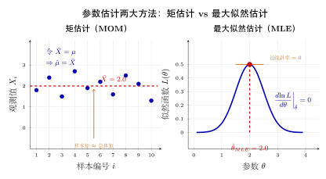
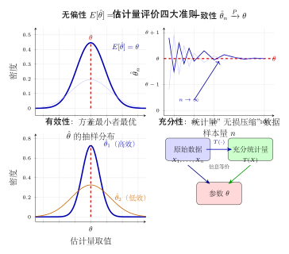
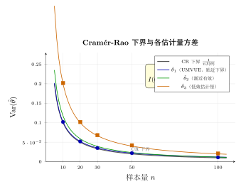

# 第 16 章 点估计 ⭐（融合版）

> **难度**：★★★★★
> **前置知识**：第 15 章抽样分布、大数定律、中心极限定理、微积分基础
> **本文件**：融合"原版严格推导 + 重写版高中模板 D 速记 / 套路 / 自测"。保留原版完整正文（学习目标 / 16.1–16.5 / 本章小结 / 深度学习应用 / 练习题）+ 在最前置 + 最后追加思维训练。

> **一例速记**：
> **矩估计**：令 $k$ 阶样本矩 = 总体矩，列方程组解参数；$\hat\mu = \bar X$，$\hat\sigma^2 = \frac{1}{n}\sum(X_i-\bar X)^2$（分母 $n$）。
> **MLE**：$\hat\theta_{MLE} = \arg\max L(\theta) = \arg\max \ell(\theta)$；对数似然求导令零，解似然方程；不变性：$g(\hat\theta_{MLE})$ 是 $g(\theta)$ 的 MLE。
> **四标准**：无偏（$E[\hat\theta]=\theta$）、有效（$\text{Var}$ 最小 / 达 CR 下界）、一致（$\hat\theta_n\xrightarrow{P}\theta$）、均方误差（MSE = 方差 + 偏差²）。
> **Cramér-Rao 下界**：$\text{Var}(\hat\theta) \geq \frac{1}{n\,I(\theta)}$，$I(\theta) = -E[\partial^2\log f/\partial\theta^2]$。
> **UMVUE**：方差达到 CR 下界的无偏估计量；正态均值的 UMVUE 是 $\bar X$，泊松 $\lambda$ 的 UMVUE 是 $\bar X$。
> **Rao-Blackwell**：将任意无偏估计以充分统计量取条件期望，MSE 不增——好估计量应为充分统计量的函数。

---

## 引入：一道反直觉题

> **题目**：设 $X_1, \ldots, X_n \overset{iid}{\sim} \mathcal{N}(\mu, \sigma^2)$，$\mu, \sigma^2$ 均未知。
>
> 对 $\sigma^2$ 的估计，MLE 给出 $\hat\sigma^2_{MLE} = \frac{1}{n}\sum_{i=1}^n (X_i - \bar X)^2$（分母 $n$）；
> 而样本方差 $S^2 = \frac{1}{n-1}\sum_{i=1}^n (X_i - \bar X)^2$（分母 $n-1$）是无偏估计。
>
> **问题**：哪个更"好"？

请先停下来想一想：MLE 是渐近有效估计量，理论上很优秀；但 $\hat\sigma^2_{MLE}$ 系统性低估了方差（$E[\hat\sigma^2_{MLE}] = \frac{n-1}{n}\sigma^2$）。用 $S^2$ 无偏，但 $S^2$ 的 MSE 反而比 $\hat\sigma^2_{MLE}$ 大！

正确答案：**没有绝对的"更好"**——取决于评价标准。

- 追求无偏：选 $S^2$；
- 追求最小 MSE：选 $\hat\sigma^2_{MLE}$（有偏但方差更小）；
- 大样本：两者渐近等价，MLE 渐近有效。

这道题揭示了点估计的核心张力：**无偏性 vs 有效性 vs MSE**，三者不可兼得时需要权衡。下面把解题者的内心独白完整还原。

---

## 思维路径还原（MLE 求解的内心独白）

> "看到 MLE 题，第一反应：写出似然函数 $L(\theta) = \prod f(x_i;\theta)$，立刻取对数变为求和——乘积变成 $\ell(\theta) = \sum \log f(x_i;\theta)$，计算量骤降。
>
> **第一步：写 $\ell(\theta)$**。分布告诉我 $f$ 的具体形式。正态：$\log f = -\frac{1}{2}\log(2\pi\sigma^2) - \frac{(x-\mu)^2}{2\sigma^2}$；指数：$\log f = \log\lambda - \lambda x$；泊松：$\log f = x\log\lambda - \lambda - \log(x!)$。套公式，求和即可。
>
> **第二步：对每个参数偏导令零**。'这是优化问题。' 把 $\partial\ell/\partial\theta_j = 0$ 列方程组。注意：若对 $\sigma^2$ 求导，令 $v = \sigma^2$ 会更顺手；若对 $\lambda$ 求导，先整理 $\sum x_i$ 出来。
>
> **第三步：检查是极大值点**。$\ell$ 对 $\theta$ 二阶导 $< 0$ 则确认。
>
> **第四步：警惕特殊情形**。均匀分布 $U(0,\theta)$ 的 $L(\theta)$ 在 $\theta = x_{(n)}$ 处不可微——MLE 在边界取得，微分法失效，要用代数分析（看 $\ell$ 单调性）。指数分布的 MLE 与矩估计相同：$\hat\lambda = 1/\bar X$。
>
> **最后：用不变性**。'求 $g(\theta)$ 的 MLE，直接代入：$g(\hat\theta_{MLE})$，不要重新推导。'
>
> 完成后检查：估计量无偏吗？若有偏，MSE 能接受吗？大样本下 MLE 渐近有效，渐近方差等于 $[nI(\theta)]^{-1}$。"

---

## 学习目标

学完本章后，你将能够：

- 理解点估计的基本框架，区分总体参数、样本统计量与估计量的概念
- 掌握矩估计法的原理与步骤，能对常见分布建立矩方程并求解参数估计
- 理解最大似然估计（MLE）的直觉含义，能对离散与连续分布推导 MLE 解析解
- 运用无偏性、有效性（最小方差）与一致性三大标准评价估计量的优劣
- 理解 Cramér-Rao 下界与 Fisher 信息量的含义，判断估计量是否有效
- 理解 MLE 的渐近正态性，并将 MLE 与深度学习中的损失函数设计联系起来

---

## 16.1 点估计的基本概念

### 16.1.1 统计推断的任务

现实中，总体分布往往由若干**未知参数** $\theta$ 决定（可以是标量或向量）。例如：

- 正态总体 $\mathcal{N}(\mu, \sigma^2)$ 中，$\theta = (\mu, \sigma^2)$ 未知
- 伯努利总体 $\text{Bernoulli}(p)$ 中，$\theta = p$ 未知
- 泊松总体 $\text{Pois}(\lambda)$ 中，$\theta = \lambda$ 未知

**统计推断**的目标是：从观测到的样本数据 $X_1, X_2, \ldots, X_n$（假设独立同分布，i.i.d.）出发，对未知参数做出合理的判断。

**点估计**（Point Estimation）是最基本的推断形式：用样本构造一个数值作为未知参数的"最佳猜测"。

### 16.1.2 估计量与估计值

**定义**：设 $X_1, X_2, \ldots, X_n$ 是来自总体的样本，若统计量 $\hat{\theta} = g(X_1, X_2, \ldots, X_n)$ 用于估计未知参数 $\theta$，则称 $\hat{\theta}$ 为 $\theta$ 的**估计量**（estimator）。

将样本的观测值 $x_1, x_2, \ldots, x_n$ 代入，得到**估计值**（estimate）$\hat{\theta} = g(x_1, x_2, \ldots, x_n)$。

**关键区别**：

| 概念 | 性质 | 例子 |
|------|------|------|
| 参数 $\theta$ | 固定未知常数 | 总体均值 $\mu$ |
| 估计量 $\hat{\theta}$ | **随机变量**（样本的函数） | 样本均值 $\bar{X} = \frac{1}{n}\sum X_i$ |
| 估计值 $\hat{\theta}$ | **确定数值**（代入观测值后） | $\bar{x} = \frac{1}{n}\sum x_i = 3.2$ |

估计量是随机变量这一点至关重要——它决定了我们能谈论估计量的期望、方差等统计性质。

### 16.1.3 参数空间与充分统计量

**参数空间** $\Theta$：参数 $\theta$ 所有可能取值的集合。例如正态分布的 $\mu \in (-\infty, +\infty)$，$\sigma^2 \in (0, +\infty)$。

**充分统计量**（sufficient statistic）：若统计量 $T(\mathbf{X})$ 包含了样本关于参数 $\theta$ 的全部信息，即在给定 $T(\mathbf{X})$ 的条件下样本的分布不依赖于 $\theta$，则称 $T$ 为充分统计量。

**直觉**：充分统计量是样本的"无损压缩"——在估计 $\theta$ 时，没有必要保留超出 $T(\mathbf{X})$ 的信息。

**常见充分统计量**：

| 分布 | 参数 | 充分统计量 |
|------|------|-----------|
| $\mathcal{N}(\mu, \sigma^2)$ | $\mu$（$\sigma^2$ 已知） | $\bar{X} = \frac{1}{n}\sum X_i$ |
| $\mathcal{N}(\mu, \sigma^2)$ | $(\mu, \sigma^2)$ 均未知 | $\left(\sum X_i,\, \sum X_i^2\right)$ |
| $\text{Pois}(\lambda)$ | $\lambda$ | $\sum X_i$ |
| $\text{Bernoulli}(p)$ | $p$ | $\sum X_i$（成功次数） |

**Rao-Blackwell 定理**（定性理解）：基于充分统计量的估计量，其均方误差不劣于不基于充分统计量的估计量。因此好的估计量应当是充分统计量的函数。

---

## 16.2 矩估计法

### 16.2.1 矩估计的基本思想

**总体矩**（population moment）：$k$ 阶总体矩定义为

$$
\mu_k = E[X^k], \quad k = 1, 2, 3, \ldots
$$

它是参数 $\theta$ 的函数：$\mu_k = \mu_k(\theta)$。

**样本矩**（sample moment）：$k$ 阶样本矩定义为

$$
\hat{\mu}_k = \frac{1}{n} \sum_{i=1}^n X_i^k, \quad k = 1, 2, 3, \ldots
$$

**矩估计法**（Method of Moments, MoM）的核心思想：用**样本矩**替代对应的**总体矩**，建立方程组，求解参数的估计量。

由大数定律，$\hat{\mu}_k \xrightarrow{P} \mu_k(\theta)$，因此这种替代有坚实的理论基础。

### 16.2.2 矩估计的一般步骤

设总体分布含 $m$ 个未知参数 $\theta_1, \theta_2, \ldots, \theta_m$：

**第一步**：计算前 $m$ 阶总体矩，表示为参数的函数：

$$
\mu_k = E[X^k] = g_k(\theta_1, \ldots, \theta_m), \quad k = 1, 2, \ldots, m
$$

**第二步**：令总体矩等于样本矩，建立 $m$ 个方程组成的方程组：

$$
g_k(\theta_1, \ldots, \theta_m) = \hat{\mu}_k = \frac{1}{n}\sum_{i=1}^n X_i^k, \quad k = 1, 2, \ldots, m
$$

**第三步**：解方程组，得到 $\hat{\theta}_1, \hat{\theta}_2, \ldots, \hat{\theta}_m$ 即为矩估计量。

### 16.2.3 矩估计示例

**示例 1：正态分布 $\mathcal{N}(\mu, \sigma^2)$（两参数均未知）**

总体矩：
$$
\mu_1 = E[X] = \mu, \quad \mu_2 = E[X^2] = \text{Var}(X) + (E[X])^2 = \sigma^2 + \mu^2
$$

令 $\mu_1 = \hat{\mu}_1$，$\mu_2 = \hat{\mu}_2$：

$$
\begin{cases} \mu = \bar{X} \\ \sigma^2 + \mu^2 = \dfrac{1}{n}\displaystyle\sum_{i=1}^n X_i^2 \end{cases}
$$

解得矩估计量：

$$
\hat{\mu} = \bar{X}, \quad \hat{\sigma}^2 = \frac{1}{n}\sum_{i=1}^n X_i^2 - \bar{X}^2 = \frac{1}{n}\sum_{i=1}^n (X_i - \bar{X})^2
$$

注意：矩估计得到的方差估计量分母为 $n$，而非 $n-1$。

**示例 2：均匀分布 $U(a, b)$（两参数均未知）**

总体矩：
$$
\mu_1 = E[X] = \frac{a+b}{2}, \quad \mu_2 = E[X^2] = \frac{a^2 + ab + b^2}{3}
$$

也可利用方差 $\text{Var}(X) = \frac{(b-a)^2}{12}$，令 $\mu_1 = \bar{X}$，$\mu_2 - \mu_1^2 = \widehat{\text{Var}}(X)$：

$$
\frac{a+b}{2} = \bar{X}, \quad \frac{(b-a)^2}{12} = \frac{1}{n}\sum_{i=1}^n (X_i - \bar{X})^2
$$

设 $B^2 = \frac{1}{n}\sum_{i=1}^n (X_i - \bar{X})^2$，解得：

$$
\hat{a} = \bar{X} - \sqrt{3}\, B, \quad \hat{b} = \bar{X} + \sqrt{3}\, B
$$

**示例 3：指数分布 $\text{Exp}(\lambda)$（单参数）**

总体矩：$\mu_1 = E[X] = 1/\lambda$

令 $1/\lambda = \bar{X}$，解得：

$$
\hat{\lambda} = \frac{1}{\bar{X}}
$$

### 16.2.4 矩估计的优缺点

**优点**：
- 计算简单，不需要知道分布的具体形式（有时仅需前几阶矩存在）
- 当总体分布复杂或难以写出似然函数时，矩估计是便捷的替代方案

**缺点**：
- 一般**不是充分统计量的函数**，因此统计效率通常不是最优的
- 对于同一参数，不同阶次矩建立的方程组可能给出不同结果（矩估计**不唯一**）
- 在样本量较小时，估计精度可能较差

---

## 16.3 最大似然估计（MLE）

### 16.3.1 似然函数

设 $X_1, X_2, \ldots, X_n \overset{iid}{\sim} f(x;\theta)$（$f$ 为 pmf 或 pdf），观测值为 $x_1, x_2, \ldots, x_n$。

**似然函数**（likelihood function）定义为：

$$
L(\theta) = L(\theta; x_1, \ldots, x_n) = \prod_{i=1}^n f(x_i; \theta)
$$

**关键理解**：

- 当 $\theta$ 固定，$f(x;\theta)$ 是 $x$ 的概率密度（或质量）函数
- 当 $x_1, \ldots, x_n$ 固定（已观测），$L(\theta)$ 是 $\theta$ 的函数——它衡量"在参数为 $\theta$ 时，观测到这批数据的可能性有多大"

似然函数**不是**概率：$\int L(\theta)d\theta$ 一般不等于 1，它随 $\theta$ 变化，反映的是不同参数值下观测数据的"似然程度"。

**对数似然函数**（log-likelihood）：

$$
\ell(\theta) = \log L(\theta) = \sum_{i=1}^n \log f(x_i; \theta)
$$

由于 $\log$ 是单调递增函数，最大化 $L(\theta)$ 与最大化 $\ell(\theta)$ 等价。对数似然将乘积变为求和，大幅简化计算。

### 16.3.2 最大似然估计的定义

**定义**：使似然函数 $L(\theta)$ 达到最大值的参数值 $\hat{\theta}_{MLE}$ 称为 $\theta$ 的**最大似然估计量**（Maximum Likelihood Estimator, MLE）：

$$
\hat{\theta}_{MLE} = \arg\max_{\theta \in \Theta}\, L(\theta) = \arg\max_{\theta \in \Theta}\, \ell(\theta)
$$

**直觉**：MLE 选择使"当前观测数据最有可能出现"的参数值。换言之，它是对"什么样的参数最能解释我们看到的数据"这一问题的回答。

### 16.3.3 MLE 的求解方法

**方法一：微分法**（最常用）

若 $\ell(\theta)$ 关于 $\theta$ 可微，令似然方程（likelihood equation）为零：

$$
\frac{\partial \ell(\theta)}{\partial \theta_j} = 0, \quad j = 1, 2, \ldots, m
$$

解方程组，验证是极大值点（而非极小值或鞍点）。

**方法二：代数分析法**

当 $\ell(\theta)$ 是 $\theta$ 的单调函数时，MLE 在参数边界取得，不能用微分法，需直接分析。

**方法三：数值优化**

当似然方程无解析解时，使用梯度上升（gradient ascent）、EM 算法等数值方法。

### 16.3.4 经典 MLE 推导示例

**示例 1：伯努利分布 $\text{Bernoulli}(p)$**

设 $x_1, \ldots, x_n \in \{0, 1\}$，令 $k = \sum_{i=1}^n x_i$（成功次数）。

对数似然：
$$
\ell(p) = k \log p + (n-k)\log(1-p)
$$

对 $p$ 求导并令其为零：
$$
\frac{d\ell}{dp} = \frac{k}{p} - \frac{n-k}{1-p} = 0
$$

解得：
$$
\boxed{\hat{p}_{MLE} = \frac{k}{n} = \frac{\sum_{i=1}^n x_i}{n}}
$$

即 MLE 就是样本中成功的频率，与直觉完全一致。

**示例 2：正态分布 $\mathcal{N}(\mu, \sigma^2)$（均值和方差均未知）**

对数似然：
$$
\ell(\mu, \sigma^2) = -\frac{n}{2}\log(2\pi) - \frac{n}{2}\log\sigma^2 - \frac{1}{2\sigma^2}\sum_{i=1}^n (x_i - \mu)^2
$$

对 $\mu$ 求偏导：
$$
\frac{\partial \ell}{\partial \mu} = \frac{1}{\sigma^2}\sum_{i=1}^n (x_i - \mu) = 0 \implies \hat{\mu}_{MLE} = \bar{x}
$$

对 $\sigma^2$ 求偏导（令 $v = \sigma^2$）：
$$
\frac{\partial \ell}{\partial v} = -\frac{n}{2v} + \frac{1}{2v^2}\sum_{i=1}^n (x_i - \mu)^2 = 0
$$

代入 $\hat{\mu}_{MLE} = \bar{x}$，解得：

$$
\boxed{\hat{\mu}_{MLE} = \bar{x}, \quad \hat{\sigma}^2_{MLE} = \frac{1}{n}\sum_{i=1}^n (x_i - \bar{x})^2}
$$

注意 $\hat{\sigma}^2_{MLE}$ 分母为 $n$，不是无偏估计（详见 16.4 节）。

**示例 3：泊松分布 $\text{Pois}(\lambda)$**

对数似然：
$$
\ell(\lambda) = \sum_{i=1}^n x_i \cdot \log\lambda - n\lambda - \sum_{i=1}^n \log(x_i!)
$$

令 $\frac{d\ell}{d\lambda} = \frac{\sum x_i}{\lambda} - n = 0$，解得：

$$
\hat{\lambda}_{MLE} = \bar{x}
$$

**示例 4：均匀分布 $U(0, \theta)$（代数分析法）**

对数似然：$\ell(\theta) = -n\log\theta$（当 $\theta \geq \max_i x_i$ 时有效，否则 $L(\theta) = 0$）

$\ell(\theta) = -n\log\theta$ 关于 $\theta$ 单调递减，故在满足约束 $\theta \geq x_{(n)} = \max_i x_i$ 的前提下，$\ell(\theta)$ 在 $\theta = x_{(n)}$ 处取得最大值：

$$
\hat{\theta}_{MLE} = x_{(n)} = \max(x_1, x_2, \ldots, x_n)
$$

注意此时不能用微分法，因为 MLE 在参数的边界取得。

### 16.3.5 MLE 的不变性

**定理（MLE 不变性原理）**：若 $\hat{\theta}_{MLE}$ 是 $\theta$ 的 MLE，则对任意函数 $g(\theta)$，$g(\hat{\theta}_{MLE})$ 是 $g(\theta)$ 的 MLE。

**示例**：若 $\hat{\sigma}^2_{MLE} = \frac{1}{n}\sum(x_i - \bar{x})^2$，则标准差的 MLE 为 $\hat{\sigma}_{MLE} = \sqrt{\hat{\sigma}^2_{MLE}}$。

不变性使 MLE 极为方便——无需重新推导，直接对估计量做变换即可。

---

## 16.4 估计量的评价标准

有了矩估计和 MLE 两种构造估计量的方法，自然的问题是：**哪个估计量更好？** 本节介绍三大评价标准。

### 16.4.1 无偏性（Unbiasedness）

**定义**：若估计量 $\hat{\theta}$ 满足

$$
E[\hat{\theta}] = \theta \quad \text{对一切 } \theta \in \Theta
$$

则称 $\hat{\theta}$ 为 $\theta$ 的**无偏估计量**（unbiased estimator）。

**偏差**（bias）定义为：$\text{Bias}(\hat{\theta}) = E[\hat{\theta}] - \theta$。

**直觉**：无偏估计量在大量重复实验中"平均上"指向真实参数值，没有系统性偏差。

**重要结论**：

**1. 样本均值是总体均值的无偏估计**：

$$
E[\bar{X}] = E\!\left[\frac{1}{n}\sum_{i=1}^n X_i\right] = \frac{1}{n}\sum_{i=1}^n E[X_i] = \mu
$$

**2. 样本方差（分母 $n-1$）是总体方差的无偏估计**：

$$
S^2 = \frac{1}{n-1}\sum_{i=1}^n (X_i - \bar{X})^2 \implies E[S^2] = \sigma^2
$$

**为何分母是 $n-1$？** 用 $\bar{X}$ 替代未知的 $\mu$ 引入了一个约束，使残差 $(X_i - \bar{X})$ 只有 $n-1$ 个自由度。可以严格验证：

$$
E\!\left[\frac{1}{n}\sum_{i=1}^n (X_i - \bar{X})^2\right] = \frac{n-1}{n}\sigma^2 \neq \sigma^2
$$

故 MLE 方差估计量 $\hat{\sigma}^2_{MLE} = \frac{1}{n}\sum(X_i-\bar{X})^2$ 是**有偏的**，偏差为 $-\sigma^2/n$（低估了方差）。

**3. 无偏性的局限性**：无偏性只关注期望，忽视了方差。两个无偏估计量中，方差更小的通常更好。此外，无偏性不具备变换不变性：若 $\hat{\theta}$ 是 $\theta$ 的无偏估计，$g(\hat{\theta})$ 一般**不是** $g(\theta)$ 的无偏估计（例如 $S$ 不是 $\sigma$ 的无偏估计）。

### 16.4.2 有效性（Efficiency）与 Cramér-Rao 下界

在所有无偏估计量中，方差最小者最优。但方差能小到什么程度？Cramér-Rao 下界给出了理论极限。

**Fisher 信息量**（Fisher information）：

$$
I(\theta) = E\!\left[\left(\frac{\partial \log f(X;\theta)}{\partial \theta}\right)^2\right] = -E\!\left[\frac{\partial^2 \log f(X;\theta)}{\partial \theta^2}\right]
$$

$I(\theta)$ 度量了样本中关于参数 $\theta$ 所含信息的多少——$I(\theta)$ 越大，参数越"可估"。

**Cramér-Rao 下界定理**：对任意无偏估计量 $\hat{\theta}$，有

$$
\boxed{\text{Var}(\hat{\theta}) \geq \frac{1}{n\, I(\theta)}}
$$

其中 $n$ 为样本量。

**定义**：若某无偏估计量 $\hat{\theta}^*$ 的方差恰好等于 Cramér-Rao 下界，即

$$
\text{Var}(\hat{\theta}^*) = \frac{1}{n\, I(\theta)}
$$

则称 $\hat{\theta}^*$ 为 $\theta$ 的**有效估计量**（efficient estimator），也称为**一致最小方差无偏估计量**（UMVUE）。

**示例：正态总体的 Fisher 信息量**

设 $X \sim \mathcal{N}(\mu, \sigma^2)$（$\sigma^2$ 已知），估计 $\mu$：

$$
\log f(x;\mu) = -\frac{1}{2}\log(2\pi\sigma^2) - \frac{(x-\mu)^2}{2\sigma^2}
$$

$$
\frac{\partial \log f}{\partial \mu} = \frac{x - \mu}{\sigma^2}, \quad I(\mu) = E\!\left[\frac{(X-\mu)^2}{\sigma^4}\right] = \frac{\sigma^2}{\sigma^4} = \frac{1}{\sigma^2}
$$

C-R 下界：$\text{Var}(\hat{\mu}) \geq \frac{\sigma^2}{n}$

样本均值 $\bar{X}$ 的方差：$\text{Var}(\bar{X}) = \frac{\sigma^2}{n}$，恰好等于下界——$\bar{X}$ 是 $\mu$ 的有效估计量。

**相对效率**：若 $\hat{\theta}_1, \hat{\theta}_2$ 均为 $\theta$ 的无偏估计量，定义相对效率为

$$
e(\hat{\theta}_1, \hat{\theta}_2) = \frac{\text{Var}(\hat{\theta}_2)}{\text{Var}(\hat{\theta}_1)}
$$

若 $e > 1$，说明 $\hat{\theta}_1$ 比 $\hat{\theta}_2$ 更有效（方差更小）。

### 16.4.3 均方误差（MSE）

实践中常用**均方误差**（Mean Squared Error）综合考量偏差与方差：

$$
\text{MSE}(\hat{\theta}) = E\!\left[(\hat{\theta} - \theta)^2\right] = \text{Var}(\hat{\theta}) + \left[\text{Bias}(\hat{\theta})\right]^2
$$

**偏差-方差分解**：MSE = 方差 + 偏差的平方

- 无偏估计量：$\text{MSE} = \text{Var}(\hat{\theta})$
- 有偏估计量：若偏差小且方差也更小，MSE 可能反而优于无偏估计

**示例**：比较 $S^2 = \frac{1}{n-1}\sum(X_i-\bar{X})^2$（无偏）与 $\hat{\sigma}^2_{MLE} = \frac{1}{n}\sum(X_i-\bar{X})^2$（有偏）：

$$
\text{MSE}(S^2) = \text{Var}(S^2) = \frac{2\sigma^4}{n-1}
$$

$$
\text{MSE}(\hat{\sigma}^2_{MLE}) = \text{Var}(\hat{\sigma}^2_{MLE}) + \frac{\sigma^4}{n^2} = \frac{2(n-1)\sigma^4}{n^2} + \frac{\sigma^4}{n^2} = \frac{(2n-1)\sigma^4}{n^2}
$$

当 $n \geq 2$ 时，$\text{MSE}(\hat{\sigma}^2_{MLE}) < \text{MSE}(S^2)$（有偏的 MLE 估计 MSE 反而更小！）。

### 16.4.4 一致性（Consistency）

无偏性和有效性是针对**固定样本量** $n$ 的性质。一致性则关注当**样本量趋于无穷**时，估计量是否收敛于真实参数。

**定义（弱一致性）**：若对任意 $\varepsilon > 0$，

$$
\lim_{n \to \infty} P\!\left(|\hat{\theta}_n - \theta| > \varepsilon\right) = 0
$$

则称估计量序列 $\{\hat{\theta}_n\}$ 为 $\theta$ 的**（弱）一致估计量**（consistent estimator），记作 $\hat{\theta}_n \xrightarrow{P} \theta$。

**判断一致性的充分条件**：若

$$
\lim_{n\to\infty} E[\hat{\theta}_n] = \theta \quad \text{且} \quad \lim_{n\to\infty} \text{Var}(\hat{\theta}_n) = 0
$$

则 $\hat{\theta}_n$ 是一致估计量（由 Chebyshev 不等式可得）。

**重要结论**：

- 样本均值 $\bar{X}_n \xrightarrow{P} \mu$（大数定律）
- $S_n^2 \xrightarrow{P} \sigma^2$（方差的一致估计）
- MLE 在正则条件下是一致估计量（见 16.5 节）

**一致性 vs 无偏性的关系**：

| | 无偏 | 一致 |
|--|------|------|
| 固定 $n$ 下有意义 | 是 | 否 |
| $n\to\infty$ 下有保证 | 不一定趋向真值（方差可能不趋零） | 是 |
| 两者关系 | 互不蕴含 | 互不蕴含 |

一致性是比无偏性更基本的"大样本"要求：一个实用的估计量至少应当是一致的。

### 16.4.5 三大标准总结

| 标准 | 数学表达 | 关注点 | 适用场景 |
|------|----------|--------|----------|
| 无偏性 | $E[\hat\theta] = \theta$ | 期望无系统偏差 | 固定样本量 |
| 有效性 | $\text{Var}(\hat\theta) = \frac{1}{nI(\theta)}$ | 方差最小化 | 固定样本量，无偏前提 |
| 一致性 | $\hat\theta_n \xrightarrow{P} \theta$ | 大样本收敛 | 渐近分析 |

---

## 16.5 MLE 的渐近性质

### 16.5.1 MLE 的渐近正态性

在温和的正则条件下（似然函数光滑、支撑不依赖参数等），MLE 具有以下优良的渐近性质：

**定理（MLE 的渐近分布）**：设 $X_1, \ldots, X_n \overset{iid}{\sim} f(x;\theta_0)$，$\theta_0$ 为真实参数，则

$$
\boxed{\sqrt{n}\left(\hat{\theta}_{MLE} - \theta_0\right) \xrightarrow{d} \mathcal{N}\!\left(0,\; \frac{1}{I(\theta_0)}\right)}
$$

等价地，对充分大的 $n$：

$$
\hat{\theta}_{MLE} \approx \mathcal{N}\!\left(\theta_0,\; \frac{1}{n\, I(\theta_0)}\right)
$$

这个定理有三层含义：

1. **一致性**：$\hat{\theta}_{MLE} \xrightarrow{P} \theta_0$（方差趋于 0）
2. **渐近无偏性**：$E[\hat{\theta}_{MLE}] \to \theta_0$
3. **渐近有效性**：渐近方差 $\frac{1}{nI(\theta_0)}$ 恰好等于 C-R 下界，即 MLE 在大样本下达到有效估计量的理论极限

**实践意义**：渐近正态性为构造 MLE 的置信区间提供了基础：

$$
\hat{\theta}_{MLE} \pm z_{\alpha/2} \cdot \sqrt{\frac{1}{n\, I(\hat{\theta}_{MLE})}}
$$

### 16.5.2 多参数情形

设参数向量 $\boldsymbol{\theta} = (\theta_1, \ldots, \theta_m)$，**Fisher 信息矩阵**为：

$$
\mathbf{I}(\boldsymbol{\theta}) = -E\!\left[\frac{\partial^2 \log f(X;\boldsymbol{\theta})}{\partial \boldsymbol{\theta}\, \partial \boldsymbol{\theta}^\top}\right]
$$

其中 $(j,k)$ 元素为 $-E\!\left[\frac{\partial^2 \log f}{\partial \theta_j \partial \theta_k}\right]$。

**渐近分布**：

$$
\sqrt{n}\left(\hat{\boldsymbol{\theta}}_{MLE} - \boldsymbol{\theta}_0\right) \xrightarrow{d} \mathcal{N}\!\left(\mathbf{0},\; \mathbf{I}(\boldsymbol{\theta}_0)^{-1}\right)
$$

C-R 下界的多参数推广：无偏估计量的协方差矩阵满足 $\text{Cov}(\hat{\boldsymbol{\theta}}) \succeq \frac{1}{n}\mathbf{I}(\boldsymbol{\theta})^{-1}$（正半定序意义下）。

### 16.5.3 Delta 方法：函数变换的渐近分布

**定理（Delta 方法）**：若 $\sqrt{n}(\hat{\theta}_n - \theta) \xrightarrow{d} \mathcal{N}(0, \sigma^2)$，且 $g$ 在 $\theta$ 处可微且 $g'(\theta) \neq 0$，则

$$
\sqrt{n}\left(g(\hat{\theta}_n) - g(\theta)\right) \xrightarrow{d} \mathcal{N}\!\left(0,\; [g'(\theta)]^2 \sigma^2\right)
$$

**示例**：$X_1, \ldots, X_n \overset{iid}{\sim} \text{Bernoulli}(p)$，$\hat{p}_{MLE} = \bar{X}$，求 $\log\!\left(\frac{\hat{p}}{1-\hat{p}}\right)$（对数几率）的渐近分布。

令 $g(p) = \log\frac{p}{1-p}$，则 $g'(p) = \frac{1}{p(1-p)}$。

由于 $I(p) = \frac{1}{p(1-p)}$，MLE 的渐近方差为 $\frac{p(1-p)}{n}$，故：

$$
\sqrt{n}\left(\log\frac{\hat{p}}{1-\hat{p}} - \log\frac{p}{1-p}\right) \xrightarrow{d} \mathcal{N}\!\left(0,\; \frac{1}{p^2(1-p)^2} \cdot p(1-p)\right) = \mathcal{N}\!\left(0,\; \frac{1}{p(1-p)}\right)
$$

### 16.5.4 MLE 的正则条件

为使上述渐近结果成立，通常需要：

1. **模型可识别性**：不同参数给出不同的分布
2. **支撑不依赖参数**：$f(x;\theta) > 0$ 的区域不随 $\theta$ 变化（均匀分布 $U(0,\theta)$ 不满足此条件）
3. **三阶可微**：对数似然关于 $\theta$ 三阶可微
4. **参数在内点**：真实参数 $\theta_0$ 在参数空间的内部（非边界）
5. **Fisher 信息量有限且正**：$0 < I(\theta) < \infty$

当这些条件不满足时（如均匀分布 MLE），需要单独分析估计量的分布。

---

## 几何示意

### 图 16-1：矩估计 vs MLE 几何示意



似然函数 $L(\theta)$ 是关于参数 $\theta$ 的函数曲线。MLE 在曲线极大值点处取得（红色标注），矩估计则由样本矩方程解出，两者通常不同——正态分布是个罕见的"巧合"（均给出 $\bar X$）。

### 图 16-2：估计量评价四象限



四个评价维度并非相互排斥：一个估计量可以同时是无偏且一致的（$\bar X$ 估计 $\mu$），也可以是有偏但一致的（$\hat\sigma^2_{MLE}$），关键是在具体问题中权衡取舍。

### 图 16-3：Cramér-Rao 下界示意



CR 下界 $1/[nI(\theta)]$ 随样本量增大而降低（虚线）。实线为某估计量的实际方差曲线：若实线恰好触及虚线，该估计量是有效估计量（UMVUE）；若实线始终在虚线上方，则说明尚有改进空间。

---

## 抽象成方法（套路总结）

### 5 大核心公式速查

| 名称 | 公式 | 备注 |
|------|------|------|
| 矩估计 | $E[X^k] = \frac{1}{n}\sum X_i^k$，解 $\theta$ | 分母 $n$，不唯一 |
| 似然函数 | $L(\theta) = \prod f(x_i;\theta)$ | 观测固定，$\theta$ 变化 |
| 对数似然 | $\ell(\theta) = \sum \log f(x_i;\theta)$ | 乘积变求和 |
| Fisher 信息 | $I(\theta) = -E[\partial^2\log f / \partial\theta^2]$ | 度量"可估"程度 |
| CR 下界 | $\text{Var}(\hat\theta) \geq \frac{1}{nI(\theta)}$ | 无偏估计量的方差下限 |

### MLE 求解 4 步流程

```
第 1 步：写对数似然 ℓ(θ) = Σ log f(xᵢ; θ)
第 2 步：对每个参数偏导令零 ∂ℓ/∂θⱼ = 0
第 3 步：解方程组，验证二阶导 < 0（极大）
第 4 步：特殊情形检查（支撑依赖参数 → 代数分析法）
```

### 评价 4 标准对照

| 标准 | 含义 | 判断方法 | 注意事项 |
|------|------|----------|----------|
| 无偏性 | $E[\hat\theta]=\theta$ | 直接计算期望 | 不具变换不变性 |
| 有效性 | 方差达 CR 下界 | 算 $I(\theta)$ 再比较 | 仅限无偏估计量 |
| 一致性 | $\hat\theta_n\xrightarrow{P}\theta$ | 期望→真值且方差→0 | 大样本性质 |
| MSE | 方差 + 偏差² | 综合权衡 | 有偏估计可能 MSE 更小 |

---

## 方法变形

### 变形 1：似然方程多解

当 $\partial\ell/\partial\theta = 0$ 有多个根时，逐一代入 $L(\theta)$ 比较大小，取使 $L$ 最大者为 MLE。例：混合分布的似然函数可能有多个局部极大值，需要全局比较。

### 变形 2：边界 MLE（支撑依赖参数）

均匀分布 $U(0,\theta)$、$U(\theta, \theta+1)$ 等分布的支撑随 $\theta$ 变化，MLE 在参数边界取得，**绝不可用微分法**。步骤：写出 $L(\theta)$ 的有效域，分析 $L$ 的单调性，在约束边界取 MLE。

### 变形 3：含约束的 MLE

若参数满足约束（如 $\theta_1 + \theta_2 = 1$），用拉格朗日乘数法：

$$
\max_\theta \ell(\theta) \quad \text{s.t.} \quad h(\theta) = 0
$$

引入乘数 $\lambda$，解增广方程组 $\nabla\ell = \lambda\nabla h$。

### 变形 4：EM 算法（含隐变量的 MLE）

当观测数据不完整（存在隐变量 $Z$）时，直接最大化 $\ell(\theta)$ 困难。EM 算法交替执行：

- **E 步**：计算完整数据对数似然的期望 $Q(\theta \mid \theta^{(t)}) = E_Z[\log L(\theta; X, Z) \mid X, \theta^{(t)}]$
- **M 步**：最大化 $Q(\theta \mid \theta^{(t)})$ 得到 $\theta^{(t+1)}$

每次迭代保证观测数据似然不减，收敛到局部极大值。常见应用：高斯混合模型（GMM）、隐马尔可夫模型。

---

## 本章小结

**点估计的两大方法**：

| 方法 | 原理 | 优点 | 缺点 |
|------|------|------|------|
| 矩估计 | 样本矩 = 总体矩 | 简单，无需完整分布 | 效率一般不最优 |
| MLE | 最大化似然函数 | 渐近有效，不变性，大样本理论完备 | 需要完整分布，计算可能复杂 |

**估计量的三大评价维度**：

1. **无偏性**：$E[\hat{\theta}] = \theta$——无系统偏差
2. **有效性**：$\text{Var}(\hat{\theta}) = \frac{1}{nI(\theta)}$——方差达到 C-R 下界
3. **一致性**：$\hat{\theta}_n \xrightarrow{P} \theta$——大样本收敛

**MLE 的核心优势**（大样本下）：

$$
\hat{\theta}_{MLE} \approx \mathcal{N}\!\left(\theta_0,\; \frac{1}{n I(\theta_0)}\right)
$$

- 渐近无偏：均值趋近真实值
- 渐近有效：方差达到理论下界
- 渐近正态：便于构造置信区间
- 不变性：函数变换后仍是 MLE

**实用法则**：

$$
\text{构造估计量} \to \text{检验无偏性} \to \text{检验一致性} \to \text{计算 MSE} \to \text{比较效率}
$$

---

## 思考路标（条件反射）

1. 看到"求 MLE" → 先写对数似然 $\ell(\theta) = \sum\log f(x_i;\theta)$，乘积变求和是关键
2. 看到"均匀分布 $U(0,\theta)$ 的 MLE" → 立刻想边界：$\hat\theta = x_{(n)}$，不要用微分法
3. 看到"MLE 是否无偏" → 算 $E[\hat\theta_{MLE}]$；指数/泊松/正态均值的 MLE 无偏，正态方差 MLE 有偏
4. 看到"分母 $n$ vs $n-1$" → $n$ 是 MLE / 矩估计（有偏），$n-1$ 是样本方差 $S^2$（无偏）
5. 看到"Fisher 信息量" → 两个公式等价：$E[(\partial\log f/\partial\theta)^2]$ 或 $-E[\partial^2\log f/\partial\theta^2]$
6. 看到"CR 下界" → 公式 $1/[nI(\theta)]$；达到下界 = 有效估计量 = UMVUE（在无偏类中）
7. 看到"MLE 渐近分布" → $\sqrt n(\hat\theta_{MLE}-\theta_0)\xrightarrow d N(0, 1/I(\theta_0))$
8. 看到"函数 $g(\theta)$ 的 MLE" → 不变性直接给出 $g(\hat\theta_{MLE})$，无需重推
9. 看到"Rao-Blackwell" → 充分统计量取条件期望，MSE 不增；好估计 = 充分统计量的函数
10. 看到"Delta 方法" → $\text{Var}(g(\hat\theta)) \approx [g'(\theta)]^2 \text{Var}(\hat\theta)$；对 MLE 可直接得渐近方差

---

## 易错点

1. **MLE 不一定无偏**：MLE 是大样本意义下的优良估计，但小样本下可能有偏。典型例：$\hat\sigma^2_{MLE} = \frac{1}{n}\sum(X_i-\bar X)^2$ 系统低估 $\sigma^2$，偏差为 $-\sigma^2/n$。不能因为"MLE 很好"就断言它无偏。

2. **$\hat\sigma^2_{MLE}$ 与 $S^2$ 的混淆**：两者都是 $\sigma^2$ 的估计，分母分别为 $n$ 和 $n-1$。前者有偏但 MSE 更小，后者无偏。考题常考"哪个是无偏估计"——答案是 $S^2$（$n-1$）。

3. **似然不是概率**：$L(\theta) = \prod f(x_i;\theta)$ 对 $\theta$ 的积分不等于 1。似然是固定观测值后参数的函数，衡量"该参数下观测到这批数据的可能性"，不要与概率混淆。

4. **CR 下界达不到时怎么办**：并非所有分布都存在有效估计量（即达到 CR 下界的无偏估计量）。若下界达不到，只能说"在无偏估计中找 MSE 最小者"（UMVUE）——UMVUE 不一定恰好等于 CR 下界。此时 Rao-Blackwell 定理是构造 UMVUE 的重要工具。

5. **均匀分布 MLE 的特殊性**：$U(0,\theta)$ 的 MLE $\hat\theta = X_{(n)}$ 有偏（$E[X_{(n)}] = n\theta/(n+1) < \theta$），且不满足 MLE 的正则条件（支撑依赖参数），因此渐近正态性不成立，需单独分析其分布（用次序统计量的分布）。

---

## 典型应用例题

### 例 1：正态分布 MLE 全流程

> **题目**：设 $X_1,\ldots,X_n \overset{iid}{\sim} \mathcal{N}(\mu,\sigma^2)$，$\mu,\sigma^2$ 均未知。求 $(\mu,\sigma^2)$ 的 MLE，并判断各估计量的无偏性。

**思路**：两参数联合 MLE，分别对 $\mu$ 和 $\sigma^2$（令 $v=\sigma^2$）偏导令零。

**解**：

对数似然：
$$
\ell(\mu,v) = -\frac{n}{2}\log(2\pi) - \frac{n}{2}\log v - \frac{1}{2v}\sum_{i=1}^n(x_i-\mu)^2
$$

$\partial\ell/\partial\mu = 0$ 给出 $\hat\mu_{MLE} = \bar x$。

$\partial\ell/\partial v = -\frac{n}{2v}+\frac{1}{2v^2}\sum(x_i-\bar x)^2 = 0$ 给出：

$$
\hat\sigma^2_{MLE} = \frac{1}{n}\sum_{i=1}^n(x_i-\bar x)^2
$$

**无偏性检验**：

- $E[\hat\mu_{MLE}] = E[\bar X] = \mu$（无偏）
- $E[\hat\sigma^2_{MLE}] = \frac{n-1}{n}\sigma^2 \neq \sigma^2$（有偏，低估）

**答**：$\hat\mu_{MLE} = \bar X$ 无偏；$\hat\sigma^2_{MLE} = \frac{1}{n}\sum(X_i-\bar X)^2$ 有偏，无偏修正为 $S^2 = \frac{1}{n-1}\sum(X_i-\bar X)^2$。

---

### 例 2：指数分布 MLE + 有效性验证

> **题目**：设 $X_1,\ldots,X_n \overset{iid}{\sim} \text{Exp}(\lambda)$，$\lambda>0$。
> (1) 求 $\lambda$ 的 MLE；
> (2) 计算 Fisher 信息量 $I(\lambda)$ 并验证 MLE 是否有效。

**解**：

**(1) MLE**

$\log f(x;\lambda) = \log\lambda - \lambda x$（$x>0$）。对数似然：

$$
\ell(\lambda) = n\log\lambda - \lambda\sum_{i=1}^n x_i
$$

$d\ell/d\lambda = n/\lambda - \sum x_i = 0$ 解得 $\hat\lambda_{MLE} = 1/\bar x$。

**(2) Fisher 信息量**

$$
\frac{\partial^2\log f}{\partial\lambda^2} = -\frac{1}{\lambda^2}, \quad I(\lambda) = -E\!\left[-\frac{1}{\lambda^2}\right] = \frac{1}{\lambda^2}
$$

CR 下界：$\text{Var}(\hat\lambda) \geq \frac{1}{n/\lambda^2} = \frac{\lambda^2}{n}$。

$\hat\lambda_{MLE} = 1/\bar X$ 的方差：由 Delta 方法，$g(\bar X) = 1/\bar X$，$g'(\mu) = -1/\mu^2$（$\mu = 1/\lambda$）：

$$
\text{Var}(\hat\lambda_{MLE}) \approx [g'(\mu)]^2 \cdot \frac{\text{Var}(X)}{n} = \frac{1}{\mu^4}\cdot\frac{1/\lambda^2}{n} = \frac{\lambda^2}{n}
$$

渐近方差 = CR 下界，因此 $\hat\lambda_{MLE}$ 是**渐近有效**估计量。

---

### 例 3：Bernoulli MLE vs UMVUE 对比

> **题目**：设 $X_1,\ldots,X_n \overset{iid}{\sim} \text{Bernoulli}(p)$，$p\in(0,1)$。
> (1) 求 $p$ 的 MLE；
> (2) 求 $p(1-p)$（方差）的 MLE（用不变性）；
> (3) 验证 $\hat p = \bar X$ 是 $p$ 的 UMVUE；
> (4) 直接估计量 $T_n = X_1(1-X_2)$ 是 $p(1-p)$ 的无偏估计，但非 UMVUE，为什么？

**解**：

**(1)** 对数似然 $\ell(p) = k\log p + (n-k)\log(1-p)$（$k=\sum x_i$），解得 $\hat p_{MLE} = \bar X$。

**(2)** 由不变性：$\widehat{p(1-p)}_{MLE} = \bar X(1-\bar X)$。

**(3)** 充分统计量为 $T = \sum X_i$。$\bar X = T/n$ 是 $T$ 的函数，无偏（$E[\bar X]=p$），且 Fisher 信息量 $I(p) = 1/[p(1-p)]$，$\text{Var}(\bar X) = p(1-p)/n$ 恰好等于 CR 下界 $1/[nI(p)] = p(1-p)/n$——$\bar X$ 是有效估计量，即 UMVUE。

**(4)** $T_n = X_1(1-X_2)$，$E[T_n] = p(1-p)$（无偏），但 $T_n$ 不是充分统计量 $\sum X_i$ 的函数（它只用了两个观测值），浪费了其余 $n-2$ 个样本的信息。由 Rao-Blackwell 定理，$\hat T = E[T_n \mid \sum X_i]$ 是更优无偏估计，方差更小；对充分统计量取条件期望才能构造 UMVUE。

---

## 深度学习应用：MLE 与损失函数设计、交叉熵的由来

### 16.A.1 深度学习中的参数估计视角

训练神经网络的本质，是在给定数据集 $\mathcal{D} = \{(x_i, y_i)\}_{i=1}^n$ 的条件下，寻找使模型"最好地解释数据"的参数 $\boldsymbol{\theta}$。这正是**最大似然估计**的核心思想。

设模型输出的条件概率分布为 $p_{\boldsymbol{\theta}}(y \mid x)$，在独立同分布假设下，对数似然为：

$$
\ell(\boldsymbol{\theta}) = \sum_{i=1}^n \log p_{\boldsymbol{\theta}}(y_i \mid x_i)
$$

**最大化对数似然 = 最小化负对数似然（NLL）**：

$$
\hat{\boldsymbol{\theta}}_{MLE} = \arg\max_{\boldsymbol{\theta}} \ell(\boldsymbol{\theta}) = \arg\min_{\boldsymbol{\theta}} \left[-\sum_{i=1}^n \log p_{\boldsymbol{\theta}}(y_i \mid x_i)\right]
$$

不同的分布假设导致不同的损失函数，这揭示了深度学习中各类损失函数的**统计起源**。

### 16.A.2 分类问题：交叉熵损失的由来

**模型假设**：$K$ 类分类问题，给定输入 $x$，模型输出类别概率向量：

$$
p_{\boldsymbol{\theta}}(y = k \mid x) = \text{softmax}(\mathbf{z})_k = \frac{e^{z_k}}{\sum_{j=1}^K e^{z_j}}, \quad k = 1, \ldots, K
$$

其中 $\mathbf{z} = f_{\boldsymbol{\theta}}(x)$ 为网络输出的 logit 向量。

**MLE 目标**：对每个样本 $(x_i, y_i)$（$y_i$ 为真实类别标签），最大化：

$$
\log p_{\boldsymbol{\theta}}(y_i \mid x_i) = \log \text{softmax}(f_{\boldsymbol{\theta}}(x_i))_{y_i} = z_{y_i} - \log\sum_{j=1}^K e^{z_j}
$$

最小化负对数似然，即：

$$
\mathcal{L}_{CE}(\boldsymbol{\theta}) = -\frac{1}{n}\sum_{i=1}^n \log p_{\boldsymbol{\theta}}(y_i \mid x_i)
$$

若将真实标签表示为 one-hot 向量 $\mathbf{q}_i$（第 $y_i$ 个分量为 1，其余为 0），则：

$$
\mathcal{L}_{CE} = -\frac{1}{n}\sum_{i=1}^n \sum_{k=1}^K q_{ik} \log p_{\boldsymbol{\theta}}(y=k \mid x_i) = \frac{1}{n}\sum_{i=1}^n H(\mathbf{q}_i, \mathbf{p}_{\boldsymbol{\theta}}(x_i))
$$

这正是**交叉熵**（cross-entropy）的定义！

**交叉熵与 KL 散度的关系**：

$$
H(q, p) = H(q) + D_{KL}(q \| p)
$$

由于真实分布 $q$ 固定，最小化交叉熵等价于最小化 KL 散度，即让预测分布 $p_{\boldsymbol{\theta}}$ 尽可能接近真实分布 $q$。

### 16.A.3 回归问题：MSE 损失的由来

**模型假设**：输出 $y$ 在给定 $x$ 时服从以模型预测为均值的正态分布：

$$
y \mid x \sim \mathcal{N}\!\left(f_{\boldsymbol{\theta}}(x),\, \sigma^2\right)
$$

**MLE 目标**：最大化

$$
\ell(\boldsymbol{\theta}) = -\frac{n}{2}\log(2\pi\sigma^2) - \frac{1}{2\sigma^2}\sum_{i=1}^n \left(y_i - f_{\boldsymbol{\theta}}(x_i)\right)^2
$$

去掉与 $\boldsymbol{\theta}$ 无关的常数，最大化 $\ell$ 等价于最小化：

$$
\mathcal{L}_{MSE}(\boldsymbol{\theta}) = \frac{1}{n}\sum_{i=1}^n \left(y_i - f_{\boldsymbol{\theta}}(x_i)\right)^2
$$

这正是**均方误差（MSE）损失**！**结论**：MSE 损失 = 高斯噪声假设下的 MLE。

### 16.A.4 二分类问题：二元交叉熵的由来

**模型假设**：二分类问题，$y \in \{0, 1\}$，模型输出 $p_{\boldsymbol{\theta}}(y=1 \mid x) = \sigma(f_{\boldsymbol{\theta}}(x))$（$\sigma$ 为 sigmoid 函数）。

即 $y \mid x \sim \text{Bernoulli}(\sigma(f_{\boldsymbol{\theta}}(x)))$。

**MLE 目标**：最小化

$$
\mathcal{L}_{BCE} = -\frac{1}{n}\sum_{i=1}^n \left[y_i \log p_i + (1-y_i)\log(1-p_i)\right]
$$

其中 $p_i = \sigma(f_{\boldsymbol{\theta}}(x_i))$。这是**二元交叉熵损失**（Binary Cross-Entropy）。

### 16.A.5 损失函数的统一 MLE 视角

| 任务 | 分布假设 | MLE 等价损失 | PyTorch 函数 |
|------|----------|--------------|--------------|
| 回归 | $y \sim \mathcal{N}(f_\theta(x), \sigma^2)$ | MSE | `nn.MSELoss()` |
| 二分类 | $y \sim \text{Bernoulli}(\sigma(f_\theta(x)))$ | 二元交叉熵 | `nn.BCEWithLogitsLoss()` |
| 多分类 | $y \sim \text{Categorical}(\text{softmax}(f_\theta(x)))$ | 交叉熵 | `nn.CrossEntropyLoss()` |
| 计数回归 | $y \sim \text{Pois}(e^{f_\theta(x)})$ | 泊松 NLL | `nn.PoissonNLLLoss()` |

### 16.A.6 PyTorch 代码：MLE 视角实现各类损失

```python
import torch
import torch.nn as nn
import torch.nn.functional as F


# ============================================================
# 1. 多分类交叉熵：Categorical 分布的 MLE
# ============================================================

def cross_entropy_from_mle(logits, targets):
    """
    MLE 视角推导多分类交叉熵损失
    logits: (batch_size, num_classes)  模型输出（未经 softmax）
    targets: (batch_size,)              真实类别标签

    等价于 nn.CrossEntropyLoss()，即 -log p(y_i | x_i)
    """
    # 方法1：手动实现（直接展示 MLE 推导过程）
    log_probs = F.log_softmax(logits, dim=-1)          # log p_theta(k | x)
    nll = -log_probs[range(len(targets)), targets]     # -log p_theta(y_i | x_i)
    return nll.mean()

    # 方法2：等价的 PyTorch 内置函数
    # return nn.CrossEntropyLoss()(logits, targets)


# ============================================================
# 2. 二元交叉熵：Bernoulli 分布的 MLE
# ============================================================

def binary_cross_entropy_from_mle(logits, targets):
    """
    MLE 视角推导二元交叉熵损失
    logits: (batch_size,)   模型输出 z（未经 sigmoid）
    targets: (batch_size,)  真实标签，0 或 1

    p = sigmoid(z) = 1 / (1 + exp(-z))
    loss = -[y * log(p) + (1-y) * log(1-p)]
         = -[y * log(sigmoid(z)) + (1-y) * log(1-sigmoid(z))]
    """
    # 使用数值稳定版本
    return F.binary_cross_entropy_with_logits(logits, targets.float())


# ============================================================
# 3. MSE 损失：高斯分布的 MLE
# ============================================================

def mse_from_mle(predictions, targets):
    """
    MLE 视角推导 MSE 损失
    假设: y | x ~ N(f_theta(x), sigma^2)
    对数似然: -n/2 * log(2*pi*sigma^2) - 1/(2*sigma^2) * sum((y_i - f(x_i))^2)
    最大化对数似然 等价于 最小化 MSE
    """
    return F.mse_loss(predictions, targets)


# ============================================================
# 4. 完整示例：比较不同损失函数与分布假设的对应关系
# ============================================================

class MLEClassifier(nn.Module):
    """多分类器：Categorical 分布 MLE = 交叉熵损失"""
    def __init__(self, input_dim, num_classes):
        super().__init__()
        self.fc = nn.Linear(input_dim, num_classes)

    def forward(self, x):
        return self.fc(x)    # 返回 logits（未经 softmax）


class MLERegressor(nn.Module):
    """回归器：高斯分布 MLE = MSE 损失"""
    def __init__(self, input_dim):
        super().__init__()
        self.fc = nn.Linear(input_dim, 1)

    def forward(self, x):
        return self.fc(x).squeeze(-1)


def demonstrate_mle_losses():
    """演示 MLE 与损失函数的对应关系"""
    torch.manual_seed(42)
    batch_size, input_dim, num_classes = 32, 16, 5

    # 多分类：MLE = 交叉熵
    classifier = MLEClassifier(input_dim, num_classes)
    x = torch.randn(batch_size, input_dim)
    y_class = torch.randint(0, num_classes, (batch_size,))

    logits = classifier(x)
    ce_loss = nn.CrossEntropyLoss()(logits, y_class)

    # 手动计算 NLL，验证等价性
    log_probs = F.log_softmax(logits, dim=-1)
    nll_manual = -log_probs[range(batch_size), y_class].mean()

    print(f"交叉熵损失 (nn.CrossEntropyLoss):  {ce_loss.item():.6f}")
    print(f"手动 NLL (MLE 推导):               {nll_manual.item():.6f}")
    print(f"差值: {abs(ce_loss.item() - nll_manual.item()):.2e}  (应接近 0)")
    print()

    # 回归：MLE = MSE
    regressor = MLERegressor(input_dim)
    y_reg = torch.randn(batch_size)
    preds = regressor(x)

    mse_loss = nn.MSELoss()(preds, y_reg)
    # 手动计算（高斯 NLL，去掉常数项）
    mse_manual = ((preds - y_reg) ** 2).mean()

    print(f"MSE 损失 (nn.MSELoss):  {mse_loss.item():.6f}")
    print(f"手动 MSE (高斯 MLE):    {mse_manual.item():.6f}")


# ============================================================
# 5. Fisher 信息量可视化（伯努利参数估计）
# ============================================================

def fisher_information_bernoulli(p_values):
    """
    伯努利分布的 Fisher 信息量: I(p) = 1 / (p * (1 - p))
    当 p=0.5 时最小（参数最难估计），p 接近 0 或 1 时最大
    """
    return 1.0 / (p_values * (1.0 - p_values))


def cramer_rao_bound_demo():
    """展示 C-R 下界与 MLE 方差的关系"""
    import numpy as np

    p_true = 0.3   # 真实参数
    n_samples = 1000
    n_experiments = 10000

    # 模拟 MLE 估计量的分布
    mle_estimates = []
    for _ in range(n_experiments):
        samples = np.random.binomial(1, p_true, n_samples)
        mle_estimates.append(samples.mean())   # hat_p_MLE = 样本均值

    mle_var = np.var(mle_estimates)
    cr_bound = p_true * (1 - p_true) / n_samples   # C-R 下界 = 1 / (n * I(p))

    print(f"真实参数 p = {p_true}")
    print(f"MLE 方差 (模拟):       {mle_var:.6f}")
    print(f"C-R 下界 p(1-p)/n:    {cr_bound:.6f}")
    print(f"比值 (应接近 1.0):     {mle_var / cr_bound:.4f}")
    print("结论: MLE 方差 ≈ C-R 下界，MLE 是渐近有效估计量")


# 运行演示
if __name__ == "__main__":
    demonstrate_mle_losses()
    print("---")
    cramer_rao_bound_demo()
```

### 16.A.7 深度理解：为什么 MLE 是合理的训练目标

从信息论的视角，最小化交叉熵等价于最小化经验数据分布 $\hat{q}$ 与模型分布 $p_{\boldsymbol{\theta}}$ 之间的 KL 散度：

$$
\hat{\boldsymbol{\theta}}_{MLE} = \arg\min_{\boldsymbol{\theta}} D_{KL}\!\left(\hat{q}(x,y) \,\|\, p_{\boldsymbol{\theta}}(x,y)\right)
$$

其中经验分布 $\hat{q}(x,y) = \frac{1}{n}\sum_{i=1}^n \delta_{(x_i, y_i)}$。

**三个等价视角**：

$$
\underbrace{\text{最大化对数似然}}_{\text{统计学}} \equiv \underbrace{\text{最小化 NLL 损失}}_{\text{深度学习}} \equiv \underbrace{\text{最小化 KL 散度}}_{\text{信息论}}
$$

这种统一性解释了为什么 MLE/交叉熵在深度学习中如此普遍——它有坚实的理论基础，且在大样本下保证渐近有效。

---

## 练习题

**练习 16.1**（矩估计）

设 $X_1, \ldots, X_n \overset{iid}{\sim} \text{Gamma}(\alpha, \lambda)$，其中 $\alpha > 0$ 为形状参数，$\lambda > 0$ 为速率参数，分布的均值和方差分别为 $E[X] = \alpha/\lambda$，$\text{Var}(X) = \alpha/\lambda^2$。

(1) 用矩估计法求 $\alpha$ 和 $\lambda$ 的矩估计量；

(2) 验证所得估计量是否为参数的函数，以样本均值 $\bar{X}$ 和样本方差 $S^2 = \frac{1}{n}\sum(X_i - \bar{X})^2$ 表示结果；

(3) 比较 $\hat{\lambda}$ 与指数分布（$\alpha = 1$）情形下的矩估计。

<details>
<summary>点击展开 练习 16.1 答案</summary>

**(1) 矩估计量**

令总体矩等于样本矩，建立方程组：

$$
\begin{cases} E[X] = \alpha/\lambda = \bar{X} \\ \text{Var}(X) = \alpha/\lambda^2 = \frac{1}{n}\sum(X_i - \bar{X})^2 = B^2 \end{cases}
$$

其中记 $B^2 = \frac{1}{n}\sum(X_i-\bar{X})^2$（样本方差，分母 $n$）。

**(2) 解方程组**

由第一式：$\alpha = \lambda \bar{X}$，代入第二式：

$$
\frac{\lambda \bar{X}}{\lambda^2} = B^2 \implies \frac{\bar{X}}{\lambda} = B^2 \implies \hat{\lambda} = \frac{\bar{X}}{B^2}, \quad \hat{\alpha} = \frac{\bar{X}^2}{B^2}
$$

**(3) 指数分布特例（$\alpha = 1$）**

当 $\alpha = 1$ 时，Gamma 退化为指数分布，此时 $\hat{\lambda} = \bar{X}/B^2$；直接矩估计为 $\hat{\lambda} = 1/\bar{X}$。两者不同，但大样本下均一致收敛到 $\lambda$。

</details>

---

**练习 16.2**（最大似然估计）

设 $X_1, \ldots, X_n \overset{iid}{\sim} \text{Exp}(\lambda)$，即密度函数为 $f(x;\lambda) = \lambda e^{-\lambda x}$（$x > 0$）。

(1) 写出对数似然函数 $\ell(\lambda)$；

(2) 求 $\lambda$ 的 MLE $\hat{\lambda}_{MLE}$；

(3) 利用 MLE 不变性，求平均寿命 $\mu = 1/\lambda$ 的 MLE；

(4) 验证：矩估计量与 MLE 是否相同？

<details>
<summary>点击展开 练习 16.2 答案</summary>

**(1)** $\ell(\lambda) = n\log\lambda - \lambda\sum_{i=1}^n x_i$

**(2)** $d\ell/d\lambda = n/\lambda - \sum x_i = 0$ 解得 $\hat\lambda_{MLE} = 1/\bar x$。

**(3)** 由不变性：$\hat\mu_{MLE} = 1/\hat\lambda_{MLE} = \bar x$。

**(4)** 指数分布矩估计：$E[X]=1/\lambda$，令 $1/\lambda=\bar X$ 得 $\hat\lambda_{MoM}=1/\bar X$。结论：**完全相同**，均为 $\hat\lambda = 1/\bar X$。

</details>

---

**练习 16.3**（无偏性与有效性）

设 $X_1, \ldots, X_n \overset{iid}{\sim} U(0, \theta)$，$\theta > 0$ 未知。

(1) 验证 $\hat{\theta}_1 = 2\bar{X}$ 是 $\theta$ 的无偏估计；

(2) 证明 $\hat{\theta}_2 = \frac{n+1}{n} X_{(n)}$ 也是 $\theta$ 的无偏估计，其中 $X_{(n)} = \max(X_1, \ldots, X_n)$；

（提示：$X_{(n)}$ 的 pdf 为 $f_{X_{(n)}}(x) = n x^{n-1}/\theta^n$，$0 < x < \theta$）

(3) 分别计算 $\text{Var}(\hat{\theta}_1)$ 和 $\text{Var}(\hat{\theta}_2)$，比较两者的效率；

(4) $\hat{\theta}_2$ 与 MLE $\hat{\theta}_{MLE} = X_{(n)}$ 有何关系？

<details>
<summary>点击展开 练习 16.3 答案</summary>

**(1)** $E[\hat\theta_1] = 2E[\bar X] = 2\cdot\theta/2 = \theta$。无偏。

**(2)** $E[X_{(n)}] = n\theta/(n+1)$，故 $E[\hat\theta_2] = \frac{n+1}{n}\cdot\frac{n\theta}{n+1} = \theta$。无偏。

**(3)** $\text{Var}(\hat\theta_1) = 4\text{Var}(\bar X) = \theta^2/(3n)$；$\text{Var}(\hat\theta_2) = \theta^2/[n(n+2)]$。

由于 $n(n+2) > 3n$ 对 $n\geq 1$ 成立，$\text{Var}(\hat\theta_2) < \text{Var}(\hat\theta_1)$，$\hat\theta_2$ 更有效。

**(4)** $\hat\theta_2 = \frac{n+1}{n}X_{(n)}$ 是 MLE $X_{(n)}$ 的偏差修正（$E[X_{(n)}] = n\theta/(n+1) < \theta$），乘以 $(n+1)/n$ 消除偏差，整体 MSE 仍优于 $\hat\theta_1$。

</details>

---

**练习 16.4**（Fisher 信息量与 C-R 下界）

设 $X_1, \ldots, X_n \overset{iid}{\sim} \text{Pois}(\lambda)$，$\lambda > 0$。

(1) 计算单个观测 $X$ 的 Fisher 信息量 $I(\lambda)$；

(2) 写出 $\lambda$ 的 MLE $\hat{\lambda}_{MLE}$，并验证它是无偏估计；

(3) 计算 $\text{Var}(\hat{\lambda}_{MLE})$，与 C-R 下界比较；

(4) 利用 Delta 方法，求 $g(\lambda) = \sqrt{\lambda}$ 的 MLE 的渐近方差。

<details>
<summary>点击展开 练习 16.4 答案</summary>

**(1)** $I(\lambda) = 1/\lambda$（由 $-E[\partial^2\log p/\partial\lambda^2] = E[X/\lambda^2] = 1/\lambda$）。

**(2)** $\hat\lambda_{MLE} = \bar X$，$E[\bar X] = \lambda$。无偏。

**(3)** $\text{Var}(\bar X) = \lambda/n = $ CR 下界 $1/[nI(\lambda)] = \lambda/n$。恰好等于下界，$\bar X$ 是**有效估计量**。

**(4)** $g'(\lambda) = 1/(2\sqrt\lambda)$，Delta 方法给出渐近方差 $[g'(\lambda)]^2 \cdot \lambda/n = \frac{1}{4\lambda n}$。

</details>

---

**练习 16.5**（综合：MLE 与损失函数）

设神经网络二分类模型输出标量 $z = f_{\boldsymbol{\theta}}(x) \in \mathbb{R}$，类别概率为 $p = \sigma(z) = \frac{1}{1+e^{-z}}$。设训练集有 $n$ 个样本 $(x_i, y_i)$，$y_i \in \{0, 1\}$。

(1) 写出假设 $y_i \mid x_i \sim \text{Bernoulli}(\sigma(f_{\boldsymbol{\theta}}(x_i)))$ 时的对数似然 $\ell(\boldsymbol{\theta})$；

(2) 证明最大化 $\ell(\boldsymbol{\theta})$ 等价于最小化二元交叉熵损失 $\mathcal{L}_{BCE}$；

(3) 对单个样本，写出损失关于 $z$ 的梯度 $\partial \mathcal{L}_{BCE} / \partial z$，并解释其直觉含义；

(4) 若将标签改为 $y_i \in \{-1, +1\}$，损失函数变为什么形式？与 Hinge 损失有何联系？

<details>
<summary>点击展开 练习 16.5 答案</summary>

**(1)** $\ell(\boldsymbol\theta) = \sum_{i=1}^n [y_i\log\sigma(z_i)+(1-y_i)\log(1-\sigma(z_i))]$

**(2)** 最大化 $\ell$ 等价于最小化 $-\ell/n = \mathcal{L}_{BCE}$。直接取负即可。

**(3)** $\partial\mathcal{L}_{BCE}/\partial z = p - y$（预测概率与真实标签之差）。直觉：预测准确时梯度趋零，预测错误时梯度大，驱动更新。

**(4)** $y\in\{-1,+1\}$ 时，$P(y\mid x)=\sigma(yz)$，损失为 $\mathcal{L}=\frac{1}{n}\sum\log(1+e^{-y_iz_i})$（Logistic 损失）。与 Hinge 损失 $\max(0,1-y_iz_i)$ 相比：Logistic 光滑，对所有样本有非零梯度；Hinge 分段线性，正确分类样本梯度为零。

</details>

---

## 自测题

**自测 1**　设 $X_1,\ldots,X_n \overset{iid}{\sim} \text{Bernoulli}(p)$。已知 $\hat p_1 = \bar X$ 与 $\hat p_2 = (n\bar X+1)/(n+2)$（加拉普拉斯平滑）。哪个无偏？哪个 MSE 更小（小样本时）？

> 💡 提示：$E[\hat p_1]=p$（无偏）；$E[\hat p_2]=(np+1)/(n+2)\neq p$（有偏）。但 $\hat p_2$ 引入偏差换来方差减小，小样本下 MSE 可能更小——即"偏差-方差权衡"的经典案例。

**自测 2**　设 $X_1,\ldots,X_n \overset{iid}{\sim} \mathcal{N}(\mu,1)$（方差已知为 1）。求 $\mu$ 的 Fisher 信息量，写出 CR 下界，并验证 $\bar X$ 达到下界。

> 💡 提示：$\log f = -\frac{1}{2}\log(2\pi) - \frac{(x-\mu)^2}{2}$，$\partial^2\log f/\partial\mu^2=-1$，$I(\mu)=1$，CR 下界 $= 1/n$，$\text{Var}(\bar X)=1/n$，完全相等。

**自测 3**　泊松分布 $\text{Pois}(\lambda)$ 的 MLE 是 $\bar X$。用 Delta 方法求 $e^{-\lambda}$（零事件概率）的 MLE 的渐近方差。

> 💡 提示：$g(\lambda)=e^{-\lambda}$，$g'(\lambda)=-e^{-\lambda}$，$I(\lambda)=1/\lambda$，渐近方差 $= e^{-2\lambda}\cdot\lambda/n$。

**自测 4**　某估计量 $\hat\theta_n$ 满足 $E[\hat\theta_n]=\theta+1/n$，$\text{Var}(\hat\theta_n)=1/n$。该估计量是否无偏？是否一致？

> 💡 提示：有偏（偏差 $=1/n\neq 0$）；但当 $n\to\infty$，$E[\hat\theta_n]\to\theta$ 且 $\text{Var}(\hat\theta_n)\to 0$，故**一致**。一致性不要求无偏，只要渐近趋于真值即可。

**自测 5**　设 $X_1,\ldots,X_n \overset{iid}{\sim} U(\theta-1/2,\theta+1/2)$，$\theta\in\mathbb{R}$。写出 MLE（注意支撑依赖参数），并判断其是否无偏。

> 💡 提示：$L(\theta)=1$ 当 $x_{(n)}-1/2 \leq \theta \leq x_{(1)}+1/2$，故 MLE 不唯一——任何 $\hat\theta\in[x_{(n)}-1/2,x_{(1)}+1/2]$ 均可。通常取区间中点 $\hat\theta=(x_{(1)}+x_{(n)})/2$，可验证 $E[\hat\theta]=\theta$，无偏。

---

**回头看一眼"一例速记"**：

> 矩估计：令样本矩 = 总体矩，分母 $n$；MLE：最大化对数似然，4 步流程，不变性。
> 四标准：无偏（$E=\theta$）、有效（方差达 CR 下界）、一致（$\xrightarrow{P}\theta$）、MSE（方差+偏差²）。
> CR 下界：$1/[nI(\theta)]$，Fisher 信息量 = $-E[\partial^2\log f/\partial\theta^2]$。

如果现在不看笔记，能独立完成例 1（正态 MLE）+ 例 2（指数 MLE + 有效性）+ 自测 2 + 自测 3——本章，你拿下了。

---

## 融合版说明

本版 = **原版（严格大学教材 + 深度学习应用）** + **重写版（速记 / 套路 / 例题 / 自测）** 融合：

| 段落 | 来源 | 价值 |
|------|------|------|
| 一例速记 + 引入 + 思维路径还原 | 重写版（前置） | 建立直觉 / 反射 |
| 学习目标 + 16.1-16.5 严格正文 | 原版 | 完整推导 |
| 几何示意（3 张 SVG） | 配图任务 | 可视化 |
| 抽象成方法 + 方法变形 | 重写版（中间） | 套路总结 |
| 本章小结 | 原版 | 公式速查 |
| 思考路标 + 易错点 | 融合两版 | 条件反射 |
| 典型应用例题 3 例 | 重写版 | 演练 |
| 深度学习应用 + PyTorch | 原版 | 工业实战 |
| 练习题 + details 答案 | 原版改造 | 巩固 |
| 自测题 5 题 | 重写版 | 额外训练 |

**适用**：一站式学习——先速记建立直觉，看严格推导，做套路总结，看代码实战，做习题巩固，自测验收。
