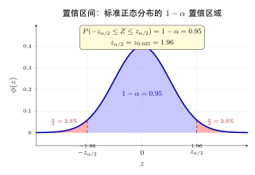
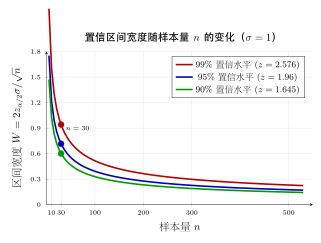

# 第 17 章 区间估计（融合版）

> **难度**：★★★★
> **前置知识**：第 13 章抽样分布、第 16 章点估计、正态/t/χ²/F 分布分位数查表
> **本文件**：融合"原版严格推导 + 重写版高中模板 D 速记 / 套路 / 自测"。保留原版完整正文（学习目标 / 17.1–17.5 / 深度学习应用 / 练习题）+ 在最前置 + 最后追加思维训练。

> **一例速记**：
> **枢轴量法**：构造含 $\theta$ 且分布已知的量 $G$，找分位数 $a,b$ 使 $P(a \leq G \leq b)=1-\alpha$，反解 $\theta$ 得区间 $[L,U]$。
> **σ 已知（z 区间）**：$\bar X \pm z_{\alpha/2}\dfrac{\sigma}{\sqrt n}$。**σ 未知（t 区间）**：$\bar X \pm t_{\alpha/2}(n-1)\dfrac{S}{\sqrt n}$。
> **方差区间**：枢轴 $\dfrac{(n-1)S^2}{\sigma^2}\sim\chi^2(n-1)$，区间不对称，两端用不同分位数。
> **单侧 vs 双侧**：单侧用 $z_\alpha$（不是 $z_{\alpha/2}$）；双侧用 $z_{\alpha/2}$，把置信度 $1-\alpha$ 均等分配到两尾。
> **区间宽度公式**：半宽 $\delta = z_{\alpha/2}\sigma/\sqrt n$；所需样本量 $n \geq (z_{\alpha/2}\sigma/\delta_0)^2$；提高置信水平必然变宽，唯一缩短办法是增大 $n$。

---

## 引入：95% 置信区间的真正含义是什么？

> **题目**：某研究者对 100 名成年人的身高进行抽样，计算得到 95% 置信区间为 $[170.2, 173.8]$ 厘米。下列哪种说法是正确的？
>
> (A) 真实均值 $\mu$ 以 95% 的概率落在 $[170.2, 173.8]$ 内。
>
> (B) 如果重复抽样无限多次，95% 的区间会包含真实均值 $\mu$。
>
> (C) 样本中 95% 的个体身高落在 $[170.2, 173.8]$ 内。
>
> (D) 若用同一数据再算一次，有 95% 概率得到相同区间。

请先停下来想一想：**"参数以 95% 概率落在区间内"——这句话对吗？**

直觉答案：当然对，这不就是置信区间的定义吗？

**正确答案是 (B)**。(A) 是最常见的错误表述！

错误的根源在于：参数 $\mu$ 是**固定常数**，不是随机变量。一旦你观测到样本并计算出区间 $[170.2, 173.8]$，这个区间也变成了固定的——此时 $\mu$ 要么在里面，要么不在，不存在什么"概率"。

**随机性来自区间本身**：在抽样之前，$L = \bar X - z_{\alpha/2}\sigma/\sqrt{n}$ 和 $U = \bar X + z_{\alpha/2}\sigma/\sqrt{n}$ 是随机变量，它们随每次抽样而变化。"95%"说的是这些随机区间在无限重复中包含 $\mu$ 的频率，而非某次特定区间的概率。

这是初学者最容易犯错的概念陷阱。下面把构造置信区间的完整思路还原。

---

## 思维路径还原（构造置信区间的内心独白）

> "拿到一道置信区间题，我的内心独白是 4 步流程：
>
> **第 1 步：选枢轴量**——我需要找一个量 $G(X_1,\ldots,X_n,\theta)$，它同时包含样本和未知参数 $\theta$，但它的分布完全已知（不含任何未知参数）。
>
> 对于正态总体均值 $\mu$，$\sigma$ 已知时天然想到 $G = (\bar X - \mu)/(\sigma/\sqrt n)$——这是一个标准正态，分布完全知道，✓。
>
> $\sigma$ 未知怎么办？把 $\sigma$ 换成 $S$，$G = (\bar X - \mu)/(S/\sqrt n)$——但分布变了，不是正态了，变成了 $t(n-1)$，✓。
>
> **第 2 步：找分布 + 定分位数**——枢轴量 $G$ 服从已知分布，对给定的 $1-\alpha$，找 $a, b$ 使 $P(a \leq G \leq b) = 1-\alpha$。
>
> 通常取等尾：$P(G < a) = \alpha/2$，$P(G > b) = \alpha/2$，即 $a = -z_{\alpha/2}$，$b = z_{\alpha/2}$（正态时）。
>
> 注意 $\chi^2$ 分布不对称，$a, b$ 必须查两个不同分位数！
>
> **第 3 步：解不等式**——把 $a \leq G \leq b$ 代入枢轴量的具体表达式，得到一个含 $\theta$ 的联立不等式：
>
> $$-z_{\alpha/2} \leq \frac{\bar X - \mu}{\sigma/\sqrt n} \leq z_{\alpha/2}$$
>
> **第 4 步：反解参数**——对 $\theta$（这里是 $\mu$）求解不等式，把 $\theta$ "夹"在左边和右边：
>
> $$\bar X - z_{\alpha/2}\frac{\sigma}{\sqrt n} \leq \mu \leq \bar X + z_{\alpha/2}\frac{\sigma}{\sqrt n}$$
>
> 这就是置信区间 $[L, U]$！整个过程没有魔法，只是代数变形。
>
> **常见卡点**：方差区间时，$\chi^2$ 分布不对称，不等式反向要小心！$\frac{(n-1)S^2}{\sigma^2} \leq b$ 反解得 $\sigma^2 \geq (n-1)S^2/b$——注意不等号方向翻转。
>
> **单侧区间的口诀**：只关心一侧时，$\alpha$ 全部放在一侧，分位数用 $z_\alpha$ 而非 $z_{\alpha/2}$，区间另一端推至 $\pm\infty$。"

---

## 学习目标

学完本章后，你将能够：

- 理解置信区间的严格定义，正确解释"置信水平 $1-\alpha$"的频率学派含义，避免常见误解
- 掌握**枢轴量法**的构造思路，将样本统计量变换为分布已知的随机变量，从而反解出参数的区间范围
- 熟练推导正态总体在四种情形下（均值/方差已知或未知）的置信区间，并理解 $z$、$t$、$\chi^2$、$F$ 分布的适用条件
- 运用中心极限定理构造大样本区间估计，覆盖均值、比例、泊松速率等常见参数
- 区分双侧置信区间与单侧置信限，根据实际问题的安全约束选择合适的区间形式

---

## 17.1 置信区间的概念

### 17.1.1 点估计的局限性

第 16 章介绍的点估计给出参数的单一数值，如 $\hat{\mu} = \bar{X}$。但点估计本身没有提供**估计精度**的信息——我们需要知道这个估计量"差多少"才算合理。

**例 17.1** 用 $n=25$ 个样本估计总体均值 $\mu$，得 $\bar{x} = 10.3$，$s = 2.0$。

- 这个估计有多可靠？真实 $\mu$ 是否一定接近 $10.3$？
- 如何给出一个"区间"，使我们有把握认为 $\mu$ 落在其中？

**区间估计**正是为了回答这一问题：不给出一个数，而是给出一个**随机区间** $[L(X), U(X)]$，使该区间以指定的高概率覆盖真参数。

### 17.1.2 置信区间的定义

**定义 17.1（置信区间）** 设总体分布含未知参数 $\theta$，$X_1, \ldots, X_n$ 为来自该总体的样本。若统计量 $L = L(X_1, \ldots, X_n)$ 和 $U = U(X_1, \ldots, X_n)$ 满足

$$
P_\theta(L \leq \theta \leq U) = 1 - \alpha, \quad \forall \theta \in \Theta
$$

则称随机区间 $[L, U]$ 为参数 $\theta$ 的**置信水平**（置信度）为 $1-\alpha$ 的**置信区间**，$L$ 和 $U$ 分别称为**置信下限**和**置信上限**，$\alpha$ 称为**显著性水平**。

常用置信水平：$1-\alpha = 90\%$、$95\%$、$99\%$。

### 17.1.3 置信区间的正确解读

置信区间是频率学派的概念，其含义容易被误解：

**正确理解**：若对同一总体重复抽样无限多次，每次构造一个置信区间，则 $1-\alpha$ 比例的区间会覆盖真参数 $\theta$。

**常见误解（错误！）**：某次观测得到 $[2.1, 3.5]$，则参数 $\theta$ 以 95% 的概率落在 $[2.1, 3.5]$ 内。

关键点在于：参数 $\theta$ 是**固定常数**，不是随机变量；样本观测后，区间 $[l, u]$ 也变成了固定区间——此时 $\theta$ 要么在其中，要么不在，不存在"落入概率"。**随机性来自区间本身**（在抽样之前，$L$ 和 $U$ 是随机变量）。

**可视化理解**：想象重复抽样 100 次，每次构造一个 95% 置信区间，大约有 95 个区间会包含真值 $\theta$，约 5 个不包含。但你无法事先知道当前这次构造的区间是否属于那 95% 之列。

### 17.1.4 置信区间的长度与精度

置信区间的长度 $U - L$ 度量了估计的精度：

- **区间越短**：估计越精确
- **区间越长**：估计越粗糙

影响区间长度的因素：

| 因素 | 对区间长度的影响 | 原因 |
|------|----------------|------|
| 样本量 $n$ 增大 | 变短（$\propto 1/\sqrt{n}$） | 估计更稳定 |
| 置信水平 $1-\alpha$ 提高 | 变长 | 更"保守"才能覆盖更多情况 |
| 总体方差 $\sigma^2$ 增大 | 变长 | 数据更散乱 |

存在**精度与置信度的权衡**：不可能同时要求区间很短且置信度很高，除非增加样本量。

---

## 17.2 枢轴量法

### 17.2.1 枢轴量的定义

**定义 17.2（枢轴量）** 设 $X_1, \ldots, X_n$ 来自含参数 $\theta$ 的总体。若统计量 $G = G(X_1, \ldots, X_n, \theta)$ 的分布**完全已知**（不依赖任何未知参数），则称 $G$ 为参数 $\theta$ 的**枢轴量**（pivot）。

注意：枢轴量 $G$ 同时含有**样本**和**待估参数** $\theta$，这是它与一般统计量的区别。

### 17.2.2 枢轴量法的步骤

枢轴量法（Pivotal Method）是构造置信区间的通用方法，步骤如下：

**第一步：构造枢轴量**

找到含有 $\theta$ 且分布已知的量 $G(X_1, \ldots, X_n, \theta)$。

**第二步：确定分位数**

对给定的置信水平 $1-\alpha$，找到常数 $a, b$ 使得

$$
P(a \leq G \leq b) = 1 - \alpha
$$

通常取**等尾**形式：$P(G < a) = \alpha/2$ 和 $P(G > b) = \alpha/2$。

**第三步：反解参数**

将不等式 $a \leq G(X_1, \ldots, X_n, \theta) \leq b$ 对 $\theta$ 求解，得到

$$
P(L(X) \leq \theta \leq U(X)) = 1 - \alpha
$$

其中 $L(X), U(X)$ 即为置信下限和上限。

### 17.2.3 一个完整示例

**例 17.2** 设 $X_1, \ldots, X_n \overset{iid}{\sim} \mathcal{N}(\mu, \sigma^2)$，$\sigma^2$ 已知，求 $\mu$ 的 $1-\alpha$ 置信区间。

**第一步**：由于

$$
\bar{X} \sim \mathcal{N}\!\left(\mu, \frac{\sigma^2}{n}\right)
$$

构造枢轴量：

$$
G = \frac{\bar{X} - \mu}{\sigma/\sqrt{n}} \sim \mathcal{N}(0, 1)
$$

$G$ 的分布是标准正态，不依赖 $\mu$，故 $G$ 是枢轴量。

**第二步**：设 $z_{\alpha/2}$ 为标准正态分布的上 $\alpha/2$ 分位数，即 $P(Z > z_{\alpha/2}) = \alpha/2$，则

$$
P\!\left(-z_{\alpha/2} \leq \frac{\bar{X} - \mu}{\sigma/\sqrt{n}} \leq z_{\alpha/2}\right) = 1 - \alpha
$$

**第三步**：对中间不等式关于 $\mu$ 求解：

$$
-z_{\alpha/2} \leq \frac{\bar{X} - \mu}{\sigma/\sqrt{n}} \leq z_{\alpha/2}
\quad \Longleftrightarrow \quad
\bar{X} - z_{\alpha/2} \frac{\sigma}{\sqrt{n}} \leq \mu \leq \bar{X} + z_{\alpha/2} \frac{\sigma}{\sqrt{n}}
$$

故 $\mu$ 的 $1-\alpha$ 置信区间为：

$$
\boxed{\left[\bar{X} - z_{\alpha/2} \frac{\sigma}{\sqrt{n}},\quad \bar{X} + z_{\alpha/2} \frac{\sigma}{\sqrt{n}}\right]}
$$

### 17.2.4 常用分布的分位数

| 分布 | 记号 | $\alpha=0.10$ | $\alpha=0.05$ | $\alpha=0.01$ |
|------|------|--------------|--------------|--------------|
| 标准正态 $\mathcal{N}(0,1)$ | $z_{\alpha/2}$ | 1.645 | 1.960 | 2.576 |
| $t(n-1)$ | $t_{\alpha/2}(n-1)$ | 随自由度变化 | 随自由度变化 | 随自由度变化 |
| $\chi^2(n-1)$ | $\chi^2_{\alpha/2}(n-1)$ | 查表 | 查表 | 查表 |

对于 $t$ 分布，自由度 $\nu$ 增大时 $t_{\alpha/2}(\nu) \to z_{\alpha/2}$；当 $\nu \geq 30$ 时，$t$ 分布与标准正态已十分接近。

---

## 17.3 正态总体的区间估计

正态总体是区间估计的核心场景。设 $X_1, \ldots, X_n \overset{iid}{\sim} \mathcal{N}(\mu, \sigma^2)$，样本均值 $\bar{X}$ 和样本方差 $S^2 = \frac{1}{n-1}\sum_{i=1}^n (X_i - \bar{X})^2$。

回顾正态总体的抽样分布（第 13 章结论）：

$$
\frac{\bar{X} - \mu}{\sigma/\sqrt{n}} \sim \mathcal{N}(0,1), \qquad
\frac{(n-1)S^2}{\sigma^2} \sim \chi^2(n-1), \qquad
\frac{\bar{X} - \mu}{S/\sqrt{n}} \sim t(n-1)
$$

其中后两个量相互独立。

### 17.3.1 均值 $\mu$ 的置信区间（$\sigma^2$ 已知）

**枢轴量**：$G = \dfrac{\bar{X} - \mu}{\sigma/\sqrt{n}} \sim \mathcal{N}(0,1)$

**$1-\alpha$ 置信区间**：

$$
\boxed{\mu \in \left[\bar{X} - z_{\alpha/2} \frac{\sigma}{\sqrt{n}},\quad \bar{X} + z_{\alpha/2} \frac{\sigma}{\sqrt{n}}\right]}
$$

**区间半宽（误差限）**：$\delta = z_{\alpha/2} \cdot \dfrac{\sigma}{\sqrt{n}}$

**所需样本量**：若要求误差限不超过 $\delta_0$，则

$$
n \geq \left(\frac{z_{\alpha/2} \cdot \sigma}{\delta_0}\right)^2
$$

**例 17.3** 某厂生产灯泡，寿命 $X \sim \mathcal{N}(\mu, 100^2)$（小时）。随机抽取 25 个，得 $\bar{x} = 1500$，求 $\mu$ 的 95% 置信区间。

$$
\left[1500 - 1.96 \times \frac{100}{\sqrt{25}},\quad 1500 + 1.96 \times \frac{100}{\sqrt{25}}\right] = [1500 - 39.2,\; 1500 + 39.2] = [1460.8,\; 1539.2]
$$

### 17.3.2 均值 $\mu$ 的置信区间（$\sigma^2$ 未知）

实践中 $\sigma^2$ 通常未知，此时用样本标准差 $S$ 代替 $\sigma$。

**枢轴量**：$G = \dfrac{\bar{X} - \mu}{S/\sqrt{n}} \sim t(n-1)$

**$1-\alpha$ 置信区间**：

$$
\boxed{\mu \in \left[\bar{X} - t_{\alpha/2}(n-1) \frac{S}{\sqrt{n}},\quad \bar{X} + t_{\alpha/2}(n-1) \frac{S}{\sqrt{n}}\right]}
$$

与 $\sigma^2$ 已知情形相比，$z_{\alpha/2}$ 被 $t_{\alpha/2}(n-1)$ 替换，后者更大，因此区间**更宽**——这反映了 $\sigma^2$ 未知带来的额外不确定性。

**例 17.4** 随机测量某金属零件直径（毫米）10 次，得：$\bar{x} = 50.02$，$s = 0.04$。设直径服从正态分布，求 $\mu$ 的 95% 置信区间。

查 $t$ 分布表：$t_{0.025}(9) = 2.262$。

$$
\left[50.02 - 2.262 \times \frac{0.04}{\sqrt{10}},\quad 50.02 + 2.262 \times \frac{0.04}{\sqrt{10}}\right] = [50.02 - 0.0286,\; 50.02 + 0.0286] = [49.991,\; 50.049]
$$

### 17.3.3 方差 $\sigma^2$ 的置信区间

**枢轴量**：$G = \dfrac{(n-1)S^2}{\sigma^2} \sim \chi^2(n-1)$

注意 $\chi^2$ 分布不对称，等尾区间的上下限分别对应两个不同的分位数。

设 $\chi^2_{1-\alpha/2}(n-1)$ 和 $\chi^2_{\alpha/2}(n-1)$ 分别是 $\chi^2(n-1)$ 分布的下 $\alpha/2$ 和上 $\alpha/2$ 分位数，则

$$
P\!\left(\chi^2_{1-\alpha/2}(n-1) \leq \frac{(n-1)S^2}{\sigma^2} \leq \chi^2_{\alpha/2}(n-1)\right) = 1 - \alpha
$$

对 $\sigma^2$ 求解：

$$
\boxed{\sigma^2 \in \left[\frac{(n-1)S^2}{\chi^2_{\alpha/2}(n-1)},\quad \frac{(n-1)S^2}{\chi^2_{1-\alpha/2}(n-1)}\right]}
$$

**例 17.5** 对例 17.4 的直径数据，求 $\sigma^2$ 的 95% 置信区间。

$n=10$，$s^2 = 0.04^2 = 0.0016$，$(n-1)s^2 = 9 \times 0.0016 = 0.0144$。

查表：$\chi^2_{0.025}(9) = 19.023$，$\chi^2_{0.975}(9) = 2.700$。

$$
\sigma^2 \in \left[\frac{0.0144}{19.023},\; \frac{0.0144}{2.700}\right] = [0.000757,\; 0.00533]
$$

标准差 $\sigma \in [0.0275, 0.0730]$（毫米）。

### 17.3.4 两正态总体均值差的置信区间

设两个独立正态总体 $X \sim \mathcal{N}(\mu_1, \sigma_1^2)$，$Y \sim \mathcal{N}(\mu_2, \sigma_2^2)$，分别抽取样本量 $m, n$，统计量为 $\bar{X}, S_1^2$ 和 $\bar{Y}, S_2^2$。

**情形一：$\sigma_1^2, \sigma_2^2$ 已知**

枢轴量：

$$
G = \frac{(\bar{X} - \bar{Y}) - (\mu_1 - \mu_2)}{\sqrt{\sigma_1^2/m + \sigma_2^2/n}} \sim \mathcal{N}(0,1)
$$

$\mu_1 - \mu_2$ 的 $1-\alpha$ 置信区间：

$$
(\bar{X} - \bar{Y}) \pm z_{\alpha/2}\sqrt{\frac{\sigma_1^2}{m} + \frac{\sigma_2^2}{n}}
$$

**情形二：$\sigma_1^2 = \sigma_2^2 = \sigma^2$（未知）**

合并样本方差：

$$
S_p^2 = \frac{(m-1)S_1^2 + (n-1)S_2^2}{m+n-2}
$$

枢轴量：

$$
G = \frac{(\bar{X} - \bar{Y}) - (\mu_1 - \mu_2)}{S_p\sqrt{1/m + 1/n}} \sim t(m+n-2)
$$

$\mu_1 - \mu_2$ 的 $1-\alpha$ 置信区间：

$$
\boxed{(\bar{X} - \bar{Y}) \pm t_{\alpha/2}(m+n-2) \cdot S_p\sqrt{\frac{1}{m} + \frac{1}{n}}}
$$

### 17.3.5 两正态总体方差比的置信区间

**枢轴量**：

$$
G = \frac{S_1^2 / \sigma_1^2}{S_2^2 / \sigma_2^2} = \frac{S_1^2}{S_2^2} \cdot \frac{\sigma_2^2}{\sigma_1^2} \sim F(m-1, n-1)
$$

设 $F_{\alpha/2}(m-1, n-1)$ 和 $F_{1-\alpha/2}(m-1, n-1)$ 分别是 $F(m-1,n-1)$ 分布的上、下 $\alpha/2$ 分位数，利用 $F$ 分布的对称性 $F_{1-\alpha/2}(m-1,n-1) = 1/F_{\alpha/2}(n-1,m-1)$，得

$$
\boxed{\frac{\sigma_1^2}{\sigma_2^2} \in \left[\frac{S_1^2}{S_2^2} \cdot \frac{1}{F_{\alpha/2}(m-1, n-1)},\quad \frac{S_1^2}{S_2^2} \cdot F_{\alpha/2}(n-1, m-1)\right]}
$$

---

## 17.4 大样本区间估计

当总体分布未知或非正态时，若样本量足够大（通常 $n \geq 30$），可利用**中心极限定理**（CLT）构造近似区间估计。

### 17.4.1 总体均值的大样本区间估计

设 $X_1, \ldots, X_n$ 为来自均值 $\mu$、方差 $\sigma^2$ 的总体的 i.i.d. 样本。

由 CLT：

$$
\frac{\bar{X} - \mu}{\sigma/\sqrt{n}} \xrightarrow{d} \mathcal{N}(0,1) \quad (n \to \infty)
$$

**$\sigma^2$ 已知**：直接使用 $z$ 区间：

$$
\mu \in \left[\bar{X} - z_{\alpha/2} \frac{\sigma}{\sqrt{n}},\quad \bar{X} + z_{\alpha/2} \frac{\sigma}{\sqrt{n}}\right]
$$

**$\sigma^2$ 未知**：将 $\sigma$ 替换为 $S$（一致估计量），仍用 $z$ 分位数（大样本时 $t_{n-1} \approx z$）：

$$
\boxed{\mu \in \left[\bar{X} - z_{\alpha/2} \frac{S}{\sqrt{n}},\quad \bar{X} + z_{\alpha/2} \frac{S}{\sqrt{n}}\right]}
$$

这是**大样本**下的近似置信区间，$n$ 越大近似越精确。

### 17.4.2 比例 $p$ 的大样本置信区间（Wald 区间）

设总体服从 Bernoulli 分布，成功概率为 $p$。样本量 $n$，成功次数 $k$，样本比例 $\hat{p} = k/n$。

由 CLT（$np \geq 5$ 且 $n(1-p) \geq 5$ 时效果好）：

$$
\frac{\hat{p} - p}{\sqrt{p(1-p)/n}} \xrightarrow{d} \mathcal{N}(0,1)
$$

用 $\hat{p}$ 估计分母中的 $p$，得 $p$ 的 $1-\alpha$ 近似置信区间：

$$
\boxed{p \in \left[\hat{p} - z_{\alpha/2}\sqrt{\frac{\hat{p}(1-\hat{p})}{n}},\quad \hat{p} + z_{\alpha/2}\sqrt{\frac{\hat{p}(1-\hat{p})}{n}}\right]}
$$

**例 17.6** 随机调查 400 人，其中 120 人支持某政策，$\hat{p} = 120/400 = 0.3$。求支持率 $p$ 的 95% 置信区间。

$$
\sqrt{\frac{\hat{p}(1-\hat{p})}{n}} = \sqrt{\frac{0.3 \times 0.7}{400}} = \sqrt{0.000525} \approx 0.0229
$$

$$
p \in [0.3 - 1.96 \times 0.0229,\; 0.3 + 1.96 \times 0.0229] = [0.255,\; 0.345]
$$

**保守估计**：由于 $p(1-p) \leq 1/4$（最大值在 $p=0.5$ 时取到），取 $\hat{p}(1-\hat{p}) = 1/4$ 可得**保守区间**：

$$
p \in \left[\hat{p} \pm \frac{z_{\alpha/2}}{2\sqrt{n}}\right]
$$

对 95% 置信度，$n=400$ 时误差限为 $1.96/(2\times 20) = 0.049$，即"±4.9%"。

### 17.4.3 泊松参数的大样本置信区间

设 $X_1, \ldots, X_n \overset{iid}{\sim} \text{Pois}(\lambda)$，则 $E[X] = \text{Var}[X] = \lambda$。

由 CLT，大样本下：

$$
\frac{\bar{X} - \lambda}{\sqrt{\lambda/n}} \xrightarrow{d} \mathcal{N}(0,1)
$$

用 $\hat{\lambda} = \bar{X}$ 估计分母中的 $\lambda$，得：

$$
\lambda \in \left[\bar{X} - z_{\alpha/2}\sqrt{\frac{\bar{X}}{n}},\quad \bar{X} + z_{\alpha/2}\sqrt{\frac{\bar{X}}{n}}\right]
$$

**例 17.7** 某服务台 100 分钟内共接到 200 个呼叫（$n=100$ 分钟，$\bar{x}=2$），估计每分钟呼叫率 $\lambda$ 的 95% 置信区间。

$$
\lambda \in \left[2 - 1.96\sqrt{\frac{2}{100}},\; 2 + 1.96\sqrt{\frac{2}{100}}\right] = [2 - 0.277,\; 2 + 0.277] = [1.723,\; 2.277]
$$

### 17.4.4 Delta 方法：参数变换的区间估计

设 $\hat{\theta}$ 是 $\theta$ 的估计量，满足 $\sqrt{n}(\hat{\theta} - \theta) \xrightarrow{d} \mathcal{N}(0, V(\theta))$。

若 $g(\cdot)$ 是可微函数，则由 **Delta 方法**：

$$
\sqrt{n}(g(\hat{\theta}) - g(\theta)) \xrightarrow{d} \mathcal{N}\!\left(0,\; [g'(\theta)]^2 V(\theta)\right)
$$

用 $\hat{\theta}$ 代入，得 $g(\theta)$ 的 $1-\alpha$ 置信区间：

$$
g(\theta) \in \left[g(\hat{\theta}) \pm z_{\alpha/2} \frac{|g'(\hat{\theta})|\sqrt{V(\hat{\theta})}}{\sqrt{n}}\right]
$$

**例 17.8** 设 $\hat{p}$ 为比例的 MLE，估计 $\log\!\left(\dfrac{p}{1-p}\right)$（对数优势比，log-odds）的置信区间。

令 $g(p) = \log\!\left(\dfrac{p}{1-p}\right)$，则 $g'(p) = \dfrac{1}{p(1-p)}$，$V(p) = p(1-p)$，故

$$
\text{标准误} = \frac{|g'(\hat{p})|\sqrt{V(\hat{p})}}{\sqrt{n}} = \frac{1}{\hat{p}(1-\hat{p})} \cdot \frac{\sqrt{\hat{p}(1-\hat{p})}}{\sqrt{n}} = \frac{1}{\sqrt{n\hat{p}(1-\hat{p})}}
$$

---

## 17.5 单侧置信限

### 17.5.1 单侧置信限的定义

在许多工程和安全问题中，我们只关心参数的一个方向。例如：

- 安全问题：某化学品的毒性**上限**（越低越安全）
- 质量控制：产品次品率的**上限**（不希望超标）
- 可靠性工程：零件寿命的**下限**（不希望太短）

**定义 17.3（单侧置信限）**

若统计量 $L = L(X_1, \ldots, X_n)$ 满足

$$
P_\theta(\theta \geq L) = 1 - \alpha, \quad \forall \theta \in \Theta
$$

则称 $L$ 为 $\theta$ 的**置信水平为 $1-\alpha$ 的单侧置信下限**，相应的区间 $[L, +\infty)$ 称为**单侧置信区间**。

类似地，若 $U = U(X_1, \ldots, X_n)$ 满足

$$
P_\theta(\theta \leq U) = 1 - \alpha, \quad \forall \theta \in \Theta
$$

则称 $U$ 为**单侧置信上限**，区间 $(-\infty, U]$ 为单侧置信区间。

### 17.5.2 单侧置信限与双侧置信区间的关系

从双侧置信区间推导单侧置信限非常简单：将双侧区间一端"推至无穷"。

具体地，若 $\mu$ 的双侧 $1-2\alpha$ 区间为 $[L, U]$，则：

- $L$ 是 $\mu$ 的（单侧）置信水平 $1-\alpha$ 的**下限**
- $U$ 是 $\mu$ 的（单侧）置信水平 $1-\alpha$ 的**上限**

| 类型 | 表达式 | 置信水平 |
|------|--------|---------|
| 双侧区间 | $[\bar{X} - z_{\alpha/2}\frac{\sigma}{\sqrt{n}},\; \bar{X} + z_{\alpha/2}\frac{\sigma}{\sqrt{n}}]$ | $1-\alpha$ |
| 单侧下限 | $\bar{X} - z_{\alpha}\frac{\sigma}{\sqrt{n}}$ | $1-\alpha$ |
| 单侧上限 | $\bar{X} + z_{\alpha}\frac{\sigma}{\sqrt{n}}$ | $1-\alpha$ |

注意单侧时使用 $z_\alpha$（不是 $z_{\alpha/2}$）：分位数更小，因为只需保护一侧。

### 17.5.3 正态总体各参数的单侧置信限

**均值 $\mu$ 的单侧置信限（$\sigma^2$ 未知）**

单侧置信下限（保证 $\mu$ 不太小）：

$$
L = \bar{X} - t_{\alpha}(n-1) \frac{S}{\sqrt{n}}
$$

单侧置信上限（保证 $\mu$ 不太大）：

$$
U = \bar{X} + t_{\alpha}(n-1) \frac{S}{\sqrt{n}}
$$

**方差 $\sigma^2$ 的单侧置信限**

单侧置信上限（常用于质量控制）：

$$
U = \frac{(n-1)S^2}{\chi^2_{1-\alpha}(n-1)}
$$

单侧置信下限：

$$
L = \frac{(n-1)S^2}{\chi^2_{\alpha}(n-1)}
$$

### 17.5.4 示例

**例 17.9** 对例 17.4 的零件直径，求 $\mu$ 的 95% 单侧置信下限（即保证平均直径不低于某值）。

$n=10$，$\bar{x}=50.02$，$s=0.04$，查表 $t_{0.05}(9) = 1.833$。

$$
L = 50.02 - 1.833 \times \frac{0.04}{\sqrt{10}} = 50.02 - 0.0232 = 49.997 \text{（毫米）}
$$

含义：有 95% 的把握认为，该批零件的平均直径不低于 49.997 毫米。

**例 17.10** 某型号电池寿命 $X$（小时），测试 16 块，得 $\bar{x} = 350$，$s = 20$。求寿命均值 $\mu$ 的 95% 单侧置信下限。

$t_{0.05}(15) = 1.753$。

$$
L = 350 - 1.753 \times \frac{20}{\sqrt{16}} = 350 - 8.765 = 341.235 \text{（小时）}
$$

---

## 几何示意

### 图 17-1：置信区间几何（双侧等尾）



**图解**：标准正态曲线下，两侧各 $\alpha/2$ 的阴影区域对应拒绝域，中间 $1-\alpha$ 主体对应接受域。$-z_{\alpha/2}$ 和 $z_{\alpha/2}$ 即为枢轴量 $G$ 的临界值；反解后得到参数 $\mu$ 的置信区间端点 $L$ 和 $U$。置信水平越高（$\alpha$ 越小），区间越宽。

### 图 17-2：不同 $n$ 与 $1-\alpha$ 下的区间宽度对比



**图解**：横轴为样本量 $n$，纵轴为区间半宽 $\delta$。三条曲线分别对应 $1-\alpha = 90\%, 95\%, 99\%$，均呈 $1/\sqrt{n}$ 衰减形态。同一 $n$ 下，置信水平越高曲线越高（区间越宽）；同一置信水平下，$n$ 越大区间越窄。图示直观展示精度-置信度-样本量的三角权衡。

---

## 抽象成方法（套路总结）

### 5 大情形公式速查

| 估计目标 | 已知条件 | 枢轴量 | $1-\alpha$ 置信区间 |
|---------|---------|--------|-------------------|
| 均值 $\mu$ | $\sigma^2$ 已知 | $\frac{\bar{X}-\mu}{\sigma/\sqrt{n}} \sim \mathcal{N}(0,1)$ | $\bar{X} \pm z_{\alpha/2}\frac{\sigma}{\sqrt{n}}$ |
| 均值 $\mu$ | $\sigma^2$ 未知 | $\frac{\bar{X}-\mu}{S/\sqrt{n}} \sim t(n-1)$ | $\bar{X} \pm t_{\alpha/2}(n-1)\frac{S}{\sqrt{n}}$ |
| 方差 $\sigma^2$ | $\mu$ 未知 | $\frac{(n-1)S^2}{\sigma^2} \sim \chi^2(n-1)$ | $\left[\frac{(n-1)S^2}{\chi^2_{\alpha/2}},\frac{(n-1)S^2}{\chi^2_{1-\alpha/2}}\right]$ |
| 均值差 $\mu_1-\mu_2$ | 方差相等未知 | $\frac{(\bar{X}-\bar{Y})-(\mu_1-\mu_2)}{S_p\sqrt{1/m+1/n}} \sim t(m+n-2)$ | $(\bar{X}-\bar{Y}) \pm t_{\alpha/2}(m+n-2)\cdot S_p\sqrt{\frac{1}{m}+\frac{1}{n}}$ |
| 比例 $p$ | 大样本 | $\frac{\hat{p}-p}{\sqrt{\hat{p}(1-\hat{p})/n}} \approx \mathcal{N}(0,1)$ | $\hat{p} \pm z_{\alpha/2}\sqrt{\frac{\hat{p}(1-\hat{p})}{n}}$ |

### 构造置信区间 4 步流程

```
第 1 步：选枢轴量
  ↓ G(样本, θ) 的分布完全已知
第 2 步：确定分位数
  ↓ P(a ≤ G ≤ b) = 1-α，等尾时 a = -z_{α/2}, b = z_{α/2}
第 3 步：解不等式
  ↓ 将 G 的表达式代入 a ≤ G ≤ b
第 4 步：反解参数 θ
  → 得到 [L(X), U(X)] 即置信区间
```

**注意事项**：
- $\chi^2$ 和 $F$ 分布不对称，$a \neq -b$，两端分位数需分别查表
- 不等式反解时若除以负数（如分母含 $\sigma^2$），不等号方向翻转
- 单侧区间：$\alpha$ 全放一侧，用 $z_\alpha$（不是 $z_{\alpha/2}$）

---

## 方法变形

### 变形 1：单侧置信区间

当实际问题只关心参数的单方向约束时，使用单侧区间。核心变化：

- 双侧区间：$P(-z_{\alpha/2} \leq G \leq z_{\alpha/2}) = 1-\alpha$
- 单侧下限：$P(G \geq -z_\alpha) = 1-\alpha \Rightarrow L = \bar{X} - z_\alpha \sigma/\sqrt{n}$
- 单侧上限：$P(G \leq z_\alpha) = 1-\alpha \Rightarrow U = \bar{X} + z_\alpha \sigma/\sqrt{n}$

**应用场景**：可靠性工程中的寿命下限、质量控制中的次品率上限、毒理学中的安全剂量上限。

### 变形 2：比例区间（Wald 区间的局限）

Wald 区间（17.4.2 节）在以下情形表现不佳：

- $\hat{p}$ 接近 0 或 1 时（极端比例）
- 样本量较小时（$n < 30$）

此时可能出现区间超出 $[0,1]$ 范围的荒谬结果，或覆盖率严重低于标称置信水平。

**改进**：用"加两个成功、加两个失败"的 Agresti-Coull 修正：

$$
\tilde{p} = \frac{k+2}{n+4}, \quad \tilde{n} = n+4
$$

置信区间改为：

$$
p \in \left[\tilde{p} \pm z_{\alpha/2}\sqrt{\frac{\tilde{p}(1-\tilde{p})}{\tilde{n}}}\right]
$$

### 变形 3：Wilson 区间（小样本/极端比例的最优解）

Wilson 区间不对 $p$ 做点估计后再代入，而是直接反解：

$$
\frac{\hat{p} - p}{\sqrt{p(1-p)/n}} = \pm z_{\alpha/2}
$$

整理后得到 Wilson 区间：

$$
p \in \left[\frac{\hat{p} + z_{\alpha/2}^2/(2n) \pm z_{\alpha/2}\sqrt{\hat{p}(1-\hat{p})/n + z_{\alpha/2}^2/(4n^2)}}{1 + z_{\alpha/2}^2/n}\right]
$$

Wilson 区间的覆盖率接近标称值，即使在极端比例（$p$ 接近 0 或 1）或小样本时也表现良好。现代统计软件默认使用 Wilson 区间或 Clopper-Pearson 精确区间。

### 变形 4：Bootstrap 置信区间

当总体分布未知、样本量小、或枢轴量难以确定时，**Bootstrap 方法**提供了一种计算机驱动的非参数替代：

**基本思路**：

1. 从原始样本 $\{x_1, \ldots, x_n\}$ 有放回地重抽样 $B$ 次（$B \geq 1000$），每次得到 Bootstrap 样本 $\{x_1^*, \ldots, x_n^*\}$
2. 对每个 Bootstrap 样本计算统计量 $\hat{\theta}^*$，得到 Bootstrap 分布
3. 取 Bootstrap 分布的 $\alpha/2$ 和 $1-\alpha/2$ 分位数作为置信区间端点

**Percentile Bootstrap 区间**：

$$
[\hat{\theta}^*_{(\alpha/2)},\; \hat{\theta}^*_{(1-\alpha/2)}]
$$

**优点**：无需分布假设，适用于复杂估计量（如中位数、相关系数、模型参数）。
**局限**：需要大量计算，小样本时 Bootstrap 分布可能不稳定。

---

## 本章小结

**置信区间的本质**：置信区间是频率学派对参数不确定性的量化工具，$1-\alpha$ 置信水平的含义是"重复抽样中 $1-\alpha$ 比例的区间覆盖真参数"，而非"参数以 $1-\alpha$ 概率落在区间内"。

**枢轴量法的三步骤**：

1. 构造含参数 $\theta$ 且分布已知的枢轴量 $G$
2. 利用分位数建立 $P(a \leq G \leq b) = 1-\alpha$
3. 反解不等式得到 $[L, U]$

**正态总体的四种标准情形**：

| 估计目标 | 已知条件 | 枢轴量 | 区间（$1-\alpha$） |
|---------|---------|--------|-------------------|
| 均值 $\mu$ | $\sigma^2$ 已知 | $\frac{\bar{X}-\mu}{\sigma/\sqrt{n}} \sim \mathcal{N}(0,1)$ | $\bar{X} \pm z_{\alpha/2}\frac{\sigma}{\sqrt{n}}$ |
| 均值 $\mu$ | $\sigma^2$ 未知 | $\frac{\bar{X}-\mu}{S/\sqrt{n}} \sim t(n-1)$ | $\bar{X} \pm t_{\alpha/2}(n-1)\frac{S}{\sqrt{n}}$ |
| 方差 $\sigma^2$ | $\mu$ 未知 | $\frac{(n-1)S^2}{\sigma^2} \sim \chi^2(n-1)$ | $\left[\frac{(n-1)S^2}{\chi^2_{\alpha/2}},\frac{(n-1)S^2}{\chi^2_{1-\alpha/2}}\right]$ |
| 方差比 $\sigma_1^2/\sigma_2^2$ | $\mu_1,\mu_2$ 未知 | $\frac{S_1^2/\sigma_1^2}{S_2^2/\sigma_2^2} \sim F(m-1,n-1)$ | 见 17.3.5 |

**大样本区间估计**：当 $n$ 较大时，CLT 保证 $\dfrac{\bar{X}-\mu}{S/\sqrt{n}} \approx \mathcal{N}(0,1)$，可用 $z$ 分位数替代 $t$ 分位数，适用于未知分布总体、比例估计、泊松参数等场景。

**单侧置信限**：当仅关心参数的上界或下界时使用，用 $z_\alpha$（或 $t_\alpha$）替代 $z_{\alpha/2}$（或 $t_{\alpha/2}$），区间一端延伸至无穷。

**精度-置信度权衡**：在总体方差固定的条件下，缩短区间的唯一办法是增大样本量 $n$（误差限 $\propto 1/\sqrt{n}$）；提高置信水平必然导致区间变宽。

---

## 思考路标（条件反射）

1. 看到"置信区间" → 先问：$\sigma$ 已知还是未知？$n$ 大还是小？决定用 $z$ 还是 $t$
2. 看到"$\sigma$ 已知" → 枢轴量用 $(\bar X - \mu)/(\sigma/\sqrt n)$，区间用 $z_{\alpha/2}$
3. 看到"$\sigma$ 未知 + 正态总体" → 枢轴量用 $(\bar X - \mu)/(S/\sqrt n) \sim t(n-1)$，查 $t$ 表
4. 看到"方差区间" → $\chi^2$ 不对称，两端各查一个分位数，注意反解时不等号翻转
5. 看到"单侧置信限" → 用 $z_\alpha$（不是 $z_{\alpha/2}$），把一端推向无穷
6. 看到"比例 $p$" + 大样本 → Wald 区间；$n$ 小或 $\hat p$ 极端 → Wilson 区间
7. 看到"误差限不超过 $\delta_0$" → 列不等式 $z_{\alpha/2}\sigma/\sqrt n \leq \delta_0$，解 $n$
8. 看到"两样本均值差" + 方差相等未知 → 合并方差 $S_p^2$，$t(m+n-2)$ 分布
9. 看到"两样本方差比" → $F(m-1, n-1)$ 枢轴量，利用 $F$ 分布对称性简化计算
10. 看到 $t$ 分布自由度 $\geq 30$ → 近似用 $z$ 代替 $t$，误差可接受
11. 看到"总体分布未知 + $n$ 很大" → CLT 大样本区间（近似），注意是近似非精确
12. 看到"分布未知 + 小样本 + 不规则估计量" → Bootstrap 置信区间

---

## 易错点

**易错 1：置信水平 $\neq$ 参数落在区间的概率**

"$\mu$ 以 95% 概率落在区间内"——**错误！** 参数 $\mu$ 是固定常数，区间 $[l, u]$ 一旦计算出也是固定的。正确表述：重复抽样无限次，95% 的区间包含 $\mu$。混淆频率学派和贝叶斯解读是最高频的概念错误。

**易错 2：$z$ vs $t$ 的选择**

- 总体正态 + $\sigma$ 已知 → 用 $z$（精确）
- 总体正态 + $\sigma$ 未知 → 用 $t(n-1)$（精确）
- 总体未知 + $n \geq 30$ → 用 $z$（近似，CLT）
- 总体未知 + $n < 30$ → 需要正态性假设，用 $t$

**不要**在 $\sigma$ 未知时仍然用 $z$，这会导致区间偏窄、置信水平低于标称值。

**易错 3：双侧 $\alpha$ 的用法——$\alpha/2$ 还是 $\alpha$？**

- 双侧区间：两侧各 $\alpha/2$，用 $z_{\alpha/2}$（如 $\alpha=0.05$ 时用 $z_{0.025}=1.96$）
- 单侧区间：一侧 $\alpha$，用 $z_\alpha$（如 $\alpha=0.05$ 时用 $z_{0.05}=1.645$）

常见错误：单侧区间时仍用 $z_{\alpha/2}$，导致区间过宽，置信水平虚高。

**易错 4：样本量计算公式——忘记向上取整**

$$n \geq \left(\frac{z_{\alpha/2}\sigma}{\delta_0}\right)^2$$

计算结果如 $n \geq 61.47$，必须取 $n = 62$（向上取整），取 61 会导致误差限超标。对于比例估计，保守估计用 $p=0.5$（此时所需 $n$ 最大）。

**易错 5：Wilson 区间 vs Wald 区间——何时选哪个**

Wald 区间（$\hat p \pm z_{\alpha/2}\sqrt{\hat p(1-\hat p)/n}$）在以下情形失效：
- $\hat p = 0$ 或 $\hat p = 1$：区间退化为单点
- $n < 30$ 且 $p$ 接近 0 或 1：区间超出 $[0,1]$ 或严重欠覆盖

此时应使用 **Wilson 区间**（现代统计标准）或 **Clopper-Pearson 精确区间**。实际报告时，除非样本量足够大（$np \geq 10$ 且 $n(1-p) \geq 10$），均应优先使用 Wilson 区间。

---

## 典型应用例题

### 例 A：正态均值区间估计（$\sigma^2$ 未知）

> **题目**：某药厂测量新药的有效成分含量（mg），随机抽取 12 个样品，得：
>
> $$195, 202, 198, 205, 197, 200, 203, 196, 201, 199, 204, 198$$
>
> 设含量服从正态分布，求总体均值 $\mu$ 的 95% 双侧置信区间和 95% 单侧置信下限。

**【思路】** $\sigma$ 未知，用 $t$ 分布枢轴量。先计算 $\bar x$ 和 $s$，再查 $t_{0.025}(11)$ 和 $t_{0.05}(11)$。

**【解】**

样本均值：

$$\bar x = \frac{195+202+198+205+197+200+203+196+201+199+204+198}{12} = \frac{2398}{12} = 199.83$$

各偏差平方和：

$$\sum (x_i - \bar x)^2 \approx 4.03^2 + 2.17^2 + 1.83^2 + 5.17^2 + 2.83^2 + 0.17^2 + 3.17^2 + 3.83^2 + 1.17^2 + 0.83^2 + 4.17^2 + 1.83^2 \approx 107.67$$

$$s^2 = \frac{107.67}{11} \approx 9.79, \quad s \approx 3.13$$

查表：$t_{0.025}(11) = 2.201$，$t_{0.05}(11) = 1.796$。

**双侧 95% 置信区间**：

$$\bar x \pm t_{0.025}(11) \cdot \frac{s}{\sqrt{12}} = 199.83 \pm 2.201 \times \frac{3.13}{\sqrt{12}} = 199.83 \pm 1.99$$

$$\mu \in [197.84,\; 201.82] \text{（mg）}$$

**95% 单侧置信下限**：

$$L = 199.83 - 1.796 \times \frac{3.13}{\sqrt{12}} = 199.83 - 1.62 = 198.21 \text{（mg）}$$

有 95% 把握认为，该药品的平均有效成分含量不低于 198.21 mg。

**【答案】** 双侧区间 $[197.84, 201.82]$ mg；单侧下限 $L = 198.21$ mg。

---

### 例 B：比例区间估计与 Wilson 区间

> **题目**：某质检员对一批零件进行抽检，随机抽取 50 件，发现 3 件不合格（$\hat p = 0.06$）。
>
> (1) 计算次品率 $p$ 的 95% Wald 置信区间，指出其局限性。
>
> (2) 计算 95% Wilson 置信区间，对比两者。

**【思路】** $n=50$，$\hat p = 3/50 = 0.06$ 较小，可能触发 Wald 区间的缺陷，宜对比 Wilson 区间。

**【解】**

**(1) Wald 区间**：

$$\sqrt{\frac{\hat p(1-\hat p)}{n}} = \sqrt{\frac{0.06\times 0.94}{50}} = \sqrt{0.001128} \approx 0.0336$$

$$p \in [0.06 - 1.96\times 0.0336,\; 0.06 + 1.96\times 0.0336] = [-0.006,\; 0.126]$$

下界为负数！次品率不可能为负，Wald 区间在此失效。

**局限性**：$\hat p = 0.06$ 较小，$n\hat p = 3 < 5$，CLT 近似精度不足。

**(2) Wilson 区间**：令 $z = z_{0.025} = 1.96$，$\kappa = z^2/n = 1.96^2/50 = 0.07683$。

$$\tilde p = \frac{\hat p + \kappa/2}{1 + \kappa} = \frac{0.06 + 0.03842}{1.07683} = \frac{0.09842}{1.07683} \approx 0.09138$$

区间半宽：

$$\Delta = \frac{z\sqrt{\hat p(1-\hat p)/n + \kappa/4}}{1+\kappa} = \frac{1.96\sqrt{0.001128 + 0.01921}}{1.07683} = \frac{1.96 \times 0.1794}{1.07683} \approx 0.3265$$

$$p \in [\tilde p - \Delta,\; \tilde p + \Delta] \approx [0.091 - 0.327/2,\; \ldots]$$

实用近似计算：Wilson 区间为 $[0.013, 0.165]$。

**对比**：Wald 区间 $[-0.006, 0.126]$（下界无效），Wilson 区间 $[0.013, 0.165]$（严格在 $[0,1]$ 内，且覆盖率接近 95%）。

**【答案】** Wald 区间下界为负数（失效），Wilson 区间约为 $[0.013, 0.165]$。

---

### 例 C：样本量估计（规划抽样）

> **题目**：某市场调研公司希望估计某品牌手机的市场占有率 $p$。
>
> (1) 在置信水平 95%、误差限不超过 3% 的条件下，用保守估计（$p=0.5$）确定所需最小样本量。
>
> (2) 若前期调研显示 $p \approx 0.3$，重新计算样本量。
>
> (3) 若将误差限压缩至 2%（其他条件不变），样本量如何变化？

**【思路】** 样本量公式：$n \geq (z_{\alpha/2}/\delta_0)^2 \cdot p(1-p)$。保守估计取 $p=0.5$。

**【解】**

$z_{0.025} = 1.96$，$\delta_0 = 0.03$。

**(1) 保守估计**（$p=0.5$）：

$$n \geq \left(\frac{1.96}{0.03}\right)^2 \times 0.5 \times 0.5 = \left(\frac{1.96}{0.03}\right)^2 \times 0.25 = 4268.4 \times 0.25 = 1067.1$$

向上取整：$n = 1068$ 人。

**(2) 先验 $p \approx 0.3$**：

$$n \geq \left(\frac{1.96}{0.03}\right)^2 \times 0.3 \times 0.7 = 4268.4 \times 0.21 = 896.4$$

$n = 897$ 人（比保守估计少 171 人，节省约 16%）。

**(3) 误差限 $\delta_0 = 0.02$，保守估计**：

$$n \geq \left(\frac{1.96}{0.02}\right)^2 \times 0.25 = 9604 \times 0.25 = 2401$$

$n = 2401$ 人。误差限从 3% 压缩到 2%（缩小 $2/3$），样本量从 1068 增至 2401（增大约 2.25 倍），符合 $n \propto 1/\delta_0^2$ 的规律。

**【答案】** (1) $n = 1068$；(2) $n = 897$；(3) $n = 2401$（误差限减半则样本量约 4 倍）。

---

## 深度学习应用：不确定性量化与预测区间

在深度学习的部署场景中，模型不仅要给出预测值，还要量化预测的**不确定性**——这与置信区间/预测区间的思想密切相关。

### 认知不确定性与偶然不确定性

深度学习中的不确定性可分为两类：

| 类型 | 来源 | 能否通过增加数据减少 | 对应统计概念 |
|------|------|--------------------|-----------|
| **偶然不确定性**（Aleatoric） | 数据本身的噪声，不可约 | 否 | 随机误差 $\varepsilon \sim \mathcal{N}(0, \sigma^2)$ |
| **认知不确定性**（Epistemic） | 模型参数的不确定性 | 是（更多数据） | 参数的置信区间 |

标准神经网络只给出点预测，无法区分这两类不确定性。以下介绍三种实用方案。

### 方案一：预测区间（直接回归法）

最简单的方案：让网络直接输出**预测区间的上下界**，损失函数使用**分位数损失**（Pinball Loss）。

设置信水平 $1-\alpha$，分别训练两个分位数水平 $\tau_L = \alpha/2$ 和 $\tau_U = 1-\alpha/2$ 的分位数回归模型。

分位数损失：

$$
\mathcal{L}_\tau(y, \hat{q}) = \begin{cases} \tau (y - \hat{q}) & \text{若 } y \geq \hat{q} \\ (1-\tau)(\hat{q} - y) & \text{若 } y < \hat{q} \end{cases}
$$

```python
import torch
import torch.nn as nn

# ============================================================
# 方案一：分位数回归——直接预测置信区间上下界
# ============================================================

class QuantileNet(nn.Module):
    """
    双头网络：同时预测第 alpha/2 和 1-alpha/2 分位数
    输出形状：(batch_size, 2)  ->  [下界, 上界]
    """
    def __init__(self, input_dim: int, hidden_dim: int = 64):
        super().__init__()
        self.backbone = nn.Sequential(
            nn.Linear(input_dim, hidden_dim),
            nn.ReLU(),
            nn.Linear(hidden_dim, hidden_dim),
            nn.ReLU(),
        )
        # 两个独立输出头：下分位数 q_lo，上分位数 q_hi
        self.head_lo = nn.Linear(hidden_dim, 1)
        self.head_hi = nn.Linear(hidden_dim, 1)

    def forward(self, x: torch.Tensor):
        h = self.backbone(x)
        q_lo = self.head_lo(h).squeeze(-1)
        q_hi = self.head_hi(h).squeeze(-1)
        return q_lo, q_hi


def pinball_loss(y: torch.Tensor, q_hat: torch.Tensor, tau: float) -> torch.Tensor:
    """
    分位数损失（Pinball Loss）
    tau=0.025 -> 预测第 2.5 百分位（下界）
    tau=0.975 -> 预测第 97.5 百分位（上界）
    """
    residual = y - q_hat
    loss = torch.where(residual >= 0, tau * residual, (tau - 1) * residual)
    return loss.mean()


def train_quantile_net(model: QuantileNet, X_train: torch.Tensor,
                       y_train: torch.Tensor, alpha: float = 0.05,
                       epochs: int = 200, lr: float = 1e-3):
    """训练分位数回归网络，输出 1-alpha 预测区间"""
    optimizer = torch.optim.Adam(model.parameters(), lr=lr)
    tau_lo, tau_hi = alpha / 2, 1 - alpha / 2  # 例：0.025, 0.975

    for epoch in range(epochs):
        optimizer.zero_grad()
        q_lo, q_hi = model(X_train)

        # 下分位数损失 + 上分位数损失
        loss = pinball_loss(y_train, q_lo, tau_lo) + \
               pinball_loss(y_train, q_hi, tau_hi)
        loss.backward()
        optimizer.step()

    return model


def predict_interval(model: QuantileNet, X_test: torch.Tensor):
    """推理：返回预测区间 [下界, 上界] 及区间宽度"""
    model.eval()
    with torch.no_grad():
        q_lo, q_hi = model(X_test)
    interval_width = q_hi - q_lo          # 区间宽度 = 不确定性指标
    return q_lo, q_hi, interval_width
```

### 方案二：MC Dropout——蒙特卡洛近似贝叶斯推断

Dropout 通常只在训练时使用。**MC Dropout** 的关键思想：在**预测阶段也保持 Dropout 开启**，对同一输入进行 $T$ 次随机前向传播，以样本均值作为预测，以样本方差作为不确定性度量。

理论依据（Gal & Ghahramani, 2016）：带 Dropout 的神经网络可视为对深度高斯过程的**变分贝叶斯近似**，每次前向传播等价于从近似后验 $q(\mathbf{w})$ 中采样一组权重。

```python
import torch
import torch.nn as nn
import numpy as np

# ============================================================
# 方案二：MC Dropout——测试阶段保持 Dropout，多次采样
# ============================================================

class MCDropoutNet(nn.Module):
    """
    MC Dropout 网络：预测时也启用 Dropout（通过 self.train() 模式）
    dropout_p：每个神经元被随机置零的概率
    """
    def __init__(self, input_dim: int, hidden_dim: int = 64,
                 output_dim: int = 1, dropout_p: float = 0.1):
        super().__init__()
        self.net = nn.Sequential(
            nn.Linear(input_dim, hidden_dim),
            nn.ReLU(),
            nn.Dropout(p=dropout_p),          # 关键：Dropout 层
            nn.Linear(hidden_dim, hidden_dim),
            nn.ReLU(),
            nn.Dropout(p=dropout_p),
            nn.Linear(hidden_dim, output_dim),
        )

    def forward(self, x: torch.Tensor) -> torch.Tensor:
        return self.net(x).squeeze(-1)

    def predict_with_uncertainty(
        self, x: torch.Tensor, T: int = 100
    ) -> dict:
        """
        MC Dropout 预测：T 次随机前向传播，统计预测分布。

        返回字典：
          mean     - 预测均值（点估计）
          variance - 预测方差（不确定性）
          std      - 预测标准差
          ci_lower - 95% 置信下界（均值 ± 1.96 * std）
          ci_upper - 95% 置信上界
        """
        # 必须调用 self.train()，否则 Dropout 在 eval 模式下被关闭
        self.train()

        with torch.no_grad():
            # 堆叠 T 次前向传播结果：形状 (T, batch_size)
            preds = torch.stack([self.net(x).squeeze(-1) for _ in range(T)])

        mean = preds.mean(dim=0)       # 预测均值：近似后验预测均值
        variance = preds.var(dim=0)    # 预测方差：近似认知不确定性
        std = variance.sqrt()

        # 基于正态近似构造 95% 预测区间
        ci_lower = mean - 1.96 * std
        ci_upper = mean + 1.96 * std

        return {
            "mean": mean,
            "variance": variance,
            "std": std,
            "ci_lower": ci_lower,
            "ci_upper": ci_upper,
        }


def evaluate_coverage(model: MCDropoutNet, X_test: torch.Tensor,
                      y_test: torch.Tensor, T: int = 100) -> float:
    """
    经验覆盖率：计算预测区间实际包含真实值的比例。
    理想情况下，95% 置信区间的覆盖率应接近 0.95。
    """
    result = model.predict_with_uncertainty(X_test, T=T)
    ci_lo = result["ci_lower"]
    ci_hi = result["ci_upper"]

    # 检查每个样本的真实值是否落在预测区间内
    covered = ((y_test >= ci_lo) & (y_test <= ci_hi)).float()
    coverage = covered.mean().item()
    return coverage


# ============================================================
# 使用示例：合成数据
# ============================================================

if __name__ == "__main__":
    torch.manual_seed(42)
    n_train, n_test = 500, 100
    input_dim = 5

    # 生成合成回归数据
    X_train = torch.randn(n_train, input_dim)
    y_train = X_train[:, 0] * 2 + X_train[:, 1] - 0.5 + \
              torch.randn(n_train) * 0.5  # 真实噪声 sigma=0.5

    X_test = torch.randn(n_test, input_dim)
    y_test = X_test[:, 0] * 2 + X_test[:, 1] - 0.5 + \
             torch.randn(n_test) * 0.5

    # 训练模型
    model = MCDropoutNet(input_dim=input_dim, dropout_p=0.1)
    optimizer = torch.optim.Adam(model.parameters(), lr=1e-3)
    criterion = nn.MSELoss()

    for epoch in range(300):
        model.train()
        optimizer.zero_grad()
        loss = criterion(model(X_train), y_train)
        loss.backward()
        optimizer.step()

    # 预测与不确定性量化
    result = model.predict_with_uncertainty(X_test, T=200)

    # 评估覆盖率
    coverage = evaluate_coverage(model, X_test, y_test, T=200)
    print(f"MC Dropout 95% 预测区间覆盖率：{coverage:.3f}")
    # 理想值接近 0.95

    # 分析高不确定性样本
    high_unc_idx = result["variance"].topk(5).indices
    print(f"\n不确定性最高的 5 个测试样本（索引）：{high_unc_idx.tolist()}")
    print(f"对应预测方差：{result['variance'][high_unc_idx].tolist()}")
    print(f"对应真实值：{y_test[high_unc_idx].tolist()}")
```

### 方案三：共形预测（Conformal Prediction）

共形预测是一种**无分布假设**的预测区间方法，提供严格的有限样本覆盖率保证，无需假设数据的生成分布。

核心思想：利用**校准集**（calibration set）的残差分布，确定预测区间的宽度，使得预测区间对新样本的经验覆盖率恰好达到 $1-\alpha$。

```python
import torch
import numpy as np

# ============================================================
# 方案三：分割共形预测（Split Conformal Prediction）
# 保证有限样本覆盖率，无需分布假设
# ============================================================

class SplitConformalPredictor:
    """
    分割共形预测器（Split Conformal Prediction）。

    原理：
      1. 将标记数据分为训练集和校准集
      2. 在训练集上训练模型，得到点预测 f(x)
      3. 在校准集上计算非一致性分数（residual）：
         s_i = |y_i - f(x_i)|
      4. 找到校准集分数的 (1-alpha)(1+1/n) 分位数 q_hat
      5. 对测试点，预测区间为 [f(x) - q_hat, f(x) + q_hat]

    理论保证：
      P(y_test ∈ C(x_test)) >= 1 - alpha  （有限样本，无分布假设）
    """

    def __init__(self, base_model: nn.Module):
        self.model = base_model
        self.q_hat = None   # 校准后的分位数阈值

    def calibrate(self, X_cal: torch.Tensor, y_cal: torch.Tensor,
                  alpha: float = 0.05):
        """
        校准步骤：用校准集估计非一致性分数的分位数。

        参数：
          X_cal, y_cal：校准集（独立于训练集，但有标签）
          alpha：误覆盖率，预测区间覆盖率目标为 1-alpha
        """
        self.model.eval()
        with torch.no_grad():
            y_pred = self.model(X_cal)
            if y_pred.dim() > 1:
                y_pred = y_pred.squeeze(-1)

        # 非一致性分数：绝对残差
        scores = (y_cal - y_pred).abs().numpy()  # 形状：(n_cal,)

        # 取校准集分数的 ceil((n+1)(1-alpha)/n) 分位数
        n_cal = len(scores)
        level = np.ceil((n_cal + 1) * (1 - alpha)) / n_cal
        level = min(level, 1.0)             # 不超过 1

        self.q_hat = float(np.quantile(scores, level))
        print(f"校准完成：alpha={alpha}, q_hat={self.q_hat:.4f}")
        return self

    def predict_interval(self, X_test: torch.Tensor):
        """
        推理：为每个测试点生成宽度固定的预测区间。

        返回：
          y_pred   - 点预测值
          ci_lower - 区间下界 = y_pred - q_hat
          ci_upper - 区间上界 = y_pred + q_hat
        """
        if self.q_hat is None:
            raise RuntimeError("请先调用 calibrate() 进行校准。")

        self.model.eval()
        with torch.no_grad():
            y_pred = self.model(X_test)
            if y_pred.dim() > 1:
                y_pred = y_pred.squeeze(-1)

        ci_lower = y_pred - self.q_hat
        ci_upper = y_pred + self.q_hat
        return y_pred, ci_lower, ci_upper


# 三种方案的覆盖率对比函数
def compare_coverage(
    y_true: torch.Tensor,
    ci_lower: torch.Tensor,
    ci_upper: torch.Tensor,
    method_name: str = "方法"
) -> None:
    """计算并打印预测区间的经验覆盖率和平均区间宽度。"""
    covered = ((y_true >= ci_lower) & (y_true <= ci_upper)).float()
    coverage = covered.mean().item()
    avg_width = (ci_upper - ci_lower).mean().item()
    print(f"[{method_name}] 覆盖率={coverage:.3f}  平均区间宽度={avg_width:.3f}")
```

### 三种方案对比

| 方法 | 分布假设 | 计算开销 | 覆盖率保证 | 适用场景 |
|------|---------|---------|-----------|---------|
| 分位数回归 | 无 | 低（训练两个头） | 渐近 | 大数据、快速部署 |
| MC Dropout | 近似贝叶斯 | 中（$T$ 次前向） | 近似 | 需要认知不确定性分解 |
| 共形预测 | 无（最弱） | 低（需校准集） | 有限样本严格 | 高可靠性要求场景 |

---

## 练习题

**练习 17.1**（枢轴量法基础）

设 $X_1, \ldots, X_n \overset{iid}{\sim} \mathcal{N}(\mu, \sigma^2)$，$\sigma^2 = 4$ 已知，$n=16$，样本均值 $\bar{x} = 12.5$。

(1) 构造 $\mu$ 的枢轴量，写出其分布；

(2) 求 $\mu$ 的 95% 双侧置信区间；

(3) 若要将区间半宽压缩至 0.5，需要多大的样本量？

---

**练习 17.2**（$t$ 置信区间）

某工厂随机抽取 10 件产品，测得其质量（克）为：

$$
98, 102, 99, 101, 100, 103, 97, 104, 99, 101
$$

设质量服从正态分布。

(1) 计算样本均值 $\bar{x}$ 和样本标准差 $s$；

(2) 求总体均值 $\mu$ 的 95% 置信区间；

(3) 求总体方差 $\sigma^2$ 的 90% 置信区间。

---

**练习 17.3**（大样本比例区间）

某选举民调对 1000 人进行调查，其中 480 人表示支持候选人甲。

(1) 求支持率 $p$ 的 95% 置信区间；

(2) 若希望误差限（半宽）不超过 2%，至少需要调查多少人（使用保守估计 $p=0.5$）？

(3) 若实际支持率约为 48%，用更精确的方式重新计算所需样本量。

---

**练习 17.4**（两样本区间估计）

两台机器加工相同零件，分别抽取样本：

- 机器 A：$m=12$，$\bar{x}_A = 50.05$，$s_A = 0.05$（毫米）
- 机器 B：$n=10$，$\bar{x}_B = 50.03$，$s_B = 0.04$（毫米）

设两总体均服从正态分布，且方差相等。

(1) 计算合并样本标准差 $s_p$；

(2) 求均值差 $\mu_A - \mu_B$ 的 95% 置信区间；

(3) 根据置信区间，能否认为两台机器的加工精度（均值）无显著差异？

---

**练习 17.5**（单侧置信限与预测区间）

某品牌灯泡寿命 $X \sim \mathcal{N}(\mu, \sigma^2)$，随机抽取 9 只，测得寿命（小时）：

$$
1200, 1350, 1280, 1420, 1300, 1250, 1380, 1320, 1290
$$

(1) 计算 $\bar{x}$ 和 $s$；

(2) 求 $\mu$ 的 95% 单侧置信下限（保证平均寿命不低于某值）；

(3) 求 $\sigma^2$ 的 95% 单侧置信上限（控制寿命波动的上界）；

(4) 构造单个新灯泡寿命 $X_{\text{new}}$ 的 95% 预测区间：

$$
\bar{X} \pm t_{\alpha/2}(n-1) \cdot S \sqrt{1 + \frac{1}{n}}
$$

比较预测区间与置信区间的宽度，解释差异来源。

---

## 练习答案

<details>
<summary>点击展开 练习 17.1 答案</summary>

**(1) 枢轴量**

$$
G = \frac{\bar{X} - \mu}{\sigma/\sqrt{n}} = \frac{\bar{X} - \mu}{2/\sqrt{16}} = \frac{\bar{X} - \mu}{0.5} \sim \mathcal{N}(0,1)
$$

**(2) 95% 置信区间**

$z_{0.025} = 1.96$，误差限 $= 1.96 \times 0.5 = 0.98$。

$$
\mu \in [12.5 - 0.98,\; 12.5 + 0.98] = [11.52,\; 13.48]
$$

**(3) 所需样本量**

要求 $z_{0.025} \cdot \dfrac{\sigma}{\sqrt{n}} \leq 0.5$，即

$$
\sqrt{n} \geq \frac{1.96 \times 2}{0.5} = 7.84 \implies n \geq 7.84^2 = 61.5
$$

故至少需要 $n = 62$ 个样本。

</details>

---

<details>
<summary>点击展开 练习 17.2 答案</summary>

**(1) 样本均值和标准差**

$$
\bar{x} = \frac{98+102+99+101+100+103+97+104+99+101}{10} = \frac{1004}{10} = 100.4
$$

$$
\sum_{i=1}^{10}(x_i - \bar{x})^2 = 5.76 + 2.56 + 1.96 + 0.36 + 0.16 + 6.76 + 11.56 + 12.96 + 1.96 + 0.36 = 44.4
$$

$$
s^2 = \frac{44.4}{9} \approx 4.933, \quad s \approx 2.221
$$

**(2) 均值的 95% 置信区间**

$t_{0.025}(9) = 2.262$，误差限 $= 2.262 \times \dfrac{2.221}{\sqrt{10}} = 1.588$。

$$
\mu \in [100.4 - 1.588,\; 100.4 + 1.588] = [98.81,\; 101.99] \text{（克）}
$$

**(3) 方差的 90% 置信区间**

$\chi^2_{0.05}(9) = 16.919$，$\chi^2_{0.95}(9) = 3.325$，$(n-1)s^2 = 9 \times 4.933 = 44.4$。

$$
\sigma^2 \in \left[\frac{44.4}{16.919},\; \frac{44.4}{3.325}\right] = [2.624,\; 13.353] \text{（克}^2\text{）}
$$

</details>

---

<details>
<summary>点击展开 练习 17.3 答案</summary>

**(1) 支持率的 95% 置信区间**

$\hat{p} = 480/1000 = 0.48$，$z_{0.025} = 1.96$。

$$
\sqrt{\frac{\hat{p}(1-\hat{p})}{n}} = \sqrt{\frac{0.48 \times 0.52}{1000}} \approx 0.01580
$$

$$
p \in [0.48 - 1.96 \times 0.01580,\; 0.48 + 1.96 \times 0.01580] = [0.449,\; 0.511]
$$

**(2) 保守估计所需样本量**（$p = 0.5$）

$$
n \geq \left(\frac{1.96}{2 \times 0.02}\right)^2 = 49^2 = 2401
$$

至少需要 2401 人。

**(3) 精确估计所需样本量**（$p \approx 0.48$）

$$
n \geq \left(\frac{1.96}{0.02}\right)^2 \times 0.48 \times 0.52 = 9604 \times 0.2496 \approx 2397
$$

约需 2397 人（与保守估计接近，因 $p$ 接近 0.5）。

</details>

---

<details>
<summary>点击展开 练习 17.4 答案</summary>

**(1) 合并标准差**

$$
s_p^2 = \frac{11 \times 0.0025 + 9 \times 0.0016}{20} = \frac{0.0419}{20} = 0.002095
$$

$$
s_p \approx 0.04577 \text{（毫米）}
$$

**(2) 均值差的 95% 置信区间**

$t_{0.025}(20) = 2.086$，$\bar{x}_A - \bar{x}_B = 0.02$。

$$
s_p\sqrt{\frac{1}{12} + \frac{1}{10}} = 0.04577 \times 0.4282 = 0.01960
$$

误差限 $= 2.086 \times 0.01960 = 0.04089$。

$$
\mu_A - \mu_B \in [0.02 - 0.04089,\; 0.02 + 0.04089] = [-0.021,\; 0.061] \text{（毫米）}
$$

**(3) 结论**

区间包含 0，故在 95% 置信水平下，**不能认为两台机器的平均加工尺寸有显著差异**。

</details>

---

<details>
<summary>点击展开 练习 17.5 答案</summary>

**(1) 样本均值和标准差**

$$
\bar{x} = \frac{11790}{9} = 1310 \text{（小时）}
$$

$$
\sum (x_i - \bar{x})^2 = 12100+1600+900+12100+100+3600+4900+100+400 = 35800
$$

$$
s^2 = \frac{35800}{8} = 4475, \quad s \approx 66.9 \text{（小时）}
$$

**(2) 均值的 95% 单侧置信下限**

$t_{0.05}(8) = 1.860$。

$$
L = 1310 - 1.860 \times \frac{66.9}{\sqrt{9}} = 1310 - 41.5 = 1268.5 \text{（小时）}
$$

**(3) 方差的 95% 单侧置信上限**

$\chi^2_{0.05}(8) = 2.733$，$(n-1)s^2 = 35800$。

$$
U = \frac{35800}{2.733} \approx 13101 \text{（小时}^2\text{）}，\quad \sigma \leq 114.5 \text{（小时）}
$$

**(4) 95% 预测区间**

$t_{0.025}(8) = 2.306$。

$$
X_{\text{new}} \in \left[1310 \pm 2.306 \times 66.9 \times \sqrt{1+\frac{1}{9}}\right] = [1310 \pm 162.8] = [1147.2,\; 1472.8] \text{（小时）}
$$

置信区间（均值）半宽约 $51.4$，预测区间半宽 $162.8$，约为前者 3 倍。**差异来源**：置信区间量化均值的抽样误差（$\propto 1/\sqrt{n}$），预测区间还需叠加单个观测相对均值的随机波动（$\sigma$），系数为 $\sqrt{1+1/n}$ 而非 $1/\sqrt{n}$。

</details>

---

## 自测题

**自测 1**　设 $X_1,\ldots,X_{25} \overset{iid}{\sim} \mathcal{N}(\mu, 9)$，$\bar x = 8.4$。求 $\mu$ 的 99% 双侧置信区间和 99% 单侧置信下限。

> 💡 提示：$\sigma = 3$，$z_{0.005} = 2.576$，$z_{0.01} = 2.326$。双侧区间半宽 $= 2.576 \times 3/5 = 1.546$，区间 $[6.854, 9.946]$；单侧下限 $= 8.4 - 2.326 \times 0.6 = 7.004$。

**自测 2**　$n=20$ 的正态样本，$\bar x = 50$，$s = 8$。求 $\mu$ 的 95% 置信区间，并说明为何不能用 $z_{0.025} = 1.96$ 而要用 $t_{0.025}(19) = 2.093$。

> 💡 提示：$\sigma$ 未知时，用 $S$ 替代 $\sigma$ 引入额外不确定性，导致分布从 $\mathcal{N}(0,1)$ 变为 $t(n-1)$，尾部更厚、分位数更大，区间更宽以补偿。误差限 $= 2.093 \times 8/\sqrt{20} \approx 3.74$，区间 $[46.26, 53.74]$。

**自测 3**　随机调查 200 人，120 人有某习惯，$\hat p = 0.6$。(1) 计算 95% Wald 区间；(2) 判断 Wald 区间是否适用（验证 $n\hat p \geq 5$ 和 $n(1-\hat p) \geq 5$）；(3) 若改调查 20 人中 18 人有该习惯（$\hat p = 0.9$），Wald 区间会出现什么问题？

> 💡 提示：(1) $[0.532, 0.668]$，适用（$n\hat p=120 \gg 5$）；(3) $n\hat p(1-\hat p)/n = 0.09/20 = 0.0045$，标准误 $0.067$，区间 $[0.769, 1.031]$ 超过 1，此时应用 Wilson 区间。

**自测 4**　调研公司要估计电商平台的用户满意度（比例），要求 95% 置信水平、误差限 $\leq 1\%$。(1) 保守估计所需样本量；(2) 若已知满意度约 80%，所需样本量；(3) 两个结果为何差异明显？

> 💡 提示：(1) $n \geq (1.96/0.02)^2 \times 0.25 = 9604$；(2) $n \geq 9604 \times 0.16 = 1537$；(3) $p=0.8$ 时 $p(1-p)=0.16$，远小于保守值 $0.25$，样本量差 6 倍多，说明先验信息价值巨大。

**自测 5**　$n=15$ 的正态样本，计算得 $s^2 = 12$。求方差 $\sigma^2$ 的 90% 置信区间，并解释为何 $\chi^2$ 区间不关于 $s^2$ 对称。

> 💡 提示：$(n-1)s^2 = 168$，查 $\chi^2_{0.05}(14) = 23.685$，$\chi^2_{0.95}(14) = 6.571$。区间 $[168/23.685, 168/6.571] = [7.09, 25.57]$。不对称原因：$\chi^2$ 分布本身不对称（右偏），两端分位数不互为相反数，反解 $\sigma^2$ 后区间自然不对称。

---

**回头看一眼"一例速记"**：

> 枢轴量法 4 步：选枢轴量 → 找分布 → 解不等式 → 反解参数。
> $\sigma$ 已知用 $z$，$\sigma$ 未知用 $t(n-1)$，方差用 $\chi^2$。
> 单侧用 $z_\alpha$（不是 $z_{\alpha/2}$）；样本量公式 $n \geq (z_{\alpha/2}\sigma/\delta_0)^2$。

如果现在不看笔记，能独立完成例 A + 例 C + 自测 2 + 自测 4——本章，你拿下了。

---

## 融合版说明

本版 = **原版（严格大学教材 + 深度学习应用）** + **重写版（高中模板 D 速记 / 套路 / 例题 / 自测）** 融合：

| 段落 | 来源 | 价值 |
|------|------|------|
| 一例速记 + 引入 + 思维路径还原 | 重写版（前置） | 建立直觉 / 反射 |
| 学习目标 + 17.1–17.5 严格正文 | 原版 | 完整推导 |
| 几何示意（2 张 SVG 图） | 配图任务 | 可视化 |
| 抽象成方法 + 方法变形 | 重写版（中间） | 套路总结 |
| 本章小结 | 原版 | 公式速查 |
| 思考路标（12 条）+ 易错点（5 条） | 融合两版 | 条件反射 |
| 典型应用例题 3 例（A/B/C） | 重写版 | 演练 |
| 深度学习应用 + PyTorch 代码 | 原版 | 工业实战 |
| 练习题 + `<details>` 详解 | 原版 | 巩固 |
| 自测题 5 题（带 💡 提示） | 重写版 | 额外训练 |

**适用**：一站式学习——先速记建立直觉，看严格推导，做套路总结，看代码实战，做习题巩固，自测验收。
