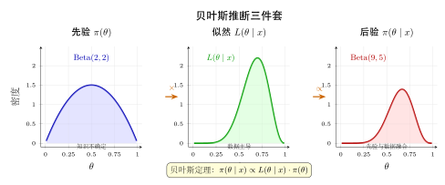
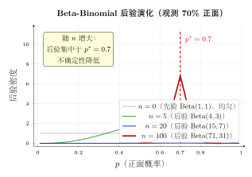
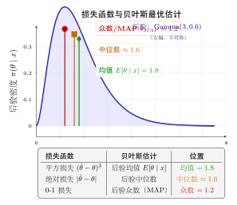

# 第 18 章 贝叶斯估计 ⭐（融合版）

> **难度**：★★★★★
> **前置知识**：第 15 章点估计（MLE）、第 16 章区间估计、贝叶斯公式（第 2 章）、常见分布族（第 5–7 章）
> **本文件**：融合"原版严格推导 + 速记 / 套路 / 直觉还原 / 自测"。保留原版完整正文（18.1–18.5 / 本章小结 / 深度学习应用 / 练习题）+ 在最前置入"一例速记 / 引入 / 思维路径还原"+ 在最后追加"方法汇总 / 方法变形 / 思考路标 / 易错点 / 典型应用例题 / 自测题 / 融合版说明"。

---

## 一例速记

> **贝叶斯三件套**：先验 $\pi(\theta)$ + 似然 $p(\mathbf{x} \mid \theta)$ → 后验 $\pi(\theta \mid \mathbf{x}) \propto p(\mathbf{x} \mid \theta)\,\pi(\theta)$（归一化常数 $p(\mathbf{x}) = \int p(\mathbf{x}\mid\theta)\pi(\theta)\,d\theta$ 常被忽略但不可遗漏）。
>
> **共轭先验三对速查**（完整表见后文）：Beta-Binomial → 后验仍 Beta；Gamma-Poisson → 后验仍 Gamma；Normal-Normal → 后验仍 Normal；参数只需"加"更新。
>
> **三种点估计对应**：平方损失 → 后验均值 $E[\theta\mid\mathbf{x}]$（MMSE）；绝对损失 → 后验中位数；0-1 损失 → 后验众数 = MAP。MAP = MLE + 正则化（高斯先验 $\Leftrightarrow$ L2；拉普拉斯先验 $\Leftrightarrow$ L1）。
>
> **信用区间 vs 置信区间**：贝叶斯可信区间说的是"$P(\theta \in [l,u]\mid\mathbf{x})=95\%$"（参数是随机的，直观）；频率置信区间说的是"重复构造区间，95% 覆盖固定真值"（参数是常数，反直觉）。
>
> **变分下界 ELBO**：当后验无解析解时，变分推断最大化 $\text{ELBO} = E_{q(\theta)}[\log p(\mathbf{x}\mid\theta)] - D_{KL}(q(\theta)\,\|\,\pi(\theta))$，用参数化分布 $q$ 近似真实后验。

---

## 引入：抛硬币 10 次——频率派 vs 贝叶斯派

> **题目**：一枚来源未知的硬币，抛 10 次得 7 次正面。
>
> **频率派直觉**：$\hat{p}_{MLE} = 7/10 = 0.7$，只凭数据，无需任何前提。
>
> **贝叶斯派的反问**：如果我们相信这枚硬币"大概是公平的"，应该给出多大的估计？
>
> 若先验取 $\text{Beta}(5, 5)$（等效于"之前见过 5 次正面、5 次反面"），后验为 $\text{Beta}(12, 8)$，后验均值 $= 12/20 = 0.6$——比 0.7 更靠近 0.5。
>
> **为什么？**  先验在"挤压"数据的估计。10 次试验的信息不足以完全推翻先验。随着数据增多，先验影响越来越弱，100 次、1000 次后两派答案趋于相同。这就是**先验的力量**，也是贝叶斯方法的核心思想：**在观测数据有限时，先验知识是无价的正则化工具**。

---

## 思维路径还原（贝叶斯更新的内心独白）

> **第 1 步：选先验** — 先问自己：在看到数据之前，我对参数 $\theta$ 有什么信念？
>
> 如果毫无先验知识 → 均匀先验 $\pi(\theta) \propto 1$；有专家经验 → 信息先验（如 Beta(2,8) 表示"历史次品率约 10-20%"）；为了计算方便 → 考虑共轭先验（查表找对应族）。**选先验是艺术，但不要因此恐惧——先验影响随 $n\to\infty$ 消失。**
>
> **第 2 步：写似然** — 数据模型决定似然。若 $x_1,\ldots,x_n\overset{iid}{\sim}\text{Pois}(\lambda)$，则 $p(\mathbf{x}\mid\lambda) \propto \lambda^{\sum x_i}e^{-n\lambda}$。关键：**只保留含 $\theta$ 的项**，常数因子扔掉（后面要归一化）。
>
> **第 3 步：写后验（正比号）** — $\pi(\theta\mid\mathbf{x}) \propto p(\mathbf{x}\mid\theta)\,\pi(\theta)$。此时做"模式识别"：把右边的 $\theta$ 的幂次、指数等配成已知分布的核函数。例如认出 $\theta^{a-1}(1-\theta)^{b-1}$ → Beta；认出 $\lambda^{a-1}e^{-b\lambda}$ → Gamma。
>
> **第 4 步：归一化** — 如果识别出已知分布族，参数直接读取即可；否则需要手动计算归一化常数 $p(\mathbf{x}) = \int p(\mathbf{x}\mid\theta)\pi(\theta)\,d\theta$，或用 MCMC / 变分推断近似。**切记：$\pi(\theta\mid\mathbf{x})$ 必须是合法概率分布，积分为 1。**
>
> **第 5 步：选估计量 + 区间** — 根据损失函数选点估计（后验均值 / 中位数 / MAP）；取后验分位数给出等尾可信区间，或求 HPD 区间（最短区间）。最后解释含义："$P(\theta\in[l,u]\mid\mathbf{x})=95\%$"——参数在区间内的后验概率。

---

## 学习目标

学完本章后，你将能够：

- 理解贝叶斯学派与频率学派在参数推断哲学上的根本区别
- 掌握先验分布、似然函数与后验分布的关系，写出贝叶斯公式的参数推断形式
- 识别并运用常见的共轭先验对，快速推导出后验分布的解析表达式
- 从后验分布中提取点估计（后验均值与 MAP 估计），理解 MAP 与 MLE 的关系
- 构造贝叶斯可信区间，并与经典置信区间的含义进行对比

---

## 18.1 贝叶斯学派与频率学派

### 18.1.1 两种推断哲学

统计推断存在两大学派，它们对"概率"和"参数"的理解截然不同。

**频率学派（Frequentist）**

- 概率是**长期频率**：事件在无限次重复试验中发生的比例。
- 参数 $\theta$ 是**固定但未知的常数**，没有概率分布。
- 典型方法：最大似然估计（MLE）、置信区间、假设检验。
- 核心问题："如果参数真的是 $\theta_0$，观测到这批数据的概率有多大？"

**贝叶斯学派（Bayesian）**

- 概率是**主观信念的度量**，反映对不确定性的认知程度。
- 参数 $\theta$ 是**随机变量**，具有概率分布，反映我们对其值的不确定性。
- 典型方法：先验 + 似然 → 后验，贝叶斯点估计，可信区间。
- 核心问题："在观测到这批数据之后，参数 $\theta$ 的分布是什么？"

### 18.1.2 两种学派的对比

| 维度 | 频率学派 | 贝叶斯学派 |
|------|---------|-----------|
| 参数 $\theta$ 的性质 | 固定未知常数 | 随机变量 |
| 先验知识 | 不使用 | 通过先验分布 $\pi(\theta)$ 融入 |
| 推断结果 | 点估计 + 置信区间 | 后验分布 $\pi(\theta \mid x)$ |
| 置信/可信区间含义 | "重复实验中 95% 的区间覆盖真值" | "参数落在区间内的概率为 95%" |
| 计算复杂度 | 通常较低 | 有时需要 MCMC 等近似方法 |
| 对样本量的依赖 | 大样本渐近理论 | 小样本也可使用，先验起关键作用 |

### 18.1.3 一个直觉例子

**问题**：一枚硬币抛了 10 次，正面 7 次。估计正面概率 $\theta$。

- **频率派 MLE**：$\hat{\theta}_{MLE} = 7/10 = 0.7$，仅凭数据。
- **贝叶斯派**：若先验认为硬币大概率公平（比如用 Beta(5,5) 先验），后验会把估计"拉向" 0.5。随着数据增多，先验影响逐渐减弱，最终两者收敛一致。

这种将**先验知识**与**数据证据**有机结合的能力，是贝叶斯方法的核心优势。

---

## 18.2 先验分布与后验分布

### 18.2.1 贝叶斯公式的参数推断形式

设参数 $\theta \in \Theta$，观测数据为 $\mathbf{x} = (x_1, x_2, \ldots, x_n)$。

贝叶斯推断的三个核心要素：

1. **先验分布** $\pi(\theta)$：观测数据之前对 $\theta$ 的信念
2. **似然函数** $L(\theta \mid \mathbf{x}) = p(\mathbf{x} \mid \theta)$：给定 $\theta$ 时数据出现的概率
3. **后验分布** $\pi(\theta \mid \mathbf{x})$：观测数据之后对 $\theta$ 的更新信念

**贝叶斯公式（参数推断形式）**：

$$
\boxed{\pi(\theta \mid \mathbf{x}) = \frac{p(\mathbf{x} \mid \theta)\, \pi(\theta)}{p(\mathbf{x})} \propto p(\mathbf{x} \mid \theta)\, \pi(\theta)}
$$

其中边际似然（归一化常数）为：

$$
p(\mathbf{x}) = \int_{\Theta} p(\mathbf{x} \mid \theta)\, \pi(\theta)\, d\theta
$$

用文字表达这一核心公式：

$$
\underbrace{\text{后验}}_{\pi(\theta|\mathbf{x})} \propto \underbrace{\text{似然}}_{{p(\mathbf{x}|\theta)}} \times \underbrace{\text{先验}}_{\pi(\theta)}
$$

### 18.2.2 先验分布的选取

先验分布的选取体现了我们在观测数据之前的知识或信念：

**无信息先验（Non-informative Prior）**

当没有任何先验知识时，希望让数据"说话"。

- **均匀先验**：$\pi(\theta) \propto 1$（在参数范围内均匀）
- **Jeffreys 先验**：$\pi(\theta) \propto \sqrt{I(\theta)}$，其中 $I(\theta)$ 为 Fisher 信息量，具有参数变换不变性

**信息先验（Informative Prior）**

当有历史数据或专家知识时，可以编码具体的先验信念：

- 历史实验结果
- 物理约束（如概率必须在 $[0,1]$）
- 专家判断

**共轭先验（Conjugate Prior）**

先验与似然属于同一分布族，使得后验也属于该分布族，计算方便。（详见 18.3 节）

### 18.2.3 贝叶斯更新

贝叶斯推断是一个**递推更新**过程：当新数据到来时，当前后验成为新的先验。

$$
\pi(\theta) \xrightarrow{\text{观测 } x_1} \pi(\theta \mid x_1) \xrightarrow{\text{观测 } x_2} \pi(\theta \mid x_1, x_2) \xrightarrow{\quad \cdots \quad} \pi(\theta \mid x_1, \ldots, x_n)
$$

这体现了贝叶斯推断的**序贯性**：无论是一次性处理所有数据，还是逐步更新，最终后验相同。

### 18.2.4 完整示例：二项模型

**设定**：$n$ 次独立伯努利试验，成功次数 $k$，参数 $\theta$（成功概率）。

**似然函数**：

$$
p(k \mid \theta) = \binom{n}{k} \theta^k (1-\theta)^{n-k}
$$

**先验**：取 $\theta \sim \text{Beta}(\alpha, \beta)$，即

$$
\pi(\theta) = \frac{\theta^{\alpha-1}(1-\theta)^{\beta-1}}{B(\alpha, \beta)}, \quad \theta \in [0,1]
$$

**后验**：

$$
\pi(\theta \mid k) \propto \theta^k(1-\theta)^{n-k} \cdot \theta^{\alpha-1}(1-\theta)^{\beta-1} = \theta^{k+\alpha-1}(1-\theta)^{n-k+\beta-1}
$$

因此后验为：

$$
\theta \mid k \sim \text{Beta}(k + \alpha,\; n - k + \beta)
$$

**直觉**：先验参数 $\alpha, \beta$ 可理解为"伪计数"（pseudo-counts）—— $\alpha$ 是虚拟的历史成功次数，$\beta$ 是虚拟的历史失败次数。

---

## 18.3 共轭先验

### 18.3.1 共轭先验的定义

**定义**：若似然函数 $p(\mathbf{x} \mid \theta)$ 属于指数族，且存在先验分布族 $\mathcal{F}$，使得对任意 $\pi(\theta) \in \mathcal{F}$，后验 $\pi(\theta \mid \mathbf{x})$ 仍属于 $\mathcal{F}$，则称 $\mathcal{F}$ 为该似然的**共轭先验族**。

共轭先验的优点：
- 后验有**解析表达式**，无需数值积分
- 参数更新规则简单，具有直观的"计数"解释
- 适合序贯更新

### 18.3.2 常见共轭先验对

| 数据模型（似然） | 参数 | 共轭先验 | 后验 |
|----------------|------|---------|------|
| 伯努利/二项 $\text{Bin}(n,\theta)$ | 成功概率 $\theta$ | $\text{Beta}(\alpha, \beta)$ | $\text{Beta}(\alpha+k, \beta+n-k)$ |
| 泊松 $\text{Pois}(\lambda)$ | 速率 $\lambda$ | $\text{Gamma}(\alpha, \beta)$ | $\text{Gamma}(\alpha+\sum x_i, \beta+n)$ |
| 正态（方差已知）$\mathcal{N}(\mu, \sigma^2)$ | 均值 $\mu$ | $\mathcal{N}(\mu_0, \tau^2)$ | $\mathcal{N}(\mu_n, \tau_n^2)$（见下） |
| 正态（均值已知）$\mathcal{N}(\mu, \sigma^2)$ | 精度 $1/\sigma^2$ | $\text{Gamma}(\alpha, \beta)$ | $\text{Gamma}(\alpha', \beta')$ |
| 多项分布 $\text{Multi}(\mathbf{p})$ | 概率向量 $\mathbf{p}$ | $\text{Dirichlet}(\boldsymbol{\alpha})$ | $\text{Dirichlet}(\boldsymbol{\alpha} + \mathbf{n})$ |
| 指数分布 $\text{Exp}(\lambda)$ | 速率 $\lambda$ | $\text{Gamma}(\alpha, \beta)$ | $\text{Gamma}(\alpha+n, \beta+\sum x_i)$ |

### 18.3.3 正态-正态共轭的详细推导

设 $x_1, \ldots, x_n \overset{iid}{\sim} \mathcal{N}(\mu, \sigma^2)$，$\sigma^2$ 已知，先验 $\mu \sim \mathcal{N}(\mu_0, \tau_0^2)$。

**后验精度**（精度 = 方差的倒数）：

$$
\frac{1}{\tau_n^2} = \frac{1}{\tau_0^2} + \frac{n}{\sigma^2}
$$

**后验均值**（先验均值与样本均值的精度加权平均）：

$$
\mu_n = \tau_n^2 \left(\frac{\mu_0}{\tau_0^2} + \frac{n\bar{x}}{\sigma^2}\right) = \frac{\frac{1}{\tau_0^2} \mu_0 + \frac{n}{\sigma^2} \bar{x}}{\frac{1}{\tau_0^2} + \frac{n}{\sigma^2}}
$$

**后验分布**：

$$
\mu \mid \mathbf{x} \sim \mathcal{N}(\mu_n, \tau_n^2)
$$

**极端情形分析**：

- 先验不确定性极大（$\tau_0^2 \to \infty$）：$\mu_n \to \bar{x}$（退化为 MLE）
- 数据量极大（$n \to \infty$）：$\mu_n \to \bar{x}$（数据主导，先验影响消失）
- 数据量极小（$n \to 0$）：$\mu_n \to \mu_0$（先验主导）

### 18.3.4 泊松-伽马共轭示例

设 $x_1, \ldots, x_n \overset{iid}{\sim} \text{Pois}(\lambda)$，先验 $\lambda \sim \text{Gamma}(\alpha, \beta)$（$\beta$ 为速率参数）。

**似然**：

$$
p(\mathbf{x} \mid \lambda) \propto \lambda^{\sum x_i} e^{-n\lambda}
$$

**先验**：

$$
\pi(\lambda) \propto \lambda^{\alpha - 1} e^{-\beta\lambda}
$$

**后验**：

$$
\pi(\lambda \mid \mathbf{x}) \propto \lambda^{\alpha + \sum x_i - 1} e^{-(\beta + n)\lambda}
$$

因此：

$$
\lambda \mid \mathbf{x} \sim \text{Gamma}\!\left(\alpha + \sum_{i=1}^n x_i,\; \beta + n\right)
$$

**直觉**：$\alpha$ 是历史观测到的事件总数，$\beta$ 是历史观测的时间单位总数。

---

## 18.4 贝叶斯点估计

### 18.4.1 从后验到点估计

后验分布 $\pi(\theta \mid \mathbf{x})$ 包含了参数的全部信息。若需要一个**点估计**，需要从后验中提取一个代表性数值。不同的损失函数导致不同的最优点估计：

| 损失函数 | 最优点估计 | 名称 |
|---------|-----------|------|
| 平方损失 $(\hat{\theta} - \theta)^2$ | 后验均值 $E[\theta \mid \mathbf{x}]$ | 贝叶斯估计量（MMSE） |
| 绝对值损失 $\vert\hat{\theta} - \theta\vert$ | 后验中位数 $\text{Med}[\theta \mid \mathbf{x}]$ | 中位数估计 |
| 0-1 损失 $\mathbf{1}[\hat{\theta} \neq \theta]$ | 后验众数 $\arg\max_\theta \pi(\theta \mid \mathbf{x})$ | MAP 估计 |

### 18.4.2 后验均值估计（MMSE）

**后验均值**（Minimum Mean Squared Error estimator）：

$$
\hat{\theta}_{MMSE} = E[\theta \mid \mathbf{x}] = \int \theta \cdot \pi(\theta \mid \mathbf{x})\, d\theta
$$

**示例**（Beta-二项模型）：

$$
\hat{\theta}_{MMSE} = E[\theta \mid k] = \frac{k + \alpha}{n + \alpha + \beta}
$$

将其写成 MLE 与先验均值的加权平均：

$$
\hat{\theta}_{MMSE} = \underbrace{\frac{n}{n + \alpha + \beta}}_{\text{数据权重}} \cdot \underbrace{\frac{k}{n}}_{\hat{\theta}_{MLE}} + \underbrace{\frac{\alpha + \beta}{n + \alpha + \beta}}_{\text{先验权重}} \cdot \underbrace{\frac{\alpha}{\alpha + \beta}}_{\text{先验均值}}
$$

这清楚地展示了贝叶斯估计是**数据与先验的折中**，数据越多，先验影响越小。

### 18.4.3 最大后验估计（MAP）

**MAP 估计**（Maximum A Posteriori）：

$$
\hat{\theta}_{MAP} = \arg\max_{\theta} \pi(\theta \mid \mathbf{x}) = \arg\max_{\theta} \left[\log p(\mathbf{x} \mid \theta) + \log \pi(\theta)\right]
$$

取对数形式更便于计算：

$$
\hat{\theta}_{MAP} = \arg\max_{\theta} \left[\underbrace{\ell(\theta)}_{\text{对数似然}} + \underbrace{\log \pi(\theta)}_{\text{对数先验（正则项）}}\right]
$$

### 18.4.4 MAP 与 MLE 的关系

**MLE** 是 MAP 在**均匀先验**下的特例：

$$
\hat{\theta}_{MLE} = \arg\max_\theta \log p(\mathbf{x} \mid \theta) = \hat{\theta}_{MAP}\big|_{\pi(\theta) \propto 1}
$$

**MAP 与正则化的等价性**（这是深度学习中的重要连接）：

**高斯先验 $\Leftrightarrow$ L2 正则化**

设先验 $\theta_j \overset{iid}{\sim} \mathcal{N}(0, \sigma_0^2)$，则

$$
\log \pi(\theta) = -\frac{1}{2\sigma_0^2} \sum_j \theta_j^2 + \text{const}
$$

MAP 目标函数：

$$
\hat{\theta}_{MAP} = \arg\max_\theta \left[\ell(\theta) - \frac{1}{2\sigma_0^2}\|\theta\|_2^2\right] = \arg\min_\theta \left[-\ell(\theta) + \frac{\lambda}{2}\|\theta\|_2^2\right]
$$

其中 $\lambda = 1/\sigma_0^2$。这正是**带 L2 正则化（权重衰减）的 MLE**。

**拉普拉斯先验 $\Leftrightarrow$ L1 正则化**

设先验 $\theta_j \overset{iid}{\sim} \text{Laplace}(0, b)$，则

$$
\log \pi(\theta) = -\frac{1}{b}\sum_j |\theta_j| + \text{const}
$$

MAP 目标函数：

$$
\hat{\theta}_{MAP} = \arg\min_\theta \left[-\ell(\theta) + \frac{\lambda}{1} \|\theta\|_1\right]
$$

其中 $\lambda = 1/b$。这正是**带 L1 正则化（LASSO）的 MLE**。

**汇总**：

$$
\begin{aligned}
\text{先验} & \quad \Leftrightarrow \quad \text{正则化} \\
\theta \sim \mathcal{N}(0, \sigma_0^2) & \quad \Leftrightarrow \quad \lambda \|\theta\|_2^2 \text{（权重衰减，Ridge）} \\
\theta \sim \text{Laplace}(0, b) & \quad \Leftrightarrow \quad \lambda \|\theta\|_1 \text{（稀疏正则，LASSO）}
\end{aligned}
$$

---

## 18.5 贝叶斯区间估计（可信区间）

### 18.5.1 可信区间的定义

**贝叶斯可信区间**（Credible Interval）与频率学派的置信区间在定义上有本质区别：

**可信区间**：给定数据 $\mathbf{x}$，区间 $[l, u]$ 满足

$$
P(l \leq \theta \leq u \mid \mathbf{x}) = 1 - \alpha
$$

含义：**参数 $\theta$ 落在 $[l, u]$ 内的概率（后验概率）为 $1-\alpha$**。

**置信区间**：不是"参数落在区间内的概率"，而是"重复构造这样的区间，其中 $1-\alpha$ 比例的区间覆盖真值"。

贝叶斯可信区间的含义更直观，也是大多数人直觉上期望置信区间所具有的含义。

### 18.5.2 等尾可信区间

最常用的是**等尾可信区间**（Equal-tailed Credible Interval）：取后验分布的 $\alpha/2$ 和 $1-\alpha/2$ 分位数。

$$
[l, u] = [Q_{\alpha/2}(\theta \mid \mathbf{x}),\; Q_{1-\alpha/2}(\theta \mid \mathbf{x})]
$$

其中 $Q_p$ 表示后验分布的 $p$ 分位数。

**示例**（正态-正态模型）：

后验 $\mu \mid \mathbf{x} \sim \mathcal{N}(\mu_n, \tau_n^2)$，95% 可信区间为：

$$
\left[\mu_n - 1.96\tau_n,\; \mu_n + 1.96\tau_n\right]
$$

### 18.5.3 最高后验密度区间（HPD）

**HPD 区间**（Highest Posterior Density Interval）：在所有长度相同的区间中，使后验概率最大的区间；等价地，它是**最短的**满足覆盖概率要求的区间。

$$
C_{HPD} = \{\theta : \pi(\theta \mid \mathbf{x}) \geq h\}
$$

其中 $h$ 选取使得 $P(\theta \in C_{HPD} \mid \mathbf{x}) = 1 - \alpha$。

- 对对称单峰分布：HPD 区间 = 等尾可信区间
- 对偏斜或多峰分布：HPD 区间更短，但可能是不连续区间

### 18.5.4 完整示例：Beta-二项可信区间

**问题**：某网站 A/B 测试，展示 $n=100$ 次，点击 $k=30$ 次。使用均匀先验 $\text{Beta}(1,1)$，构造 95% 可信区间。

**后验**：

$$
\theta \mid k \sim \text{Beta}(1+30, 1+70) = \text{Beta}(31, 71)
$$

**后验均值**：

$$
\hat{\theta}_{MMSE} = \frac{31}{31+71} = \frac{31}{102} \approx 0.304
$$

**95% 等尾可信区间**：Beta(31,71) 分布的 2.5% 和 97.5% 分位数，约为 $[0.214, 0.401]$。

含义：**在观测到这批数据后，点击率 $\theta$ 落在 $[0.214, 0.401]$ 内的概率为 95%**。

### 18.5.5 可信区间与置信区间的数值对比

在正态模型中，当使用无信息先验时，贝叶斯可信区间与频率置信区间**数值相同**，但含义不同：

| | 置信区间（频率） | 可信区间（贝叶斯） |
|--|----------------|-----------------|
| 含义 | 重复实验中 95% 覆盖 $\theta$ | $P(\theta \in I \mid \mathbf{x}) = 95\%$ |
| $\theta$ 的性质 | 固定常数 | 随机变量 |
| 先验依赖 | 无 | 有（无信息先验时近似相同） |
| 直觉性 | 较差 | 好 |

---

## 本章小结

**贝叶斯推断的核心框架**：

$$
\underbrace{\pi(\theta \mid \mathbf{x})}_{\text{后验}} \propto \underbrace{p(\mathbf{x} \mid \theta)}_{\text{似然}} \times \underbrace{\pi(\theta)}_{\text{先验}}
$$

**关键概念回顾**：

1. **两大学派的本质区别**：频率派视参数为常数，贝叶斯派视参数为随机变量，通过先验分布编码不确定性。

2. **共轭先验**：先验与似然属同一族，使后验有解析解。常见对：Beta-二项、Gamma-泊松、正态-正态。

3. **三种点估计**：
   - 后验均值（MMSE）$\leftarrow$ 最小均方误差
   - MAP 估计 $\leftarrow$ 后验众数，等价于正则化 MLE
   - 后验中位数 $\leftarrow$ 最小绝对误差

4. **MAP 与正则化的等价性**：
   - 高斯先验 $\Leftrightarrow$ L2/Ridge 正则化（权重衰减）
   - 拉普拉斯先验 $\Leftrightarrow$ L1/LASSO 正则化（稀疏性）

5. **可信区间**：直接表述"参数落在区间内的概率"，比置信区间含义更直观。

**随样本量变化的行为**：大样本下，先验影响消失，贝叶斯后验与频率派结论收敛一致（Bernstein-von Mises 定理）。小样本时，先验起到关键的"正则化"作用。

---

## 几何示意

### 图 18-1：贝叶斯三件套演化——先验 → 似然 → 后验



上图展示贝叶斯更新的直观过程：先验分布代表观测前的信念，似然函数提炼数据信息，后验分布是两者的"综合"。随着观测数增加，后验形状越来越窄、越来越集中于真实参数值。

### 图 18-2：共轭先验示例——Beta-Binomial 后验随 n 增大的演化



上图展示 $n=0$（纯先验）、$n=5$、$n=20$、$n=100$ 四条后验曲线：先验为 $\text{Beta}(2,2)$（轻微偏向公平）。随着 $n$ 增大，后验越来越尖锐，集中于真实 $\theta$，先验的形状影响逐渐消失。

### 图 18-3：损失函数 → 贝叶斯估计量三对应



上图直观展示三种损失函数与后验统计量的一一对应：平方损失对应后验均值（MMSE），绝对损失对应后验中位数，0-1 损失对应后验众数（MAP）。

---

## 抽象成方法（套路总结）

### 共轭先验完整对照表

| 似然模型 | 参数 $\theta$ | 共轭先验 | 超参更新规则 | 后验均值（MMSE） |
|---------|-------------|---------|------------|-----------------|
| $\text{Bin}(n,\theta)$ | $\theta\in(0,1)$ | $\text{Beta}(\alpha,\beta)$ | $\alpha\to\alpha+k$，$\beta\to\beta+n-k$ | $(\alpha+k)/(\alpha+\beta+n)$ |
| $\text{Pois}(\lambda)$ | $\lambda>0$ | $\text{Gamma}(\alpha,\beta)$ | $\alpha\to\alpha+\sum x_i$，$\beta\to\beta+n$ | $(\alpha+\sum x_i)/(\beta+n)$ |
| $\mathcal{N}(\mu,\sigma^2)$，$\sigma^2$ 已知 | $\mu\in\mathbb{R}$ | $\mathcal{N}(\mu_0,\tau_0^2)$ | 精度加法则（见 18.3.3） | $\mu_n$（精度加权平均） |
| $\text{Exp}(\lambda)$ | $\lambda>0$ | $\text{Gamma}(\alpha,\beta)$ | $\alpha\to\alpha+n$，$\beta\to\beta+\sum x_i$ | $(\alpha+n)/(\beta+\sum x_i)$ |
| $\text{Multi}(\mathbf{p})$ | $\mathbf{p}\in\Delta^{K-1}$ | $\text{Dir}(\boldsymbol{\alpha})$ | $\alpha_k\to\alpha_k+n_k$ | $(\alpha_k+n_k)/(\sum_j\alpha_j+n)$ |

### 贝叶斯估计 5 步流程

```
1. 选先验  π(θ)         ─── 无信息 / 共轭 / 信息先验
         ↓
2. 写似然  p(x|θ)       ─── 仅保留含 θ 的因子
         ↓
3. 写后验  π(θ|x) ∝ ?  ─── 识别核函数 → 归一化 → 得后验族
         ↓
4. 选估计量              ─── 后验均值(MMSE) / 后验中位数 / MAP
         ↓
5. 区间估计             ─── 等尾可信区间 / HPD 区间
```

### 损失函数 → 最优估计量对应表

| 损失函数 $L(\hat\theta, \theta)$ | 最优贝叶斯估计量 | 后验统计量 | 计算方式 |
|--------------------------------|----------------|----------|---------|
| $(\hat\theta-\theta)^2$（平方） | $\hat\theta_{MMSE}$ | 后验均值 | $E[\theta\mid\mathbf{x}]$ |
| $\vert \hat\theta-\theta\vert$（绝对值） | $\hat\theta_{Med}$ | 后验中位数 | $F_{\theta\mid\mathbf{x}}^{-1}(0.5)$ |
| $\mathbf{1}[\hat\theta\neq\theta]$（0-1） | $\hat\theta_{MAP}$ | 后验众数 | $\arg\max_\theta\,\pi(\theta\mid\mathbf{x})$ |

---

## 方法变形

### 变形 1：非共轭情形（MCMC）

当先验与似然不共轭，后验无解析表达式时，采用**马尔可夫链蒙特卡洛（MCMC）**：

- **Metropolis-Hastings**：提议 → 接受/拒绝，保证平稳分布为目标后验
- **吉布斯采样**：对每个参数条件后验轮流采样（需要各参数的完全条件分布）
- **Hamiltonian Monte Carlo（HMC）**：利用梯度信息高效探索后验（Stan / PyMC 默认）

使用场景：复杂层次模型、非标准似然、高维参数空间。

### 变形 2：经验贝叶斯（用数据估计先验）

经典贝叶斯需要人为指定超参数（如 $\alpha, \beta$）；**经验贝叶斯**用数据本身估计超参数：

$$
\hat{\alpha}, \hat{\beta} = \arg\max_{\alpha,\beta} p(\mathbf{x}; \alpha, \beta) = \arg\max_{\alpha,\beta} \int p(\mathbf{x}\mid\theta)\,\pi(\theta;\alpha,\beta)\,d\theta
$$

即最大化**边际似然**（又称证据）来选先验。优点：无需主观指定超参；缺点：双重用数据（估计先验 + 计算后验），理论上有循环嫌疑，但实践效果好。

### 变形 3：层次贝叶斯（Hierarchical Bayes）

对超参数再施加先验，形成多层结构：

$$
\text{数据层}: \quad x_i \mid \theta_i \sim p(x_i\mid\theta_i) \\
\text{参数层}: \quad \theta_i \mid \phi \sim \pi(\theta_i\mid\phi) \\
\text{超参数层}: \quad \phi \sim p(\phi)
$$

典型应用：多组数据的部分池化（partial pooling）——各组有独立参数 $\theta_i$，但通过公共超参数 $\phi$ 相互借鉴信息。避免了"完全独立"与"完全合并"两个极端。

### 变形 4：变分贝叶斯（Variational Bayes）

用参数化分布 $q_\phi(\theta)$ 近似真实后验 $\pi(\theta\mid\mathbf{x})$，最小化 KL 散度：

$$
\phi^* = \arg\min_\phi D_{KL}(q_\phi(\theta)\,\|\,\pi(\theta\mid\mathbf{x}))
$$

等价地，最大化**证据下界（ELBO）**：

$$
\text{ELBO}(\phi) = E_{q_\phi}[\log p(\mathbf{x}\mid\theta)] - D_{KL}(q_\phi(\theta)\,\|\,\pi(\theta))
$$

优点：确定性优化，比 MCMC 快；缺点：近似质量依赖 $q$ 的表达能力（通常假设均场分解）。变分自编码器（VAE）正是此框架在深度生成模型中的应用。

---

## 思考路标（条件反射）

1. 看到"贝叶斯估计" → 先问：先验是什么？似然是什么？后验 $\propto$ 似然 $\times$ 先验。
2. 看到 Beta 先验 + 二项似然 → 后验仍 Beta，参数直接相加；**不要**重新推导。
3. 看到 MAP 估计 → 联想正则化：高斯先验 $\to$ L2，拉普拉斯先验 $\to$ L1。
4. 看到"95% 可信区间" → 直接说"$P(\theta\in[l,u]\mid\mathbf{x})=0.95$"，不要混淆频率置信区间说法。
5. 看到"后验均值 vs MAP" → 对称分布二者相等；偏斜分布（如 Gamma）二者不同，均值 $\neq$ 众数。
6. 看到大样本 $n\to\infty$ → 先验影响消失，后验趋于点质量，与 MLE 一致（Bernstein-von Mises）。
7. 看到小样本 + 强先验 → 先验主导；此时先验选择至关重要，要谨慎。
8. 看到"归一化常数 $p(\mathbf{x})$" → 在共轭模型中可忽略（识别核函数即可）；非共轭时必须数值计算或近似。
9. 看到"经验贝叶斯" → 用边际似然估计超参数，是"自适应先验"的工程妥协。
10. 看到"ELBO" → 变分推断的目标函数，等于对数边际似然减去近似误差（KL 散度）。
11. 看到贝叶斯神经网络 / MC Dropout → 权重有后验分布，预测是后验预测分布的积分，不是单点预测。
12. 看到 Jeffreys 先验 → 参数变换不变的无信息先验，$\pi(\theta)\propto\sqrt{I(\theta)}$，注意与均匀先验的区别。

---

## 易错点

1. **先验选择的主观性不等于"随意"**：先验应基于合理知识（物理约束、历史数据、专家判断），不能无中生有；且应做先验敏感性分析，检验结论是否随先验变化而剧变。

2. **后验 $\propto$ 似然 $\times$ 先验，但要归一化**：正比号两边差一个归一化常数 $p(\mathbf{x}) = \int p(\mathbf{x}\mid\theta)\pi(\theta)d\theta$。共轭模型下可用分布族性质直接归一化；非共轭模型必须数值处理。忽略归一化会导致后验"积分不为 1"的错误。

3. **MAP $\neq$ 后验均值**：MAP 是后验众数（最高点），后验均值是积分加权平均。对称单峰分布（如正态后验）二者相等；偏斜分布（如 Beta、Gamma 后验）MAP $<$ 均值（右偏情形）。混淆二者会导致错误的点估计。

4. **可信区间 vs 置信区间语义不同**：贝叶斯可信区间说的是"给定数据后参数在此区间的概率"；频率置信区间说的是"重复实验中区间覆盖固定真值的频率"。二者数值上在无信息先验下可以相同，但含义截然不同，不能混用语句。

5. **伪计数（pseudo-count）理解**：Beta 先验中 $\alpha$ 和 $\beta$ 是"虚拟成功次数"和"虚拟失败次数"。当 $\alpha=\beta=1$ 时，先验是均匀分布（无信息先验，相当于 0 次历史观测）；当 $\alpha=5, \beta=5$ 时，相当于"历史上见过 10 次试验，各半"。误解 $\alpha-1$ 才是伪计数（是 Gamma 分布参数和众数公式里 $\alpha-1$ 的来源）是常见错误。

6. **损失函数决定估计量**：不同问题场景应选不同估计量。医学诊断中高估漏检代价（非对称损失）时，既不用后验均值也不用 MAP，需要定制损失函数。不加分析地使用后验均值是方法论错误。

---

## 典型应用例题

### 例 1：Beta-Binomial 后验推导与点估计

> **题目**：某品牌手机的缺陷率 $\theta$ 未知。品控部门根据历史经验，给出先验 $\theta\sim\text{Beta}(3, 27)$（等效于历史见过 3 件次品、27 件合格品）。今抽检 50 件，发现 2 件次品。
>
> (1) 写出后验分布；(2) 计算后验均值（MMSE）和 MAP 估计；(3) 构造 95% 等尾可信区间（用分位数符号表示）；(4) 解释先验的作用。

**【思路】** 二项似然 + Beta 先验 → 共轭，后验直接读参数。

**【解】**

(1) **后验分布**：

$$
\pi(\theta \mid k=2,\, n=50) = \text{Beta}(3+2,\; 27+48) = \text{Beta}(5,\; 75)
$$

(2) **点估计**：

$$
\hat\theta_{MMSE} = \frac{5}{5+75} = \frac{5}{80} = 0.0625
$$

MAP（Beta 分布众数公式 $(\alpha-1)/(\alpha+\beta-2)$）：

$$
\hat\theta_{MAP} = \frac{5-1}{5+75-2} = \frac{4}{78} \approx 0.0513
$$

MLE（仅凭数据）：$\hat\theta_{MLE} = 2/50 = 0.04$。

(3) **95% 等尾可信区间**：

$$
[Q_{0.025}(\text{Beta}(5,75)),\; Q_{0.975}(\text{Beta}(5,75))]
$$

(4) **先验的作用**：先验 $\text{Beta}(3,27)$ 提供了相当于 30 件历史样本的信息，先验均值为 $3/30=0.1$。50 件新数据的 MLE 为 0.04，后验均值 0.0625 是在 MLE 和先验均值之间"折中"。先验起到了正则化作用，防止小样本时 MLE 的过度偏差。

**【答案框】** $\text{Beta}(5,75)$；后验均值 $0.0625$；MAP $\approx 0.051$；MLE $0.04$。

---

### 例 2：正态-正态后验与可信区间

> **题目**：某仪器测量某物理量 $\mu$（已知测量噪声 $\sigma^2=4$）。历史经验给先验 $\mu\sim\mathcal{N}(10, 9)$（即 $\mu_0=10$，$\tau_0^2=9$）。进行 $n=9$ 次独立测量，样本均值 $\bar{x}=12.5$。
>
> (1) 求后验分布参数；(2) 求 90% 等尾可信区间；(3) 若 $n\to\infty$，后验趋于什么？

**【思路】** 正态-正态共轭，用精度加法则。

**【解】**

(1) **后验精度**：

$$
\frac{1}{\tau_n^2} = \frac{1}{9} + \frac{9}{4} = \frac{4}{36} + \frac{81}{36} = \frac{85}{36}
\quad\Rightarrow\quad \tau_n^2 = \frac{36}{85} \approx 0.424
$$

**后验均值**（精度加权平均）：

$$
\mu_n = \tau_n^2\!\left(\frac{10}{9} + \frac{9\times12.5}{4}\right) = \frac{36}{85}\!\left(\frac{10}{9} + \frac{112.5}{4}\right) = \frac{36}{85}\cdot\frac{40+1012.5}{36} = \frac{1052.5}{85} \approx 12.38
$$

后验：$\mu\mid\mathbf{x}\sim\mathcal{N}(12.38,\; 0.424)$。

(2) **90% 等尾可信区间**（$z_{0.05}=1.645$）：

$$
\left[12.38 - 1.645\times\sqrt{0.424},\; 12.38 + 1.645\times\sqrt{0.424}\right] \approx [11.31,\; 13.45]
$$

(3) **渐近行为**：$n\to\infty$ 时，$\frac{n}{\sigma^2}\gg\frac{1}{\tau_0^2}$，故 $\tau_n^2\to 0$，$\mu_n\to\bar{x}$。后验收缩为点质量，等价于 MLE。体现了**Bernstein-von Mises 定理**：大样本下贝叶斯和频率派结论一致。

**【答案框】** $\mu\mid\mathbf{x}\sim\mathcal{N}(12.38, 0.424)$；90% 区间约 $[11.31, 13.45]$；$n\to\infty$ 后验均值 $\to\bar{x}$。

---

### 例 3：损失函数选估计量

> **题目**：后验分布为 $\theta\mid\mathbf{x}\sim\text{Gamma}(3, 1)$（形状 3，速率 1）。分别求三种损失函数下的最优点估计。

**【思路】** $\text{Gamma}(\alpha,\beta)$ 的均值 $= \alpha/\beta$，中位数无封闭解（近似 $\approx (\alpha-1/3)/\beta$），众数 $= (\alpha-1)/\beta$（$\alpha\geq 1$）。

**【解】**

Gamma(3, 1) 的三个统计量（$\alpha=3$，$\beta=1$）：

$$
\text{均值} = \frac{3}{1} = 3.0
$$

$$
\text{众数（MAP）} = \frac{3-1}{1} = 2.0
$$

$$
\text{中位数} \approx \frac{3-1/3}{1} \approx 2.67 \quad\text{（近似公式）}
$$

对应损失函数：

| 损失函数 | 最优估计 | 数值 |
|---------|---------|-----|
| 平方损失 $(\hat\theta-\theta)^2$ | 后验均值 | $3.0$ |
| 绝对损失 $\vert \hat\theta-\theta\vert$ | 后验中位数 | $\approx 2.67$ |
| 0-1 损失（MAP） | 后验众数 | $2.0$ |

**结论**：Gamma(3,1) 右偏，导致均值 > 中位数 > 众数（MAP）。**三者差距显著**，在偏斜后验下不能混用。选哪个取决于实际决策中的损失结构。

---

## 深度学习应用：正则化的贝叶斯解释

### 权重衰减即高斯先验

在深度学习中，L2 正则化（权重衰减）是最常用的防过拟合手段。贝叶斯框架揭示了其本质：**对网络权重施加零均值高斯先验**。

设神经网络参数为 $\mathbf{w}$，训练数据为 $\mathcal{D} = \{(\mathbf{x}_i, y_i)\}_{i=1}^n$。

**MLE 目标**（无正则化）：

$$
\hat{\mathbf{w}}_{MLE} = \arg\max_{\mathbf{w}} \log p(\mathcal{D} \mid \mathbf{w}) = \arg\min_{\mathbf{w}} \mathcal{L}(\mathbf{w})
$$

**MAP 目标**（高斯先验 $\mathbf{w} \sim \mathcal{N}(\mathbf{0}, \sigma_0^2 \mathbf{I})$）：

$$
\hat{\mathbf{w}}_{MAP} = \arg\min_{\mathbf{w}} \left[\mathcal{L}(\mathbf{w}) + \frac{1}{2\sigma_0^2} \|\mathbf{w}\|_2^2\right] = \arg\min_{\mathbf{w}} \left[\mathcal{L}(\mathbf{w}) + \frac{\lambda}{2} \|\mathbf{w}\|_2^2\right]
$$

其中正则化系数 $\lambda = 1/\sigma_0^2$：

- $\sigma_0^2$ 越小（先验方差小，强烈认为权重接近0）$\Rightarrow$ $\lambda$ 越大（强正则化）
- $\sigma_0^2$ 越大（先验方差大，对权重无约束）$\Rightarrow$ $\lambda$ 越小（弱正则化）

### L1 正则化即拉普拉斯先验

若对权重施加拉普拉斯先验 $w_j \sim \text{Laplace}(0, b)$，MAP 估计等价于 L1 正则化：

$$
\hat{\mathbf{w}}_{MAP} = \arg\min_{\mathbf{w}} \left[\mathcal{L}(\mathbf{w}) + \frac{1}{b} \|\mathbf{w}\|_1\right]
$$

L1 正则化倾向于产生**稀疏解**（许多权重精确为零），对应于拉普拉斯分布在零点处的尖峰。

### PyTorch 实现对比

```python
import torch
import torch.nn as nn
import torch.optim as optim

# ============================================================
# 1. 标准训练（MLE，对应均匀先验）
# ============================================================

class SimpleNet(nn.Module):
    def __init__(self, input_dim, hidden_dim, output_dim):
        super().__init__()
        self.net = nn.Sequential(
            nn.Linear(input_dim, hidden_dim),
            nn.ReLU(),
            nn.Linear(hidden_dim, output_dim)
        )

    def forward(self, x):
        return self.net(x)


def train_mle(model, optimizer, X, y, epochs=100):
    """MLE 训练：最大化对数似然（最小化交叉熵损失）"""
    criterion = nn.CrossEntropyLoss()
    for epoch in range(epochs):
        optimizer.zero_grad()
        loss = criterion(model(X), y)   # 仅数据项，无正则
        loss.backward()
        optimizer.step()
    return model


# ============================================================
# 2. L2 正则化训练（MAP，对应高斯先验）
#    在 SGD/Adam 中通过 weight_decay 参数实现
# ============================================================

def train_map_l2(model, X, y, weight_decay=1e-4, epochs=100):
    """
    MAP 训练（高斯先验）：
    weight_decay = lambda = 1 / sigma_0^2
    损失 = 交叉熵 + (lambda/2) * ||w||^2
    """
    # PyTorch 的 weight_decay 直接实现 L2 正则化
    optimizer = optim.SGD(model.parameters(), lr=0.01,
                          weight_decay=weight_decay)
    criterion = nn.CrossEntropyLoss()

    for epoch in range(epochs):
        optimizer.zero_grad()
        loss = criterion(model(X), y)
        loss.backward()
        optimizer.step()
    return model


# ============================================================
# 3. L2 正则化的手动实现（等价方式，便于理解）
# ============================================================

def train_map_l2_manual(model, X, y, lam=1e-4, epochs=100):
    """
    手动添加 L2 正则项，等价于高斯先验 MAP
    对应贝叶斯公式：log 后验 = log 似然 + log 先验
                               = -CrossEntropy  - (lambda/2)||w||^2
    """
    optimizer = optim.SGD(model.parameters(), lr=0.01)
    criterion = nn.CrossEntropyLoss()

    for epoch in range(epochs):
        optimizer.zero_grad()

        # 数据项（对数似然）
        data_loss = criterion(model(X), y)

        # 正则项（高斯先验的负对数：-log N(w;0,sigma^2) ∝ lambda/2 * ||w||^2）
        l2_reg = sum(p.pow(2).sum() for p in model.parameters())
        reg_loss = (lam / 2) * l2_reg

        # 总损失 = 负对数后验
        loss = data_loss + reg_loss
        loss.backward()
        optimizer.step()

    return model


# ============================================================
# 4. L1 正则化（MAP，对应拉普拉斯先验）
# ============================================================

def train_map_l1(model, X, y, lam=1e-4, epochs=100):
    """
    手动添加 L1 正则项，等价于拉普拉斯先验 MAP
    L1 正则化导致权重稀疏（部分权重精确为零）
    """
    optimizer = optim.SGD(model.parameters(), lr=0.01)
    criterion = nn.CrossEntropyLoss()

    for epoch in range(epochs):
        optimizer.zero_grad()

        data_loss = criterion(model(X), y)

        # L1 正则项（拉普拉斯先验：-log Laplace(w;0,b) ∝ (1/b)||w||_1）
        l1_reg = sum(p.abs().sum() for p in model.parameters())
        loss = data_loss + lam * l1_reg

        loss.backward()
        optimizer.step()

    return model


# ============================================================
# 5. 验证正则化强度与先验方差的对应关系
# ============================================================

def bayesian_interpretation(weight_decay):
    """
    展示正则化系数 lambda 与高斯先验方差 sigma_0^2 的对应关系
    lambda = 1 / sigma_0^2
    sigma_0 越小 -> 权重越靠近零 -> 防过拟合能力越强
    """
    sigma_0_squared = 1.0 / weight_decay
    sigma_0 = sigma_0_squared ** 0.5
    print(f"weight_decay (lambda) = {weight_decay}")
    print(f"等价高斯先验: w ~ N(0, {sigma_0_squared:.4f})")
    print(f"先验标准差 sigma_0 = {sigma_0:.4f}")
    print(f"含义: 期望权重绝对值约为 {sigma_0:.4f}")


# 示例运行
bayesian_interpretation(weight_decay=1e-4)
# weight_decay (lambda) = 0.0001
# 等价高斯先验: w ~ N(0, 10000.0000)
# 先验标准差 sigma_0 = 100.0000
# 含义: 期望权重绝对值约为 100.0000

bayesian_interpretation(weight_decay=1e-2)
# weight_decay (lambda) = 0.01
# 等价高斯先验: w ~ N(0, 100.0000)
# 先验标准差 sigma_0 = 10.0000
# 含义: 期望权重绝对值约为 10.0000
```

### 贝叶斯神经网络简介

标准神经网络训练给出**点估计** $\hat{\mathbf{w}}$（MAP 或 MLE），无法量化预测不确定性。**贝叶斯神经网络**（Bayesian Neural Network, BNN）则学习权重的**后验分布** $p(\mathbf{w} \mid \mathcal{D})$，从而：

1. **量化不确定性**：预测时给出置信度，而非单一数值
2. **防止过拟合**：后验分布天然具有正则化效果
3. **小数据友好**：先验在数据稀少时提供合理偏置

**预测分布**（对新样本 $\mathbf{x}^*$）：

$$
p(y^* \mid \mathbf{x}^*, \mathcal{D}) = \int p(y^* \mid \mathbf{x}^*, \mathbf{w})\, p(\mathbf{w} \mid \mathcal{D})\, d\mathbf{w}
$$

由于精确积分不可行，实践中常用：
- **变分推断**（Variational Inference）：用参数化分布 $q_\phi(\mathbf{w})$ 近似后验
- **蒙特卡洛 Dropout**：训练和预测时保留 Dropout，每次前向传播近似从后验采样
- **深度集成**（Deep Ensembles）：训练多个独立网络，以集成逼近后验预测分布

```python
import torch
import torch.nn as nn

# Monte Carlo Dropout：简单实用的贝叶斯近似
class MCDropoutNet(nn.Module):
    def __init__(self, input_dim, hidden_dim, output_dim, dropout_p=0.5):
        super().__init__()
        self.net = nn.Sequential(
            nn.Linear(input_dim, hidden_dim),
            nn.ReLU(),
            nn.Dropout(p=dropout_p),   # 预测时也保持 Dropout 开启
            nn.Linear(hidden_dim, output_dim)
        )

    def forward(self, x):
        return self.net(x)

    def predict_with_uncertainty(self, x, n_samples=100):
        """
        通过多次前向传播（每次 Dropout 随机）近似后验预测分布
        返回预测均值和方差（不确定性量化）
        """
        self.train()   # 保持训练模式以启用 Dropout
        preds = torch.stack([self.net(x) for _ in range(n_samples)])
        mean = preds.mean(dim=0)       # 预测均值
        variance = preds.var(dim=0)    # 预测方差（不确定性）
        return mean, variance
```

---

## 练习题

**练习 18.1**（先验与后验）

某工厂生产的零件中，次品率 $\theta$ 未知。根据历史经验，先验分布为 $\theta \sim \text{Beta}(2, 18)$。现从该批产品中随机抽取 50 件，发现 4 件次品。

(1) 写出后验分布 $\pi(\theta \mid \text{数据})$；

(2) 计算后验均值和后验方差；

(3) 计算 95% 等尾贝叶斯可信区间（用 Beta 分布分位数表示即可）。

---

**练习 18.2**（共轭先验）

设 $X_1, \ldots, X_n \overset{iid}{\sim} \text{Pois}(\lambda)$，先验 $\lambda \sim \text{Gamma}(\alpha_0, \beta_0)$（$\beta_0$ 为速率参数）。

(1) 推导后验分布 $\pi(\lambda \mid \mathbf{x})$；

(2) 写出后验均值估计 $\hat{\lambda}_{MMSE}$，并将其表示为先验均值与样本均值的加权平均；

(3) 当 $\alpha_0 = 1, \beta_0 = 1$（接近无信息先验），$n=10$，$\sum x_i = 25$ 时，计算 $\hat{\lambda}_{MMSE}$ 和 $\hat{\lambda}_{MAP}$。

---

**练习 18.3**（MAP 与正则化）

设线性回归模型 $y = \mathbf{w}^\top \mathbf{x} + \varepsilon$，$\varepsilon \sim \mathcal{N}(0, \sigma^2)$，对参数 $\mathbf{w}$ 的每个分量施加独立先验 $w_j \sim \mathcal{N}(0, \tau^2)$。

(1) 写出对数后验 $\log \pi(\mathbf{w} \mid \mathbf{X}, \mathbf{y})$（忽略与 $\mathbf{w}$ 无关的常数）；

(2) 证明 MAP 估计等价于带 L2 正则化的最小二乘：

$$\hat{\mathbf{w}}_{MAP} = \arg\min_{\mathbf{w}} \left[\|\mathbf{y} - \mathbf{X}\mathbf{w}\|_2^2 + \lambda\|\mathbf{w}\|_2^2\right]$$

并给出 $\lambda$ 与 $\sigma^2, \tau^2$ 的关系；

(3) 写出 MAP 估计的解析解（Ridge 回归解）。

---

**练习 18.4**（正态-正态模型）

某学生进行 $n$ 次独立测量，得到数据 $x_1, \ldots, x_n$，模型为 $x_i \sim \mathcal{N}(\mu, \sigma^2)$（$\sigma^2 = 4$ 已知）。先验 $\mu \sim \mathcal{N}(10, 9)$。

(1) 写出后验分布 $\mu \mid \mathbf{x}$ 的参数（均值 $\mu_n$ 和方差 $\tau_n^2$）；

(2) 设 $n = 9$，$\bar{x} = 12$，计算 $\mu_n$ 和 $\tau_n^2$；

(3) 计算 90% 贝叶斯可信区间；

(4) 随 $n \to \infty$，后验均值 $\mu_n$ 趋向什么？这体现了贝叶斯推断的什么性质？

---

**练习 18.5**（综合：贝叶斯决策）

在二分类问题中，类别先验为 $P(Y=1) = 0.3$，$P(Y=0) = 0.7$。特征 $X \mid Y=1 \sim \mathcal{N}(2, 1)$，$X \mid Y=0 \sim \mathcal{N}(0, 1)$。

(1) 写出后验概率 $P(Y=1 \mid X=x)$（用贝叶斯公式）；

(2) 计算 $P(Y=1 \mid X=1)$；

(3) 若使用 MAP 决策规则（选择后验概率更大的类别），求决策边界 $x^*$；

(4) 若改变类别先验为 $P(Y=1) = 0.5$，决策边界如何变化？这对应贝叶斯框架中哪个要素的改变？

---

## 练习答案

<details>
<summary>点击展开 练习 18.1 答案</summary>

**(1) 后验分布**

似然：$p(\text{数据} \mid \theta) \propto \theta^4 (1-\theta)^{46}$

先验：$\pi(\theta) \propto \theta^{2-1}(1-\theta)^{18-1} = \theta^1(1-\theta)^{17}$

后验：

$$
\pi(\theta \mid \text{数据}) \propto \theta^{4+1}(1-\theta)^{46+17} = \theta^5(1-\theta)^{63}
$$

即 $\theta \mid \text{数据} \sim \text{Beta}(6, 64)$。

**(2) 后验均值和方差**

$$
E[\theta \mid \text{数据}] = \frac{6}{6+64} = \frac{6}{70} \approx 0.0857
$$

$$
\text{Var}[\theta \mid \text{数据}] = \frac{6 \times 64}{70^2 \times 71} = \frac{384}{347900} \approx 0.001104
$$

**(3) 95% 等尾可信区间**

$$
[Q_{0.025}(\text{Beta}(6,64)),\; Q_{0.975}(\text{Beta}(6,64))]
$$

数值约为 $[0.032, 0.174]$（可通过查表或 Python `scipy.stats.beta.interval(0.95, 6, 64)` 计算）。

</details>

---

<details>
<summary>点击展开 练习 18.2 答案</summary>

**(1) 后验分布**

$$
\pi(\lambda \mid \mathbf{x}) \propto \lambda^{\sum x_i} e^{-n\lambda} \cdot \lambda^{\alpha_0-1} e^{-\beta_0 \lambda} = \lambda^{\alpha_0 + \sum x_i - 1} e^{-(\beta_0 + n)\lambda}
$$

故 $\lambda \mid \mathbf{x} \sim \text{Gamma}(\alpha_0 + \sum x_i,\; \beta_0 + n)$。

**(2) 后验均值**

$$
\hat{\lambda}_{MMSE} = \frac{\alpha_0 + \sum x_i}{\beta_0 + n} = \frac{\beta_0}{\beta_0 + n} \cdot \frac{\alpha_0}{\beta_0} + \frac{n}{\beta_0 + n} \cdot \bar{x}
$$

其中 $\alpha_0/\beta_0$ 为先验均值，$\bar{x} = \sum x_i / n$ 为样本均值，权重为 $\beta_0/(\beta_0+n)$ 和 $n/(\beta_0+n)$。

**(3) 数值计算**

$\alpha_0=1, \beta_0=1, n=10, \sum x_i=25$：

后验为 $\text{Gamma}(26, 11)$。

$$
\hat{\lambda}_{MMSE} = \frac{26}{11} \approx 2.364
$$

$$
\hat{\lambda}_{MAP} = \frac{\alpha_0 + \sum x_i - 1}{\beta_0 + n} = \frac{25}{11} \approx 2.273
$$

（MAP 是 Gamma 分布的众数：$(\alpha-1)/\beta$）

</details>

---

<details>
<summary>点击展开 练习 18.3 答案</summary>

**(1) 对数后验**

$$
\log \pi(\mathbf{w} \mid \mathbf{X}, \mathbf{y}) = \log p(\mathbf{y} \mid \mathbf{X}, \mathbf{w}) + \log \pi(\mathbf{w}) + \text{const}
$$

$$
= -\frac{1}{2\sigma^2}\|\mathbf{y} - \mathbf{X}\mathbf{w}\|_2^2 - \frac{1}{2\tau^2}\|\mathbf{w}\|_2^2 + \text{const}
$$

**(2) MAP 等价于 Ridge 回归**

$$
\hat{\mathbf{w}}_{MAP} = \arg\max_{\mathbf{w}} \log \pi(\mathbf{w} \mid \mathbf{X}, \mathbf{y}) = \arg\min_{\mathbf{w}} \left[\frac{1}{2\sigma^2}\|\mathbf{y} - \mathbf{X}\mathbf{w}\|_2^2 + \frac{1}{2\tau^2}\|\mathbf{w}\|_2^2\right]
$$

乘以 $2\sigma^2$，等价于：

$$
\hat{\mathbf{w}}_{MAP} = \arg\min_{\mathbf{w}} \left[\|\mathbf{y} - \mathbf{X}\mathbf{w}\|_2^2 + \frac{\sigma^2}{\tau^2}\|\mathbf{w}\|_2^2\right]
$$

故 $\lambda = \sigma^2 / \tau^2$：噪声方差与先验方差之比。

**(3) 解析解**

令梯度为零：

$$
\hat{\mathbf{w}}_{MAP} = (\mathbf{X}^\top \mathbf{X} + \lambda \mathbf{I})^{-1} \mathbf{X}^\top \mathbf{y}
$$

这正是 Ridge 回归的解析解。矩阵 $\mathbf{X}^\top\mathbf{X} + \lambda\mathbf{I}$ 总是可逆的（$\lambda > 0$），因此解存在唯一。

</details>

---

<details>
<summary>点击展开 练习 18.4 答案</summary>

**(1) 后验参数**

$$
\frac{1}{\tau_n^2} = \frac{1}{\tau_0^2} + \frac{n}{\sigma^2} = \frac{1}{9} + \frac{n}{4}
$$

$$
\mu_n = \tau_n^2\left(\frac{\mu_0}{\tau_0^2} + \frac{n\bar{x}}{\sigma^2}\right) = \tau_n^2\left(\frac{10}{9} + \frac{n\bar{x}}{4}\right)
$$

**(2) 数值计算**（$n=9$，$\bar{x}=12$）

$$
\frac{1}{\tau_n^2} = \frac{1}{9} + \frac{9}{4} = \frac{4}{36} + \frac{81}{36} = \frac{85}{36}
$$

$$
\tau_n^2 = \frac{36}{85} \approx 0.424
$$

$$
\mu_n = \frac{36}{85}\left(\frac{10}{9} + \frac{9 \times 12}{4}\right) = \frac{36}{85}\left(\frac{10}{9} + 27\right) = \frac{36}{85} \times \frac{253}{9} = \frac{36 \times 253}{85 \times 9} = \frac{9108}{765} \approx 11.91
$$

**(3) 90% 可信区间**

$$
\left[\mu_n \pm 1.645\sqrt{\tau_n^2}\right] = \left[11.91 \pm 1.645 \times 0.651\right] \approx [10.84, 12.98]
$$

**(4) 渐近行为**

当 $n \to \infty$，$\frac{n}{\sigma^2} \to \infty$，故 $\tau_n^2 \to 0$，$\mu_n \to \bar{x}$。

后验均值趋向样本均值，即 MLE 估计。这体现了**贝叶斯推断的相合性**：随着数据增多，先验影响逐渐被"冲淡"，后验集中于真实参数值（Bernstein-von Mises 定理）。

</details>

---

<details>
<summary>点击展开 练习 18.5 答案</summary>

**(1) 后验概率**

由贝叶斯公式：

$$
P(Y=1 \mid X=x) = \frac{P(X=x \mid Y=1) P(Y=1)}{P(X=x \mid Y=1)P(Y=1) + P(X=x \mid Y=0)P(Y=0)}
$$

$$
= \frac{0.3 \cdot \frac{1}{\sqrt{2\pi}} e^{-(x-2)^2/2}}{0.3 \cdot \frac{1}{\sqrt{2\pi}} e^{-(x-2)^2/2} + 0.7 \cdot \frac{1}{\sqrt{2\pi}} e^{-x^2/2}}
$$

**(2) 计算 $P(Y=1 \mid X=1)$**

代入 $x=1$：

$$
P(Y=1 \mid X=1) = \frac{0.3 \cdot e^{-(1-2)^2/2}}{0.3 \cdot e^{-1/2} + 0.7 \cdot e^{-1/2}} = \frac{0.3}{0.3 + 0.7} = \frac{0.3}{1.0} = 0.3
$$

（此处 $x=1$ 恰好是两个高斯密度相等的点，后验概率等于类别先验。）

**(3) 决策边界**（$P(Y=1)=0.3$）

决策边界满足 $P(Y=1 \mid X=x^*) = P(Y=0 \mid X=x^*)$，即：

$$
0.3 \cdot e^{-(x^*-2)^2/2} = 0.7 \cdot e^{-(x^*)^2/2}
$$

两边取对数：

$$
\ln 0.3 - \frac{(x^*-2)^2}{2} = \ln 0.7 - \frac{(x^*)^2}{2}
$$

展开：

$$
\ln 0.3 - \frac{x^{*2} - 4x^* + 4}{2} = \ln 0.7 - \frac{x^{*2}}{2}
$$

$$
\ln 0.3 - 2 + 2x^* = \ln 0.7
$$

$$
x^* = \frac{\ln(0.7/0.3) + 2}{2} = \frac{\ln(7/3) + 2}{2} = \frac{0.847 + 2}{2} \approx 1.424
$$

**(4) 改变先验至 $P(Y=1)=0.5$**

$$
x^* = \frac{\ln(0.5/0.5) + 2}{2} = \frac{0 + 2}{2} = 1.0
$$

决策边界从约 $1.424$ 移至 $1.0$，**向 $Y=1$ 类的中心靠近**（因为两类先验相等，仅由似然决定边界，边界取在两高斯均值的中点）。

这对应贝叶斯框架中**先验分布**的改变：先验 $P(Y=1)$ 从 0.3 增大到 0.5，提高了对 $Y=1$ 的信念，使模型更倾向于预测 $Y=1$，决策边界向 $Y=0$ 一侧移动。

</details>

---

## 自测题

**自测 1**　先验 $\theta\sim\text{Beta}(1,1)$（均匀先验），观测 $n=20$ 次，成功 $k=15$ 次。写出后验分布，计算后验均值和 MAP 估计。

> 💡 提示：后验 $\text{Beta}(16, 6)$；后验均值 $= 16/22\approx 0.727$；MAP $= (16-1)/(16+6-2) = 15/20 = 0.75$。注意 MAP 比后验均值稍大（右偏）。

**自测 2**　正态-正态模型：$\sigma^2=1$（已知），先验 $\mu\sim\mathcal{N}(0, 100)$（非常弱的先验），$n=1$，$x_1=3$。计算后验均值和后验方差。先验的影响有多大？

> 💡 提示：后验精度 $= 1/100 + 1/1 = 1.01$，$\tau_n^2 = 1/1.01\approx 0.99$，$\mu_n = 0.99\times(0/100 + 3/1) = 2.97$。先验极弱，后验均值 $\approx$ 数据值 3（先验几乎没有影响）。

**自测 3**　损失函数判断：已知后验为 $\text{Gamma}(2, 1)$（均值 2，众数 1，中位数约 1.68）。若损失函数为 $L(\hat\theta,\theta)=|\hat\theta-\theta|$，最优估计是什么？为什么不是后验均值？

> 💡 提示：绝对损失 → 后验中位数 $\approx 1.68$，不是均值 2。对偏斜分布，三者差异显著；选错估计量会系统性地增大期望损失。

**自测 4**　模型选择（经验贝叶斯思想）：两个模型 $M_1$、$M_2$ 对同一数据 $\mathbf{x}$ 给出边际似然 $p(\mathbf{x}\mid M_1)=0.3$，$p(\mathbf{x}\mid M_2)=0.7$。若模型先验相等，哪个模型更好？贝叶斯因子是多少？

> 💡 提示：后验比 $\propto 0.3:0.7$，选 $M_2$。贝叶斯因子 $\text{BF}_{21} = 0.7/0.3\approx 2.33$（有弱证据支持 $M_2$）。贝叶斯因子 $>3.2$ 才算"实质性证据"，$>10$ 才算"强证据"（Jeffreys 标准）。

**自测 5**　MAP 与正则化：若对深度网络权重 $\mathbf{w}$ 施加先验 $w_j\overset{iid}{\sim}\mathcal{N}(0, 0.01)$，等价的正则化系数 $\lambda$ 是多少？如何用 PyTorch 的 `weight_decay` 参数实现？

> 💡 提示：$\lambda = 1/\sigma_0^2 = 1/0.01 = 100$（即 `weight_decay=100`，这是一个非常强的正则化）。通常 `weight_decay` 在 $10^{-4}$ 到 $10^{-2}$ 之间，对应先验方差 $\sigma_0^2\in[100, 10000]$（权重可以相对自由浮动）。

---

**回头看一眼"一例速记"**：

> 贝叶斯三件套：先验 + 似然 → 后验（$\propto$ 乘积，要归一化）。
> 共轭先验：Beta-Binomial / Gamma-Poisson / Normal-Normal，参数直接相加。
> 三种点估计：均值（MMSE，平方损失）/ 中位数（绝对损失）/ 众数（MAP，0-1 损失）。
> 可信区间说的是参数在区间内的后验概率，不是置信区间的"覆盖频率"。

如果现在不看笔记，能独立完成例 1 + 例 3 + 自测 1 + 自测 3——本章，你拿下了。

---

## 融合版说明

本版 = **原版（严格大学教材 + 深度学习应用）** + **速记 / 套路 / 例题 / 自测** 融合：

| 段落 | 来源 | 价值 |
|---|---|---|
| 一例速记 | 融合版新增 | 5 条核心公式建立直觉 |
| 引入（硬币问题） | 融合版新增 | 反直觉动机，感受先验的力量 |
| 思维路径还原 | 融合版新增 | 贝叶斯更新 5 步内心独白 |
| 学习目标 | 原版保留 | 明确学习方向 |
| 18.1–18.5 严格正文 | 原版完整保留 | 完整推导与定理 |
| 本章小结 | 原版保留 | 公式速查 |
| 几何示意（3 张 SVG） | 融合版新增 | 直观可视化 |
| 抽象成方法（对照表 + 流程图 + 损失表） | 融合版新增 | 套路总结，考试速查 |
| 方法变形（4 类） | 融合版新增 | MCMC / 经验贝叶斯 / 层次 / 变分 |
| 思考路标（12 条） | 融合版新增 | 条件反射训练 |
| 易错点（6 条） | 融合版新增 | 避坑指南 |
| 典型应用例题（3 例） | 融合版新增 | Beta-Binomial / 正态-正态 / 损失函数 |
| 深度学习应用 + PyTorch | 原版保留 | 工业实战，正则化贝叶斯解释 |
| 练习题 + `<details>` 答案 | 原版，答案改为折叠格式 | 巩固练习 |
| 自测题（5 题带提示） | 融合版新增 | 验收自测 |

**适用**：一站式学习——先速记建立直觉，引入反直觉题激发动机，还原思维过程，看严格推导，做方法总结，看代码实战，做习题巩固，自测验收。
