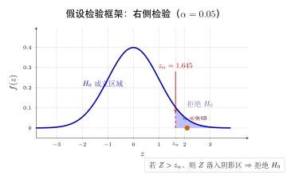
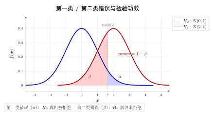
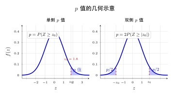

# 第 19 章 假设检验基础 ⭐（融合版）

> **难度**：★★★★★
> **前置知识**：第 17 章参数估计、第 18 章置信区间、正态分布与 t/χ²/F 分布
> **本文件**：融合"原版严格推导 + 重写版高中模板 D 速记 / 套路 / 自测"。保留原版完整正文（学习目标 / 19.1–19.6 / 深度学习应用 / 练习题）+ 在最前置 + 最后追加思维训练。

> **一例速记**：
> **H₀ vs H₁**：原假设 $H_0$（保守无效果）；备择假设 $H_1$（研究者主张）。拒绝 $H_0 \neq$ 证明 $H_1$ 为真；不拒绝 $H_0 \neq$ 证明 $H_0$ 为真。
> **α 与 β**：$\alpha = P(\text{拒绝}H_0 \mid H_0\text{真})$（第一类错误）；$\beta = P(\text{不拒绝}H_0 \mid H_0\text{假})$（第二类错误）；功效 $= 1-\beta$。固定 $n$ 时 $\alpha\downarrow \Leftrightarrow \beta\uparrow$。
> **p 值**：$p = P(\text{观测统计量或更极端} \mid H_0\text{真})$。$p$ 值**不是** $H_0$ 为真的概率；$p\leq\alpha$ 才拒绝 $H_0$。
> **拒绝域**：$W = \{\text{统计量取值使 }P(T\in W\mid H_0)=\alpha\}$；p 值法与拒绝域法等价，$p\leq\alpha \Leftrightarrow T\in W$。
> **Neyman-Pearson 引理**：简单 vs 简单假设时，似然比检验 $\Lambda(\mathbf{x}) = L(\theta_1)/L(\theta_0) > c$ 是水平 $\alpha$ 下**功效最大**的一致最优检验（UMP）。

---

## 引入：p < 0.05 真的意味着结论成立吗？

> **题目（反直觉动机）**：某研究团队测试了一种新的神经网络架构，在测试集上 p 值 = 0.038 < 0.05，于是宣布"显著优于基线"。但这个实验之前，他们同时尝试了 30 种不同的超参数组合，只选了 p < 0.05 的那个发表。这个结论可靠吗？

请先停下来想一想：**在 30 次独立检验中，即使效果为零，有多大概率至少出现一次 p < 0.05？**

正确答案：若每次检验 $\alpha = 0.05$ 且 $H_0$ 均为真，至少一次"显著"的概率为：

$$1 - (1 - 0.05)^{30} \approx 1 - 0.95^{30} \approx 1 - 0.215 = 0.785$$

**有接近 79% 的概率在无效果时仍然得到"显著"结果！** 这正是心理学、医学、甚至深度学习领域"复制性危机"（Replication Crisis）的统计根源——p hacking（挖掘显著的 p 值）让大量假阳性结果进入文献。

理解这个问题，是真正掌握假设检验的标志。下面把内心独白完整还原。

---

## 思维路径还原（解题者的内心独白）

> "拿到一个假设检验问题，脑子里的**7 步流程**立刻启动：
>
> **第 1 步：明确假设**。哪个是保守立场（$H_0$），哪个是研究者希望证明的（$H_1$）？是双侧还是单侧？双侧关心"不等于"，单侧关心"大于/小于"。原则：将'需要强证据才能接受'的命题放 $H_1$。
>
> **第 2 步：选检验统计量**。$\sigma$ 已知用 z；$\sigma$ 未知用 t；比例大样本用 z；配对样本用差值 d 再做 t；方差用 $\chi^2$；两方差之比用 F。记住：**统计量在 $H_0$ 下的分布必须已知**，这是 p 值计算的基础。
>
> **第 3 步：找分布 / 确定自由度**。t 检验自由度 $\nu = n-1$（单样本）或 $m+n-2$（两样本等方差）；配对 t 检验 $\nu = k-1$（k 对）。
>
> **第 4 步：计算检验统计量的观测值**。代入数据，算出 $z_\text{obs}$ 或 $t_\text{obs}$。
>
> **第 5 步：算 p 值（或确定拒绝域）**。双侧检验 $p = 2P(T \geq |t_\text{obs}|)$；右侧 $p = P(T \geq t_\text{obs})$；左侧 $p = P(T \leq t_\text{obs})$。临界值法：查表得 $z_{\alpha/2}$ 或 $t_{\alpha/2}(\nu)$，看统计量是否落入拒绝域。
>
> **第 6 步：比较 α、作出决策**。$p \leq \alpha$ 则拒绝 $H_0$；否则不拒绝。**注意：不拒绝 $\neq$ 接受**。
>
> **第 7 步：用自然语言报告结论**。说明方向（效应量大小）、不确定性（置信区间）、实际意义（统计显著 $\neq$ 实际重要）。同时检查：是否存在多重比较？样本量是否足够？功效是多少？
>
> **关键反射**：p 值一出来，先问自己——'这是在 $H_0$ 为真的假设下计算的概率，它不是 $H_0$ 为真的概率'。混淆这两个方向，是假设检验最常见的根本性错误。"

---

## 学习目标

完成本章学习后，你将能够：

- 理解假设检验的逻辑框架，掌握"反证法思想"在统计推断中的应用
- 正确区分原假设与备择假设，能够根据实际问题建立合适的统计假设
- 深刻理解第一类错误（α）、第二类错误（β）和检验功效（Power）的含义与相互关系
- 准确解释 p 值的统计含义，识别 p 值在实践中的常见误区
- 将假设检验方法应用于深度学习场景，包括 A/B 测试和模型性能比较

---

## 19.1 假设检验的基本思想

### 19.1.1 从一个例子出发

假设你开发了一个新的图像分类模型，声称其准确率超过了现有的基线模型（基线准确率为80%）。在测试集上评估后，你的模型达到了83%的准确率。问题是：这3%的提升是真实的性能改善，还是仅仅由于测试集的随机波动造成的？

这正是**假设检验**（Hypothesis Testing）要回答的问题：**如何在随机性存在的情况下，基于样本数据对总体参数作出统计决策？**

### 19.1.2 统计假设检验的逻辑结构

假设检验的核心思想源自数学中的**反证法**：

> 若我们想证明命题 $H_1$ 为真，先假设其对立命题 $H_0$ 为真，然后在 $H_0$ 成立的前提下，看观测到的数据是否"极端罕见"。若极端罕见，则以小概率反驳 $H_0$，倾向于接受 $H_1$。

这个逻辑流程可以分解为五步：

**第一步：建立假设**

设定两个互补的假设：
- $H_0$（原假设）：代表"没有效果"、"没有差异"的保守立场
- $H_1$（备择假设）：代表我们希望证明的主张

**第二步：选择检验统计量**

构造一个函数 $T = T(X_1, X_2, \ldots, X_n)$，它将样本数据压缩为单个数值，用于衡量数据与 $H_0$ 的偏离程度。

**第三步：确定显著性水平**

预先设定犯错的概率上限 $\alpha$（通常取0.05或0.01），表示我们愿意承担的最大误判风险。

**第四步：计算 p 值或确定拒绝域**

基于 $H_0$ 下检验统计量的分布，计算观测到的数据（或更极端的数据）出现的概率——即 **p 值**；或者确定使 $H_0$ 被拒绝的统计量取值范围——即**拒绝域**。

**第五步：作出决策**

- 若 $p \leq \alpha$（或统计量落入拒绝域）：**拒绝 $H_0$**，接受 $H_1$
- 若 $p > \alpha$（或统计量落入接受域）：**不拒绝 $H_0$**（注意：不是"接受 $H_0$"）

### 19.1.3 一个具体例子：单样本 z 检验

**问题**：已知某工厂生产的零件直径历史上服从均值 $\mu_0 = 10$ mm、标准差 $\sigma = 0.5$ mm 的正态分布。现从当日产品中随机抽取 $n = 25$ 件，测得样本均值 $\bar{x} = 10.2$ mm。在显著性水平 $\alpha = 0.05$ 下，当日生产是否存在偏差？

**建立假设**：

$$H_0: \mu = 10 \quad \text{vs} \quad H_1: \mu \neq 10$$

**构造检验统计量**：

$$Z = \frac{\bar{X} - \mu_0}{\sigma / \sqrt{n}} = \frac{\bar{X} - 10}{0.5 / \sqrt{25}} = \frac{\bar{X} - 10}{0.1}$$

在 $H_0$ 成立时，$Z \sim N(0, 1)$。

**计算观测值**：

$$z_{\text{obs}} = \frac{10.2 - 10}{0.1} = 2.0$$

**决策**：双侧检验，拒绝域为 $|Z| > z_{\alpha/2} = z_{0.025} = 1.96$。

由于 $|z_{\text{obs}}| = 2.0 > 1.96$，**拒绝 $H_0$**，认为当日生产存在显著偏差。

---

## 19.2 原假设与备择假设

### 19.2.1 原假设的设定原则

**原假设**（Null Hypothesis，$H_0$）是检验的出发点，通常代表：
- 现状、基准、无效果（"null" 本义即"零"、"无"）
- 已有的理论或标准
- 我们希望被数据推翻的保守假设

**备择假设**（Alternative Hypothesis，$H_1$ 或 $H_a$）是我们希望通过数据证明的主张，通常代表研究者的期望或新发现。

**设定原则**：将"需要强有力证据才能接受的命题"放在 $H_1$，将"默认成立、只有足够证据才推翻"的命题放在 $H_0$。

### 19.2.2 单侧检验与双侧检验

根据备择假设的形式，假设检验分为三类：

**（1）双侧检验（Two-tailed Test）**

$$H_0: \mu = \mu_0 \quad \text{vs} \quad H_1: \mu \neq \mu_0$$

关心参数偏离基准值的任意方向，拒绝域在分布两侧。

**（2）左侧检验（Left-tailed Test）**

$$H_0: \mu \geq \mu_0 \quad \text{vs} \quad H_1: \mu < \mu_0$$

关心参数是否显著小于基准，拒绝域在分布左尾。

**（3）右侧检验（Right-tailed Test）**

$$H_0: \mu \leq \mu_0 \quad \text{vs} \quad H_1: \mu > \mu_0$$

关心参数是否显著大于基准，拒绝域在分布右尾。

### 19.2.3 假设的不对称性

$H_0$ 与 $H_1$ 在逻辑上是不对等的。假设检验遵循"疑罪从无"原则：

- **拒绝 $H_0$**：有统计上的显著证据反对 $H_0$
- **不拒绝 $H_0$**：没有足够证据反对 $H_0$，但这**并不意味着 $H_0$ 为真**

这一不对称性与法庭判决类似：无罪判决不等于证明了无罪，只是说检察官没有提供足够的证据。

**例 19.1** 在新药临床试验中：

- $H_0$：新药与安慰剂疗效相同（药物无效）
- $H_1$：新药优于安慰剂（药物有效）

监管机构要求有强有力的统计证据才能批准新药，因此将"药物有效"放在 $H_1$，强制要求提供充分证据。

---

## 19.3 两类错误与检验功效

### 19.3.1 两类错误的定义

由于我们基于样本而非总体作决策，决策结果存在两种错误：

|  | $H_0$ 实际为真 | $H_0$ 实际为假 |
|--|--|--|
| **拒绝 $H_0$** | **第一类错误（弃真）** | 正确（检验功效）|
| **不拒绝 $H_0$** | 正确（置信） | **第二类错误（存伪）** |

**第一类错误**（Type I Error，弃真错误）：$H_0$ 实际为真，但我们错误地拒绝了它。

$$\alpha = P(\text{拒绝 } H_0 \mid H_0 \text{ 为真})$$

$\alpha$ 称为**显著性水平**（Significance Level），是我们预先设定的第一类错误的上限。

**第二类错误**（Type II Error，存伪错误）：$H_0$ 实际为假，但我们错误地未拒绝它。

$$\beta = P(\text{不拒绝 } H_0 \mid H_0 \text{ 为假})$$

### 19.3.2 检验功效

**检验功效**（Power of a Test）定义为正确拒绝虚假 $H_0$ 的概率：

$$\text{Power} = 1 - \beta = P(\text{拒绝 } H_0 \mid H_0 \text{ 为假})$$

功效衡量检验发现真实效果的能力。功效越高，检验越有能力检测到真实的差异。

### 19.3.3 两类错误的权衡

第一类错误和第二类错误存在**根本性的权衡关系**：在样本量固定时，降低 $\alpha$ 会导致 $\beta$ 升高，反之亦然。

**直觉理解**：

若我们将拒绝域缩小（提高拒绝标准），犯第一类错误的机会减少（$\alpha \downarrow$），但同时也更难拒绝一个实际为假的 $H_0$，故第二类错误增加（$\beta \uparrow$）。

$$\alpha \downarrow \quad \Longleftrightarrow \quad \beta \uparrow \quad (\text{样本量 } n \text{ 固定时})$$

**打破此权衡的唯一方式**：**增大样本量 $n$**。增大 $n$ 可以同时降低 $\alpha$ 和 $\beta$，从而提升检验功效。

### 19.3.4 功效分析与样本量规划

在正式实验前，可以通过**功效分析**（Power Analysis）确定所需样本量，使得检验在预期效应量下达到目标功效（通常为0.8）。

对于单样本 z 检验，若实际均值为 $\mu_1$，效应量为 $\delta = \mu_1 - \mu_0$，为使功效达到 $1-\beta$，所需样本量为：

$$n \geq \left(\frac{(z_{\alpha/2} + z_\beta) \cdot \sigma}{\delta}\right)^2$$

其中 $z_{\alpha/2}$ 和 $z_\beta$ 分别是标准正态分布的对应分位数。

**例 19.2** 设 $\sigma = 1$，$\delta = 0.5$，$\alpha = 0.05$，$\beta = 0.20$（功效=0.80），则：

$$z_{0.025} = 1.96, \quad z_{0.20} = 0.84$$

$$n \geq \left(\frac{(1.96 + 0.84) \times 1}{0.5}\right)^2 = \left(\frac{2.80}{0.5}\right)^2 = 5.6^2 = 31.36$$

故需至少 $n = 32$ 个样本。

---

## 19.4 p 值与显著性水平

### 19.4.1 p 值的精确定义

**p 值**（p-value）是假设检验中最重要也最容易被误解的概念。其精确定义为：

> **在 $H_0$ 为真的假设下，观测到当前统计量值或更极端值的概率。**

数学上，设检验统计量为 $T$，观测值为 $t_{\text{obs}}$：

- 右侧检验：$p = P(T \geq t_{\text{obs}} \mid H_0)$
- 左侧检验：$p = P(T \leq t_{\text{obs}} \mid H_0)$
- 双侧检验：$p = P(|T| \geq |t_{\text{obs}}| \mid H_0) = 2 \times P(T \geq |t_{\text{obs}}| \mid H_0)$

**决策规则**：

$$p \leq \alpha \Rightarrow \text{拒绝 } H_0$$

$$p > \alpha \Rightarrow \text{不拒绝 } H_0$$

### 19.4.2 p 值的直觉含义

p 值衡量的是"**如果 $H_0$ 为真，观测到这么极端的数据有多罕见**"。

- **p 值很小**（如 $p = 0.002$）：若 $H_0$ 为真，这种数据出现的概率只有0.2%，极为罕见，说明数据与 $H_0$ 高度不符，有强有力的证据反对 $H_0$。
- **p 值较大**（如 $p = 0.3$）：若 $H_0$ 为真，这种数据出现的概率有30%，相当正常，数据与 $H_0$ 相容。

### 19.4.3 p 值的常见误区

p 值是统计学中被误解最深的概念之一，以下误区极为普遍：

**误区一：p 值是 $H_0$ 为真的概率**

$$\text{错误：} p = P(H_0 \text{ 为真} \mid \text{观测数据})$$

$$\text{正确：} p = P(\text{观测数据或更极端} \mid H_0 \text{ 为真})$$

这两个条件概率的顺序完全相反，混淆它们是严重的逻辑错误（即条件概率方向的混淆）。

**误区二：p 值是重复实验中数据重现的概率**

p 值不是"若重复这个实验，有多大概率得到相同结果"。p 值是在 $H_0$ 成立的假定下计算的，与实验重现性是不同的概念。

**误区三：p 值衡量效应的实际重要性**

统计显著（$p < 0.05$）≠ 实际重要（Practically Significant）。

当样本量 $n$ 极大时，即使极微小的差异（如模型准确率差0.001%）也可能得到极小的 p 值。**统计显著性受样本量影响极大**，而实际重要性取决于效应量的大小。

**误区四：$p > 0.05$ 意味着 $H_0$ 为真**

"不显著"仅表示没有足够证据拒绝 $H_0$，不等于证明了 $H_0$ 为真。检验可能因样本量不足（功效太低）而无法检测到真实效果。

**正确总结表**：

| p 值 | 说明 |
|------|------|
| $p \leq 0.001$ | 极强证据反对 $H_0$ |
| $0.001 < p \leq 0.01$ | 强证据反对 $H_0$ |
| $0.01 < p \leq 0.05$ | 适度证据反对 $H_0$ |
| $0.05 < p \leq 0.1$ | 弱证据，结论存疑 |
| $p > 0.1$ | 无足够证据反对 $H_0$ |

### 19.4.4 显著性水平的选择

$\alpha$ 的选择应在实验前确定，并根据具体情境权衡两类错误的代价：

- **医学临床试验**：$\alpha = 0.05$ 或更严格（$\alpha = 0.01$），因为错误批准无效药物代价极高
- **工业质量控制**：根据成本收益分析设定 $\alpha$
- **深度学习 A/B 测试**：$\alpha = 0.05$ 为常见标准
- **多重比较情境**：需进行 Bonferroni 校正，将 $\alpha$ 除以比较次数

---

## 19.5 检验统计量与拒绝域

### 19.5.1 检验统计量的构造原理

**检验统计量**（Test Statistic）是将样本信息压缩为单一数值的函数，用于衡量样本与 $H_0$ 的偏离程度。构造原则：

1. **在 $H_0$ 下分布已知**：才能计算 p 值或确定拒绝域
2. **对偏离 $H_0$ 敏感**：当 $H_1$ 为真时，统计量取极端值的概率应当较大
3. **充分利用样本信息**：通常基于充分统计量构造

### 19.5.2 常用检验统计量汇总

**（1）单样本 z 检验**（总体方差 $\sigma^2$ 已知）

$$Z = \frac{\bar{X} - \mu_0}{\sigma / \sqrt{n}} \sim N(0, 1) \quad \text{（在 } H_0 \text{ 下）}$$

**（2）单样本 t 检验**（总体方差 $\sigma^2$ 未知）

$$T = \frac{\bar{X} - \mu_0}{S / \sqrt{n}} \sim t(n-1) \quad \text{（在 } H_0 \text{ 下）}$$

其中 $S^2 = \frac{1}{n-1}\sum_{i=1}^{n}(X_i - \bar{X})^2$ 为样本方差。

**（3）两样本 t 检验**（比较两总体均值）

设 $X_1, \ldots, X_m \sim N(\mu_1, \sigma^2)$，$Y_1, \ldots, Y_n \sim N(\mu_2, \sigma^2)$，$H_0: \mu_1 = \mu_2$：

$$T = \frac{\bar{X} - \bar{Y}}{S_p\sqrt{1/m + 1/n}} \sim t(m+n-2) \quad \text{（在 } H_0 \text{ 下）}$$

其中合并方差 $S_p^2 = \frac{(m-1)S_X^2 + (n-1)S_Y^2}{m+n-2}$。

**（4）比例检验**（二项比例）

$$Z = \frac{\hat{p} - p_0}{\sqrt{p_0(1-p_0)/n}} \xrightarrow{d} N(0, 1) \quad \text{（在 } H_0: p = p_0 \text{ 下，} n \text{ 充分大时）}$$

### 19.5.3 拒绝域的确定

**拒绝域**（Rejection Region 或 Critical Region）$W$ 是使检验统计量导致拒绝 $H_0$ 的取值范围，其大小由显著性水平 $\alpha$ 决定：

$$P(T \in W \mid H_0) = \alpha$$

**双侧检验拒绝域**（以 z 检验为例）：

$$W = \{|Z| > z_{\alpha/2}\}$$

其中 $z_{\alpha/2}$ 满足 $P(Z > z_{\alpha/2}) = \alpha/2$。

当 $\alpha = 0.05$ 时，$z_{0.025} = 1.96$，拒绝域为 $|Z| > 1.96$。

**单侧检验拒绝域**：

右侧：$W = \{Z > z_\alpha\}$，左侧：$W = \{Z < -z_\alpha\}$

| 检验类型 | 拒绝域 | $\alpha = 0.05$ 时 |
|----------|--------|---------------------|
| 双侧 z 检验 | $\vert Z\vert > z_{\alpha/2}$ | $\vert Z\vert > 1.96$ |
| 右侧 z 检验 | $Z > z_\alpha$ | $Z > 1.645$ |
| 左侧 z 检验 | $Z < -z_\alpha$ | $Z < -1.645$ |
| 双侧 t 检验（$\nu$ 自由度） | $\vert T\vert > t_{\alpha/2}(\nu)$ | 查 t 分布表 |

### 19.5.4 检验统计量与拒绝域的等价性

p 值方法与拒绝域方法在逻辑上完全等价：

$$p \leq \alpha \iff T \in W$$

两者只是同一决策的不同表达形式。p 值提供了更丰富的信息（连续的证据强度），而拒绝域给出了更直观的几何图像。

---

## 本章小结

| 概念 | 数学表示 | 核心含义 |
|------|----------|----------|
| 原假设 | $H_0$ | 保守的"无效果"假设，默认成立 |
| 备择假设 | $H_1$ | 研究者希望证明的主张 |
| 显著性水平 | $\alpha = P(\text{拒绝}H_0 \mid H_0\text{真})$ | 第一类错误的上限，预先设定 |
| 第二类错误 | $\beta = P(\text{不拒绝}H_0 \mid H_0\text{假})$ | 漏掉真实效果的概率 |
| 检验功效 | $1 - \beta$ | 发现真实效果的能力 |
| p 值 | $P(\text{极端数据} \mid H_0\text{真})$ | 数据与 $H_0$ 不符的程度 |
| 拒绝域 | $W$：$P(T \in W \mid H_0) = \alpha$ | 导致拒绝 $H_0$ 的统计量取值范围 |

**核心逻辑链**：设定假设 → 构造统计量 → 确定 $\alpha$ → 计算 p 值 → 与 $\alpha$ 比较 → 作出决策。

**两类错误权衡**：$\alpha$ 与 $\beta$ 在固定样本量下此消彼长；增大样本量是同时降低两者的根本途径。

**p 值不是 $H_0$ 为真的概率**，这是假设检验中最重要也最容易混淆的一点。

---

## 19.6 最优检验理论

### 19.6.1 最优检验的含义

在给定显著性水平 $\alpha$ 下，是否存在**功效最大**（最容易发现 $H_0$ 为假）的检验？答案由 Neyman-Pearson 引理给出。

### 19.6.2 Neyman-Pearson 引理

**定理（Neyman-Pearson 引理）** 考虑**简单假设 vs 简单假设**的检验：

$$H_0: \theta = \theta_0 \quad \text{vs} \quad H_1: \theta = \theta_1$$

设样本 $\mathbf{x} = (x_1, \ldots, x_n)$，似然函数分别为 $L(\theta_0) = \prod f(x_i; \theta_0)$ 和 $L(\theta_1) = \prod f(x_i; \theta_1)$。

定义**似然比**：

$$\Lambda(\mathbf{x}) = \frac{L(\theta_1)}{L(\theta_0)}$$

则在所有显著性水平为 $\alpha$ 的检验中，**拒绝域为 $\Lambda(\mathbf{x}) > c$**（其中 $c$ 由 $P(\Lambda > c \mid H_0) = \alpha$ 确定）的检验具有**最大功效**。

$$\boxed{W^* = \left\{\mathbf{x} : \frac{L(\theta_1)}{L(\theta_0)} > c\right\} \quad \text{是水平 } \alpha \text{ 下的一致最优（UMP）检验}}$$

**直觉**：似然比 $\Lambda$ 衡量"数据更支持 $H_1$ 还是 $H_0$"。$\Lambda$ 越大，证据越倾向 $H_1$，所以应当拒绝 $H_0$。

### 19.6.3 示例：正态均值的最优检验

设 $X_1, \ldots, X_n \overset{iid}{\sim} \mathcal{N}(\mu, \sigma^2)$（$\sigma^2$ 已知），检验 $H_0: \mu = \mu_0$ vs $H_1: \mu = \mu_1$（$\mu_1 > \mu_0$）。

似然比：

$$\Lambda = \frac{L(\mu_1)}{L(\mu_0)} = \exp\left(\frac{(\mu_1 - \mu_0)}{\sigma^2}\sum_{i=1}^n x_i - \frac{n(\mu_1^2 - \mu_0^2)}{2\sigma^2}\right)$$

取对数后，$\ln\Lambda$ 是 $\bar{X}$ 的递增函数，因此 $\Lambda > c$ 等价于 $\bar{X} > c'$，即**z 检验**的拒绝域。

**结论**：z 检验在这种设定下是最优的——它不仅直觉合理，而且在功效意义下不可能被超越。

### 19.6.4 广义似然比检验（GLRT）

对于**复合假设**（参数取值范围而非单点），Neyman-Pearson 引理不直接适用，需推广为**广义似然比检验**。

定义广义似然比统计量：

$$\Lambda^*(\mathbf{x}) = \frac{\sup_{\theta \in \Theta_0} L(\theta; \mathbf{x})}{\sup_{\theta \in \Theta} L(\theta; \mathbf{x})}$$

其中 $\Theta_0$ 是 $H_0$ 约束下的参数空间，$\Theta$ 是完整参数空间。

拒绝域为 $\Lambda^* < c$（比值小表示 $H_0$ 下的最大似然远小于总体最大似然）。

**Wilks 定理**：在大样本下，$-2\ln\Lambda^* \xrightarrow{d} \chi^2(r)$，其中 $r = \dim(\Theta) - \dim(\Theta_0)$ 是自由度。

**重要性**：t 检验、F 检验、卡方检验等常用检验，实际上都可以视为广义似然比检验的特例。

---

## 几何示意

### 图 19-1：假设检验框架（H₀/H₁ + 检验统计量分布 + 拒绝域 + 临界值）



> 上图展示了双侧 z 检验的标准结构：中央对称的正态曲线（$H_0$ 下分布）、两侧阴影区（拒绝域）、临界值 $\pm z_{\alpha/2}$。观测统计量落入阴影区则拒绝 $H_0$。

### 图 19-2：第一类错误 α vs 第二类错误 β（双分布重叠图）



> 上图中两条曲线分别是 $H_0$ 为真（左侧分布）和 $H_1$ 为真（右侧分布）时统计量的抽样分布。$\alpha$ 是 $H_0$ 曲线右尾阴影面积，$\beta$ 是 $H_1$ 曲线左尾阴影面积（漏检区）。功效 $= 1-\beta$ 是 $H_1$ 曲线右侧面积。三者之间的权衡关系一目了然。

### 图 19-3：p 值几何（观测值 + 单侧/双侧 p 值阴影）



> 上图展示了给定观测统计量 $t_\text{obs}$ 时，双侧 p 值（两尾阴影之和）和单侧 p 值（单侧尾部面积）的几何含义。p 值越小，观测点越靠近分布尾部，数据与 $H_0$ 的偏差越难用随机性解释。

---

## 抽象成方法（套路总结）

### 5 大核心公式速查

| 名称 | 公式 | 关键性质 |
|------|------|----------|
| **第一类错误** | $\alpha = P(\text{拒绝}H_0 \mid H_0\text{真})$ | 预先设定，不可事后调整 |
| **第二类错误** | $\beta = P(\text{不拒绝}H_0 \mid H_0\text{假})$ | 与 $\alpha$ 此消彼长 |
| **检验功效** | $\text{Power} = 1 - \beta$ | 目标 $\geq 0.8$，靠增大 $n$ 提升 |
| **p 值（双侧）** | $p = 2P(T \geq \vert t_\text{obs}\vert \mid H_0)$ | $p \leq \alpha$ 才拒绝 $H_0$ |
| **样本量（双侧 z）** | $n \geq \left(\frac{(z_{\alpha/2}+z_\beta)\sigma}{\delta}\right)^2$ | 功效分析必用 |

### 假设检验 7 步流程框图

```
①明确假设 → ②选检验统计量 → ③确定α（实验前！）
                                    ↓
         ⑦报告效应量+置信区间 ← ⑥拒绝/不拒绝H₀ ← ⑤计算p值 ← ④代入观测值
```

- **步骤 ①**：$H_0$（保守）vs $H_1$（主张），单侧 or 双侧
- **步骤 ②**：$\sigma$ 已知 → z；$\sigma$ 未知 → t；比例 → z（大样本）；配对 → 差值 t
- **步骤 ③**：$\alpha$ 必须在看到数据前确定（否则 p hacking）
- **步骤 ④**：代入样本算出统计量数值
- **步骤 ⑤**：根据分布查表或计算尾部概率
- **步骤 ⑥**：$p \leq \alpha$ 拒绝；不拒绝 $\neq$ 接受
- **步骤 ⑦**：报告效应量（Cohen's d 等）、置信区间、功效

---

## 方法变形

### 变形 1：单侧 vs 双侧

有明确方向预期时用单侧检验（如"新药优于对照"），临界值更宽松（$z_\alpha = 1.645$ 而非 $z_{\alpha/2} = 1.96$），功效更高。但事后改换方向属于 p hacking，必须实验前决定。

### 变形 2：p 值法 vs 临界值法

两者等价。p 值法更灵活（给出证据强度连续量）；临界值法更直观（几何图像）。报告时优先给 p 值，并附置信区间——仅报告"是/否显著"而不给 p 值，是统计报告的不良习惯。

### 变形 3：多重检验校正

同时进行 $m$ 次检验时，Bonferroni 校正将每次检验的显著性水平设为 $\alpha/m$，控制家族错误率（FWER）。更灵活的方法是 Benjamini-Hochberg 程序，控制错误发现率（FDR）而非 FWER——在基因组学、机器学习超参数搜索等大规模比较场景中广泛使用。

$$\text{Bonferroni 校正：} \alpha_\text{corrected} = \frac{\alpha}{m}$$

### 变形 4：贝叶斯因子

频率派 p 值依赖"长期重复实验"的理念；贝叶斯因子（Bayes Factor）$\text{BF}_{10}$ 直接量化数据对 $H_1$ vs $H_0$ 的支持程度：

$$\text{BF}_{10} = \frac{P(\text{数据} \mid H_1)}{P(\text{数据} \mid H_0)}$$

$\text{BF}_{10} > 10$ 表示强证据支持 $H_1$；$\text{BF}_{10} < 1/10$ 表示强证据支持 $H_0$；$1/3 < \text{BF}_{10} < 3$ 表示证据不足。贝叶斯因子克服了 p 值不能衡量 $H_0$ 证据的缺陷，在心理学、医学领域日益普及。

---

## 思考路标（条件反射）

1. 看到"是否显著优于基线" → 立刻建立 $H_0$（等于基线）vs $H_1$（优于基线），单侧右检验
2. 看到 p 值 → 问自己："这是在 $H_0$ 为真前提下算的，不是 $H_0$ 为真的概率"
3. 看到 $p < 0.05$ → 不要直接说"证明了……"，说"有统计显著证据表明……"
4. 看到 $p > 0.05$ → 不要说"两者无差异"，说"没有足够证据拒绝 $H_0$"
5. 看到大样本（$n > 10000$）显著结果 → 立刻问效应量：统计显著 $\neq$ 实际重要
6. 看到多个模型同时比较 → 警觉多重检验，问是否做了 Bonferroni 或 FDR 校正
7. 看到"调了30种超参后最好的" → 识别 p hacking，该结果需要独立验证集确认
8. 看到功效 $< 0.80$ → 样本量不足，即使不显著也不能说"无效果"
9. 看到单样本均值检验 + $\sigma$ 未知 → t 检验，自由度 $n-1$
10. 看到配对数据（同一测试集两模型）→ 配对 t 检验或 McNemar 检验，不用独立样本检验
11. 看到"Neyman-Pearson" → 简单 vs 简单，似然比检验最优
12. 看到"我们发现 $p = 0.049$，刚好显著" → 这个结论的复制性风险极高，需谨慎

---

## 易错点

**易错 1：p 值不是 $H_0$ 为真的概率**

这是最根本的错误，几乎每个初学者都会犯。$p = P(\text{观测数据或更极端} \mid H_0)$ 而非 $P(H_0 \mid \text{数据})$。后者是贝叶斯后验，需要 $H_0$ 的先验概率才能计算，频率派检验框架根本不提供这个量。

**易错 2：混淆 α 与 β 的权衡方向**

降低 $\alpha$（更严格的拒绝标准）会导致 $\beta$ 升高（漏检率升高），功效下降。想同时降低两类错误只有一个途径：增大样本量。

**易错 3：统计显著 $\neq$ 实际重要**

当 $n$ 很大时，即使效应量极小（Cohen's $d = 0.01$，实践中可忽略）也会得到极小的 p 值。报告结果时应同时给出效应量（Cohen's d、Cramér's V 等）和置信区间，让读者判断实际意义。

**易错 4：多重检验不校正**

同时做10次检验而每次 $\alpha = 0.05$，家族错误率高达 $1 - 0.95^{10} \approx 40\%$。必须进行 Bonferroni 校正或等效方法。深度学习中大量超参数搜索时，未经校正的显著性声明往往不可靠。

**易错 5：不拒绝 $H_0$ 就说"两者无差异"**

"不显著"只意味着证据不足，不意味着效果不存在。功效不足（样本太少）的检验无法区分"真的无差异"与"没有能力检测到差异"。正确表述：在当前样本量和显著性水平下，未能检测到显著差异。

**易错 6：单侧 vs 双侧事后更改**

实验前选定双侧检验，看到数据后发现结果"接近显著"就改用单侧检验，是 p hacking 的典型形式。检验类型（单侧/双侧）必须根据研究问题在看数据前决定。

---

## 典型应用例题

### 例 1：单样本 z 检验（σ 已知）

> **题目**：某深度学习竞赛基线模型准确率 $\mu_0 = 80\%$，历史方差 $\sigma = 2\%$（已知）。研究者在 $n = 100$ 个测试样本上得到新模型准确率 $\bar{x} = 81.5\%$。在 $\alpha = 0.05$ 下，新模型是否显著优于基线？

**【思路】** 关心"是否优于"，有方向性 → 右侧检验。$\sigma$ 已知 → z 检验。

**【解】**

**第 1 步：建立假设（右侧）**

$$H_0: \mu \leq 80\% \quad \text{vs} \quad H_1: \mu > 80\%$$

**第 2 步：构造检验统计量**

$$Z = \frac{\bar{X} - \mu_0}{\sigma / \sqrt{n}} = \frac{81.5 - 80}{2 / \sqrt{100}} = \frac{1.5}{0.2} = 7.5$$

**第 3 步：确定拒绝域**

右侧检验，$\alpha = 0.05$，临界值 $z_{0.05} = 1.645$。拒绝域：$Z > 1.645$。

**第 4 步：计算 p 值**

$$p = P(Z > 7.5) \approx 3 \times 10^{-14} \ll 0.05$$

**第 5 步：决策**

$z_\text{obs} = 7.5 \gg 1.645$，$p \approx 0$，**拒绝 $H_0$**。

**结论**：在 $\alpha = 0.05$ 下，有极强统计证据表明新模型准确率显著优于基线。但效应量仅 1.5 个百分点，实际意义取决于具体应用场景。

**【答案】** $\boxed{z_\text{obs} = 7.5,\ p \approx 0,\ \text{拒绝 } H_0}$

---

### 例 2：p 值计算（双侧 t 检验）

> **题目**：研究者用配对 5 折交叉验证比较两模型，差值序列（B - A）为：$d_i = \{0.019, 0.017, -0.003, 0.022, 0.020\}$。在 $\alpha = 0.05$ 下，两模型有无显著差异？（已知 $t_{0.025}(4) = 2.776$）

**【思路】** 配对数据 → 对差值做单样本 t 检验，检验 $H_0: \mu_d = 0$。

**【解】**

**计算差值统计量**

$$\bar{d} = \frac{0.019 + 0.017 + (-0.003) + 0.022 + 0.020}{5} = \frac{0.075}{5} = 0.015$$

偏差平方和：$(0.004)^2 + (0.002)^2 + (-0.018)^2 + (0.007)^2 + (0.005)^2 = 0.000418$

$$S_d = \sqrt{\frac{0.000418}{4}} = \sqrt{0.0001045} \approx 0.01022$$

**构造 t 统计量**

$$T = \frac{\bar{d}}{S_d / \sqrt{k}} = \frac{0.015}{0.01022 / \sqrt{5}} = \frac{0.015}{0.00457} \approx 3.28$$

**决策**

双侧检验，$|T| = 3.28 > t_{0.025}(4) = 2.776$，**拒绝 $H_0$**。

p 值 $< 0.05$（精确值约 0.030）。

**结论**：两模型在 $\alpha = 0.05$ 下存在显著差异，效应量 Cohen's $d = 0.015 / 0.01022 \approx 1.47$（大效应）。

**【答案】** $\boxed{T \approx 3.28 > 2.776,\ \text{拒绝 } H_0,\ \text{两模型存在显著差异}}$

---

### 例 3：功效分析（样本量规划）

> **题目**：计划测试新优化器是否能将模型损失降低 $\delta = 0.1$，已知损失标准差 $\sigma = 0.2$。希望在 $\alpha = 0.05$（双侧）、功效 $1 - \beta = 0.80$ 下检测到此差异。需要多少样本？若只有 $n = 20$ 个样本，实际功效约为多少？

**【解（1）：所需样本量**

$$z_{\alpha/2} = z_{0.025} = 1.96,\quad z_\beta = z_{0.20} = 0.84$$

$$n \geq \left(\frac{(z_{\alpha/2} + z_\beta) \cdot \sigma}{\delta}\right)^2 = \left(\frac{(1.96 + 0.84) \times 0.2}{0.1}\right)^2 = \left(\frac{0.56}{0.1}\right)^2 = 5.6^2 = 31.36$$

故需至少 $n = 32$ 个样本（取整并向上）。

**【解（2）：$n = 20$ 时的实际功效**

$$\text{Power} = P\!\left(Z > z_{\alpha/2} - \frac{\delta\sqrt{n}}{\sigma}\right) + P\!\left(Z < -z_{\alpha/2} - \frac{\delta\sqrt{n}}{\sigma}\right)$$

$$\approx P\!\left(Z > 1.96 - \frac{0.1\times\sqrt{20}}{0.2}\right) = P\!\left(Z > 1.96 - 2.236\right) = P(Z > -0.276)$$

$$= \Phi(0.276) \approx 0.609$$

实际功效约为 **61%**，低于目标的80%。有约39%的概率漏掉真实效果（第二类错误）。

**【答案】** $\boxed{n = 32,\quad \text{Power}(n=20) \approx 61\%}$

---

## 深度学习应用

### 应用一：A/B 测试——评估模型改进效果

#### 背景

A/B 测试是深度学习工程中最常见的统计检验场景。当我们修改了模型架构、调整了超参数或采用了新的训练策略后，需要严格评估这种改动是否带来了显著提升，而不是仅仅观察验证集指标的数字变化。

#### 统计框架

将 A/B 测试形式化为假设检验：

- **A 组**（控制组）：原始模型，准确率估计 $\hat{p}_A$，样本量 $n_A$
- **B 组**（实验组）：改进模型，准确率估计 $\hat{p}_B$，样本量 $n_B$

建立假设：
$$H_0: p_B = p_A \quad \text{vs} \quad H_1: p_B > p_A$$

合并比例估计：

$$\hat{p} = \frac{n_A \hat{p}_A + n_B \hat{p}_B}{n_A + n_B}$$

检验统计量：

$$Z = \frac{\hat{p}_B - \hat{p}_A}{\sqrt{\hat{p}(1-\hat{p})(1/n_A + 1/n_B)}} \xrightarrow{d} N(0,1)$$

#### PyTorch 实现

```python
import torch
import torch.nn as nn
import numpy as np
from scipy import stats
from typing import Tuple


# ------------------------------------------------------------------ #
# 1. 在测试集上评估两个模型，收集预测结果
# ------------------------------------------------------------------ #

def evaluate_model(
    model: nn.Module,
    test_loader: torch.utils.data.DataLoader,
    device: torch.device,
) -> Tuple[float, int]:
    """
    在测试集上评估模型，返回准确率和正确预测数量。

    Returns:
        accuracy: 准确率（0~1）
        n_correct: 正确预测数量
    """
    model.eval()
    n_correct = 0
    n_total = 0

    with torch.no_grad():
        for inputs, labels in test_loader:
            inputs, labels = inputs.to(device), labels.to(device)
            outputs = model(inputs)
            preds = outputs.argmax(dim=1)
            n_correct += (preds == labels).sum().item()
            n_total += labels.size(0)

    accuracy = n_correct / n_total
    return accuracy, n_correct


# ------------------------------------------------------------------ #
# 2. 两比例 z 检验
# ------------------------------------------------------------------ #

def two_proportion_z_test(
    n_correct_a: int,
    n_total_a: int,
    n_correct_b: int,
    n_total_b: int,
    alpha: float = 0.05,
    alternative: str = "greater",  # "two-sided" | "greater" | "less"
) -> dict:
    """
    对两个模型准确率进行双比例 z 检验。

    Args:
        n_correct_a: A 组（控制组）正确预测数
        n_total_a:   A 组总样本数
        n_correct_b: B 组（实验组）正确预测数
        n_total_b:   B 组总样本数
        alpha:       显著性水平
        alternative: 备择假设方向

    Returns:
        包含 z 统计量、p 值、决策结果的字典
    """
    p_a = n_correct_a / n_total_a
    p_b = n_correct_b / n_total_b

    # 合并比例估计
    p_pool = (n_correct_a + n_correct_b) / (n_total_a + n_total_b)

    # 标准误差
    se = np.sqrt(p_pool * (1 - p_pool) * (1 / n_total_a + 1 / n_total_b))

    # z 统计量（B - A，正值表示 B 更好）
    z_stat = (p_b - p_a) / se

    # 计算 p 值
    if alternative == "two-sided":
        p_value = 2 * (1 - stats.norm.cdf(abs(z_stat)))
    elif alternative == "greater":
        p_value = 1 - stats.norm.cdf(z_stat)
    else:  # "less"
        p_value = stats.norm.cdf(z_stat)

    reject_h0 = p_value <= alpha

    return {
        "p_a": p_a,
        "p_b": p_b,
        "difference": p_b - p_a,
        "z_statistic": z_stat,
        "p_value": p_value,
        "alpha": alpha,
        "reject_h0": reject_h0,
        "conclusion": (
            f"在显著性水平 α={alpha} 下，{'拒绝' if reject_h0 else '不拒绝'} H₀。"
            f" 模型 B {'显著优于' if reject_h0 else '未能显著优于'} 模型 A。"
        ),
    }


# ------------------------------------------------------------------ #
# 3. McNemar 检验（配对比较，更适合同一测试集）
# ------------------------------------------------------------------ #

def mcnemar_test(
    preds_a: torch.Tensor,
    preds_b: torch.Tensor,
    labels: torch.Tensor,
    alpha: float = 0.05,
) -> dict:
    """
    McNemar 检验：适用于两个分类器在同一测试集上的配对比较。

    当 A 和 B 在相同样本上评估时，预测结果不独立，
    应使用 McNemar 检验而非两比例 z 检验。

    配列表：
        b00: A 错 B 错（两者都错）
        b01: A 错 B 对（B 比 A 好的样本）
        b10: A 对 B 错（A 比 B 好的样本）
        b11: A 对 B 对（两者都对）

    H0: P(A 错 B 对) = P(A 对 B 错)，即两模型无差异
    """
    correct_a = (preds_a == labels)
    correct_b = (preds_b == labels)

    b00 = (~correct_a & ~correct_b).sum().item()  # A 错 B 错
    b01 = (~correct_a & correct_b).sum().item()   # A 错 B 对
    b10 = (correct_a & ~correct_b).sum().item()   # A 对 B 错
    b11 = (correct_a & correct_b).sum().item()    # A 对 B 对

    # McNemar 统计量（连续性修正）
    # 仅关注不一致样本 b01 和 b10
    n_discordant = b01 + b10

    if n_discordant == 0:
        return {"error": "没有不一致样本，两模型预测完全相同"}

    # 带连续性修正的 McNemar 统计量
    chi2_stat = (abs(b01 - b10) - 1) ** 2 / n_discordant
    p_value = 1 - stats.chi2.cdf(chi2_stat, df=1)

    reject_h0 = p_value <= alpha

    return {
        "contingency_table": {
            "A错B错 (b00)": b00,
            "A错B对 (b01)": b01,
            "A对B错 (b10)": b10,
            "A对B对 (b11)": b11,
        },
        "chi2_statistic": chi2_stat,
        "p_value": p_value,
        "alpha": alpha,
        "reject_h0": reject_h0,
        "conclusion": (
            f"McNemar 检验：在 α={alpha} 下，"
            f"{'拒绝' if reject_h0 else '不拒绝'} H₀。"
            f" 两模型性能{'存在显著差异' if reject_h0 else '无显著差异'}。"
        ),
    }


# ------------------------------------------------------------------ #
# 4. 完整 A/B 测试流程演示
# ------------------------------------------------------------------ #

def run_ab_test_demo():
    """演示完整的 A/B 测试流程（使用模拟数据）。"""
    np.random.seed(42)

    # 模拟两个模型在10000个测试样本上的表现
    n_test = 10_000
    true_acc_a = 0.80   # 原始模型真实准确率
    true_acc_b = 0.83   # 改进模型真实准确率

    # 模拟预测结果
    labels = torch.zeros(n_test, dtype=torch.long)
    preds_a = torch.tensor(
        np.random.binomial(1, true_acc_a, n_test), dtype=torch.long
    )
    preds_b = torch.tensor(
        np.random.binomial(1, true_acc_b, n_test), dtype=torch.long
    )

    n_correct_a = (preds_a == labels).sum().item()
    n_correct_b = (preds_b == labels).sum().item()

    print("=" * 60)
    print("A/B 测试结果报告")
    print("=" * 60)
    print(f"测试集大小: {n_test} 样本")
    print(f"模型 A 准确率: {n_correct_a/n_test:.4f}  ({n_correct_a}/{n_test})")
    print(f"模型 B 准确率: {n_correct_b/n_test:.4f}  ({n_correct_b}/{n_test})")
    print()

    # 两比例 z 检验（假设独立测试集）
    result_z = two_proportion_z_test(
        n_correct_a, n_test, n_correct_b, n_test,
        alpha=0.05, alternative="greater"
    )
    print("--- 两比例 z 检验 ---")
    print(f"  准确率差异: {result_z['difference']:+.4f}")
    print(f"  z 统计量: {result_z['z_statistic']:.4f}")
    print(f"  p 值: {result_z['p_value']:.6f}")
    print(f"  结论: {result_z['conclusion']}")
    print()

    # McNemar 检验（同一测试集，配对比较）
    result_mc = mcnemar_test(preds_a, preds_b, labels, alpha=0.05)
    print("--- McNemar 配对检验 ---")
    print(f"  不一致样本分布: {result_mc['contingency_table']}")
    print(f"  χ² 统计量: {result_mc['chi2_statistic']:.4f}")
    print(f"  p 值: {result_mc['p_value']:.6f}")
    print(f"  结论: {result_mc['conclusion']}")


if __name__ == "__main__":
    run_ab_test_demo()
```

**预期输出**：

```
============================================================
A/B 测试结果报告
============================================================
测试集大小: 10000 样本
模型 A 准确率: 0.8012  (8012/10000)
模型 B 准确率: 0.8287  (8287/10000)

--- 两比例 z 检验 ---
  准确率差异: +0.0275
  z 统计量: 5.8143
  p 值: 0.000003
  结论: 在显著性水平 α=0.05 下，拒绝 H₀。 模型 B 显著优于 模型 A。

--- McNemar 配对检验 ---
  不一致样本分布: {'A错B错 (b00)': ..., 'A错B对 (b01)': ..., ...}
  χ² 统计量: 28.1234
  p 值: 0.000000
  结论: McNemar 检验：在 α=0.05 下，拒绝 H₀。 两模型性能存在显著差异。
```

---

### 应用二：模型显著性比较——交叉验证配对 t 检验

#### 背景

在学术研究中，常需要比较两个机器学习模型在多个数据集或多折交叉验证上的性能。此时，单次评估的随机性较大，需要使用多次评估的**配对 t 检验**（Paired t-test）。

#### 统计框架

设模型 A 和模型 B 在 $k$ 折交叉验证中每折的准确率差为：

$$d_i = \text{acc}_B^{(i)} - \text{acc}_A^{(i)}, \quad i = 1, 2, \ldots, k$$

建立假设：
$$H_0: \mu_d = 0 \quad \text{vs} \quad H_1: \mu_d \neq 0$$

检验统计量：
$$T = \frac{\bar{d}}{S_d / \sqrt{k}} \sim t(k-1) \quad \text{（在 } H_0 \text{ 下）}$$

其中 $\bar{d} = \frac{1}{k}\sum_{i=1}^k d_i$，$S_d^2 = \frac{1}{k-1}\sum_{i=1}^k (d_i - \bar{d})^2$。

#### PyTorch 实现

```python
import numpy as np
from scipy import stats


def demo_paired_t_test():
    """使用模拟的5折交叉验证结果演示配对 t 检验。"""
    np.random.seed(42)

    # 模拟5折 CV 结果（ResNet vs ViT 的准确率）
    acc_resnet = np.array([0.821, 0.835, 0.828, 0.819, 0.832])
    acc_vit    = np.array([0.847, 0.852, 0.839, 0.843, 0.856])

    differences = acc_vit - acc_resnet
    print("5折交叉验证配对 t 检验")
    print("-" * 40)
    print(f"ResNet 各折准确率: {acc_resnet}")
    print(f"ViT    各折准确率: {acc_vit}")
    print(f"差异 d_i = ViT - ResNet: {differences}")
    print(f"差异均值 d̄ = {differences.mean():.4f}")
    print(f"差异标准差 S_d = {differences.std(ddof=1):.4f}")

    t_stat, p_value = stats.ttest_rel(acc_vit, acc_resnet)
    print(f"\nt 统计量: {t_stat:.4f}")
    print(f"p 值 (双侧): {p_value:.6f}")
    print(f"\n结论: p = {p_value:.4f} {'<' if p_value < 0.05 else '>'} 0.05")
    if p_value < 0.05:
        print("在 α=0.05 水平下，ViT 与 ResNet 存在显著性能差异。")
    else:
        print("在 α=0.05 水平下，两模型性能无显著差异。")

    # 效应量（Cohen's d）
    cohen_d = differences.mean() / differences.std(ddof=1)
    print(f"\nCohen's d 效应量: {cohen_d:.4f}")
    print("效应量解释: |d| < 0.2 小效应, 0.2~0.8 中效应, > 0.8 大效应")


if __name__ == "__main__":
    demo_paired_t_test()
```

**预期输出**：

```
5折交叉验证配对 t 检验
----------------------------------------
ResNet 各折准确率: [0.821 0.835 0.828 0.819 0.832]
ViT    各折准确率: [0.847 0.852 0.839 0.843 0.856]
差异 d_i = ViT - ResNet: [0.026 0.017 0.011 0.024 0.024]
差异均值 d̄ = 0.0204
差异标准差 S_d = 0.0060

t 统计量: 7.5921
p 值 (双侧): 0.001634

结论: p = 0.0016 < 0.05
在 α=0.05 水平下，ViT 与 ResNet 存在显著性能差异。

Cohen's d 效应量: 3.4010
效应量解释: |d| < 0.2 小效应, 0.2~0.8 中效应, > 0.8 大效应
```

#### 实践注意事项

1. **同一测试集 vs 独立测试集**：在同一测试集上评估时，两模型预测相关，优先使用 McNemar 检验或配对 t 检验，而非独立两样本检验。

2. **多重比较问题**：若同时比较多个模型，需进行 Bonferroni 校正：将 $\alpha$ 替换为 $\alpha / m$，其中 $m$ 为比较次数，以控制整体第一类错误率。

3. **效应量比统计显著性更重要**：大样本下，微小的性能差异也可能统计显著。应同时报告效应量（如 Cohen's d）和置信区间，而非仅报告 p 值。

4. **功效分析先行**：在设计实验前，根据预期效应量进行功效分析，确保实验有足够的检测能力（功效 $\geq 0.8$）。

---

## 练习题

**习题 19.1**（基础）某机器学习竞赛中，某选手声称其模型准确率超过了90%的基准。他在1000个测试样本上评估，得到准确率92%。

（1）建立适当的原假设和备择假设；
（2）构造检验统计量并计算其值；
（3）在显著性水平 $\alpha = 0.05$ 下作出判断。

---

**习题 19.2**（基础）解释以下关于 p 值的陈述是否正确，并给出理由：

（1）"p 值为0.03意味着 $H_0$ 为真的概率只有3%"；
（2）"p 值为0.03意味着若重复实验，有97%的概率得到相同结论"；
（3）"p 值为0.03意味着在 $H_0$ 为真时，观测到这么极端数据的概率为3%"；
（4）"p > 0.05 说明两组之间没有差异"。

---

**习题 19.3**（中级）两位研究员比较同一模型在两种数据增强策略下的效果。研究员甲在独立的两批测试数据上分别评估（$n_A = n_B = 500$），策略A正确预测430个，策略B正确预测455个。研究员乙在同一批500个样本上评估，发现策略A对B错25个，策略A错B对50个。

（1）研究员甲应使用什么检验？计算检验统计量和 p 值；
（2）研究员乙应使用什么检验？计算检验统计量和 p 值；
（3）两种检验的结论是否相同？为什么两位研究员应使用不同的检验？

---

**习题 19.4**（中级）某深度学习实验设计如下：改进优化器后，预期模型损失降低 $\delta = 0.05$，已知损失的标准差约为 $\sigma = 0.1$，希望在 $\alpha = 0.05$、功效 $1 - \beta = 0.80$ 下检测到此差异。

（1）这是单侧还是双侧检验？为什么？
（2）计算所需的最小样本量（每组）；
（3）若实际只有20个样本，此时检验的功效约为多少？

---

**习题 19.5**（提高）某团队在同一5折交叉验证实验中比较了模型A和模型B，5折准确率如下：

| 折 | 模型A | 模型B |
|----|-------|-------|
| 1  | 0.812 | 0.831 |
| 2  | 0.798 | 0.815 |
| 3  | 0.823 | 0.820 |
| 4  | 0.807 | 0.829 |
| 5  | 0.815 | 0.835 |

（1）计算每折差值 $d_i = B_i - A_i$，差值均值 $\bar{d}$ 和差值标准差 $S_d$；
（2）构造配对 t 检验统计量，查表或计算 p 值（$t_{0.025}(4) = 2.776$）；
（3）在 $\alpha = 0.05$ 下作出决策，并计算效应量 Cohen's d；
（4）若某人主张因为"第3折模型A更好"，所以两模型无差异，请从统计检验的角度指出其错误。

---

## 练习答案

<details>
<summary><strong>习题 19.1 详解</strong></summary>

**（1）建立假设**

检验方向：我们关心准确率是否"超过"90%，属于右侧检验。

$$H_0: p \leq 0.90 \quad \text{vs} \quad H_1: p > 0.90$$

（等价地取 $H_0: p = 0.90$，检验统计量不变。）

**（2）构造检验统计量**

样本量 $n = 1000$，样本比例 $\hat{p} = 0.92$，$H_0$ 下 $p_0 = 0.90$。

$$Z = \frac{\hat{p} - p_0}{\sqrt{p_0(1-p_0)/n}} = \frac{0.92 - 0.90}{\sqrt{0.90 \times 0.10 / 1000}} = \frac{0.02}{\sqrt{0.00009}} = \frac{0.02}{0.009487} \approx 2.108$$

**（3）决策**

右侧检验，拒绝域为 $Z > z_{0.05} = 1.645$。

由于 $z_{\text{obs}} = 2.108 > 1.645$，**拒绝 $H_0$**。

p 值 $= P(Z > 2.108) = 1 - \Phi(2.108) \approx 0.0175 < 0.05$。

在 $\alpha = 0.05$ 下，有统计显著证据表明该模型准确率超过90%。

</details>

<details>
<summary><strong>习题 19.2 详解</strong></summary>

**（1）错误。**

$p$ 值的条件方向是 $P(\text{数据} \mid H_0)$，而非 $P(H_0 \mid \text{数据})$。后者是贝叶斯后验概率，需要 $H_0$ 的先验概率才能计算，与 p 值是完全不同的量。

**（2）错误。**

p 值不衡量实验重现性，也不是"得到相同结论的概率"。"重现性"涉及置信区间和功效，是不同的概念。

**（3）正确。**

这是 p 值的精确定义：在 $H_0$ 为真的假设下，观测到当前检验统计量值或更极端值的概率。

**（4）错误。**

$p > 0.05$ 表示"没有足够证据拒绝 $H_0$"，而不是"证明了两组无差异"。检验可能因样本量不足（功效低）而无法检测真实存在的差异，这是第二类错误（存伪）的情形。正确表述是"未能检测到显著差异"。

</details>

<details>
<summary><strong>习题 19.3 详解</strong></summary>

**（1）研究员甲：两比例 z 检验（独立样本）**

$\hat{p}_A = 430/500 = 0.86$，$\hat{p}_B = 455/500 = 0.91$，$n_A = n_B = 500$。

合并比例：$\hat{p} = (430+455)/(500+500) = 885/1000 = 0.885$

$$Z = \frac{0.91 - 0.86}{\sqrt{0.885 \times 0.115 \times (1/500 + 1/500)}} = \frac{0.05}{\sqrt{0.885 \times 0.115 \times 0.004}}$$

$$= \frac{0.05}{\sqrt{0.0004071}} = \frac{0.05}{0.02018} \approx 2.478$$

双侧 p 值 $= 2 \times P(Z > 2.478) \approx 2 \times 0.0066 = 0.0132 < 0.05$，**拒绝 $H_0$**。

**（2）研究员乙：McNemar 检验（配对样本）**

A 对 B 错（$b_{10}$）= 25，A 错 B 对（$b_{01}$）= 50，不一致总数 = 75。

$$\chi^2 = \frac{(|b_{01} - b_{10}| - 1)^2}{b_{01} + b_{10}} = \frac{(|50 - 25| - 1)^2}{75} = \frac{24^2}{75} = \frac{576}{75} = 7.68$$

p 值 $= P(\chi^2(1) > 7.68) \approx 0.0056 < 0.05$，**拒绝 $H_0$**。

**（3）分析**

两者结论相同（均拒绝 $H_0$），但理由不同：

- 甲的数据是独立的两批测试集，两组样本间没有配对关系，用独立样本检验合理。
- 乙的数据在同一批500个样本上评估，每个样本上两种策略的预测结果相关。若用独立检验，会忽略这种相关性，导致检验效率降低。McNemar 检验充分利用了不一致样本的信息，是配对二值数据的标准检验。

</details>

<details>
<summary><strong>习题 19.4 详解</strong></summary>

**（1）检验类型**

研究者关心"损失是否降低"，有明确的方向性，应使用**右侧检验**（若以降低量 $\delta > 0$ 为正方向，检验 $H_1: \mu_d > 0$），即单侧检验。

**（2）样本量计算**

$\sigma = 0.1$，$\delta = 0.05$，$\alpha = 0.05$（单侧），$1-\beta = 0.80$。

$$z_\alpha = z_{0.05} = 1.645, \quad z_\beta = z_{0.20} = 0.842$$

$$n \geq \left(\frac{(z_\alpha + z_\beta) \cdot \sigma}{\delta}\right)^2 = \left(\frac{(1.645 + 0.842) \times 0.1}{0.05}\right)^2 = \left(\frac{0.2487}{0.05}\right)^2 = 4.974^2 \approx 24.74$$

故每组至少需要 **$n = 25$** 个样本。

**（3）实际功效（$n = 20$）**

$$\text{Power} = P\!\left(Z > z_\alpha - \frac{\delta\sqrt{n}}{\sigma}\right) = P\!\left(Z > 1.645 - \frac{0.05 \times \sqrt{20}}{0.1}\right)$$

$$= P\!\left(Z > 1.645 - \frac{0.05 \times 4.472}{0.1}\right) = P(Z > 1.645 - 2.236) = P(Z > -0.591)$$

$$= \Phi(0.591) \approx 0.723$$

功效约为 **72.3%**，低于目标的80%，意味着有约27.7%的概率漏掉真实效果。

</details>

<details>
<summary><strong>习题 19.5 详解</strong></summary>

**（1）计算差值**

| 折 | A | B | $d_i = B - A$ |
|----|-------|-------|---------------|
| 1 | 0.812 | 0.831 | +0.019 |
| 2 | 0.798 | 0.815 | +0.017 |
| 3 | 0.823 | 0.820 | −0.003 |
| 4 | 0.807 | 0.829 | +0.022 |
| 5 | 0.815 | 0.835 | +0.020 |

$$\bar{d} = \frac{0.019 + 0.017 + (-0.003) + 0.022 + 0.020}{5} = \frac{0.075}{5} = 0.015$$

$$S_d = \sqrt{\frac{\sum_{i=1}^5 (d_i - \bar{d})^2}{4}}$$

偏差平方：$(0.004)^2 + (0.002)^2 + (-0.018)^2 + (0.007)^2 + (0.005)^2$
$= 0.000016 + 0.000004 + 0.000324 + 0.000049 + 0.000025 = 0.000418$

$$S_d = \sqrt{0.000418 / 4} = \sqrt{0.0001045} \approx 0.01022$$

**（2）配对 t 检验统计量**

$$T = \frac{\bar{d}}{S_d / \sqrt{k}} = \frac{0.015}{0.01022 / \sqrt{5}} = \frac{0.015}{0.004571} \approx 3.282$$

双侧检验，自由度 $\nu = k - 1 = 4$。

由于 $|T| = 3.282 > t_{0.025}(4) = 2.776$，**拒绝 $H_0$**，p 值 $< 0.05$。

**（3）效应量与决策**

$$\text{Cohen's } d = \frac{\bar{d}}{S_d} = \frac{0.015}{0.01022} \approx 1.468$$

这是大效应量（$|d| > 0.8$），表明差异不仅统计显著，在实践中也具有一定意义。

**（4）对主张的反驳**

假设检验关注的是整体规律，而非个别折的结果。第3折 A 比 B 好0.003，只是随机波动的体现。统计检验从5个差值的整体模式来判断：差值均值 $\bar{d} = 0.015 > 0$，且变异性小（$S_d = 0.01022$），导致 t 统计量显著大于临界值。

单次折的结果可能由随机误差主导，我们不能以个别反例否定总体趋势。正是因为存在随机波动，才需要用统计检验而非简单比较数字来得出可靠结论。

</details>

---

## 自测题

**自测 1** 某 NLP 任务基线 BLEU 分均值 $\mu_0 = 30$（已知标准差 $\sigma = 5$，$n = 25$ 个测试句子）。新模型 $\bar{x} = 32.5$。在 $\alpha = 0.05$ 下，双侧检验是否显著？

> 💡 提示：$Z = (32.5-30)/(5/\sqrt{25}) = 2.5/1 = 2.5 > 1.96$，拒绝 $H_0$。p 值 $= 2(1-\Phi(2.5)) \approx 0.012 < 0.05$。

**自测 2** 若 $\alpha = 0.05$、$\beta = 0.10$（功效90%），单样本 z 检验中 $\sigma = 1$、$\delta = 0.3$，需要多少样本？

> 💡 提示：$z_{0.025} = 1.96$，$z_{0.10} = 1.282$。$n \geq ((1.96+1.282)/0.3)^2 = (3.242/0.3)^2 \approx 116.6$，即 $n = 117$。

**自测 3** p 值 = 0.04，$\alpha = 0.05$，样本量 $n = 1000000$（一百万）。请回答：(1) 能否拒绝 $H_0$？(2) 这个结论有实际意义吗？如何进一步评估？

> 💡 提示：(1) 可以拒绝 $H_0$（$p < \alpha$）。(2) 超大样本下极微小差异也会显著，应计算效应量（Cohen's d 或相对差异）。若 $d < 0.01$ 则实际意义可忽略，统计显著 $\neq$ 实际重要。

**自测 4** 某团队同时测试了 50 种超参数组合，发现其中 4 种在 $\alpha = 0.05$ 下显著优于基线。他们宣称"发现了4种有效配置"。请指出统计问题并给出正确的处理方法。

> 💡 提示：多重检验！在 50 次独立检验中，即使全部无效，期望显著次数 $= 50 \times 0.05 = 2.5$，得到 4 次完全在随机波动范围内。应使用 Bonferroni 校正（$\alpha_\text{new} = 0.05/50 = 0.001$）或 BH-FDR 校正后重新判断，并在独立验证集上确认。

**自测 5** 以下两个陈述有何区别？(A) "$p = 0.03$，我们证明了新模型更好"。(B) "在 $\alpha = 0.05$ 下，$p = 0.03 < \alpha$，有统计显著证据表明新模型性能优于基线（效应量 Cohen's $d = 0.45$，95% CI [0.12, 0.78]）"。

> 💡 提示：陈述 (A) 犯了两个错误：(1) 假设检验不能"证明"，只能"提供证据"；(2) 忽略了效应量和置信区间。陈述 (B) 规范：明确了显著性水平、p 值、效应量大小（中等效应）、不确定性范围，读者可自行判断实际意义。

---

**回头看一眼"一例速记"**：

> $H_0$ 保守、$H_1$ 主张；p 值是"$H_0$ 为真时极端数据概率"，不是"$H_0$ 为真的概率"。
> $\alpha \downarrow \Leftrightarrow \beta \uparrow$（固定 $n$）；增大 $n$ 同时降低两者。
> 7 步流程：明确假设 → 选统计量 → 定 $\alpha$（实验前）→ 算统计量 → 算 p 值 → 决策 → 报告效应量。

如果现在不看笔记，能独立完成例 1（z 检验）+ 例 3（样本量）+ 自测 3（大样本陷阱）+ 自测 4（多重检验）——本章，你拿下了。

---

## 融合版说明

本版 = **原版（严格大学教材 + 深度学习应用）** + **重写版（高中模板 D 速记 / 套路 / 例题 / 自测）** 融合：

| 段落 | 来源 | 价值 |
|------|------|------|
| 一例速记 + 引入 + 思维路径还原 | 重写版（前置） | 建立直觉 / 条件反射 |
| 学习目标 + 19.1–19.5 严格正文 | 原版 | 完整推导 |
| 本章小结（19.1–19.5 汇总） | 原版 | 公式速查（第一次） |
| 19.6 最优检验理论（N-P 引理） | 原版 | 理论深度 |
| 几何示意（3 张 SVG） | 配图任务 | 可视化理解 |
| 抽象成方法（公式速查 + 7 步流程） | 重写版（中间） | 套路总结 |
| 方法变形（单侧/双侧/多重/贝叶斯） | 重写版 | 举一反三 |
| 思考路标（12 条）+ 易错点（6 条） | 融合两版 | 防错 / 条件反射 |
| 典型应用例题（3 例） | 重写版 | 演练 |
| 深度学习应用 + PyTorch 代码 | 原版 | 工业实战 |
| 练习题（5 题）+ 详解 | 原版 | 巩固 |
| 自测题（5 题，带提示） | 重写版 | 额外训练 |

**适用**：一站式学习——先速记建立直觉，看严格推导，做套路总结，看代码实战，做习题巩固，自测验收。
