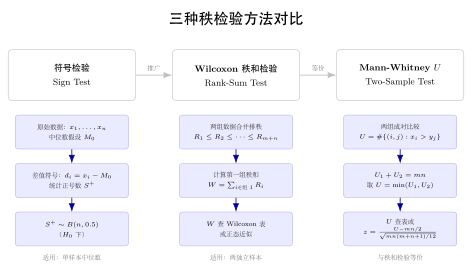
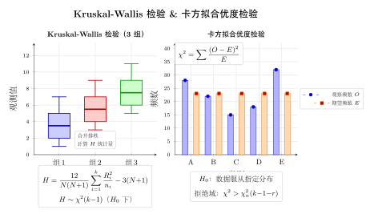

# 第 21 章 非参数检验（融合版）

> **难度**：★★★★
> **前置知识**：第 17-20 章假设检验基础、$t$ 检验、$F$ 检验、$\chi^2$ 检验；秩与顺序统计量概念
> **本文件**：融合"原版严格推导 + 重写版高中模板 D 速记 / 套路 / 自测"。保留原版完整正文（学习目标 / 21.1–21.5 / 深度学习应用 / 练习题）+ 在最前置、最后追加思维训练。

> **一例速记**：
> **符号检验**：差值 $D_i = X_i - M_0$，正差值个数 $B^+ \sim \text{Bin}(n', 1/2)$，只利用正负号。
> **Wilcoxon 符号秩检验**：对 $|D_i|$ 排秩，正秩和 $W^+ = \sum_{D_i>0} R_i^+$；$W^+$ 均值 $\frac{n'(n'+1)}{4}$，方差 $\frac{n'(n'+1)(2n'+1)}{24}$。
> **Mann-Whitney U 检验**：合并两样本排秩，$U = \sum_{i,j} \mathbf{1}(X_i > Y_j) = W - \frac{m(m+1)}{2}$，$E_0(U) = \frac{mn}{2}$。
> **Kruskal-Wallis**：$k$ 组秩和 $R_i$，$H = \frac{12}{N(N+1)}\sum\frac{R_i^2}{n_i} - 3(N+1) \sim \chi^2(k-1)$。
> **卡方拟合优度**：$\chi^2 = \sum\frac{(O_i - E_i)^2}{E_i} \sim \chi^2(k-1-\text{估计参数数})$。
> **列联表独立性**：$\chi^2 = \sum\frac{(O_{ij} - E_{ij})^2}{E_{ij}}$，$E_{ij} = \frac{R_i C_j}{n}$，自由度 $(r-1)(c-1)$。

---

## 引入：参数检验失败时怎么办？

> **题目**：某医院收集了 8 名慢性病患者接受新疗法前后的疼痛评分（1-10 分，有序整数）：
>
> | 患者 | 1 | 2 | 3 | 4 | 5 | 6 | 7 | 8 |
> |------|---|---|---|---|---|---|---|---|
> | 治疗前 | 8 | 7 | 9 | 6 | 8 | 7 | 9 | 5 |
> | 治疗后 | 5 | 6 | 7 | 4 | 6 | 5 | 8 | 4 |
>
> 能用配对 $t$ 检验吗？如果不能，怎么办？

请先停下来思考：**这里的数据有什么特殊性让参数检验失效？**

直觉陷阱 1：样本量 $n = 8$ 太小，中心极限定理不可靠。
直觉陷阱 2：疼痛评分是**有序整数**（1-10 分），严格来说不是连续数值型数据，"均值"和"方差"的意义存疑。
直觉陷阱 3：差值 $D_i = \{3, 1, 2, 2, 2, 2, 1, 1\}$ 全为正数，分布明显非正态（强左截断）。

这正是**非参数检验**的用武之地——不对分布形式作假设，转而利用数据的**秩**（排名）信息进行推断。

---

## 思维路径还原（解题者的内心独白）

> "看到这组数据，先判断能否用参数检验：样本量 $n=8$ 偏小，数据类型是有序整数，差值全部为正—这三个红灯同时亮起，$t$ 检验的正态假设岌岌可危。
>
> **第一步：选择检验类型**。这是配对样本（同一患者前后对比），问题是单样本中位差是否为 0。对应非参数方法是**符号检验**或**Wilcoxon 符号秩检验**。
>
> **第二步：计算差值并决定用哪个**。差值 $D_i = \{3, 1, 2, 2, 2, 2, 1, 1\}$，全部 $> 0$，无零差值，$n' = 8$，$B^+ = 8$。
>
> 符号检验思路：$B^+ = 8$，在 $H_0$ 下 $B^+ \sim \text{Bin}(8, 0.5)$，单侧 $p = P(B^+ = 8) = (0.5)^8 = 1/256 \approx 0.004$。即使不用差值大小，纯靠方向就能在 $\alpha = 0.05$ 下拒绝 $H_0$。
>
> Wilcoxon 符号秩检验思路：进一步利用差值大小的排秩，能获取更高功效（ARE = $3/\pi \approx 0.955$ 对比 $t$ 检验）。对 $|D_i|$ 排秩：差值 $1, 1, 1, 2, 2, 2, 2, 3$ 对应秩 $2, 2, 2, 5.5, 5.5, 5.5, 5.5, 8$（同秩取均值）。全部为正差值，$W^+ = 2+2+2+5.5+5.5+5.5+5.5+8 = 36$，$W^- = 0$。$W^+ = 36 = n'(n'+1)/2 = 36$，这意味着所有秩都是正的，$p$ 值 $= P(W^+ = 36) = 1/2^8 \approx 0.004$，与符号检验一致（此极端情形两者恰好相等）。
>
> **第三步：理解两种方法的关系**。符号检验是最简单的非参数检验，只看正负号；Wilcoxon 检验额外利用差值绝对值大小的秩，在差值分布连续时功效更高。当所有差值都是正的这种极端情形，二者给出相同结论。
>
> **核心认知**：非参数检验把"原始数据 → 秩 → 检验统计量"，用排列等可能的组合概率替代参数分布假设，这正是无分布检验名字的由来。
>
> **决策流程速记**：数据类型是否是定量连续型 → 是否满足正态性 → 样本量是否足够大 → 若任一否定，转向对应的非参数检验（配对用符号/Wilcoxon，两独立样本用 Mann-Whitney，多样本用 Kruskal-Wallis，分布拟合用 KS 检验，列联表用卡方）。"

---

## 学习目标

完成本章学习后，你将能够：

- 理解非参数检验的基本思想，明确其相对于参数检验的优势与适用场景
- 掌握符号检验和 Wilcoxon 符号秩检验的原理与计算步骤
- 理解 Mann-Whitney U 检验的秩和思想，能够对两独立样本进行比较
- 掌握 Kolmogorov-Smirnov 检验的原理，用于分布拟合与两样本比较
- 了解置换检验的框架，理解 FID、IS 等生成模型评估指标的统计学基础

---

## 21.1 非参数方法概述

### 21.1.1 参数检验的局限性

在前几章中，我们学习的假设检验方法（$t$ 检验、$F$ 检验、$\chi^2$ 检验等）都建立在特定的分布假设之上，通常要求数据来自正态总体，或者样本量足够大以保证渐近正态性。这类方法称为**参数检验**（Parametric Tests），因为它们的推断对象是分布族的参数（如均值 $\mu$、方差 $\sigma^2$）。

参数检验在实践中面临以下挑战：

**分布假设难以验证**：现实数据往往存在偏斜、厚尾、多峰等非正态特征。

**数据类型受限**：参数检验通常要求连续型数据，无法直接处理序数数据（如问卷中的"非常满意/满意/一般/不满意"）。

**小样本下不可靠**：当 $n < 30$ 时，中心极限定理提供的正态近似可能失效，而样本又不够大以检验正态性。

**异常值敏感**：均值等矩估计量对异常值高度敏感，使得基于矩的参数检验不够稳健。

### 21.1.2 非参数检验的基本思想

**非参数检验**（Nonparametric Tests）不对总体分布的具体形式作假设，其有效性在宽泛的条件下成立。这类方法也称为**无分布检验**（Distribution-Free Tests）。

非参数方法的核心工具是**秩**（Rank）。将 $n$ 个观测值从小到大排列后，第 $i$ 小的观测值的秩为 $i$。秩具有以下优良性质：

**分布无关性**：秩的联合分布在连续总体的零假设下不依赖于总体的具体分布形式。

**对单调变换不变性**：若对数据做任意严格单调变换，秩不变。

**异常值稳健性**：异常值仅影响极端秩（1 或 $n$），而非参数检验统计量通常对极端秩不敏感。

设样本 $X_1, X_2, \ldots, X_n$ 来自连续总体，令 $R_i$ 表示 $X_i$ 在样本中的秩，则在零假设（所有观测值来自同一连续分布）下：

$$P(R_i = r_i, i = 1, \ldots, n) = \frac{1}{n!}, \quad (r_1, r_2, \ldots, r_n) \text{ 是 } (1, 2, \ldots, n) \text{ 的排列}$$

即所有 $n!$ 种排列等可能，这是非参数检验统计量精确分布的计算基础。

### 21.1.3 非参数方法的分类

| 类别 | 用途 | 代表方法 |
|------|------|----------|
| 位置检验 | 单样本/双样本中心位置比较 | 符号检验、Wilcoxon 符号秩检验、Mann-Whitney U 检验 |
| 分布检验 | 检验数据是否来自某分布 | Kolmogorov-Smirnov 检验、Anderson-Darling 检验 |
| 相关性检验 | 检验两变量的单调相关性 | Spearman 秩相关、Kendall $\tau$ |
| 多样本检验 | 多组比较（ANOVA 的替代） | Kruskal-Wallis 检验 |
| 随机性检验 | 检验序列的随机性 | 游程检验 |
| 置换检验 | 任意统计量的推断 | 置换检验（Fisher 随机化检验） |

### 21.1.4 效率损失

非参数方法的代价是**效率**（Efficiency）损失。当参数检验的分布假设成立时，参数检验通常比对应的非参数检验有更高的**渐近相对效率**（Asymptotic Relative Efficiency, ARE）。

例如，当数据确实来自正态分布时，Wilcoxon 符号秩检验相对于 $t$ 检验的 ARE 为：

$$\text{ARE}(\text{Wilcoxon}, t) = \frac{3}{\pi} \approx 0.955$$

这意味着使用 Wilcoxon 检验需要约多 $1/0.955 \approx 1.047$ 倍的样本量才能达到相同的功效。然而当数据来自重尾分布（如 Cauchy 分布）时，ARE 可以趋向无穷大，非参数方法反而更优。

---

### 21.2 符号检验与符号秩检验

#### 21.2.1 符号检验

**符号检验**（Sign Test）是最简单的非参数检验，用于检验连续总体的中位数。

**问题设定**：设 $X_1, X_2, \ldots, X_n$ 为来自连续总体 $F$ 的独立同分布样本，检验假设：

$$H_0: M = M_0 \quad \text{vs.} \quad H_1: M \neq M_0$$

其中 $M$ 为总体中位数，$M_0$ 为指定值。

**检验统计量**：定义差值 $D_i = X_i - M_0$，忽略 $D_i = 0$ 的观测值，令 $n'$ 为非零差值的个数，$B^+$ 为正差值的个数：

$$B^+ = \sum_{i=1}^{n'} \mathbf{1}(D_i > 0)$$

在 $H_0$ 下，每个 $D_i$ 正负号等可能，因此：

$$B^+ \sim \text{Binomial}\left(n', \frac{1}{2}\right)$$

**拒绝域**：对于双侧检验，在显著性水平 $\alpha$ 下：

$$W = \{B^+ \leq b_{\alpha/2}(n')\} \cup \{B^+ \geq n' - b_{\alpha/2}(n')\}$$

其中 $b_{\alpha/2}(n')$ 满足 $P(B^+ \leq b_{\alpha/2}(n') \mid H_0) \leq \alpha/2$。

当 $n'$ 较大时，用正态近似：

$$Z = \frac{B^+ - n'/2}{\sqrt{n'/4}} \xrightarrow{d} N(0,1)$$

**例 21.1** 某医院测量 12 名患者接受新疗法前后的血压（单位：mmHg），差值（治疗后 - 治疗前）为：

$$-8, -12, +3, -5, -15, -7, +2, -9, -11, -6, -4, -10$$

检验新疗法能否降低血压（$H_0$：中位差值 = 0，$H_1$：中位差值 < 0）。

正差值个数 $B^+ = 2$，$n' = 12$。单侧 $p$ 值：

$$p = P(B^+ \leq 2 \mid B^+ \sim \text{Bin}(12, 0.5)) = \sum_{k=0}^{2} \binom{12}{k} (0.5)^{12} = \frac{1 + 12 + 66}{4096} \approx 0.019$$

在 $\alpha = 0.05$ 下拒绝 $H_0$，有统计证据支持新疗法能降低血压。

#### 21.2.2 Wilcoxon 符号秩检验

符号检验只利用了差值的正负符号，丢弃了差值大小的信息。**Wilcoxon 符号秩检验**（Wilcoxon Signed-Rank Test）在符号检验的基础上，还利用了差值的相对大小（秩）。

**检验统计量**：
1. 计算 $D_i = X_i - M_0$，去除 $D_i = 0$ 的观测值
2. 对 $|D_i|$ 从小到大排秩，得到秩 $R_i^+$（处理同秩时取平均秩）
3. 计算正差值的秩和：

$$W^+ = \sum_{i: D_i > 0} R_i^+$$

以及负差值的秩和 $W^- = n'(n'+1)/2 - W^+$。

检验统计量取 $W = \min(W^+, W^-)$（双侧检验）。

**精确分布**：在 $H_0$ 下，$W^+$ 的精确分布来自对 $\{1, 2, \ldots, n'\}$ 的所有子集求和的等可能性。精确临界值由查表或递推公式给出。

**正态近似**（当 $n' \geq 25$）：

$$E(W^+) = \frac{n'(n'+1)}{4}, \quad \text{Var}(W^+) = \frac{n'(n'+1)(2n'+1)}{24}$$

$$Z = \frac{W^+ - n'(n'+1)/4}{\sqrt{n'(n'+1)(2n'+1)/24}} \xrightarrow{d} N(0,1)$$

若有 $g$ 组同秩，每组有 $t_j$ 个，方差需修正：

$$\text{Var}(W^+) = \frac{1}{24}\left[n'(n'+1)(2n'+1) - \frac{1}{2}\sum_{j=1}^{g} t_j(t_j^2 - 1)\right]$$

**例 21.2** 对例 21.1 中的数据应用符号秩检验。

差值的绝对值及其排秩：

| $D_i$ | $\vert D_i\vert$ | 秩 $R_i^+$ | 符号 |
|--------|---------|------------|------|
| +2 | 2 | 1 | + |
| +3 | 3 | 2 | + |
| -4 | 4 | 3 | - |
| -5 | 5 | 4 | - |
| -6 | 6 | 5 | - |
| -7 | 7 | 6 | - |
| -8 | 8 | 7 | - |
| -9 | 9 | 8 | - |
| -10 | 10 | 9 | - |
| -11 | 11 | 10 | - |
| -12 | 12 | 11 | - |
| -15 | 15 | 12 | - |

正秩和：$W^+ = 1 + 2 = 3$

期望：$E(W^+) = 12 \times 13 / 4 = 39$，方差：$\text{Var}(W^+) = 12 \times 13 \times 25 / 24 = 162.5$

$$Z = \frac{3 - 39}{\sqrt{162.5}} \approx \frac{-36}{12.75} \approx -2.82$$

单侧 $p \approx 0.0024$，强烈拒绝 $H_0$。符号秩检验比符号检验给出了更强的证据，体现了利用秩信息的优势。

---

### 21.3 秩和检验（Mann-Whitney U 检验）

#### 21.3.1 两独立样本问题

设有两个独立样本：

- 样本 1：$X_1, X_2, \ldots, X_m \sim F_X$（连续分布）
- 样本 2：$Y_1, Y_2, \ldots, Y_n \sim F_Y$（连续分布）

**位移模型假设**：$F_Y(t) = F_X(t - \Delta)$，即两总体除位移 $\Delta$ 外形状完全相同。

检验假设：$H_0: \Delta = 0$（两总体位置相同）vs $H_1: \Delta \neq 0$。

#### 21.3.2 Wilcoxon 秩和统计量

将两样本合并，对 $N = m + n$ 个观测值联合排秩，令 $R_i$ 为 $X_i$ 在联合样本中的秩，则**Wilcoxon 秩和统计量**为：

$$W = \sum_{i=1}^{m} R_i$$

在 $H_0$ 下，$m$ 个 $X_i$ 等可能占据 $N$ 个秩中的任意 $m$ 个位置：

$$E_0(W) = \frac{m(N+1)}{2}$$

$$\text{Var}_0(W) = \frac{mn(N+1)}{12}$$

$W$ 的精确分布可通过枚举 $\binom{N}{m}$ 种等可能情形得到。

#### 21.3.3 Mann-Whitney U 统计量

等价地，**Mann-Whitney U 统计量**定义为：

$$U = \sum_{i=1}^{m} \sum_{j=1}^{n} \mathbf{1}(X_i > Y_j)$$

即 $X$ 样本中的值大于 $Y$ 样本中的值的对数。$U$ 与 $W$ 的关系为：

$$U = W - \frac{m(m+1)}{2}$$

**直觉**：若 $X$ 总体的位置显著高于 $Y$ 总体，则 $U$ 会很大；反之若 $X$ 显著低于 $Y$，则 $U$ 很小。

在 $H_0$ 下：

$$E_0(U) = \frac{mn}{2}, \quad \text{Var}_0(U) = \frac{mn(N+1)}{12}$$

**正态近似**（$m, n \geq 8$）：

$$Z = \frac{U - mn/2}{\sqrt{mn(N+1)/12}} \xrightarrow{d} N(0,1)$$

有同秩修正时，方差变为：

$$\text{Var}_0(U) = \frac{mn}{N(N-1)}\left[\frac{N^3 - N}{12} - \sum_{j} \frac{t_j^3 - t_j}{12}\right]$$

其中 $t_j$ 为第 $j$ 组同秩的个数。

#### 21.3.4 U 统计量的概率解释

Mann-Whitney U 统计量有一个优雅的概率解释。定义：

$$\hat{\theta} = P(X > Y) = \frac{U}{mn}$$

$\hat{\theta}$ 是总体参数 $\theta = P(X > Y)$ 的无偏估计量。

在位移模型 $H_0: \Delta = 0$ 下，$\theta = P(X > Y) = 1/2$。若 $\theta > 1/2$ 则 $X$ 随机地大于 $Y$，$\theta < 1/2$ 则反之。因此 Mann-Whitney 检验也可理解为对 $H_0: P(X > Y) = 1/2$ 的检验。

**例 21.3** 两种算法在 10 个测试集上的准确率（%）：

| 算法A | 72 | 85 | 91 | 68 | 79 | 88 | 75 | 82 | 94 | 70 |
|------|----|----|----|----|----|----|----|----|----|-----|
| 算法B | 65 | 78 | 88 | 71 | 76 | 83 | 69 | 80 | 90 | 67 |

合并排秩（$m = n = 10$，$N = 20$）：

将 20 个数合并排序，计算算法 A 的秩和 $W_A$。

$U_A = W_A - m(m+1)/2$

在正态近似下计算 $Z$ 值，若 $|Z| > 1.96$ 则在 $\alpha = 0.05$ 下拒绝两算法性能相同的假设。

#### 21.3.5 Kruskal-Wallis 检验（多样本推广）

当有 $k \geq 3$ 组样本时，Mann-Whitney 检验推广为 **Kruskal-Wallis 检验**，这是单因素方差分析（ANOVA）的非参数替代。设第 $i$ 组有 $n_i$ 个观测值，总样本量 $N = \sum n_i$，第 $i$ 组的秩和为 $R_i$，则检验统计量为：

$$H = \frac{12}{N(N+1)} \sum_{i=1}^{k} \frac{R_i^2}{n_i} - 3(N+1)$$

在 $H_0$（所有组来自同一分布）下，$H$ 渐近服从 $\chi^2(k-1)$ 分布。

---

### 21.4 Kolmogorov-Smirnov 检验

#### 21.4.1 经验分布函数

**经验分布函数**（Empirical Distribution Function, EDF）是总体分布函数 $F$ 的非参数估计。给定样本 $X_1, \ldots, X_n$，经验分布函数定义为：

$$\hat{F}_n(x) = \frac{1}{n} \sum_{i=1}^{n} \mathbf{1}(X_i \leq x) = \frac{\text{样本中} \leq x \text{ 的个数}}{n}$$

**Glivenko-Cantelli 定理**（经验分布函数的强一致性）：

$$\sup_{x \in \mathbb{R}} |\hat{F}_n(x) - F(x)| \xrightarrow{a.s.} 0 \quad (n \to \infty)$$

即经验分布函数以概率 1 一致收敛到真实分布函数。

#### 21.4.2 单样本 KS 检验

**问题**：检验数据是否来自指定的分布 $F_0$。

$$H_0: F = F_0 \quad \text{vs.} \quad H_1: F \neq F_0$$

**KS 统计量**：

$$D_n = \sup_{x \in \mathbb{R}} |\hat{F}_n(x) - F_0(x)|$$

$D_n$ 度量经验分布函数与假设分布函数之间的最大偏差。

**Kolmogorov 定理**：若 $H_0$ 成立且 $F_0$ 连续，则：

$$\sqrt{n} D_n \xrightarrow{d} K$$

其中 $K$ 为 **Kolmogorov 分布**，其 CDF 为：

$$P(K \leq t) = 1 - 2\sum_{k=1}^{\infty} (-1)^{k-1} e^{-2k^2 t^2} = \frac{\sqrt{2\pi}}{t} \sum_{k=1}^{\infty} e^{-(2k-1)^2\pi^2/(8t^2)}$$

常用近似：$P(K \leq t) \approx 1 - 2e^{-2t^2}$，对 $t \geq 1$ 精度较好。

**精确计算**：对有限样本，$D_n$ 的计算通过排序后的观测值进行：

$$D_n = \max_{1 \leq i \leq n} \max\left\{\left|\hat{F}_n(X_{(i)}) - F_0(X_{(i)})\right|, \left|\hat{F}_n(X_{(i-1)}) - F_0(X_{(i)})\right|\right\}$$

其中 $X_{(1)} \leq X_{(2)} \leq \cdots \leq X_{(n)}$ 为顺序统计量，$\hat{F}_n(X_{(i)}) = i/n$。

简化为：

$$D_n = \max_{1 \leq i \leq n} \max\left\{\left|\frac{i}{n} - F_0(X_{(i)})\right|, \left|\frac{i-1}{n} - F_0(X_{(i)})\right|\right\}$$

**重要注意事项**：当分布参数从数据中估计时（如检验正态性但 $\mu, \sigma^2$ 未知，需先估计），KS 检验趋于保守，此时应使用 Lilliefors 检验（使用模拟或专用临界值）。

#### 21.4.3 双样本 KS 检验

**问题**：检验两个样本是否来自同一总体。

$$H_0: F_X = F_Y \quad \text{vs.} \quad H_1: F_X \neq F_Y$$

设两样本大小分别为 $m$ 和 $n$，$\hat{F}_m$ 和 $\hat{G}_n$ 为对应经验分布函数，则统计量为：

$$D_{m,n} = \sup_{x} |\hat{F}_m(x) - \hat{G}_n(x)|$$

在 $H_0$ 下，渐近分布满足：

$$\sqrt{\frac{mn}{m+n}} D_{m,n} \xrightarrow{d} K$$

双样本 KS 检验对分布的任何差异（位置、形状、尺度）都敏感，而不仅仅是位置差异，这是相比 Mann-Whitney 检验的优势。

#### 21.4.4 KS 检验的几何直觉

$D_n$ 可以直观地理解为：在图形上，经验分布函数（阶梯函数）与理论分布函数（平滑曲线）之间的最大竖向距离。

```
F(x) 和 F̂_n(x)
1 |          ___________
  |      ___|           F₀(x)
  |   __|
  | __|
0 |___________________________> x
        ↑
   最大偏差 D_n 处
```

检验逻辑：若真实分布是 $F_0$，则 $\hat{F}_n$ 应与 $F_0$ 接近，$D_n$ 应较小。若 $D_n$ 超过临界值，则拒绝 $H_0$。

---

### 21.5 置换检验

#### 21.5.1 基本思想

**置换检验**（Permutation Test），又称**随机化检验**（Randomization Test），是一种基于数据重排的精确检验方法，由 Fisher 于 1935 年提出。

**核心思想**：在零假设下，观测数据的组标签（或某种结构）的所有置换应该同等可能。通过枚举（或随机采样）所有可能的置换，构造检验统计量的精确（或近似）零分布。

**算法流程**：

1. 计算观测数据上的检验统计量 $T_{\text{obs}}$
2. 在 $H_0$ 下的等可能置换中，对每个置换 $\pi$ 计算统计量 $T_\pi$
3. $p$ 值定义为：

$$p = \frac{|\{\pi : T_\pi \geq T_{\text{obs}}\}|}{|\text{所有置换}|}$$

（双侧检验取 $|\{T_\pi \geq |T_{\text{obs}}|\}|$ 的比例，或 $\min(p_{\text{left}}, p_{\text{right}}) \times 2$。）

**优势**：
- 无需分布假设，精确有效
- 可用于任意检验统计量（不限于传统统计量）
- 对小样本也精确有效

**劣势**：
- 完全枚举计算代价大（两样本各 $n$ 时共 $\binom{2n}{n}$ 种置换）
- 通常采用 Monte Carlo 近似：随机采样 $B$（如 $B = 10000$）个置换

#### 21.5.2 两样本置换 $t$ 检验

**问题**：比较两组均值，但不假设正态性。

两样本合并为 $\mathbf{Z} = (Z_1, \ldots, Z_{m+n})$，在 $H_0$ 下，组标签的任何分配等可能。

**算法**：
1. 计算原始两样本 $t$ 统计量 $T_{\text{obs}}$
2. 随机将 $m+n$ 个观测值随机分为大小 $m$ 和 $n$ 的两组，计算 $t$ 统计量
3. 重复步骤 2 共 $B$ 次，得到置换分布
4. $p$ 值 = 置换分布中 $|T_\pi| \geq |T_{\text{obs}}|$ 的比例

#### 21.5.3 置换检验的精确性与一致性

置换 $p$ 值满足精确性：在任意分布下（连续或离散），在显著性水平 $\alpha$ 下进行置换检验，若 $H_0$ 为真，则犯第一类错误的概率**恰好**（不超过）等于 $\alpha$。

当 $B \to \infty$ 时，Monte Carlo 置换 $p$ 值收敛到精确置换 $p$ 值。实践中 $B = 10000$ 通常足够，$p$ 值的 95% 置信区间宽度约为 $2\sqrt{p(1-p)/B}$。

#### 21.5.4 自举法与置换检验的区别

| | 置换检验 | 自举法（Bootstrap） |
|---|----------|---------------------|
| 目的 | 假设检验（$p$ 值） | 区间估计（标准误、置信区间） |
| 重采样方式 | 无放回，固定样本大小 | 有放回，固定样本大小 |
| 假设 | $H_0$ 下的可交换性 | 样本代表总体 |
| 零分布 | 由置换构造 | 非零假设下构造 |

---

## 几何示意

### 图 21-1：符号检验 / Wilcoxon 秩和 / Mann-Whitney 示意（数据→秩→检验统计量）



### 图 21-2：Kruskal-Wallis 多组检验 + 卡方拟合优度示意



---

## 抽象成方法（套路总结）

### 非参数检验速查表

| 场景 | 对应非参数检验 | 参数替代 | 检验统计量 | 渐近分布 |
|------|--------------|---------|-----------|---------|
| 单样本中位数 | 符号检验 | 单样本 $t$ | $B^+ \sim \text{Bin}(n', 1/2)$ | $N(0,1)$（大样本） |
| 单样本中位数（功效更高） | Wilcoxon 符号秩 | 单样本 $t$ | $W^+$，均值 $\frac{n'(n'+1)}{4}$ | $N(0,1)$（$n'\geq 25$） |
| 两独立样本位置 | Mann-Whitney U | 两样本 $t$ | $U = \sum\mathbf{1}(X_i>Y_j)$ | $N(0,1)$（$m,n\geq 8$） |
| $k$ 组独立样本 | Kruskal-Wallis | 单因素 ANOVA | $H \sim \chi^2(k-1)$ | $\chi^2(k-1)$ |
| 分布拟合 | KS 检验（单样本） | — | $D_n = \sup\vert \hat{F}_n - F_0\vert$ | Kolmogorov 分布 |
| 两样本分布比较 | KS 检验（双样本） | — | $D_{m,n}$ | Kolmogorov 分布 |
| 任意统计量 | 置换检验 | 参数检验 | $T_{\text{obs}}$（任意） | 置换分布 |
| 分类数据拟合 | 卡方拟合优度 | — | $\chi^2 = \sum(O-E)^2/E$ | $\chi^2(k-1-p)$ |
| 列联表独立性 | 卡方独立性检验 | — | $\chi^2 = \sum(O_{ij}-E_{ij})^2/E_{ij}$ | $\chi^2((r-1)(c-1))$ |

### 选检验 3 步流程

**第 1 步：判断数据类型与样本结构**
- 配对数据（同一受试者前后）→ 单样本位置检验（符号检验 / Wilcoxon 符号秩）
- 两独立样本 → Mann-Whitney U
- $k \geq 3$ 组独立样本 → Kruskal-Wallis
- 分类计数数据 → 卡方检验（拟合优度或独立性）
- 分布比较 → KS 检验

**第 2 步：判断是否满足参数检验假设**
- 正态性（Shapiro-Wilk 检验 $p > 0.05$）？
- 样本量是否足够（$n \geq 30$）？
- 方差齐性（Levene 检验）？
- 若均满足 → 可用参数检验；否则 → 非参数检验

**第 3 步：选择具体统计量**
- 单样本：$n' \leq 25$ 用精确分布查表，$n' > 25$ 用正态近似
- 两样本：$m, n \leq 8$ 用精确分布，$m, n > 8$ 用正态近似
- 存在同秩（ties）→ 修正方差公式（$\sum t_j(t_j^2-1)$ 项）

---

## 方法变形

### 变形 1：单样本 / 配对样本

**符号检验**（最简）：只需计数正号个数 $B^+$，适用于样本量极小（$n \leq 5$）或数据只知方向的场景。
**Wilcoxon 符号秩检验**（推荐）：在能量化差值大小时使用，ARE 相对 $t$ 检验 $= 3/\pi \approx 0.955$，几乎无功效损失。
**关键**：两者都检验中位数（而非均值），适用于偏态分布数据。

### 变形 2：两独立样本

**Mann-Whitney U 检验** 等价于 **Wilcoxon 秩和检验**，两者由 $U = W - m(m+1)/2$ 联系。
**注意**：在位移模型下，检验 $H_0: \Delta = 0$ 等价于 $H_0: P(X > Y) = 1/2$。
**与 $t$ 检验比较**：ARE（正态数据下）$= 3/\pi \approx 0.955$；Cauchy 数据下 ARE $\to \infty$。

### 变形 3：多独立样本

**Kruskal-Wallis 检验**是 Mann-Whitney 的推广，也是单因素 ANOVA 的非参数替代。
若 $H$ 显著，需进一步做**事后两两比较**（Post-hoc），用 Bonferroni 修正或 Dunn 检验控制多重检验错误。
$H$ 统计量在大样本下渐近 $\chi^2(k-1)$，每组至少需要 5 个观测值。

### 变形 4：列联表 / 分类数据

**卡方拟合优度**：$k$ 类别，$p$ 个估计参数，自由度 $= k - 1 - p$。期望频率 $E_i = n p_i$，要求所有 $E_i \geq 5$（否则合并类别或用 Fisher 精确检验）。
**卡方独立性检验**（$r \times c$ 列联表）：$E_{ij} = R_i C_j / n$，自由度 $(r-1)(c-1)$，检验行变量与列变量是否独立。

---

## 本章小结

本章系统介绍了非参数检验的理论体系与核心方法：

**非参数方法的本质**是用秩或重排代替原始数据进行推断，核心工具是秩的等可能性和经验分布函数。

**符号检验**最简单，只利用正负符号，对中位数进行检验；**Wilcoxon 符号秩检验**额外利用差值大小的秩信息，功效更高（相对于 $t$ 检验的 ARE = $3/\pi \approx 0.955$）。

**Mann-Whitney U 检验**通过计算跨组比较的胜负次数，对两独立样本的位置进行比较，其统计量等价于 $P(X > Y)$ 的估计。

**KS 检验**基于经验分布函数与理论/对照分布函数的最大偏差，能够检测分布的任何形式差异，渐近分布为 Kolmogorov 分布。

**置换检验**是最灵活的非参数框架，通过数据重排构造精确零分布，可用于任意检验统计量，是深度学习模型评估等复杂场景的重要工具。

---

## 思考路标（条件反射）

1. 看到"配对数据 + 小样本 / 非正态" → 优先考虑符号检验或 Wilcoxon 符号秩检验，而非配对 $t$ 检验
2. 看到"两独立样本 + 非正态 / 序数数据" → Mann-Whitney U 检验，等价于 Wilcoxon 秩和检验
3. 看到 $k \geq 3$ 组独立样本比较 → Kruskal-Wallis，显著后再做 Dunn 事后检验
4. 看到"检验数据是否来自某分布" → KS 检验（已知参数）或 Lilliefors 检验（参数需估计）
5. 看到"任意统计量的 $p$ 值，无分布假设" → 置换检验（小样本精确，大样本 Monte Carlo 近似）
6. 看到"同秩（ties）" → 方差修正公式 $\sum t_j(t_j^2-1)$，不可忽略（大量同秩时影响显著）
7. 看到卡方统计量 $\chi^2 = \sum(O-E)^2/E$ → 判断是拟合优度（单变量分布）还是独立性（两变量列联表）
8. 看到"ARE $= 3/\pi \approx 0.955$" → 这是正态数据下 Wilcoxon vs $t$ 的效率对比，意味着 Wilcoxon 几乎不浪费信息
9. 看到"Cauchy 分布 / 重尾数据" → 非参数检验的 ARE 可 $\to \infty$，此时非参数方法比参数方法强
10. 看到"置换检验精确性" → 精确控制 I 型错误，无需分布假设，有效性来自可交换性而非正态性
11. 看到 $E_{ij} < 5$ 的列联表格 → 卡方近似失效，改用 Fisher 精确检验
12. 看到"双样本 KS vs Mann-Whitney" → KS 对任意分布差异敏感（位置+形状+尺度），MWU 主要检测位置差异

---

## 易错点

1. **秩与原值的区别**：非参数检验基于秩而非原始数值。对原始数据作任意严格单调变换（如取对数、平方根），秩不变，检验统计量不变。但如果直接对原值做参数检验（如 $t$ 检验），结果会随变换而改变。**切记：Wilcoxon 检验的 $W^+$ 是对 $\vert D_i\vert$ 排秩后的秩和，不是差值本身之和。**

2. **效率 vs 稳健性的权衡**：当正态假设成立时，非参数检验的 ARE < 1（如 Wilcoxon 符号秩 ARE = $3/\pi \approx 0.955$），即有少量功效损失。但当正态假设不成立（厚尾、偏态、有序数据）时，非参数检验的 ARE 可远大于 1。**不要因为"ARE 略小于 1"就总是选参数检验——前提是正态假设必须成立。**

3. **连续性修正（Continuity Correction）**：对离散分布（如 $B^+$、$W^+$）用正态近似时，应加连续性修正：将 $P(B^+ \leq b)$ 近似为 $P(Z \leq (b + 0.5 - \mu)/\sigma)$。不加修正在小样本下会导致检验水平偏高（拒绝过多）。

4. **独立性假设**：Mann-Whitney U 检验和 Kruskal-Wallis 检验要求样本间**独立**。若数据有配对关系（如同一受试者前后测量），应使用 Wilcoxon 符号秩检验，而不是 Mann-Whitney。混淆配对与独立是非参数检验中最常见的设计错误。

5. **同秩（Ties）处理不当**：当有多个观测值相等时，标准做法是取**平均秩**（如第 3、4、5 小的三个值都等于 7，各赋秩 4）。忽略同秩或随意分配秩会导致统计量计算错误，方差也需要用同秩修正公式调整。**注意：大量同秩严重削弱检验功效。**

6. **KS 检验参数估计问题**：用 KS 检验拟合优度时，若分布参数（如 $\mu, \sigma$）是从数据中估计的而非预先指定的，则不能直接用 Kolmogorov 分布的临界值（会导致检验过于保守）。必须改用 Lilliefors 检验（正态性检验专用）或通过模拟获得临界值。

---

## 典型应用例题

### 例 1：符号检验——临床试验数据

> **题目**：某临床试验中，20 名高血压患者接受新型降压药治疗，治疗前后收缩压（mmHg）差值（治疗后 $-$ 治疗前）如下：
>
> $$-15, -8, +2, -22, -10, -5, 0, -18, -3, -12,$$
> $$-7, +1, -20, -9, -6, -14, -11, -4, -16, -13$$
>
> （$0$ 表示无变化。）在 $\alpha = 0.05$ 下，用符号检验判断新药能否降低收缩压（单侧检验）。

**【思路】** 忽略 0 差值；计数正差值个数 $B^+$；在 $H_0$ 下 $B^+ \sim \text{Bin}(n', 0.5)$。

**【解】**

步骤 1：去除零差值。$D_i = 0$ 有 1 个，$n' = 19$。

步骤 2：统计正差值：$+2, +1$，共 $B^+ = 2$。

步骤 3：计算单侧 $p$ 值（$H_1$：中位差值 $< 0$，即 $B^+$ 应偏小）。

$$p = P(B^+ \leq 2 \mid \text{Bin}(19, 0.5)) = \sum_{k=0}^{2} \binom{19}{k}(0.5)^{19}$$

$$= \frac{\binom{19}{0} + \binom{19}{1} + \binom{19}{2}}{2^{19}} = \frac{1 + 19 + 171}{524288} = \frac{191}{524288} \approx 0.000364$$

步骤 4：结论。$p \approx 0.000364 < 0.05$，**拒绝 $H_0$**，有强统计证据表明新药能显著降低收缩压。

**【注】** 若要用正态近似：$\mu = 19/2 = 9.5$，$\sigma = \sqrt{19/4} \approx 2.179$。$Z = (2 - 9.5)/2.179 \approx -3.44$，单侧 $p \approx 0.0003$，与精确计算吻合。

---

### 例 2：Wilcoxon 符号秩检验——排名数据的前后比较

> **题目**：10 名学生参加编程竞赛，记录训练前后排名（名次，越小越好）：
>
> | 学生 | 1 | 2 | 3 | 4 | 5 | 6 | 7 | 8 | 9 | 10 |
> |------|---|---|---|---|---|---|---|---|---|---|
> | 训练前 | 45 | 32 | 67 | 28 | 53 | 41 | 60 | 38 | 72 | 50 |
> | 训练后 | 38 | 29 | 55 | 31 | 44 | 35 | 48 | 36 | 63 | 42 |
>
> 在 $\alpha = 0.05$ 下，检验训练是否有效降低排名（双侧检验）。

**【思路】** 排名是有序数据，$n = 10$ 较小，考虑 Wilcoxon 符号秩检验。计算差值 $D_i =$ 训练后 $-$ 训练前（降低 = 负）。

**【解】**

步骤 1：计算差值 $D_i$：$-7, -3, -12, +3, -9, -6, -12, -2, -9, -8$。

无零差值，$n' = 10$。

步骤 2：对 $\vert D_i\vert$ 排秩（同秩取均值）：

| $\vert D_i\vert$ | 2 | 3 | 3 | 6 | 7 | 8 | 9 | 9 | 12 | 12 |
|---------|---|---|---|---|---|---|---|---|---|---|
| 秩 | 1 | 2.5 | 2.5 | 4 | 5 | 6 | 7.5 | 7.5 | 9.5 | 9.5 |
| 符号 | $-$ | $-$ | $+$ | $-$ | $-$ | $-$ | $-$ | $-$ | $-$ | $-$ |

步骤 3：正秩和与负秩和。

$W^+ = 2.5$（仅学生 4 的差值为 $+3$）

$W^- = 1 + 2.5 + 4 + 5 + 6 + 7.5 + 7.5 + 9.5 + 9.5 = 52.5$

验证：$W^+ + W^- = 2.5 + 52.5 = 55 = 10 \times 11 / 2$。正确。

步骤 4：正态近似（$n' = 10$，略小，但做演示）。

$$E(W^+) = \frac{10 \times 11}{4} = 27.5$$

同秩修正：有两组同秩，$t_1 = 2$（秩 2.5）、$t_2 = 2$（秩 7.5）、$t_3 = 2$（秩 9.5），共 3 组。

$$\text{Var}(W^+) = \frac{1}{24}\left[10 \times 11 \times 21 - \frac{1}{2}(2 \times 3 + 2 \times 3 + 2 \times 3)\right] = \frac{2310 - 9}{24} = \frac{2301}{24} \approx 95.875$$

$$Z = \frac{2.5 - 27.5}{\sqrt{95.875}} \approx \frac{-25}{9.79} \approx -2.55$$

双侧 $p \approx 2 \times P(Z < -2.55) \approx 2 \times 0.0054 \approx 0.011 < 0.05$。

步骤 5：结论。**拒绝 $H_0$**，有统计证据表明训练显著改变了排名（结合 $W^- \gg W^+$，表明排名确实降低，即成绩提升）。

---

### 例 3：卡方拟合优度检验——骰子公平性

> **题目**：掷一枚骰子 300 次，各面出现次数如下：
>
> | 点数 | 1 | 2 | 3 | 4 | 5 | 6 |
> |------|---|---|---|---|---|---|
> | 观测次数 | 43 | 58 | 47 | 52 | 55 | 45 |
>
> 在 $\alpha = 0.05$ 下，检验该骰子是否公平（即各面出现概率相等）。

**【思路】** 这是卡方拟合优度检验：$k = 6$ 类，无需估计参数，自由度 $= k - 1 = 5$。期望频率 $E_i = 300/6 = 50$（所有类相同）。

**【解】**

步骤 1：计算期望频率。$H_0$：$p_i = 1/6$，$E_i = 300 \times 1/6 = 50$，$i = 1, \ldots, 6$。

步骤 2：计算卡方统计量。

$$\chi^2 = \sum_{i=1}^{6} \frac{(O_i - E_i)^2}{E_i} = \frac{(43-50)^2}{50} + \frac{(58-50)^2}{50} + \frac{(47-50)^2}{50} + \frac{(52-50)^2}{50} + \frac{(55-50)^2}{50} + \frac{(45-50)^2}{50}$$

$$= \frac{49 + 64 + 9 + 4 + 25 + 25}{50} = \frac{176}{50} = 3.52$$

步骤 3：确定临界值和 $p$ 值。$\chi^2(5)$ 分布在 $\alpha = 0.05$ 下的临界值为 $\chi^2_{0.05, 5} = 11.07$。

由于 $3.52 < 11.07$，且 $p$ 值 $= P(\chi^2(5) \geq 3.52) \approx 0.62$。

步骤 4：结论。**不拒绝 $H_0$**，无统计证据认为骰子不公平，各面出现频率与期望频率无显著差异。

**【注】** 所有期望频率 $E_i = 50 \geq 5$，卡方近似有效。若某类期望频率 $< 5$，需合并相邻类别。

---

## 深度学习应用：生成模型的统计评估

生成模型（如 GAN、VAE、扩散模型）的核心目标是让生成分布 $p_\theta$ 尽可能接近真实数据分布 $p_{\text{data}}$。评估生成质量本质上是一个**两样本检验**问题：真实样本集合 $\{x_i\}_{i=1}^m \sim p_{\text{data}}$ 和生成样本集合 $\{\tilde{x}_j\}_{j=1}^n \sim p_\theta$，检验 $H_0: p_\theta = p_{\text{data}}$。

### 21.A FID 与 IS 的统计学基础

#### Inception Score (IS)

**IS** 使用预训练 Inception 网络 $f$，对生成图像 $x \sim p_\theta$ 计算条件标签分布 $p(y|x)$ 和边缘分布 $p(y) = \mathbb{E}_{x \sim p_\theta}[p(y|x)]$，然后计算 KL 散度：

$$\text{IS} = \exp\left(\mathbb{E}_{x \sim p_\theta}[D_{KL}(p(y|x) \| p(y))]\right)$$

IS 高意味着：
- 单张图像分类概率集中（$p(y|x)$ 尖锐）→ 图像质量高
- 边缘分布均匀（$p(y)$ 分散）→ 多样性好

IS 的统计局限：不需要真实数据，无法检测模式崩塌到真实分布的偏差；对 Inception 网络的偏差敏感。

#### Fréchet Inception Distance (FID)

**FID** 是最广泛使用的生成质量指标。将真实图像和生成图像通过 Inception 网络编码为特征向量，假设真实特征 $\sim \mathcal{N}(\mu_r, \Sigma_r)$，生成特征 $\sim \mathcal{N}(\mu_g, \Sigma_g)$，则 FID 为两高斯分布之间的 **Fréchet 距离**（2-Wasserstein 距离）：

$$\text{FID} = \|\mu_r - \mu_g\|^2 + \text{tr}\left(\Sigma_r + \Sigma_g - 2(\Sigma_r \Sigma_g)^{1/2}\right)$$

FID 越小表示生成分布越接近真实分布。FID = 0 当且仅当两高斯完全相同。

**统计解释**：FID 是 Wasserstein-2 距离在高斯分布族上的精确公式，也等价于特征空间中的**最优传输距离**。

### 21.B 基于非参数检验的生成质量评估

下面用 PyTorch 实现基于两样本 KS 检验和置换检验的生成质量评估框架：

```python
"""
生成模型评估：基于非参数检验的统计质量评估
使用两样本 KS 检验和置换检验评估生成分布与真实分布的差异
"""

import numpy as np
import torch
import torch.nn as nn
from scipy import stats
from scipy.linalg import sqrtm
from typing import Tuple, Optional
import warnings


# ─── 1. 计算 FID ──────────────────────────────────────────────────────────────

def compute_fid(
    real_features: np.ndarray,
    fake_features: np.ndarray,
    eps: float = 1e-6
) -> float:
    """
    计算真实特征与生成特征之间的 Fréchet Inception Distance。

    Args:
        real_features: 形状 (m, d)，真实图像的特征向量
        fake_features: 形状 (n, d)，生成图像的特征向量
        eps: 数值稳定性小量，防止矩阵平方根计算中出现负特征值

    Returns:
        FID 值（越小越好）
    """
    mu_r = real_features.mean(axis=0)
    mu_g = fake_features.mean(axis=0)
    sigma_r = np.cov(real_features, rowvar=False)
    sigma_g = np.cov(fake_features, rowvar=False)

    diff = mu_r - mu_g
    mean_term = diff @ diff

    # 计算矩阵平方根 (Σ_r Σ_g)^{1/2}
    # 使用 sqrtm 计算矩阵平方根，结果可能有虚部（数值误差），取实部
    covmean = sqrtm(sigma_r @ sigma_g)
    if np.iscomplexobj(covmean):
        if np.max(np.abs(covmean.imag)) > 1e-3:
            warnings.warn("sqrtm 产生较大虚部，FID 计算可能不准确")
        covmean = covmean.real

    trace_term = np.trace(sigma_r + sigma_g - 2 * covmean)
    fid = mean_term + trace_term
    return float(fid)


# ─── 2. 两样本 KS 检验（逐特征维度） ─────────────────────────────────────────

def ks_test_multivariate(
    real_features: np.ndarray,
    fake_features: np.ndarray,
    alpha: float = 0.05,
    correction: str = "bonferroni"
) -> dict:
    """
    对特征的每个维度分别进行两样本 KS 检验，并进行多重检验校正。

    Args:
        real_features: 形状 (m, d)
        fake_features: 形状 (n, d)
        alpha: 显著性水平
        correction: 多重检验校正方法，"bonferroni" 或 "none"

    Returns:
        包含检验结果的字典
    """
    d = real_features.shape[1]
    ks_stats = []
    p_values = []

    for j in range(d):
        stat, pval = stats.ks_2samp(real_features[:, j], fake_features[:, j])
        ks_stats.append(stat)
        p_values.append(pval)

    ks_stats = np.array(ks_stats)
    p_values = np.array(p_values)

    # Bonferroni 校正：将显著性水平除以检验次数
    if correction == "bonferroni":
        alpha_corrected = alpha / d
    else:
        alpha_corrected = alpha

    rejected = p_values < alpha_corrected
    n_rejected = rejected.sum()

    return {
        "ks_stats": ks_stats,
        "p_values": p_values,
        "n_rejected": int(n_rejected),
        "rejection_rate": float(n_rejected / d),
        "alpha_corrected": alpha_corrected,
        "max_ks_stat": float(ks_stats.max()),
        "mean_ks_stat": float(ks_stats.mean()),
        "conclusion": (
            f"在 Bonferroni 校正后 α={alpha_corrected:.4f} 下，"
            f"{d} 个特征维度中 {n_rejected} 个拒绝 H₀"
        )
    }


# ─── 3. 置换检验：基于 MMD ────────────────────────────────────────────────────

def rbf_kernel(
    X: np.ndarray,
    Y: np.ndarray,
    sigma: Optional[float] = None
) -> np.ndarray:
    """
    计算 RBF（高斯）核矩阵 K(X, Y)。

    Args:
        X: 形状 (m, d)
        Y: 形状 (n, d)
        sigma: 带宽参数，None 时使用中位数启发式

    Returns:
        核矩阵，形状 (m, n)
    """
    # 计算成对平方距离
    XX = (X ** 2).sum(axis=1, keepdims=True)  # (m, 1)
    YY = (Y ** 2).sum(axis=1, keepdims=True)  # (n, 1)
    sq_dists = XX + YY.T - 2 * X @ Y.T          # (m, n)

    if sigma is None:
        # 中位数启发式：带宽取所有成对距离中位数的平方
        sigma = np.median(np.sqrt(np.maximum(sq_dists, 0))) + 1e-8

    return np.exp(-sq_dists / (2 * sigma ** 2))


def mmd_statistic(
    X: np.ndarray,
    Y: np.ndarray,
    sigma: Optional[float] = None
) -> float:
    """
    计算无偏最大均值差异（MMD²）统计量。

    MMD² = E[k(X,X')] - 2E[k(X,Y)] + E[k(Y,Y')]
    其中 k 为 RBF 核，X,X' ~ p，Y,Y' ~ q。

    Args:
        X: 来自分布 p 的样本，形状 (m, d)
        Y: 来自分布 q 的样本，形状 (n, d)

    Returns:
        MMD² 估计值
    """
    m, n = len(X), len(Y)

    Kxx = rbf_kernel(X, X, sigma)
    Kyy = rbf_kernel(Y, Y, sigma)
    Kxy = rbf_kernel(X, Y, sigma)

    # 无偏估计：去掉对角线项
    np.fill_diagonal(Kxx, 0)
    np.fill_diagonal(Kyy, 0)

    mmd2 = (
        Kxx.sum() / (m * (m - 1))
        - 2 * Kxy.mean()
        + Kyy.sum() / (n * (n - 1))
    )
    return float(mmd2)


def permutation_mmd_test(
    real_features: np.ndarray,
    fake_features: np.ndarray,
    n_permutations: int = 1000,
    random_state: int = 42,
    sigma: Optional[float] = None
) -> dict:
    """
    基于 MMD 统计量的置换检验。

    H₀: 真实分布 = 生成分布
    H₁: 真实分布 ≠ 生成分布

    Args:
        real_features: 形状 (m, d)
        fake_features: 形状 (n, d)
        n_permutations: 置换次数（越大越精确，但更慢）
        random_state: 随机种子
        sigma: RBF 核带宽

    Returns:
        包含检验结果的字典
    """
    rng = np.random.RandomState(random_state)
    m = len(real_features)
    n = len(fake_features)

    # 合并样本
    combined = np.vstack([real_features, fake_features])
    N = m + n

    # 观测 MMD² 统计量
    mmd_obs = mmd_statistic(real_features, fake_features, sigma)

    # 置换分布：随机打乱标签，重新分组
    mmd_perm = np.zeros(n_permutations)
    for b in range(n_permutations):
        perm_idx = rng.permutation(N)
        X_perm = combined[perm_idx[:m]]
        Y_perm = combined[perm_idx[m:]]
        mmd_perm[b] = mmd_statistic(X_perm, Y_perm, sigma)

    # p 值 = 置换统计量 >= 观测统计量的比例
    p_value = float((mmd_perm >= mmd_obs).mean())

    # 标准化置换分布
    perm_mean = mmd_perm.mean()
    perm_std = mmd_perm.std() + 1e-8
    z_score = (mmd_obs - perm_mean) / perm_std

    return {
        "mmd_observed": mmd_obs,
        "mmd_perm_mean": float(perm_mean),
        "mmd_perm_std": float(perm_std),
        "z_score": float(z_score),
        "p_value": p_value,
        "n_permutations": n_permutations,
        "reject_h0_5pct": p_value < 0.05,
        "reject_h0_1pct": p_value < 0.01,
        "conclusion": (
            f"MMD²={mmd_obs:.6f}, Z={z_score:.2f}, p={p_value:.4f}. "
            + ("拒绝 H₀：生成分布与真实分布存在显著差异。"
               if p_value < 0.05
               else "无法拒绝 H₀：未发现显著差异。")
        )
    }


# ─── 4. 简单 GAN 示例与完整评估流程 ──────────────────────────────────────────

class SimpleGenerator(nn.Module):
    """用于演示的简单生成器，将标准正态噪声映射到数据空间。"""

    def __init__(self, latent_dim: int = 32, output_dim: int = 64):
        super().__init__()
        self.net = nn.Sequential(
            nn.Linear(latent_dim, 128),
            nn.ReLU(),
            nn.Linear(128, 256),
            nn.ReLU(),
            nn.Linear(256, output_dim),
        )
        self.latent_dim = latent_dim

    def forward(self, z: torch.Tensor) -> torch.Tensor:
        return self.net(z)

    def sample(self, n: int, device: str = "cpu") -> torch.Tensor:
        """采样 n 个生成样本。"""
        z = torch.randn(n, self.latent_dim, device=device)
        with torch.no_grad():
            return self.forward(z)


def evaluate_generator(
    generator: SimpleGenerator,
    real_data: np.ndarray,
    n_generated: int = 1000,
    n_permutations: int = 500,
    device: str = "cpu"
) -> dict:
    """
    完整的生成器统计评估流程：
    1. 生成样本
    2. 计算 FID（特征空间 Fréchet 距离）
    3. 逐维 KS 检验
    4. 基于 MMD 的置换检验

    Args:
        generator: 待评估的生成器
        real_data: 真实数据特征，形状 (m, d)
        n_generated: 生成样本数量
        n_permutations: 置换检验重复次数

    Returns:
        评估结果字典
    """
    generator.eval()

    # 1. 生成样本
    fake_tensor = generator.sample(n_generated, device=device)
    fake_data = fake_tensor.cpu().numpy()

    # 2. FID
    fid = compute_fid(real_data, fake_data)

    # 3. 逐维 KS 检验
    ks_results = ks_test_multivariate(real_data, fake_data)

    # 4. 置换 MMD 检验（在高维时可先 PCA 降维以提速）
    # 取前 min(d, 32) 维以加快置换检验
    d_sub = min(real_data.shape[1], 32)
    mmd_results = permutation_mmd_test(
        real_data[:, :d_sub],
        fake_data[:, :d_sub],
        n_permutations=n_permutations
    )

    return {
        "n_real": len(real_data),
        "n_generated": n_generated,
        "feature_dim": real_data.shape[1],
        "fid": fid,
        "ks_test": ks_results,
        "mmd_permutation_test": mmd_results,
    }


# ─── 5. 演示运行 ──────────────────────────────────────────────────────────────

def demo():
    """演示：比较训练良好和训练差的生成器的统计评估差异。"""
    torch.manual_seed(42)
    np.random.seed(42)

    d = 64  # 特征维度
    m = 500  # 真实样本数

    # 真实数据：多元正态
    real_mean = np.zeros(d)
    real_cov = np.eye(d) + 0.3 * np.ones((d, d)) / d
    real_data = np.random.multivariate_normal(real_mean, real_cov, size=m)

    # 场景 A：训练良好的生成器（生成分布接近真实分布）
    gen_good = SimpleGenerator(latent_dim=32, output_dim=d)
    # 手动设置权重使其近似恒等映射（仅供演示）
    with torch.no_grad():
        nn.init.eye_(gen_good.net[0].weight[:d, :d])
        nn.init.zeros_(gen_good.net[0].bias)

    # 场景 B：训练差的生成器（生成分布偏离真实分布，均值偏移）
    gen_bad = SimpleGenerator(latent_dim=32, output_dim=d)
    with torch.no_grad():
        # 增大最后一层 bias 模拟均值偏移
        gen_bad.net[-1].bias.data.fill_(2.0)

    print("=" * 60)
    print("生成模型非参数统计评估演示")
    print("=" * 60)

    for name, gen in [("良好生成器", gen_good), ("偏差生成器", gen_bad)]:
        print(f"\n--- {name} ---")
        results = evaluate_generator(gen, real_data, n_generated=500,
                                     n_permutations=200)
        print(f"FID                  : {results['fid']:.4f}")
        print(f"KS 最大统计量        : {results['ks_test']['max_ks_stat']:.4f}")
        print(f"KS 拒绝维度比例      : {results['ks_test']['rejection_rate']:.2%}")
        print(f"MMD² 观测值          : {results['mmd_permutation_test']['mmd_observed']:.6f}")
        print(f"置换检验 p 值        : {results['mmd_permutation_test']['p_value']:.4f}")
        print(f"结论                 : {results['mmd_permutation_test']['conclusion']}")


if __name__ == "__main__":
    demo()
```

### 21.C 各指标的统计学联系

| 评估指标 | 统计学本质 | 零假设 | 优点 | 缺点 |
|----------|-----------|--------|------|------|
| FID | Wasserstein-2（高斯近似） | $p_\theta = p_{\text{data}}$（高斯） | 快速、标准 | 假设高斯性 |
| IS | KL 散度期望 | 无真实数据对比 | 无需真实样本 | 无法检测模式崩塌 |
| KID | MMD²（无偏估计） | $p_\theta = p_{\text{data}}$ | 无偏、小样本有效 | 核选择敏感 |
| 两样本 KS 检验 | EDF 最大偏差 | $F_\theta = F_{\text{data}}$ | 精确、分布无关 | 高维效率低 |
| 置换 MMD 检验 | 核均值嵌入距离 | $p_\theta = p_{\text{data}}$ | 精确 $p$ 值 | 计算代价高 |

**Precision & Recall for Generative Models**：近年来，研究者提出将生成质量分解为：

- **Precision** = $P(\tilde{x} \sim p_\theta \text{ 落入真实数据流形})$：生成样本的质量（忠实度）
- **Recall** = $P(x \sim p_{\text{data}} \text{ 落入生成数据流形})$：多样性覆盖率

两者分别对应假设检验中的第一类错误控制和功效，体现了非参数统计思想在生成模型评估中的深层联系。

---

## 练习题

**练习 21.1** 某研究收集了 15 名受试者在两种条件下的反应时间（毫秒）数据，差值（条件B - 条件A）为：

$$+8, -3, +15, +22, -5, +11, +19, -2, +7, +13, -8, +16, +4, +9, -1$$

(a) 对上述数据进行符号检验，检验 $H_0$：中位差值为 0（双侧，$\alpha = 0.05$）。

(b) 对上述数据进行 Wilcoxon 符号秩检验，计算检验统计量 $W^+$ 和 $W^-$，并用正态近似给出 $p$ 值。

(c) 比较两种检验结果，解释为何符号秩检验在此数据上应给出更强的证据。

<details>
<summary>点击展开 练习 21.1 答案</summary>

**(a) 符号检验**

正差值个数：$B^+ = |\{+8, +15, +22, +11, +19, +7, +13, +16, +4, +9\}| = 10$

$n' = 15$（无零差值），在 $H_0$ 下 $B^+ \sim \text{Bin}(15, 0.5)$。

双侧 $p$ 值：

$$p = 2 \min\{P(B^+ \leq 5), P(B^+ \geq 10)\}$$

$$P(B^+ \geq 10) = \sum_{k=10}^{15} \binom{15}{k} (0.5)^{15}$$

$\binom{15}{10}=3003, \binom{15}{11}=1365, \binom{15}{12}=455, \binom{15}{13}=105, \binom{15}{14}=15, \binom{15}{15}=1$，合计 $= 4944$。

$$P(B^+ \geq 10) = 4944 / 32768 \approx 0.151$$

双侧 $p \approx 2 \times 0.151 = 0.302 > 0.05$，**不拒绝** $H_0$。

**(b) Wilcoxon 符号秩检验**

差值按 $\vert D_i\vert$ 排秩（同秩 $\vert D_i\vert = 8$，取平均秩 7.5）：

| $\vert D_i\vert$ | 1 | 2 | 3 | 4 | 5 | 7 | 8 | 8 | 9 | 11 | 13 | 15 | 16 | 19 | 22 |
|------|--|--|--|--|--|--|--|--|--|--|--|--|--|--|--|
| 符号 | - | - | - | + | - | + | + | - | + | + | + | + | + | + | + |
| 秩 | 1 | 2 | 3 | 4 | 5 | 6 | 7.5 | 7.5 | 9 | 10 | 11 | 12 | 13 | 14 | 15 |

$W^+ = 4 + 6 + 7.5 + 9 + 10 + 11 + 12 + 13 + 14 + 15 = 101.5$

$W^- = 1 + 2 + 3 + 5 + 7.5 = 18.5$

验证：$W^+ + W^- = 101.5 + 18.5 = 120 = 15 \times 16 / 2$。正确。

$$E(W^+) = \frac{15 \times 16}{4} = 60, \quad \text{Var}(W^+) = \frac{15 \times 16 \times 31}{24} = 310$$

（同秩修正：$\sum t_j(t_j^2-1)/2 = 2(4-1)/2 = 3$，修正后方差 $= 310 - 3/24 \approx 309.875$，影响极小。）

$$Z = \frac{101.5 - 60}{\sqrt{310}} \approx \frac{41.5}{17.61} \approx 2.36$$

双侧 $p \approx 2 \times P(Z > 2.36) \approx 2 \times 0.0091 \approx 0.018 < 0.05$，**拒绝** $H_0$。

**(c) 比较**

符号检验 $p \approx 0.302$，不拒绝；符号秩检验 $p \approx 0.018$，拒绝。差别显著。原因：数据中正差值不仅数量多，而且绝对值更大（正差值普遍较大，如 +22、+19、+16），符号秩检验通过利用差值大小的秩信息，捕捉到了更多的分布差异，因而功效更高。

</details>

---

**练习 21.2** 设 $X_1, \ldots, X_m$ 和 $Y_1, \ldots, Y_n$ 为两独立样本，令 $U = \sum_{i,j} \mathbf{1}(X_i > Y_j)$。

(a) 证明 $E_0(U) = mn/2$，其中下标 0 表示在 $H_0: F_X = F_Y$ 下。

(b) 证明 $U/mn$ 是 $P(X > Y)$ 的无偏估计量。

(c) 当 $m = n = 10$，实际计算得到 $U = 78$，计算正态近似 $p$ 值（双侧检验）。

<details>
<summary>点击展开 练习 21.2 答案</summary>

**(a) 证明** $E_0(U) = mn/2$

$$E_0(U) = E_0\left[\sum_{i=1}^{m}\sum_{j=1}^{n} \mathbf{1}(X_i > Y_j)\right] = mn \cdot P_0(X_1 > Y_1)$$

在 $H_0: F_X = F_Y = F$（连续分布）下，$X_1$ 和 $Y_1$ 独立同分布，因此 $P(X_1 > Y_1) = P(Y_1 > X_1)$（连续分布无平局），且二者之和为 1，故各为 $1/2$。

$$E_0(U) = mn \times \frac{1}{2} = \frac{mn}{2}$$

**(b)** $U/mn$ 的无偏性：

$$E\left[\frac{U}{mn}\right] = \frac{1}{mn} E\left[\sum_{i,j} \mathbf{1}(X_i > Y_j)\right] = \frac{1}{mn} \cdot mn \cdot P(X > Y) = P(X > Y) = \theta$$

因此 $\hat{\theta} = U/mn$ 是 $\theta = P(X > Y)$ 的无偏估计。

**(c)** $m = n = 10$，$U = 78$：

$$N = 20, \quad E_0(U) = 50, \quad \text{Var}_0(U) = \frac{10 \times 10 \times 21}{12} = 175$$

$$Z = \frac{78 - 50}{\sqrt{175}} = \frac{28}{13.23} \approx 2.12$$

双侧 $p \approx 2 \times P(Z > 2.12) \approx 2 \times 0.017 = 0.034 < 0.05$，拒绝 $H_0$。

</details>

---

**练习 21.3** 设样本 $X_1, \ldots, X_{30}$ 的经验分布函数为 $\hat{F}_{30}$，假设检验 $H_0: F = \text{Uniform}(0, 1)$。

(a) 写出 KS 统计量 $D_{30}$ 的计算公式，并解释其几何意义。

(b) 若计算得到 $D_{30} = 0.21$，在 $\alpha = 0.05$ 下作出决策（Kolmogorov 分布的 95% 分位数为 $t_{0.05} \approx 1.358$，即 $P(K \leq 1.358) = 0.95$）。

(c) 解释为何当分布参数未知、需要从数据中估计时，不能直接使用 Kolmogorov 分布的临界值，应该如何处理。

<details>
<summary>点击展开 练习 21.3 答案</summary>

**(a)** KS 统计量：

$$D_{30} = \max_{1 \leq i \leq 30} \max\left\{\left|\frac{i}{30} - F_0(X_{(i)})\right|, \left|\frac{i-1}{30} - F_0(X_{(i)})\right|\right\}$$

对 $\text{Uniform}(0,1)$ 有 $F_0(x) = x$，故：

$$D_{30} = \max_i \max\left\{\left|\frac{i}{30} - X_{(i)}\right|, \left|\frac{i-1}{30} - X_{(i)}\right|\right\}$$

几何意义：经验分布函数（从 0 阶梯上升到 1 的阶梯函数）与对角线 $F_0(x) = x$ 之间的最大竖向距离。

**(b)** 决策：

$\sqrt{n} D_n = \sqrt{30} \times 0.21 \approx 5.477 \times 0.21 \approx 1.150$

临界值 $t_{0.05} = 1.358$，由于 $1.150 < 1.358$，**不拒绝** $H_0$，即无充分证据认为数据不来自 $\text{Uniform}(0,1)$。

**(c)** 当参数从数据中估计时（如 $\hat{\mu}, \hat{\sigma}^2$），$H_0$ 下 $\hat{F}_n$ 与估计参数的 $F_{\hat{\theta}}$ 之间的差异被人为缩小（$\hat{F}_n$ "追随"了参数估计），导致 $D_n$ 系统性偏小，Kolmogorov 分布的临界值偏保守，检验水平实际低于标称水平 $\alpha$，导致功效损失。

正确做法：使用 **Lilliefors 检验**，其临界值通过 Monte Carlo 模拟（在估计参数后重新生成样本、重新估计参数）专门针对参数估计情形确定；或使用 **Anderson-Darling 检验**（加权 EDF 差异，对尾部更敏感，也有针对正态性检验的专用临界值）。

</details>

---

**练习 21.4** 考虑置换检验的精确性质。

(a) 设两样本各有 $n = 5$ 个观测值，计算完全枚举置换检验需要评估的置换总数。

(b) 设观测到的检验统计量 $T_{\text{obs}} = 4.2$，在 1000 次 Monte Carlo 置换中，有 23 次得到 $T_\pi \geq 4.2$，给出 $p$ 值，并计算该估计的标准误差。

(c) 解释置换检验为何在样本量较小时比参数检验（如 $t$ 检验）更可靠。

<details>
<summary>点击展开 练习 21.4 答案</summary>

**(a)** 两样本各 $n = 5$，合并 $N = 10$ 个观测值，将其分为两组各 5 个的置换总数为：

$$\binom{10}{5} = 252$$

**(b)** $p$ 值估计：$\hat{p} = 23/1000 = 0.023$。

标准误差：$\text{SE}(\hat{p}) = \sqrt{\hat{p}(1-\hat{p})/B} = \sqrt{0.023 \times 0.977 / 1000} \approx 0.0150$。

95% 置信区间：$0.023 \pm 1.96 \times 0.015 = (0.0, 0.052)$。

**(c)** 置换检验的可靠性来源：

1. **无分布假设**：$t$ 检验在小样本下依赖正态性假设，而置换检验仅要求 $H_0$ 下组标签的可交换性。
2. **精确 I 型错误控制**：置换 $p$ 值在任意分布下精确控制犯第一类错误的概率。
3. **利用全部数据信息**：置换分布直接由观测数据构建，不依赖参数估计。
4. **对偏斜和异常值稳健**：置换分布自动反映数据的真实结构，不被极端值的正态近似误导。

</details>

---

**练习 21.5** 在深度学习应用中，设真实图像特征 $\mathbf{r}_i \in \mathbb{R}^{2048}$（共 $m = 5000$ 张）和生成图像特征 $\tilde{\mathbf{g}}_j \in \mathbb{R}^{2048}$（共 $n = 5000$ 张），均由 Inception-V3 网络提取。

(a) 给出 FID 的计算步骤，包括所需估计的统计量和最终公式。

(b) 设 $\hat{\mu}_r = \hat{\mu}_g$（均值相同），$\hat{\Sigma}_r = \hat{\Sigma}_g = \sigma^2 I_{2048}$（各向同性方差相同），计算此时的 FID 值，并解释其含义。

(c) 解释为何不能直接对 2048 维特征向量的每个维度做 KS 检验并要求"所有维度都通过"，应如何修正多重检验问题。

<details>
<summary>点击展开 练习 21.5 答案</summary>

**(a)** FID 计算步骤：

1. **提取特征**：对 $m$ 张真实图像和 $n$ 张生成图像，用 Inception-V3 网络（取 pool_3 层输出）分别提取 2048 维特征向量，得到矩阵 $\mathbf{R} \in \mathbb{R}^{m \times 2048}$ 和 $\mathbf{G} \in \mathbb{R}^{n \times 2048}$。

2. **估计参数**：
$$\hat{\mu}_r = \frac{1}{m}\sum_{i=1}^{m} \mathbf{r}_i, \quad \hat{\Sigma}_r = \frac{1}{m-1}\sum_{i=1}^{m}(\mathbf{r}_i - \hat{\mu}_r)(\mathbf{r}_i - \hat{\mu}_r)^\top$$

类似地估计 $\hat{\mu}_g, \hat{\Sigma}_g$。

3. **计算 FID**：
$$\text{FID} = \|\hat{\mu}_r - \hat{\mu}_g\|^2 + \text{tr}\left(\hat{\Sigma}_r + \hat{\Sigma}_g - 2(\hat{\Sigma}_r \hat{\Sigma}_g)^{1/2}\right)$$

**(b)** 当 $\hat{\mu}_r = \hat{\mu}_g$ 且 $\hat{\Sigma}_r = \hat{\Sigma}_g = \sigma^2 I$ 时：

$$\text{FID} = 0 + \text{tr}(\sigma^2 I + \sigma^2 I - 2(\sigma^4 I)^{1/2}) = \text{tr}(2\sigma^2 I - 2\sigma^2 I) = 0$$

FID = 0，说明两个高斯分布完全相同（在均值和协方差的意义下），表明生成特征分布与真实特征分布无法被 FID 区分，代表理想的生成质量。

**(c)** 多重检验问题：对 2048 个维度分别进行 KS 检验，在 $\alpha = 0.05$ 下，即使真实分布完全匹配，期望也有 $2048 \times 0.05 \approx 102$ 个维度被误判为显著。要求"所有维度通过"会极端地降低检验水平（真实 $\alpha$ 远小于 0.05）。

正确方法：

1. **Bonferroni 校正**：使用调整后显著性水平 $\alpha/d = 0.05/2048 \approx 2.4 \times 10^{-5}$，保守但简单。
2. **Benjamini-Hochberg 程序**：控制 FDR（错误发现率），功效高于 Bonferroni 校正。
3. **合并统计量**：如取所有维度 KS 统计量的最大值，并通过置换检验（在合并后检验统计量上）控制族错误率（FWER）。
4. **降维后检验**：先 PCA 降至低维（如 50 维），再进行 KS 检验，减少检验次数。

</details>

---

## 自测题

**自测 1** 某研究者想检验 10 名患者用药前后的 VAS 疼痛评分（0-10 分，有序）是否有显著变化。差值（用药后 $-$ 用药前）为：$-3, -1, -4, 0, -2, -5, -1, -3, +1, -2$。应选择哪种检验？写出步骤并给出结论（$\alpha = 0.05$）。

> 💡 提示：有序数据 + 小样本 + 配对设计 → Wilcoxon 符号秩检验。去零差值后 $n'=9$，$B^+=1$（仅 +1），$W^+ = $ 该差值的秩。若精确 $p < 0.05$ 则拒绝。实际 $W^+ = 1$（+1 的绝对值最小，秩为 1），$W^- = 1+2.5+2.5+4+5+6+8+8 = 37$（验证 $1+37=38=9\times10/2$），$p$ 值约为 0.008，拒绝 $H_0$。

**自测 2** 三家超市各随机抽取 8 名顾客的等待时间（分钟），Kruskal-Wallis 检验统计量 $H = 7.82$。在 $\alpha = 0.05$ 下，查 $\chi^2$ 分布临界值并作出决策。

> 💡 提示：$k = 3$ 组，自由度 $= k - 1 = 2$。$\chi^2_{0.05, 2} = 5.99$。因 $7.82 > 5.99$，**拒绝 $H_0$**，三家超市等待时间中位数存在显著差异。需进一步做 Dunn 事后两两比较。

**自测 3** 掷硬币 100 次，正面 43 次，反面 57 次。用卡方拟合优度检验（$H_0$：公平硬币，$p = 0.5$），计算 $\chi^2$ 统计量和 $p$ 值。

> 💡 提示：$E_{\text{正}} = E_{\text{反}} = 50$。$\chi^2 = (43-50)^2/50 + (57-50)^2/50 = 49/50 + 49/50 = 1.96$。自由度 $= 1$，$\chi^2_{0.05,1} = 3.84$。$1.96 < 3.84$，不拒绝 $H_0$；$p \approx 0.162$。

**自测 4** 解释为何"ARE（Wilcoxon vs $t$）在 Cauchy 分布下为 $\infty$"，并说明这对实践有什么含义。

> 💡 提示：Cauchy 分布无均值无方差，$t$ 检验的功效趋近于 $\alpha$（完全失效，相当于随机猜测）。Wilcoxon 基于秩，不受 Cauchy 重尾影响，仍有有限功效。因此 ARE $= \text{有限正数} / 0 = \infty$。实践含义：重尾数据（金融收益率、网络流量）应优先用非参数检验。

**自测 5** 置换检验和 Bootstrap 的核心区别是什么？各自适用于什么场景？

> 💡 提示：**置换检验**：无放回重排，构造 $H_0$ 下的零分布，用于假设检验（$p$ 值）；**Bootstrap**：有放回重采样，模拟样本的抽样分布，用于区间估计（置信区间、标准误）。前者问"数据与 $H_0$ 是否矛盾"，后者问"参数估计有多精确"。两者都无需参数分布假设，但用途不同。

---

**回头看一眼"一例速记"**：

> 符号检验 → 只看正负号 $B^+$，二项分布。
> Wilcoxon 符号秩 → 对 $\vert D_i\vert$ 排秩，正秩和 $W^+$，均值 $\frac{n'(n'+1)}{4}$。
> Mann-Whitney → 跨组胜负数 $U$，均值 $\frac{mn}{2}$，等价于 $\hat{P}(X>Y)$。
> Kruskal-Wallis → $k$ 组秩和统计量 $H \sim \chi^2(k-1)$。
> 卡方 → 拟合优度（单变量）或独立性（列联表）。

如果现在不看笔记，能独立解出例 1（符号检验）+ 例 2（Wilcoxon）+ 自测 2（Kruskal-Wallis）+ 自测 3（卡方）——本章，你拿下了。

---

## 融合版说明

本版 = **原版（严格大学教材 + 深度学习应用）** + **重写版（高中模板 D 速记 / 套路 / 例题 / 自测）** 融合：

| 段落 | 来源 | 价值 |
|------|------|------|
| 一例速记 + 引入 + 思维路径还原 | 重写版（前置） | 建立直觉 / 反射 |
| 学习目标 + 21.1-21.5 严格正文 | 原版 | 完整推导 |
| 几何示意（2 张 SVG） | 配图 | 可视化 |
| 抽象成方法 + 方法变形 | 重写版（中间） | 套路总结 |
| 本章小结 | 原版 | 公式速查 |
| 思考路标（12 条）+ 易错点（6 条） | 融合两版 | 条件反射 |
| 典型应用例题 3 例 | 重写版 | 演练 |
| 深度学习应用 + PyTorch | 原版 | 工业实战 |
| 练习题 5 道 + `<details>` 答案 | 原版 | 巩固 |
| 自测题 5 题（💡 提示） | 重写版 | 额外训练 |

**适用**：一站式学习——先速记建立直觉，看严格推导，做套路总结，看代码实战，做习题巩固，自测验收。
