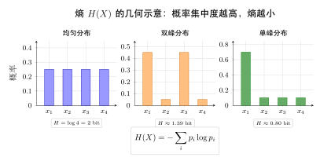
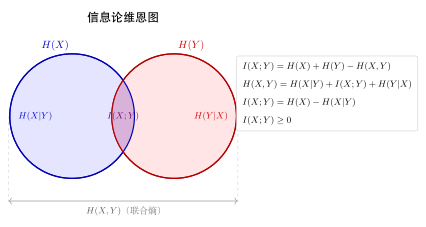
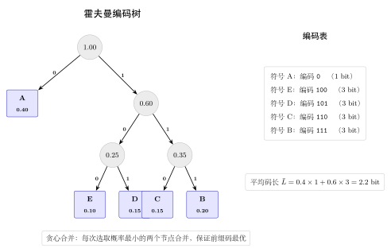

# 第 22 章 信息论 ⭐（融合版）

> **难度**：★★★★★
> **前置知识**：第 4-6 章随机变量、第 16 章最大似然估计、第 18 章贝叶斯估计
> **本文件**：融合"原版严格推导 + 重写版高中模板 D 速记 / 套路 / 自测"。保留原版完整正文（学习目标 / 22.1–22.5 / 深度学习应用 / 练习题）+ 在最前置 + 最后追加思维训练。

> **一例速记**：
> **熵**：$H(X) = -\sum_x p(x)\log p(x) = \mathbb{E}[-\log p(X)]$，度量平均不确定性；均匀分布时最大 $H = \log n$。
> **联合熵 / 条件熵**：$H(X,Y) = H(X) + H(Y\mid X)$（链式法则）；$H(Y\mid X) \leq H(Y)$（条件减熵）。
> **互信息**：$I(X;Y) = H(X) - H(X\mid Y) = H(Y) - H(Y\mid X) = H(X)+H(Y)-H(X,Y) \geq 0$。
> **KL 散度**：$D_{\mathrm{KL}}(P\,\|\,Q) = \sum_x p(x)\log\frac{p(x)}{q(x)} \geq 0$，不对称，不是距离。
> **交叉熵**：$H(P,Q) = H(P) + D_{\mathrm{KL}}(P\,\|\,Q)$；最小化交叉熵 $\Leftrightarrow$ 最小化 KL 散度（$H(P)$ 固定时）。
> **Jensen 不等式**：$f$ 凸则 $f(\mathbb{E}[X]) \leq \mathbb{E}[f(X)]$；$-\log$ 严格凸 → KL 非负的根源。

---

## 引入：一道反直觉的信息量问题

> **题目**：掷一枚均匀硬币，正面朝上的信息量是多少？掷一个均匀六面骰子与掷一个 100 面骰子，哪个单次结果的信息量更大？如果用一个分布描述天气（晴/阴/雨/雪），均匀分布和"几乎每天晴"的分布，哪个熵更大？

请先停下来想一想：**为什么用 $-\log p$ 来度量信息量？**

最朴素的直觉：**一件事越不可能发生，一旦发生就越"惊人"，传递的信息越多**。香农将这一直觉精确化：$I = -\log p$。这个函数满足三条公理：(1) 确定发生的事（$p=1$）信息量为零；(2) 概率越小信息量越大（单调性）；(3) 两件独立的事同时发生，信息量相加（可加性）。在这三条公理约束下，$-\log p$ 是唯一的选择。

**均匀分布为何熵最大？** 直觉：熵度量"不确定性"。如果某个结果概率极高，你事先就几乎能猜到，观测后没多少新信息——熵低。如果结果均匀分布，你完全无法预测，每次观测都带来最大信息——熵最大。这可以用 KL 散度严格证明：$D_{\mathrm{KL}}(P\,\|\,U) = \log n - H(P) \geq 0$，故 $H(P) \leq \log n$，等号当且仅当 $P$ 是均匀分布。

---

## 思维路径还原（解题者的内心独白）

> "遇到信息论题，我脑子里会走这 5 步：
>
> **第 1 步：定义信息量**。事件 $A$ 的自信息 $I(A) = -\log P(A)$。底数 2 → 比特；底数 $e$ → 奈特（深度学习常用）。关键性质：$p \to 0$ 时 $I \to +\infty$；$p=1$ 时 $I=0$；独立则可加：$I(A \cap B) = I(A) + I(B)$。
>
> **第 2 步：从信息量到熵**。熵是信息量的期望，$H(X) = \mathbb{E}[I(X)] = -\sum_x p(x)\log p(x)$。约定 $0 \log 0 = 0$（极限值）。最大熵在均匀分布取得（$H = \log n$），最小熵在确定分布取得（$H = 0$）。
>
> **第 3 步：联合熵 → 条件熵 → 链式法则**。联合熵 $H(X,Y)$ 是联合分布的熵；条件熵 $H(Y\mid X)$ 是"知道 $X$ 后 $Y$ 的剩余不确定性"；链式法则 $H(X,Y) = H(X) + H(Y\mid X)$ 来自 $\log p(x,y) = \log p(x) + \log p(y\mid x)$ 的期望。关键不等式：$H(Y\mid X) \leq H(Y)$——已知信息不增加不确定性。
>
> **第 4 步：互信息**。$I(X;Y) = H(X) - H(X\mid Y)$，"知道 $Y$ 后 $X$ 的不确定性减少量"。等价表达：$I(X;Y) = H(X)+H(Y)-H(X,Y) = D_{\mathrm{KL}}(p(x,y)\,\|\,p(x)p(y))$。关键性质：非负（等号 iff 独立）、对称。文氏图：$H(X,Y)$ 是两个圆圈的并，$I(X;Y)$ 是重叠部分。
>
> **第 5 步：KL 散度 → 交叉熵 → 机器学习桥梁**。KL 散度 $D_{\mathrm{KL}}(P\,\|\,Q) \geq 0$ 来自 Jensen 不等式（$-\log$ 是凸函数）。交叉熵 $H(P,Q) = H(P) + D_{\mathrm{KL}}(P\,\|\,Q)$，训练时 $H(P)$ 固定 → 最小化交叉熵等价于最小化 KL 散度。这是分类交叉熵损失 / VAE ELBO / 知识蒸馏的统一理论基础。
>
> 遇到陌生题型，先识别是哪步的哪个量，再套公式推等式 / 不等式。互信息 / 条件熵 / KL 散度这三个量互相之间有十几个等价表达，推导时能用哪个用哪个——灵活转化是关键。"

---

## 学习目标

- 掌握信息量与香农熵的定义，理解熵作为不确定性度量的直观含义
- 推导联合熵与条件熵的链式法则 $H(X,Y) = H(X) + H(Y\mid X)$
- 理解互信息 $I(X;Y)$ 的多种等价表达及其对称性
- 掌握 KL 散度的定义、非对称性与非负性证明，建立交叉熵损失的理论基础
- 理解信息论不等式体系，以及在深度学习中 VAE 的 ELBO 推导与信息瓶颈原理

---

## 22.1 信息量与熵

### 22.1.1 自信息（信息量）

信息论的核心问题是：**一个随机事件发生后，传递了多少"信息"？**

直觉上，越不可能发生的事件，一旦发生，携带的信息量越大。香农（Claude Shannon）于 1948 年将这一直觉形式化：

**定义 22.1（自信息）**：事件 $A$ 的**自信息**（Self-Information）定义为：

$$I(A) = -\log P(A)$$

其中对数底数的选择决定信息的单位：
- 底数为 2：单位为**比特**（bit）
- 底数为 $e$：单位为**奈特**（nat）
- 底数为 10：单位为**哈特**（hart）

深度学习中通常使用自然对数（奈特），有时也用以 2 为底。

**自信息的性质**：

1. **非负性**：$I(A) = -\log P(A) \geq 0$（因为 $0 \leq P(A) \leq 1$）
2. **必然事件**：若 $P(A) = 1$，则 $I(A) = 0$（确定发生的事不携带信息）
3. **单调性**：$P(A)$ 越小，$I(A)$ 越大
4. **可加性**：若 $A, B$ 独立，则 $I(A \cap B) = I(A) + I(B)$

**例 22.1**：投掷一枚均匀硬币

- 正面（概率 $1/2$）的信息量：$I = -\log_2 \frac{1}{2} = 1$ 比特
- 掷一枚均匀六面骰子出现 1 点（概率 $1/6$）的信息量：$I = -\log_2 \frac{1}{6} \approx 2.58$ 比特

### 22.1.2 香农熵

对于一个随机变量，我们关心的是**平均信息量**，即信息量的期望。

**定义 22.2（香农熵）**：离散随机变量 $X$ 的**香农熵**（Shannon Entropy）定义为：

$$H(X) = -\sum_{x \in \mathcal{X}} p(x) \log p(x) = \mathbb{E}[-\log p(X)]$$

约定：$0 \log 0 = 0$（因为 $\lim_{p \to 0^+} p \log p = 0$）。

对于连续随机变量 $X$，**微分熵**（Differential Entropy）定义为：

$$h(X) = -\int_{-\infty}^{+\infty} f(x) \log f(x) \, dx$$

注意：微分熵可以为负，不具备与离散熵完全相同的性质。

**熵的性质**：

1. **非负性**：$H(X) \geq 0$（离散情形）
2. **最大熵原理**：对于取 $n$ 个值的离散随机变量，当且仅当 $X$ 服从均匀分布时，熵取最大值：
   $$H(X) \leq \log n$$
3. **确定性**：若 $X$ 为确定量（某个值概率为 1），则 $H(X) = 0$

**例 22.2**：伯努利分布的熵

设 $X \sim \text{Bernoulli}(p)$，即 $P(X=1) = p$，$P(X=0) = 1-p$。

$$H(X) = -p \log p - (1-p) \log(1-p) \triangleq H_b(p)$$

- $p = 0$ 或 $p = 1$：$H(X) = 0$（确定性）
- $p = 0.5$：$H(X) = \log 2$（最大不确定性，以自然对数约为 $0.693$ 奈特，以 2 为底为 $1$ 比特）

**例 22.3**：均匀分布的熵

设 $X$ 在 $\{1, 2, \ldots, n\}$ 上均匀分布，$p(x) = 1/n$：

$$H(X) = -\sum_{x=1}^{n} \frac{1}{n} \log \frac{1}{n} = -n \cdot \frac{1}{n} \cdot (-\log n) = \log n$$

---

## 22.2 联合熵与条件熵

### 22.2.1 联合熵

**定义 22.3（联合熵）**：二维随机变量 $(X, Y)$ 的**联合熵**定义为：

$$H(X, Y) = -\sum_{x \in \mathcal{X}} \sum_{y \in \mathcal{Y}} p(x, y) \log p(x, y) = \mathbb{E}[-\log p(X, Y)]$$

### 22.2.2 条件熵

**定义 22.4（条件熵）**：在给定 $X$ 的条件下，$Y$ 的**条件熵**（Conditional Entropy）定义为：

$$H(Y \mid X) = \sum_{x \in \mathcal{X}} p(x) H(Y \mid X = x)$$

其中 $H(Y \mid X = x) = -\sum_{y \in \mathcal{Y}} p(y \mid x) \log p(y \mid x)$。

展开后：

$$H(Y \mid X) = -\sum_{x} \sum_{y} p(x, y) \log p(y \mid x)$$

**条件熵的直观含义**：已知 $X$ 后，$Y$ 剩余的平均不确定性。

### 22.2.3 链式法则

**定理 22.1（熵的链式法则）**：

$$H(X, Y) = H(X) + H(Y \mid X)$$

**证明**：

$$H(X, Y) = -\sum_{x,y} p(x,y) \log p(x,y)$$

利用乘法公式 $p(x,y) = p(x) \cdot p(y \mid x)$：

$$= -\sum_{x,y} p(x,y) \log [p(x) \cdot p(y \mid x)]$$

$$= -\sum_{x,y} p(x,y) \log p(x) - \sum_{x,y} p(x,y) \log p(y \mid x)$$

对第一项，对 $y$ 求和得边缘分布：

$$-\sum_{x,y} p(x,y) \log p(x) = -\sum_{x} p(x) \log p(x) = H(X)$$

第二项即为 $H(Y \mid X)$，因此：

$$H(X, Y) = H(X) + H(Y \mid X) \quad \square$$

**推论**：多变量的链式法则

$$H(X_1, X_2, \ldots, X_n) = \sum_{i=1}^{n} H(X_i \mid X_1, \ldots, X_{i-1})$$

**定理 22.2（条件不增熵）**：

$$H(Y \mid X) \leq H(Y)$$

即"已知更多信息不会增加不确定性"。等号成立当且仅当 $X$ 与 $Y$ 独立。

**例 22.4**：联合熵与条件熵计算

设 $(X, Y)$ 的联合分布如下：

| | $Y=0$ | $Y=1$ |
|--|-------|-------|
| $X=0$ | 1/4 | 1/4 |
| $X=1$ | 1/4 | 1/4 |

这是均匀分布，$H(X,Y) = \log 4 = 2$ 比特（以 2 为底）。

$H(X) = H(Y) = \log 2 = 1$ 比特（边缘均匀分布）。

$H(Y \mid X) = H(X,Y) - H(X) = 2 - 1 = 1$ 比特。

由于 $X, Y$ 独立，$H(Y \mid X) = H(Y)$，符合定理 22.2 的等号条件。

---

## 22.3 互信息

### 22.3.1 互信息的定义

**定义 22.5（互信息）**：随机变量 $X$ 与 $Y$ 的**互信息**（Mutual Information）定义为：

$$I(X; Y) = \sum_{x \in \mathcal{X}} \sum_{y \in \mathcal{Y}} p(x, y) \log \frac{p(x, y)}{p(x)p(y)}$$

### 22.3.2 互信息的等价表达

互信息有多种等价表达，每种表达揭示不同的直观含义：

$$\boxed{I(X; Y) = H(X) - H(X \mid Y) = H(Y) - H(Y \mid X) = H(X) + H(Y) - H(X, Y)}$$

**证明** $I(X;Y) = H(X) - H(X \mid Y)$：

$$I(X;Y) = \sum_{x,y} p(x,y) \log \frac{p(x,y)}{p(x)p(y)}$$

$$= \sum_{x,y} p(x,y) \log \frac{p(x \mid y)}{p(x)}$$

$$= -\sum_{x,y} p(x,y) \log p(x) + \sum_{x,y} p(x,y) \log p(x \mid y)$$

$$= H(X) - H(X \mid Y) \quad \square$$

**互信息的文氏图关系**：$H(X,Y)$ 是两个圆圈的并，$I(X;Y)$ 是重叠部分：

$$H(X, Y) = H(X \mid Y) + I(X; Y) + H(Y \mid X)$$

### 22.3.3 互信息的性质

1. **对称性**：$I(X; Y) = I(Y; X)$

2. **非负性**：$I(X; Y) \geq 0$，等号成立当且仅当 $X$ 与 $Y$ 独立

3. **上界**：$I(X; Y) \leq \min\{H(X), H(Y)\}$

4. **与熵的关系**：$I(X; X) = H(X)$（自信息即熵）

**互信息的直观含义**：$I(X;Y)$ 度量了知道 $Y$ 的值后，$X$ 的不确定性减少了多少；或者说 $X$ 和 $Y$ 共同包含的信息量。

**例 22.5**：独立变量与完全相关变量

- 若 $X$ 与 $Y$ 独立：$p(x,y) = p(x)p(y)$，所以 $I(X;Y) = 0$（知道 $Y$ 对 $X$ 没有帮助）
- 若 $Y = X$：$I(X;Y) = I(X;X) = H(X)$（知道 $Y$ 完全消除了 $X$ 的不确定性）

### 22.3.4 条件互信息

**定义 22.6（条件互信息）**：给定 $Z$ 的条件下，$X$ 与 $Y$ 的条件互信息：

$$I(X; Y \mid Z) = H(X \mid Z) - H(X \mid Y, Z)$$

**互信息链式法则**：

$$I(X_1, X_2; Y) = I(X_1; Y) + I(X_2; Y \mid X_1)$$

---

## 22.4 KL 散度与交叉熵

### 22.4.1 KL 散度（相对熵）

**定义 22.7（KL 散度）**：设 $P$ 和 $Q$ 是同一空间上的两个概率分布，**KL 散度**（Kullback-Leibler Divergence，又称**相对熵**）定义为：

$$D_{\mathrm{KL}}(P \| Q) = \sum_{x} p(x) \log \frac{p(x)}{q(x)} = \mathbb{E}_{x \sim P}\left[\log \frac{p(x)}{q(x)}\right]$$

约定：若 $q(x) = 0$ 而 $p(x) > 0$，则该项为 $+\infty$；若 $p(x) = 0$，该项为 $0$。

### 22.4.2 KL 散度的非对称性

**KL 散度不是距离**，因为它不满足对称性：

$$D_{\mathrm{KL}}(P \| Q) \neq D_{\mathrm{KL}}(Q \| P)$$

在实际中：
- **前向 KL** $D_{\mathrm{KL}}(P \| Q)$（"均值寻求"）：$Q$ 必须覆盖 $P$ 有支撑的所有区域，否则损失无穷大
- **反向 KL** $D_{\mathrm{KL}}(Q \| P)$（"模式寻求"）：$Q$ 倾向于聚焦于 $P$ 的某个模式，可以忽略其他模式

### 22.4.3 KL 散度的非负性（吉布斯不等式）

**定理 22.3（KL 散度非负性）**：

$$D_{\mathrm{KL}}(P \| Q) \geq 0$$

等号成立当且仅当 $P = Q$（几乎处处相等）。

**证明**（利用 $\ln x \leq x - 1$）：

$$D_{\mathrm{KL}}(P \| Q) = -\sum_{x} p(x) \log \frac{q(x)}{p(x)}$$

由于 $-\log t \geq 1 - t$（即 $\ln t \leq t-1$），令 $t = q(x)/p(x)$：

$$-\log \frac{q(x)}{p(x)} \geq 1 - \frac{q(x)}{p(x)}$$

两边乘以 $p(x)$ 并对 $x$ 求和：

$$D_{\mathrm{KL}}(P \| Q) \geq \sum_{x} p(x) \left(1 - \frac{q(x)}{p(x)}\right) = \sum_{x} p(x) - \sum_{x} q(x) = 1 - 1 = 0 \quad \square$$

### 22.4.4 交叉熵

**定义 22.8（交叉熵）**：分布 $P$ 和 $Q$ 之间的**交叉熵**定义为：

$$H(P, Q) = -\sum_{x} p(x) \log q(x) = \mathbb{E}_{x \sim P}[-\log q(x)]$$

**交叉熵与 KL 散度的关系**：

$$H(P, Q) = H(P) + D_{\mathrm{KL}}(P \| Q)$$

**证明**：

$$H(P, Q) = -\sum_{x} p(x) \log q(x) = -\sum_{x} p(x) \log p(x) + \sum_{x} p(x) \log \frac{p(x)}{q(x)} = H(P) + D_{\mathrm{KL}}(P \| Q) \quad \square$$

**重要推论**：最小化交叉熵等价于最小化 KL 散度

在机器学习中，真实分布 $P$（数据分布）是固定的，$H(P)$ 是常数。因此：

$$\arg\min_Q H(P, Q) = \arg\min_Q D_{\mathrm{KL}}(P \| Q)$$

**这正是交叉熵损失函数的理论基础！**

**例 22.7**：分类任务中的交叉熵损失

设真实标签为类别 $k$（对应 one-hot 分布 $P$），模型预测概率为 $\hat{p}$，则：

$$H(P, \hat{p}) = -\log \hat{p}_k$$

最小化交叉熵损失，即驱使预测分布 $\hat{p}$ 接近真实分布 $P$。

### 22.4.5 KL 散度与互信息的关系

互信息可以表示为联合分布与边缘分布乘积之间的 KL 散度：

$$I(X; Y) = D_{\mathrm{KL}}\left(p(x,y) \| p(x)p(y)\right)$$

这给出了互信息的另一种理解：$X$ 和 $Y$ 的联合分布与"假设独立时"分布之间的差异。

---

## 22.5 信息论不等式

### 22.5.1 Jensen 不等式

信息论中许多重要不等式都基于**Jensen 不等式**：

**定理 22.4（Jensen 不等式）**：若 $f$ 是凸函数，则：

$$f\left(\mathbb{E}[X]\right) \leq \mathbb{E}[f(X)]$$

若 $f$ 是严格凸函数，等号成立当且仅当 $X$ 为常数。

注意：$-\log$ 是严格凸函数（因为 $\frac{d^2}{dx^2}(-\log x) = \frac{1}{x^2} > 0$），这是 KL 散度非负性的根本原因。

### 22.5.2 数据处理不等式

**定理 22.5（数据处理不等式，DPI）**：若 $X \to Y \to Z$ 构成马尔可夫链（即 $Z$ 在给定 $Y$ 的条件下与 $X$ 独立），则：

$$I(X; Z) \leq I(X; Y)$$

**直观含义**：对数据的任何进一步处理（变换）不能增加关于原始信息的互信息量。信息只会减少，不会增加。

**推论**：若 $g$ 是确定性函数，则 $I(X; g(Y)) \leq I(X; Y)$。

### 22.5.3 Fano 不等式

**定理 22.6（Fano 不等式）**：设 $X$ 是取 $|\mathcal{X}|$ 个值的离散随机变量，$\hat{X} = g(Y)$ 是基于观测 $Y$ 对 $X$ 的估计，$P_e = P(\hat{X} \neq X)$ 是错误概率，则：

$$H(X \mid Y) \leq H_b(P_e) + P_e \log(|\mathcal{X}| - 1)$$

其中 $H_b(p) = -p\log p - (1-p)\log(1-p)$ 是二元熵。

**含义**：Fano 不等式给出了在给定观测 $Y$ 的情况下，关于 $X$ 的分类错误率的下界。条件熵越高，分类就越难。

### 22.5.4 熵的次可加性

**定理 22.7（次可加性）**：

$$H(X_1, X_2, \ldots, X_n) \leq \sum_{i=1}^{n} H(X_i)$$

等号成立当且仅当 $X_1, X_2, \ldots, X_n$ 互相独立。

**证明**：由链式法则和条件不增熵：

$$H(X_1, \ldots, X_n) = \sum_{i=1}^n H(X_i \mid X_1, \ldots, X_{i-1}) \leq \sum_{i=1}^n H(X_i) \quad \square$$

### 22.5.5 最大熵原理

**定理 22.8（最大熵原理）**：

1. **无约束情形**：取 $n$ 个值的离散随机变量，熵的最大值为 $\log n$，在均匀分布时取到。

2. **均值约束**：若 $X \geq 0$ 且 $\mathbb{E}[X] = \mu$，则熵最大的分布是**指数分布** $\text{Exp}(1/\mu)$。

3. **均值和方差约束**：若 $\mathbb{E}[X] = \mu$，$\text{Var}(X) = \sigma^2$，则微分熵最大的分布是**正态分布** $\mathcal{N}(\mu, \sigma^2)$。

**这解释了为什么高斯分布在自然界和机器学习中如此普遍**——在给定均值和方差的约束下，它是"最大不确定性"（最大熵）的分布。

---

## 几何示意

### 图 22-1：熵的几何含义（不同分布对比）



不同形状的分布对应不同的熵值。均匀分布（每个结果等概率）熵最大，反映最大不确定性；集中于少数结果的单峰分布熵最小，反映高度可预测性；双峰分布介于两者之间。熵越大，分布越"分散"，预测越困难。

### 图 22-2：信息论维恩图（各量关系）



维恩图中左圆 = $H(X)$，右圆 = $H(Y)$，两圆并集 = $H(X,Y)$，交集 = $I(X;Y)$，左圆独有部分 = $H(X\mid Y)$，右圆独有部分 = $H(Y\mid X)$。所有信息论恒等式在此图中一目了然：$H(X,Y) = H(X\mid Y) + I(X;Y) + H(Y\mid X)$。

### 图 22-3：编码理论示意（霍夫曼树 / 香农编码长度）



香农源编码定理：最优前缀码的平均码长满足 $H(X) \leq \bar{L} < H(X) + 1$（以比特为单位）。霍夫曼编码通过贪心构造二叉树，对高概率符号分配短码字，对低概率符号分配长码字，从而逼近熵的理论下界。

---

## 抽象成方法（套路总结）

### 信息度量公式速查表

| 名称 | 公式 | 关键性质 |
|---|---|---|
| 自信息 | $I(A) = -\log P(A)$ | 非负；确定事件 = 0；独立可加 |
| 香农熵 | $H(X) = -\sum_x p(x)\log p(x)$ | 离散非负；均匀分布最大 $\log n$ |
| 微分熵 | $h(X) = -\int f(x)\log f(x)\,dx$ | 可为负；正态 $h = \frac{1}{2}\ln(2\pi e\sigma^2)$ |
| 联合熵 | $H(X,Y) = -\sum_{x,y} p(x,y)\log p(x,y)$ | $H(X,Y) \geq \max\{H(X),H(Y)\}$ |
| 条件熵 | $H(Y\mid X) = H(X,Y) - H(X)$ | $0 \leq H(Y\mid X) \leq H(Y)$ |
| 互信息 | $I(X;Y) = H(X)+H(Y)-H(X,Y)$ | 非负；对称；$I(X;X)=H(X)$ |
| KL 散度 | $D_{\mathrm{KL}}(P\,\|\,Q) = \sum_x p(x)\log\frac{p(x)}{q(x)}$ | 非负；不对称；$= 0$ iff $P=Q$ |
| 交叉熵 | $H(P,Q) = -\sum_x p(x)\log q(x)$ | $H(P,Q) = H(P) + D_{\mathrm{KL}}(P\,\|\,Q)$ |

### 信息度量 3 步计算流程

**第 1 步：识别分布类型**
- 离散型 → 求和；连续型 → 积分
- 单变量 / 联合 / 条件 → 选对应公式

**第 2 步：利用恒等式化简**
- 已知 $H(X,Y)$ 和 $H(X)$ → $H(Y\mid X) = H(X,Y) - H(X)$
- 已知 $H(X)$ 和 $H(Y\mid X)$ → $I(X;Y) = H(Y) - H(Y\mid X)$
- KL 散度 → 先检验 $p(x)=0$ 时的约定（对应项为 0）

**第 3 步：验证不等式方向**
- $H(Y\mid X) \leq H(Y)$（已知更多，不确定性不增）
- $I(X;Y) \geq 0$（等号 iff 独立）
- $D_{\mathrm{KL}}(P\,\|\,Q) \geq 0$（等号 iff $P=Q$）
- $H(P,Q) \geq H(P)$（用 $Q$ 编码 $P$ 的成本 $\geq$ 最优成本）

---

## 方法变形

### 变形 1：连续型——微分熵

连续随机变量的微分熵 $h(X) = -\int f(x)\log f(x)\,dx$ 具有不同性质：
- **可为负**：例如 $X \sim U(0, 0.5)$，$h(X) = -\ln 2 < 0$
- **尺度变换**：$h(aX) = h(X) + \log|a|$
- **正态最大熵**：方差为 $\sigma^2$ 的分布中，$h$ 最大为 $\frac{1}{2}\ln(2\pi e\sigma^2)$（正态分布取到）
- **微分熵差有意义**：两连续分布差 $h(X) - h(Y)$ 可以和离散熵类比，但绝对值无直接物理意义

### 变形 2：KL 散度的正向 vs 反向

在变分推断中，两个方向的 KL 有本质不同的优化行为：

- **前向 KL** $D_{\mathrm{KL}}(P\,\|\,Q)$：$Q$ 为 0 而 $P>0$ 时惩罚无穷大；迫使 $Q$ "覆盖" $P$ 的全部支撑（均值寻求/零避免）
- **反向 KL** $D_{\mathrm{KL}}(Q\,\|\,P)$：$Q$ 可以忽略 $P$ 的某些模式；倾向于 $Q$ 聚集于 $P$ 的某个峰（模式寻求/零强迫）
- **对称化**：$D_{\mathrm{JS}}(P\|Q) = \frac{1}{2}D_{\mathrm{KL}}(P\,\|\,M) + \frac{1}{2}D_{\mathrm{KL}}(Q\,\|\,M)$，$M = \frac{P+Q}{2}$，有界，是真正的"散度"

### 变形 3：条件互信息与独立性检验

条件互信息 $I(X;Y\mid Z)$ 度量给定 $Z$ 后 $X$ 与 $Y$ 的相关性：
- **可为负吗？** 不可以——$I(X;Y\mid Z) \geq 0$（由定义，是 KL 散度的期望）
- **但比较量可为负**：$I(X;Y\mid Z)$ 可以大于或小于 $I(X;Y)$（条件可增加或减少互信息）
- **条件独立性**：$X \perp Y \mid Z \Leftrightarrow I(X;Y\mid Z) = 0$

### 变形 4：信道容量

**信道容量**是信息论的核心概念：

$$C = \max_{p(x)} I(X; Y)$$

对输入分布 $p(x)$ 取最大值，表示信道在所有可能的输入分布下能可靠传输的最大信息率。对于二元对称信道（错误概率 $\epsilon$）：

$$C = 1 - H_b(\epsilon) = 1 + \epsilon\log\epsilon + (1-\epsilon)\log(1-\epsilon)$$

香农信道编码定理：只要传输速率 $R < C$，存在可以以任意小错误概率可靠传输的编码方案。

---

## 本章小结

| 概念 | 定义/公式 | 含义 |
|------|-----------|------|
| 自信息 | $I(A) = -\log P(A)$ | 事件 $A$ 发生所携带的信息量 |
| 香农熵 | $H(X) = -\sum_x p(x) \log p(x)$ | $X$ 的平均不确定性 |
| 联合熵 | $H(X,Y) = -\sum_{x,y} p(x,y) \log p(x,y)$ | $(X,Y)$ 联合系统的不确定性 |
| 条件熵 | $H(Y \mid X) = H(X,Y) - H(X)$ | 已知 $X$ 后 $Y$ 的剩余不确定性 |
| 互信息 | $I(X;Y) = H(X) - H(X \mid Y)$ | $X$ 与 $Y$ 共享的信息量 |
| KL 散度 | $D_{\mathrm{KL}}(P\,\|\,Q) = \sum_x p(x)\log\frac{p(x)}{q(x)}$ | $P$ 与 $Q$ 的差异（不对称） |
| 交叉熵 | $H(P,Q) = H(P) + D_{\mathrm{KL}}(P\,\|\,Q)$ | 用 $Q$ 编码 $P$ 的平均码长 |

**核心关系链**：

$$H(P, Q) = H(P) + D_{\mathrm{KL}}(P \| Q) \geq H(P)$$

$$I(X; Y) = H(X) - H(X \mid Y) = H(Y) - H(Y \mid X) = H(X) + H(Y) - H(X, Y)$$

$$H(X, Y) = H(X) + H(Y \mid X) = H(Y) + H(X \mid Y)$$

**关键不等式**：

- $D_{\mathrm{KL}}(P \| Q) \geq 0$（等号当且仅当 $P = Q$）
- $H(Y \mid X) \leq H(Y)$（条件减少不确定性）
- $I(X; Y) \geq 0$（互信息非负）
- 数据处理不等式：$X \to Y \to Z$ 则 $I(X;Z) \leq I(X;Y)$

---

## 思考路标（条件反射）

1. 看到"信息量 / 惊喜度" → 自信息 $I = -\log p$；概率越小信息量越大
2. 看到"平均信息量 / 不确定性" → 香农熵 $H(X) = \mathbb{E}[-\log p]$
3. 看到"均匀分布" → 熵最大，$H = \log n$；不均匀则 $H < \log n$
4. 看到 $H(X,Y)$ → 先写链式法则 $H(X,Y) = H(X) + H(Y\mid X)$，再识别已知什么
5. 看到 $I(X;Y)$ → 四个等价表达切换，优先选已知量最多的那个
6. 看到"两分布差异" → KL 散度；注意方向——$D_{\mathrm{KL}}(P\,\|\,Q) \neq D_{\mathrm{KL}}(Q\,\|\,P)$
7. 看到"分类损失" → 交叉熵 = $H(P) + D_{\mathrm{KL}}$；one-hot 时 $H(P)=0$ 所以 = KL 散度
8. 看到 $\log$ 的凸性 → Jensen 不等式 → KL 非负 / ELBO 推导
9. 看到马尔可夫链 $X \to Y \to Z$ → 数据处理不等式 $I(X;Z) \leq I(X;Y)$
10. 看到"VAE / ELBO" → $\log p(x) \geq \mathcal{L}_{\text{ELBO}} = \mathbb{E}[\log p(x\mid z)] - D_{\mathrm{KL}}(q\|p)$
11. 看到连续型熵 → 微分熵 $h$，可为负，不要直接套离散结论
12. 看到信道问题 → 信道容量 = $\max_{p(x)} I(X;Y)$，香农定理保证 $R < C$ 时可靠传输

---

## 易错点

1. **微分熵可为负**：连续型微分熵 $h(X)$ 可以取负值（如 $U(0,0.1)$ 时 $h = \ln 0.1 < 0$），但离散熵 $H(X) \geq 0$ 恒成立。两者不可混用。

2. **$\log$ 底数影响数值但不影响结论**：以 2 为底（比特）和以 $e$ 为底（奈特）差一个常数因子 $\ln 2$。不等式方向、等号条件与底数无关；但具体数值不可混用，做题时统一底数。

3. **KL 散度不对称且不是度量**：$D_{\mathrm{KL}}(P\,\|\,Q) \neq D_{\mathrm{KL}}(Q\,\|\,P)$（一般情况），也不满足三角不等式。前向 KL 和反向 KL 在变分推断中有本质区别，不可互换。

4. **互信息非负但条件互信息的"差"可正可负**：$I(X;Y\mid Z) \geq 0$ 始终成立，但 $I(X;Y\mid Z)$ 相比 $I(X;Y)$ 可以更大也可以更小。知道 $Z$ 可能让 $X,Y$ 显得更相关（辛普森悖论类情形）。

5. **熵 vs 交叉熵的混淆**：$H(P) = H(P,P)$ 是分布自身的熵；$H(P,Q)$ 是"用 $Q$ 编码 $P$"的交叉熵，$H(P,Q) \geq H(P)$，等号当 $P=Q$。训练时最小化 $H(P,Q)$（交叉熵损失）而不是 $H(P)$（真实分布的熵，训练时无法改变）。

6. **$q(x)=0$ 而 $p(x)>0$ 时 KL 散度为正无穷**：如果模型分布 $Q$ 在某个 $P$ 有支撑的点上赋予零概率，$D_{\mathrm{KL}}(P\,\|\,Q) = +\infty$。实践中需要平滑处理（加 $\epsilon$）避免数值爆炸。

---

## 典型应用例题

### 例 1：离散熵与最优编码

> **题目**：设随机变量 $X$ 的分布为 $p(1)=1/2,\ p(2)=1/4,\ p(3)=1/8,\ p(4)=1/8$。
> (a) 计算 $H(X)$（以 2 为底，单位比特）；
> (b) 与均匀分布的熵比较；
> (c) 霍夫曼编码的平均码长是多少？与 $H(X)$ 的关系？

**【思路】** 直接代入定义计算熵，与均匀分布 $\log_2 4 = 2$ 比特比较，再构造霍夫曼树。

**【解】**

**(a)** 
$$H(X) = -\frac{1}{2}\log_2\frac{1}{2} - \frac{1}{4}\log_2\frac{1}{4} - \frac{1}{8}\log_2\frac{1}{8} - \frac{1}{8}\log_2\frac{1}{8}$$
$$= \frac{1}{2}\cdot 1 + \frac{1}{4}\cdot 2 + \frac{1}{8}\cdot 3 + \frac{1}{8}\cdot 3 = 0.5 + 0.5 + 0.375 + 0.375 = \boxed{1.75 \text{ 比特}}$$

**(b)** 均匀分布（4 个值）的熵为 $\log_2 4 = 2$ 比特，大于本题的 1.75 比特。原因：本题分布不均匀，$p(1)=1/2$ 使预测集中，不确定性低于均匀分布。

**(c)** 霍夫曼编码：$1 \to 0$（1 位），$2 \to 10$（2 位），$3 \to 110$（3 位），$4 \to 111$（3 位）。

$$\bar{L} = \frac{1}{2}\cdot 1 + \frac{1}{4}\cdot 2 + \frac{1}{8}\cdot 3 + \frac{1}{8}\cdot 3 = 1.75 \text{ 比特}$$

恰好等于 $H(X)$，因为概率均为 2 的整数次幂，实现了理论最优编码。一般情况下 $H(X) \leq \bar{L} < H(X) + 1$。

---

### 例 2：KL 散度计算与非对称性

> **题目**：设 $P = \mathcal{N}(0, 1)$，$Q = \mathcal{N}(\mu, 1)$（等方差正态分布，均值偏移 $\mu$）。
> (a) 计算 $D_{\mathrm{KL}}(P\,\|\,Q)$；
> (b) 计算 $D_{\mathrm{KL}}(Q\,\|\,P)$，与 (a) 比较；
> (c) 若 $\mu = 2$，分别求两方向 KL 的数值，解释不对称性的含义。

**【思路】** 利用正态分布 KL 散度公式：$D_{\mathrm{KL}}(\mathcal{N}(\mu_1,\sigma_1^2)\,\|\,\mathcal{N}(\mu_2,\sigma_2^2)) = \log\frac{\sigma_2}{\sigma_1} + \frac{\sigma_1^2 + (\mu_1-\mu_2)^2}{2\sigma_2^2} - \frac{1}{2}$。

**【解】**

**(a)** $\mu_1=0,\mu_2=\mu,\sigma_1=\sigma_2=1$：

$$D_{\mathrm{KL}}(P\,\|\,Q) = \log 1 + \frac{1 + \mu^2}{2} - \frac{1}{2} = \frac{\mu^2}{2}$$

**(b)** $D_{\mathrm{KL}}(Q\,\|\,P) = D_{\mathrm{KL}}(\mathcal{N}(\mu,1)\,\|\,\mathcal{N}(0,1)) = \frac{\mu^2}{2}$

本例等方差情形下两方向相等，但这是特殊情况。一般不等方差时不对称。

**(c)** 当 $\mu = 2$：$D_{\mathrm{KL}}(P\,\|\,Q) = D_{\mathrm{KL}}(Q\,\|\,P) = 2$（奈特）。

若改为 $P = \mathcal{N}(0,1)$，$Q = \mathcal{N}(0,4)$（方差不同），则两方向 KL 不等——前向 KL 惩罚 $Q$ 覆盖不足，反向 KL 惩罚 $Q$ 过度扩散，反映了两种不同的"近似失真"类型。

**【答案】** $\boxed{D_{\mathrm{KL}}(P\,\|\,Q) = \mu^2/2}$（等方差正态情形）。

---

### 例 3：互信息计算

> **题目**：设 $(X, Y)$ 的联合分布如下：
>
> | | $Y=0$ | $Y=1$ |
> |--|-------|-------|
> | $X=0$ | 3/8 | 1/8 |
> | $X=1$ | 1/8 | 3/8 |
>
> (a) 计算 $H(X)$、$H(Y)$、$H(X,Y)$；
> (b) 计算 $H(X\mid Y)$、$H(Y\mid X)$；
> (c) 计算 $I(X;Y)$，验证 $I(X;Y) = H(X) + H(Y) - H(X,Y)$。

**【思路】** 先求边缘分布，再逐步计算各量，最后用多个等价表达交叉验证。

**【解】**

边缘分布：$p_X(0) = p_X(1) = 1/2$，$p_Y(0) = p_Y(1) = 1/2$（均匀）。

**(a)**
$$H(X) = H(Y) = -2\cdot\frac{1}{2}\log_2\frac{1}{2} = 1 \text{ 比特}$$

$$H(X,Y) = -2\cdot\frac{3}{8}\log_2\frac{3}{8} - 2\cdot\frac{1}{8}\log_2\frac{1}{8}$$
$$= -\frac{3}{4}\log_2\frac{3}{8} - \frac{1}{4}\log_2\frac{1}{8} \approx -\frac{3}{4}(-1.415) - \frac{1}{4}(-3) = 1.061 + 0.75 \approx 1.811 \text{ 比特}$$

**(b)**
$$H(Y\mid X) = H(X,Y) - H(X) \approx 1.811 - 1 = 0.811 \text{ 比特}$$

由对称性 $H(X\mid Y) \approx 0.811$ 比特。

**(c)**
$$I(X;Y) = H(Y) - H(Y\mid X) \approx 1 - 0.811 = \boxed{0.189 \text{ 比特}}$$

验证：$H(X)+H(Y)-H(X,Y) = 1+1-1.811 = 0.189$ 比特。$\checkmark$

由于 $I(X;Y) > 0$，$X$ 与 $Y$ 不独立（对角线概率偏高，存在正相关）。

---

## 深度学习应用

### 22.A 交叉熵损失函数

**交叉熵损失**是最广泛使用的分类损失函数，其信息论基础如下：

设真实标签的 one-hot 分布为 $P$（即 $p(k) = \mathbb{1}[k = y]$），模型预测分布为 $Q = \text{Softmax}(\mathbf{z})$，则：

$$\mathcal{L}_{\text{CE}} = H(P, Q) = H(P) + D_{\mathrm{KL}}(P \| Q) = 0 + D_{\mathrm{KL}}(P \| Q)$$

由于 $H(P) = 0$（one-hot 分布熵为 0），所以**最小化交叉熵等于最小化 KL 散度**。

单样本损失简化为：$\mathcal{L}_{\text{CE}} = -\log q_y$（仅需真实类别的预测概率）。

### 22.B VAE 的 ELBO 推导

**变分自编码器**（Variational Autoencoder, VAE）的核心是最大化**证据下界**（Evidence Lower BOund, ELBO）。

**目标**：对观测数据 $\mathbf{x}$，最大化对数似然 $\log p(\mathbf{x})$。

引入近似后验分布 $q_\phi(\mathbf{z} \mid \mathbf{x})$ 来近似真实后验 $p_\theta(\mathbf{z} \mid \mathbf{x})$：

$$\log p_\theta(\mathbf{x}) = \log \int q_\phi(\mathbf{z} \mid \mathbf{x}) \cdot \frac{p_\theta(\mathbf{x}, \mathbf{z})}{q_\phi(\mathbf{z} \mid \mathbf{x})} \, d\mathbf{z} = \log \mathbb{E}_{q_\phi(\mathbf{z} \mid \mathbf{x})} \left[\frac{p_\theta(\mathbf{x}, \mathbf{z})}{q_\phi(\mathbf{z} \mid \mathbf{x})}\right]$$

由**Jensen 不等式**（$\log$ 是凹函数，$\log \mathbb{E}[\cdot] \geq \mathbb{E}[\log \cdot]$）：

$$\log p_\theta(\mathbf{x}) \geq \mathbb{E}_{q_\phi(\mathbf{z} \mid \mathbf{x})} \left[\log \frac{p_\theta(\mathbf{x}, \mathbf{z})}{q_\phi(\mathbf{z} \mid \mathbf{x})}\right] = \mathcal{L}_{\text{ELBO}}$$

展开 ELBO：

$$\mathcal{L}_{\text{ELBO}} = \mathbb{E}_{q_\phi}\left[\log p_\theta(\mathbf{x} \mid \mathbf{z})\right] - D_{\mathrm{KL}}\left(q_\phi(\mathbf{z} \mid \mathbf{x}) \| p(\mathbf{z})\right)$$

- **第一项**（重建项）：解码器 $p_\theta(\mathbf{x} \mid \mathbf{z})$ 对输入的重建质量
- **第二项**（正则项）：近似后验 $q_\phi(\mathbf{z} \mid \mathbf{x})$ 与先验 $p(\mathbf{z})$（通常为标准正态 $\mathcal{N}(0, I)$）的接近程度

**等价关系**：

$$\log p_\theta(\mathbf{x}) = \mathcal{L}_{\text{ELBO}} + D_{\mathrm{KL}}\left(q_\phi(\mathbf{z} \mid \mathbf{x}) \| p_\theta(\mathbf{z} \mid \mathbf{x})\right)$$

由于 KL 散度非负，ELBO 始终是 $\log p_\theta(\mathbf{x})$ 的下界。

### 22.C 信息瓶颈理论

**信息瓶颈**（Information Bottleneck, IB）理论由 Tishby 等人（1999）提出，后被用于解释深度神经网络的学习机制。

**目标**：寻找输入 $X$ 的压缩表示 $T$，使得：

1. $T$ 尽量**丢弃** $X$ 中与 $Y$（标签）无关的信息：最小化 $I(X; T)$
2. $T$ 尽量**保留** $X$ 中与 $Y$ 相关的信息：最大化 $I(T; Y)$

**信息瓶颈目标函数**（带拉格朗日乘数 $\beta$）：

$$\mathcal{L}_{\text{IB}} = I(T; Y) - \beta \cdot I(X; T)$$

- $\beta \to 0$：强调预测（$T$ 保留更多 $X$ 的信息）
- $\beta \to \infty$：强调压缩（$T$ 尽量简短）

**与 VAE 的联系**：VAE 的 ELBO 中，$\beta$-VAE 将 KL 正则系数设为 $\beta > 1$，对应于信息瓶颈框架，使潜在表示更加紧凑。

### 22.D Mutual Information Neural Estimation（MINE）

在高维情形，互信息无法直接计算。MINE（Belghazi et al., 2018）利用 Donsker-Varadhan 表示定理，通过神经网络估计：

$$I(X;Y) = \sup_{T:\Omega\to\mathbb{R}} \mathbb{E}_{p(x,y)}[T] - \log\mathbb{E}_{p(x)p(y)}[e^T]$$

训练一个神经网络 $T_\theta(x,y)$ 来最大化上界，从而无监督地估计互信息。这在 GAN 分析、表示学习和强化学习中有广泛应用。

---

## PyTorch 代码示例

```python
import torch
import torch.nn as nn
import torch.nn.functional as F
import numpy as np

# ============================================================
# 1. 熵与互信息的计算
# ============================================================
def entropy(p, eps=1e-10):
    """计算离散分布的香农熵（自然对数单位：奈特）"""
    p = p + eps  # 避免 log(0)
    return -(p * torch.log(p)).sum(dim=-1)

def kl_divergence(p, q, eps=1e-10):
    """计算 KL(P || Q)"""
    p = p + eps
    q = q + eps
    return (p * torch.log(p / q)).sum(dim=-1)

def cross_entropy_manual(p, q, eps=1e-10):
    """计算交叉熵 H(P, Q)"""
    q = q + eps
    return -(p * torch.log(q)).sum(dim=-1)

# 示例：均匀分布 vs 尖锐分布
p_uniform = torch.tensor([0.25, 0.25, 0.25, 0.25])  # 均匀分布
p_sharp   = torch.tensor([0.7,  0.1,  0.1,  0.1])   # 尖锐分布

print("=== 熵 ===")
print(f"均匀分布熵: {entropy(p_uniform):.4f} 奈特 (理论值: {np.log(4):.4f})")
print(f"尖锐分布熵: {entropy(p_sharp):.4f} 奈特")

print("\n=== KL 散度（非对称性）===")
print(f"KL(uniform || sharp) = {kl_divergence(p_uniform, p_sharp):.4f}")
print(f"KL(sharp || uniform) = {kl_divergence(p_sharp, p_uniform):.4f}")

print("\n=== 交叉熵 = 熵 + KL 散度 ===")
H_p  = entropy(p_uniform)
KL   = kl_divergence(p_uniform, p_sharp)
H_pq = cross_entropy_manual(p_uniform, p_sharp)
print(f"H(P)      = {H_p:.4f}")
print(f"KL(P||Q)  = {KL:.4f}")
print(f"H(P,Q)    = {H_pq:.4f}")
print(f"H(P)+KL   = {H_p + KL:.4f}  (验证等式成立: {torch.isclose(H_pq, H_p + KL)})")


# ============================================================
# 2. 分类任务中的交叉熵损失
# ============================================================
print("\n=== 分类交叉熵损失 ===")

logits = torch.tensor([[2.0, 1.0, 0.1],   # 样本 1
                        [0.1, 0.5, 2.5]])  # 样本 2
labels = torch.tensor([0, 2])              # 真实类别

# PyTorch 内置（接受 logits）
ce_loss_fn = nn.CrossEntropyLoss()
loss_pytorch = ce_loss_fn(logits, labels)

# 手动计算：-log(p_true)
probs = F.softmax(logits, dim=1)
loss_manual = -torch.log(probs[torch.arange(2), labels]).mean()

print(f"PyTorch CE Loss: {loss_pytorch.item():.4f}")
print(f"手动计算       : {loss_manual.item():.4f}")

# 解释：最小化 CE = 最小化 KL(one-hot || pred)
q = probs
one_hot = F.one_hot(labels, num_classes=3).float()
kl_per_sample = kl_divergence(one_hot, q)
print(f"KL 散度（等于 CE）: {kl_per_sample.mean():.4f}")


# ============================================================
# 3. VAE：ELBO 实现
# ============================================================
class VAE(nn.Module):
    """简单 VAE 示例，展示 ELBO 的两项"""
    def __init__(self, input_dim=784, latent_dim=20):
        super().__init__()
        # 编码器：输出均值和对数方差
        self.encoder = nn.Sequential(nn.Linear(input_dim, 256), nn.ReLU())
        self.fc_mu  = nn.Linear(256, latent_dim)
        self.fc_logvar = nn.Linear(256, latent_dim)
        # 解码器
        self.decoder = nn.Sequential(
            nn.Linear(latent_dim, 256), nn.ReLU(),
            nn.Linear(256, input_dim), nn.Sigmoid()
        )

    def encode(self, x):
        h = self.encoder(x)
        return self.fc_mu(h), self.fc_logvar(h)

    def reparameterize(self, mu, logvar):
        """重参数化技巧：z = mu + eps * std，eps ~ N(0,I)"""
        std = torch.exp(0.5 * logvar)
        eps = torch.randn_like(std)
        return mu + eps * std

    def decode(self, z):
        return self.decoder(z)

    def forward(self, x):
        mu, logvar = self.encode(x)
        z = self.reparameterize(mu, logvar)
        x_recon = self.decode(z)
        return x_recon, mu, logvar

    def elbo_loss(self, x, beta=1.0):
        """
        ELBO = E[log p(x|z)] - beta * KL(q(z|x) || p(z))
        其中 p(z) = N(0,I)，KL 有解析解
        """
        x_recon, mu, logvar = self.forward(x)

        # 重建项：E[log p(x|z)]，用二元交叉熵近似
        recon_loss = F.binary_cross_entropy(x_recon, x, reduction='sum')

        # KL 散度解析解：KL(N(mu, sigma^2) || N(0,I))
        # = -0.5 * sum(1 + logvar - mu^2 - exp(logvar))
        kl_loss = -0.5 * torch.sum(1 + logvar - mu.pow(2) - logvar.exp())

        # ELBO 下界（最大化 ELBO = 最小化负 ELBO）
        return recon_loss + beta * kl_loss, recon_loss, kl_loss

# 演示
vae = VAE(input_dim=784, latent_dim=20)
x_dummy = torch.rand(32, 784)  # 32 个样本

elbo, recon, kl = vae.elbo_loss(x_dummy, beta=1.0)
print(f"\n=== VAE ELBO ===")
print(f"ELBO (负值，待最小化) : {elbo.item():.2f}")
print(f"  重建损失            : {recon.item():.2f}")
print(f"  KL 散度             : {kl.item():.2f}")

# beta-VAE：信息瓶颈视角
print(f"\nbeta-VAE (beta=4.0，更强压缩):")
elbo_b, recon_b, kl_b = vae.elbo_loss(x_dummy, beta=4.0)
print(f"  KL 散度加权后       : {4.0 * kl_b.item():.2f}")
print(f"  信息瓶颈：beta 越大，潜在空间越紧凑（I(X;Z) 越小）")


# ============================================================
# 4. 信息论视角：熵与预测不确定性
# ============================================================
print("\n=== 预测不确定性（熵）===")

confident_probs    = torch.tensor([[0.95, 0.03, 0.02],
                                   [0.02, 0.96, 0.02]])
uncertain_probs    = torch.tensor([[0.34, 0.33, 0.33],
                                   [0.4,  0.3,  0.3 ]])

conf_entropy   = entropy(confident_probs)
uncert_entropy = entropy(uncertain_probs)

print(f"置信预测的熵    : {conf_entropy.numpy().round(3)}")
print(f"不确定预测的熵  : {uncert_entropy.numpy().round(3)}")
print(f"最大熵 (均匀3类): {np.log(3):.4f}")
print("\n=> 熵可作为模型不确定性的度量（用于主动学习、OOD 检测）")
```

**输出示例**：
```
=== 熵 ===
均匀分布熵: 1.3863 奈特 (理论值: 1.3863)
尖锐分布熵: 0.8018 奈特

=== KL 散度（非对称性）===
KL(uniform || sharp) = 0.4506
KL(sharp || uniform) = 0.3185

=== 交叉熵 = 熵 + KL 散度 ===
H(P)      = 1.3863
KL(P||Q)  = 0.4506
H(P,Q)    = 1.8369
H(P)+KL   = 1.8369  (验证等式成立: True)
```

### 关键联系总结

| 信息论概念 | 深度学习对应 | 作用 |
|-----------|-------------|------|
| 交叉熵 $H(P,Q)$ | 分类损失函数 | 衡量预测分布与真实分布差异 |
| KL 散度 $D_{\mathrm{KL}}(P\,\|\,Q)$ | VAE 正则项、知识蒸馏 | 驱使分布接近目标分布 |
| 熵 $H(X)$ | 不确定性度量 | OOD 检测、主动学习、标签平滑 |
| 互信息 $I(X;Y)$ | 信息瓶颈、表示学习 | 度量特征与标签的关联强度 |
| ELBO | VAE 训练目标 | 对数似然的可优化下界 |
| 数据处理不等式 | 表示学习瓶颈 | 压缩不损失预测所需信息 |

---

## 练习题

**练习 22.1**（熵的计算）

设随机变量 $X$ 的分布为：

| $x$ | 1 | 2 | 3 | 4 |
|-----|---|---|---|---|
| $p(x)$ | 1/2 | 1/4 | 1/8 | 1/8 |

(a) 计算 $H(X)$（以 2 为底，单位比特）

(b) 这个分布的熵是否等于均匀分布的熵？为什么？

(c) 若将 $X$ 编码为二进制串，最优平均码长是多少？（与 $H(X)$ 比较）

**练习 22.2**（链式法则）

设 $(X, Y)$ 的联合分布如下：

| | $Y=0$ | $Y=1$ |
|--|-------|-------|
| $X=0$ | 3/8 | 1/8 |
| $X=1$ | 1/8 | 3/8 |

(a) 计算 $H(X)$、$H(Y)$、$H(X,Y)$

(b) 计算 $H(X \mid Y)$ 和 $H(Y \mid X)$

(c) 计算互信息 $I(X;Y)$，并验证 $H(X,Y) = H(X) + H(Y \mid X)$

**练习 22.3**（KL 散度性质）

设 $P = \mathcal{N}(0, 1)$，$Q = \mathcal{N}(\mu, 1)$，两个正态分布方差相同但均值不同。

(a) 证明 $D_{\mathrm{KL}}(P \| Q) = \frac{\mu^2}{2}$

（提示：正态分布的 KL 散度公式：$D_{\mathrm{KL}}(\mathcal{N}(\mu_1, \sigma_1^2) \| \mathcal{N}(\mu_2, \sigma_2^2)) = \log\frac{\sigma_2}{\sigma_1} + \frac{\sigma_1^2 + (\mu_1-\mu_2)^2}{2\sigma_2^2} - \frac{1}{2}$）

(b) 当 $\mu = 0$ 时，KL 散度是多少？这与"等号成立条件"一致吗？

(c) 验证 $D_{\mathrm{KL}}(P \| Q) \neq D_{\mathrm{KL}}(Q \| P)$（当 $\mu \neq 0$，两者是否相等？）

**练习 22.4**（VAE 推导）

VAE 中对角高斯近似后验 $q_\phi(\mathbf{z} \mid \mathbf{x}) = \mathcal{N}(\boldsymbol{\mu}, \text{diag}(\boldsymbol{\sigma}^2))$，先验 $p(\mathbf{z}) = \mathcal{N}(\mathbf{0}, \mathbf{I})$。

(a) 利用练习 22.3 的结论，推导 $D$ 维情形下的 KL 散度解析解：

$$D_{\mathrm{KL}}(q_\phi(\mathbf{z} \mid \mathbf{x}) \| p(\mathbf{z})) = -\frac{1}{2}\sum_{d=1}^{D}\left(1 + \log \sigma_d^2 - \mu_d^2 - \sigma_d^2\right)$$

(b) 解释为什么 $\sigma_d^2 \to 0$（后验方差趋于零）会使 KL 散度增大。

(c) 在 PyTorch 中，`logvar = log(sigma^2)`，请写出 KL 散度的数值稳定计算表达式。

**练习 22.5**（信息论不等式）

(a) 利用 KL 散度非负性，证明**吉布斯不等式**：

$$-\sum_{x} p(x) \log q(x) \geq -\sum_{x} p(x) \log p(x)$$

即 $H(P, Q) \geq H(P)$，等号当且仅当 $P = Q$。

(b) 证明对于取 $n$ 个值的均匀分布 $U$，和任意分布 $P$，有 $D_{\mathrm{KL}}(P \| U) = \log n - H(P)$，从而推导最大熵原理：$H(P) \leq \log n$。

(c) 设神经网络每层的特征映射构成马尔可夫链 $X \to h_1 \to h_2 \to \cdots \to h_L \to Y$。利用数据处理不等式，说明为什么深度网络的中间层不可能比原始输入含有更多关于标签 $Y$ 的信息。这对信息瓶颈理论有何启示？

---

## 练习答案

<details>
<summary>点击展开 练习 22.1 答案</summary>

**(a)** 计算熵（以 2 为底）：

$$H(X) = -\frac{1}{2}\log_2\frac{1}{2} - \frac{1}{4}\log_2\frac{1}{4} - \frac{1}{8}\log_2\frac{1}{8} - \frac{1}{8}\log_2\frac{1}{8}$$

$$= \frac{1}{2} \cdot 1 + \frac{1}{4} \cdot 2 + \frac{1}{8} \cdot 3 + \frac{1}{8} \cdot 3 = \frac{1}{2} + \frac{1}{2} + \frac{3}{8} + \frac{3}{8} = \frac{7}{4} = 1.75 \text{ 比特}$$

**(b)** 均匀分布（4 个值）的熵为 $\log_2 4 = 2$ 比特，大于本题的 $1.75$ 比特。

原因：本题分布不均匀，$x=1$ 的概率为 $1/2$，集中度较高，不确定性小于均匀分布，因此熵更小。

**(c)** 香农源编码定理指出，最优平均码长满足 $H(X) \leq \bar{L} < H(X) + 1$。

最优前缀码（哈夫曼码）：$1 \to 0$，$2 \to 10$，$3 \to 110$，$4 \to 111$。

平均码长：$\bar{L} = \frac{1}{2} \cdot 1 + \frac{1}{4} \cdot 2 + \frac{1}{8} \cdot 3 + \frac{1}{8} \cdot 3 = 1.75$ 比特。

本例恰好等于 $H(X)$，因为概率恰好是 2 的整数次幂，实现了无损编码。

</details>

<details>
<summary>点击展开 练习 22.2 答案</summary>

**(a)** 边缘分布：$p_X(0) = 3/8 + 1/8 = 1/2$，$p_X(1) = 1/2$，$Y$ 同理。

$$H(X) = H(Y) = -\frac{1}{2}\log_2\frac{1}{2} - \frac{1}{2}\log_2\frac{1}{2} = 1 \text{ 比特}$$

$$H(X,Y) = -2 \cdot \frac{3}{8}\log_2\frac{3}{8} - 2 \cdot \frac{1}{8}\log_2\frac{1}{8}$$

$$= -\frac{3}{4}\log_2\frac{3}{8} - \frac{1}{4}\log_2\frac{1}{8} \approx 3 - \frac{3}{4}\log_2 3 \approx 1.811 \text{ 比特}$$

**(b)** 由链式法则：

$$H(Y \mid X) = H(X,Y) - H(X) \approx 1.811 - 1 = 0.811 \text{ 比特}$$

同理 $H(X \mid Y) \approx 0.811$ 比特（由对称性）。

**(c)** 互信息：

$$I(X;Y) = H(Y) - H(Y \mid X) \approx 1 - 0.811 = 0.189 \text{ 比特}$$

验证链式法则：$H(X) + H(Y \mid X) \approx 1 + 0.811 = 1.811 = H(X,Y)$ $\checkmark$

由于 $I(X;Y) > 0$，$X$ 与 $Y$ 不独立（对角线概率更高，存在正相关）。

</details>

<details>
<summary>点击展开 练习 22.3 答案</summary>

**(a)** 代入正态 KL 散度公式，$\mu_1 = 0$，$\mu_2 = \mu$，$\sigma_1 = \sigma_2 = 1$：

$$D_{\mathrm{KL}}(\mathcal{N}(0,1) \| \mathcal{N}(\mu, 1)) = \log\frac{1}{1} + \frac{1 + (0-\mu)^2}{2 \cdot 1} - \frac{1}{2} = \frac{1 + \mu^2}{2} - \frac{1}{2} = \frac{\mu^2}{2}$$

**(b)** 当 $\mu = 0$ 时，$D_{\mathrm{KL}} = 0$，因为此时 $P = Q = \mathcal{N}(0,1)$，与"等号成立当且仅当 $P = Q$"完全一致。

**(c)** $D_{\mathrm{KL}}(Q \| P) = D_{\mathrm{KL}}(\mathcal{N}(\mu, 1) \| \mathcal{N}(0, 1)) = \frac{\mu^2}{2}$

本例中 $D_{\mathrm{KL}}(P \| Q) = D_{\mathrm{KL}}(Q \| P) = \mu^2/2$（等方差正态分布情形对称）。

一般地，当方差不同时，两个方向的 KL 散度不等，如 $\mathcal{N}(0,1)$ 与 $\mathcal{N}(0,2)$ 的两方向 KL 散度不同。

</details>

<details>
<summary>点击展开 练习 22.4 答案</summary>

**(a)** 各维度独立，总 KL 散度为各维之和。对第 $d$ 维，$q_d = \mathcal{N}(\mu_d, \sigma_d^2)$，$p_d = \mathcal{N}(0,1)$：

$$D_{\mathrm{KL}}(q_d \| p_d) = \log\frac{1}{\sigma_d} + \frac{\sigma_d^2 + \mu_d^2}{2} - \frac{1}{2} = -\frac{1}{2}\left(1 + \log\sigma_d^2 - \mu_d^2 - \sigma_d^2\right)$$

求和：$D_{\mathrm{KL}}(q \| p) = -\frac{1}{2}\sum_{d=1}^{D}(1 + \log\sigma_d^2 - \mu_d^2 - \sigma_d^2)$ $\checkmark$

**(b)** 当 $\sigma_d^2 \to 0$ 时，$\log\sigma_d^2 \to -\infty$，使得 $-\log\sigma_d^2 \to +\infty$，KL 散度趋向正无穷。

直观理解：方差趋于零意味着近似后验完全"确定"，与扩散的先验 $\mathcal{N}(0,I)$ 差异极大。

**(c)** 令 `logvar = log(sigma^2)`，则 `sigma^2 = exp(logvar)`：

```python
kl = -0.5 * torch.sum(1 + logvar - mu.pow(2) - logvar.exp())
```

使用 `logvar` 而非直接用 `sigma^2` 的优点：避免对负数求对数，数值更稳定；梯度更平滑。

</details>

<details>
<summary>点击展开 练习 22.5 答案</summary>

**(a)** 由 KL 散度非负性：

$$D_{\mathrm{KL}}(P \| Q) = \sum_x p(x)\log\frac{p(x)}{q(x)} = -\sum_x p(x)\log q(x) + \sum_x p(x)\log p(x) \geq 0$$

因此 $-\sum_x p(x)\log q(x) \geq -\sum_x p(x)\log p(x)$，即 $H(P,Q) \geq H(P)$。

等号成立当 $D_{\mathrm{KL}}(P \| Q) = 0$，即 $P = Q$。

**(b)** 设均匀分布 $u(x) = 1/n$：

$$D_{\mathrm{KL}}(P \| U) = \sum_x p(x)\log\frac{p(x)}{1/n} = \sum_x p(x)\log p(x) + \sum_x p(x)\log n = -H(P) + \log n$$

由非负性 $D_{\mathrm{KL}}(P \| U) \geq 0$，故 $\log n - H(P) \geq 0$，即 $H(P) \leq \log n$。

等号当 $P = U$（均匀分布）成立，证明最大熵原理。

**(c)** 马尔可夫链 $X \to h_1 \to h_2 \to \cdots \to h_L \to \hat{Y}$，由数据处理不等式逐步应用：

$$I(X; \hat{Y}) \leq I(X; h_L) \leq \cdots \leq I(X; h_1) \leq I(X; X) = H(X)$$

$$I(h_L; Y) \leq I(h_{L-1}; Y) \leq \cdots \leq I(h_1; Y) \leq I(X; Y)$$

**启示**：
- 每一层对 $Y$ 所能保留的最大信息量 $I(h_i; Y)$ 不超过原始输入 $I(X; Y)$
- 深度网络无法凭空"创造"关于标签的信息，只能提取和压缩
- 信息瓶颈理论认为，优秀的表示 $h$ 应在 $I(h; Y)$ 大的同时 $I(X; h)$ 小（压缩无关信息）
- 这为正则化、Dropout 等技术提供了信息论解释

</details>

---

## 自测题

**自测 1**　设 $X$ 的分布为 $p(0)=1/2,\ p(1)=1/4,\ p(2)=1/4$。计算 $H(X)$（以 2 为底），并与 $\log_2 3$ 比较大小，解释原因。

> 💡 提示：$H(X) = \frac{1}{2}\cdot 1 + \frac{1}{4}\cdot 2 + \frac{1}{4}\cdot 2 = 1.5$ 比特；$\log_2 3 \approx 1.585$ 比特；$H < \log_2 3$ 因为分布不均匀，$p(0)=1/2$ 使不确定性低于均匀三值分布。

**自测 2**　设 $(X,Y)$ 联合分布：$p(0,0)=1/2,\ p(1,1)=1/2$（完全相关）。计算 $I(X;Y)$，并验证 $I(X;Y) = H(X)$。

> 💡 提示：$H(X) = H(Y) = 1$ 比特（以 2 为底）；$H(X,Y) = 1$ 比特（仅两个等概结果）；$I(X;Y) = H(X)+H(Y)-H(X,Y) = 1$ 比特 $= H(X)$；含义：$Y$ 完全决定了 $X$，知道 $Y$ 即知道 $X$。

**自测 3**　证明 $I(X;Y) = D_{\mathrm{KL}}(p(x,y)\,\|\,p(x)p(y))$，并说明非负性的来源。

> 💡 提示：展开 KL 散度定义，令 $P = p(x,y)$，$Q = p(x)p(y)$，直接计算即得。非负性来自 KL 散度的 Jensen 不等式证明：$-\log$ 严格凸 → $\mathbb{E}[-\log t] \geq -\log\mathbb{E}[t]$。等号 iff $p(x,y) = p(x)p(y)$，即独立。

**自测 4**　解释为什么连续均匀分布 $U(0, 0.1)$ 的微分熵为负（$h = \ln 0.1 \approx -2.3$），这是否意味着"负信息"？

> 💡 提示：$h(X) = -\int_0^{0.1} 10\ln 10\,dx = -\ln 10 \approx -2.3$ 奈特。微分熵为负不表示"负信息"——它只是一个相对量，依赖于参考尺度（不同于离散熵的绝对含义）。关键区别：离散熵 $H \geq 0$ 恒成立，而微分熵可为负，因为 PDF 可以超过 1，$-f\log f$ 在 $f > 1$ 时为负。

**自测 5**　在 VAE 中，ELBO 的两项（重建项和 KL 项）分别对应什么信息论量？若 $\beta \to \infty$，网络会趋向什么状态？

> 💡 提示：重建项 = $\mathbb{E}[\log p(x\mid z)]$，最大化表示解码器尽量还原输入（对应低交叉熵）；KL 项 = $D_{\mathrm{KL}}(q\,\|\,p)$，惩罚近似后验偏离先验（压缩潜在表示）。$\beta \to \infty$ 时 KL 项主导，网络被迫让 $q(z\mid x) \approx p(z) = \mathcal{N}(0,I)$——所有输入映射到相同的先验，潜在空间完全"压缩"（但重建质量极差）。

---

**回头看一眼"一例速记"**：

> 熵 $H = -\mathbb{E}[\log p]$；联合 = 边缘 + 条件；互信息 = 熵差 = KL(联合 $\|$ 乘积)。
> KL 散度非负、不对称；交叉熵 = 熵 + KL；最小化交叉熵 $\Leftrightarrow$ 最小化 KL。
> Jensen 不等式 → KL 非负 → ELBO 推导；数据处理不等式 → 信息只减不增。

如果现在不看笔记，能独立完成例 1 + 例 3 + 自测 2 + 自测 5——本章，你拿下了。

---

## 融合版说明

本版 = **原版（严格大学教材 + 深度学习应用）** + **重写版（高中模板 D 速记 / 套路 / 例题 / 自测）** 融合：

| 段落 | 来源 | 价值 |
|---|---|---|
| 一例速记 + 引入 + 思维路径还原 | 重写版（前置） | 建立直觉 / 反射 |
| 学习目标 + 22.1-22.5 严格正文 | 原版 | 完整推导 |
| 几何示意（3 张 SVG） | 配图任务 | 可视化 |
| 抽象成方法 + 方法变形 | 重写版（中间） | 套路总结 |
| 本章小结 | 原版 | 公式速查 |
| 思考路标 + 易错点 | 融合两版 | 条件反射 |
| 典型应用例题 3 例 | 重写版 | 演练 |
| 深度学习应用 + PyTorch | 原版 + 扩展 | 工业实战 |
| 练习题 + 详解 | 原版 | 巩固 |
| 自测题 5 题 | 重写版 | 额外训练 |

**适用**：一站式学习——先速记建立直觉，看严格推导，做套路总结，看代码实战，做习题巩固，自测验收。
