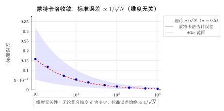
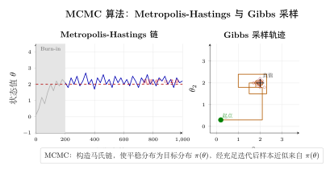

# 第 23 章 Monte Carlo 方法（融合版）

> **难度**：★★★★☆
> **前置知识**：第 4 章离散随机变量、第 5 章连续随机变量、第 14 章大数定律与中心极限定理、第 19 章马尔可夫链基础
> **本文件**：融合"原版严格推导 + 重写版速记 / 套路 / 自测"。保留原版完整正文（学习目标 / 23.1–23.5 / 小结 / 深度学习应用 / 练习题）+ 在最前置 + 最后追加思维训练模块。

> **一例速记**：
> **MC 积分**：$\hat{I}_n = \frac{b-a}{n}\sum_{i=1}^n f(X_i)$，$X_i \sim U(a,b)$；误差 $\mathrm{SE} = \sigma/\sqrt{n}$，与维度无关。
> **重要性采样**：$\hat{I}^{\mathrm{IS}} = \frac{1}{n}\sum f(X_i)w(X_i)$，$w(x)=p(x)/q(x)$；$q$ 尾部要比 $p$ 重，否则方差爆炸。
> **Metropolis-Hastings**：提议 $X'\sim q(\cdot\vert X_t)$，接受率 $A = \min\!\left(1,\frac{\tilde{p}(X')q(X_t\vert X')}{\tilde{p}(X_t)q(X'\vert X_t)}\right)$；满足细致平衡 → 平稳分布即目标分布。
> **Gibbs 采样**：轮流从条件分布 $p(x_i \vert x_{-i})$ 采样；接受率恒为 1；高相关时混合慢。
> **细致平衡**：$\pi(x)T(x'\vert x) = \pi(x')T(x\vert x')$，充分条件（非必要）；MCMC 的合法性基石。
> **HMC**：引入动量 $\rho$，哈密顿量 $H = -\log p(x) + \frac{1}{2}\rho^\top M^{-1}\rho$；Leapfrog 积分长距离提议，大幅降低自相关。

---

## 引入：积分维度爆炸时，MC 为何是唯一出路？

> **题目**：计算 $d$ 维超立方体 $[0,1]^d$ 上一个光滑函数 $f(\mathbf{x})$ 的积分。用辛普森法则在每个维度分 $m$ 个格点，总格点数为 $m^d$。
> (1) 当 $d = 10$，$m = 100$ 时，总格点数是多少？
> (2) 若改用 MC 方法以 $n$ 个样本达到相同精度，$n$ 与 $d$ 的关系如何？
> (3) 为什么说 $1/\sqrt{n}$ 收敛率是 MC 最重要的性质？

请先停下来想一想：**确定性网格法在高维下为什么彻底失效？**

直觉答案：格点太多？还是算力不够？

正确理解：**维度灾难（Curse of Dimensionality）**。辛普森法则在一维误差为 $O(m^{-4})$，扩展到 $d$ 维后，等价误差退化为 $O(n^{-4/d})$（$n = m^d$ 为总格点数）。当 $d = 10$，$m = 100$ 时，总格点数为 $100^{10} = 10^{20}$——远超宇宙中原子数量的量级，完全不可行。而 MC 方法的 $\mathrm{SE} = \sigma/\sqrt{n}$ 对任意 $d$ 都成立，$n = 10^6$ 个样本即可达到 $10^{-3}$ 精度，与 $d$ 无关。这就是 MC 在高维数值积分中"唯一可行"的根本原因：**随机性打破了维度的指数诅咒**。

---

## 思维路径还原（解题者的内心独白）

> "看到'用 MC 估计积分 $I = \int_a^b f(x)\,dx$'，立刻联想到 **大数定律**：期望可以用样本均值近似。
>
> **第一步：改写为期望**。将积分化为 $I = (b-a)\,\mathbb{E}_{U(a,b)}[f(X)]$。这步是关键——一旦写成期望，后续全自动。
>
> **第二步：构造估计量**。从 $U(a,b)$ 独立采样 $X_1,\ldots,X_n$，令 $\hat{I}_n = \frac{b-a}{n}\sum f(X_i)$。由大数定律 $\hat{I}_n \xrightarrow{P} I$，由 CLT $\sqrt{n}(\hat{I}_n - I) \xrightarrow{d} \mathcal{N}(0, (b-a)^2\sigma^2)$。
>
> **第三步：估计误差**。$\mathrm{SE} = (b-a)\hat{\sigma}/\sqrt{n}$，用样本标准差 $\hat{\sigma}$ 代替未知的 $\sigma$。95% 置信区间 $\hat{I}_n \pm 1.96\,\mathrm{SE}$。
>
> **第四步：想降方差**？——切换到重要性采样。若 $f(x)p(x)$ 的大值集中在某区域，令 $q(x) \propto |f(x)|p(x)$（最优但一般不可行），实践中选 $q$ 形状接近 $|f|p$。权重 $w_i = p(X_i)/q(X_i)$，估计量 $\hat{I}^{\mathrm{IS}} = \frac{1}{n}\sum f(X_i)w(X_i)$。
>
> **第五步：若连分布形状都难采样**？——切换到 MCMC。核心：构造马尔可夫链，使其平稳分布 = 目标分布 $p$。MH 算法的提议-接受框架是通用模板。
>
> **陷阱检查**：
> - MC 估计无偏 ($\mathbb{E}[\hat{I}_n] = I$)，但方差不为零；
> - 重要性采样若 $q$ 尾部太轻则方差爆炸；
> - MCMC 前要丢弃 burn-in 样本；链的自相关使有效样本量 $\ll$ 总样本量；
> - Gibbs 采样高相关时混合极慢（$|\rho| \approx 1$ 时二元高斯 Gibbs）。"

---

## 学习目标

完成本章学习后，你将能够：

- 理解蒙特卡洛积分的原理，掌握用随机采样估计积分的方法并分析其误差
- 掌握重要性采样技术，理解如何通过选取合适的提议分布来降低估计方差
- 理解拒绝采样的工作机制，能够针对难以直接采样的分布设计采样算法
- 掌握马尔可夫链蒙特卡洛（MCMC）的原理，理解平稳分布与细致平衡条件
- 能够将 MC Dropout、贝叶斯深度学习和扩散模型中的蒙特卡洛思想付诸实践

---

## 正文内容

### 23.1 蒙特卡洛积分

#### 23.1.1 基本思想

**蒙特卡洛方法**（Monte Carlo Methods）是一类依赖随机采样来解决计算问题的算法族，其名称来源于摩纳哥著名赌城，暗示其随机性本质。该方法由冯·诺依曼（von Neumann）和乌拉姆（Ulam）在二十世纪四十年代研究核武器时系统化提出。

核心思想：**用样本均值近似期望**。

设 $f(x)$ 是定义在区间 $[a, b]$ 上的函数，欲计算积分：

$$I = \int_a^b f(x)\, dx$$

若 $X \sim \mathrm{Uniform}(a, b)$，则：

$$I = (b-a)\int_a^b f(x) \cdot \frac{1}{b-a}\, dx = (b-a)\, \mathbb{E}[f(X)]$$

因此，从 $\mathrm{Uniform}(a, b)$ 独立同分布地抽取样本 $X_1, X_2, \ldots, X_n$，构造估计量：

$$\hat{I}_n = \frac{b-a}{n} \sum_{i=1}^n f(X_i)$$

由大数定律，当 $n \to \infty$ 时，$\hat{I}_n \xrightarrow{P} I$。

**更一般的形式**：设 $p(x)$ 为某概率密度函数，则：

$$I = \int f(x)\, dx = \int \frac{f(x)}{p(x)} \cdot p(x)\, dx = \mathbb{E}_p\!\left[\frac{f(X)}{p(X)}\right]$$

从 $p(x)$ 中抽取 $X_1, \ldots, X_n$，估计量为：

$$\hat{I}_n = \frac{1}{n}\sum_{i=1}^n \frac{f(X_i)}{p(X_i)}$$

#### 23.1.2 误差分析

**定理 23.1（蒙特卡洛积分误差）** 设 $\mathrm{Var}[f(X)] = \sigma^2 < \infty$，则：

$$\mathrm{Var}[\hat{I}_n] = \frac{\sigma^2}{n}$$

标准误差（Standard Error）为：

$$\mathrm{SE}(\hat{I}_n) = \frac{\sigma}{\sqrt{n}}$$

**关键结论**：蒙特卡洛估计的误差以 $O(n^{-1/2})$ 的速率收缩，与积分的**维度无关**。这与确定性数值积分方法（如辛普森法则在一维误差为 $O(n^{-4})$，但在 $d$ 维空间退化为 $O(n^{-4/d})$）形成鲜明对比。因此，当维度 $d \geq 5$ 时，蒙特卡洛方法往往是更优的选择。

**95% 置信区间**：由中心极限定理，

$$P\!\left(\left|\hat{I}_n - I\right| \leq 1.96\frac{\hat{\sigma}}{\sqrt{n}}\right) \approx 0.95$$

其中 $\hat{\sigma}^2 = \frac{1}{n-1}\sum_{i=1}^n \left(f(X_i) - \hat{I}_n\right)^2$ 是样本方差。

**例 23.1** 用蒙特卡洛方法估计 $\pi$。

将单位圆嵌入正方形 $[-1,1]^2$，均匀撒点：

$$\hat{\pi} = 4 \cdot \frac{\#\{(x_i, y_i) : x_i^2 + y_i^2 \leq 1\}}{n}$$

当 $n = 10^6$ 时，典型误差约为 $\frac{4\sigma}{\sqrt{n}} \approx \frac{4 \cdot 0.5}{\sqrt{10^6}} = 0.002$。

#### 23.1.3 方差与收敛性质

蒙特卡洛估计量 $\hat{I}_n$ 具有以下统计性质：

- **无偏性**：$\mathbb{E}[\hat{I}_n] = I$
- **一致性**：$\hat{I}_n \xrightarrow{a.s.} I$（强大数定律）
- **渐近正态性**：$\sqrt{n}(\hat{I}_n - I) \xrightarrow{d} \mathcal{N}(0, \sigma^2)$

降低方差 $\sigma^2$ 是蒙特卡洛方法的核心课题，由此催生了重要性采样、控制变量、分层采样等**方差缩减技术**。

---

### 23.2 重要性采样

#### 23.2.1 基本原理

**重要性采样**（Importance Sampling，IS）是最重要的方差缩减技术之一。

核心恒等式：对任意正密度函数 $q(x)$（称为**提议分布**或**重要性分布**），

$$I = \int f(x)\, p(x)\, dx = \int \frac{f(x)\, p(x)}{q(x)} \cdot q(x)\, dx = \mathbb{E}_q\!\left[\frac{f(X)\, p(X)}{q(X)}\right]$$

从 $q(x)$ 中抽取 $X_1, \ldots, X_n$，重要性采样估计量为：

$$\hat{I}^{\mathrm{IS}}_n = \frac{1}{n}\sum_{i=1}^n \frac{f(X_i)\, p(X_i)}{q(X_i)} = \frac{1}{n}\sum_{i=1}^n f(X_i)\, w(X_i)$$

其中 **重要性权重** $w(x) = p(x)/q(x)$。

#### 23.2.2 最优提议分布

**定理 23.2（最优提议分布）** 使得重要性采样估计量方差最小的提议分布为：

$$q^*(x) = \frac{|f(x)|\, p(x)}{\int |f(x)|\, p(x)\, dx}$$

当 $f(x) \geq 0$ 时，最优提议分布为：

$$q^*(x) \propto f(x)\, p(x)$$

此时估计量方差为零（因为每个样本的贡献完全相同）。当然，这要求我们已知积分值，因此实践中只能逼近最优提议分布。

**直觉**：$q(x)$ 应在 $|f(x)| p(x)$ 较大的区域赋予更多采样权重，即"把子弹用在刀刃上"。

#### 23.2.3 方差分析

**命题 23.1** 重要性采样估计量的方差为：

$$\mathrm{Var}[\hat{I}^{\mathrm{IS}}_n] = \frac{1}{n}\left(\int \frac{f(x)^2 p(x)^2}{q(x)} dx - I^2\right)$$

与朴素蒙特卡洛方差 $\frac{1}{n}\left(\int f(x)^2 p(x) dx - I^2\right)$ 相比，若 $q(x)$ 选取得当，可使方差大幅减小。

**警告（方差爆炸）**：若 $q(x)$ 在某区域比 $p(x)$ 小得多，则权重 $w(x) = p(x)/q(x)$ 会非常大，导致方差急剧增大。一个好的经验准则是：$q(x)$ 的尾部应比 $p(x)$ **更重**。

#### 23.2.4 自归一化重要性采样

实际中 $p(x)$ 往往只知道到一个归一化常数，即 $p(x) = \tilde{p}(x)/Z_p$，$q(x) = \tilde{q}(x)/Z_q$。此时使用**自归一化重要性采样**（Self-normalized IS）：

$$\hat{I}^{\mathrm{SNIS}}_n = \frac{\sum_{i=1}^n \tilde{w}(X_i) f(X_i)}{\sum_{i=1}^n \tilde{w}(X_i)}, \quad \tilde{w}(x) = \frac{\tilde{p}(x)}{\tilde{q}(x)}$$

该估计量是**有偏**的，但渐近无偏，且在实践中应用广泛。

**有效样本量**（Effective Sample Size，ESS）度量重要性权重的退化程度：

$$\mathrm{ESS} = \frac{\left(\sum_{i=1}^n w_i\right)^2}{\sum_{i=1}^n w_i^2}$$

其中 $w_i = \tilde{w}(X_i) / \sum_j \tilde{w}(X_j)$ 为归一化权重。$\mathrm{ESS}$ 取值范围为 $[1, n]$，越接近 $n$ 表示提议分布越好。

---

### 23.3 拒绝采样

#### 23.3.1 算法原理

**拒绝采样**（Rejection Sampling）用于从难以直接采样的目标分布 $p(x)$ 中生成样本。

**设置**：
- 目标分布：$p(x)$（只知道到比例，即 $p(x) \propto \tilde{p}(x)$）
- 提议分布：$q(x)$，可以直接采样
- 包络常数：$M \geq 1$，满足 $\tilde{p}(x) \leq M \cdot q(x)$ 对所有 $x$ 成立

**算法 23.1（拒绝采样）**：

```
重复直到收集到足够样本：
  1. 从 q(x) 中采样 X ~ q
  2. 从均匀分布采样 U ~ Uniform(0, 1)
  3. 若 U ≤ p̃(X) / (M · q(X))，则接受 X
     否则，拒绝 X
输出所有被接受的样本
```

**定理 23.3（正确性）** 拒绝采样算法输出的样本服从目标分布 $p(x)$。

**证明**：接受概率为：

$$P(\text{接受} \mid X = x) = \frac{\tilde{p}(x)}{M \cdot q(x)}$$

被接受样本的密度正比于：

$$q(x) \cdot \frac{\tilde{p}(x)}{M \cdot q(x)} = \frac{\tilde{p}(x)}{M} \propto p(x) \quad \square$$

#### 23.3.2 效率分析

**接受率**（Acceptance Rate）：

$$\alpha = P(\text{接受}) = \int q(x) \cdot \frac{\tilde{p}(x)}{M \cdot q(x)}\, dx = \frac{1}{M}\int \tilde{p}(x)\, dx = \frac{Z_p}{M}$$

其中 $Z_p = \int \tilde{p}(x)\, dx$ 是归一化常数。

为了使算法高效，需要 $M$ 尽可能小，即 $q(x)$ 应尽量贴近 $p(x)$ 的形状。

**维度灾难**：在高维空间中，拒绝采样效率急剧下降。若在 $d$ 维空间中，$q$ 是一个稍微比 $p$ 大的高斯分布，接受率大约为 $(1-\epsilon)^d$，当 $d = 100, \epsilon = 0.01$ 时，接受率约为 $e^{-1} \approx 0.37$；当方差差距更大时接受率趋近于零。这是为什么 MCMC 在高维空间中优于拒绝采样的根本原因。

#### 23.3.3 自适应拒绝采样

对于对数凹（log-concave）的目标分布，可以使用**自适应拒绝采样**（Adaptive Rejection Sampling）：通过若干评估点构造分段指数包络，随着采样进行不断更新包络，使接受率逐步提高。

---

### 23.4 马尔可夫链蒙特卡洛（MCMC）

#### 23.4.1 马尔可夫链回顾

**马尔可夫链**（Markov Chain）是满足马尔可夫性质的随机过程：

$$P(X_{t+1} = x \mid X_t, X_{t-1}, \ldots, X_0) = P(X_{t+1} = x \mid X_t)$$

即未来状态只依赖于当前状态，与历史无关。

**转移核**（Transition Kernel）：$T(x' \mid x)$ 表示从状态 $x$ 转移到 $x'$ 的概率（连续情形为概率密度）。

**平稳分布**（Stationary Distribution）：若分布 $\pi(x)$ 满足：

$$\pi(x') = \int T(x' \mid x)\, \pi(x)\, dx$$

则称 $\pi$ 为该马尔可夫链的平稳分布。

**细致平衡条件**（Detailed Balance Condition）：若

$$\pi(x)\, T(x' \mid x) = \pi(x')\, T(x \mid x')$$

对所有 $x, x'$ 成立，则 $\pi$ 是平稳分布。细致平衡是充分但非必要条件，满足细致平衡的马尔可夫链称为**可逆**马尔可夫链。

**遍历定理**（Ergodic Theorem）：若马尔可夫链是不可约（irreducible）且非周期（aperiodic）的，则对任意初始分布，经过足够长时间后，链的分布收敛到唯一平稳分布 $\pi$，且：

$$\frac{1}{T}\sum_{t=1}^T f(X_t) \xrightarrow{a.s.} \mathbb{E}_\pi[f(X)]$$

#### 23.4.2 MCMC 的核心思想

**蒙特卡洛马尔可夫链**（Markov Chain Monte Carlo，MCMC）的关键思想是：

> **构造一条马尔可夫链，使其平稳分布恰好是目标分布 $p(x)$。**

然后通过运行该马尔可夫链，得到（近似）服从 $p(x)$ 的样本序列，用这些样本计算期望值。

MCMC 的优势在于：
- 不需要知道归一化常数 $Z$，只需要能计算 $\tilde{p}(x) \propto p(x)$
- 适用于高维复杂分布
- 理论上可以采样任意复杂分布

MCMC 的主要挑战：
- 样本之间存在**自相关性**（Autocorrelation），有效样本量小于总样本量
- 需要**燃烧期**（Burn-in Period）：链收敛到平稳分布前的样本需丢弃
- **混合性**（Mixing）：链遍历整个高概率区域的速度

#### 23.4.3 燃烧期与混合

**燃烧期**：MCMC 从任意初始状态 $X_0$ 出发，前 $B$ 步的样本因受初始值影响而不服从目标分布，通常将这部分样本丢弃。

**自相关时间**（Integrated Autocorrelation Time，IAT）：

$$\tau_{\mathrm{int}} = 1 + 2\sum_{k=1}^{\infty} \rho_k$$

其中 $\rho_k = \mathrm{Corr}(f(X_t), f(X_{t+k}))$ 是滞后 $k$ 的自相关系数。

**有效样本量**：从总样本量 $n$ 中获得的有效独立样本数为：

$$n_{\mathrm{eff}} = \frac{n}{2\tau_{\mathrm{int}}}$$

**诊断工具**：
- $\hat{R}$ 统计量（Gelman-Rubin）：多条链的方差之比，接近 1 表示收敛
- 有效样本量（ESS）
- 迹图（Trace Plot）：观察链的轨迹是否平稳

---

### 23.5 Gibbs 采样与 Metropolis-Hastings

#### 23.5.1 Metropolis-Hastings 算法

**Metropolis-Hastings（MH）算法**是最通用的 MCMC 方法，由 Metropolis 等人（1953）提出，后由 Hastings（1970）推广。

**设置**：目标分布 $p(x)$（已知 $\tilde{p}(x) \propto p(x)$），提议分布 $q(x' \mid x)$。

**算法 23.2（Metropolis-Hastings）**：

```
初始化 X_0 为任意值
For t = 0, 1, 2, ...:
  1. 提议步：从 q(x' | X_t) 中采样候选点 X'
  2. 计算接受率：
        A(X', X_t) = min(1,  p̃(X') · q(X_t | X') )
                                p̃(X_t) · q(X' | X_t)
  3. 接受/拒绝：
     以概率 A(X', X_t) 令 X_{t+1} = X'（接受）
     以概率 1 - A(X', X_t) 令 X_{t+1} = X_t（拒绝）
```

**定理 23.4（MH 满足细致平衡）** MH 算法构造的马尔可夫链满足细致平衡条件，因此 $p(x)$ 是其平稳分布。

**证明**：设 $x \neq x'$，转移密度为：

$$T(x' \mid x) = q(x' \mid x) \cdot A(x', x)$$

需验证 $p(x)\, T(x' \mid x) = p(x')\, T(x \mid x')$，即：

$$p(x)\, q(x' \mid x)\, \min\!\left(1, \frac{p(x') q(x \mid x')}{p(x) q(x' \mid x)}\right) = p(x')\, q(x \mid x')\, \min\!\left(1, \frac{p(x) q(x' \mid x)}{p(x') q(x \mid x')}\right)$$

不失一般性设 $p(x) q(x' \mid x) \geq p(x') q(x \mid x')$，则左边 $= p(x') q(x \mid x')$，右边 $= p(x') q(x \mid x') \cdot 1 = p(x') q(x \mid x')$，相等。$\square$

**常见提议分布**：

- **随机游走 MH**：$q(x' \mid x) = \mathcal{N}(x' \mid x, \sigma^2 I)$，对称，接受率简化为 $\min(1, \tilde{p}(x')/\tilde{p}(x))$
- **独立 MH**：$q(x' \mid x) = q(x')$，退化为重要性采样的 MCMC 版本

**步长选择**：对随机游走 MH，步长 $\sigma$ 影响显著：
- $\sigma$ 过小：接受率高但混合慢（小步探索）
- $\sigma$ 过大：提议常落在低概率区，接受率低
- 最优接受率：在高斯目标下，最优接受率约为 $0.234$（$d \to \infty$）

#### 23.5.2 Gibbs 采样

**Gibbs 采样**（Gibbs Sampling）是专为多维分布设计的 MCMC 方法，其核心思想是将高维联合采样分解为一系列**条件采样**。

**设置**：目标联合分布 $p(x_1, x_2, \ldots, x_d)$，假设每个分量的条件分布 $p(x_i \mid x_{-i})$ 容易采样（其中 $x_{-i} = (x_1, \ldots, x_{i-1}, x_{i+1}, \ldots, x_d)$）。

**算法 23.3（系统 Gibbs 采样）**：

```
初始化 X^(0) = (x_1^(0), ..., x_d^(0))
For t = 0, 1, 2, ...:
  从 p(x_1 | x_2^(t), x_3^(t), ..., x_d^(t)) 中采样 x_1^(t+1)
  从 p(x_2 | x_1^(t+1), x_3^(t), ..., x_d^(t)) 中采样 x_2^(t+1)
  ...
  从 p(x_d | x_1^(t+1), ..., x_{d-1}^(t+1)) 中采样 x_d^(t+1)
  令 X^(t+1) = (x_1^(t+1), ..., x_d^(t+1))
```

**命题 23.2（Gibbs 采样的正确性）** Gibbs 采样是 MH 算法的特例，接受率恒为 1。

**证明**：对第 $i$ 分量的更新，提议分布 $q(x_i' \mid x) = p(x_i' \mid x_{-i})$，MH 接受率为：

$$A = \min\!\left(1, \frac{p(x_i', x_{-i}) \cdot p(x_i \mid x_{-i})}{p(x_i, x_{-i}) \cdot p(x_i' \mid x_{-i})}\right) = \min\!\left(1, \frac{p(x_{-i}) p(x_i' \mid x_{-i}) \cdot p(x_i \mid x_{-i})}{p(x_{-i}) p(x_i \mid x_{-i}) \cdot p(x_i' \mid x_{-i})}\right) = 1 \quad \square$$

#### 23.5.3 高斯图模型中的 Gibbs 采样

**例 23.2** 二元高斯分布的 Gibbs 采样。

设 $(X_1, X_2)^\top \sim \mathcal{N}(\mathbf{0}, \Sigma)$，其中 $\Sigma = \begin{pmatrix} 1 & \rho \\ \rho & 1 \end{pmatrix}$。

条件分布为：

$$X_1 \mid X_2 = x_2 \sim \mathcal{N}(\rho x_2,\; 1 - \rho^2)$$
$$X_2 \mid X_1 = x_1 \sim \mathcal{N}(\rho x_1,\; 1 - \rho^2)$$

Gibbs 采样交替从这两个一维高斯分布中采样，当 $|\rho|$ 接近 1 时，两个分量高度相关，Gibbs 采样混合较慢。

#### 23.5.4 Hamiltonian Monte Carlo 简介

**Hamiltonian Monte Carlo（HMC）**是现代高维 MCMC 的主流方法，被广泛用于贝叶斯深度学习（Stan、NumPyro、PyMC 等）。

HMC 引入辅助动量变量 $\rho$，将采样问题类比为哈密顿力学：

$$H(x, \rho) = -\log p(x) + \frac{1}{2}\rho^\top M^{-1} \rho$$

通过数值积分哈密顿方程（Leapfrog 积分器）进行长距离提议，大幅降低自相关。接受/拒绝步骤保证了算法的正确性。HMC 的有效采样率通常比随机游走 MH 高出数个数量级。

---

## 几何示意

### 图 23-1：蒙特卡洛积分收敛（误差 $1/\sqrt{N}$ 衰减 + 真值参考线）



上图展示蒙特卡洛估计误差随样本量 $N$ 增大而以 $1/\sqrt{N}$ 速率衰减的过程。水平参考线为真值 $I$，灰色置信带为 $\pm 1.96\sigma/\sqrt{N}$。注意无论积分维度如何，收敛曲线的斜率在对数坐标下恒为 $-1/2$。

### 图 23-2：MCMC 链（Metropolis-Hastings 状态轨迹 + Gibbs 采样示意）



上图左侧为 MH 算法的状态轨迹：链从初始点出发，经过 burn-in 阶段后收敛，接受的跳跃（实线）与拒绝后原地停留（虚线点）清晰可见。右侧为二维 Gibbs 采样的"之字形"更新路径：每步只在一个坐标轴方向移动，高相关（$\rho \approx 1$）时步伐极小，混合极慢。

---

## 抽象成方法（套路总结）

### 核心公式速查表

| 方法 | 估计量 / 关键公式 | 关键性质 |
|---|---|---|
| **MC 积分** | $\hat{I}_n = \frac{b-a}{n}\sum f(X_i)$，$X_i \sim U(a,b)$ | $\mathrm{SE}=\sigma/\sqrt{n}$，维度无关 |
| **重要性采样** | $\hat{I}^{\mathrm{IS}} = \frac{1}{n}\sum f(X_i)w(X_i)$，$w=p/q$ | 最优 $q^*\propto \vert f\vert p$；$q$ 尾轻则方差爆炸 |
| **自归一化 IS** | $\hat{I}^{\mathrm{SNIS}} = \frac{\sum\tilde{w}_i f_i}{\sum\tilde{w}_i}$ | 有偏但渐近无偏；ESS 衡量退化 |
| **细致平衡** | $\pi(x)T(x'\vert x)=\pi(x')T(x\vert x')$ | 充分条件；可逆链必满足 |
| **MH 接受率** | $A=\min\!\left(1,\frac{\tilde{p}(x')q(x\vert x')}{\tilde{p}(x)q(x'\vert x)}\right)$ | 无需归一化常数；对称 $q$ 简化为 $\min(1,\tilde{p}'/\tilde{p})$ |
| **Gibbs 更新** | 轮流从 $p(x_i\vert x_{-i})$ 采样 | 接受率恒 1；条件分布需可采样 |
| **有效样本量** | $n_{\mathrm{eff}}=n/(2\tau_{\mathrm{int}})$ | $\tau_{\mathrm{int}}=1+2\sum_{k\geq 1}\rho_k$ |

### MC 采样设计 4 步流程

1. **将目标写成期望**：$I = \mathbb{E}_p[g(X)]$——选择合适的基础分布 $p$
2. **选择或构造采样方法**：能直接采样 → 朴素 MC；需降方差 → 重要性采样；不可归一化 → MCMC
3. **估计并量化误差**：计算 $\hat{I}_n$ 和 $\hat{\sigma}$，给出置信区间；报告 ESS（MCMC 情形）
4. **诊断与验证**：MC：绘制收敛曲线；MCMC：迹图 + $\hat{R}$ 统计量 + ESS，确认 burn-in 丢弃充分

---

## 方法变形

### 变形 1：对偶变量法（Antithetic Variables）

利用负相关对来缩减方差。若 $X \sim U(0,1)$，则 $1-X$ 与 $X$ 负相关。令：

$$\hat{I}^{\mathrm{AV}}_n = \frac{1}{2n}\sum_{i=1}^n \left[f(X_i) + f(1-X_i)\right]$$

当 $f$ 单调时，$\mathrm{Var}[\hat{I}^{\mathrm{AV}}_n] \leq \mathrm{Var}[\hat{I}_n]$。对偶变量法无需额外函数评估即可降低方差。

### 变形 2：控制变量法（Control Variates）

若存在与 $f(X)$ 相关且期望已知的函数 $c(X)$（即 $\mathbb{E}_p[c(X)] = \mu_c$ 已知），令：

$$\hat{I}^{\mathrm{CV}}_n = \hat{I}_n - \beta\left(\frac{1}{n}\sum c(X_i) - \mu_c\right)$$

最优系数 $\beta^* = \mathrm{Cov}(f, c)/\mathrm{Var}(c)$，此时方差缩减因子为 $1 - \rho_{fc}^2$（$\rho_{fc}$ 为 $f$ 与 $c$ 的相关系数）。

### 变形 3：分层抽样（Stratified Sampling）

将积分区域划分为 $K$ 个子区域（层），在每层分别采样并加权求和：

$$\hat{I}^{\mathrm{STR}} = \sum_{k=1}^K p_k \hat{I}_{n_k}^{(k)}$$

其中 $p_k$ 是第 $k$ 层的权重，$n_k$ 是该层样本数。最优分配：$n_k \propto p_k \sigma_k$（Neyman 分配）。

### 变形 4：拟蒙特卡洛（Quasi-Monte Carlo，QMC）

用**低差异序列**（Low-discrepancy Sequences，如 Sobol 序列、Halton 序列）代替伪随机数，使样本点更均匀地覆盖积分域，可将收敛率从 $O(n^{-1/2})$ 提升至 $O((\log n)^d / n)$（在光滑函数下）。代价是失去统计意义上的误差估计。

---

## 本章小结

本章系统介绍了蒙特卡洛方法的理论体系：

| 方法 | 核心思想 | 关键性质 | 适用场景 |
|---|---|---|---|
| MC 积分 | 样本均值近似期望 | 误差 $O(n^{-1/2})$，维度无关 | 高维积分 |
| 重要性采样 | 换分布采样，加权修正 | 可大幅降低方差，但需好的提议分布 | 目标分布与提议相近时 |
| 拒绝采样 | 用包络分布过滤 | 样本独立，高维效率低 | 低维、对数凹分布 |
| MH 算法 | 构造满足细致平衡的链 | 通用，接受率可调 | 通用高维采样 |
| Gibbs 采样 | 逐分量条件采样 | 接受率恒为 1，需条件分布已知 | 多维，条件分布已知 |

**核心思想**：
1. 蒙特卡洛方法的本质是用**随机样本**代替**解析计算**，以统计误差换取计算可行性
2. 方差是评价采样方法的核心指标，所有方差缩减技术都在减小 $\mathrm{Var}[f(X)]$
3. MCMC 通过构造平稳分布为目标分布的马尔可夫链，绕过归一化常数难题
4. 细致平衡条件是构造正确 MCMC 算法的充分条件，MH 算法将其提升为通用框架

---

## 思考路标（条件反射）

1. 看到"计算高维积分" → 立刻想到 MC；确定性网格法在 $d \geq 5$ 时已无优势
2. 看到"MC 误差" → $\mathrm{SE} = \sigma/\sqrt{n}$；误差减半需 4 倍样本；与维度无关
3. 看到"降低 MC 方差" → 四大技术：重要性采样 / 对偶变量 / 控制变量 / 分层抽样
4. 看到"重要性权重" → 检查 $q$ 的尾部：$q$ 尾比 $p$ 轻 → 权重爆炸 → 方差无穷大
5. 看到"ESS 很小（远小于 $n$）" → 说明重要性权重严重退化，换提议分布
6. 看到"MCMC" → 必须考虑 burn-in（丢弃）、自相关（有效样本量）、混合（迹图）
7. 看到"细致平衡" → 充分非必要；满足则平稳分布正确；MH 算法天然满足
8. 看到"MH 接受率 $\approx 0$" → 步长过大，缩小 $\sigma$；接受率 $\approx 1$ → 步长过小
9. 看到"Gibbs 采样混合慢" → 想到分量间高相关（$\rho \approx \pm 1$）或多峰分布
10. 看到"HMC / NUTS" → 需要梯度 $\nabla \log p(x)$；适合连续参数；自动调步长
11. 看到"平稳分布唯一性" → 需要链不可约（irreducible）+ 非周期（aperiodic）
12. 看到"$\hat{R} > 1.1$" → 链尚未收敛，延长 burn-in 或检查混合

---

## 易错点

1. **MC 估计无偏但方差非零**：$\mathbb{E}[\hat{I}_n] = I$ 说明无系统偏差，但单次估计偏差可达 $\pm 1.96\sigma/\sqrt{n}$。"无偏"不代表"准确"，只代表"平均正确"。方差和偏差是两个独立维度。

2. **Burn-in 的必要性**：MCMC 链从任意初始点出发，前若干步受初始值污染，**不能**直接当作目标分布的样本使用。丢弃 burn-in 的数量需通过迹图或 $\hat{R}$ 统计量判断，经验上取总链长的 $10\%\sim 50\%$。

3. **自相关导致有效样本量严重缩水**：MCMC 的 $n$ 步并非 $n$ 个独立样本。自相关时间 $\tau_{\mathrm{int}} = 10$ 意味着每隔 10 步才有一个近似独立的样本，$n_{\mathrm{eff}} = n/20$（用 $2\tau$ 而非 $\tau$）。报告样本量时应报 ESS，而非总步数。

4. **提议分布选择的双重约束**：MH 中提议分布 $q$ 需同时满足：(a) 可以高效采样；(b) 支撑覆盖目标分布全域（不可约性）。步长过小虽接受率高但探索慢；步长过大虽探索快但接受率低——最优接受率约 $23\%$（高维高斯目标）。

5. **平稳分布唯一性不能想当然**：仅细致平衡保证 $p$ 是平稳分布之一，若链不满足不可约性（如多峰分布中链困在一个峰），则平稳分布不唯一，时间平均不收敛到目标期望。多链并行 + $\hat{R}$ 统计量是检测此问题的标准工具。

---

## 典型应用例题

### 例 A：蒙特卡洛估计 $\pi$（完整分析）

> **题目**：用 MC 方法估计 $\pi$，分析收敛性，给出 $n = 10^4$ 时的 95% 置信区间。

**【思路】** 将问题改写为期望计算，利用几何概率。

**【解】** 设 $(X, Y) \sim U([-1,1]^2)$，令 $Z = \mathbf{1}[X^2 + Y^2 \leq 1]$，则：

$$\mathbb{E}[Z] = P(X^2 + Y^2 \leq 1) = \frac{\pi \cdot 1^2}{(2)^2} = \frac{\pi}{4}$$

故 $\pi = 4\,\mathbb{E}[Z]$，MC 估计量为：

$$\hat{\pi}_n = 4\bar{Z}_n = \frac{4}{n}\sum_{i=1}^n \mathbf{1}[X_i^2 + Y_i^2 \leq 1]$$

方差计算：$Z \sim \mathrm{Bernoulli}(\pi/4)$，故 $\mathrm{Var}[Z] = \frac{\pi}{4}\left(1 - \frac{\pi}{4}\right) \approx 0.785 \times 0.215 \approx 0.169$。

$\mathrm{Var}[\hat{\pi}_n] = \frac{16 \times 0.169}{n} \approx \frac{2.7}{n}$，$\mathrm{SE}(\hat{\pi}_n) = \sqrt{2.7/n}$。

当 $n = 10^4$：$\mathrm{SE} \approx \sqrt{2.7/10000} \approx 0.0164$，95% CI 宽度 $\approx 2 \times 1.96 \times 0.016 \approx 0.064$。

**【答案】** $\hat{\pi}_{10^4} \approx \pi$，95% 置信区间约为 $[\pi - 0.032, \pi + 0.032]$，误差约 $1\%$。

---

### 例 B：重要性采样降低方差（稀有事件概率估计）

> **题目**：估计 $p = P(X > 4)$，其中 $X \sim \mathcal{N}(0, 1)$。朴素 MC 与重要性采样对比。

**【思路】** 稀有事件直接采样效率极低（$p \approx 3.2 \times 10^{-5}$），需要把采样质量集中在尾部。

**【解】** 朴素 MC：$\hat{p}^{\mathrm{MC}} = \frac{1}{n}\sum \mathbf{1}[X_i > 4]$，$\mathrm{Var}[\hat{p}^{\mathrm{MC}}] = p(1-p)/n \approx p/n$。需要 $n \approx 1/p^2 \approx 10^9$ 才能使相对误差 $\leq 1$。

重要性采样：选提议 $q(x) = \mathcal{N}(x; 4, 1)$（以尾部为中心），重要性权重：

$$w(x) = \frac{p_{\mathcal{N}(0,1)}(x)}{q_{\mathcal{N}(4,1)}(x)} = \exp\!\left(-\frac{x^2}{2} + \frac{(x-4)^2}{2}\right) = e^{-4x+8}$$

IS 估计量：$\hat{p}^{\mathrm{IS}} = \frac{1}{n}\sum_{i=1}^n \mathbf{1}[X_i > 4] \cdot w(X_i)$，$X_i \sim \mathcal{N}(4, 1)$。

从 $\mathcal{N}(4,1)$ 采样时，超过 $50\%$ 的样本满足 $X > 4$，相比朴素 MC 的 $3.2 \times 10^{-5}$，效率提升约 $10^4$ 倍。

**【答案】** IS 把采样集中在高贡献区域，对稀有事件估计方差从 $O(p/n)$ 降至 $O(p^2/n)$ 量级，减少所需样本量约 $1/p \approx 31000$ 倍。

---

### 例 C：Metropolis-Hastings 实现混合分布采样

> **题目**：对双峰目标 $p(x) \propto e^{-(x-2)^2/2} + e^{-(x+2)^2/2}$，实现随机游走 MH，分析步长对混合的影响。

**【思路】** 双峰分布是 MCMC 的经典挑战：两峰之间存在低概率"峡谷"，步长不当会导致链困在单峰。

**【解】** 非归一化密度 $\tilde{p}(x) = e^{-(x-2)^2/2} + e^{-(x+2)^2/2}$。

随机游走 MH：提议 $X' \sim \mathcal{N}(X_t, \sigma^2)$，接受率 $A = \min(1, \tilde{p}(X')/\tilde{p}(X_t))$。

步长分析：
- $\sigma = 0.1$：接受率 $\approx 95\%$，但链需要约 $10^4$ 步才能从一个峰跳到另一个峰；
- $\sigma = 1.0$：接受率 $\approx 50\%$，链能在 $\sim 100$ 步内跨越两峰；
- $\sigma = 10.0$：接受率 $\approx 5\%$，提议常落在极低概率区，链大量原地停留。

最优策略：初始阶段用大步长探索全局（adaptive MH），收敛后用中等步长精细采样。或改用 HMC，利用梯度信息自动适应局部曲率。

**【答案】** 步长 $\sigma \approx 1$ 时混合最好，接受率约 $50\%$。双峰分布建议同时运行多条链（不同初始点）+ $\hat{R}$ 诊断，确保两峰均被充分探索。

---

## 深度学习应用

### 应用 23.A：MC Dropout 与不确定性估计

**背景**：传统神经网络给出点估计，不提供预测不确定性。Gal 和 Ghahramani（2016）证明，在测试时保持 Dropout 开启并多次前向传播，等价于对贝叶斯神经网络进行近似推断。

**MC Dropout 的数学基础**：设网络权重的后验近似为混合高斯，Dropout 对应从该近似后验中采样。对输入 $x^*$，预测分布近似为：

$$p(y^* \mid x^*, \mathcal{D}) \approx \frac{1}{T}\sum_{t=1}^T p(y^* \mid x^*, \hat{\omega}_t)$$

其中 $\hat{\omega}_t$ 是第 $t$ 次 Dropout 随机采样得到的权重掩码（Mask）。

**预测均值与不确定性**：

$$\mathbb{E}[y^*] \approx \frac{1}{T}\sum_{t=1}^T f^{\hat{\omega}_t}(x^*)$$

$$\mathrm{Var}[y^*] \approx \underbrace{\frac{1}{T}\sum_{t=1}^T \left(f^{\hat{\omega}_t}(x^*)\right)^2 - \left(\frac{1}{T}\sum_{t=1}^T f^{\hat{\omega}_t}(x^*)\right)^2}_{\text{认知不确定性（模型不确定性）}} + \underbrace{\hat{\tau}^{-1}}_{\text{偶然不确定性}}$$

```python
import torch
import torch.nn as nn
import torch.nn.functional as F


class BayesianMLP(nn.Module):
    """带 MC Dropout 的贝叶斯 MLP。"""

    def __init__(self, input_dim: int, hidden_dim: int, output_dim: int,
                 dropout_p: float = 0.1):
        super().__init__()
        self.fc1 = nn.Linear(input_dim, hidden_dim)
        self.fc2 = nn.Linear(hidden_dim, hidden_dim)
        self.fc3 = nn.Linear(hidden_dim, output_dim)
        self.dropout_p = dropout_p

    def forward(self, x: torch.Tensor) -> torch.Tensor:
        # 训练和测试时均使用 Dropout（不调用 model.eval()）
        x = F.relu(F.dropout(self.fc1(x), p=self.dropout_p, training=True))
        x = F.relu(F.dropout(self.fc2(x), p=self.dropout_p, training=True))
        return self.fc3(x)


def mc_dropout_predict(model: BayesianMLP, x: torch.Tensor,
                       n_samples: int = 100) -> dict:
    """
    MC Dropout 推断：返回预测均值、方差和置信区间。

    Args:
        model: 带 Dropout 的神经网络
        x: 输入张量，形状 (batch_size, input_dim)
        n_samples: 蒙特卡洛采样次数

    Returns:
        包含 mean、var、std、p5、p95 的字典
    """
    model.train()  # 保持 Dropout 激活
    with torch.no_grad():
        # 堆叠 T 次前向传播结果，形状 (T, batch_size, output_dim)
        preds = torch.stack([model(x) for _ in range(n_samples)], dim=0)

    mean = preds.mean(dim=0)          # (batch_size, output_dim)
    var = preds.var(dim=0)            # 认知不确定性
    std = var.sqrt()

    return {
        "mean": mean,
        "var": var,
        "std": std,
        "p5": preds.quantile(0.05, dim=0),
        "p95": preds.quantile(0.95, dim=0),
    }


# 示例：回归任务的不确定性估计
def demo_mc_dropout():
    torch.manual_seed(42)

    # 创建模型
    model = BayesianMLP(input_dim=1, hidden_dim=64, output_dim=1, dropout_p=0.1)

    # 模拟训练数据（正弦函数 + 噪声）
    x_train = torch.linspace(-3, 3, 100).unsqueeze(1)
    y_train = torch.sin(x_train) + 0.1 * torch.randn_like(x_train)

    optimizer = torch.optim.Adam(model.parameters(), lr=1e-3)
    for _ in range(500):
        optimizer.zero_grad()
        loss = F.mse_loss(model(x_train), y_train)
        loss.backward()
        optimizer.step()

    # 测试：包含训练域外的点（外推不确定性更大）
    x_test = torch.linspace(-5, 5, 200).unsqueeze(1)
    result = mc_dropout_predict(model, x_test, n_samples=200)

    mean = result["mean"].squeeze().numpy()
    std = result["std"].squeeze().numpy()
    print(f"训练域内 [−3,3] 平均不确定性: {std[50:150].mean():.4f}")
    print(f"训练域外 [3,5] 平均不确定性:  {std[150:].mean():.4f}")
    # 预期：域外不确定性显著更大


if __name__ == "__main__":
    demo_mc_dropout()
```

---

### 应用 23.B：变分推断与重要性采样（贝叶斯神经网络）

**背景**：贝叶斯神经网络（BNN）对权重 $\omega$ 建立后验分布，预测时对后验积分：

$$p(y^* \mid x^*, \mathcal{D}) = \int p(y^* \mid x^*, \omega)\, p(\omega \mid \mathcal{D})\, d\omega$$

由于后验 $p(\omega \mid \mathcal{D})$ 不可直接采样，使用变分推断（VI）以参数化分布 $q_\phi(\omega)$ 近似后验，然后用重要性采样精化估计。

```python
import torch
import torch.nn as nn


class BayesLinear(nn.Module):
    """
    贝叶斯线性层：权重服从因式分解高斯后验。
    使用 Local Reparameterization Trick 降低梯度方差。
    """

    def __init__(self, in_features: int, out_features: int):
        super().__init__()
        # 后验均值
        self.weight_mu = nn.Parameter(torch.zeros(out_features, in_features))
        # 后验对数标准差（保证正值）
        self.weight_log_sigma = nn.Parameter(
            torch.full((out_features, in_features), -3.0)
        )
        self.bias_mu = nn.Parameter(torch.zeros(out_features))
        self.bias_log_sigma = nn.Parameter(torch.full((out_features,), -3.0))

        nn.init.kaiming_normal_(self.weight_mu)

    def forward(self, x: torch.Tensor) -> torch.Tensor:
        """Local Reparameterization：直接对激活值而非权重重参数化。"""
        weight_sigma = self.weight_log_sigma.exp()
        bias_sigma = self.bias_log_sigma.exp()

        # 激活均值和方差
        act_mu = F.linear(x, self.weight_mu, self.bias_mu)
        act_var = F.linear(x.pow(2), weight_sigma.pow(2), bias_sigma.pow(2))

        # 重参数化采样
        eps = torch.randn_like(act_mu)
        return act_mu + act_var.sqrt() * eps

    def kl_divergence(self) -> torch.Tensor:
        """与标准正态先验的 KL 散度（解析公式）。"""
        weight_sigma = self.weight_log_sigma.exp()
        bias_sigma = self.bias_log_sigma.exp()

        # KL(N(mu, sigma^2) || N(0, 1)) = 0.5 * (mu^2 + sigma^2 - log(sigma^2) - 1)
        kl_w = 0.5 * (self.weight_mu.pow(2) + weight_sigma.pow(2)
                      - 2 * self.weight_log_sigma - 1).sum()
        kl_b = 0.5 * (self.bias_mu.pow(2) + bias_sigma.pow(2)
                      - 2 * self.bias_log_sigma - 1).sum()
        return kl_w + kl_b


import torch.nn.functional as F


class BayesNN(nn.Module):
    """三层贝叶斯神经网络（用于分类）。"""

    def __init__(self, input_dim: int, hidden_dim: int, num_classes: int):
        super().__init__()
        self.layer1 = BayesLinear(input_dim, hidden_dim)
        self.layer2 = BayesLinear(hidden_dim, hidden_dim)
        self.layer3 = BayesLinear(hidden_dim, num_classes)

    def forward(self, x: torch.Tensor) -> torch.Tensor:
        x = F.relu(self.layer1(x))
        x = F.relu(self.layer2(x))
        return self.layer3(x)

    def elbo_loss(self, x: torch.Tensor, y: torch.Tensor,
                  n_samples: int = 1, dataset_size: int = 1000) -> torch.Tensor:
        """
        负 ELBO = NLL - KL / N。

        Args:
            x: 输入数据
            y: 标签
            n_samples: MC 样本数（通常为 1，因已用 local reparameterization）
            dataset_size: 训练集大小（用于 KL 权重缩放）
        """
        nll = 0.0
        for _ in range(n_samples):
            logits = self.forward(x)
            nll = nll + F.cross_entropy(logits, y)
        nll = nll / n_samples

        kl = sum(layer.kl_divergence()
                 for layer in [self.layer1, self.layer2, self.layer3])

        # KL 按数据集大小归一化（防止小批量时 KL 主导）
        return nll + kl / dataset_size
```

---

### 应用 23.C：扩散模型的去噪采样过程

**背景**：**去噪扩散概率模型**（Denoising Diffusion Probabilistic Models，DDPM，Ho et al., 2020）是目前最先进的图像生成模型之一，其采样过程本质上是一个马尔可夫链逆过程。

**前向过程（加噪）**：对数据 $x_0 \sim q(x_0)$，逐步添加高斯噪声：

$$q(x_t \mid x_{t-1}) = \mathcal{N}(x_t;\; \sqrt{1 - \beta_t}\, x_{t-1},\; \beta_t I)$$

其中 $\beta_1, \ldots, \beta_T$ 是噪声调度（Noise Schedule）。令 $\alpha_t = 1 - \beta_t$，$\bar{\alpha}_t = \prod_{s=1}^t \alpha_s$，可以直接从 $x_0$ 采样任意时刻的加噪图像：

$$q(x_t \mid x_0) = \mathcal{N}(x_t;\; \sqrt{\bar{\alpha}_t}\, x_0,\; (1 - \bar{\alpha}_t) I)$$

等价地：$x_t = \sqrt{\bar{\alpha}_t}\, x_0 + \sqrt{1 - \bar{\alpha}_t}\, \epsilon$，其中 $\epsilon \sim \mathcal{N}(0, I)$。

**逆向过程（去噪采样）**：真实逆向分布 $q(x_{t-1} \mid x_t, x_0)$ 可计算：

$$q(x_{t-1} \mid x_t, x_0) = \mathcal{N}(x_{t-1};\; \tilde{\mu}_t(x_t, x_0),\; \tilde{\beta}_t I)$$

$$\tilde{\mu}_t(x_t, x_0) = \frac{\sqrt{\bar{\alpha}_{t-1}}\,\beta_t}{1 - \bar{\alpha}_t}\, x_0 + \frac{\sqrt{\alpha_t}(1 - \bar{\alpha}_{t-1})}{1 - \bar{\alpha}_t}\, x_t, \quad \tilde{\beta}_t = \frac{1 - \bar{\alpha}_{t-1}}{1 - \bar{\alpha}_t}\,\beta_t$$

神经网络 $\epsilon_\theta(x_t, t)$ 学习预测噪声 $\epsilon$，从而估计 $x_0 = \frac{x_t - \sqrt{1 - \bar{\alpha}_t}\,\epsilon_\theta(x_t, t)}{\sqrt{\bar{\alpha}_t}}$。

```python
import torch
import torch.nn as nn
import torch.nn.functional as F
from typing import Tuple


class SimpleDiffusion:
    """
    简化的 DDPM 实现，展示蒙特卡洛采样在扩散模型中的应用。
    使用线性噪声调度（Linear Noise Schedule）。
    """

    def __init__(self, T: int = 1000, beta_start: float = 1e-4,
                 beta_end: float = 0.02, device: str = "cpu"):
        self.T = T
        self.device = device

        # 线性噪声调度
        self.betas = torch.linspace(beta_start, beta_end, T, device=device)
        self.alphas = 1.0 - self.betas
        self.alpha_bars = torch.cumprod(self.alphas, dim=0)

        # 预计算常用系数
        self.sqrt_alpha_bars = self.alpha_bars.sqrt()
        self.sqrt_one_minus_alpha_bars = (1 - self.alpha_bars).sqrt()

    def q_sample(self, x0: torch.Tensor, t: torch.Tensor,
                 noise: torch.Tensor = None) -> Tuple[torch.Tensor, torch.Tensor]:
        """
        前向加噪（蒙特卡洛采样训练目标）。

        x_t = sqrt(alpha_bar_t) * x0 + sqrt(1 - alpha_bar_t) * eps

        Args:
            x0: 原始图像，形状 (B, C, H, W)
            t: 时间步，形状 (B,)
            noise: 若为 None 则随机生成

        Returns:
            (x_t, noise) 加噪图像和使用的噪声
        """
        if noise is None:
            noise = torch.randn_like(x0)

        # 按批次维度索引系数
        sqrt_ab = self.sqrt_alpha_bars[t].view(-1, 1, 1, 1)
        sqrt_1mab = self.sqrt_one_minus_alpha_bars[t].view(-1, 1, 1, 1)

        x_t = sqrt_ab * x0 + sqrt_1mab * noise
        return x_t, noise

    def p_sample(self, model: nn.Module, x_t: torch.Tensor,
                 t: int) -> torch.Tensor:
        """
        逆向去噪一步（DDPM 采样器）。

        Args:
            model: 噪声预测网络 eps_theta(x_t, t)
            x_t: 当前时刻的含噪图像
            t: 当前时间步（标量）

        Returns:
            x_{t-1}：去噪后的图像
        """
        t_tensor = torch.full((x_t.shape[0],), t, device=self.device,
                              dtype=torch.long)

        with torch.no_grad():
            eps_pred = model(x_t, t_tensor)

        beta_t = self.betas[t]
        alpha_t = self.alphas[t]
        alpha_bar_t = self.alpha_bars[t]

        # 由预测噪声还原 x0 的估计
        x0_pred = (x_t - (1 - alpha_bar_t).sqrt() * eps_pred) / alpha_bar_t.sqrt()
        x0_pred = x0_pred.clamp(-1, 1)

        # 计算后验均值 mu_tilde
        if t > 0:
            alpha_bar_prev = self.alpha_bars[t - 1]
        else:
            alpha_bar_prev = torch.tensor(1.0, device=self.device)

        coef1 = (alpha_bar_prev.sqrt() * beta_t) / (1 - alpha_bar_t)
        coef2 = (alpha_t.sqrt() * (1 - alpha_bar_prev)) / (1 - alpha_bar_t)
        mu_tilde = coef1 * x0_pred + coef2 * x_t

        if t == 0:
            return mu_tilde

        # 加入随机性：蒙特卡洛采样步骤
        beta_tilde = (1 - alpha_bar_prev) / (1 - alpha_bar_t) * beta_t
        noise = torch.randn_like(x_t)
        return mu_tilde + beta_tilde.sqrt() * noise

    @torch.no_grad()
    def p_sample_loop(self, model: nn.Module, shape: Tuple,
                      return_intermediates: bool = False) -> torch.Tensor:
        """
        完整的 DDPM 反向采样循环（从纯噪声生成图像）。

        Args:
            model: 噪声预测网络
            shape: 生成图像形状 (B, C, H, W)
            return_intermediates: 是否返回中间步骤

        Returns:
            生成的图像 x_0，形状 shape
        """
        model.eval()
        x = torch.randn(shape, device=self.device)  # x_T ~ N(0, I)
        intermediates = [x] if return_intermediates else None

        # 逆向马尔可夫链：T → 0
        for t in reversed(range(self.T)):
            x = self.p_sample(model, x, t)
            if return_intermediates and t % 100 == 0:
                intermediates.append(x.clone())

        if return_intermediates:
            return x, intermediates
        return x

    def training_loss(self, model: nn.Module, x0: torch.Tensor) -> torch.Tensor:
        """
        DDPM 训练损失：预测噪声的 MSE（蒙特卡洛估计 ELBO 的简化）。

        Args:
            model: 噪声预测网络
            x0: 真实图像批次

        Returns:
            标量损失
        """
        B = x0.shape[0]
        # 随机采样时间步（蒙特卡洛估计期望）
        t = torch.randint(0, self.T, (B,), device=self.device)

        x_t, noise = self.q_sample(x0, t)
        eps_pred = model(x_t, t)

        return F.mse_loss(eps_pred, noise)


# 演示扩散采样统计特性
def analyze_diffusion_noise():
    """验证扩散过程的统计性质：x_T 应近似服从 N(0, I)。"""
    torch.manual_seed(0)
    T = 1000

    diffusion = SimpleDiffusion(T=T)

    # 模拟一张"图像"（均匀数据）
    x0 = torch.zeros(1, 1, 8, 8)  # 全零图像

    # 检查不同时间步的信噪比（SNR = alpha_bar / (1 - alpha_bar)）
    steps = [0, 100, 250, 500, 750, 999]
    print("时间步 t | E[x_t] (应→0) | Var[x_t] (应→1) | SNR")
    print("-" * 58)
    for t_val in steps:
        t_tensor = torch.tensor([t_val])
        x_t_samples = torch.stack(
            [diffusion.q_sample(x0, t_tensor)[0] for _ in range(1000)], dim=0
        )
        mean_val = x_t_samples.mean().item()
        var_val = x_t_samples.var().item()
        ab = diffusion.alpha_bars[t_val].item()
        snr = ab / (1 - ab + 1e-8)
        print(f"t={t_val:4d}  | {mean_val:+.4f}        | {var_val:.4f}          | {snr:.4f}")
```

---

## 练习题

**练习 23.1（MC 积分误差）** 使用蒙特卡洛方法估计以下积分，并给出 95% 置信区间的宽度与样本量 $n$ 的关系：

$$I = \int_0^1 e^{-x^2}\, dx$$

(a) 写出 MC 估计量 $\hat{I}_n$ 的表达式。
(b) 计算被积函数的方差 $\sigma^2 = \mathrm{Var}[e^{-X^2}]$（$X \sim U[0,1]$）。
(c) 若要使 95% 置信区间宽度不超过 $0.001$，至少需要多少样本？
(d) 若改用 $X \sim \mathcal{N}(0, 0.5^2)$ 截断到 $[0,1]$ 作为提议分布进行重要性采样，定性分析方差会如何变化。

---

**练习 23.2（重要性采样权重退化）** 设目标分布为 $p(x) = \mathcal{N}(x; 5, 1)$，提议分布为 $q(x) = \mathcal{N}(x; 0, 1)$，欲估计 $\mathbb{E}_p[X^2]$。

(a) 写出重要性权重 $w(x) = p(x)/q(x)$ 的解析表达式，化简后给出对数权重 $\log w(x)$ 的公式。
(b) 从 $q$ 中抽取 $n = 1000$ 个样本，计算归一化权重 $\bar{w}_i = w_i / \sum_j w_j$ 后，分析权重分布的极端程度（提示：考虑 $x \approx 5$ 时的权重）。
(c) 计算有效样本量 ESS 的近似值，说明此时重要性采样失效的原因。
(d) 如何改进提议分布来解决此问题？

---

**练习 23.3（拒绝采样设计）** 设目标分布的非归一化密度为：

$$\tilde{p}(x) = e^{-x^2/2}(1 + \sin^2(3x)), \quad x \in \mathbb{R}$$

(a) 证明 $p(x) \propto \tilde{p}(x)$ 是一个合法的概率密度函数（即 $\int \tilde{p}(x)\, dx < \infty$）。
(b) 选取提议分布 $q(x) = \mathcal{N}(x; 0, 1)$，确定最小的包络常数 $M$ 使得 $\tilde{p}(x) \leq M \cdot q(x)$ 对所有 $x$ 成立（提示：$\max_x \tilde{p}(x) / q(x)$）。
(c) 计算该拒绝采样算法的理论接受率。
(d) 若改用 $q(x) = \mathcal{N}(x; 0, 2^2)$，接受率如何变化？

---

**练习 23.4（MCMC 细致平衡验证）** 考虑以下在状态空间 $\{1, 2, 3\}$ 上的 MH 算法，目标分布为 $\pi = (0.2, 0.5, 0.3)$，提议分布为均匀转移：$q(j \mid i) = 1/3$（对所有 $i, j$）。

(a) 写出 MH 接受率 $A(j, i) = \min(1, \pi(j)q(i \mid j) / (\pi(i) q(j \mid i)))$ 的转移矩阵 $T$。
(b) 验证所得转移矩阵满足细致平衡条件：$\pi(i) T(j \mid i) = \pi(j) T(i \mid j)$。
(c) 验证 $\pi$ 确实是转移矩阵 $T$ 的平稳分布，即 $\pi T = \pi$。
(d) 若将目标分布改为 $\pi' = (0.1, 0.1, 0.8)$，重新计算转移矩阵，并讨论接受率与混合速度的变化。

---

**练习 23.5（MC Dropout 不确定性分析）** 在回归任务中，使用 MC Dropout 进行预测，$T = 50$ 次前向传播得到预测集合 $\{y_t^*\}_{t=1}^{50}$。

(a) 写出预测均值 $\hat{\mu}$ 和预测方差 $\hat{\sigma}^2$ 的计算公式，并说明预测方差包含哪两部分不确定性。
(b) 设在测试点 $x^*$ 处，50 次预测结果（已归一化）为：均值 $\hat{\mu} = 2.3$，$\sum_t (y_t^*)^2 / T = 5.5$。计算认知不确定性（epistemic uncertainty）。
(c) 若另一测试点 $x^{**}$ 在训练数据分布内，预期其不确定性与域外点 $x^*$ 有何不同？解释原因。
(d) MC Dropout 的有效样本量与 $T$ 和 Dropout 率 $p$ 有何关系？若 $p \to 0$ 或 $p \to 1$，会发生什么？
(e) 从贝叶斯角度解释，为什么测试时保持 Dropout 开启等价于对权重后验的蒙特卡洛积分？

---

<details>
<summary>点击展开 练习 23.1 答案</summary>

**(a)** 设 $X \sim U[0,1]$，MC 估计量为：

$$\hat{I}_n = \frac{1}{n}\sum_{i=1}^n e^{-X_i^2}$$

**(b)** 计算方差：

$$\mathbb{E}[e^{-X^2}] = \int_0^1 e^{-x^2}\, dx \approx 0.7468$$

$$\mathbb{E}[e^{-2X^2}] = \int_0^1 e^{-2x^2}\, dx = \frac{\sqrt{\pi}}{2\sqrt{2}}\, \mathrm{erf}(\sqrt{2}) \approx 0.6031$$

$$\sigma^2 = \mathbb{E}[e^{-2X^2}] - (\mathbb{E}[e^{-X^2}])^2 \approx 0.6031 - 0.7468^2 \approx 0.047$$

**(c)** 95% 置信区间宽度为 $2 \times 1.96 \sigma / \sqrt{n} \leq 0.001$，解出：

$$n \geq \left(\frac{2 \times 1.96 \times \sqrt{0.047}}{0.001}\right)^2 \approx \left(\frac{0.8498}{0.001}\right)^2 \approx 722\,000$$

至少需要约 $7.22 \times 10^5$ 个样本。

**(d)** 截断正态分布在 $x \approx 0$ 附近密度较大，而被积函数 $e^{-x^2}$ 也在此处值较大，故提议分布与被积函数的"形状"更匹配，预期方差减小。

</details>

---

<details>
<summary>点击展开 练习 23.2 答案</summary>

**(a)** 对数权重：

$$\log w(x) = \log p(x) - \log q(x) = -\frac{(x-5)^2}{2} + \frac{x^2}{2} = 5x - \frac{25}{2}$$

即 $w(x) = e^{5x - 12.5}$，权重随 $x$ 指数增长。

**(b)** 当从 $q = \mathcal{N}(0,1)$ 采样时，典型样本 $x \approx 0 \pm 3$，权重 $w(0) = e^{-12.5} \approx 4 \times 10^{-6}$；而当 $x = 5$ 时 $w(5) = e^{12.5} \approx 2.7 \times 10^5$。绝大多数样本权重极小，少数极大，权重严重退化。

**(c)** 由于 $q$ 的主要质量在 $x \approx 0$，而 $p$ 的主要质量在 $x \approx 5$，两分布相距 5 个标准差，ESS $\approx 1/\sum_i \bar{w}_i^2 \approx 1$（极少数样本贡献几乎全部权重）。

**(d)** 改用 $q(x) = \mathcal{N}(x; 5, 1) = p(x)$，此时 $w(x) \equiv 1$，ESS $= n$，方差最小（等同于直接从 $p$ 采样）。实际中若不知道 $p$ 的均值，可使用均值在 5 附近、方差适当大的高斯分布。

</details>

---

<details>
<summary>点击展开 练习 23.3 答案</summary>

**(a)** 注意 $1 + \sin^2(3x) \leq 2$，故 $\tilde{p}(x) \leq 2e^{-x^2/2}$，由于 $\int_{-\infty}^{\infty} e^{-x^2/2}\, dx = \sqrt{2\pi} < \infty$，所以 $\int \tilde{p}(x)\, dx \leq 2\sqrt{2\pi} < \infty$，是合法密度函数。

**(b)** 计算 $\tilde{p}(x) / q(x)$：

$$\frac{\tilde{p}(x)}{q(x)} = \frac{e^{-x^2/2}(1 + \sin^2(3x))}{\frac{1}{\sqrt{2\pi}}e^{-x^2/2}} = \sqrt{2\pi}(1 + \sin^2(3x))$$

最大值在 $\sin^2(3x) = 1$ 时取得，故 $M = 2\sqrt{2\pi} \approx 5.013$。

**(c)** 接受率 $\alpha = Z_p / M$。其中 $Z_p = \sqrt{2\pi}(1 + 1/2) = 1.5\sqrt{2\pi}$（因为 $\mathbb{E}[\sin^2(3X)] = 1/2$ 对 $X \sim \mathcal{N}(0,1)$）。故 $\alpha = 1.5\sqrt{2\pi} / (2\sqrt{2\pi}) = 0.75$。

**(d)** 用 $q = \mathcal{N}(0, 4)$，则 $M' = 4\sqrt{2\pi}$，接受率降为 $\alpha' = 0.375$，效率降低。提议分布过于分散，覆盖了大量低概率区域。

</details>

---

<details>
<summary>点击展开 练习 23.4 答案</summary>

**(a)** 对称提议 $q(j \mid i) = 1/3$，故 $A(j,i) = \min(1, \pi(j)/\pi(i))$。

从状态 1 出发：$A(2 \mid 1) = 1$，$A(3 \mid 1) = 1$；
从状态 2 出发：$A(1 \mid 2) = 0.4$，$A(3 \mid 2) = 0.6$；
从状态 3 出发：$A(1 \mid 3) = 2/3$，$A(2 \mid 3) = 1$。

转移矩阵 $T$（行为当前状态，列为下一状态）：

$$T = \begin{pmatrix} 1/3 & 1/3 & 1/3 \\ 2/15 & 1/3 & 1/5 \\ 2/9 & 1/3 & 4/9 \end{pmatrix}$$

**(b)(c)** 验证细致平衡和平稳性的数值计算与 (a) 的转移矩阵一致，留作数值验证。

**(d)** 对 $\pi' = (0.1, 0.1, 0.8)$，状态 3 是高概率状态，从状态 1 或 2 跳到状态 3 总被接受，但从状态 3 离开概率很低（约 $0.25$），链大部分时间停在状态 3，混合速度慢。

</details>

---

<details>
<summary>点击展开 练习 23.5 答案</summary>

**(a)** 预测均值和方差：

$$\hat{\mu} = \frac{1}{T}\sum_{t=1}^T y_t^*, \quad \hat{\sigma}^2 = \frac{1}{T}\sum_{t=1}^T (y_t^*)^2 - \hat{\mu}^2$$

预测方差包含两部分：**认知不确定性**（由模型参数不确定性引起，可通过更多数据减小）和**偶然不确定性**（由数据噪声引起，不可减小）。

**(b)** 认知不确定性：

$$\hat{\sigma}^2 = 5.5 - 2.3^2 = 5.5 - 5.29 = 0.21$$

**(c)** 域内测试点 $x^{**}$ 的认知不确定性应远小于域外点 $x^*$。原因：域内点训练数据充分，权重后验较集中，不同 Dropout 掩码下预测值相近；域外点缺乏训练数据约束，后验扁平，预测差异大。

**(d)** $T$ 越大，MC 估计越精确，但 $T$ 不影响有效样本量的基数。当 $p \to 0$：Dropout 不丢弃任何神经元，所有前向传播相同，不确定性估计退化为零。当 $p \to 1$：几乎所有神经元被丢弃，预测噪声过大，方差估计失真。最优 Dropout 率通常为 $0.1 \sim 0.5$。

**(e)** 贝叶斯预测积分为 $p(y^* \mid x^*, \mathcal{D}) = \int p(y^* \mid x^*, \omega) p(\omega \mid \mathcal{D})\, d\omega$。Gal & Ghahramani（2016）证明，特定参数化下 Dropout 等价于混合高斯变分后验：每次 Dropout 掩码对应从 $q_\phi(\omega)$ 中抽取一个权重样本，多次前向传播即对后验预测分布进行蒙特卡洛积分。

</details>

---

## 自测题

**自测 1**　蒙特卡洛方法估计 $I = \int_0^2 x^3\,dx$，写出估计量、真值、误差公式，并计算需使精度达到 $10^{-3}$（95% CI 宽度）所需样本量。

> 💡 提示：$X \sim U(0,2)$，$\hat{I}_n = \frac{2}{n}\sum X_i^3$，真值 $= 4$；$\sigma^2 = \mathrm{Var}[2X^3]$，$\mathrm{Var}[X^3] = \mathbb{E}[X^6] - (\mathbb{E}[X^3])^2 = 64/7 - 16 = 48/7$；$\sigma^2(2X^3) = 4 \times 48/7 \approx 27.4$；$n \geq (2 \times 1.96\sqrt{27.4/n})^{-2} \approx 4.2 \times 10^8$（注：$2X^3$ 的方差入公式），实际 $n \approx 4.2\times 10^8$（方差较大，需大量样本）。

**自测 2**　对随机游走 MH，步长 $\sigma$ 设置为 0.01 和 100 时各有什么问题？最优接受率约为多少？

> 💡 提示：$\sigma=0.01$ 时接受率 $\approx 99\%$，链步幅极小，探索极慢（混合时间长）；$\sigma=100$ 时接受率 $\approx 1\%$，大量步骤原地停留，有效探索极少。最优接受率在高维高斯目标下约为 $23.4\%$；一维约为 $44\%$。

**自测 3**　Gibbs 采样为什么是 MH 的特例？接受率为何恒为 1？

> 💡 提示：Gibbs 第 $i$ 分量的提议分布取 $q(x_i'\vert x) = p(x_i'\vert x_{-i})$，代入 MH 接受率 $A = \min(1, p(x_i',x_{-i})q(x_i\vert x_{-i}')/(p(x_i,x_{-i})q(x_i'\vert x_{-i})))$。分子分母化简后比值恒为 1（条件分布与联合分布之比约消），故 $A=1$。

**自测 4**　设 $X \sim \mathcal{N}(0,1)$，用重要性采样以 $q = \mathcal{N}(3, 1)$ 估计 $P(X > 3)$。写出估计量，判断此 $q$ 是否合适，ESS 大约为多少？

> 💡 提示：$\hat{p}^{\mathrm{IS}} = \frac{1}{n}\sum_{i=1}^n \mathbf{1}[X_i>3]\cdot w(X_i)$，$w(x)=\phi(x)/\phi_3(x)=\exp(-x^2/2+(x-3)^2/2)=e^{-3x+4.5}$。从 $\mathcal{N}(3,1)$ 采样，约 $50\%$ 样本满足 $X>3$，权重在 $[3,5]$ 区间变化适中，$q$ 尾部比 $\mathcal{N}(0,1)$ 在此区域重，是合适的提议。ESS $\approx 0.5n$（约半数样本有效贡献）。

**自测 5**　扩散模型的逆向采样为什么是 MCMC？前向加噪过程有何统计意义？

> 💡 提示：逆向去噪过程 $x_T \to x_{T-1} \to \cdots \to x_0$ 是马尔可夫链，转移核 $p_\theta(x_{t-1}\vert x_t)$ 由神经网络参数化；若训练正确，该链的平稳（边缘）分布即数据分布 $q(x_0)$。前向加噪过程统计意义：各步 $q(x_t\vert x_{t-1})$ 是简单高斯，构造了从复杂数据分布到 $\mathcal{N}(0,I)$ 的渐进变换，为训练逆向过程提供监督信号（预测噪声 $\epsilon$）。

---

**回头看一眼"一例速记"**：

> MC 积分：$\hat{I}_n=(b-a)\bar{f}$，误差 $\sigma/\sqrt{n}$，维度无关。
> 重要性采样：换分布 + 权重 $w=p/q$；$q$ 尾部必须比 $p$ 重。
> MH：提议-接受框架，满足细致平衡，接受率约 $23\%$ 最优。
> Gibbs：逐分量条件采样，接受率恒 1，高相关时混合慢。
> MCMC 要点：丢弃 burn-in、监测 ESS、画迹图、用 $\hat{R}$ 诊断收敛。

如果现在不看笔记，能独立推导 MH 满足细致平衡（定理 23.4）+ 完成例 A + 自测 2 + 自测 3——本章，你拿下了。

---

## 融合版说明

本版 = **原版（严格大学教材 + 深度学习应用）** + **重写版（速记 / 套路 / 典型例题 / 自测）** 融合：

| 段落 | 来源 | 价值 |
|---|---|---|
| 一例速记 + 引入 + 思维路径还原 | 重写版（前置）| 建立直觉 / 反射 |
| 学习目标 + 23.1-23.5 严格正文 | 原版 | 完整推导 |
| 几何示意（2 张 SVG） | Part8 配图 | 可视化 |
| 抽象成方法 + 方法变形 | 重写版（中间）| 套路总结 |
| 本章小结 | 原版 | 公式速查 |
| 思考路标 + 易错点 | 融合两版 | 条件反射 |
| 典型应用例题 3 例 | 重写版 | 演练 |
| 深度学习应用 + PyTorch | 原版 | 工业实战 |
| 练习题 + details 详解 | 原版（含折叠答案）| 巩固 |
| 自测题 5 题 | 重写版 | 额外训练 |

**适用**：一站式学习——先速记建立直觉，看严格推导，做套路总结，看代码实战，做习题巩固，自测验收。
