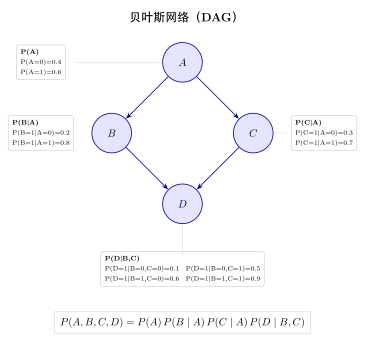
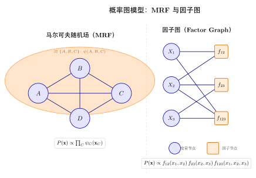
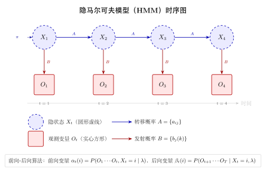

# 第 24 章 概率图模型 ⭐（融合版）

> **难度**：★★★★★
> **前置知识**：第 6 章多维随机变量、第 11 章最大似然估计、第 22 章信息论基础、微积分与线性代数
> **本文件**：融合"原版严格推导 + 重写版高中模板 D 速记 / 套路 / 自测"。保留原版完整正文（学习目标 / 24.1–24.5 / 深度学习应用 / 练习题）+ 在最前置 + 最后追加思维训练。

> **一例速记**：
> **DAG 联合分解**：$P(X_1,\ldots,X_n)=\prod_i P(X_i\mid\text{Pa}(X_i))$，参数量从 $2^n$ 降到线性。
> **条件独立性**：$X\perp\!\!\!\perp Y\mid Z\Leftrightarrow P(X,Y\mid Z)=P(X\mid Z)P(Y\mid Z)$，图结构是其编码。
> **d-分离**：链/分叉节点 $m\in\mathbf{Z}$ 则阻断；碰撞节点 $m\notin\mathbf{Z}$ 且其后代 $\notin\mathbf{Z}$ 则阻断。
> **MRF 势函数**：$P(\mathbf{X})=\frac{1}{Z}\prod_{c\in\mathcal{C}}\psi_c(\mathbf{X}_c)$，配分函数 $Z$ 是 MRF 推断的核心难点。
> **因子图**：将联合分布分解为变量节点与因子节点的二部图，统一 DAG 与 MRF 的推断框架。
> **变量消元**：按序对未观测变量积分/求和，利用因子图避免重复计算，树形图复杂度 $O(nk^2)$。
> **信念传播**：在树形图上沿边传递消息 $\mu_{f\to x}$ 与 $\mu_{x\to f}$，等价于并行变量消元。

---

## 引入：一道反直觉的"参数爆炸"题

> **题目**：设医学诊断系统包含 $n = 30$ 个二值症状变量 $X_1, X_2, \ldots, X_{30}$（如发热、咳嗽、胸痛……）。
> 要完整描述这 30 个变量的联合分布，需要多少个独立参数？
> 如果引入图结构，每个变量最多依赖 3 个父变量，参数量变为多少？

请先停下来想一想：**$2^{30}$ 大约是多少？图结构如何把它压缩？**

$2^{30} \approx 10^9$——超过 10 亿个参数，存储和学习都完全不现实。

但若引入贝叶斯网络，每个节点最多有 3 个父节点，则每个条件概率表至多需要 $2^3 = 8$ 个参数，30 个节点总共只需 $30 \times 8 = 240$ 个参数。从 **10 亿降到 240**——这不是近似，而是在利用图结构编码的**条件独立性**实现的精确分解。

这正是概率图模型的核心魔法：**图结构 = 条件独立性假设 = 参数量从指数级降到线性级**。

---

## 思维路径还原（从 DAG 读出条件独立性的内心独白）

> "题目给了一个 DAG：$\text{Rain} \to \text{WetGrass} \leftarrow \text{Sprinkler} \leftarrow \text{Season}$，$\text{Season} \to \text{Rain}$。
>
> 被问：给定 WetGrass 被观测到为 True，Rain 与 Sprinkler 是否独立？
>
> **第一步**：找出所有连接 Rain 与 Sprinkler 的路径。
>
> 路径 1：$\text{Rain} \to \text{WetGrass} \leftarrow \text{Sprinkler}$。
> 路径 2：$\text{Rain} \leftarrow \text{Season} \to \text{Sprinkler}$。
>
> **第二步**：对每条路径判断是否被观测集 $\mathbf{Z} = \{\text{WetGrass}\}$ 阻断。
>
> 路径 1：中间节点 WetGrass 是**碰撞节点**（$\to\leftarrow$）。d-分离规则说，碰撞节点**不在** $\mathbf{Z}$ 时路径阻断；碰撞节点**在** $\mathbf{Z}$ 时路径畅通。现在 WetGrass 被观测到了（$\in\mathbf{Z}$），所以路径 1 **畅通**！
>
> 路径 2：中间节点 Season 是**分叉节点**（$\leftarrow\to$）。分叉节点在 $\mathbf{Z}$ 时路径阻断；不在 $\mathbf{Z}$ 时路径畅通。Season 未被观测（$\notin\mathbf{Z}$），路径 2 **畅通**。
>
> **第三步**：至少有一条路径畅通 → 两节点**未被** $\mathbf{Z}$ d-分离 → Rain 与 Sprinkler **不独立**。
>
> **直觉解释**：你看到草是湿的（WetGrass = True）。你开始怀疑——是因为下雨还是洒水器？观测到湿草这个"共同结果"，使得两个"可能原因"（下雨、洒水器）之间产生了关联。这正是**解释消去（explaining away）**效应，也是碰撞结构中最反直觉的地方。
>
> **碰撞结构的核心口诀**：未观测碰撞节点 → 路径阻断（两因子独立）；观测了碰撞节点 → 路径畅通（两因子关联）。与链和分叉**完全相反**——记住这个方向反转！"

---

## 学习目标

读完本章，你将能够：

1. 理解概率图模型的核心思想——用图结构编码随机变量之间的条件独立性，并利用因子分解大幅降低计算复杂度
2. 掌握贝叶斯网络（有向图）的构建规则、d-分离准则以及精确推断与近似推断方法
3. 理解马尔可夫随机场（无向图）的势函数表示、Gibbs分布及其与贝叶斯网络的联系与区别
4. 推导EM算法的数学原理，并能将其应用于高斯混合模型（GMM）等隐变量模型的参数估计
5. 理解变分推断的核心思想——用ELBO下界将推断问题转化为优化问题，并认识到VAE正是变分推断与深度神经网络的结合

---

## 24.1 图模型概述

### 24.1.1 为什么需要图模型

设想一个包含 $n$ 个二值随机变量 $X_1, X_2, \ldots, X_n$ 的联合分布。完整表示这个分布需要 $2^n - 1$ 个参数——当 $n = 100$ 时，这是一个天文数字，完全无法存储和计算。

**核心洞察**：现实世界中，大多数变量并不直接相互依赖。一个人是否感冒，与遥远城市的股票价格几乎无关。如果能将这些"局部依赖"结构显式地编码进模型，就能用远少于 $2^n$ 的参数表示联合分布。

**概率图模型（Probabilistic Graphical Model, PGM）**正是这一思想的形式化：

$$\text{图} G = (V, E) \quad \text{其中节点} V \text{对应随机变量，边} E \text{编码依赖关系}$$

### 24.1.2 条件独立性

**条件独立性**是图模型的核心概念。若给定 $Z$ 后，$X$ 与 $Y$ 独立，记作：

$$X \perp\!\!\!\perp Y \mid Z$$

等价地：

$$P(X, Y \mid Z) = P(X \mid Z) \cdot P(Y \mid Z)$$

**链式法则的因子分解**：任意联合分布都可以写成：

$$P(X_1, X_2, \ldots, X_n) = \prod_{i=1}^{n} P(X_i \mid X_1, \ldots, X_{i-1})$$

图模型的目标是利用条件独立性简化每个条件因子，使得每个 $X_i$ 只依赖于其**父节点集合** $\text{Pa}(X_i)$（有向图）或**邻居集合**（无向图）。

### 24.1.3 两大类图模型

| 特征 | 贝叶斯网络（有向图） | 马尔可夫随机场（无向图） |
|------|------|------|
| 边的类型 | 有向边（DAG） | 无向边 |
| 因子分解 | 条件概率 $P(X_i \mid \text{Pa}(X_i))$ | 势函数 $\psi_c(X_c)$ |
| 典型应用 | 因果推断、贝叶斯网络 | 图像分割、社交网络 |
| 归一化 | 自动满足 | 需要配分函数 $Z$ |

---

## 24.2 贝叶斯网络（有向图模型）

### 24.2.1 定义与因子分解

**贝叶斯网络**是一个有向无环图（DAG），其中：
- 每个节点 $X_i$ 对应一个随机变量
- 有向边 $X_j \to X_i$ 表示 $X_j$ 是 $X_i$ 的"父节点"

**联合分布的因子分解**：

$$\boxed{P(X_1, X_2, \ldots, X_n) = \prod_{i=1}^{n} P(X_i \mid \text{Pa}(X_i))}$$

其中 $\text{Pa}(X_i)$ 是节点 $X_i$ 的父节点集合（若无父节点则为先验 $P(X_i)$）。

**例：学生成绩模型**

考虑变量：课程难度 $D$、学生智力 $I$、考试成绩 $G$、推荐信 $L$、SAT分数 $S$。

图结构：$D \to G \leftarrow I \to S$，$G \to L$

联合分布：

$$P(D, I, G, L, S) = P(D) \cdot P(I) \cdot P(G \mid D, I) \cdot P(L \mid G) \cdot P(S \mid I)$$

原本需要 $2^5 - 1 = 31$ 个参数，因子分解后仅需少量参数。

### 24.2.2 三种基本连接结构

理解贝叶斯网络中信息"流动"的规律，关键是分析三种基本连接模式：

**1. 链式结构（Chain）**：$X \to Y \to Z$

给定 $Y$ 后，$X$ 与 $Z$ 条件独立：

$$P(X, Z \mid Y) = P(X \mid Y) \cdot P(Z \mid Y) \implies X \perp\!\!\!\perp Z \mid Y$$

**2. 共因结构（Fork）**：$X \leftarrow Y \to Z$

给定 $Y$ 后，$X$ 与 $Z$ 条件独立。$Y$ 是 $X$ 和 $Z$ 的公共原因，观测 $Y$ "阻断"了 $X$ 与 $Z$ 的关联。

**3. 碰撞结构（v-structure / Collider）**：$X \to Y \leftarrow Z$

- 未观测 $Y$：$X$ 与 $Z$ 独立（$X \perp\!\!\!\perp Z$）
- 观测 $Y$（或其后代）：$X$ 与 $Z$ 变得**相关**（解释消去效应）

这是与前两种结构相反的行为，也是 d-分离中最微妙的部分。

### 24.2.3 d-分离准则

**d-分离（directional separation）**是判断贝叶斯网络中条件独立性的通用算法。

**定义**：在有向图中，给定观测集合 $\mathbf{Z}$，若所有连接 $X$ 与 $Y$ 的路径都被"阻断"，则称 $X$ 与 $Y$ 被 $\mathbf{Z}$ d-分离，记作 $(X \perp\!\!\!\perp Y \mid \mathbf{Z})_G$。

**路径被阻断的条件**（路径上存在节点 $m$）：

| 结构类型 | 阻断条件 |
|---------|---------|
| 链 $\cdots \to m \to \cdots$ | $m \in \mathbf{Z}$ |
| 分叉 $\cdots \leftarrow m \to \cdots$ | $m \in \mathbf{Z}$ |
| 碰撞 $\cdots \to m \leftarrow \cdots$ | $m \notin \mathbf{Z}$ 且 $m$ 的后代 $\notin \mathbf{Z}$ |

**定理（Markov性质）**：若图 $G$ 中 $X$ 与 $Y$ 被 $\mathbf{Z}$ d-分离，则在满足图 $G$ 的所有分布中，$X \perp\!\!\!\perp Y \mid \mathbf{Z}$ 成立。

### 24.2.4 精确推断：变量消元法

贝叶斯网络的核心任务是**推断**：给定部分观测，计算其余变量的后验分布。

**变量消元（Variable Elimination）**通过逐步边缘化（积分消除）未观测变量来计算目标概率。

以链式模型 $A \to B \to C$ 为例，计算 $P(A \mid C = c)$：

$$P(A \mid C = c) \propto \sum_B P(A) \cdot P(B \mid A) \cdot P(C = c \mid B)$$

关键技巧：先计算 $\tau(B) = P(C = c \mid B)$，再计算 $\sum_B P(B \mid A) \cdot \tau(B)$，避免重复计算。

对于树形结构，变量消元等价于**置信传播（Belief Propagation）**，复杂度为 $O(n \cdot k^2)$，其中 $k$ 为变量的状态数。对于有环图，需使用**循环置信传播**（近似推断）。

---

## 24.3 马尔可夫随机场（无向图模型）

### 24.3.1 定义与Gibbs分布

**马尔可夫随机场（Markov Random Field, MRF）**，又称**马尔可夫网络**，使用无向图表示变量间的对称依赖关系。

**局部Markov性质**：给定邻居节点集合 $\mathcal{N}(X_i)$，$X_i$ 与其余非邻居节点条件独立：

$$X_i \perp\!\!\!\perp \mathbf{X}_{\text{rest}} \mid \mathbf{X}_{\mathcal{N}(i)}$$

**团（Clique）**：图中完全连接的子集（任意两节点之间都有边）。

**Hammersley-Clifford定理**：满足局部Markov性质的正分布，可以表示为**极大团上势函数的乘积**：

$$\boxed{P(\mathbf{X}) = \frac{1}{Z} \prod_{c \in \mathcal{C}} \psi_c(\mathbf{X}_c)}$$

其中：
- $\psi_c(\mathbf{X}_c) > 0$ 是定义在团 $c$ 上的**势函数（potential function）**
- $Z = \sum_{\mathbf{X}} \prod_c \psi_c(\mathbf{X}_c)$ 是**配分函数（partition function）**，用于归一化
- $\mathcal{C}$ 是所有极大团的集合

**Gibbs分布**：将势函数写成能量函数的指数形式：

$$P(\mathbf{X}) = \frac{1}{Z} \exp\left(-\sum_{c} E_c(\mathbf{X}_c)\right) = \frac{1}{Z} \exp(-E(\mathbf{X}))$$

其中 $E(\mathbf{X}) = \sum_c E_c(\mathbf{X}_c)$ 称为**能量函数**。

### 24.3.2 与贝叶斯网络的比较

**表达能力**：两者的表达能力不完全相同，各有擅长的独立性结构。存在既不能用贝叶斯网络也不能用MRF精确表示的分布。

**将贝叶斯网络转化为MRF（道德化）**：

1. 为每个节点的父节点两两相连（"婚姻化"）
2. 将所有有向边替换为无向边

这个过程称为**道德化（moralization）**，得到的图称为**道德图**。注意：道德化可能引入新的独立性损失。

**配分函数的计算**：MRF最大的挑战是配分函数 $Z$ 的计算。对于离散变量，精确计算需要对所有状态求和，复杂度为指数级。这是MRF推断困难的根本原因，也是为何需要MCMC、变分推断等近似方法。

### 24.3.3 条件随机场

**条件随机场（Conditional Random Field, CRF）**是MRF的判别式变体，直接建模条件分布 $P(\mathbf{Y} \mid \mathbf{X})$：

$$P(\mathbf{Y} \mid \mathbf{X}) = \frac{1}{Z(\mathbf{X})} \exp\left(\sum_c \psi_c(\mathbf{Y}_c, \mathbf{X})\right)$$

CRF在序列标注（如命名实体识别）中取得了重要成果，是联结图模型与深度学习的早期尝试。

---

## 24.4 隐变量模型与EM算法

### 24.4.1 隐变量模型

许多真实问题中，我们观测到数据 $\mathbf{x}$，但生成数据的过程涉及**隐变量（latent variable）** $\mathbf{z}$。

**边缘似然（Evidence）**：

$$P(\mathbf{x} \mid \theta) = \int P(\mathbf{x}, \mathbf{z} \mid \theta) \, d\mathbf{z} = \int P(\mathbf{x} \mid \mathbf{z}, \theta) P(\mathbf{z} \mid \theta) \, d\mathbf{z}$$

直接最大化边缘似然通常很难，因为积分没有解析解。EM算法提供了一种迭代优化方案。

### 24.4.2 EM算法的推导

**目标**：最大化对数边缘似然 $\log P(\mathbf{x} \mid \theta)$。

对于任意关于 $\mathbf{z}$ 的分布 $q(\mathbf{z})$，利用Jensen不等式：

$$\log P(\mathbf{x} \mid \theta) = \log \int P(\mathbf{x}, \mathbf{z} \mid \theta) \, d\mathbf{z}$$

$$= \log \int q(\mathbf{z}) \frac{P(\mathbf{x}, \mathbf{z} \mid \theta)}{q(\mathbf{z})} \, d\mathbf{z}$$

$$\geq \int q(\mathbf{z}) \log \frac{P(\mathbf{x}, \mathbf{z} \mid \theta)}{q(\mathbf{z})} \, d\mathbf{z} \quad \text{（Jensen不等式）}$$

$$= \underbrace{\mathbb{E}_{q(\mathbf{z})}[\log P(\mathbf{x}, \mathbf{z} \mid \theta)]}_{\text{期望完全对数似然}} + \underbrace{H[q(\mathbf{z})]}_{\text{熵}} := \mathcal{L}(q, \theta)$$

等号成立条件：$q(\mathbf{z}) = P(\mathbf{z} \mid \mathbf{x}, \theta)$（当 $q$ 等于后验分布时）。

**EM算法的两步迭代**：

$$\boxed{\text{E步（期望步）}：q^{(t+1)}(\mathbf{z}) = P(\mathbf{z} \mid \mathbf{x}, \theta^{(t)})}$$

$$\boxed{\text{M步（最大化步）}：\theta^{(t+1)} = \arg\max_\theta \mathbb{E}_{q^{(t+1)}(\mathbf{z})}[\log P(\mathbf{x}, \mathbf{z} \mid \theta)]}$$

**单调性保证**：EM算法保证对数似然单调不减：

$$\log P(\mathbf{x} \mid \theta^{(t+1)}) \geq \log P(\mathbf{x} \mid \theta^{(t)})$$

证明：E步使下界 $\mathcal{L}$ 紧（消除了KL散度间隙），M步提升下界，因此总体对数似然不减。

### 24.4.3 高斯混合模型（GMM）的EM算法

**模型定义**：GMM假设数据由 $K$ 个高斯分量混合生成：

$$P(\mathbf{x} \mid \theta) = \sum_{k=1}^{K} \pi_k \mathcal{N}(\mathbf{x} \mid \boldsymbol{\mu}_k, \boldsymbol{\Sigma}_k)$$

其中 $\pi_k \geq 0$，$\sum_k \pi_k = 1$，$\theta = \{\pi_k, \boldsymbol{\mu}_k, \boldsymbol{\Sigma}_k\}_{k=1}^K$。

隐变量 $z_i \in \{1, \ldots, K\}$ 表示第 $i$ 个数据点属于哪个分量，$P(z_i = k) = \pi_k$。

**E步（计算后验"责任"）**：

$$r_{ik} = P(z_i = k \mid \mathbf{x}_i, \theta^{(t)}) = \frac{\pi_k^{(t)} \mathcal{N}(\mathbf{x}_i \mid \boldsymbol{\mu}_k^{(t)}, \boldsymbol{\Sigma}_k^{(t)})}{\sum_{j=1}^K \pi_j^{(t)} \mathcal{N}(\mathbf{x}_i \mid \boldsymbol{\mu}_j^{(t)}, \boldsymbol{\Sigma}_j^{(t)})}$$

**M步（更新参数）**：

令 $N_k = \sum_{i=1}^N r_{ik}$（分量 $k$ 的有效样本数），则：

$$\boldsymbol{\mu}_k^{(t+1)} = \frac{1}{N_k} \sum_{i=1}^N r_{ik} \mathbf{x}_i$$

$$\boldsymbol{\Sigma}_k^{(t+1)} = \frac{1}{N_k} \sum_{i=1}^N r_{ik} (\mathbf{x}_i - \boldsymbol{\mu}_k^{(t+1)})(\mathbf{x}_i - \boldsymbol{\mu}_k^{(t+1)})^\top$$

$$\pi_k^{(t+1)} = \frac{N_k}{N}$$

**EM vs K-means**：K-means可以看作GMM EM算法的硬分配（hard assignment）版本——每个数据点被强制分配到最近的中心，而非保留软概率权重 $r_{ik}$。

---

## 24.5 变分推断简介

### 24.5.1 推断问题的困难性

后验推断的核心任务是计算：

$$P(\mathbf{z} \mid \mathbf{x}) = \frac{P(\mathbf{x} \mid \mathbf{z}) P(\mathbf{z})}{P(\mathbf{x})}$$

难点在于分母 $P(\mathbf{x}) = \int P(\mathbf{x} \mid \mathbf{z}) P(\mathbf{z}) \, d\mathbf{z}$ 通常无法解析计算。

两大近似推断方法：
- **MCMC（马尔可夫链蒙特卡洛）**：通过采样近似后验，渐进精确但计算慢
- **变分推断（Variational Inference）**：将推断转化为优化，速度快但有近似误差

### 24.5.2 变分推断框架

**核心思想**：在某个"简单"分布族 $\mathcal{Q} = \{q_\phi(\mathbf{z})\}$ 中，寻找最接近真实后验 $P(\mathbf{z} \mid \mathbf{x})$ 的分布：

$$q^*_\phi(\mathbf{z}) = \arg\min_{q \in \mathcal{Q}} \text{KL}(q_\phi(\mathbf{z}) \| P(\mathbf{z} \mid \mathbf{x}))$$

**KL散度展开**：

$$\text{KL}(q_\phi(\mathbf{z}) \| P(\mathbf{z} \mid \mathbf{x})) = \mathbb{E}_{q_\phi}\left[\log \frac{q_\phi(\mathbf{z})}{P(\mathbf{z} \mid \mathbf{x})}\right]$$

$$= \mathbb{E}_{q_\phi}[\log q_\phi(\mathbf{z})] - \mathbb{E}_{q_\phi}[\log P(\mathbf{x}, \mathbf{z})] + \log P(\mathbf{x})$$

由于 $\text{KL} \geq 0$，得到：

$$\log P(\mathbf{x}) \geq \underbrace{\mathbb{E}_{q_\phi}[\log P(\mathbf{x}, \mathbf{z})] - \mathbb{E}_{q_\phi}[\log q_\phi(\mathbf{z})]}_{\text{证据下界（ELBO）}}$$

### 24.5.3 证据下界（ELBO）

**ELBO（Evidence Lower BOund）**是变分推断的核心量：

$$\boxed{\mathcal{L}(\phi) = \mathbb{E}_{q_\phi(\mathbf{z})}[\log P(\mathbf{x}, \mathbf{z})] - \mathbb{E}_{q_\phi(\mathbf{z})}[\log q_\phi(\mathbf{z})]}$$

等价分解：

$$\mathcal{L}(\phi) = \mathbb{E}_{q_\phi(\mathbf{z})}[\log P(\mathbf{x} \mid \mathbf{z})] - \text{KL}(q_\phi(\mathbf{z}) \| P(\mathbf{z}))$$

- 第一项：**重建项**，鼓励 $q_\phi(\mathbf{z})$ 找到能解释观测数据的隐变量值
- 第二项：**正则化项**，鼓励近似后验接近先验，防止过拟合

**最大化ELBO等价于**：
1. 最小化 $\text{KL}(q_\phi \| P(\cdot \mid \mathbf{x}))$（推断目标）
2. 最大化 $\log P(\mathbf{x})$（学习目标）

### 24.5.4 均场近似

**均场（Mean-Field）变分推断**假设 $q_\phi(\mathbf{z})$ 在各维度上完全分解：

$$q_\phi(\mathbf{z}) = \prod_{j} q_j(z_j)$$

在此假设下，可以推导出每个因子的最优形式（坐标上升）：

$$q_j^*(z_j) \propto \exp\left(\mathbb{E}_{q_{-j}}[\log P(\mathbf{x}, \mathbf{z})]\right)$$

其中 $\mathbb{E}_{q_{-j}}$ 表示对除 $z_j$ 外的所有变量取期望。

---

## 几何示意

### 图 24-1：贝叶斯网络（DAG 示例）



### 图 24-2：马尔可夫随机场与因子图



### 图 24-3：HMM 时序模型与变量消元（前向-后向算法）



---

## 抽象成方法（套路总结）

### 核心公式速查表

| 名称 | 公式 | 关键性质 |
|------|------|------|
| **DAG 因子分解** | $P(X_1,\ldots,X_n)=\prod_i P(X_i \mid \text{Pa}(X_i))$ | 无父节点时为先验 $P(X_i)$ |
| **MRF Gibbs** | $P(\mathbf{X})=\frac{1}{Z}\prod_c\psi_c(\mathbf{X}_c)$ | 配分函数 $Z$ 是计算瓶颈 |
| **ELBO** | $\mathcal{L}(\phi)=\mathbb{E}_{q_\phi}[\log P(\mathbf{x},\mathbf{z})]-\mathbb{E}_{q_\phi}[\log q_\phi(\mathbf{z})]$ | $\log P(\mathbf{x})\geq\mathcal{L}$，等号当 $q=P(\mathbf{z}\mid\mathbf{x})$ |
| **EM E步** | $q^{(t+1)}(\mathbf{z})=P(\mathbf{z}\mid\mathbf{x},\theta^{(t)})$ | 使 ELBO 变紧 |
| **EM M步** | $\theta^{(t+1)}=\arg\max_\theta\mathbb{E}_{q^{(t+1)}}[\log P(\mathbf{x},\mathbf{z}\mid\theta)]$ | 对数似然单调不减 |
| **均场最优** | $q_j^*(z_j)\propto\exp(\mathbb{E}_{q_{-j}}[\log P(\mathbf{x},\mathbf{z})])$ | 坐标上升，交替更新各因子 |

### DAG / MRF 推断标准 4 步流程

**步骤 1：建模**
- 确定观测变量 $\mathbf{X}_{\text{obs}}$ 和查询变量 $\mathbf{X}_{\text{query}}$
- 选择 DAG（有方向因果关系）或 MRF（对称依赖关系）

**步骤 2：因子分解**
- DAG：写出 $P = \prod_i P(X_i \mid \text{Pa}(X_i))$
- MRF：写出 $P = \frac{1}{Z}\prod_c \psi_c$

**步骤 3：消元顺序**
- 确定消元顺序（最小填充启发式）
- 利用因子图避免重复计算中间结果

**步骤 4：计算边缘/条件分布**
- 树形图：精确信念传播 $O(nk^2)$
- 有环图：循环信念传播（近似）或变分推断

---

## 方法变形

### 变形 1：精确推断——变量消元与信念传播

**变量消元**：按消元序对每个隐变量积分/求和，核心是"分配律"减少重复乘法。

**信念传播（Sum-Product 算法）**：在因子图上，变量节点 $x$ 和因子节点 $f$ 交替传递消息：

$$\mu_{x \to f}(x) = \prod_{h \in \text{nb}(x) \setminus f} \mu_{h \to x}(x)$$

$$\mu_{f \to x}(x) = \sum_{\mathbf{x}_f \setminus x} f(\mathbf{x}_f) \prod_{y \in \text{nb}(f) \setminus x} \mu_{y \to f}(y)$$

树形因子图上精确收敛，有环图上循环运行得到近似解（Loopy BP）。

### 变形 2：近似推断——变分与 MCMC

**均场变分推断**：假设 $q(\mathbf{z}) = \prod_j q_j(z_j)$，交替优化每个因子直至 ELBO 收敛。优点：快速；缺点：低估后验方差。

**MCMC**：构造平稳分布为目标后验的马尔可夫链采样。常用 Metropolis-Hastings 或 Gibbs 采样。优点：渐近精确；缺点：收敛慢、难以判断何时收敛。

**变分 EM**：当后验不可解析时，用变分推断替代 E 步。VAE 是其神经网络实现：编码器参数化 $q_\phi(\mathbf{z}\mid\mathbf{x})$，解码器参数化 $P_\theta(\mathbf{x}\mid\mathbf{z})$。

### 变形 3：结构学习

给定数据，学习图结构（哪些变量之间有边）。

**评分-搜索法**：定义结构评分（如 BIC = $\log P(\text{data} \mid \hat{\theta}) - \frac{d}{2}\log N$），用贪心搜索或遗传算法最大化评分。

**约束法**：用条件独立性检验确定是否存在边，代表算法 PC 算法（从完全图开始删边）。

### 变形 4：参数学习

给定结构，从数据估计参数（条件概率表或势函数参数）。

**完整数据 DAG**：对每个 CPT 做最大似然，等价于频率统计 $\hat{P}(X_i \mid \text{Pa}(X_i))$。

**含隐变量**：用 EM 算法。GMM、HMM、LDA 均是此类。

**MRF 参数学习**：最大化对数似然 $\log P(\mathbf{x}) = \sum_c \log\psi_c - \log Z$；难点是 $\nabla_\theta \log Z$ 需要计算期望，通常用对比散度（CD）近似。

---

## 本章小结

本章系统介绍了概率图模型的核心理论框架：

1. **图模型的统一视角**：通过图结构编码条件独立性，实现联合分布的高效因子分解，是处理高维概率分布的核心工具

2. **贝叶斯网络**：基于有向无环图，因子分解为条件概率乘积。d-分离准则提供了判断条件独立性的算法，三种基本连接结构（链、分叉、碰撞）揭示了信息流动的本质

3. **马尔可夫随机场**：基于无向图，通过势函数和配分函数表示联合分布。Hammersley-Clifford定理建立了图结构与分布因子分解的等价性

4. **EM算法**：通过引入辅助分布 $q(\mathbf{z})$ 构造对数似然的下界，交替优化以单调提升似然。在GMM上的应用展示了软分配与参数估计的优雅交互

5. **变分推断**：将难以计算的后验推断转化为ELBO最大化问题，均场近似和重参数化技巧使其能与深度学习结合，催生了VAE等现代生成模型

---

## 思考路标（条件反射）

1. 看到"联合分布"+ DAG → 立刻写因子分解 $\prod_i P(X_i \mid \text{Pa}(X_i))$，数一下参数量
2. 看到"是否条件独立" → 找出所有连接路径，逐条判断是否被 $\mathbf{Z}$ 阻断（d-分离三规则）
3. 看到碰撞节点 $\to m \leftarrow$ → 记住"未观测时阻断，观测时畅通"——方向与链/分叉相反
4. 看到"MRF" → 想势函数 $\psi_c$、配分函数 $Z$、Gibbs 分布；$Z$ 是计算瓶颈
5. 看到"道德化" → DAG 转 MRF 时需先连接共同父节点（婚姻化），再去掉箭头
6. 看到"隐变量模型" → 想 EM 算法；E步算后验责任 $q$，M步最大化完全数据对数似然
7. 看到"后验推断难" → 两大出路：MCMC（慢精确）vs 变分推断（快近似）
8. 看到 ELBO → 分拆成重建项 + KL 正则化项；等号成立条件是 $q = P(\mathbf{z}\mid\mathbf{x})$
9. 看到"树形图" → 信念传播精确且 $O(nk^2)$；看到"有环图" → 循环 BP 或变分近似
10. 看到"GMM" → EM 算法：E步算 $r_{ik}$（软分配），M步用加权样本更新 $\mu_k, \Sigma_k, \pi_k$
11. 看到"VAE" → 编码器 $q_\phi(\mathbf{z}\mid\mathbf{x})$ + 解码器 $P_\theta(\mathbf{x}\mid\mathbf{z})$ + 重参数化技巧
12. 看到"CRF" → MRF 的判别式变体，直接建模 $P(\mathbf{Y}\mid\mathbf{X})$，无需建模输入分布

---

## 易错点

1. **DAG 与 MRF 表达能力不等价**：DAG 能表示某些 MRF 无法精确表示的分布（反之亦然）。"道德化"是单向操作——将 DAG 转为 MRF 可能损失某些独立性；不能把 MRF 无损地转回 DAG。不要以为两者可以随意互换。

2. **d-分离中碰撞节点的方向记反**：链和分叉节点"在 $\mathbf{Z}$ 中则阻断"；碰撞节点正好相反——"在 $\mathbf{Z}$ 中则畅通"（解释消去效应）。这是 d-分离最容易记错的地方，建议用"雨水-草湿-洒水器"的例子死记方向。

3. **道德化引入虚假独立性损失**：将 DAG 转换为道德图时，可能需要连接多个父节点，从而在道德图中引入原本不存在的边（失去原 DAG 中的某些条件独立性）。道德图编码的独立性集合是原 DAG 的**子集**。

4. **推断复杂度与树宽**：变量消元的复杂度是 $O(k^{w+1})$，其中 $w$ 是消元图的树宽（treewidth）。树形图 $w=1$，一般图的树宽可能是 $\Theta(n)$（NP-hard）。不能假设所有图都能高效精确推断。

5. **HMM 状态空间爆炸**：HMM 的隐状态数为 $K$，序列长度为 $T$。暴力枚举所有路径的复杂度是 $O(K^T)$；Viterbi 和前向-后向算法利用动态规划将其降到 $O(TK^2)$。若错误地认为"序列推断直接暴力"，指数复杂度立即让问题不可解。

6. **EM 只保证局部最优**：EM 算法单调提升对数似然，但不保证收敛到全局最优。GMM 对初始化敏感，多次随机重启并取最优结果是工程实践的标准做法。

---

## 典型应用例题

### 例 1：DAG 联合分解与参数计数

> **题目**：给定贝叶斯网络，节点为 $\{A, B, C, D\}$，结构为 $A \to B$、$A \to C$、$B \to D$、$C \to D$。所有变量均为二值变量。
>
> (1) 写出联合分布的因子分解。
> (2) 计算完整表示所需的参数数量（以因子分解后的 CPT 计）。
> (3) 与无结构的联合分布对比，节省了多少参数？

【思路】对照 DAG 结构，找出每个节点的父节点集合，写出各条件概率表（CPT）。

【解】

**(1) 因子分解**：

$$P(A, B, C, D) = P(A) \cdot P(B \mid A) \cdot P(C \mid A) \cdot P(D \mid B, C)$$

**(2) 参数计数**：

- $P(A)$：1 个参数（$P(A=1)$，则 $P(A=0) = 1 - P(A=1)$）
- $P(B \mid A)$：2 个参数（$P(B=1 \mid A=0)$ 和 $P(B=1 \mid A=1)$）
- $P(C \mid A)$：2 个参数（同上）
- $P(D \mid B, C)$：4 个参数（$B,C$ 各取 0/1，共 4 种组合）

总计：$1 + 2 + 2 + 4 = \mathbf{9}$ 个参数。

**(3) 对比**：

无结构联合分布 $P(A, B, C, D)$ 需要 $2^4 - 1 = 15$ 个参数。

图模型仅需 9 个参数，节省了 $15 - 9 = \mathbf{6}$ 个参数（节省约 40%）。

【结论】变量越多、图越稀疏，因子分解的压缩效果越显著。$n = 100$ 且每节点有 3 个父节点时，参数从 $2^{100}$ 降到约 $100 \times 8 = 800$。

---

### 例 2：d-分离判定

> **题目**：给定贝叶斯网络：$S \to R$、$S \to C$、$R \to W$、$C \to W$（$S$=季节，$R$=下雨，$C$=洒水器，$W$=草湿）。
>
> 判断以下条件独立性是否成立：
> (a) $R \perp\!\!\!\perp C$（未观测任何变量）
> (b) $R \perp\!\!\!\perp C \mid S$
> (c) $R \perp\!\!\!\perp C \mid W$
> (d) $R \perp\!\!\!\perp C \mid \{S, W\}$

【思路】列出 $R$ 与 $C$ 之间所有路径，对每条路径逐节点应用 d-分离三规则。

【解】

**路径枚举**：
- 路径 1：$R \leftarrow S \to C$（经过分叉节点 $S$）
- 路径 2：$R \to W \leftarrow C$（经过碰撞节点 $W$）

**(a) $R \perp\!\!\!\perp C$（$\mathbf{Z} = \emptyset$）**：
- 路径 1：$S$ 是分叉节点，$S \notin \mathbf{Z}$，路径**畅通**
- 结论：至少一条路径畅通，$R$ 与 $C$ **不独立** ✗

**(b) $R \perp\!\!\!\perp C \mid S$（$\mathbf{Z} = \{S\}$）**：
- 路径 1：$S$ 是分叉节点，$S \in \mathbf{Z}$，路径**阻断** ✓
- 路径 2：$W$ 是碰撞节点，$W \notin \mathbf{Z}$ 且 $W$ 的后代也 $\notin \mathbf{Z}$，路径**阻断** ✓
- 结论：所有路径均阻断，$R \perp\!\!\!\perp C \mid S$ **成立** ✓

**(c) $R \perp\!\!\!\perp C \mid W$（$\mathbf{Z} = \{W\}$）**：
- 路径 1：$S$ 是分叉节点，$S \notin \mathbf{Z}$，路径**畅通**
- 路径 2：$W$ 是碰撞节点，$W \in \mathbf{Z}$，路径**畅通**（碰撞激活）
- 结论：两条路径均畅通，$R \perp\!\!\!\perp C \mid W$ **不成立** ✗

**(d) $R \perp\!\!\!\perp C \mid \{S, W\}$**：
- 路径 1：$S$ 是分叉节点，$S \in \mathbf{Z}$，路径**阻断** ✓
- 路径 2：$W$ 是碰撞节点，$W \in \mathbf{Z}$，路径**畅通**
- 结论：路径 2 畅通，$R \perp\!\!\!\perp C \mid \{S,W\}$ **不成立** ✗

【要点】即使同时观测 $S$ 和 $W$，观测 $W$（碰撞节点）带来的"解释消去"效应无法被 $S$ 的阻断所抵消——两条路径独立判断。

---

### 例 3：HMM 前向算法

> **题目**：简单 HMM，隐状态 $z \in \{0, 1\}$（晴天/雨天），观测 $x \in \{0, 1\}$（干/湿）。
>
> 参数：
> - 初始分布：$\pi_0 = P(z_1=0) = 0.6$，$\pi_1 = P(z_1=1) = 0.4$
> - 转移矩阵：$P(z_{t+1}=0 \mid z_t=0) = 0.7$，$P(z_{t+1}=1 \mid z_t=0) = 0.3$；$P(z_{t+1}=0 \mid z_t=1) = 0.4$，$P(z_{t+1}=1 \mid z_t=1) = 0.6$
> - 发射矩阵：$P(x_t=0 \mid z_t=0) = 0.9$，$P(x_t=1 \mid z_t=0) = 0.1$；$P(x_t=0 \mid z_t=1) = 0.2$，$P(x_t=1 \mid z_t=1) = 0.8$
>
> 观测序列 $\mathbf{x} = (x_1=0, x_2=1)$（第一天干、第二天湿）。
>
> 用前向算法计算 $P(\mathbf{x})$。

【思路】定义前向变量 $\alpha_t(k) = P(x_1,\ldots,x_t, z_t=k)$，递推计算。

【解】

**初始化（$t=1$，观测 $x_1=0$）**：

$$\alpha_1(0) = \pi_0 \cdot P(x_1=0 \mid z_1=0) = 0.6 \times 0.9 = 0.54$$

$$\alpha_1(1) = \pi_1 \cdot P(x_1=0 \mid z_1=1) = 0.4 \times 0.2 = 0.08$$

**递推（$t=2$，观测 $x_2=1$）**：

$$\alpha_2(0) = \left[\alpha_1(0) \cdot P(z_2=0\mid z_1=0) + \alpha_1(1) \cdot P(z_2=0\mid z_1=1)\right] \cdot P(x_2=1\mid z_2=0)$$

$$= \left[0.54 \times 0.7 + 0.08 \times 0.4\right] \times 0.1 = \left[0.378 + 0.032\right] \times 0.1 = 0.041$$

$$\alpha_2(1) = \left[\alpha_1(0) \cdot P(z_2=1\mid z_1=0) + \alpha_1(1) \cdot P(z_2=1\mid z_1=1)\right] \cdot P(x_2=1\mid z_2=1)$$

$$= \left[0.54 \times 0.3 + 0.08 \times 0.6\right] \times 0.8 = \left[0.162 + 0.048\right] \times 0.8 = 0.168$$

**最终结果**：

$$P(\mathbf{x}) = \alpha_2(0) + \alpha_2(1) = 0.041 + 0.168 = \mathbf{0.209}$$

【验证直觉】序列"干湿"在以晴天为主的系统中并不常见（第二天湿对应雨天概率高），0.209 是合理的概率值。

---

## 深度学习应用：VAE、GMM与隐变量模型

### 应用背景

变分自编码器（VAE）是变分推断与深度神经网络的融合：
- **编码器** $q_\phi(\mathbf{z} \mid \mathbf{x})$：用神经网络参数化近似后验（变分推断中的 $q$）
- **解码器** $P_\theta(\mathbf{x} \mid \mathbf{z})$：用神经网络参数化似然函数
- **训练目标**：最大化ELBO $= \mathbb{E}_{q_\phi}[\log P_\theta(\mathbf{x} \mid \mathbf{z})] - \text{KL}(q_\phi(\mathbf{z} \mid \mathbf{x}) \| P(\mathbf{z}))$

**重参数化技巧（Reparameterization Trick）**使得梯度可以通过采样操作反向传播：

$$\mathbf{z} = \boldsymbol{\mu}_\phi(\mathbf{x}) + \boldsymbol{\sigma}_\phi(\mathbf{x}) \odot \boldsymbol{\epsilon}, \quad \boldsymbol{\epsilon} \sim \mathcal{N}(\mathbf{0}, \mathbf{I})$$

这样梯度 $\nabla_\phi \mathbb{E}_{q_\phi}[\cdot]$ 可以通过 $\boldsymbol{\epsilon}$ 的固定分布计算，而非通过随机节点。

**信念传播 → 图神经网络（GNN）**：图神经网络的消息传递机制可以视为广义的信念传播——节点聚合邻居消息更新自身表示，与 Sum-Product 算法结构完全对应。

**CRF 序列标注**：线性链 CRF（$\text{BiLSTM-CRF}$）在 NLP 命名实体识别中至今仍是强基线：LSTM 提取全局上下文特征，CRF 层约束相邻标签的合法转移，结合了深度学习的表示能力和图模型的结构约束。

**因果推断**：贝叶斯网络的有向边天然对应因果关系。Pearl 的 do-演算在 DAG 上定义干预（$do(X=x)$），为因果效应估计提供严格框架，是现代因果机器学习的基础。

**概率程序语言（PPL）**：Pyro、Stan、Edward 等框架允许用户用程序定义生成模型，自动推导变分推断或 MCMC 后端，将图模型的推断自动化，大幅降低了使用门槛。

### 完整PyTorch实现

```python
"""
概率图模型深度学习应用：VAE 与 GMM

包含：
1. 高斯混合模型（GMM）的 EM 算法实现
2. 变分自编码器（VAE）的 PyTorch 实现
3. 两者在 MNIST 数据集上的对比实验
"""

import torch
import torch.nn as nn
import torch.nn.functional as F
from torch.utils.data import DataLoader
from torchvision import datasets, transforms
import numpy as np
import matplotlib.pyplot as plt
from typing import Tuple


# ============================================================
# Part 1: 高斯混合模型 (GMM) 的 EM 算法
# ============================================================

class GaussianMixture:
    """
    高斯混合模型：使用 EM 算法进行参数估计

    模型：P(x) = sum_k pi_k * N(x | mu_k, Sigma_k)
    隐变量：z_i in {1, ..., K}，表示第 i 个点的分量归属
    """

    def __init__(self, n_components: int = 3, n_iter: int = 100,
                 tol: float = 1e-4, random_state: int = 42):
        self.K = n_components
        self.n_iter = n_iter
        self.tol = tol
        self.rng = np.random.RandomState(random_state)

    def fit(self, X: np.ndarray) -> 'GaussianMixture':
        """EM 算法拟合 GMM"""
        N, D = X.shape

        # 初始化参数（随机选取数据点作为均值）
        idx = self.rng.choice(N, self.K, replace=False)
        self.mu = X[idx].copy()                         # (K, D)
        self.Sigma = np.array([np.eye(D)] * self.K)    # (K, D, D)
        self.pi = np.ones(self.K) / self.K              # (K,)

        log_likelihoods = []

        for iteration in range(self.n_iter):
            # ---- E步：计算每个数据点属于每个分量的后验概率 ----
            # r[i, k] = P(z_i = k | x_i, theta)
            r = self._e_step(X)   # (N, K)

            # ---- M步：更新参数 ----
            self._m_step(X, r)

            # 计算对数似然（用于收敛判断）
            log_lik = self._log_likelihood(X)
            log_likelihoods.append(log_lik)

            if iteration > 0 and abs(log_likelihoods[-1] - log_likelihoods[-2]) < self.tol:
                print(f"  GMM 收敛于第 {iteration+1} 次迭代，"
                      f"对数似然 = {log_lik:.4f}")
                break

        self.log_likelihoods_ = log_likelihoods
        return self

    def _e_step(self, X: np.ndarray) -> np.ndarray:
        """
        E步：计算"责任"矩阵

        r[i, k] = pi_k * N(x_i | mu_k, Sigma_k) / sum_j pi_j * N(x_i | mu_j, Sigma_j)
        """
        N = X.shape[0]
        log_r = np.zeros((N, self.K))

        for k in range(self.K):
            log_r[:, k] = np.log(self.pi[k] + 1e-300) + \
                          self._log_gaussian(X, self.mu[k], self.Sigma[k])

        # 数值稳定的 log-sum-exp
        log_r -= log_r.max(axis=1, keepdims=True)
        r = np.exp(log_r)
        r /= r.sum(axis=1, keepdims=True)   # 归一化
        return r

    def _m_step(self, X: np.ndarray, r: np.ndarray):
        """
        M步：用加权样本更新参数

        mu_k = sum_i r_ik * x_i / N_k
        Sigma_k = sum_i r_ik * (x_i - mu_k)(x_i - mu_k)^T / N_k
        pi_k = N_k / N
        """
        N, D = X.shape
        N_k = r.sum(axis=0)   # (K,)，每个分量的有效样本数

        for k in range(self.K):
            # 更新均值
            self.mu[k] = (r[:, k:k+1] * X).sum(axis=0) / N_k[k]

            # 更新协方差矩阵
            diff = X - self.mu[k]                              # (N, D)
            self.Sigma[k] = (r[:, k:k+1] * diff).T @ diff / N_k[k]
            self.Sigma[k] += 1e-6 * np.eye(D)                  # 正则化，防止奇异

        # 更新混合系数
        self.pi = N_k / N

    def _log_gaussian(self, X: np.ndarray, mu: np.ndarray,
                      Sigma: np.ndarray) -> np.ndarray:
        """计算多元高斯分布的对数概率密度"""
        D = X.shape[1]
        diff = X - mu
        sign, log_det = np.linalg.slogdet(Sigma)
        inv_Sigma = np.linalg.inv(Sigma)
        mahal = np.einsum('nd,dd,nd->n', diff, inv_Sigma, diff)   # 马氏距离
        return -0.5 * (D * np.log(2 * np.pi) + log_det + mahal)

    def _log_likelihood(self, X: np.ndarray) -> float:
        """计算数据集的总对数似然"""
        N = X.shape[0]
        log_p = np.zeros((N, self.K))
        for k in range(self.K):
            log_p[:, k] = np.log(self.pi[k] + 1e-300) + \
                          self._log_gaussian(X, self.mu[k], self.Sigma[k])
        # log-sum-exp
        log_max = log_p.max(axis=1, keepdims=True)
        log_p_x = np.log(np.exp(log_p - log_max).sum(axis=1)) + log_max.squeeze()
        return log_p_x.sum()

    def predict(self, X: np.ndarray) -> np.ndarray:
        """预测每个数据点最可能的分量标签"""
        r = self._e_step(X)
        return r.argmax(axis=1)

    def sample(self, n_samples: int = 100) -> np.ndarray:
        """从 GMM 中生成样本"""
        components = self.rng.choice(self.K, size=n_samples, p=self.pi)
        D = self.mu.shape[1]
        samples = np.zeros((n_samples, D))
        for k in range(self.K):
            mask = (components == k)
            nk = mask.sum()
            if nk > 0:
                samples[mask] = self.rng.multivariate_normal(
                    self.mu[k], self.Sigma[k], nk
                )
        return samples


# ============================================================
# Part 2: 变分自编码器 (VAE)
# ============================================================

class VAEEncoder(nn.Module):
    """
    VAE 编码器：实现近似后验 q_phi(z | x)

    输出：隐变量的均值 mu 和对数方差 log_var
    """

    def __init__(self, input_dim: int = 784, hidden_dim: int = 512,
                 latent_dim: int = 20):
        super().__init__()
        self.latent_dim = latent_dim

        self.net = nn.Sequential(
            nn.Linear(input_dim, hidden_dim),
            nn.ReLU(),
            nn.Linear(hidden_dim, hidden_dim),
            nn.ReLU(),
        )
        self.fc_mu = nn.Linear(hidden_dim, latent_dim)
        self.fc_log_var = nn.Linear(hidden_dim, latent_dim)

    def forward(self, x: torch.Tensor) -> Tuple[torch.Tensor, torch.Tensor]:
        h = self.net(x)
        mu = self.fc_mu(h)
        log_var = self.fc_log_var(h)
        return mu, log_var


class VAEDecoder(nn.Module):
    """
    VAE 解码器：实现生成分布 P_theta(x | z)

    对于二值图像，输出 Bernoulli 参数（像素值）
    """

    def __init__(self, latent_dim: int = 20, hidden_dim: int = 512,
                 output_dim: int = 784):
        super().__init__()
        self.net = nn.Sequential(
            nn.Linear(latent_dim, hidden_dim),
            nn.ReLU(),
            nn.Linear(hidden_dim, hidden_dim),
            nn.ReLU(),
            nn.Linear(hidden_dim, output_dim),
            nn.Sigmoid(),   # 输出 [0,1] 范围的像素概率
        )

    def forward(self, z: torch.Tensor) -> torch.Tensor:
        return self.net(z)


class VAE(nn.Module):
    """
    变分自编码器（Variational Autoencoder）

    生成过程（解码）：
        z ~ P(z) = N(0, I)
        x ~ P_theta(x | z) = Bernoulli(f_theta(z))

    推断过程（编码）：
        q_phi(z | x) = N(mu_phi(x), diag(sigma^2_phi(x)))

    训练目标：最大化 ELBO
        L = E_q[log P_theta(x|z)] - KL(q_phi(z|x) || P(z))
          = 重建项 - KL 正则化项
    """

    def __init__(self, input_dim: int = 784, hidden_dim: int = 512,
                 latent_dim: int = 20):
        super().__init__()
        self.encoder = VAEEncoder(input_dim, hidden_dim, latent_dim)
        self.decoder = VAEDecoder(latent_dim, hidden_dim, input_dim)
        self.latent_dim = latent_dim

    def reparameterize(self, mu: torch.Tensor,
                       log_var: torch.Tensor) -> torch.Tensor:
        """
        重参数化技巧：z = mu + sigma * epsilon, epsilon ~ N(0, I)

        将随机性移到 epsilon，使得梯度可以通过 mu 和 log_var 反向传播
        """
        if self.training:
            std = torch.exp(0.5 * log_var)       # sigma = exp(log_var / 2)
            eps = torch.randn_like(std)            # epsilon ~ N(0, I)
            return mu + std * eps
        else:
            return mu   # 推断时直接使用均值

    def forward(self, x: torch.Tensor) -> Tuple[torch.Tensor, torch.Tensor, torch.Tensor]:
        """前向传播：编码 -> 重参数化采样 -> 解码"""
        mu, log_var = self.encoder(x)
        z = self.reparameterize(mu, log_var)
        x_recon = self.decoder(z)
        return x_recon, mu, log_var

    def elbo_loss(self, x: torch.Tensor, x_recon: torch.Tensor,
                  mu: torch.Tensor, log_var: torch.Tensor) -> Tuple[torch.Tensor, torch.Tensor, torch.Tensor]:
        """
        计算 ELBO（取负号作为损失函数）

        ELBO = E_q[log P(x|z)] - KL(q(z|x) || P(z))

        重建项（BCE）：E_q[log P(x|z)]

        KL 项（对角高斯有解析解）：
            KL(N(mu, diag(sigma^2)) || N(0, I))
            = -0.5 * sum_j (1 + log_var_j - mu_j^2 - exp(log_var_j))
        """
        # 重建损失（逐像素二元交叉熵，取均值）
        recon_loss = F.binary_cross_entropy(x_recon, x, reduction='sum')

        # KL 散度（解析形式，无需采样）
        kl_loss = -0.5 * torch.sum(1 + log_var - mu.pow(2) - log_var.exp())

        # 总损失 = 重建损失 + KL 散度
        total_loss = recon_loss + kl_loss
        return total_loss, recon_loss, kl_loss

    @torch.no_grad()
    def generate(self, n_samples: int = 16,
                 device: str = 'cpu') -> torch.Tensor:
        """从先验 P(z) = N(0, I) 采样并解码"""
        z = torch.randn(n_samples, self.latent_dim).to(device)
        return self.decoder(z)

    @torch.no_grad()
    def reconstruct(self, x: torch.Tensor) -> torch.Tensor:
        """重建输入图像"""
        x_recon, _, _ = self.forward(x)
        return x_recon


# ============================================================
# Part 3: 训练与可视化
# ============================================================

def train_vae(model: VAE, train_loader: DataLoader,
              n_epochs: int = 10, lr: float = 1e-3,
              device: str = 'cpu') -> list:
    """训练 VAE 模型"""
    optimizer = torch.optim.Adam(model.parameters(), lr=lr)
    model.to(device)
    model.train()

    history = []
    for epoch in range(n_epochs):
        total_loss = recon_total = kl_total = 0.0
        n_batches = 0

        for x, _ in train_loader:
            x = x.view(x.size(0), -1).to(device)     # 展平图像 (B, 784)

            optimizer.zero_grad()
            x_recon, mu, log_var = model(x)
            loss, recon_loss, kl_loss = model.elbo_loss(x, x_recon, mu, log_var)

            loss.backward()
            optimizer.step()

            total_loss += loss.item()
            recon_total += recon_loss.item()
            kl_total += kl_loss.item()
            n_batches += 1

        avg_loss = total_loss / n_batches
        avg_recon = recon_total / n_batches
        avg_kl = kl_total / n_batches
        history.append({'loss': avg_loss, 'recon': avg_recon, 'kl': avg_kl})

        print(f"Epoch [{epoch+1:2d}/{n_epochs}] "
              f"Loss: {avg_loss:.1f} "
              f"(Recon: {avg_recon:.1f}, KL: {avg_kl:.1f})")

    return history


if __name__ == '__main__':
    # 快速验证 VAE 前向传播
    print("验证 VAE 模型结构：")
    vae_model = VAE(input_dim=784, hidden_dim=256, latent_dim=10)
    x_test = torch.randn(4, 784)
    x_recon, mu, log_var = vae_model(x_test)
    loss, recon, kl = vae_model.elbo_loss(
        torch.sigmoid(x_test), x_recon, mu, log_var
    )
    print(f"  输入形状：{x_test.shape}")
    print(f"  重建形状：{x_recon.shape}")
    print(f"  隐变量均值形状：{mu.shape}")
    print(f"  ELBO = -(重建损失 {recon.item():.1f} + KL散度 {kl.item():.1f})")
    print("  前向传播验证通过！")
```

---

## 练习题

**练习 24.1（贝叶斯网络因子分解）**

考虑以下贝叶斯网络，包含节点 $A, B, C, D, E$，其中边的结构为：
$A \to C$，$B \to C$，$C \to D$，$C \to E$

(1) 写出联合分布 $P(A, B, C, D, E)$ 的因子分解形式。

(2) 利用 d-分离准则，判断以下条件独立性是否成立：
   - $A \perp\!\!\!\perp B$（未观测任何节点）
   - $A \perp\!\!\!\perp B \mid C$
   - $D \perp\!\!\!\perp E \mid C$
   - $A \perp\!\!\!\perp D \mid C$

(3) 计算边缘分布 $P(D)$ 的表达式（以条件概率表示）。

<details>
<summary>点击展开 练习 24.1 答案</summary>

**(1) 因子分解**

$$P(A, B, C, D, E) = P(A) \cdot P(B) \cdot P(C \mid A, B) \cdot P(D \mid C) \cdot P(E \mid C)$$

**(2) 条件独立性判断**

- **$A \perp\!\!\!\perp B$**：路径 $A \to C \leftarrow B$，中间节点 $C$ 是碰撞节点，且 $C$ 未被观测，路径被阻断。**成立** ✓

- **$A \perp\!\!\!\perp B \mid C$**：观测 $C$ 后，碰撞节点被"激活"，路径 $A \to C \leftarrow B$ 变为畅通。**不成立** ✗（观测子节点成绩会使父节点智力与难度产生关联）

- **$D \perp\!\!\!\perp E \mid C$**：路径 $D \leftarrow C \to E$，中间节点 $C$ 是分叉节点，观测 $C$ 阻断路径。**成立** ✓

- **$A \perp\!\!\!\perp D \mid C$**：路径 $A \to C \to D$，中间节点 $C$ 是链式节点，观测 $C$ 阻断路径。**成立** ✓

**(3) 边缘分布**

$$P(D) = \sum_C P(D \mid C) P(C) = \sum_C P(D \mid C) \sum_A \sum_B P(C \mid A, B) P(A) P(B)$$

</details>

---

**练习 24.2（d-分离的碰撞结构）**

考虑碰撞结构 $X \to Y \leftarrow Z$，其中 $X, Z$ 为二值变量，$P(X = 1) = P(Z = 1) = 0.5$，且 $Y = X \oplus Z$（异或）。

(1) 验证 $X$ 与 $Z$ 在不观测 $Y$ 时独立。

(2) 计算 $P(X = 1 \mid Y = 1)$ 和 $P(X = 1 \mid Y = 1, Z = 0)$，说明观测 $Y$ 后 $X$ 与 $Z$ 变得相关（即"解释消去"效应）。

(3) 用信息论中的互信息 $I(X; Z \mid Y)$ 定量描述这一依赖程度。

<details>
<summary>点击展开 练习 24.2 答案</summary>

**(1) 独立性验证**

$P(X, Z) = P(X) P(Z) = 0.25$，对所有 $(x, z)$ 组合均成立，因为 $X$ 和 $Z$ 是独立定义的。$P(X=1, Z=1) = 0.25 = P(X=1) \cdot P(Z=1)$，独立性成立。

**(2) 条件分布**

$Y = X \oplus Z$，所以 $Y = 1$ 当且仅当 $X \neq Z$，即 $(X=1, Z=0)$ 或 $(X=0, Z=1)$：

$$P(Y = 1) = 0.5$$

$$P(X = 1 \mid Y = 1) = \frac{P(X=1, Y=1)}{P(Y=1)} = \frac{P(X=1, Z=0)}{0.5} = \frac{0.25}{0.5} = 0.5$$

$$P(X = 1 \mid Y = 1, Z = 0) = \frac{P(X=1, Z=0, Y=1)}{P(Z=0, Y=1)} = \frac{P(X=1, Z=0)}{P(X=1, Z=0)} = 1$$

因此 $P(X=1 \mid Y=1) = 0.5$，而 $P(X=1 \mid Y=1, Z=0) = 1$：观测 $Y$ 后再观测 $Z$ 会完全确定 $X$，说明 $X$ 与 $Z$ 在给定 $Y$ 时**强相关**。

**(3) 条件互信息**

$$I(X; Z \mid Y) = \sum_{y} P(y) \sum_{x,z} P(x, z \mid y) \log \frac{P(x, z \mid y)}{P(x \mid y) P(z \mid y)} = 1 \text{ bit}$$

（当 $Y=1$ 时，给定 $Z$ 后 $X$ 完全确定；当 $Y=0$ 时同理，条件互信息为 1 比特。）

</details>

---

**练习 24.3（EM 算法推导）**

设观测数据 $\mathbf{x} = \{x_1, \ldots, x_N\}$ 来自参数为 $\theta$ 的隐变量模型，隐变量为 $\mathbf{z} = \{z_1, \ldots, z_N\}$。

(1) 写出对数边缘似然 $\log P(\mathbf{x} \mid \theta)$ 的下界（ELBO）的推导过程，明确使用 Jensen 不等式的步骤。

(2) 证明当 $q(\mathbf{z}) = P(\mathbf{z} \mid \mathbf{x}, \theta)$ 时，下界与对数似然相等（即间隙为零）。

(3) 证明 EM 算法的单调性：$\log P(\mathbf{x} \mid \theta^{(t+1)}) \geq \log P(\mathbf{x} \mid \theta^{(t)})$。

<details>
<summary>点击展开 练习 24.3 答案</summary>

**(1) ELBO 推导**

$$\log P(\mathbf{x} \mid \theta) = \log \int P(\mathbf{x}, \mathbf{z} \mid \theta) \, d\mathbf{z}$$

引入任意分布 $q(\mathbf{z})$：

$$= \log \int q(\mathbf{z}) \frac{P(\mathbf{x}, \mathbf{z} \mid \theta)}{q(\mathbf{z})} \, d\mathbf{z}$$

由 Jensen 不等式（$\log$ 是凹函数，$\log \mathbb{E}[f] \geq \mathbb{E}[\log f]$）：

$$\geq \int q(\mathbf{z}) \log \frac{P(\mathbf{x}, \mathbf{z} \mid \theta)}{q(\mathbf{z})} \, d\mathbf{z} = \mathcal{L}(q, \theta)$$

**(2) 间隙为零的条件**

间隙为：

$$\log P(\mathbf{x} \mid \theta) - \mathcal{L}(q, \theta) = \text{KL}(q(\mathbf{z}) \| P(\mathbf{z} \mid \mathbf{x}, \theta))$$

当 $q(\mathbf{z}) = P(\mathbf{z} \mid \mathbf{x}, \theta)$ 时，$\text{KL} = 0$，间隙为零。

**(3) EM 单调性证明**

E步：令 $q^{(t)}(\mathbf{z}) = P(\mathbf{z} \mid \mathbf{x}, \theta^{(t)})$，此时 $\mathcal{L}(q^{(t)}, \theta^{(t)}) = \log P(\mathbf{x} \mid \theta^{(t)})$

M步：$\theta^{(t+1)} = \arg\max_\theta \mathcal{L}(q^{(t)}, \theta)$，所以 $\mathcal{L}(q^{(t)}, \theta^{(t+1)}) \geq \mathcal{L}(q^{(t)}, \theta^{(t)})$

因此：

$$\log P(\mathbf{x} \mid \theta^{(t+1)}) \geq \mathcal{L}(q^{(t)}, \theta^{(t+1)}) \geq \mathcal{L}(q^{(t)}, \theta^{(t)}) = \log P(\mathbf{x} \mid \theta^{(t)})$$

</details>

---

**练习 24.4（GMM 的 EM 算法）**

考虑一维 GMM：$P(x) = \pi_1 \mathcal{N}(x \mid \mu_1, \sigma^2) + \pi_2 \mathcal{N}(x \mid \mu_2, \sigma^2)$（两个分量共享方差 $\sigma^2$）。

(1) 写出 E 步：给定当前参数 $\{\pi_k^{(t)}, \mu_k^{(t)}\}$，计算责任 $r_{ik}$。

(2) 写出 M 步：在共享方差 $\sigma^2$ 的约束下，推导参数的更新公式。

(3) 如果两个分量完全重叠（$\mu_1^{(t)} = \mu_2^{(t)}$），EM 算法会如何演化？这说明 GMM 的什么问题？

<details>
<summary>点击展开 练习 24.4 答案</summary>

**(1) E步**

$$r_{i1} = \frac{\pi_1^{(t)} \mathcal{N}(x_i \mid \mu_1^{(t)}, \sigma^2)}{\pi_1^{(t)} \mathcal{N}(x_i \mid \mu_1^{(t)}, \sigma^2) + \pi_2^{(t)} \mathcal{N}(x_i \mid \mu_2^{(t)}, \sigma^2)}$$

$r_{i2} = 1 - r_{i1}$

**(2) M步（共享方差）**

令 $N_k = \sum_i r_{ik}$，参数更新为：

$$\mu_k^{(t+1)} = \frac{\sum_i r_{ik} x_i}{N_k}, \quad \pi_k^{(t+1)} = \frac{N_k}{N}$$

共享方差：

$$(\sigma^2)^{(t+1)} = \frac{\sum_k \sum_i r_{ik} (x_i - \mu_k^{(t+1)})^2}{N}$$

**(3) 完全重叠时的行为**

当 $\mu_1 = \mu_2$ 时，两个分量对每个数据点贡献相同，$r_{i1} = \pi_1, r_{i2} = \pi_2$。M步更新后，两个均值都等于全局加权均值：

$$\mu_1^{(t+1)} = \mu_2^{(t+1)} = \frac{1}{N} \sum_i x_i$$

这是**局部极值陷阱**：模型无法分辨两个分量，不会自动打破对称性。这说明 GMM 对初始化敏感，需要良好的参数初始化（如 K-means++ 初始化）来避免收敛到退化解。

</details>

---

**练习 24.5（VAE 与 ELBO）**

VAE 使用对角高斯近似后验 $q_\phi(\mathbf{z} \mid \mathbf{x}) = \mathcal{N}(\mathbf{z} \mid \boldsymbol{\mu}_\phi(\mathbf{x}), \text{diag}(\boldsymbol{\sigma}^2_\phi(\mathbf{x})))$，先验 $P(\mathbf{z}) = \mathcal{N}(\mathbf{0}, \mathbf{I})$。

(1) 推导 KL 散度 $\text{KL}(q_\phi(\mathbf{z} \mid \mathbf{x}) \| P(\mathbf{z}))$ 的解析表达式。

(2) 解释"重参数化技巧"的必要性：为什么不能直接对 $\mathbb{E}_{q_\phi(\mathbf{z} \mid \mathbf{x})}[\log P_\theta(\mathbf{x} \mid \mathbf{z})]$ 关于 $\phi$ 求梯度？

(3) 描述 VAE 中"KL 坍塌（KL collapse）"现象：当 KL 项变为零时意味着什么？为什么这是一个问题？如何缓解？

<details>
<summary>点击展开 练习 24.5 答案</summary>

**(1) KL 散度解析表达式**

设 $q_\phi = \mathcal{N}(\boldsymbol{\mu}, \text{diag}(\boldsymbol{\sigma}^2))$，$P(\mathbf{z}) = \mathcal{N}(\mathbf{0}, \mathbf{I})$，维度为 $J$：

$$\text{KL}(q_\phi \| P) = -\frac{1}{2} \sum_{j=1}^{J} \left(1 + \log \sigma_j^2 - \mu_j^2 - \sigma_j^2\right)$$

推导：利用高斯分布 KL 散度的公式：

$$\text{KL}(\mathcal{N}(\mu, \Sigma) \| \mathcal{N}(0, I)) = \frac{1}{2}(\text{tr}(\Sigma) + \mu^\top \mu - J - \log |\Sigma|)$$

对于对角协方差，$\text{tr}(\Sigma) = \sum_j \sigma_j^2$，$\log|\Sigma| = \sum_j \log \sigma_j^2$，代入即得上式。

**(2) 重参数化技巧的必要性**

$\mathbb{E}_{q_\phi(\mathbf{z}\mid\mathbf{x})}[\log P_\theta(\mathbf{x}\mid\mathbf{z})]$ 对 $\phi$ 的梯度无法直接通过从 $q_\phi$ 采样来估计，因为采样操作是不可微的——梯度无法穿过随机节点。

重参数化将 $\mathbf{z} = \boldsymbol{\mu}_\phi + \boldsymbol{\sigma}_\phi \odot \boldsymbol{\epsilon}$，$\boldsymbol{\epsilon} \sim \mathcal{N}(\mathbf{0}, \mathbf{I})$，将随机性从参数中分离出来，使得 $\mathbf{z}$ 对 $\phi$ 可微，从而支持标准反向传播。

**(3) KL 坍塌**

KL 坍塌指训练过程中 $\text{KL}(q_\phi(\mathbf{z}\mid\mathbf{x}) \| P(\mathbf{z})) \to 0$，即近似后验趋向于先验 $P(\mathbf{z}) = \mathcal{N}(\mathbf{0}, \mathbf{I})$，不再依赖输入 $\mathbf{x}$。

**意味着**：编码器没有将任何有用信息编入隐变量，解码器完全忽略 $\mathbf{z}$（退化为普通自回归模型）。

**原因**：当解码器过于强大时，它可以直接从输入预测输出而不需要隐变量的帮助，KL 项就"免费"被最小化了。

**缓解方法**：
- **KL 退火**：训练初期给 KL 项加小权重 $\beta < 1$，逐渐增加到 1
- **$\beta$-VAE**：固定使用 $\beta > 1$ 的 KL 权重以增强隐变量的解耦
- **自由比特（Free Bits）**：保证每个隐变量维度至少贡献一定量的 KL 散度

</details>

---

## 自测题

**自测 1**　给定 DAG：$X_1 \to X_2 \to X_3$（链）。写出 $P(X_1, X_2, X_3)$ 的因子分解，并判断 $X_1 \perp\!\!\!\perp X_3$（无观测）和 $X_1 \perp\!\!\!\perp X_3 \mid X_2$ 是否成立。

> 💡 提示：$P = P(X_1)P(X_2\mid X_1)P(X_3\mid X_2)$。$X_1 \perp\!\!\!\perp X_3$：路径 $X_1 \to X_2 \to X_3$，$X_2$ 是链节点且未观测，路径畅通，**不独立**。$X_1 \perp\!\!\!\perp X_3 \mid X_2$：$X_2$ 被观测，阻断路径，**独立** ✓。

**自测 2**　MRF 势函数 $\psi_1(X_1, X_2) = e^{X_1 X_2}$，$\psi_2(X_2, X_3) = e^{X_2 X_3}$，$X_i \in \{-1, +1\}$。写出 $P(X_1, X_2, X_3)$ 的表达式，并解释 $Z$ 的物理含义。

> 💡 提示：$P = \frac{1}{Z} e^{X_1 X_2 + X_2 X_3}$，$Z = \sum_{x_1,x_2,x_3} e^{x_1 x_2 + x_2 x_3}$（$2^3 = 8$ 项求和）。$Z$ 保证 $\sum P = 1$，也是统计物理中的"配分函数"——与自由能 $F = -\log Z$ 对应。

**自测 3**　GMM EM 算法中，若 $r_{ik} = 1/K$（所有点对所有分量均匀分配），M步后各分量均值如何更新？这说明什么？

> 💡 提示：$N_k = N/K$，$\mu_k^{(t+1)} = \frac{\sum_i (1/K) x_i}{N/K} = \frac{1}{N}\sum_i x_i$（全局样本均值）。所有分量均值相等——这是 GMM 的退化解，提示初始化时需要用 K-means++ 使分量均值相互分离。

**自测 4**　证明 $\log P(\mathbf{x}) = \mathcal{L}(q, \theta) + \text{KL}(q \| P(\mathbf{z}\mid\mathbf{x}))$，从而说明最大化 ELBO 同时（近似）最小化了 $\text{KL}(q \| P(\mathbf{z}\mid\mathbf{x}))$。

> 💡 提示：展开 $\mathcal{L}(q,\theta) = \mathbb{E}_q[\log P(\mathbf{x},\mathbf{z})] - \mathbb{E}_q[\log q(\mathbf{z})]$，再展开 KL 项，两者相加正好得到 $\log P(\mathbf{x})$（与 $q$ 无关）。由于 $\log P(\mathbf{x})$ 固定，最大化 $\mathcal{L}$ 等价于最小化 KL。

**自测 5**　HMM 前向算法与 Viterbi 算法的本质区别是什么？分别适用于哪类推断问题？

> 💡 提示：前向算法计算 $\alpha_t(k) = P(x_1,\ldots,x_t, z_t=k)$，最终求 $P(\mathbf{x}) = \sum_k \alpha_T(k)$，用**求和**操作——适合计算序列概率或后验分布（E步）。Viterbi 用**取最大**替换求和，计算最可能的状态路径 $\arg\max_{\mathbf{z}} P(\mathbf{z}\mid\mathbf{x})$——适合序列解码（词性标注、语音识别）。两者复杂度相同 $O(TK^2)$，仅操作符不同。

---

**回头看一眼"一例速记"**：

> DAG 分解 $\prod_i P(X_i\mid\text{Pa}(X_i))$，参数量线性；MRF 势函数 + 配分函数 $Z$。
> d-分离：链/分叉观测则阻断；碰撞观测则畅通（方向反！）。
> EM：E步算后验 $q$，M步最大化完全对数似然，单调不减。
> ELBO $=$ 重建项 $-$ KL 正则化项；最大化 ELBO $\Leftrightarrow$ 最小化推断误差。

如果现在不看笔记，能独立完成例 2（d-分离判定）+ 例 3（HMM 前向算法）+ 自测 4（ELBO 分解）——本章，你拿下了。

---

## 融合版说明

本版 = **原版（严格大学教材 + 深度学习应用）** + **重写版（高中模板 D 速记 / 套路 / 例题 / 自测）** 融合：

| 段落 | 来源 | 价值 |
|------|------|------|
| 一例速记 + 引入 + 思维路径还原 | 重写版（前置） | 建立直觉 / 反射 |
| 学习目标 + 24.1–24.5 严格正文 | 原版 | 完整推导 |
| 几何示意（3 张 SVG） | 配图 | 可视化 |
| 抽象成方法 + 方法变形 | 重写版（中间） | 套路总结 |
| 本章小结 | 原版 | 公式速查 |
| 思考路标 + 易错点 | 融合两版 | 条件反射 |
| 典型应用例题 3 例 | 重写版 | 演练 |
| 深度学习应用 + PyTorch | 原版 | 工业实战 |
| 练习题 + details 详解 | 原版 | 巩固 |
| 自测题 5 题 | 重写版 | 额外训练 |

**适用**：一站式学习——先速记建立直觉，看严格推导，做套路总结，看代码实战，做习题巩固，自测验收。
