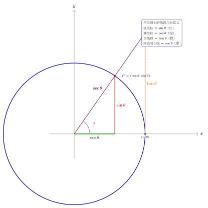

# 第2章：六个三角函数

> 六个三角函数不是六个孤立公式，而是单位圆坐标、投影与比值关系共同构成的一套系统。

## 学习目标

完成本章学习后，你将能够：

1. 用单位圆统一定义六个三角函数
2. 理解每个函数的定义域、值域与象限符号
3. 熟练利用已知一个函数值推出其余函数值
4. 识别商数关系与倒数关系的结构来源
5. 为后续恒等式与方程章节打下基础

---

## 正文内容

## 2.1 从单位圆点定义正弦与余弦

设单位圆上点

$$
P(x,y)=(\cos\theta,\sin\theta)
$$

这里的定义不是结论，而是起点：

- 横坐标定义余弦
- 纵坐标定义正弦

因为单位圆方程满足：

$$
x^2+y^2=1
$$

所以立刻得到：

$$
\cos^2\theta+\sin^2\theta=1
$$

这也是所有基本恒等式的根源。

## 2.2 正切、余切与倒数函数

由坐标定义进一步得到：

$$
\tan\theta=\frac{\sin\theta}{\cos\theta},\qquad \cot\theta=\frac{\cos\theta}{\sin\theta}
$$

当分母不为零时，它们分别对应：

- 纵横坐标之比
- 横纵坐标之比

再引入倒数函数：

$$
\sec\theta=\frac{1}{\cos\theta},\qquad \csc\theta=\frac{1}{\sin\theta}
$$

于是六个函数构成一套完整关系网。

这些函数其实都能在单位圆上读成**线段**。设终边交圆于 $P=(\cos\theta,\sin\theta)$：$P$ 的纵坐标就是 $\sin\theta$（竖直红段），横坐标就是 $\cos\theta$（水平绿段）；在过 $(1,0)$ 的竖直切线上，从 $(1,0)$ 到终边的那一段长度恰为 $\tan\theta$（橙段），而从原点沿终边到该交点的整段长度则为 $\sec\theta$（紫段）。

由此可见，正切与正割并非凭空定义，而是同一张图上"切线段"与"终边段"的长度；$\sec=\dfrac{1}{\cos}$ 也能从相似三角形（$\dfrac{\sec\theta}{1}=\dfrac{1}{\cos\theta}$）直接读出。

## 2.3 定义域与值域

| 函数 | 定义域 | 值域 |
|------|--------|------|
| $\sin\theta$ | $\mathbb R$ | $[-1,1]$ |
| $\cos\theta$ | $\mathbb R$ | $[-1,1]$ |
| $\tan\theta$ | $\theta\ne\frac\pi2+k\pi$ | $\mathbb R$ |
| $\cot\theta$ | $\theta\ne k\pi$ | $\mathbb R$ |
| $\sec\theta$ | $\theta\ne\frac\pi2+k\pi$ | $(-\infty,-1]\cup[1,\infty)$ |
| $\csc\theta$ | $\theta\ne k\pi$ | $(-\infty,-1]\cup[1,\infty)$ |

这张表比背值域更重要，因为它告诉你：

- 哪些地方函数无定义
- 哪些地方后续方程变形必须谨慎
- 哪些函数天然是无界的

## 2.4 象限符号的来源

若角 $\theta$ 的终边在不同象限，单位圆交点坐标符号不同：

| 象限 | $\sin\theta$ | $\cos\theta$ | $\tan\theta$ |
|------|---------------|---------------|---------------|
| I | + | + | + |
| II | + | - | - |
| III | - | - | + |
| IV | - | + | - |

这张表不是额外规定，而是由 $x,y$ 符号直接决定的。

### 深入例题：由一个函数值推出全部六个函数

若

$$
\sin\theta=\frac35
$$

且 $\theta$ 在第二象限，则：

由平方关系：

$$
\cos^2\theta=1-\sin^2\theta=1-\frac{9}{25}=\frac{16}{25}
$$

因为第二象限余弦为负，所以：

$$
\cos\theta=-\frac45
$$

进一步：

$$
\tan\theta=\frac{\sin\theta}{\cos\theta}=-\frac34
$$

$$
\csc\theta=\frac53,\\ \sec\theta=-\frac54,\\ \cot\theta=-\frac43
$$

**结论**：已知一个函数值时，真正难点不在开平方，而在于先判断象限符号。

## 2.5 特殊角表的几何来源

$30^\circ,45^\circ,60^\circ$ 并不是“要背的神秘数字”，而是两个几何原型的直接结果：

- 等边三角形
- 等腰直角三角形

例如，在边长为 2 的等边三角形中作高，得到：

- 斜边：2
- 短直角边：1
- 高：$\sqrt3$

所以：

$$
\sin30^\circ=\frac12,\qquad \cos30^\circ=\frac{\sqrt3}{2}
$$

如果忘记表格，完全可以从图形重新推出。

## 2.6 六个函数的结构地图

可以把六个函数理解成两层：

### 第一层：基础函数

- $\sin$
- $\cos$

### 第二层：由基础函数生成

- 商数：$\tan,\cot$
- 倒数：$\sec,\csc$

这张结构图非常重要，因为后续很多题并不需要记住 6 套独立公式，而是把问题尽量化回 $\sin$ 和 $\cos$。

---

## 本章小结

| 主题 | 结论 |
|------|------|
| 定义方式 | 六函数都来自单位圆坐标、比值与倒数关系 |
| 关键根基 | $\sin\theta,\cos\theta$ 是最基础的两个函数 |
| 最大风险 | 象限符号和定义域 |
| 解题策略 | 已知一个函数值时，先判象限再补全其余函数 |

---

## 分级例题精练

> 本节精选 6 道例题，分三档难度：**初中基础 ★** / **高中核心 ★★** / **高阶拓展 ★★★**。每题含【题目】【解】【点评】，建议先自行尝试再看解。

### 例题精练 1（★ 初中基础）

**题目**：在直角三角形中，锐角 $A$ 的对边为 $3$，邻边为 $4$。求 $\sin A$、$\cos A$、$\tan A$。

**解**：

先求斜边，由勾股定理：

$$
c=\sqrt{3^2+4^2}=\sqrt{9+16}=\sqrt{25}=5
$$

按定义“对边比斜边、邻边比斜边、对边比邻边”：

$$
\sin A=\frac{3}{5},\qquad \cos A=\frac{4}{5},\qquad \tan A=\frac{3}{4}
$$

**点评**：在锐角范围内，单位圆定义与“边之比”定义一致；记牢 $3$-$4$-$5$ 这组勾股数能快速算斜边。

### 例题精练 2（★ 初中基础）

**题目**：判断下列各三角函数值的正负号（不求具体值）：$\sin\dfrac{2\pi}{3}$、$\cos\dfrac{5\pi}{4}$、$\tan\dfrac{7\pi}{4}$。

**解**：

由象限符号表（符号由终边交点坐标 $x,y$ 决定）逐一判断：

- $\dfrac{2\pi}{3}$ 在第二象限，$y>0$，故 $\sin\dfrac{2\pi}{3}>0$。
- $\dfrac{5\pi}{4}$ 在第三象限，$x<0$，故 $\cos\dfrac{5\pi}{4}<0$。
- $\dfrac{7\pi}{4}$ 在第四象限，$\tan=\dfrac{y}{x}=\dfrac{-}{+}<0$，故 $\tan\dfrac{7\pi}{4}<0$。

**点评**：符号问题先定象限，再回到 $x,y$ 的正负，不必记“一全二正三切四余”口诀也能现推。

### 例题精练 3（★★ 高中核心）

**题目**：已知 $\cos\theta=-\dfrac{12}{13}$，且 $\theta$ 在第三象限，求其余五个三角函数值。

**解**：

由平方关系 $\sin^2\theta=1-\cos^2\theta$：

$$
\sin^2\theta=1-\frac{144}{169}=\frac{25}{169}
$$

第三象限正弦为负，故 $\sin\theta=-\dfrac{5}{13}$。

再由商数与倒数关系：

$$
\tan\theta=\frac{\sin\theta}{\cos\theta}=\frac{-5/13}{-12/13}=\frac{5}{12},\qquad
\cot\theta=\frac{12}{5}
$$

$$
\sec\theta=\frac{1}{\cos\theta}=-\frac{13}{12},\qquad
\csc\theta=\frac{1}{\sin\theta}=-\frac{13}{5}
$$

**点评**：难点不在开平方，而在用象限定符号；第三象限 $\sin,\cos$ 均负，故 $\tan,\cot$ 为正。

### 例题精练 4（★★ 高中核心）

**题目**：已知 $\tan\theta=2$，且 $\theta$ 在第三象限，求 $\sin\theta$ 与 $\cos\theta$。

**解**：

由 $\tan\theta=\dfrac{\sin\theta}{\cos\theta}=2$ 得 $\sin\theta=2\cos\theta$。代入平方关系：

$$
\sin^2\theta+\cos^2\theta=1\ \Longrightarrow\ (2\cos\theta)^2+\cos^2\theta=1
$$

$$
5\cos^2\theta=1\ \Longrightarrow\ \cos^2\theta=\frac15
$$

第三象限 $\cos\theta<0$，故 $\cos\theta=-\dfrac{1}{\sqrt5}=-\dfrac{\sqrt5}{5}$，于是：

$$
\sin\theta=2\cos\theta=-\frac{2}{\sqrt5}=-\frac{2\sqrt5}{5}
$$

**点评**：把问题化回 $\sin,\cos$ 是通用策略；已知 $\tan$ 求 $\sin,\cos$ 时，用 $\sin=\tan\cdot\cos$ 代入平方关系最稳妥。

### 例题精练 5（★★ 高中核心）

**题目**：已知 $\sin\theta=\dfrac{4}{5}$，化简 $\dfrac{\sec\theta-\cos\theta}{\tan\theta}$ 并求值（设 $\theta$ 为第一象限角）。

**解**：

先把整体化回 $\sin,\cos$。分子：

$$
\sec\theta-\cos\theta=\frac{1}{\cos\theta}-\cos\theta=\frac{1-\cos^2\theta}{\cos\theta}=\frac{\sin^2\theta}{\cos\theta}
$$

除以 $\tan\theta=\dfrac{\sin\theta}{\cos\theta}$：

$$
\frac{\sec\theta-\cos\theta}{\tan\theta}=\frac{\sin^2\theta}{\cos\theta}\cdot\frac{\cos\theta}{\sin\theta}=\sin\theta
$$

所以原式恒等于 $\sin\theta$，代入得：

$$
\frac{\sec\theta-\cos\theta}{\tan\theta}=\sin\theta=\frac45
$$

**点评**：先化简再代值远胜于直接代入；本题化简后竟与象限无关，结果就是 $\sin\theta$。

### 例题精练 6（★★★ 高阶拓展）

**题目**：设 $\theta$ 为第二象限角且 $\sin\theta=a$（$0<a<1$）。用 $a$ 表示 $\cos\theta$、$\tan\theta$、$\sec\theta$，并讨论 $a\to 1^-$ 时 $\tan\theta$ 的变化趋势。

**解**：

由平方关系 $\cos^2\theta=1-a^2$。第二象限 $\cos\theta<0$，故：

$$
\cos\theta=-\sqrt{1-a^2}
$$

进一步：

$$
\tan\theta=\frac{\sin\theta}{\cos\theta}=\frac{a}{-\sqrt{1-a^2}}=-\frac{a}{\sqrt{1-a^2}},\qquad
\sec\theta=\frac{1}{\cos\theta}=-\frac{1}{\sqrt{1-a^2}}
$$

当 $a\to 1^-$ 时，$\theta\to\dfrac{\pi}{2}^+$，分母 $\sqrt{1-a^2}\to 0^+$，分子 $a\to1$，故：

$$
\tan\theta=-\frac{a}{\sqrt{1-a^2}}\to -\infty
$$

这与 $\tan$ 在 $\theta=\dfrac{\pi}{2}$ 处无定义、左右极限分别趋于 $\pm\infty$ 的事实吻合：从第二象限一侧（$\theta$ 略大于 $\dfrac{\pi}{2}$）趋近时，$\tan\theta\to-\infty$。

**点评**：含字母时务必带着象限条件给 $\cos$ 定号；极限趋势可直接从“分母趋零、符号由象限决定”读出。

---

## 练习题

1. 为什么六个三角函数并不是六套彼此独立的定义？
2. 若 $\cos\theta=-\frac{12}{13}$ 且 $\theta$ 在第三象限，求其余五个三角函数值。
3. 为什么 $\sec\theta$ 和 $\csc\theta$ 的值域不可能落在 $(-1,1)$？
4. 说明象限符号表为什么本质上来自单位圆坐标符号。 
5. 如果忘了 $30^\circ,45^\circ,60^\circ$ 的值，你如何从几何图形重新推出？
