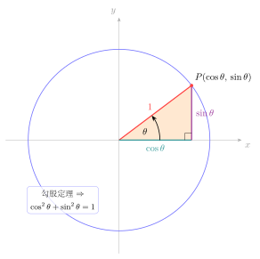

# 第4章：基本恒等式

> 基本恒等式不是要背的零散结论，而是由单位圆和六个三角函数定义自然推出来的“结构方程”。一旦你掌握它们的来源，很多复杂化简其实只是不断回到这些根公式。

## 学习目标

完成本章学习后，你将能够：

1. 理解平方关系、商数关系、倒数关系的来源
2. 熟练用基本恒等式在不同三角函数之间转换
3. 分辨“恒等式证明”和“方程求解”在逻辑上的不同
4. 用结构化方法证明常见恒等式
5. 为后续和差公式、方程和积分技巧打下基础

---

## 正文内容

## 4.1 为什么基本恒等式是三角函数的根

很多人学三角函数时会把恒等式看成一大堆需要记忆的公式，但真正重要的其实只有很少几条：

- 平方关系
- 商数关系
- 倒数关系

剩下大量结论——例如

$$
1+\tan^2x=\sec^2x
$$

或

$$
1+\cot^2x=\csc^2x
$$

都只是它们的变形。

所以本章真正要建立的能力是：

> 看到一个复杂三角式时，知道如何把它不断“化归”回最根本的关系。

---

## 4.2 平方关系的来源

设单位圆上点为

$$
P(\cos x,\sin x)
$$

因为单位圆满足方程

$$
x^2+y^2=1
$$

代入可得：

$$
\sin^2x+\cos^2x=1
$$

这条式子不是技巧，而是单位圆几何事实的函数化表达。



### 由平方关系得到什么

一旦已知其中一个量，就能求另一个量的绝对值：

$$
\cos^2x=1-\sin^2x
$$

$$
\sin^2x=1-\cos^2x
$$

但要注意：

- 开平方只能得到绝对值
- 真正符号必须由象限判断

### 例题：由平方关系补足函数值

若

$$
\sin x=\frac35
$$

且 $x$ 在第二象限，则

$$
\cos^2x=1-\frac{9}{25}=\frac{16}{25}
$$

第二象限余弦为负，因此：

$$
\cos x=-\frac45
$$

这个例子说明：平方关系给出的是结构，象限给出的是符号。

---

## 4.3 商数关系与倒数关系

由定义直接得到：

$$
\tan x=\frac{\sin x}{\cos x},\qquad \cot x=\frac{\cos x}{\sin x}
$$

只要记住“正切 = 纵坐标 / 横坐标”，就不容易和余切混淆。

倒数关系为：

$$
\sec x=\frac{1}{\cos x},\qquad \csc x=\frac{1}{\sin x},\qquad \cot x=\frac{1}{\tan x}
$$

这意味着六个函数其实不是六套独立对象，而是一个网络：

```text
sin <-> csc
cos <-> sec
sin/cos -> tan
cos/sin -> cot
```

### 定义域提醒

这些关系在代数上看起来简单，但做题时必须时刻问：

- 此处分母是否可能为 0？
- 当前变形是否默认函数有定义？

例如：

- $\tan x$ 要求 $\cos x\ne0$
- $\sec x$ 同样要求 $\cos x\ne0$
- $\csc x$ 要求 $\sin x\ne0$

---

## 4.4 导出恒等式

由平方关系除以 $\cos^2x$，得到：

$$
\frac{\sin^2x}{\cos^2x}+1=\frac{1}{\cos^2x}
$$

即：

$$
1+\tan^2x=\sec^2x
$$

同理，除以 $\sin^2x$ 得：

$$
1+\cot^2x=\csc^2x
$$

所以“平方关系 + 商数关系 + 倒数关系”几乎已经足够生成后续大半常用结论。

### 一个快速判断习惯

看到：

- $1+\tan^2x$，应立刻想到 $\sec^2x$
- $1+\cot^2x$，应立刻想到 $\csc^2x$
- $1-\sin^2x$，应立刻想到 $\cos^2x$

这就是把公式从“背诵”变成“模式识别”。

---

## 4.5 恒等式证明的策略

很多人证明恒等式时最大的错误是“两边同时乱变”。更稳的方法通常是：

1. 从更复杂的一边开始
2. 尽量统一成 $\sin$ 和 $\cos$
3. 寻找是否能出现 $\sin^2x+\cos^2x$
4. 注意定义域，不要非法约分

### 例题一：证明简单恒等式

证明：

$$
\frac{1-\sin^2x}{\cos x}=\cos x
$$

**解**：由平方关系

$$
1-\sin^2x=\cos^2x
$$

因此

$$
\frac{1-\sin^2x}{\cos x}=\frac{\cos^2x}{\cos x}=\cos x
$$

但这一步要求 $\cos x\ne0$。所以严格说应写为：在原式有定义的前提下，恒等式成立。

### 例题二：为什么“证明”和“解方程”不同

对恒等式证明，你要证明在定义域内对所有允许的 $x$ 成立。 
对方程求解，你只需要找出让式子成立的那些 $x$。

例如：

$$
\sin^2x+\cos^2x=1
$$

是恒等式；而

$$
\sin x=\cos x
$$

不是恒等式，而是方程，解是：

$$
x=\frac\pi4+k\pi
$$

这两个逻辑层次必须分清。

---

## 4.6 图像与结构分析

基本恒等式除了代数推导外，也能从图像和几何上理解：

- $\sin^2x+\cos^2x=1$：点始终在单位圆上
- $\tan x=\frac{\sin x}{\cos x}$：正切图像无界，因为分母会趋于 0
- $\sec x,\csc x$ 的值域不可能落在 $(-1,1)$，因为它们是有界函数的倒数

### 一个图像层面的结论

如果

$$
-1\le \cos x\le 1
$$

那么只要 $\cos x\ne0$，就有

$$
|\sec x|\ge 1
$$

这不是额外技巧，而是“有界函数倒数”的必然结果。

---

## 4.7 常见误区与检查清单

- 是否把恒等式和方程混为一谈？
- 是否在约分或除法中忽略了定义域？
- 是否只会机械记 $1+\tan^2x=\sec^2x$，却不知道它从哪里来？
- 是否看到复杂式子时不会先统一成 $\sin,\cos$？

---

## 本章小结

| 主题 | 结论 |
|------|------|
| 平方关系 | 来自单位圆方程，是所有恒等式的根 |
| 商数 / 倒数关系 | 把六个函数连成统一网络 |
| 导出恒等式 | 多数结论都可由基本关系相互推出 |
| 证明策略 | 统一形式、抓结构、守住定义域 |

---

## 分级例题精练

> 本节精选 6 道例题，分三档难度：**初中基础 ★** / **高中核心 ★★** / **高阶拓展 ★★★**。每题含【题目】【解】【点评】，建议先自行尝试再看解。

### 例题精练 1（★ 初中基础）

**题目**：已知 $\cos x=\dfrac{12}{13}$，且 $x$ 为锐角，求 $\sin x$ 与 $\tan x$。

**解**：由平方关系

$$
\sin^2x=1-\cos^2x=1-\frac{144}{169}=\frac{25}{169}
$$

因 $x$ 为锐角，正弦为正，故

$$
\sin x=\frac{5}{13}
$$

再由商数关系

$$
\tan x=\frac{\sin x}{\cos x}=\frac{5/13}{12/13}=\frac{5}{12}
$$

**点评**：这是平方关系最基本的用法：先求出平方值，再用象限（这里是锐角）定符号。注意开方一步只给绝对值，符号必须另行判断——这正是本章反复强调的“结构与符号分离”。

### 例题精练 2（★★ 高中核心）

**题目**：化简 $\dfrac{\sin x}{1+\cos x}+\dfrac{1+\cos x}{\sin x}$（在原式有定义时）。

**解**：通分，把两项写成同一分母 $\sin x(1+\cos x)$：

$$
\frac{\sin^2x+(1+\cos x)^2}{\sin x(1+\cos x)}
$$

展开分子：

$$
\sin^2x+1+2\cos x+\cos^2x=(\sin^2x+\cos^2x)+1+2\cos x=2+2\cos x
$$

这里用到了平方关系把 $\sin^2x+\cos^2x$ 合并为 $1$。于是

$$
\frac{2+2\cos x}{\sin x(1+\cos x)}=\frac{2(1+\cos x)}{\sin x(1+\cos x)}=\frac{2}{\sin x}=2\csc x
$$

**点评**：见到复杂分式，先统一成 $\sin,\cos$ 并通分，再抓 $\sin^2x+\cos^2x$ 这个“根结构”。约去 $1+\cos x$ 时要求 $1+\cos x\ne0$，这正是“在原式有定义时”一句的来历。

### 例题精练 3（★★ 高中核心）

**题目**：证明 $\dfrac{1+\sin x}{\cos x}=\dfrac{\cos x}{1-\sin x}$（在原式有定义时）。

**解**：采用“交叉相乘等价于证明分子分母对应乘积相等”的思路。证两边相等，等价于证

$$
(1+\sin x)(1-\sin x)=\cos x\cdot\cos x
$$

左边是平方差：

$$
(1+\sin x)(1-\sin x)=1-\sin^2x
$$

由平方关系 $1-\sin^2x=\cos^2x$，恰好等于右边 $\cos^2x$。故在 $\cos x\ne0$ 且 $1-\sin x\ne0$ 的前提下，原等式成立。

**点评**：本题示范了恒等式证明的一个稳妥手法——把分式等式化为“分子分母交叉乘积相等”，再回到平方关系。证完务必声明定义域，因为交叉相乘默认了分母非零。

### 例题精练 4（★★ 高中核心）

**题目**：证明 $\dfrac{\tan x+\cot x}{\sec x\,\csc x}=1$（在原式有定义时）。

**解**：从较复杂的左边出发，全部统一成 $\sin,\cos$。先看分子：

$$
\tan x+\cot x=\frac{\sin x}{\cos x}+\frac{\cos x}{\sin x}=\frac{\sin^2x+\cos^2x}{\sin x\cos x}=\frac{1}{\sin x\cos x}
$$

再看分母：

$$
\sec x\,\csc x=\frac{1}{\cos x}\cdot\frac{1}{\sin x}=\frac{1}{\sin x\cos x}
$$

二者相等，故左边除以分母得

$$
\frac{1/(\sin x\cos x)}{1/(\sin x\cos x)}=1
$$

**点评**：倒数关系与商数关系联手，把六个函数全部拉回到 $\sin,\cos$ 网络里。分子通分后再次出现 $\sin^2x+\cos^2x=1$，这是本章“模式识别”的典型一幕。

### 例题精练 5（★★ 高中核心）

**题目**：已知 $\tan x=2$，求 $\dfrac{\sin x+\cos x}{2\sin x-\cos x}$ 的值。

**解**：由于分子分母都是关于 $\sin x,\cos x$ 的一次齐次式，可同时除以 $\cos x$（在 $\cos x\ne0$ 时合法，而 $\tan x=2$ 已保证 $\cos x\ne0$）：

$$
\frac{\sin x+\cos x}{2\sin x-\cos x}=\frac{\dfrac{\sin x}{\cos x}+1}{2\cdot\dfrac{\sin x}{\cos x}-1}=\frac{\tan x+1}{2\tan x-1}
$$

代入 $\tan x=2$：

$$
=\frac{2+1}{2\cdot2-1}=\frac{3}{3}=1
$$

**点评**：齐次式求值的关键技巧——分子分母同除以 $\cos x$，把整个式子化成只含 $\tan x$ 的有理式。这避免了去求 $\sin x,\cos x$ 各自的具体值，也省去了讨论象限符号的麻烦。

### 例题精练 6（★★★ 高阶拓展）

**题目**：证明 $\sin^6x+\cos^6x=1-3\sin^2x\cos^2x$。

**解**：把 $\sin^6x+\cos^6x$ 看成两数立方和，记 $a=\sin^2x,\ b=\cos^2x$，则要证的是 $a^3+b^3$。用立方和分解：

$$
a^3+b^3=(a+b)(a^2-ab+b^2)
$$

由平方关系 $a+b=\sin^2x+\cos^2x=1$，故

$$
a^3+b^3=a^2-ab+b^2
$$

再把 $a^2+b^2$ 用 $(a+b)^2$ 凑出来：

$$
a^2+b^2=(a+b)^2-2ab=1-2ab
$$

代入得

$$
a^3+b^3=(1-2ab)-ab=1-3ab=1-3\sin^2x\cos^2x
$$

即 $\sin^6x+\cos^6x=1-3\sin^2x\cos^2x$。

**点评**：本题把代数恒等式（立方和、完全平方）与三角平方关系结合：凡是出现 $\sin^2x+\cos^2x$ 都立刻视为 $1$，问题就从“三角”退化为“纯代数因式分解”。同样的套路可证 $\sin^4x+\cos^4x=1-2\sin^2x\cos^2x$，是降次化简的常用结论。

---

## 练习题

1. 为什么说 $\sin^2x+\cos^2x=1$ 是所有三角恒等式的“根”？
2. 由平方关系推出 $1+\tan^2x=\sec^2x$。
3. 为什么恒等式证明时必须说明定义域？
4. 构造一个错误证明，展示“非法约分”为什么危险。
5. 证明：$\frac{1-\cos^2x}{\sin x}=\sin x$（在原式有定义时）。
