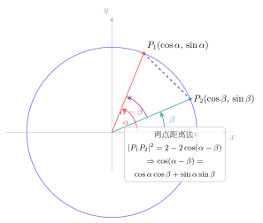

# 第5章：和差、倍角与半角公式

> 和差公式是三角变换的发动机。很多看上去不同的三角公式——倍角、半角、降幂、万能代换——本质上都可以从它演化出来。

## 学习目标

完成本章学习后，你将能够：

1. 理解和差公式的结构来源
2. 用和差公式推导倍角、半角和降幂公式
3. 掌握特殊角精确值的常见求法
4. 理解半角公式中的符号问题
5. 为积分、复数和傅里叶章节建立公式桥梁

---

## 正文内容

## 5.1 为什么和差公式最重要

三角变换里最核心的不是倍角公式，而是和差公式，因为：

- 它直接描述“两个旋转叠加”的结果
- 倍角公式只是让两个角取相同值得到的特例
- 半角公式则是对倍角再反向整理

所以可以把本章看成：

```text
和差公式 -> 倍角公式 -> 半角 / 降幂 -> 万能代换
```

---

## 5.2 和差公式的推导与结构

### 从旋转推导余弦和角公式

考虑单位圆上两个点：$P = (\cos\alpha, \sin\alpha)$ 和 $Q = (\cos\beta, \sin\beta)$。

$P$ 与 $Q$ 之间的距离可以用两种方式计算：

**方法一**（坐标距离公式）：

$$|PQ|^2 = (\cos\alpha-\cos\beta)^2+(\sin\alpha-\sin\beta)^2 = 2-2(\cos\alpha\cos\beta+\sin\alpha\sin\beta)$$

**方法二**（$P$ 和 $Q$ 之间的角度差为 $\alpha-\beta$，取 $Q'=(1,0)$，$P'=(\cos(\alpha-\beta),\sin(\alpha-\beta))$，距离相等）：

$$|P'Q'|^2 = (\cos(\alpha-\beta)-1)^2+\sin^2(\alpha-\beta) = 2-2\cos(\alpha-\beta)$$

令两式相等，得到：

$$\boxed{\cos(\alpha-\beta) = \cos\alpha\cos\beta + \sin\alpha\sin\beta}$$



用 $-\beta$ 替换 $\beta$（利用 $\cos(-\beta)=\cos\beta$，$\sin(-\beta)=-\sin\beta$）得到和角公式。正弦的和差公式由 $\sin\theta = \cos(\pi/2-\theta)$ 推出。

### 公式汇总

正弦和差：

$$
\sin(\alpha\pm\beta)=\sin\alpha\cos\beta\pm\cos\alpha\sin\beta
$$

余弦和差：

$$
\cos(\alpha\pm\beta)=\cos\alpha\cos\beta\mp\sin\alpha\sin\beta
$$

正切和差：

$$
\tan(\alpha\pm\beta)=\frac{\tan\alpha\pm\tan\beta}{1\mp\tan\alpha\tan\beta}
$$

### 如何记号不混乱

- 正弦公式的符号“同上”
- 余弦公式的符号“相反”

也就是说：

- $\sin(\alpha+\beta)$ 对应加
- $\cos(\alpha+\beta)$ 对应减

这是最常见的记号陷阱之一。

---

## 5.3 倍角公式从哪里来

令 $\alpha=\beta=x$，代入和差公式：

### 正弦倍角

$$
\sin 2x=2\sin x\cos x
$$

### 余弦倍角

$$
\cos 2x=\cos^2x-\sin^2x
$$

再结合平方关系可得三种常见形式：

$$
\cos 2x=1-2\sin^2x
$$

$$
\cos 2x=2\cos^2x-1
$$

### 正切倍角

$$
\tan 2x=\frac{2\tan x}{1-\tan^2x}
$$

这说明倍角公式本质不是额外要背的表，而是和差公式的特例。

### 三倍角公式

用倍角+和角公式推导，设 $3x = 2x + x$：

$$\sin 3x = \sin(2x+x) = \sin 2x\cos x + \cos 2x\sin x$$
$$= 2\sin x\cos^2 x + (1-2\sin^2 x)\sin x = \sin x(2\cos^2 x+1-2\sin^2 x)$$
$$= \sin x(2(1-\sin^2 x)+1-2\sin^2 x) = \sin x(3-4\sin^2 x)$$

$$\boxed{\sin 3x = 3\sin x - 4\sin^3 x}$$

类似地：

$$\boxed{\cos 3x = 4\cos^3 x - 3\cos x}$$

**记忆**：正弦三倍角"3减4立方"，余弦三倍角"4立方减3"。

三倍角公式在解三次三角方程和竞赛中常用。

---

## 5.4 半角与降幂公式

从余弦倍角公式反向整理：

$$
\cos 2x=1-2\sin^2x
$$

可得：

$$
\sin^2x=\frac{1-\cos 2x}{2}
$$

令 $x\mapsto \frac{x}{2}$，得到半角形式：

$$
\sin^2\frac{x}{2}=\frac{1-\cos x}{2}
$$

同理：

$$
\cos^2\frac{x}{2}=\frac{1+\cos x}{2}
$$

### 为什么半角公式容易出错

因为如果你写成：

$$
\sin\frac{x}{2}=\pm\sqrt{\frac{1-\cos x}{2}}
$$

那么符号取决于 $\frac{x}{2}$ 所在象限。 
很多人只记根号内部，不判断正负，这是高频错误。

---

## 5.5 特殊角精确值：为什么拆角法有效

很多不在特殊角表里的角，可以拆成两个特殊角之和或差。

### 例题一：求 $\cos 75^\circ$

因为

$$
75^\circ=45^\circ+30^\circ
$$

所以：

$$
\cos75^\circ=\cos(45^\circ+30^\circ)
$$

$$
=\cos45^\circ\cos30^\circ-\sin45^\circ\sin30^\circ
$$

$$
=\frac{\sqrt2}{2}\cdot\frac{\sqrt3}{2}-\frac{\sqrt2}{2}\cdot\frac12
=\frac{\sqrt6-\sqrt2}{4}
$$

### 例题二：求 $\sin 15^\circ$

因为

$$
15^\circ=45^\circ-30^\circ
$$

故：

$$
\sin15^\circ=\sin45^\circ\cos30^\circ-\cos45^\circ\sin30^\circ
$$

$$
=\frac{\sqrt2}{2}\cdot\frac{\sqrt3}{2}-\frac{\sqrt2}{2}\cdot\frac12
=\frac{\sqrt6-\sqrt2}{4}
$$

这里也顺便说明了：

$$
\sin15^\circ=\cos75^\circ
$$

这和余函数关系是一致的。

---

## 5.6 万能代换的直觉

设

$$
t=\tan\frac{x}{2}
$$

则可推出：

$$
\sin x=\frac{2t}{1+t^2},\qquad \cos x=\frac{1-t^2}{1+t^2}
$$

这意味着很多同时含 $\sin x$ 与 $\cos x$ 的式子，最终都能化成关于 $t$ 的有理式。

这是为什么它被称为“万能代换”——它并不是万能地解决所有问题，而是提供了统一有理化入口。

---

## 5.7 常见误区与检查清单

- 是否把正弦和差与余弦和差的符号记反？
- 是否把倍角公式当独立结论，而忘记它来自和差公式？
- 是否在半角公式里漏掉正负号？
- 是否看到非特殊角后只会硬算，不会拆角？

---

## 本章小结

| 主题 | 结论 |
|------|------|
| 和差公式 | 是三角变换的总发动机 |
| 倍角公式 | 和差公式的特例 |
| 半角公式 | 倍角公式的反向整理 |
| 特殊角求值 | 拆角法通常是最稳路径 |

---

## 分级例题精练

> 本节精选 6 道例题，分三档难度：**初中基础 ★** / **高中核心 ★★** / **高阶拓展 ★★★**。每题含【题目】【解】【点评】，建议先自行尝试再看解。

### 例题精练 1（★ 初中基础）

**题目**：已知 $\sin x=\dfrac{3}{5}$，且 $x$ 为锐角，求 $\sin 2x$ 与 $\cos 2x$。

**解**：先由平方关系补出 $\cos x$。因 $x$ 为锐角，余弦为正：

$$
\cos x=\sqrt{1-\sin^2x}=\sqrt{1-\frac{9}{25}}=\frac{4}{5}
$$

代入倍角公式：

$$
\sin 2x=2\sin x\cos x=2\cdot\frac{3}{5}\cdot\frac{4}{5}=\frac{24}{25}
$$

$$
\cos 2x=1-2\sin^2x=1-2\cdot\frac{9}{25}=\frac{7}{25}
$$

**点评**：倍角求值的标准两步——先用平方关系把缺的那个函数值补齐（并由象限定符号），再代入倍角公式。$\cos 2x$ 有三种形式，这里选 $1-2\sin^2x$ 是因为题目直接给了 $\sin x$，最省事。

### 例题精练 2（★★ 高中核心）

**题目**：不查表，求 $\tan 105^\circ$ 的精确值。

**解**：把 $105^\circ$ 拆成 $60^\circ+45^\circ$，用正切和角公式：

$$
\tan 105^\circ=\tan(60^\circ+45^\circ)=\frac{\tan 60^\circ+\tan 45^\circ}{1-\tan 60^\circ\tan 45^\circ}=\frac{\sqrt3+1}{1-\sqrt3\cdot1}
$$

即

$$
\tan 105^\circ=\frac{\sqrt3+1}{1-\sqrt3}
$$

分母有理化，分子分母同乘 $1+\sqrt3$：

$$
=\frac{(\sqrt3+1)(1+\sqrt3)}{(1-\sqrt3)(1+\sqrt3)}=\frac{\sqrt3+3+1+\sqrt3}{1-3}=\frac{4+2\sqrt3}{-2}=-(2+\sqrt3)
$$

故 $\tan 105^\circ=-2-\sqrt3$。

**点评**：拆角法对正切同样有效。结果为负与 $105^\circ$ 在第二象限（正切为负）一致，是一个天然的自检。有理化分母后务必验证符号，避免漏掉负号。

### 例题精练 3（★★ 高中核心）

**题目**：化简 $\sqrt3\sin x+\cos x$ 为单一正弦 $R\sin(x+\varphi)$ 的形式。

**解**：设 $\sqrt3\sin x+\cos x=R\sin(x+\varphi)=R\sin x\cos\varphi+R\cos x\sin\varphi$。对照系数：

$$
R\cos\varphi=\sqrt3,\qquad R\sin\varphi=1
$$

两式平方相加，用平方关系消去 $\varphi$：

$$
R^2(\cos^2\varphi+\sin^2\varphi)=(\sqrt3)^2+1^2=4\ \Rightarrow\ R=2
$$

再由两式相除得

$$
\tan\varphi=\frac{R\sin\varphi}{R\cos\varphi}=\frac{1}{\sqrt3}\ \Rightarrow\ \varphi=\frac{\pi}{6}
$$

（因 $\cos\varphi,\sin\varphi$ 均为正，$\varphi$ 在第一象限。）故

$$
\sqrt3\sin x+\cos x=2\sin\left(x+\frac{\pi}{6}\right)
$$

**点评**：这是 $a\sin x+b\cos x$ 合一的标准前置变形，本质是和角公式的逆用：$R=\sqrt{a^2+b^2}$，$\varphi$ 由 $\cos\varphi=a/R,\ \sin\varphi=b/R$ 同时确定。务必用两个方程联立定 $\varphi$ 的象限，单靠 $\tan\varphi$ 会丢象限信息。

### 例题精练 4（★★ 高中核心）

**题目**：已知 $\cos x=-\dfrac{3}{5}$，且 $x\in\left(\dfrac{\pi}{2},\pi\right)$，求 $\sin\dfrac{x}{2}$ 与 $\cos\dfrac{x}{2}$。

**解**：由半角公式

$$
\sin^2\frac{x}{2}=\frac{1-\cos x}{2}=\frac{1-(-3/5)}{2}=\frac{8/5}{2}=\frac{4}{5}
$$

$$
\cos^2\frac{x}{2}=\frac{1+\cos x}{2}=\frac{1+(-3/5)}{2}=\frac{2/5}{2}=\frac{1}{5}
$$

定符号：由 $x\in\left(\dfrac{\pi}{2},\pi\right)$ 得 $\dfrac{x}{2}\in\left(\dfrac{\pi}{4},\dfrac{\pi}{2}\right)$，落在第一象限，故 $\sin\dfrac{x}{2},\cos\dfrac{x}{2}$ 均为正：

$$
\sin\frac{x}{2}=\frac{2}{\sqrt5}=\frac{2\sqrt5}{5},\qquad \cos\frac{x}{2}=\frac{1}{\sqrt5}=\frac{\sqrt5}{5}
$$

**点评**：半角公式最大的陷阱是开方的正负号。务必先由 $x$ 的范围推出 $\dfrac{x}{2}$ 的范围，再据其象限定号——本题 $x$ 在第二象限，但 $\dfrac{x}{2}$ 却在第一象限，二者所在象限并不相同，正是高频出错点。

### 例题精练 5（★★ 高中核心）

**题目**：用万能代换求 $\dfrac{\sin x}{1+\cos x}$ 的最简形式（用 $t=\tan\dfrac{x}{2}$ 表示）。

**解**：代入万能代换 $\sin x=\dfrac{2t}{1+t^2}$，$\cos x=\dfrac{1-t^2}{1+t^2}$：

$$
\frac{\sin x}{1+\cos x}=\frac{\dfrac{2t}{1+t^2}}{1+\dfrac{1-t^2}{1+t^2}}
$$

分母通分：$1+\dfrac{1-t^2}{1+t^2}=\dfrac{(1+t^2)+(1-t^2)}{1+t^2}=\dfrac{2}{1+t^2}$。于是

$$
\frac{\sin x}{1+\cos x}=\frac{\dfrac{2t}{1+t^2}}{\dfrac{2}{1+t^2}}=\frac{2t}{2}=t=\tan\frac{x}{2}
$$

**点评**：万能代换把同时含 $\sin x,\cos x$ 的式子统一成关于 $t$ 的有理式，约分后得到了一个漂亮的半角恒等式 $\dfrac{\sin x}{1+\cos x}=\tan\dfrac{x}{2}$。这正是“统一有理化入口”的威力。

### 例题精练 6（★★★ 高阶拓展）

**题目**：已知 $\sin x+\cos x=\dfrac{1}{5}$，且 $x\in(0,\pi)$，求 $\sin 2x$、$\sin x-\cos x$ 与 $\tan x$。

**解**：将已知式两边平方，左边出现倍角结构：

$$
(\sin x+\cos x)^2=\sin^2x+\cos^2x+2\sin x\cos x=1+\sin 2x
$$

故 $1+\sin 2x=\dfrac{1}{25}$，得

$$
\sin 2x=\frac{1}{25}-1=-\frac{24}{25}
$$

由 $\sin 2x<0$ 且 $x\in(0,\pi)$，知 $2x\in(\pi,2\pi)$，即 $x\in\left(\dfrac{\pi}{2},\pi\right)$，此时 $\sin x>0,\cos x<0$，故 $\sin x-\cos x>0$。再用平方：

$$
(\sin x-\cos x)^2=1-\sin 2x=1-\left(-\frac{24}{25}\right)=\frac{49}{25}
$$

取正根：$\sin x-\cos x=\dfrac{7}{5}$。与已知联立：

$$
\sin x=\frac{1}{2}\left(\frac{1}{5}+\frac{7}{5}\right)=\frac{4}{5},\qquad \cos x=\frac{1}{2}\left(\frac{1}{5}-\frac{7}{5}\right)=-\frac{3}{5}
$$

故

$$
\tan x=\frac{\sin x}{\cos x}=\frac{4/5}{-3/5}=-\frac{4}{3}
$$

**点评**：“和已知、平方求积”是处理 $\sin x\pm\cos x$ 一类问题的核心套路——平方后 $\sin^2x+\cos^2x=1$ 与 $2\sin x\cos x=\sin 2x$ 同时现身。求 $\sin x-\cos x$ 时取正根的依据来自象限分析，绝不能随手取正，这是本题最考验功力的一步。

---

## 练习题

1. 为什么倍角公式可以看成和差公式的特殊情形？
2. 推出三种形式的 $\cos 2x$。
3. 为什么半角公式取平方根时必须小心符号？
4. 利用和角公式求 $\sin 15^\circ$ 或 $\cos 75^\circ$。
5. 万能代换为什么在解析方法里很重要？
