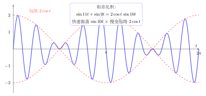

# 第6章：积化和差与和差化积

> 积化和差把“乘积结构”变成“频率叠加”，和差化积把“叠加结构”变成“包络 × 波形”。它们既是考试化简工具，也是信号和波动分析中的核心语言。

## 学习目标

完成本章学习后，你将能够：

1. 掌握积化和差与和差化积的四组核心公式
2. 理解这些公式如何由和差公式推出
3. 用它们做三角化简、求值和拍频分析
4. 区分哪些题更适合积化，哪些更适合和差化积
5. 为傅里叶和信号章节打下结构基础

---

## 正文内容

## 6.1 为什么要把乘积和和差互相转换

很多三角表达式之所以难算，不是因为函数本身难，而是写法不适合当前问题。 
例如：

- 求和时，乘积常常不方便
- 分析拍频时，和差形式更有意义
- 研究频率分量时，和差和乘积代表的结构完全不同

因此：

> 积化和差和和差化积，实质上是在不同“表示系统”之间切换。

---

## 6.2 积化和差公式

四组常见公式为：

$$
\sin A\cos B=\frac12[\sin(A+B)+\sin(A-B)]
$$

$$
\cos A\sin B=\frac12[\sin(A+B)-\sin(A-B)]
$$

$$
\cos A\cos B=\frac12[\cos(A+B)+\cos(A-B)]
$$

$$
\sin A\sin B=-\frac12[\cos(A+B)-\cos(A-B)]
$$

这些公式告诉我们：

- 两个频率相乘，会变成频率和与频率差的组合
- 这在波动和信号里非常有解释力

### 来源直觉

它们并不是凭空记忆，而是由和差公式加减组合得到。 
例如，把

$$
\sin(A+B)=\sin A\cos B+\cos A\sin B
$$

和

$$
\sin(A-B)=\sin A\cos B-\cos A\sin B
$$

相加，就得到：

$$
\sin A\cos B=\frac12[\sin(A+B)+\sin(A-B)]
$$

---

## 6.3 和差化积公式

常见公式为：

$$
\sin A+\sin B=2\sin\frac{A+B}{2}\cos\frac{A-B}{2}
$$

$$
\sin A-\sin B=2\cos\frac{A+B}{2}\sin\frac{A-B}{2}
$$

$$
\cos A+\cos B=2\cos\frac{A+B}{2}\cos\frac{A-B}{2}
$$

$$
\cos A-\cos B=-2\sin\frac{A+B}{2}\sin\frac{A-B}{2}
$$

这组公式的价值在于：

- 把叠加项拆成“平均频率 × 频率差”
- 特别适合解释拍频和调制

---

## 6.4 例题一：化简求值

化简：

$$
\sin5x+\sin3x
$$

使用和差化积：

$$
\sin A+\sin B=2\sin\frac{A+B}{2}\cos\frac{A-B}{2}
$$

代入 $A=5x, B=3x$：

$$
\sin5x+\sin3x=2\sin4x\cos x
$$

这一步的意义不只是化简，而是告诉你：

- 原来是两个不同频率分量
- 现在被写成“中心频率 + 包络”的形式

---

## 6.5 例题二：拍频分析

考虑：

$$
\sin101t+\sin99t
$$

用和差化积：

$$
\sin101t+\sin99t=2\sin100t\cos t
$$

这表明：

- 快速振荡部分是 $\sin100t$
- 慢速包络是 $2\cos t$

这就是拍频的结构来源。 
因此积化和差与和差化积不是单纯“考试公式”，而是频率分析语言。



---

## 6.6 什么时候该用哪一类公式

### 更适合积化和差的场景

- 表达式是乘积
- 目标是积分、求和、分析频率分量

### 更适合和差化积的场景

- 表达式是和/差
- 目标是化简、提取包络、求最值或看拍频

一个简单判断：

```text
看到乘积 -> 先想积化和差
看到和差 -> 先想和差化积
```

---

## 6.7 常见误区与检查清单

- 是否把公式中的正负号记错？
- 是否混淆了“平均频率”和“频率差”角色？
- 是否只会套公式，不理解其频率意义？
- 是否把拍频误解成“两个波谁更快谁主导”？

---

## 本章小结

| 主题 | 结论 |
|------|------|
| 积化和差 | 把乘积变成频率和与差 |
| 和差化积 | 把叠加变成包络 × 波形 |
| 结构意义 | 三角式不仅能算，还能解释频率关系 |
| 应用方向 | 化简、积分、拍频、傅里叶分析 |

---

## 分级例题精练

> 本节精选 6 道例题，分三档难度：**初中基础 ★** / **高中核心 ★★** / **高阶拓展 ★★★**。每题含【题目】【解】【点评】，建议先自行尝试再看解。

### 例题精练 1（★ 初中基础）

**题目**：用和差化积公式，把 $\cos 50^\circ+\cos 10^\circ$ 写成乘积形式。

**解**：套用余弦和的和差化积公式

$$
\cos A+\cos B=2\cos\frac{A+B}{2}\cos\frac{A-B}{2}
$$

取 $A=50^\circ,\ B=10^\circ$，则 $\dfrac{A+B}{2}=30^\circ$，$\dfrac{A-B}{2}=20^\circ$，故

$$
\cos 50^\circ+\cos 10^\circ=2\cos 30^\circ\cos 20^\circ=2\cdot\frac{\sqrt3}{2}\cdot\cos 20^\circ=\sqrt3\cos 20^\circ
$$

**点评**：和差化积把两项之和压成“两余弦之积”。本题中 $\dfrac{A+B}{2}=30^\circ$ 恰是特殊角，于是能算出系数 $\sqrt3$，剩下 $\cos 20^\circ$ 无法再化简，保留即可。识别“半和”是否为特殊角，是这类题能否进一步求值的关键。

### 例题精练 2（★★ 高中核心）

**题目**：用积化和差公式求 $\cos 75^\circ\cos 15^\circ$ 的精确值。

**解**：套用

$$
\cos A\cos B=\frac12[\cos(A+B)+\cos(A-B)]
$$

取 $A=75^\circ,\ B=15^\circ$：

$$
\cos 75^\circ\cos 15^\circ=\frac12[\cos 90^\circ+\cos 60^\circ]=\frac12\left[0+\frac12\right]=\frac14
$$

**点评**：把乘积拆成“和频 + 差频”后，$\cos 90^\circ=0$ 直接清掉一项，差频 $\cos 60^\circ$ 又是特殊角，于是精确值一步到位。比起分别求 $\cos 75^\circ,\cos 15^\circ$ 再相乘，积化和差要干净得多。

### 例题精练 3（★★ 高中核心）

**题目**：化简 $\dfrac{\sin 5x+\sin x}{\cos 5x+\cos x}$。

**解**：分子分母分别用和差化积。分子：

$$
\sin 5x+\sin x=2\sin\frac{5x+x}{2}\cos\frac{5x-x}{2}=2\sin 3x\cos 2x
$$

分母：

$$
\cos 5x+\cos x=2\cos\frac{5x+x}{2}\cos\frac{5x-x}{2}=2\cos 3x\cos 2x
$$

相除，约去公因子 $2\cos 2x$（在 $\cos 2x\ne0$ 时）：

$$
\frac{\sin 5x+\sin x}{\cos 5x+\cos x}=\frac{2\sin 3x\cos 2x}{2\cos 3x\cos 2x}=\frac{\sin 3x}{\cos 3x}=\tan 3x
$$

**点评**：和差化积让分子分母都析出公共因子 $\cos 2x$，约掉后剩下的 $\dfrac{\sin 3x}{\cos 3x}$ 正是“半和角”的正切。凡是“同名函数之和 / 之和”或“之和 / 同名之和”的比值，都值得先试和差化积。

### 例题精练 4（★★ 高中核心）

**题目**：证明 $\sin x+\sin 3x+\sin 5x=\sin 3x\,(1+2\cos 2x)$。

**解**：把首末两项 $\sin x+\sin 5x$ 先用和差化积配对（它们关于 $\sin 3x$ 对称）：

$$
\sin x+\sin 5x=2\sin\frac{x+5x}{2}\cos\frac{5x-x}{2}=2\sin 3x\cos 2x
$$

于是左边

$$
\sin x+\sin 3x+\sin 5x=2\sin 3x\cos 2x+\sin 3x=\sin 3x(2\cos 2x+1)
$$

即得右边，证毕。

**点评**：处理等差排列的多项正弦和（这里频率成等差 $1,3,5$），把对称的两端配对是通用技巧——配对后必然出现以中间项为半和角的因子 $\sin 3x$，从而能提取公因式。这正是和差化积在“求和 / 证明”中的巧用。

### 例题精练 5（★★ 高中核心）

**题目**：求和 $\cos\dfrac{\pi}{7}+\cos\dfrac{3\pi}{7}+\cos\dfrac{5\pi}{7}$ 的值。

**解**：用“乘以 $2\sin\dfrac{\pi}{7}$ 制造望远镜（裂项相消）”的手法。记 $S=\cos\dfrac{\pi}{7}+\cos\dfrac{3\pi}{7}+\cos\dfrac{5\pi}{7}$，两边乘 $2\sin\dfrac{\pi}{7}$，对每项用积化和差 $2\sin\theta\cos\phi=\sin(\theta+\phi)-\sin(\phi-\theta)$（即 $2\cos\phi\sin\theta=\sin(\phi+\theta)-\sin(\phi-\theta)$）：

$$
2\sin\frac{\pi}{7}\cos\frac{\pi}{7}=\sin\frac{2\pi}{7}-\sin 0=\sin\frac{2\pi}{7}
$$

$$
2\sin\frac{\pi}{7}\cos\frac{3\pi}{7}=\sin\frac{4\pi}{7}-\sin\frac{2\pi}{7}
$$

$$
2\sin\frac{\pi}{7}\cos\frac{5\pi}{7}=\sin\frac{6\pi}{7}-\sin\frac{4\pi}{7}
$$

三式相加，中间项两两相消（望远镜求和）：

$$
2\sin\frac{\pi}{7}\cdot S=\sin\frac{6\pi}{7}
$$

而 $\sin\dfrac{6\pi}{7}=\sin\left(\pi-\dfrac{\pi}{7}\right)=\sin\dfrac{\pi}{7}$，故

$$
2\sin\frac{\pi}{7}\cdot S=\sin\frac{\pi}{7}\ \Rightarrow\ S=\frac12
$$

**点评**：积化和差的另一类高阶用途是“制造裂项相消”。乘一个公共的 $2\sin\dfrac{\pi}{7}$ 后，每个乘积都被拆成相邻两项之差，中间整齐对消，只剩首尾——这是处理等差角余弦（或正弦）求和的经典套路。

### 例题精练 6（★★★ 高阶拓展）

**题目**：化简乘积 $\cos 20^\circ\cos 40^\circ\cos 80^\circ$。

**解**：注意三个角 $20^\circ,40^\circ,80^\circ$ 成倍增（每次乘 $2$），适合“乘以 $2\sin$ 再反复用倍角”的手法。但这里改用积化和差逐层展开，先处理后两个因子：

$$
\cos 40^\circ\cos 80^\circ=\frac12[\cos 120^\circ+\cos 40^\circ]=\frac12\left[-\frac12+\cos 40^\circ\right]=-\frac14+\frac12\cos 40^\circ
$$

于是

$$
\cos 20^\circ\cos 40^\circ\cos 80^\circ=\cos 20^\circ\left(-\frac14+\frac12\cos 40^\circ\right)=-\frac14\cos 20^\circ+\frac12\cos 20^\circ\cos 40^\circ
$$

对后一项再用积化和差：

$$
\cos 20^\circ\cos 40^\circ=\frac12[\cos 60^\circ+\cos 20^\circ]=\frac12\left[\frac12+\cos 20^\circ\right]=\frac14+\frac12\cos 20^\circ
$$

代回：

$$
=-\frac14\cos 20^\circ+\frac12\left(\frac14+\frac12\cos 20^\circ\right)=-\frac14\cos 20^\circ+\frac18+\frac14\cos 20^\circ=\frac18
$$

故 $\cos 20^\circ\cos 40^\circ\cos 80^\circ=\dfrac18$。

**点评**：连乘积可以靠积化和差“逐层降级”：每用一次就把一个乘积变成和差，含 $\cos 20^\circ$ 的项最终神奇地两两抵消，只留常数 $\dfrac18$。这与用 $2\sin 20^\circ$ 配合倍角公式得到的 $\dfrac{\sin 160^\circ}{8\sin 20^\circ}=\dfrac18$ 完全一致，可互为验算。

---

## 练习题

1. 为什么积化和差和和差化积是“表示切换”而不只是技巧？
2. 用积化和差化简 $\cos4x\cos2x$。
3. 用和差化积解释拍频现象。 
4. 为什么 $\cos A-\cos B$ 这组公式最容易记错符号？
5. 设计一道题，要求同时用到和差公式与积化和差公式。
