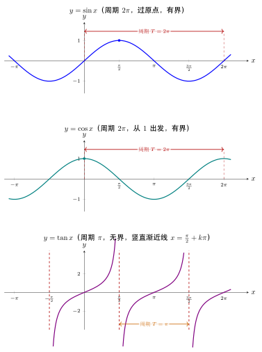

# 第7章：正弦、余弦与正切图像

> 图像不是公式的插图，而是三角函数所有性质的可视化压缩：周期、零点、极值、单调性、渐近线都能直接从图像读出。

## 学习目标

通过本章学习，你将能够：

- 理解三种基本图像的几何来源
- 分析周期、振幅、零点、极值与渐近线
- 区分正弦、余弦与正切图像的核心差异
- 结合图像理解单调性与定义域问题
- 建立“图像 = 结构信息”的意识

---

## 正文内容

## 7.1 从单位圆“展开”出图像

三角函数图像并不是凭空画出来的，它们本质上是单位圆上的点随角度变化，在坐标轴上的投影记录。

设单位圆上点 $P(\cos x,\sin x)$：

- 把纵坐标 $y=\sin x$ 记录下来，就得到正弦图像
- 把横坐标 $x=\cos x$ 记录下来，就得到余弦图像
- 把斜率 $\tan x=\dfrac{\sin x}{\cos x}$ 记录下来，就得到正切图像

所以可以把三角图像理解成：

```text
单位圆运动
  -> 某个投影量随角度变化
  -> 在 x 轴方向展开
  -> 得到周期函数图像
```

这个视角有两个直接好处：

1. 很多符号和最值不用死记，而是能从单位圆直接看出来
2. 图像性质和几何意义天然统一

## 7.2 正弦图像：从“竖直投影”得到周期波形

$y=\sin x$ 的图像在每个长度为 $2\pi$ 的区间内重复，关键点如下：

| 点 | 几何意义 |
|----|----------|
| $(0,0)$ | 单位圆起点在 $(1,0)$，竖直投影为 0 |
| $(\frac{\pi}{2},1)$ | 到达圆顶，竖直投影最大 |
| $(\pi,0)$ | 到达左端点，竖直投影回到 0 |
| $(\frac{3\pi}{2},-1)$ | 到达圆底，竖直投影最小 |
| $(2\pi,0)$ | 一周结束，回到初始状态 |

这说明正弦图像本质上是一条“投影记录曲线”。

### 从图像读出的性质

- **定义域**：全体实数
- **值域**：$[-1,1]$
- **最小正周期**：$2\pi$
- **奇偶性**：奇函数
- **零点**：$x=k\pi$
- **最大值点**：$x=\frac{\pi}{2}+2k\pi$
- **最小值点**：$x=\frac{3\pi}{2}+2k\pi$

### 单调区间

在一个完整周期里：

- 在 $\left[-\frac{\pi}{2},\frac{\pi}{2}\right]$ 上单调递增
- 在 $\left[\frac{\pi}{2},\frac{3\pi}{2}\right]$ 上单调递减

图像上看，正弦曲线先上升到峰值，再下降到谷值。

## 7.3 余弦图像：从“水平投影”得到相位错开的波形

$y=\cos x$ 可以看成单位圆横坐标随角度变化的记录，因此：

- 它从 $(0,1)$ 起步
- 和正弦一样有周期 $2\pi$
- 值域同样是 $[-1,1]$

但它和正弦的区别在于**起始相位不同**：

$$
\cos x=\sin\left(x+\frac{\pi}{2}\right)
$$

所以余弦图像可以看成正弦图像向左平移 $\frac{\pi}{2}$。

### 余弦的关键点

| 点 | 含义 |
|----|------|
| $(0,1)$ | 横坐标起点最大 |
| $(\frac{\pi}{2},0)$ | 横坐标为 0 |
| $(\pi,-1)$ | 横坐标最小 |
| $(\frac{3\pi}{2},0)$ | 横坐标再回到 0 |
| $(2\pi,1)$ | 周期回归 |

### 余弦的单调性

在一个周期中：

- 在 $[0,\pi]$ 上整体从 $1$ 下降到 $-1$
- 在 $[\pi,2\pi]$ 上整体从 $-1$ 上升到 $1$

所以余弦和正弦的“波形相同”，但“时间起点不同”。

## 7.4 正切图像：为什么会出现断裂与渐近线

$y=\tan x$ 与前两者有本质区别，因为它不是单纯投影，而是投影比值：

$$
\tan x=\frac{\sin x}{\cos x}
$$

这带来三件关键事实：

1. 当 $\cos x=0$ 时，函数无定义
2. 当分母趋近于 0 时，函数值会发散
3. 周期从 $2\pi$ 缩短为 $\pi$

### 定义域与渐近线

由于 $\cos x=0$ 在

$$
x=\frac{\pi}{2}+k\pi
$$

处成立，所以这些点是正切函数的**无定义点**，同时也是竖直渐近线。

### 为什么周期变成 $\pi$

因为：

$$
\tan(x+\pi)=\frac{\sin(x+\pi)}{\cos(x+\pi)}
=\frac{-\sin x}{-\cos x}
=\tan x
$$

分子分母同时变号，商不变，所以周期缩短为 $\pi$。

### 图像局部行为

在每个区间

$$
\left(-\frac{\pi}{2}+k\pi,\frac{\pi}{2}+k\pi\right)
$$

上，正切函数都从 $-\infty$ 单调递增到 $+\infty$。

这说明正切图像不是一条连续波，而是一族被渐近线切开的“单调分支”。

## 7.5 图像比较：三者到底有什么本质差异

| 函数 | 周期 | 有界性 | 图像连续性 | 关键结构 |
|------|------|--------|------------|----------|
| $\sin x$ | $2\pi$ | 有界 | 连续 | 经过原点的波形 |
| $\cos x$ | $2\pi$ | 有界 | 连续 | 从最大值出发的波形 |
| $\tan x$ | $\pi$ | 无界 | 分段连续 | 竖直渐近线分割的单调分支 |

下面把三种基本图象并排画出，可以直观对照它们的周期、有界性与渐近线：正弦过原点、余弦从 $1$ 出发、正切被竖直渐近线 $x=\frac{\pi}{2}+k\pi$ 切成一族单调分支，且周期由 $2\pi$ 缩短为 $\pi$。



这张表非常重要，因为很多题目只要看出：

- 它是有界还是无界
- 它是否有渐近线
- 它从哪一点起步

就能快速判断求值、方程、不等式和建模方法。

## 7.6 图像分析一：为什么正切函数有渐近线

正切函数

$$
\tan x=\frac{\sin x}{\cos x}
$$

当 $x\to \frac{\pi}{2}^-$ 时，$\cos x\to0^+$，$\sin x\to1$，所以

$$
\tan x\to+\infty
$$

当 $x\to \frac{\pi}{2}^+$ 时，$\cos x\to0^-$，$\sin x\to1$，所以

$$
\tan x\to-\infty
$$

因此：

$$
x=\frac{\pi}{2}+k\pi
$$

是正切函数的竖直渐近线。

这也是为什么正切函数不能像正弦和余弦那样画成一整条平滑闭合波。

## 7.7 图像分析二：仅凭图像如何快速判断性质

看到一个标准三角图像时，可以按下面顺序读信息：

1. **看是否有界**：有界通常是正弦/余弦，无界通常是正切
2. **看起点**：过原点更像正弦，从 1 出发更像余弦
3. **看渐近线**：有渐近线的是正切
4. **看周期长度**：正弦/余弦是 $2\pi$，正切是 $\pi$
5. **看奇偶对称**：关于原点对称常提示奇函数，关于 $y$ 轴对称常提示偶函数

### 例题：只用图像判断函数类型

若一条周期曲线满足：

- 经过原点
- 最大值为 1，最小值为 -1
- 周期为 $2\pi$

则它最自然对应的是正弦函数。  
如果把起点改成 $(0,1)$，则更自然对应余弦函数。  
如果图像被竖直渐近线切开，则应首先考虑正切函数。

---

## 本章小结

| 函数 | 核心图像特征 |
|------|--------------|
| $\sin x$ | 周期 $2\pi$，过原点，有界，奇函数 |
| $\cos x$ | 周期 $2\pi$，从 1 开始，有界，偶函数 |
| $\tan x$ | 周期 $\pi$，有渐近线，无界，分段单调 |

---

## 分级例题精练

> 本节精选 6 道例题，分三档难度：**初中基础 ★** / **高中核心 ★★** / **高阶拓展 ★★★**。每题含【题目】【解】【点评】，建议先自行尝试再看解。

### 例题精练 1（★ 初中基础）

**题目**：观察 $y=\sin x$ 在一个周期 $[0,2\pi]$ 上的图像，回答：(1) 该函数的最大值是多少？在哪个 $x$ 处取得？(2) 在 $[0,2\pi]$ 上图像与 $x$ 轴有几个交点（零点）？分别在何处？

**解**：

(1) 正弦图像在一个周期内先升到峰、再降到谷。峰值即最大值 $1$，由关键点表知它在 $x=\dfrac{\pi}{2}$ 处取得。

(2) 零点是图像与 $x$ 轴的交点，即 $\sin x=0$ 的位置。在 $[0,2\pi]$ 上有三个：$x=0$、$x=\pi$、$x=2\pi$。中间的 $x=\pi$ 是图像由正变负的“穿越点”，两端 $x=0,2\pi$ 是周期首尾。

**点评**：读图识图的第一步就是认准“峰、谷、零点”这三类关键点。最大值看最高处，零点看与横轴的交点，不必计算，直接在图上数即可。注意 $[0,2\pi]$ 是闭区间，端点 $0$ 和 $2\pi$ 都算进去，所以零点是 $3$ 个而不是 $2$ 个。

### 例题精练 2（★★ 高中核心）

**题目**：已知 $y=2\sin\left(2x-\dfrac{\pi}{3}\right)+1$，求它的振幅、最小正周期、值域，并求其图像的对称轴方程。

**解**：

对照标准形式 $y=A\sin(\omega x+\varphi)+b$，得 $A=2$，$\omega=2$，$\varphi=-\dfrac{\pi}{3}$，$b=1$。

- **振幅**：$|A|=2$。
- **最小正周期**：$T=\dfrac{2\pi}{|\omega|}=\dfrac{2\pi}{2}=\pi$。
- **值域**：$\sin$ 部分取值 $[-1,1]$，乘以 $A=2$ 得 $[-2,2]$，再加 $b=1$，得 $[-1,3]$。
- **对称轴**：正弦图像的对称轴过峰值与谷值，即 $\sin$ 的自变量取 $\dfrac{\pi}{2}+k\pi$ 处。令

$$2x-\frac{\pi}{3}=\frac{\pi}{2}+k\pi\quad(k\in\mathbb{Z}),$$

解得 $2x=\dfrac{5\pi}{6}+k\pi$，即

$$x=\frac{5\pi}{12}+\frac{k\pi}{2}\quad(k\in\mathbb{Z}).$$

**点评**：求振幅、周期、值域是“读参数”的基本功，关键是别把 $\omega$ 直接当周期。对称轴对应正弦取到 $\pm1$（峰谷）的位置，所以让内部表达式等于 $\dfrac{\pi}{2}+k\pi$；若求对称中心则让它等于 $k\pi$。

### 例题精练 3（★★ 高中核心）

**题目**：求 $y=\cos\left(\dfrac{x}{2}-\dfrac{\pi}{4}\right)$ 的单调递增区间。

**解**：

余弦函数 $\cos u$ 在 $u\in[-\pi+2k\pi,\,2k\pi]$ 上单调递增（即从谷值 $-1$ 升到峰值 $1$ 的那一段）。令 $u=\dfrac{x}{2}-\dfrac{\pi}{4}$，要求

$$-\pi+2k\pi\le \frac{x}{2}-\frac{\pi}{4}\le 2k\pi\quad(k\in\mathbb{Z}).$$

各项加 $\dfrac{\pi}{4}$：

$$-\frac{3\pi}{4}+2k\pi\le \frac{x}{2}\le \frac{\pi}{4}+2k\pi.$$

各项乘 $2$：

$$-\frac{3\pi}{2}+4k\pi\le x\le \frac{\pi}{2}+4k\pi\quad(k\in\mathbb{Z}).$$

故单调递增区间为 $\left[-\dfrac{3\pi}{2}+4k\pi,\ \dfrac{\pi}{2}+4k\pi\right]$，$k\in\mathbb{Z}$。

**点评**：求复合三角函数的单调区间，套路是“整体代换 + 解不等式”。关键有两点：一是认准基本函数 $\cos u$ 的递增段是 $[-\pi+2k\pi,2k\pi]$；二是 $\omega=\dfrac12>0$，自变量与整体同增减，方向不变，所以无需翻转不等号。

### 例题精练 4（★★ 高中核心）

**题目**：某正弦型函数 $y=A\sin(\omega x+\varphi)$（$A>0$，$\omega>0$，$|\varphi|<\dfrac{\pi}{2}$）的图像，其相邻最高点为 $\left(\dfrac{\pi}{6},\,3\right)$，相邻的最低点为 $\left(\dfrac{2\pi}{3},\,-3\right)$。求该函数的解析式。

**解**：

- **振幅**：最高点纵坐标 $3$，最低点纵坐标 $-3$，故 $A=\dfrac{3-(-3)}{2}=3$。

- **周期**：相邻最高点与最低点在水平方向相差半个周期。最高点 $x=\dfrac{\pi}{6}$，最低点 $x=\dfrac{2\pi}{3}$，故

$$\frac{T}{2}=\frac{2\pi}{3}-\frac{\pi}{6}=\frac{\pi}{2}\ \Rightarrow\ T=\pi,\quad \omega=\frac{2\pi}{T}=2.$$

- **相位**：最高点处正弦取到峰值 $1$，即 $\omega x+\varphi=\dfrac{\pi}{2}$（取主值）。代入 $x=\dfrac{\pi}{6}$，$\omega=2$：

$$2\cdot\frac{\pi}{6}+\varphi=\frac{\pi}{2}\ \Rightarrow\ \frac{\pi}{3}+\varphi=\frac{\pi}{2}\ \Rightarrow\ \varphi=\frac{\pi}{6}.$$

满足 $|\varphi|<\dfrac{\pi}{2}$。故

$$y=3\sin\left(2x+\frac{\pi}{6}\right).$$

**点评**：由图象反求解析式是高考高频题型，按“$A$ 看高差、$\omega$ 看周期、$\varphi$ 用特殊点”三步走。注意相邻最高点与最低点相差的是**半周期**而非整周期；求 $\varphi$ 时务必代入题目限定范围 $|\varphi|<\dfrac{\pi}{2}$ 验证，必要时调整 $k$。

### 例题精练 5（★★★ 高阶拓展）

**题目**：用五点法在一个周期内作出 $y=2\sin\left(2x+\dfrac{\pi}{3}\right)$ 的图像，列出五个关键点的坐标，并指出图像在该周期内的最高点和最低点位置。

**解**：

五点法的思路是让内部整体表达式 $u=2x+\dfrac{\pi}{3}$ 依次取 $0,\ \dfrac{\pi}{2},\ \pi,\ \dfrac{3\pi}{2},\ 2\pi$（一个周期的五个特征相位），再反解 $x$ 并算出 $y=2\sin u$。

| $u=2x+\frac{\pi}{3}$ | $0$ | $\frac{\pi}{2}$ | $\pi$ | $\frac{3\pi}{2}$ | $2\pi$ |
|---|---|---|---|---|---|
| $x$ | $-\frac{\pi}{6}$ | $\frac{\pi}{12}$ | $\frac{\pi}{3}$ | $\frac{7\pi}{12}$ | $\frac{5\pi}{6}$ |
| $y=2\sin u$ | $0$ | $2$ | $0$ | $-2$ | $0$ |

反解过程：由 $2x+\dfrac{\pi}{3}=u$ 得 $x=\dfrac{u}{2}-\dfrac{\pi}{6}$。例如 $u=\dfrac{\pi}{2}$ 时 $x=\dfrac{\pi}{4}-\dfrac{\pi}{6}=\dfrac{3\pi-2\pi}{12}=\dfrac{\pi}{12}$。

五个关键点为：

$$\left(-\frac{\pi}{6},0\right),\ \left(\frac{\pi}{12},2\right),\ \left(\frac{\pi}{3},0\right),\ \left(\frac{7\pi}{12},-2\right),\ \left(\frac{5\pi}{6},0\right).$$

将它们用平滑曲线连接，即得一个完整周期（长度 $T=\pi$）的图像。

- **最高点**：$\left(\dfrac{\pi}{12},\,2\right)$（$u=\dfrac{\pi}{2}$ 时 $\sin$ 取峰值）。
- **最低点**：$\left(\dfrac{7\pi}{12},\,-2\right)$（$u=\dfrac{3\pi}{2}$ 时 $\sin$ 取谷值）。

**点评**：五点法的精髓不是死记五个 $x$ 值，而是“让整体相位取 $0,\dfrac{\pi}{2},\pi,\dfrac{3\pi}{2},2\pi$，再倒推 $x$”。这样无论 $\omega,\varphi$ 怎么变都能机械执行。检验技巧：相邻两点的 $x$ 间隔应都等于 $\dfrac{T}{4}=\dfrac{\pi}{4}$，本题 $-\dfrac{\pi}{6},\dfrac{\pi}{12},\dfrac{\pi}{3},\dfrac{7\pi}{12},\dfrac{5\pi}{6}$ 公差恰为 $\dfrac{\pi}{4}$，无误。

### 例题精练 6（★★★ 高阶拓展）

**题目**：求函数 $f(x)=\sin x+\left|\sin x\right|$ 的最小正周期，并说明理由。

**解**：

先去掉绝对值，分段讨论。当 $\sin x\ge 0$ 时 $|\sin x|=\sin x$，当 $\sin x<0$ 时 $|\sin x|=-\sin x$，于是

$$f(x)=\begin{cases}2\sin x,&\sin x\ge 0,\\[4pt]0,&\sin x<0.\end{cases}$$

即：在 $\sin x\ge 0$ 的区间（如 $[2k\pi,\ \pi+2k\pi]$）上，$f$ 是一段高度为 $2$ 的正弦“拱”；在 $\sin x<0$ 的区间（如 $(\pi+2k\pi,\ 2\pi+2k\pi)$）上，$f$ 恒为 $0$。

考察周期：取 $T=2\pi$，对任意 $x$ 有 $\sin(x+2\pi)=\sin x$，故 $f(x+2\pi)=f(x)$，$2\pi$ 是一个周期。

它是否还能更小？$f$ 的图像是“一个正弦拱 + 一段零平台”交替出现的形状。在 $\left[0,2\pi\right]$ 内只有**一个**拱（位于 $[0,\pi]$）和**一段**平台（位于 $[\pi,2\pi]$）。若存在更小的正周期 $T_0<2\pi$，则平移 $T_0$ 后拱与平台必须自相重合；但单个拱的最大值点 $x=\dfrac{\pi}{2}$ 加上 $T_0$ 后须仍是最大值点，而在 $[0,2\pi]$ 内最大值点只有 $\dfrac{\pi}{2}$ 这一处，故只能 $T_0=2\pi$。因此最小正周期为

$$T=2\pi.$$

**点评**：含绝对值的三角函数，第一步永远是“脱绝对值、分段化简”。一个常见误区是看到 $|\sin x|$（其周期为 $\pi$）就以为整体周期是 $\pi$，但这里 $f$ 把负半周“压平为 $0$”，正负半周不再对称，故周期仍是 $2\pi$。判断最小正周期不能只验证“某个数是周期”，还要论证“没有更小的周期”，本题用最大值点的唯一性完成了这一步。

---

## 练习题

1. 为什么正弦和余弦图像有界，而正切图像无界？
2. 为什么 $\cos x$ 可以看成正弦图像的相位平移？
3. 正切函数的渐近线为什么出现在 $\frac\pi2 + k\pi$？
4. 仅从图像角度如何判断周期和奇偶性？
5. 为什么说图像是单位圆运动的“展开图”？
