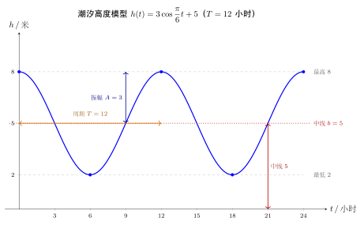

# 第9章：周期现象与三角建模

## 学习目标

通过本章学习，你将能够：

- 把现实中的周期现象抽象为三角函数模型
- 区分振幅、周期、相位和中线的物理意义
- 分析简单振动、潮汐、季节变化等问题
- 理解模型精度与简化假设之间的权衡
- 建立“先看结构，再拟合参数”的建模意识

---

## 正文内容

## 9.1 什么现象适合用三角函数建模

典型场景：

- 振动与摆动
- 日照与季节变化
- 波动与信号
- 圆周运动的投影

共同特征：

- 重复性
- 平滑变化
- 有明显周期

如果一个现象同时满足这三点，三角函数通常是第一选择；如果存在多个周期叠加，则需要进一步走向傅里叶思想。

## 9.2 一个标准建模模板

若某物理量在中线附近做周期摆动，可写成：

$$y=A\sin(\omega x+\varphi)+b$$

建模时需要把文字信息翻译成：

- 最值 $\to$ 振幅与中线
- 周期 $\to$ 角频率
- 初始状态 $\to$ 相位

这一步本质上是在做“自然语言到数学参数”的映射。

## 9.3 例：潮汐高度模型

假设潮汐最高 8 米，最低 2 米，周期 12 小时，则：

- 振幅 $A=3$
- 中线 $b=5$
- 角频率 $\omega=\frac{2\pi}{12}=\frac\pi6$

再根据起始时刻决定相位。若取 $t=0$ 为最高水位（峰值），则用余弦模型最省事，得 $h(t)=3\cos\frac{\pi}{6}t+5$。下图画出这条拟合曲线，并标出中线、振幅与周期三个关键结构：

### 如果起始时刻不是最高点怎么办

很多真实建模里，已知起点往往不是峰值，而是：

- 刚刚经过中线向上
- 刚刚经过中线向下
- 离峰值还有固定时间差

这时更稳妥的做法是：

1. 先写出振幅、中线和周期
2. 再用初始条件解相位

而不是凭直觉硬选一个正弦或余弦式。

## 9.4 模型不是现实本身

三角模型通常只抓住“主周期”这一层结构。现实世界还可能有：

- 多重周期叠加
- 噪声
- 非线性漂移

这正是后来 Fourier 分析会出现的原因。

### 一个现实中的多周期例子

例如温度变化既受：

- 昼夜周期
- 季节周期

影响，那么单个三角函数只能抓住其中一层主周期，真实模型更像：

$$
T(t)=A_1\sin(\omega_1 t+\varphi_1)+A_2\sin(\omega_2 t+\varphi_2)+b
$$

这说明三角建模的第一步通常是“抓住主结构”，而不是追求一开始就完全拟合。

## 9.5 建模流程

1. 判断是否近似周期
2. 找周期长度
3. 找最大最小值
4. 写出标准形式
5. 检查是否符合初始条件

### 一个更可操作的建模清单

| 问题 | 需要提取的信息 |
|------|----------------|
| 周期多长 | 两个相邻峰值或谷值之间的时间差 |
| 上下摆动多大 | 最大值与最小值 |
| 中心位置在哪 | 中线 |
| 起始状态如何 | 是否在峰值、中线或谷值附近 |
| 模型够不够 | 看残差是否呈结构化周期波动 |

## 9.6 建模例题：从最大最小值恢复模型

若某周期现象最大值为 $7$，最小值为 $1$，周期为 $12$，且 $t=0$ 时位于中线并向上运动，则：

$$A=\frac{7-1}{2}=3,\qquad D=\frac{7+1}{2}=4$$

周期 $T=12$，所以 $\omega=\frac{2\pi}{T}=\frac\pi6$。由于从中线向上开始，可取正弦模型：

$$y=3\sin\frac{\pi t}{6}+4$$

### 进一步验证这个模型是否合理

检查三个点：

1. 中线：$4$，正确
2. 振幅：$3$，所以最大最小分别为 $7$ 和 $1$
3. 周期：$12$，满足要求

这说明模型至少在“主周期 + 主振幅”层面是合理的。

## 9.7 图像分析：建模题为什么必须画图

很多人会跳过画图，直接列公式。这样做最容易导致：

- 相位方向错
- 周期理解错
- 起点条件翻译错

一个简单 sketch 往往就能看出：

- 曲线起点是在峰值还是中线
- 是先上升还是先下降
- 周期长度是局部振动还是完整循环

所以建模题并不是“先列公式”，而是“先看结构，再列公式”。

---

## 本章小结

| 建模信息 | 对应参数 |
|----------|----------|
| 最大最小值 | 振幅、中线 |
| 重复长度 | 周期、角频率 |
| 初始相位 | 相位常数 |

---

## 分级例题精练

> 本节精选 6 道例题，分三档难度：**初中基础 ★** / **高中核心 ★★** / **高阶拓展 ★★★**。每题含【题目】【解】【点评】，建议先自行尝试再看解。

### 例题精练 1（★ 初中基础）

**题目**：某地某天的气温可近似看作周期变化，最高气温 $18^\circ\mathrm{C}$，最低气温 $6^\circ\mathrm{C}$。仅根据这两个数据，求该气温模型的振幅与中线（平均温度）。

**解**：

气温围绕一条中线上下摆动：

- **中线（平均温度）**：取最高与最低的平均值，

$$b=\frac{18+6}{2}=12\ (^\circ\mathrm{C}).$$

- **振幅**：中线到最高（或最低）的距离，

$$A=\frac{18-6}{2}=6\ (^\circ\mathrm{C}).$$

**点评**：这是建模的第一块拼图。无论后面相位、周期怎么定，只要拿到“最高值 $M$、最低值 $m$”，就能立刻写出中线 $\dfrac{M+m}{2}$ 与振幅 $\dfrac{M-m}{2}$。这两个量分别决定模型“摆在哪”和“摆多大”，与起始时刻无关。

### 例题精练 2（★★ 高中核心）

**题目**：某港口潮汐高度（米）随时间 $t$（小时）周期变化，已知周期为 $12$ 小时，最高水位 $8$ 米，最低水位 $2$ 米，且 $t=0$ 时恰为最高水位。试建立潮汐高度 $h(t)$ 的模型。

**解**：

- **振幅与中线**：$A=\dfrac{8-2}{2}=3$，$b=\dfrac{8+2}{2}=5$。
- **角频率**：$\omega=\dfrac{2\pi}{T}=\dfrac{2\pi}{12}=\dfrac{\pi}{6}$。
- **起始状态**：$t=0$ 时取最高水位，余弦在自变量为 $0$ 时取最大值，最契合，故选余弦模型，相位取 $0$：

$$h(t)=3\cos\frac{\pi}{6}t+5.$$

验证：$h(0)=3\cos 0+5=8$（最高），符合；半周期 $t=6$ 时 $h(6)=3\cos\pi+5=2$（最低），符合。

**点评**：当“$t=0$ 取最大值”时，余弦模型让相位直接为 $0$，最省事。这正是 9.3 节强调的“先看起始状态再选 $\sin$ 还是 $\cos$”。若硬用正弦，则要写成 $3\sin\left(\dfrac{\pi}{6}t+\dfrac{\pi}{2}\right)+5$，多出一个相位，反而易错。

### 例题精练 3（★★ 高中核心）

**题目**：某地一天中昼长（白昼小时数）在一年中近似周期变化，一年按 $365$ 天计。已知夏至（设为第 $172$ 天）昼最长约 $14.5$ 小时，冬至昼最短约 $9.5$ 小时。以天数 $d$ 为自变量，建立昼长 $L(d)$ 的模型。

**解**：

- **振幅与中线**：$A=\dfrac{14.5-9.5}{2}=2.5$，$b=\dfrac{14.5+9.5}{2}=12$。
- **角频率**：周期 $T=365$ 天，$\omega=\dfrac{2\pi}{365}$。
- **相位**：最大值（昼最长）出现在 $d=172$。用余弦模型，余弦在自变量为 $0$ 时最大，故让 $\omega(d-172)$ 整体在 $d=172$ 时为 $0$：

$$L(d)=2.5\cos\!\left[\frac{2\pi}{365}(d-172)\right]+12.$$

验证：$d=172$ 时 $L=2.5\cos 0+12=14.5$（最长）；半周期后约 $d=172+182.5\approx 354.5$（接近冬至），$\cos\pi=-1$，$L=9.5$（最短），符合。

**点评**：当峰值出现在某个非零时刻 $d_0$ 时，余弦模型用“$\cos[\omega(d-d_0)]$”这种**相位用平移写**的形式最直观——把横轴原点搬到峰值处即可，避免直接解相位常数 $\varphi$ 的符号纠结。这与第 8 章“先提取 $\omega$ 再判断平移”是同一思想。

### 例题精练 4（★★ 高中核心）

**题目**：一个弹簧振子做简谐振动，位移 $y$（厘米）满足 $y=4\sin\left(2\pi t+\dfrac{\pi}{6}\right)$，其中 $t$ 为时间（秒）。求：(1) 振幅与周期（频率）；(2) $t=0$ 时的位移；(3) 第一次到达最大位移（$y=4$）的时刻。

**解**：

(1) 振幅 $A=4$ 厘米。角频率 $\omega=2\pi$，故周期 $T=\dfrac{2\pi}{\omega}=\dfrac{2\pi}{2\pi}=1$ 秒，频率 $f=\dfrac{1}{T}=1$ 赫兹。

(2) $t=0$ 时 $y=4\sin\dfrac{\pi}{6}=4\times\dfrac12=2$（厘米）。

(3) 最大位移 $y=4$ 要求 $\sin\left(2\pi t+\dfrac{\pi}{6}\right)=1$，即

$$2\pi t+\frac{\pi}{6}=\frac{\pi}{2}+2k\pi\quad(k\in\mathbb{Z}).$$

解得 $2\pi t=\dfrac{\pi}{3}+2k\pi$，$t=\dfrac16+k$。第一次（最小非负 $t$）取 $k=0$：

$$t=\frac16\ \text{秒}.$$

**点评**：简谐振动是三角建模的经典物理场景，参数有明确含义：$A$ 是最大位移，$T$ 是往复一次的时间，$\dfrac{\varphi}{\omega}$ 关联初相位。求“第一次到达某状态”的时刻时，先写出周期性通解 $t=\dfrac16+k$，再取最小的非负值，切勿漏掉“第一次”这一限定。

### 例题精练 5（★★★ 高阶拓展）

**题目**：某摩天轮半径 $50$ 米，最低点距地面 $2$ 米，匀速转动一圈需 $20$ 分钟。某乘客从最低点登舱开始计时。(1) 写出该乘客离地高度 $H(t)$（米）随时间 $t$（分钟）的模型；(2) 求登舱后前 $20$ 分钟内，乘客离地高度首次达到 $77$ 米的时刻。

**解**：

(1) **几何参数**：圆心离地高度 $=2+50=52$ 米，即中线 $b=52$；振幅 $A=50$（半径）。**周期**：$T=20$，$\omega=\dfrac{2\pi}{20}=\dfrac{\pi}{10}$。**起始状态**：$t=0$ 在最低点（$H=2$），这是谷值，用“负余弦”最契合（$-\cos 0=-1$ 给最小值）：

$$H(t)=-50\cos\frac{\pi}{10}t+52.$$

验证：$H(0)=-50+52=2$（最低），符合；半周期 $t=10$ 时 $H=-50\cos\pi+52=102$（最高 $=52+50$），符合。

(2) 令 $H(t)=77$：

$$-50\cos\frac{\pi}{10}t+52=77\ \Rightarrow\ \cos\frac{\pi}{10}t=\frac{52-77}{50}=-\frac12.$$

在一个周期 $t\in[0,20]$ 内，$\dfrac{\pi}{10}t\in[0,2\pi]$。$\cos\theta=-\dfrac12$ 的解为 $\theta=\dfrac{2\pi}{3}$ 或 $\dfrac{4\pi}{3}$。**首次**达到取较小的 $\theta=\dfrac{2\pi}{3}$：

$$\frac{\pi}{10}t=\frac{2\pi}{3}\ \Rightarrow\ t=\frac{20}{3}\approx 6.67\ \text{分钟}.$$

**点评**：摩天轮是“圆周运动投影 = 余弦”的典范。诀窍是把高度拆成“圆心高度（中线）+ 半径在竖直方向的投影（振幅 × 余弦）”。起点在**最低点**时用 $-\cos$，在**最高点**时用 $+\cos$，在中线时用 $\sin$——把起始几何状态对号入座，相位就不必硬算。求“首次”时，在一个周期内列出全部解再取最小正解。

### 例题精练 6（★★★ 高阶拓展）

**题目**：某海滨浴场的水深 $y$（米）随时间 $t$（小时，$0\le t\le 24$）近似满足 $y=3\sin\left(\dfrac{\pi}{6}t+\dfrac{\pi}{6}\right)+10$。安全规定：水深不低于 $11.5$ 米时才允许冲浪。问一天 $24$ 小时内，有多长时间允许冲浪？

**解**：

允许冲浪要求 $y\ge 11.5$：

$$3\sin\left(\frac{\pi}{6}t+\frac{\pi}{6}\right)+10\ge 11.5\ \Rightarrow\ \sin\left(\frac{\pi}{6}t+\frac{\pi}{6}\right)\ge \frac{1.5}{3}=\frac12.$$

令 $u=\dfrac{\pi}{6}t+\dfrac{\pi}{6}$。当 $t\in[0,24]$ 时，

$$u\in\left[\frac{\pi}{6},\ \frac{\pi}{6}\cdot 24+\frac{\pi}{6}\right]=\left[\frac{\pi}{6},\ 4\pi+\frac{\pi}{6}\right].$$

$\sin u\ge\dfrac12$ 的基本解集为 $u\in\left[\dfrac{\pi}{6}+2k\pi,\ \dfrac{5\pi}{6}+2k\pi\right]$，每段长度 $\dfrac{5\pi}{6}-\dfrac{\pi}{6}=\dfrac{2\pi}{3}$。

把每段反解为 $t$：由 $u=\dfrac{\pi}{6}(t+1)$ 得 $t=\dfrac{6u}{\pi}-1$。区间长度按比例换算——$u$ 每变化 $\Delta u$，$t$ 变化 $\dfrac{6}{\pi}\Delta u$。每段满足条件的 $u$ 长 $\dfrac{2\pi}{3}$，对应 $t$ 长

$$\frac{6}{\pi}\cdot\frac{2\pi}{3}=4\ \text{小时}.$$

在 $u\in\left[\dfrac{\pi}{6},\ 4\pi+\dfrac{\pi}{6}\right]$（长 $4\pi$，恰好 $2$ 个完整周期）内，$\sin u\ge\dfrac12$ 的区间为：$k=0$ 段 $\left[\dfrac{\pi}{6},\dfrac{5\pi}{6}\right]$、$k=1$ 段 $\left[\dfrac{13\pi}{6},\dfrac{17\pi}{6}\right]$，两段都完整落在范围内（右端 $\dfrac{17\pi}{6}\approx 8.9<4\pi+\dfrac{\pi}{6}\approx 13.1$），共 $2$ 段。

故允许冲浪的总时长为 $2\times 4=8$ 小时。

**点评**：这是“三角不等式 + 周期建模”的综合题。解题主线是：列不等式 $\to$ 化为 $\sin u\ge c$ $\to$ 整体代换求 $u$ 的区间 $\to$ 换算回 $t$ 的时长。关键技巧有两点：一是把求“时长”转化为求“区间长度”，按 $\Delta t=\dfrac{6}{\pi}\Delta u$ 比例换算，避免逐段反解端点；二是确认自变量范围 $u$ 恰含整数个周期（这里 $4\pi$ = 2 个周期），使每个周期贡献相同时长，直接相乘即可。

---

## 练习题

1. 什么样的现实问题最适合用三角函数建模？
2. 已知最大值、最小值和周期，如何写出基本模型框架？
3. 为什么“主周期模型”并不等于完整现实？
4. 对一个简单的昼夜温度周期问题建立三角模型。
5. 建模时最容易出错的参数是哪一个？为什么？
