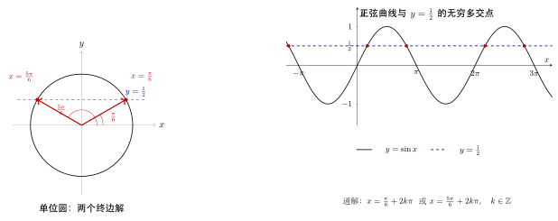

# 第10章：三角方程

> 三角方程的难点从来不是算出一个角，而是写出**完整解集**，并且在变形过程中始终守住周期、定义域和增根检查。

## 学习目标

完成本章学习后，你将能够：

1. 区分主值解与完整通解
2. 掌握基本三角方程、换元方程和综合方程的求法
3. 用单位圆和图像解释方程解集的来源
4. 在变形中处理定义域与增根问题
5. 为后续参数题和建模题建立“先在一个周期内求解”的习惯

---

## 正文内容

## 10.1 为什么三角方程最容易漏解

代数方程通常有有限个解，而三角方程往往有**无限多个周期解**。因此求解流程必须分两层：

1. 先在一个周期内求出主值解
2. 再利用周期性写出完整通解

如果忘记第二步，往往就只写出“看起来正确但不完整”的答案。

例如：

$$
\sin x=\frac12
$$

在一个周期 $[0,2\pi)$ 内的解只有两个，但在全体实数上解是两族：

$$
x=\frac\pi6+2k\pi,
\qquad
x=\frac{5\pi}{6}+2k\pi,
\quad k\in\mathbb{Z}
$$

这就是三角方程和普通代数方程最本质的差别。

---

## 10.2 基本方程：由单位圆直接读解

### 10.2.1 正弦方程

对于

$$
\sin x=a,
\qquad a\in[-1,1]
$$

解法是：先在单位圆上找纵坐标为 $a$ 的点，再读取对应角度。若参考角为 $\alpha$，则解通常为：

$$
x=\alpha+2k\pi
quad \text{或} \quad
x=\pi-\alpha+2k\pi
$$

### 10.2.2 余弦方程

对于

$$
\cos x=a,
\qquad a\in[-1,1]
$$

若主值角为 $\alpha$，则解可写为：

$$
x=\pm \alpha+2k\pi
$$

### 10.2.3 正切方程

对于

$$
\tan x=a
$$

只要主值为 $\alpha$，则完整解为：

$$
x=\alpha+k\pi
$$

因为正切的周期是 $\pi$。

### 例题一：基础方程

解

$$
2\sin x-1=0
$$

**解**：

$$
\sin x=\frac12
$$

在 $[0,2\pi)$ 内，解为

$$
x=\frac\pi6,
\qquad x=\frac{5\pi}{6}
$$

因此通解：

$$
x=\frac\pi6+2k\pi
\quad\text{或}\quad
x=\frac{5\pi}{6}+2k\pi
\qquad k\in\mathbb{Z}
$$

---

## 10.3 用图像看三角方程

三角方程也可以理解为“函数图像和水平线的交点问题”。

例如：

$$
\sin x=\frac12
$$

就是正弦曲线与直线 $y=\frac12$ 的交点横坐标。

这种视角的好处是：

- 解的个数更直观
- 区间解更直观
- 参数改变时，解的存在性也更容易判断

### 图像视角的重要启发

- 若 $|a|>1$，则 $\sin x=a$ 和 $\cos x=a$ 无解，因为水平线超出值域
- 若直线与波形“刚好相切”，则可能对应极值点
- 若是正切函数，则必须同时看它的渐近线分支

---

## 10.4 换元法：把复杂方程压成代数方程

很多三角方程不是直接给出 $\sin x$ 或 $\cos x$，而是诸如：

$$
2\sin^2x-3\sin x+1=0
$$

这时可以令

$$
t=\sin x
$$

把它变成代数方程：

$$
2t^2-3t+1=0
$$

解得：

$$
t=1\quad \text{或} \quad t=\frac12
$$

然后再分别回到三角方程：

- $\sin x=1 \Rightarrow x=\frac\pi2+2k\pi$
- $\sin x=\frac12 \Rightarrow x=\frac\pi6+2k\pi$ 或 $x=\frac{5\pi}{6}+2k\pi$

### 为什么换元法容易出错

因为很多人只解出 $t$，却忘了把每个 $t$ 再展开成完整三角解集。

---

## 10.5 结构化变形：把方程化成熟悉形式

复杂方程常见变形方式包括：

1. 提取公因子
2. 使用恒等式换成单一函数
3. 使用辅助角公式压缩线性组合
4. 必要时使用万能代换

例如：

$$
\sin x+\cos x=1
$$

可以先平方，也可以先写成：

$$
\sqrt2\sin\left(x+\frac\pi4
ight)=1
$$

于是化为：

$$
\sin\left(x+\frac\pi4
ight)=\frac{1}{\sqrt2}=\frac{\sqrt2}{2}
$$

从而得到解集。

这说明复杂三角方程的核心能力是“看出可以压成哪种标准形式”。

---

## 10.6 增根与定义域：为什么不能只会变形

三角方程最常见的坑包括：

- 两边平方引入增根
- 除以三角函数时丢掉原来可能成立的解
- 使用反三角函数时误把主值当通解

### 一个典型错误场景

解

$$
\sin x=\cos x
$$

若两边同除以 $\cos x$，得到：

$$
\tan x=1
$$

这一步默认了 $\cos x
e0$。在本题中这没有丢掉解，但在其它题里未必安全。 
所以每次除法变形都要明确：分母是否可能为零？

---

## 10.7 图像 / 结构分析

可以把三角方程看成下列结构：

| 结构 | 首选工具 |
|------|----------|
| $\sin x=a$ / $\cos x=a$ / $\tan x=a$ | 单位圆 / 图像 |
| 多项式型 | 换元法 |
| 线性组合型 | 辅助角公式 |
| 同时含 $\sin x,\cos x$ 的复杂式 | 恒等式或万能代换 |

真正会解三角方程的人，看到题目时想的不是“先算”，而是“它应该归约成哪一类”。

---

## 10.8 常见误区与检查清单

- 是否只写了一个周期内的解？
- 是否在平方、约分后检查增根？
- 是否把反三角主值误当成通解？
- 是否没有在单位圆或图像里验证答案？

---

## 本章小结

| 主题 | 结论 |
|------|------|
| 核心问题 | 先在一个周期内求解，再写完整通解 |
| 常用方法 | 单位圆、图像、换元、辅助角 |
| 最大风险 | 漏掉周期解、引入增根、忽略定义域 |
| 关键能力 | 把复杂方程压成熟悉标准形式 |

---

## 分级例题精练

> 本节精选 6 道例题，分三档难度：**初中基础 ★** / **高中核心 ★★** / **高阶拓展 ★★★**。每题含【题目】【解】【点评】，建议先自行尝试再看解。

### 例题精练 1（★ 初中基础）

**题目**：在 $[0,2\pi)$ 内解方程 $\cos x=-\dfrac12$。

**解**：

在 $[0,2\pi)$ 内寻找余弦值为 $-\dfrac12$ 的角。参考角满足 $\cos\alpha=\dfrac12$，即 $\alpha=\dfrac\pi3$。余弦为负，对应第二、第三象限：

$$
x=\pi-\frac\pi3=\frac{2\pi}{3},
\qquad
x=\pi+\frac\pi3=\frac{4\pi}{3}
$$

故在 $[0,2\pi)$ 内解集为

$$
\left\{\frac{2\pi}{3},\ \frac{4\pi}{3}\right\}
$$

**点评**：先用参考角定“值”，再用象限定“位置”，是基本方程在限定区间内求解的标准两步。本题没有要求通解，因此**不写** $+2k\pi$；区间限定与通解二者不要混淆。

### 例题精练 2（★★ 高中核心）

**题目**：求 $\tan\!\left(2x-\dfrac\pi3\right)=\sqrt3$ 的通解。

**解**：

令 $u=2x-\dfrac\pi3$，则 $\tan u=\sqrt3$。正切的主值为 $\dfrac\pi3$，由于正切周期为 $\pi$，

$$
u=\frac\pi3+k\pi,\qquad k\in\mathbb{Z}
$$

代回 $u=2x-\dfrac\pi3$：

$$
2x-\frac\pi3=\frac\pi3+k\pi
\ \Longrightarrow\
2x=\frac{2\pi}{3}+k\pi
\ \Longrightarrow\
x=\frac\pi3+\frac{k\pi}{2},\qquad k\in\mathbb{Z}
$$

**点评**：正切方程只有**一族**解，周期是 $\pi$ 而不是 $2\pi$，这是与正弦、余弦的关键差别。整体换元后注意：解出 $u$ 时周期是 $\pi$，回代除以系数 $2$ 后，$x$ 的间隔变成 $\dfrac\pi2$，$k\in\mathbb{Z}$ 必须保留。

### 例题精练 3（★★ 高中核心）

**题目**：解方程 $2\cos^2 x+\sin x-1=0$，写出通解。

**解**：

利用 $\cos^2 x=1-\sin^2 x$ 化为同名函数：

$$
2(1-\sin^2 x)+\sin x-1=0
\ \Longrightarrow\
-2\sin^2 x+\sin x+1=0
$$

整理为 $2\sin^2 x-\sin x-1=0$。令 $t=\sin x$（$-1\le t\le1$）：

$$
2t^2-t-1=0
\ \Longrightarrow\
(2t+1)(t-1)=0
\ \Longrightarrow\
t=-\frac12\ \text{或}\ t=1
$$

二者均在 $[-1,1]$ 内，逐一回代：

- $\sin x=1\Rightarrow x=\dfrac\pi2+2k\pi$；
- $\sin x=-\dfrac12\Rightarrow x=-\dfrac\pi6+2k\pi$ 或 $x=\pi+\dfrac\pi6+2k\pi=\dfrac{7\pi}{6}+2k\pi$。

故通解为

$$
x=\frac\pi2+2k\pi,\quad
x=-\frac\pi6+2k\pi,\quad
x=\frac{7\pi}{6}+2k\pi,\qquad k\in\mathbb{Z}
$$

**点评**：先“化同名”把方程压成关于 $\sin x$ 的二次型，是处理混合方程的主线。换元后须检查 $t$ 是否落在 $[-1,1]$ 内（本题都满足），再把**每个** $t$ 完整展开成三角解集——漏掉 $\sin x=-\dfrac12$ 的第二族是常见失分点。

### 例题精练 4（★★ 高中核心）

**题目**：解方程 $\sin x-\sqrt3\cos x=1$，写出通解。

**解**：

用辅助角公式压缩左边。$R=\sqrt{1^2+(\sqrt3)^2}=2$，提取后

$$
\sin x-\sqrt3\cos x
=2\left(\frac12\sin x-\frac{\sqrt3}{2}\cos x\right)
=2\sin\!\left(x-\frac\pi3\right)
$$

（因为 $\cos\dfrac\pi3=\dfrac12,\ \sin\dfrac\pi3=\dfrac{\sqrt3}{2}$。）方程化为

$$
2\sin\!\left(x-\frac\pi3\right)=1
\ \Longrightarrow\
\sin\!\left(x-\frac\pi3\right)=\frac12
$$

故 $x-\dfrac\pi3=\dfrac\pi6+2k\pi$ 或 $x-\dfrac\pi3=\dfrac{5\pi}{6}+2k\pi$，解得

$$
x=\frac\pi2+2k\pi
\quad\text{或}\quad
x=\frac{7\pi}{6}+2k\pi,\qquad k\in\mathbb{Z}
$$

**点评**：$a\sin x+b\cos x=c$ 型方程的标准解法是辅助角压成单一正弦。本题 $b=-\sqrt3<0$，相位取 $-\dfrac\pi3$，展开后逐项核对系数可避免符号错误。化成 $\sin(\cdot)=\dfrac12$ 后仍是基本方程，两族解都要写。

### 例题精练 5（★★ 高中核心）

**题目**：求方程 $\cos 2x+3\sin x-2=0$ 在 $[0,2\pi)$ 内的所有解。

**解**：

用倍角公式 $\cos 2x=1-2\sin^2 x$ 化同名：

$$
1-2\sin^2 x+3\sin x-2=0
\ \Longrightarrow\
-2\sin^2 x+3\sin x-1=0
\ \Longrightarrow\
2\sin^2 x-3\sin x+1=0
$$

令 $t=\sin x$：$(2t-1)(t-1)=0$，得 $t=\dfrac12$ 或 $t=1$（均在 $[-1,1]$ 内）。在 $[0,2\pi)$ 内回代：

- $\sin x=\dfrac12\Rightarrow x=\dfrac\pi6$ 或 $x=\dfrac{5\pi}{6}$；
- $\sin x=1\Rightarrow x=\dfrac\pi2$。

故在 $[0,2\pi)$ 内解集为

$$
\left\{\frac\pi6,\ \frac\pi2,\ \frac{5\pi}{6}\right\}
$$

**点评**：含 $\cos 2x$ 与 $\sin x$ 混合时，选 $\cos 2x=1-2\sin^2 x$ 这一形式可一步化成只含 $\sin x$ 的二次型（若选 $\cos2x=2\cos^2x-1$ 反而引入 $\cos x$）。选对倍角恒等式的“方向”是关键技巧。题目限定区间，故只取 $[0,2\pi)$ 内的解，不加周期。

### 例题精练 6（★★★ 高阶拓展）

**题目**：已知关于 $x$ 的方程 $2\sin^2 x+2\sin x\cos x=k$（其中 $k$ 为实数）有解，求 $k$ 的取值范围；并求当 $k=2$ 时方程在 $[0,2\pi)$ 内的解。

**解**：

先把左边压成“振幅 + 相位 + 常数”的标准形。用降幂与倍角：

$$
2\sin^2 x=1-\cos 2x,\qquad 2\sin x\cos x=\sin 2x
$$

故

$$
2\sin^2 x+2\sin x\cos x
=1-\cos 2x+\sin 2x
=1+\sin 2x-\cos 2x
$$

再用辅助角合并 $\sin 2x-\cos 2x$，其中 $R=\sqrt{1^2+(-1)^2}=\sqrt2$：

$$
\sin 2x-\cos 2x=\sqrt2\sin\!\left(2x-\frac\pi4\right)
$$

于是左边 $=1+\sqrt2\sin\!\left(2x-\dfrac\pi4\right)$。由于 $\sin\!\left(2x-\dfrac\pi4\right)\in[-1,1]$，左边的值域为

$$
\bigl[1-\sqrt2,\ 1+\sqrt2\bigr]
$$

**方程有解当且仅当** $k\in[1-\sqrt2,\ 1+\sqrt2]$。

当 $k=2$ 时：

$$
1+\sqrt2\sin\!\left(2x-\frac\pi4\right)=2
\ \Longrightarrow\
\sin\!\left(2x-\frac\pi4\right)=\frac{1}{\sqrt2}=\frac{\sqrt2}{2}
$$

由于 $\dfrac{\sqrt2}{2}\in[1-\sqrt2,1+\sqrt2]$ 对应的右端值合法，令 $u=2x-\dfrac\pi4$：

$$
u=\frac\pi4+2k\pi
\quad\text{或}\quad
u=\frac{3\pi}{4}+2k\pi
$$

由 $u=\dfrac\pi4+2k\pi$：$2x=\dfrac\pi2+2k\pi\Rightarrow x=\dfrac\pi4+k\pi$；
由 $u=\dfrac{3\pi}{4}+2k\pi$：$2x=\pi+2k\pi\Rightarrow x=\dfrac\pi2+k\pi$。

在 $[0,2\pi)$ 内取 $k=0,1$，得解集

$$
\left\{\frac\pi4,\ \frac\pi2,\ \frac{5\pi}{4},\ \frac{3\pi}{2}\right\}
$$

**点评**：含参方程“有解条件”的本质是**参数落入左边值域**——把 $2\sin^2x+2\sin x\cos x$ 经降幂、倍角、辅助角压成 $1+\sqrt2\sin(2x-\tfrac\pi4)$ 后，值域 $[1-\sqrt2,1+\sqrt2]$ 一目了然。求具体解时注意内层角是 $2x-\dfrac\pi4$，回代后 $x$ 的周期由 $2\pi$ 缩成 $\pi$，在 $[0,2\pi)$ 内每族各有两个解，共四个，切勿漏取 $k=1$。

---

## 练习题

1. 为什么三角方程必须区分主值解和通解？
2. 用换元法解 $2\sin^2x-3\sin x+1=0$。
3. 为什么图像法能帮助判断方程是否有解？
4. 举一个平方后产生增根的三角方程例子。 
5. 设计一道既需要辅助角又需要通解表达的综合题。
