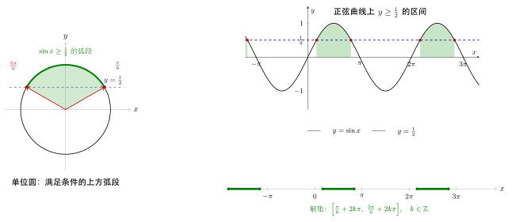

# 第11章：三角不等式

> 三角不等式的关键不是代数变形，而是“读区间”：先在一个周期里看图像或单位圆，再把区间复制到全体实数。

## 学习目标

完成本章学习后，你将能够：

1. 理解三角不等式为何天然适合图像和单位圆方法
2. 掌握在一个周期内求区间、再复制周期的通用框架
3. 处理含参数的三角不等式
4. 区分正弦、余弦、正切不等式的结构差异
5. 避免区间端点、周期复制和定义域方面的错误

---

## 正文内容

## 11.1 为什么三角不等式最适合图像法

三角不等式本质上是在问：

> 某个三角函数图像在哪些区间落在某条水平线之上或之下？

例如：

$$
\sin x\ge \frac12
$$

本质上就是找正弦曲线在水平线 $y=\frac12$ 上方的区间。

这种图像视角的优势是：

- 区间结构直接可见
- 周期复制直观
- 参数存在性更容易判断

---

## 11.2 在一个周期内求解

对于正弦函数，最小正周期是 $2\pi$，因此通常先在区间：

$$
[0,2\pi)
$$

内求解，再写成通解区间。

### 例题一：

解

$$
\sin x\ge \frac12
$$

在一个周期内，正弦曲线与 $y=\frac12$ 的交点为：

$$
x=\frac\pi6,
\qquad
x=\frac{5\pi}{6}
$$

因此在一个周期内解集为：

$$
x\in\left[\frac\pi6,\frac{5\pi}{6}\right]
$$

推广到全体实数：

$$
x\in\left[\frac\pi6+2k\pi,\frac{5\pi}{6}+2k\pi\right],\qquad k\in\mathbb Z
$$

---

## 11.3 余弦不等式的图像读法

解

$$
\cos x<0
$$

在一个周期 $[0,2\pi)$ 内，余弦图像在下半部分，对应区间：

$$
(\frac\pi2,\frac{3\pi}{2})
$$

所以完整解集为：

$$
x\in \left(\frac\pi2+2k\pi,\frac{3\pi}{2}+2k\pi\right)
$$

这类题里最常见的错误是：

- 区间端点写错成闭区间
- 周期复制忘记写完整

---

## 11.4 正切不等式为什么和前两者不一样

正切函数的周期是 $\pi$，并且存在渐近线。因此求不等式时应在每个定义区间内讨论。

例如：

$$
\tan x>1
$$

在主值区间

$$
(-\frac\pi2,\frac\pi2)
$$

内，正切严格递增，所以先解出：

$$
x>\frac\pi4
$$

再结合定义区间得到：

$$
x\in\left(\frac\pi4+k\pi,\frac\pi2+k\pi\right)
$$

这说明正切不等式不能简单照搬正弦余弦的“整周期图像块”思路，而要结合每个单调区间处理。

---

## 11.5 参数不等式

参数问题的核心是先判断水平线是否会与函数图像相交。

例如：

$$
\sin x\ge a
$$

- 若 $a>1$，无解
- 若 $a<-1$，恒成立
- 若 $-1\le a\le 1$，则需要找对应交点角度并写出区间

这说明值域分析往往是参数不等式的第一步，而不是最后一步。

---

## 11.6 单位圆视角

图像法直观，但单位圆法往往更适合解释“符号”和“区间端点”。

例如：

- $\sin x\ge 0$ 对应单位圆上半圆
- $\cos x<0$ 对应左半圆
- $\tan x>0$ 对应第一、第三象限

这类题用单位圆读解时，区间表达会更自然，也更容易检查象限是否正确。

---

## 11.7 常见误区与检查清单

- 是否只解了一个周期内的区间？
- 是否把不等式端点写错（开区间/闭区间）？
- 是否忽略了正切函数无定义点？
- 是否没有先判断参数是否落在值域内？

---

## 本章小结

| 主题 | 结论 |
|------|------|
| 核心方法 | 先在一个周期内求区间，再复制周期 |
| 最强工具 | 图像法和单位圆法 |
| 正切特点 | 周期是 $\pi$，并且有定义域断裂 |
| 参数题关键 | 先看值域，后求交点 |

---

## 分级例题精练

> 本节精选 6 道例题，分三档难度：**初中基础 ★** / **高中核心 ★★** / **高阶拓展 ★★★**。每题含【题目】【解】【点评】，建议先自行尝试再看解。

### 例题精练 1（★ 初中基础）

**题目**：在 $[0,2\pi)$ 内解不等式 $\cos x\le-\dfrac12$。

**解**：

先在 $[0,2\pi)$ 内找 $\cos x=-\dfrac12$ 的交点：$x=\dfrac{2\pi}{3}$ 与 $x=\dfrac{4\pi}{3}$。

余弦曲线在这两点之间位于水平线 $y=-\dfrac12$ 的**下方**（即更小），故

$$
x\in\left[\frac{2\pi}{3},\ \frac{4\pi}{3}\right]
$$

**点评**：限定区间内只需“定交点、看上下”。不等号取 $\le$（含等号），故端点写**闭区间**。本题不要求通解，因此不复制周期。

### 例题精练 2（★★ 高中核心）

**题目**：解不等式 $2\sin x-\sqrt3>0$，写出全体实数上的解集。

**解**：

整理为 $\sin x>\dfrac{\sqrt3}{2}$。先在一个周期 $[0,2\pi)$ 内求解：交点为 $\sin x=\dfrac{\sqrt3}{2}$ 的 $x=\dfrac\pi3$ 与 $x=\dfrac{2\pi}{3}$。正弦曲线在二者之间位于 $y=\dfrac{\sqrt3}{2}$ 上方，故周期内解为

$$
x\in\left(\frac\pi3,\ \frac{2\pi}{3}\right)
$$

复制周期得全体实数上的解集

$$
x\in\left(\frac\pi3+2k\pi,\ \frac{2\pi}{3}+2k\pi\right),\qquad k\in\mathbb{Z}
$$

**点评**：严格不等号 $>$ 对应**开区间**，端点不取。先在一个周期定区间、再写 $+2k\pi$ 复制周期，是正弦不等式的通用框架；$k\in\mathbb{Z}$ 不能省。

### 例题精练 3（★★ 高中核心）

**题目**：解不等式 $\tan x\le\sqrt3$。

**解**：

正切周期为 $\pi$，应在主值区间 $\left(-\dfrac\pi2,\dfrac\pi2\right)$ 内讨论。该区间内 $\tan x$ 严格递增，$\tan\dfrac\pi3=\sqrt3$，故 $\tan x\le\sqrt3$ 对应

$$
-\frac\pi2<x\le\frac\pi3
$$

注意 $x=-\dfrac\pi2$ 是渐近线，正切无定义，必须开端点。复制周期 $\pi$：

$$
x\in\left(-\frac\pi2+k\pi,\ \frac\pi3+k\pi\right],\qquad k\in\mathbb{Z}
$$

**点评**：正切不等式的核心是“逐单调区间 + 守渐近线”。左端 $-\dfrac\pi2+k\pi$ 是无定义点，永远取**开**；右端因含 $\le$ 取**闭**。周期是 $\pi$ 而非 $2\pi$，这是与正余弦最大的区别。

### 例题精练 4（★★ 高中核心）

**题目**：解不等式 $2\cos^2 x-1\ge0$，写出全体实数上的解集。

**解**：

注意 $2\cos^2 x-1=\cos 2x$（二倍角公式），于是原不等式即

$$
\cos 2x\ge0
$$

令 $u=2x$。余弦在一个周期内非负对应 $u\in\left[-\dfrac\pi2,\dfrac\pi2\right]$，复制周期得

$$
-\frac\pi2+2k\pi\le u\le\frac\pi2+2k\pi
$$

代回 $u=2x$ 并整体除以 $2$：

$$
-\frac\pi4+k\pi\le x\le\frac\pi4+k\pi
$$

即

$$
x\in\left[-\frac\pi4+k\pi,\ \frac\pi4+k\pi\right],\qquad k\in\mathbb{Z}
$$

**点评**：先用倍角公式把 $2\cos^2x-1$ 化成 $\cos2x$，化“同名 + 单一角”后问题立刻标准化。内层是 $2x$，写出 $u$ 的解后**整体**除以 $2$，区间长度由 $\pi$ 缩为 $\dfrac\pi2$，周期由 $2\pi$ 缩为 $\pi$；$\ge$ 取闭区间。

### 例题精练 5（★★ 高中核心）

**题目**：求函数 $f(x)=2\sin\!\left(2x-\dfrac\pi6\right)$ 在区间 $\left[0,\dfrac\pi2\right]$ 上的最大值与最小值。

**解**：

当 $x\in\left[0,\dfrac\pi2\right]$ 时，内层角

$$
u=2x-\frac\pi6\in\left[-\frac\pi6,\ \frac{5\pi}{6}\right]
$$

在此区间内考察 $\sin u$：

- $\sin u$ 在 $u=\dfrac\pi2$ 处取最大值 $1$（$\dfrac\pi2\in\left[-\dfrac\pi6,\dfrac{5\pi}{6}\right]$），此时 $2x-\dfrac\pi6=\dfrac\pi2\Rightarrow x=\dfrac\pi3$；
- 端点处 $\sin\!\left(-\dfrac\pi6\right)=-\dfrac12$，$\sin\dfrac{5\pi}{6}=\dfrac12$，故区间内 $\sin u$ 的最小值为 $-\dfrac12$，在 $u=-\dfrac\pi6$（即 $x=0$）取得。

因此

$$
f_{\max}=2\cdot1=2\ (\text{在 } x=\tfrac\pi3),\qquad
f_{\min}=2\cdot\left(-\frac12\right)=-1\ (\text{在 } x=0)
$$

**点评**：求区间最值的关键是先算出**内层角的取值范围** $u\in\left[-\dfrac\pi6,\dfrac{5\pi}{6}\right]$，再判断 $\sin u$ 在该范围内能否达到顶点 $1$（能）与谷点 $-1$（不能，须比较端点）。直接套“值域 $[-2,2]$”而不看区间是典型错误。

### 例题精练 6（★★★ 高阶拓展）

**题目**：已知不等式 $\cos 2x+2a\sin x+1\ge0$ 对一切实数 $x$ 恒成立，求参数 $a$ 的取值范围。

**解**：

用倍角 $\cos 2x=1-2\sin^2 x$ 化同名：

$$
(1-2\sin^2 x)+2a\sin x+1\ge0
\ \Longrightarrow\
-2\sin^2 x+2a\sin x+2\ge0
$$

两边除以 $-2$（不等号反向）并令 $t=\sin x\in[-1,1]$：

$$
t^2-at-1\le0\quad\text{对一切 } t\in[-1,1] \text{ 恒成立}
$$

记 $g(t)=t^2-at-1$，这是开口向上的抛物线，在闭区间 $[-1,1]$ 上的最大值必在端点取得。故恒成立 $\iff g(-1)\le0$ 且 $g(1)\le0$：

$$
g(1)=1-a-1=-a\le0\ \Longrightarrow\ a\ge0
$$
$$
g(-1)=1+a-1=a\le0\ \Longrightarrow\ a\le0
$$

两式同时成立当且仅当

$$
a=0
$$

**验证**：$a=0$ 时原式为 $\cos2x+1=2\cos^2x\ge0$，对一切 $x$ 成立，符合。

**点评**：含参恒成立问题的标准路线是“化同名 $\to$ 换元 $t=\sin x$（限定 $[-1,1]$）$\to$ 转化为闭区间上二次函数恒成立”。开口向上的二次在闭区间的最大值只可能在两端点，故只需两端点都 $\le0$。本题两个不等式相互“夹逼”出唯一解 $a=0$，并以代回验证收尾。注意除以负数 $-2$ 时不等号必须反向。

---

## 练习题

1. 为什么三角不等式通常先在一个周期内求解？
2. 解 $\cos x\le -\frac12$。
3. 为什么正切不等式必须特别注意定义域断点？
4. 对参数不等式 $\sin x\ge a$ 做分类讨论。 
5. 用单位圆方法重新解释 $\cos x<0$ 的解集。
