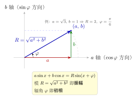

# 第16章：振幅相位与简谐模型

> 把多个三角项压成一个“振幅 + 相位”形式，是三角函数从纯计算走向建模和信号理解的关键一步。

## 学习目标

完成本章学习后，你将能够：

1. 理解辅助角公式的来源与意义
2. 把 $a\sin x+b\cos x$ 写成单个正弦或余弦函数
3. 从结果中读取振幅、相位和周期信息
4. 理解简谐运动和交流信号中的三角表示
5. 为信号、相量和 Fourier 章节建立桥梁

---

## 正文内容

## 16.1 为什么要压成单个三角函数

表达式

$$
a\sin x+b\cos x
$$

表面上像两个函数之和，但在很多场景中它更适合写成：

$$
R\sin(x+\varphi)
$$

这样做的好处是：

- 值域立刻可读
- 振幅立刻可读
- 相位直观明确
- 和实际周期模型直接对应

---

## 16.2 辅助角公式的推导

设

$$
a\sin x+b\cos x=R\sin(x+\varphi)
$$

展开右边：

$$
R\sin x\cos\varphi+R\cos x\sin\varphi
$$

比较系数：

$$
R\cos\varphi=a,
\qquad
R\sin\varphi=b
$$

因此：

$$
R=\sqrt{a^2+b^2}
$$

所以值域直接变成：

$$
[-R,R]
$$

这说明辅助角公式既是代数技巧，也是建模语言。

把 $(a,b)$ 看成平面上的一个向量，辅助角公式就有了清晰的几何解释：向量的**模** $R=\sqrt{a^2+b^2}$ 正是合成波的振幅，向量的**辐角** $\varphi$ 正是初相。于是「两项之和」被理解成「一个向量」，振幅与相位一目了然。

---

## 16.3 例题一：压缩线性组合

把

$$
\sqrt3\sin t+\cos t
$$

化成单个正弦函数。

**解**：

设

$$
\sqrt3\sin t+\cos t=R\sin(t+\varphi)
$$

则

$$
R=\sqrt{3+1}=2
$$

并且

$$
2\cos\varphi=\sqrt3,
\qquad
2\sin\varphi=1
$$

所以

$$
\cos\varphi=\frac{\sqrt3}{2},
\qquad
\sin\varphi=\frac12
$$

即

$$
\varphi=\frac\pi6
$$

故：

$$
\sqrt3\sin t+\cos t=2\sin\left(t+\frac\pi6\right)
$$

---

## 16.4 图像与振幅相位解释

压缩后的表达式

$$
R\sin(x+\varphi)
$$

告诉我们三件事：

- 振幅是 $R$
- 水平平移由 $\varphi$ 决定
- 形状仍然是标准正弦波

所以看似复杂的线性组合，本质上只是“起点不同、振幅不同”的同一类波形。

这在周期建模和信号分析中非常重要。

---

## 16.5 简谐模型

典型简谐运动可写成：

$$
x(t)=A\sin(\omega t+\varphi)
$$

其中：

- $A$：振幅
- $\omega$：角频率
- $\varphi$：初相

这和本章的辅助角公式本质上是同一种结构。

所以，辅助角不是“竞赛技巧”，而是周期现象建模的核心语法。

---

## 16.6 常见误区与检查清单

- 是否能算出 $R$，却不会解释相位？
- 是否混淆了“值域”和“振幅”？
- 是否没有把辅助角结果解释回图像和实际系统？
- 是否忘了正弦和余弦之间也可以互相转换？

---

## 本章小结

| 主题 | 结论 |
|------|------|
| 核心工具 | 辅助角公式 |
| 主要收益 | 压缩结构、直接读出振幅与相位 |
| 应用对象 | 简谐运动、交流信号、相量 |
| 方法意义 | 从代数表达走向周期建模 |

---

## 分级例题精练

> 本节精选 6 道例题，分三档难度：**初中基础 ★** / **高中核心 ★★** / **高阶拓展 ★★★**（本章侧重高中核心与高阶拓展）。每题含【题目】【解】【点评】，建议先自行尝试再看解。

### 例题精练 1（★★ 高中核心）

**题目**：把 $f(x)=\sin x-\sqrt3\cos x$ 化成 $R\sin(x+\varphi)$ 的形式，并写出它的振幅、最小正周期和最大值。

**解**：

设 $\sin x-\sqrt3\cos x=R\sin(x+\varphi)=R\cos\varphi\sin x+R\sin\varphi\cos x$。比较系数：

$$
R\cos\varphi=1,\qquad R\sin\varphi=-\sqrt3
$$

于是

$$
R=\sqrt{1^2+(-\sqrt3)^2}=\sqrt4=2
$$

且

$$
\cos\varphi=\frac12,\qquad\sin\varphi=-\frac{\sqrt3}{2}
$$

取 $\varphi=-\dfrac\pi3$，故

$$
f(x)=2\sin\left(x-\frac\pi3\right)
$$

振幅为 $R=2$；周期 $T=\dfrac{2\pi}{1}=2\pi$；最大值为 $R=2$（在 $x-\dfrac\pi3=\dfrac\pi2$，即 $x=\dfrac{5\pi}{6}+2k\pi$ 时取得）。

**点评**：系数 $b=-\sqrt3$ 为负，决定了 $\sin\varphi<0$，因此 $\varphi$ 落在第四象限，取负角最自然。务必让 $\cos\varphi$、$\sin\varphi$ 的符号同时满足，单看一个三角值会丢失象限信息。

### 例题精练 2（★★ 高中核心）

**题目**：求函数 $y=3\sin x+4\cos x$ 在 $x\in[0,\pi]$ 上的值域。

**解**：

先合成：$R=\sqrt{3^2+4^2}=5$，设 $y=5\sin(x+\varphi)$，其中 $\cos\varphi=\dfrac35,\ \sin\varphi=\dfrac45$，即 $\varphi=\arctan\dfrac43\approx0.927$（第一象限锐角）。

当 $x\in[0,\pi]$ 时，相位

$$
x+\varphi\in[\varphi,\ \pi+\varphi]\approx[0.927,\ 4.069]
$$

这个区间包含 $\dfrac\pi2\approx1.571$，故 $\sin(x+\varphi)$ 能取到最大值 $1$，此时 $y=5$。

端点值：$x=0$ 时 $y=4$；$x=\pi$ 时 $y=3\sin\pi+4\cos\pi=-4$。区间右端 $\pi+\varphi\approx4.069$ 已越过 $\sin$ 的最小点 $\dfrac{3\pi}{2}\approx4.712$ 之前，但要看 $\sin(x+\varphi)$ 在 $[\varphi,\pi+\varphi]$ 上的最小值：在该闭区间内 $\sin$ 最小值出现在端点 $x+\varphi=\pi+\varphi$ 处，$\sin(\pi+\varphi)=-\sin\varphi=-\dfrac45$，对应 $y=5\cdot(-\dfrac45)=-4$。

故值域为

$$
\boxed{[-4,\,5]}
$$

**点评**：合成后求区间值域的关键是把 $x$ 的范围平移成相位 $x+\varphi$ 的范围，再在该区间上判断 $\sin$ 能否到达 $\pm1$ 的峰值，到不了时才比较端点。直接用原式逐点试探容易漏掉内部最大值点。

### 例题精练 3（★★★ 高阶拓展）

**题目**：解方程 $\sin x+\cos x=\sqrt2\sin\left(2x\right)$ 在 $x\in[0,2\pi)$ 上的所有解。

**解**：

左边合成：$\sin x+\cos x=\sqrt2\sin\left(x+\dfrac\pi4\right)$。方程化为

$$
\sqrt2\sin\left(x+\frac\pi4\right)=\sqrt2\sin 2x
$$

即

$$
\sin\left(x+\frac\pi4\right)=\sin 2x
$$

由 $\sin A=\sin B\iff A=B+2k\pi$ 或 $A=\pi-B+2k\pi$：

情形一：$2x=x+\dfrac\pi4+2k\pi\Rightarrow x=\dfrac\pi4+2k\pi$。在 $[0,2\pi)$ 内：$x=\dfrac\pi4$。

情形二：$2x=\pi-\left(x+\dfrac\pi4\right)+2k\pi\Rightarrow 3x=\dfrac{3\pi}{4}+2k\pi\Rightarrow x=\dfrac\pi4+\dfrac{2k\pi}{3}$。在 $[0,2\pi)$ 内取 $k=0,1,2$：

$$
x=\frac\pi4,\quad x=\frac\pi4+\frac{2\pi}{3}=\frac{11\pi}{12},\quad x=\frac\pi4+\frac{4\pi}{3}=\frac{19\pi}{12}
$$

合并去重，解集为

$$
\boxed{\left\{\frac\pi4,\ \frac{11\pi}{12},\ \frac{19\pi}{12}\right\}}
$$

代入验证 $x=\dfrac{11\pi}{12}$：左边 $\sqrt2\sin\left(\dfrac{11\pi}{12}+\dfrac\pi4\right)=\sqrt2\sin\dfrac{7\pi}{6}=\sqrt2\cdot(-\dfrac12)=-\dfrac{\sqrt2}{2}$；右边 $\sqrt2\sin\dfrac{11\pi}{6}=\sqrt2\cdot(-\dfrac12)=-\dfrac{\sqrt2}{2}$ ✓。

**点评**：辅助角把杂乱的左边收成单个正弦，于是问题变成 $\sin A=\sin B$ 的标准形式。注意 $\sin$ 相等有两族解，不能只取 $A=B$ 那一支，否则会漏解。

### 例题精练 4（★★★ 高阶拓展）

**题目**：两个同频简谐振动叠加 $x_1(t)=3\sin(\omega t)$、$x_2(t)=4\sin\left(\omega t+\dfrac\pi2\right)$，求合振动 $x(t)=x_1(t)+x_2(t)$ 的振幅与初相。

**解**：

由 $\sin\left(\omega t+\dfrac\pi2\right)=\cos\omega t$，得

$$
x(t)=3\sin\omega t+4\cos\omega t
$$

合成为 $R\sin(\omega t+\varphi)$，其中

$$
R=\sqrt{3^2+4^2}=5
$$

且 $R\cos\varphi=3,\ R\sin\varphi=4$，即 $\cos\varphi=\dfrac35,\ \sin\varphi=\dfrac45$，$\varphi=\arctan\dfrac43\approx0.927\text{ rad}\approx53.13^\circ$。

故合振动

$$
x(t)=5\sin(\omega t+\varphi),\qquad \text{振幅 }5,\ \text{初相 }\varphi=\arctan\frac43
$$

**点评**：同频简谐叠加仍是同频简谐，这正是辅助角公式的物理意义。本题两分量相位差恰为 $\dfrac\pi2$（正交），故合振幅满足勾股关系 $R=\sqrt{A_1^2+A_2^2}$；一般相位差 $\Delta$ 时应使用 $R=\sqrt{A_1^2+A_2^2+2A_1A_2\cos\Delta}$。

### 例题精练 5（★★★ 高阶拓展）

**题目**：求 $f(x)=\sin x+\cos x+\sin x\cos x$ 的最大值。

**解**：

令 $u=\sin x+\cos x=\sqrt2\sin\left(x+\dfrac\pi4\right)$，则 $u\in[-\sqrt2,\sqrt2]$。

由 $u^2=1+2\sin x\cos x$，得 $\sin x\cos x=\dfrac{u^2-1}{2}$。于是

$$
f=u+\frac{u^2-1}{2}=\frac12u^2+u-\frac12=\frac12(u+1)^2-1
$$

这是关于 $u$ 的开口向上抛物线，在 $u\in[-\sqrt2,\sqrt2]$ 上于右端点 $u=\sqrt2$ 取最大：

$$
f_{\max}=\frac12(\sqrt2+1)^2-1=\frac12(3+2\sqrt2)-1=\frac12+\sqrt2
$$

即

$$
\boxed{f_{\max}=\frac12+\sqrt2}
$$

**点评**：辅助角公式在这里不仅压缩了 $\sin x+\cos x$，更通过 $u$ 的取值范围 $[-\sqrt2,\sqrt2]$ 把三角最值彻底转化为一元二次函数在闭区间上的最值，这是“换元降维”的典型范例。注意端点取值要落在 $u$ 的实际可达范围内。

### 例题精练 6（★★★ 高阶拓展）

**题目**：交流电路中电压 $u(t)=U_m\cos(\omega t)$，电流 $i(t)=I_m\cos(\omega t-\dfrac\pi3)$。求瞬时功率 $p(t)=u(t)\,i(t)$ 的平均值（在一个周期内）。

**解**：

$$
p(t)=U_mI_m\cos(\omega t)\cos\left(\omega t-\frac\pi3\right)
$$

用积化和差 $\cos A\cos B=\dfrac12[\cos(A-B)+\cos(A+B)]$，取 $A=\omega t,\ B=\omega t-\dfrac\pi3$：

$$
p(t)=\frac{U_mI_m}{2}\left[\cos\frac\pi3+\cos\left(2\omega t-\frac\pi3\right)\right]
$$

第一项 $\cos\dfrac\pi3=\dfrac12$ 为常数；第二项 $\cos\left(2\omega t-\dfrac\pi3\right)$ 是角频率 $2\omega$ 的正弦型函数，在一个周期内积分为零，平均值为 $0$。故平均功率

$$
\bar p=\frac{U_mI_m}{2}\cos\frac\pi3=\frac{U_mI_m}{2}\cdot\frac12=\frac{U_mI_m}{4}
$$

写成有效值形式：$U=\dfrac{U_m}{\sqrt2},\ I=\dfrac{I_m}{\sqrt2}$，则

$$
\bar p=\frac{U_mI_m}{2}\cos\varphi=UI\cos\varphi,\qquad \varphi=\frac\pi3
$$

即

$$
\boxed{\bar p=\frac{U_mI_m}{4}=UI\cos\frac\pi3}
$$

**点评**：积化和差把乘积拆成「直流分量 + 二倍频分量」，二倍频部分一周期平均为零，剩下的常数项就给出了平均功率公式 $\bar p=UI\cos\varphi$，其中 $\varphi$ 是电压电流的相位差，$\cos\varphi$ 即功率因数。这是辅助角与积化和差思想在电工学中的直接落地。

---

## 练习题

1. 为什么辅助角公式能直接给出值域？
2. 把 $5\sin x-12\cos x$ 化成单个三角函数。 
3. 为什么辅助角公式既是代数技巧，也是建模语言？
4. 画出 $R\sin(x+\varphi)$ 的图像，说明振幅和相位如何体现。 
5. 设计一个简谐运动例子，并写出对应模型。
