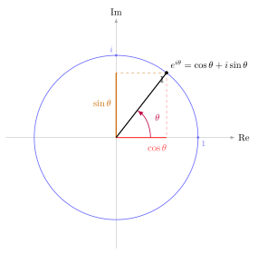

# 第19章：复平面与欧拉公式

> 欧拉公式是三角函数进入高阶数学的关键节点：它把旋转、三角函数和指数函数统一成同一个对象。

## 学习目标

完成本章学习后，你将能够：

1. 理解复数极形式与旋转的关系
2. 理解并使用欧拉公式 $e^{i\theta}=\cos\theta+i\sin\theta$
3. 用欧拉公式重新推导和角公式
4. 从复平面解释三角函数的几何意义
5. 为 De Moivre 与 Fourier 章节建立桥梁

---

## 正文内容

## 19.1 为什么欧拉公式重要

在初等三角里，旋转和函数值通常被分开讨论。欧拉公式把二者统一成：

$$
e^{i\theta}=\cos\theta+i\sin\theta
$$

它的意义在于：

- 指数函数开始和旋转相关
- 乘法开始对应角度相加
- 三角恒等式开始可以通过复数乘法得到

这就是为什么欧拉公式常被看作连接初等三角与高阶数学的桥。

### 欧拉公式的推导

从 $e^x$ 的幂级数出发，将 $x$ 替换为 $i\theta$：

$$e^{i\theta} = \sum_{n=0}^{\infty}\frac{(i\theta)^n}{n!} = 1 + i\theta + \frac{(i\theta)^2}{2!} + \frac{(i\theta)^3}{3!} + \frac{(i\theta)^4}{4!} + \cdots$$

利用 $i^2 = -1$，$i^3 = -i$，$i^4 = 1$ 的循环，将实部和虚部分开：

$$= \underbrace{\left(1 - \frac{\theta^2}{2!} + \frac{\theta^4}{4!} - \cdots\right)}_{\cos\theta} + i\underbrace{\left(\theta - \frac{\theta^3}{3!} + \frac{\theta^5}{5!} - \cdots\right)}_{\sin\theta}$$

这正是 $\cos\theta$ 和 $\sin\theta$ 的Taylor级数！因此：

$$\boxed{e^{i\theta} = \cos\theta + i\sin\theta}$$

**特殊值**：令 $\theta = \pi$，得到被称为"最美数学公式"的 **Euler 恒等式**：$e^{i\pi} + 1 = 0$。

---

## 19.2 复数极形式

一个复数可以写成：

$$
z=r(\cos\theta+i\sin\theta)
$$

其中：

- $r$ 是模长
- $\theta$ 是辐角

这意味着复数不仅是“实部 + 虚部”，也是“长度 + 方向”。 
从这个视角看，复数乘法就不再神秘：

- 模长相乘
- 角度相加

---

## 19.3 欧拉公式与旋转

若把单位复数

$$
e^{i\theta}
$$

看成复平面上的点，那么乘上它就等于把一个向量逆时针旋转角度 $\theta$。

所以：

$$
e^{i\alpha}e^{i\beta}=e^{i(\alpha+\beta)}
$$

在几何上对应“两次旋转叠加为一次总旋转”。

---

## 19.4 例题：用欧拉公式推出和角公式

由

$$
e^{i(\alpha+\beta)}=e^{i\alpha}e^{i\beta}
$$

左边展开：

$$
\cos(\alpha+\beta)+i\sin(\alpha+\beta)
$$

右边展开：

$$
(\cos\alpha+i\sin\alpha)(\cos\beta+i\sin\beta)
$$

$$
=(\cos\alpha\cos\beta-\sin\alpha\sin\beta)
+i(\sin\alpha\cos\beta+\cos\alpha\sin\beta)
$$

比较实部和虚部，得到：

$$
\cos(\alpha+\beta)=\cos\alpha\cos\beta-\sin\alpha\sin\beta
$$

$$
\sin(\alpha+\beta)=\sin\alpha\cos\beta+\cos\alpha\sin\beta
$$

这说明和角公式也可以被理解为复指数乘法的结果。

---

## 19.5 图像与结构分析

欧拉公式其实统一了三种对象：

| 对象 | 解释 |
|------|------|
| 旋转 | 角度变化 |
| 三角函数 | 坐标投影 |
| 复指数 | 一个可乘的旋转编码 |

这个统一视角是本章最大的价值。 
一旦接受它，很多高阶公式都会从“难记公式”变成“几何与代数同一件事”。

---

## 19.6 常见误区与检查清单

- 是否把欧拉公式只当成一个公式，而忽略它表示旋转？
- 是否忘了比较实部、虚部是推导三角公式的关键手段？
- 是否把复数乘法只理解成代数运算，而不看几何意义？

---

## 本章小结

| 主题 | 结论 |
|------|------|
| 核心公式 | $e^{i\theta}=\cos\theta+i\sin\theta$ |
| 几何意义 | 乘以单位复数就是旋转 |
| 代数收益 | 和角公式可由复数乘法推出 |
| 连接作用 | 统一三角函数、旋转与指数函数 |

---

## 分级例题精练

> 本节精选 6 道例题，分三档难度：**初中基础 ★** / **高中核心 ★★** / **高阶拓展 ★★★**（本章侧重高中核心与高阶拓展）。每题含【题目】【解】【点评】，建议先自行尝试再看解。

### 例题精练 1（★★ 高中核心）

**题目**：把复数 $z=1+\sqrt{3}\,i$ 写成极形式 $r(\cos\theta+i\sin\theta)$ 与指数形式 $re^{i\theta}$。

**解**：先求模长

$$r=|z|=\sqrt{1^2+(\sqrt{3})^2}=\sqrt{1+3}=2.$$

再求辐角。由 $\cos\theta=\dfrac{1}{2}$，$\sin\theta=\dfrac{\sqrt{3}}{2}$，且 $z$ 位于第一象限，得 $\theta=\dfrac{\pi}{3}$。于是

$$z=2\left(\cos\frac{\pi}{3}+i\sin\frac{\pi}{3}\right)=2e^{i\pi/3}.$$

**点评**：化极形式分两步——模长用勾股，辐角靠 $\cos\theta,\sin\theta$ 的符号定象限。务必同时看实部与虚部的正负来确定辐角落在哪个象限，单凭 $\tan\theta=\sqrt{3}$ 会漏掉第三象限的同正切值。

### 例题精练 2（★★ 高中核心）

**题目**：设 $z_1=2e^{i\pi/4}$，$z_2=3e^{i\pi/6}$。求 $z_1z_2$ 与 $\dfrac{z_1}{z_2}$ 的模与辐角。

**解**：指数形式下乘法是“模相乘、辐角相加”，除法是“模相除、辐角相减”：

$$z_1z_2=2\cdot3\,e^{i(\pi/4+\pi/6)}=6\,e^{i\cdot 5\pi/12},$$

故模为 $6$，辐角为 $\dfrac{5\pi}{12}$。

$$\frac{z_1}{z_2}=\frac{2}{3}\,e^{i(\pi/4-\pi/6)}=\frac{2}{3}\,e^{i\pi/12},$$

故模为 $\dfrac{2}{3}$，辐角为 $\dfrac{\pi}{12}$。

其中 $\dfrac{\pi}{4}+\dfrac{\pi}{6}=\dfrac{3\pi+2\pi}{12}=\dfrac{5\pi}{12}$，$\dfrac{\pi}{4}-\dfrac{\pi}{6}=\dfrac{3\pi-2\pi}{12}=\dfrac{\pi}{12}$。

**点评**：这是欧拉公式最实用的红利——复数乘除从“分配律展开”变成“模与辐角各自的加减”。把角度先通分再相加是避免出错的关键。

### 例题精练 3（★★ 高中核心）

**题目**：用欧拉公式推导二倍角公式 $\cos2\theta=\cos^2\theta-\sin^2\theta$ 与 $\sin2\theta=2\sin\theta\cos\theta$。

**解**：由 $e^{i\cdot2\theta}=\left(e^{i\theta}\right)^2$，左边按欧拉公式为

$$e^{i2\theta}=\cos2\theta+i\sin2\theta.$$

右边展开：

$$\left(\cos\theta+i\sin\theta\right)^2=\cos^2\theta+2i\sin\theta\cos\theta+i^2\sin^2\theta=\left(\cos^2\theta-\sin^2\theta\right)+i\left(2\sin\theta\cos\theta\right).$$

比较实部与虚部：

$$\cos2\theta=\cos^2\theta-\sin^2\theta,\qquad \sin2\theta=2\sin\theta\cos\theta.$$

**点评**：二倍角不过是和角公式取 $\alpha=\beta=\theta$ 的特例，用复指数“平方”一步到位。注意 $i^2=-1$ 把虚部里的 $\sin^2\theta$ 翻成实部的负号，这正是 $\cos2\theta$ 出现减号的来源。

### 例题精练 4（★★★ 高阶拓展）

**题目**：利用复指数求和 $C=\displaystyle\sum_{k=0}^{n-1}\cos k\theta$（设 $\theta\neq2m\pi$）。

**解**：考虑复数和

$$S=\sum_{k=0}^{n-1}e^{ik\theta}=\sum_{k=0}^{n-1}\left(e^{i\theta}\right)^k,$$

这是首项 $1$、公比 $q=e^{i\theta}$ 的等比数列（$q\neq1$ 因 $\theta\neq2m\pi$）：

$$S=\frac{1-e^{in\theta}}{1-e^{i\theta}}.$$

用“提一半角”技巧把分子分母对称化。分子

$$1-e^{in\theta}=e^{in\theta/2}\left(e^{-in\theta/2}-e^{in\theta/2}\right)=e^{in\theta/2}\left(-2i\sin\frac{n\theta}{2}\right),$$

分母同理 $1-e^{i\theta}=e^{i\theta/2}\left(-2i\sin\dfrac{\theta}{2}\right)$。相除：

$$S=e^{i(n-1)\theta/2}\cdot\frac{\sin\dfrac{n\theta}{2}}{\sin\dfrac{\theta}{2}}.$$

取实部即得（$C=\operatorname{Re}S$）：

$$C=\sum_{k=0}^{n-1}\cos k\theta=\frac{\sin\dfrac{n\theta}{2}}{\sin\dfrac{\theta}{2}}\cos\frac{(n-1)\theta}{2}.$$

**点评**：把三角级数“升级”成等比数列是复指数最漂亮的应用。关键技巧是分子分母各提出半角因子 $e^{i\theta/2}$，制造出 $e^{ix}-e^{-ix}=2i\sin x$ 的结构，余角因子合并后辐角恰为 $\dfrac{(n-1)\theta}{2}$。顺带取虚部还能得到 $\sum\sin k\theta$。

### 例题精练 5（★★★ 高阶拓展）

**题目**：证明 $\cos3\theta=4\cos^3\theta-3\cos\theta$。

**解**：由 De Moivre 形式 $e^{i3\theta}=\left(\cos\theta+i\sin\theta\right)^3$，先用二项式展开右边：

$$\left(\cos\theta+i\sin\theta\right)^3=\cos^3\theta+3i\cos^2\theta\sin\theta+3i^2\cos\theta\sin^2\theta+i^3\sin^3\theta.$$

代入 $i^2=-1,\ i^3=-i$，分离实部：

$$\operatorname{Re}=\cos^3\theta-3\cos\theta\sin^2\theta.$$

而左边实部为 $\cos3\theta$，故

$$\cos3\theta=\cos^3\theta-3\cos\theta\sin^2\theta.$$

用 $\sin^2\theta=1-\cos^2\theta$ 消去正弦：

$$\cos3\theta=\cos^3\theta-3\cos\theta\left(1-\cos^2\theta\right)=4\cos^3\theta-3\cos\theta.$$

**点评**：三倍角公式由复指数的立方展开“免费”得到。先取实部得到含 $\sin^2\theta$ 的混合式，再用 $\sin^2\theta=1-\cos^2\theta$ 化成纯 $\cos\theta$ 的多项式——这正是 Chebyshev 多项式 $T_3$ 的雏形。

### 例题精练 6（★★★ 高阶拓展）

**题目**：利用 $\cos\theta=\dfrac{e^{i\theta}+e^{-i\theta}}{2}$ 求积分 $\displaystyle\int_0^{2\pi}\cos^2\theta\,d\theta$。

**解**：把被积函数用复指数展开：

$$\cos^2\theta=\left(\frac{e^{i\theta}+e^{-i\theta}}{2}\right)^2=\frac{e^{i2\theta}+2+e^{-i2\theta}}{4}=\frac{1}{2}+\frac{1}{2}\cdot\frac{e^{i2\theta}+e^{-i2\theta}}{2}=\frac{1}{2}+\frac{1}{2}\cos2\theta.$$

逐项积分。在整周期 $[0,2\pi]$ 上 $\displaystyle\int_0^{2\pi}\cos2\theta\,d\theta=\left[\frac{\sin2\theta}{2}\right]_0^{2\pi}=0$，故

$$\int_0^{2\pi}\cos^2\theta\,d\theta=\int_0^{2\pi}\frac{1}{2}\,d\theta+0=\frac{1}{2}\cdot2\pi=\pi.$$

**点评**：把 $\cos^2\theta$ 用欧拉公式展成 $e^{i2\theta},e^{-i2\theta}$ 与常数的组合，相当于自动完成了降幂。整周期上所有非零频率项积分都归零，只剩常数项贡献——这正是傅里叶分析里“频率正交性”的雏形，为第 21 章埋下伏笔。

---

## 练习题

1. 为什么欧拉公式可以被理解为“旋转的指数表示”？
2. 用欧拉公式重新推出正弦和角公式。 
3. 为什么比较实部和虚部是推导三角恒等式的有效方法？
4. 解释复数乘法中的“模长相乘、角度相加”。 
5. 设计一道需要同时用到欧拉公式与和角公式的题。 
