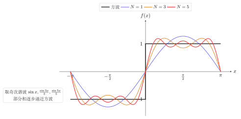

# 第21章：傅里叶级数入门

> 傅里叶思想的核心不是公式，而是：任何足够“规整”的周期函数，都可以拆成不同频率的正弦与余弦叠加。三角函数在这里不再只是求值工具，而是“频率基底”。

## 学习目标

完成本章学习后，你将能够：

1. 理解正弦余弦作为周期函数基底的意义
2. 理解正交性为什么重要
3. 用偶函数/奇函数简化 Fourier 展开
4. 解释 Fourier 级数中的系数到底表示什么
5. 把本章与信号和波动问题联系起来

---

## 正文内容

## 21.1 为什么会有 Fourier 级数

很多周期现象看起来很复杂，例如方波、锯齿波、周期温度变化，但它们都具有共同特征：

- 周期重复
- 可以被频率分解

Fourier 的核心思想是：

> 把复杂周期函数看成不同频率三角函数的叠加。

因此，三角函数在这里的角色不是“目标函数”，而是“基函数”。

---

## 21.2 正交性

Fourier 级数之所以成立，关键在于：

$$
\sin nx,\quad \cos nx
$$

在对称区间上满足正交性。

直观理解：不同频率彼此“互不干扰”，就像线性代数里不同基向量的独立性一样。

这使得我们可以把一个周期函数投影到各个频率分量上，得到不同系数。

---

## 21.3 偶函数与奇函数的简化

### 偶函数

若 $f(x)$ 为偶函数，则 Fourier 展开中只含余弦项。

原因是：

- 偶函数 × 奇函数 = 奇函数
- 奇函数在对称区间积分为 0

### 奇函数

若 $f(x)$ 为奇函数，则 Fourier 展开中只含正弦项。

这条规则非常重要，因为它能大幅减少计算量。

### 例题：为什么偶函数只含余弦项

因为正弦函数是奇函数。若 $f$ 为偶函数，则：

$$
f(x)\sin(nx)
$$

是奇函数，所以其积分系数为 0。

---

## 21.4 Fourier 级数的形式与系数公式

设 $f(x)$ 是周期为 $2\pi$ 的函数，其 Fourier 级数为：

$$f(x) \sim \frac{a_0}{2} + \sum_{n=1}^{\infty}\left(a_n\cos nx + b_n\sin nx\right)$$

**Fourier 系数**由正交性投影确定：

$$\boxed{a_0 = \frac{1}{\pi}\int_{-\pi}^{\pi}f(x)\,dx}$$

$$\boxed{a_n = \frac{1}{\pi}\int_{-\pi}^{\pi}f(x)\cos nx\,dx, \quad n = 1, 2, 3, \ldots}$$

$$\boxed{b_n = \frac{1}{\pi}\int_{-\pi}^{\pi}f(x)\sin nx\,dx, \quad n = 1, 2, 3, \ldots}$$

**推导思路**：在级数两边乘以 $\cos mx$（或 $\sin mx$），对 $[-\pi, \pi]$ 积分，利用三角函数组的正交性（不同频率的乘积积分为零），只有 $n=m$ 的项存活，从而解出 $a_n$（或 $b_n$）。

### 周期为 $2L$ 的推广

若 $f(x)$ 周期为 $2L$，则用 $\frac{n\pi x}{L}$ 代替 $nx$：

$$a_n = \frac{1}{L}\int_{-L}^{L}f(x)\cos\frac{n\pi x}{L}\,dx, \quad b_n = \frac{1}{L}\int_{-L}^{L}f(x)\sin\frac{n\pi x}{L}\,dx$$

### 收敛条件（Dirichlet 条件）

若 $f(x)$ 在一个周期内满足：
1. 分段连续（只有有限个间断点）
2. 分段单调（只有有限个极值点）

则 Fourier 级数收敛，且：
- 在连续点处收敛到 $f(x)$
- 在间断点处收敛到 $\frac{f(x^+)+f(x^-)}{2}$（左右极限的平均值）

### 经典例子：方波的 Fourier 展开

设方波 $f(x) = \begin{cases} 1, & 0 < x < \pi \\ -1, & -\pi < x < 0 \end{cases}$，$f(x)$ 为奇函数，故 $a_n = 0$。

$$b_n = \frac{1}{\pi}\int_{-\pi}^{\pi}f(x)\sin nx\,dx = \frac{2}{\pi}\int_0^\pi \sin nx\,dx = \frac{2}{n\pi}(1-\cos n\pi) = \begin{cases} \frac{4}{n\pi}, & n\text{ 奇} \\ 0, & n\text{ 偶} \end{cases}$$

$$f(x) = \frac{4}{\pi}\left(\sin x + \frac{\sin 3x}{3} + \frac{\sin 5x}{5} + \cdots\right)$$

下图把 $N=1,3,5$（取奇次谐波）的部分和曲线与方波叠加，可以看到随着项数增加，部分和逐步逼近方波（间断点附近的过冲即 Gibbs 现象）：

令 $x = \pi/2$：$1 = \frac{4}{\pi}\left(1 - \frac{1}{3} + \frac{1}{5} - \cdots\right)$，即 **Leibniz 公式** $\frac{\pi}{4} = 1 - \frac{1}{3} + \frac{1}{5} - \frac{1}{7} + \cdots$。

---

## 21.5 Fourier 系数的意义

Fourier 系数不是”神秘常数”，它们代表的是：

- 某个频率分量在原函数中占多大权重
- 哪些频率最强
- 信号更接近低频还是高频结构

所以 Fourier 系数本质上是“频率内容”的度量。

---

## 21.5 例题：最简单的对称函数分析

如果一个周期函数是偶函数，那么它的 Fourier 系数里：

- 所有正弦项系数为 0
- 只需考虑余弦项

这意味着在做傅里叶级数之前，先看函数对称性，往往比直接套公式更重要。

---

## 21.6 本章和前面三角变换的关系

Fourier 级数不是脱离三角变换的新世界，它其实高度依赖：

- 正交性
- 积化和差
- 和差化积
- 周期与相位理解

所以前面学习的“看似考试技巧”的内容，在这里都变成了频率分析工具。

---

## 本章小结

| 主题 | 结论 |
|------|------|
| 核心思想 | 周期函数可拆成不同频率三角函数叠加 |
| 数学基础 | 正交性 |
| 快速简化 | 先看偶函数 / 奇函数 |
| 系数意义 | 代表频率分量权重 |

---

## 分级例题精练

> 本节精选 6 道例题，分三档难度：**初中基础 ★** / **高中核心 ★★** / **高阶拓展 ★★★**（本章侧重高中核心与高阶拓展）。每题含【题目】【解】【点评】，建议先自行尝试再看解。

### 例题精练 1（★★ 高中核心）

**题目**：验证正交关系 $\displaystyle\int_{-\pi}^{\pi}\cos x\,\cos 2x\,dx=0$。

**解**：用积化和差 $\cos A\cos B=\dfrac{1}{2}\left[\cos(A-B)+\cos(A+B)\right]$：

$$\cos x\cos2x=\frac{1}{2}\left[\cos(-x)+\cos3x\right]=\frac{1}{2}\left(\cos x+\cos3x\right).$$

逐项积分，$\cos kx$（$k\neq0$）在整周期 $[-\pi,\pi]$ 上积分为零：

$$\int_{-\pi}^{\pi}\cos x\,dx=\left[\sin x\right]_{-\pi}^{\pi}=0,\qquad \int_{-\pi}^{\pi}\cos3x\,dx=\left[\frac{\sin3x}{3}\right]_{-\pi}^{\pi}=0.$$

故原积分为 $0$。

**点评**：正交性正是傅里叶级数能“逐频率提取系数”的根基。积化和差把两个频率的乘积拆成单频率之和，而每个非零频率的整周期积分都为零——不同频率“互不干扰”由此得到验证。

### 例题精练 2（★★ 高中核心）

**题目**：判断下列函数的傅里叶级数只含正弦项还是只含余弦项：（a）$f(x)=x^2$；（b）$g(x)=x^3$；（c）$h(x)=x\cos x$。（均视为周期 $2\pi$ 的函数。）

**解**：关键是判断奇偶性。

（a）$f(-x)=(-x)^2=x^2=f(x)$，偶函数 → 只含余弦项（含常数项 $\tfrac{a_0}{2}$）。

（b）$g(-x)=(-x)^3=-x^3=-g(x)$，奇函数 → 只含正弦项。

（c）$h(-x)=(-x)\cos(-x)=-x\cos x=-h(x)$，奇函数（奇 × 偶 = 奇）→ 只含正弦项。

**点评**：动手算积分前先看对称性能省一半工作量。偶函数 $b_n=0$，奇函数 $a_n=0$。判断 (c) 时用到“奇函数乘偶函数为奇函数”，$x$ 是奇、$\cos x$ 是偶，乘积仍为奇。

### 例题精练 3（★★ 高中核心）

**题目**：求函数 $f(x)=x$（$-\pi<x<\pi$，周期 $2\pi$）的傅里叶正弦系数 $b_n$。

**解**：$f(x)=x$ 是奇函数，故所有 $a_n=0$，只需算

$$b_n=\frac{1}{\pi}\int_{-\pi}^{\pi}x\sin nx\,dx=\frac{2}{\pi}\int_0^{\pi}x\sin nx\,dx$$

（被积函数 $x\sin nx$ 为偶函数，故用两倍半区间）。分部积分，令 $u=x,\ dv=\sin nx\,dx$，则 $v=-\dfrac{\cos nx}{n}$：

$$\int_0^{\pi}x\sin nx\,dx=\left[-\frac{x\cos nx}{n}\right]_0^{\pi}+\frac{1}{n}\int_0^{\pi}\cos nx\,dx=-\frac{\pi\cos n\pi}{n}+\frac{1}{n}\left[\frac{\sin nx}{n}\right]_0^{\pi}.$$

末项 $\sin n\pi=0$ 故为零，而 $\cos n\pi=(-1)^n$，于是

$$b_n=\frac{2}{\pi}\cdot\left(-\frac{\pi(-1)^n}{n}\right)=-\frac{2(-1)^n}{n}=\frac{2(-1)^{n+1}}{n}.$$

即 $f(x)=x\sim\displaystyle\sum_{n=1}^{\infty}\frac{2(-1)^{n+1}}{n}\sin nx=2\left(\sin x-\frac{\sin2x}{2}+\frac{\sin3x}{3}-\cdots\right)$。

**点评**：这是经典的“锯齿波”展开。先用奇偶性砍掉 $a_n$，再对 $x\sin nx$ 分部积分。注意 $\cos n\pi=(-1)^n$ 是处理这类积分的常用结果，符号交替正源于此。

### 例题精练 4（★★★ 高阶拓展）

**题目**：求偶函数锯齿 $f(x)=|x|$（$-\pi\le x\le\pi$，周期 $2\pi$）的傅里叶级数。

**解**：$f(x)=|x|$ 是偶函数，故 $b_n=0$。先求常数项相关的 $a_0$：

$$a_0=\frac{1}{\pi}\int_{-\pi}^{\pi}|x|\,dx=\frac{2}{\pi}\int_0^{\pi}x\,dx=\frac{2}{\pi}\cdot\frac{\pi^2}{2}=\pi.$$

再求 $a_n$（$n\ge1$），同样用偶函数化为两倍半区间：

$$a_n=\frac{1}{\pi}\int_{-\pi}^{\pi}|x|\cos nx\,dx=\frac{2}{\pi}\int_0^{\pi}x\cos nx\,dx.$$

分部积分（$u=x,\ dv=\cos nx\,dx,\ v=\tfrac{\sin nx}{n}$）：

$$\int_0^{\pi}x\cos nx\,dx=\left[\frac{x\sin nx}{n}\right]_0^{\pi}-\frac{1}{n}\int_0^{\pi}\sin nx\,dx=0+\frac{1}{n}\left[\frac{\cos nx}{n}\right]_0^{\pi}=\frac{\cos n\pi-1}{n^2}.$$

（首项含 $\sin n\pi=0$。）故

$$a_n=\frac{2}{\pi}\cdot\frac{(-1)^n-1}{n^2}=\begin{cases}-\dfrac{4}{\pi n^2}, & n\text{ 为奇数}\\[2mm] 0, & n\text{ 为偶数}.\end{cases}$$

于是

$$|x|=\frac{\pi}{2}-\frac{4}{\pi}\left(\frac{\cos x}{1^2}+\frac{\cos3x}{3^2}+\frac{\cos5x}{5^2}+\cdots\right).$$

**点评**：偶函数只剩余弦项与常数项 $\tfrac{a_0}{2}=\tfrac{\pi}{2}$。在连续点处令 $x=0$ 可得 $0=\dfrac{\pi}{2}-\dfrac{4}{\pi}\left(1+\dfrac{1}{9}+\dfrac{1}{25}+\cdots\right)$，从而 $\displaystyle\sum_{k\ge0}\frac{1}{(2k+1)^2}=\frac{\pi^2}{8}$——傅里叶级数顺手给出一个著名级数和。

### 例题精练 5（★★★ 高阶拓展）

**题目**：用复指数形式的傅里叶级数 $f(x)=\displaystyle\sum_{n=-\infty}^{\infty}c_n e^{inx}$（其中 $c_n=\dfrac{1}{2\pi}\displaystyle\int_{-\pi}^{\pi}f(x)e^{-inx}\,dx$）求 $f(x)=e^x$（$-\pi<x<\pi$，周期 $2\pi$）的复系数 $c_n$。

**解**：直接代入积分：

$$c_n=\frac{1}{2\pi}\int_{-\pi}^{\pi}e^x\,e^{-inx}\,dx=\frac{1}{2\pi}\int_{-\pi}^{\pi}e^{(1-in)x}\,dx=\frac{1}{2\pi}\cdot\frac{e^{(1-in)x}}{1-in}\Bigg|_{-\pi}^{\pi}.$$

代入上下限：

$$=\frac{1}{2\pi(1-in)}\left(e^{(1-in)\pi}-e^{-(1-in)\pi}\right)=\frac{1}{2\pi(1-in)}\left(e^{\pi}e^{-in\pi}-e^{-\pi}e^{in\pi}\right).$$

由于 $e^{\pm in\pi}=(-1)^n$（整数 $n$），两项的指数因子相同：

$$=\frac{(-1)^n}{2\pi(1-in)}\left(e^{\pi}-e^{-\pi}\right)=\frac{(-1)^n\sinh\pi}{\pi(1-in)}.$$

可进一步把分母有理化为 $\dfrac{(-1)^n\sinh\pi}{\pi}\cdot\dfrac{1+in}{1+n^2}$。

**点评**：复指数形式把 $a_n,b_n$ 两套系数合并成一套 $c_n$，且积分 $\int e^{(1-in)x}dx$ 一步完成，远比对 $e^x\cos nx$ 反复分部积分简洁。关键化简是 $e^{in\pi}=e^{-in\pi}=(-1)^n$ 以及 $e^{\pi}-e^{-\pi}=2\sinh\pi$。

### 例题精练 6（★★★ 高阶拓展）

**题目**：利用 Parseval 等式 $\dfrac{1}{\pi}\displaystyle\int_{-\pi}^{\pi}\left[f(x)\right]^2dx=\dfrac{a_0^2}{2}+\displaystyle\sum_{n=1}^{\infty}\left(a_n^2+b_n^2\right)$，对例题 3 的锯齿波 $f(x)=x$ 求 $\displaystyle\sum_{n=1}^{\infty}\frac{1}{n^2}$。

**解**：先算左边。$f(x)=x$ 在 $[-\pi,\pi]$ 上

$$\frac{1}{\pi}\int_{-\pi}^{\pi}x^2\,dx=\frac{1}{\pi}\cdot\frac{2\pi^3}{3}=\frac{2\pi^2}{3}.$$

右边：由例题 3 知 $a_0=0,\ a_n=0,\ b_n=\dfrac{2(-1)^{n+1}}{n}$，故 $b_n^2=\dfrac{4}{n^2}$。于是 Parseval 等式给出

$$\frac{2\pi^2}{3}=\sum_{n=1}^{\infty}\frac{4}{n^2}=4\sum_{n=1}^{\infty}\frac{1}{n^2}.$$

解得

$$\sum_{n=1}^{\infty}\frac{1}{n^2}=\frac{1}{4}\cdot\frac{2\pi^2}{3}=\frac{\pi^2}{6}.$$

**点评**：Parseval 等式说“时域的能量等于各频率分量能量之和”，是正交性的终极体现。它把一个看似与 $\pi$ 无关的级数 $\sum\frac{1}{n^2}$ 与函数的平方积分挂钩，给出 Basel 问题的经典结果 $\dfrac{\pi^2}{6}$。

---

## 练习题

1. 为什么说 Fourier 级数的核心是“分解频率”而不是“写公式”？
2. 为什么偶函数只含余弦项？
3. 为什么奇函数只含正弦项？
4. Fourier 系数在结构上可以解释成什么？
5. 设计一个问题，说明积化和差为什么会在 Fourier 章节里再次出现。
