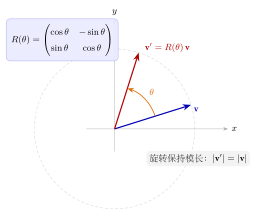

# 第23章：旋转、向量与坐标变换

> 当三角函数进入线性代数和几何变换后，公式不再只是求值工具，而成为“旋转矩阵”和“坐标变换”的结构语言。

## 学习目标

完成本章学习后，你将能够：

1. 理解二维旋转矩阵为何由 $\cos\theta$ 和 $\sin\theta$ 构成
2. 理解向量旋转和单位圆点坐标的关系
3. 用三角函数解释坐标变换和投影
4. 把本章和复数旋转、几何变换联系起来
5. 识别旋转问题中图像与矩阵的双重表达

---

## 正文内容

## 23.1 为什么旋转矩阵里一定会出现三角函数

设单位向量 $(1,0)$ 逆时针旋转角度 $\theta$，新坐标为：

$$
(\cos\theta,\sin\theta)
$$

而原本与其垂直的基向量 $(0,1)$ 旋转后变成：

$$
(-\sin\theta,\cos\theta)
$$

因此旋转矩阵自然写成：

$$
R_\theta=
\begin{pmatrix}
\cos\theta & -\sin\theta \\
\sin\theta & \cos\theta
\end{pmatrix}
$$

这不是死记公式，而是基向量旋转后的坐标拼起来的结果。

---

## 23.2 例题：旋转向量

把向量 $(1,0)$ 逆时针旋转 $\theta$，则：

$$
R_\theta
\begin{pmatrix}1\\0\end{pmatrix}
=
\begin{pmatrix}
\cos\theta\\
\sin\theta
\end{pmatrix}
$$

这说明单位圆上的点坐标其实就是“旋转后的标准基向量”。

下图直观展示了旋转矩阵 $R(\theta)$ 的几何作用：原向量 $\mathbf v$（蓝）被旋转角度 $\theta$ 得到 $\mathbf v'=R(\theta)\mathbf v$（红），二者夹角为 $\theta$，且模长保持不变（$|\mathbf v'|=|\mathbf v|$，落在同一虚线圆上）。

---

## 23.3 点积与夹角

向量夹角公式：

$$
\mathbf a\cdot \mathbf b = |\mathbf a||\mathbf b|\cos\theta
$$

它说明：

- 余弦不是孤立函数
- 它直接衡量“方向相似程度”

因此三角函数和向量几何本来就是紧密耦合的。

---

## 23.4 坐标变换的意义

旋转矩阵的一个关键作用是：

- 原来难看的几何对象，可能在新坐标系下变简单
- 原来斜着的方向，可能转成坐标轴方向

所以三角函数在这里的角色，不是“求值”，而是“组织几何结构”。

---

## 23.5 三维旋转矩阵

在三维中，绕坐标轴的旋转由以下矩阵描述：

**绕 $z$ 轴旋转** $\theta$（$xy$ 平面内旋转，$z$ 不变）：

$$R_z(\theta) = \begin{pmatrix} \cos\theta & -\sin\theta & 0 \\ \sin\theta & \cos\theta & 0 \\ 0 & 0 & 1 \end{pmatrix}$$

**绕 $x$ 轴旋转** $\theta$：

$$R_x(\theta) = \begin{pmatrix} 1 & 0 & 0 \\ 0 & \cos\theta & -\sin\theta \\ 0 & \sin\theta & \cos\theta \end{pmatrix}$$

**绕 $y$ 轴旋转** $\theta$：

$$R_y(\theta) = \begin{pmatrix} \cos\theta & 0 & \sin\theta \\ 0 & 1 & 0 \\ -\sin\theta & 0 & \cos\theta \end{pmatrix}$$

**性质**：所有旋转矩阵都是正交矩阵（$R^TR = I$），且 $\det R = 1$。

**组合旋转**：绕不同轴依次旋转等价于矩阵乘积。但三维旋转**不满足交换律**：$R_x(\alpha)R_z(\beta) \neq R_z(\beta)R_x(\alpha)$。

### 例题：将 $(1, 0, 0)$ 绕 $z$ 轴旋转 $90°$

$$R_z(90°)\begin{pmatrix}1\\0\\0\end{pmatrix} = \begin{pmatrix}0&-1&0\\1&0&0\\0&0&1\end{pmatrix}\begin{pmatrix}1\\0\\0\end{pmatrix} = \begin{pmatrix}0\\1\\0\end{pmatrix}$$

$x$ 轴上的点转到了 $y$ 轴上，符合直觉。

---

## 23.6 与复数旋转的统一

在复平面里，乘以

$$
e^{i\theta}
$$

对应逆时针旋转角度 $\theta$。 
而在线性代数里，乘以旋转矩阵也对应相同几何动作。

这说明：

- 复数乘法和旋转矩阵是同一几何现象的两种表示
- 三角函数在二者之间充当桥梁

---

## 23.6 本章小结

| 主题 | 结论 |
|------|------|
| 旋转矩阵 | 本质是基向量旋转后的坐标拼接 |
| 单位圆 | 给出旋转后向量坐标 |
| 余弦 | 可解释夹角与方向相似度 |
| 高阶联系 | 与复数欧拉公式完全统一 |

---

## 分级例题精练

> 本节精选 6 道例题，分三档难度：**初中基础 ★** / **高中核心 ★★** / **高阶拓展 ★★★**（本章侧重高中核心与高阶拓展）。每题含【题目】【解】【点评】，建议先自行尝试再看解。

### 例题精练 1（★★ 高中核心）

**题目**：把向量 $\mathbf v=(3,4)$ 绕原点逆时针旋转 $90^\circ$，求旋转后的坐标。

**解**：二维旋转矩阵为 $R_\theta=\begin{pmatrix}\cos\theta&-\sin\theta\\ \sin\theta&\cos\theta\end{pmatrix}$。取 $\theta=90^\circ$，有 $\cos 90^\circ=0$、$\sin 90^\circ=1$：

$$R_{90^\circ}=\begin{pmatrix}0&-1\\ 1&0\end{pmatrix}.$$

作用到 $\mathbf v$ 上：

$$R_{90^\circ}\begin{pmatrix}3\\4\end{pmatrix}=\begin{pmatrix}0\cdot 3+(-1)\cdot 4\\ 1\cdot 3+0\cdot 4\end{pmatrix}=\begin{pmatrix}-4\\ 3\end{pmatrix}.$$

旋转后坐标为 $(-4,3)$。

**点评**：逆时针 $90^\circ$ 的效果是 $(x,y)\mapsto(-y,x)$，与矩阵结果一致。可验证旋转不改变模长：$\sqrt{3^2+4^2}=\sqrt{(-4)^2+3^2}=5$。旋转矩阵第一列 $(\cos\theta,\sin\theta)$ 是基向量 $\mathbf e_1$ 的去向，第二列 $(-\sin\theta,\cos\theta)$ 是 $\mathbf e_2$ 的去向，务必记清负号在右上角。

### 例题精练 2（★★ 高中核心）

**题目**：把点 $P=(2,0)$ 绕原点逆时针旋转 $60^\circ$，求旋转后的坐标。

**解**：$\cos 60^\circ=\dfrac12$，$\sin 60^\circ=\dfrac{\sqrt3}{2}$，故

$$R_{60^\circ}=\begin{pmatrix}\tfrac12&-\tfrac{\sqrt3}{2}\\[2pt] \tfrac{\sqrt3}{2}&\tfrac12\end{pmatrix}.$$

作用到 $(2,0)$：

$$\begin{pmatrix}\tfrac12&-\tfrac{\sqrt3}{2}\\[2pt] \tfrac{\sqrt3}{2}&\tfrac12\end{pmatrix}\begin{pmatrix}2\\0\end{pmatrix}=\begin{pmatrix}\tfrac12\cdot 2-\tfrac{\sqrt3}{2}\cdot 0\\[2pt] \tfrac{\sqrt3}{2}\cdot 2+\tfrac12\cdot 0\end{pmatrix}=\begin{pmatrix}1\\ \sqrt3\end{pmatrix}.$$

旋转后坐标为 $(1,\sqrt3)$。

**点评**：起点在正 $x$ 轴上、模长为 $2$ 的向量，旋转 $60^\circ$ 后正是 $2(\cos 60^\circ,\sin 60^\circ)=(1,\sqrt3)$，与单位圆几何一致。这再次印证：把 $(r,0)$ 旋转 $\theta$，结果就是极坐标 $(r\cos\theta,r\sin\theta)$。

### 例题精练 3（★★ 高中核心）

**题目**：已知向量 $\mathbf a=(1,\sqrt3)$、$\mathbf b=(\sqrt3,1)$，用点积公式求它们的夹角。

**解**：点积 $\mathbf a\cdot\mathbf b=1\cdot\sqrt3+\sqrt3\cdot 1=2\sqrt3$。模长

$$|\mathbf a|=\sqrt{1+3}=2,\qquad |\mathbf b|=\sqrt{3+1}=2.$$

由 $\mathbf a\cdot\mathbf b=|\mathbf a||\mathbf b|\cos\theta$：

$$\cos\theta=\frac{2\sqrt3}{2\cdot 2}=\frac{\sqrt3}{2}\ \Rightarrow\ \theta=30^\circ.$$

**点评**：也可从角度直接验证——$\mathbf a$ 与 $x$ 轴成 $60^\circ$（因 $\tan=\sqrt3$），$\mathbf b$ 成 $30^\circ$，差恰为 $30^\circ$。点积公式让“方向相似度”量化为余弦，是连接向量与三角的核心桥梁。

### 例题精练 4（★★★ 高阶拓展）

**题目**：证明二维旋转矩阵满足 $R_\alpha R_\beta=R_{\alpha+\beta}$，并用它解释“先转 $\beta$ 再转 $\alpha$ 等于一次转 $\alpha+\beta$”。

**解**：直接相乘：

$$R_\alpha R_\beta=\begin{pmatrix}\cos\alpha&-\sin\alpha\\ \sin\alpha&\cos\alpha\end{pmatrix}\begin{pmatrix}\cos\beta&-\sin\beta\\ \sin\beta&\cos\beta\end{pmatrix}.$$

逐元素计算。左上元：$\cos\alpha\cos\beta-\sin\alpha\sin\beta=\cos(\alpha+\beta)$。

右上元：$-\cos\alpha\sin\beta-\sin\alpha\cos\beta=-(\sin\alpha\cos\beta+\cos\alpha\sin\beta)=-\sin(\alpha+\beta)$。

左下元：$\sin\alpha\cos\beta+\cos\alpha\sin\beta=\sin(\alpha+\beta)$。

右下元：$-\sin\alpha\sin\beta+\cos\alpha\cos\beta=\cos(\alpha+\beta)$。

于是

$$R_\alpha R_\beta=\begin{pmatrix}\cos(\alpha+\beta)&-\sin(\alpha+\beta)\\ \sin(\alpha+\beta)&\cos(\alpha+\beta)\end{pmatrix}=R_{\alpha+\beta}.$$

**点评**：旋转矩阵的相乘把和角公式“装进了矩阵里”——矩阵恒等式 $R_\alpha R_\beta=R_{\alpha+\beta}$ 与三角和角公式互为表里。这也说明二维旋转构成一个交换群（$R_\alpha R_\beta=R_\beta R_\alpha=R_{\alpha+\beta}$），不同于三维旋转的不可交换性。

### 例题精练 5（★★★ 高阶拓展）

**题目**：求旋转矩阵 $R_\theta$ 的逆矩阵，并说明它的几何意义；以 $\theta=30^\circ$ 验证 $R_\theta^{-1}=R_{-\theta}=R_\theta^{T}$。

**解**：旋转矩阵的逆应当是“转回去”，即 $R_\theta^{-1}=R_{-\theta}$。代入 $\cos(-\theta)=\cos\theta$、$\sin(-\theta)=-\sin\theta$：

$$R_{-\theta}=\begin{pmatrix}\cos\theta&\sin\theta\\ -\sin\theta&\cos\theta\end{pmatrix}=R_\theta^{T}.$$

验证乘积为单位阵：

$$R_\theta R_{-\theta}=\begin{pmatrix}\cos\theta&-\sin\theta\\ \sin\theta&\cos\theta\end{pmatrix}\begin{pmatrix}\cos\theta&\sin\theta\\ -\sin\theta&\cos\theta\end{pmatrix}=\begin{pmatrix}\cos^2\theta+\sin^2\theta&0\\ 0&\sin^2\theta+\cos^2\theta\end{pmatrix}=I.$$

以 $\theta=30^\circ$ 为例：$R_{30^\circ}=\begin{pmatrix}\tfrac{\sqrt3}{2}&-\tfrac12\\[2pt]\tfrac12&\tfrac{\sqrt3}{2}\end{pmatrix}$，其逆为 $R_{-30^\circ}=\begin{pmatrix}\tfrac{\sqrt3}{2}&\tfrac12\\[2pt]-\tfrac12&\tfrac{\sqrt3}{2}\end{pmatrix}$，恰是原矩阵的转置。

**点评**：旋转矩阵是正交矩阵，逆等于转置——求逆不必用一般的伴随/消元法，直接转置即可，且 $\det R_\theta=\cos^2\theta+\sin^2\theta=1$。几何上，逆运算就是反向旋转，这与 $R_\alpha R_\beta=R_{\alpha+\beta}$ 中取 $\beta=-\alpha$ 完全自洽。

### 例题精练 6（★★★ 高阶拓展）

**题目**：把平面向量 $(x,y)$ 看成复数 $z=x+iy$。证明“旋转矩阵作用于向量”与“复数乘以 $e^{i\theta}$”给出相同结果，并以 $z=1+i$、$\theta=45^\circ$ 验证。

**解**：一方面，矩阵作用：

$$R_\theta\begin{pmatrix}x\\y\end{pmatrix}=\begin{pmatrix}x\cos\theta-y\sin\theta\\ x\sin\theta+y\cos\theta\end{pmatrix}.$$

另一方面，复数乘法（用欧拉公式 $e^{i\theta}=\cos\theta+i\sin\theta$）：

$$e^{i\theta}z=(\cos\theta+i\sin\theta)(x+iy)=(x\cos\theta-y\sin\theta)+i(x\sin\theta+y\cos\theta).$$

实部、虚部恰好对应矩阵结果的第一、第二分量，故两种运算等价。

验证：$z=1+i$，$\theta=45^\circ$。复数法：$e^{i45^\circ}=\dfrac{\sqrt2}{2}+i\dfrac{\sqrt2}{2}$，

$$e^{i45^\circ}(1+i)=\left(\tfrac{\sqrt2}{2}+i\tfrac{\sqrt2}{2}\right)(1+i)=\tfrac{\sqrt2}{2}(1+i)(1+i)=\tfrac{\sqrt2}{2}(1+2i+i^2)=\tfrac{\sqrt2}{2}\cdot 2i=\sqrt2\,i.$$

矩阵法：$R_{45^\circ}\begin{pmatrix}1\\1\end{pmatrix}=\begin{pmatrix}\tfrac{\sqrt2}{2}-\tfrac{\sqrt2}{2}\\[2pt] \tfrac{\sqrt2}{2}+\tfrac{\sqrt2}{2}\end{pmatrix}=\begin{pmatrix}0\\ \sqrt2\end{pmatrix}$，即复数 $0+\sqrt2\,i=\sqrt2\,i$。两者一致。

**点评**：这正是第 23.6 节“复数乘法即旋转矩阵”的严格证明。复数乘以单位模长的 $e^{i\theta}$ 旋转 $\theta$，而模长 $r$ 的因子还能同时缩放——这就把旋转与伸缩统一进一次复数乘法。$1+i$ 模长 $\sqrt2$、辐角 $45^\circ$，再转 $45^\circ$ 变成辐角 $90^\circ$、模长仍 $\sqrt2$，正是 $\sqrt2\,i$。

---

## 练习题

1. 为什么旋转矩阵中会自然出现 $\cos\theta$ 和 $\sin\theta$？
2. 把向量 $(0,1)$ 逆时针旋转 $\theta$ 后写出坐标。 
3. 点积公式中的余弦反映了什么几何量？
4. 为什么复数乘法和旋转矩阵本质上描述同一件事？
5. 设计一道同时使用点积和旋转矩阵的题。
