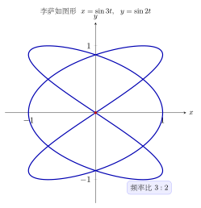

# 第24章：高阶综合问题与下一步

> 真正高阶的三角问题，难点常常不在公式复杂，而在于你是否能快速判断：这个题该用单位圆、图像、恒等式、几何、复数还是 Fourier 的语言来描述。

## 学习目标

完成本章学习后，你将能够：

1. 识别复杂三角题背后的“表示系统”
2. 把本教程前 23 章的工具整合起来使用
3. 知道不同题型最适合走哪条解题路径
4. 为后续微积分、线性代数、信号处理继续学习做好过渡
5. 建立三角函数学习的长期知识地图

---

## 正文内容

## 24.1 为什么高阶题最难的是“选方法”

高阶题常见的失败方式不是不会算，而是：

- 在代数世界里硬算一个本该画图的题
- 在单位圆里死抠一个本该用复数的题
- 在几何表示里纠缠一个本该先做辅助角压缩的题

所以高阶题第一步永远是：

> 先判断表示系统，再动手计算。

---

## 24.2 常见表示系统

| 题型信号 | 优先方法 |
|----------|----------|
| 角位置、象限、符号 | 单位圆 |
| 周期、最值、区间 | 图像 |
| 和差、乘积、高次幂 | 恒等式变换 |
| 一般三角形 | 正弦定理 / 余弦定理 |
| 根式、复杂三角式 | 三角代换 / 万能代换 |
| 旋转、幂、单位根 | 复数 / 欧拉公式 |
| 周期叠加、信号 | Fourier / 拍频 / 相量 |

真正熟练的学习者，看到题目结构后，往往几秒内就该知道大致走哪条路线。

---

## 24.3 例题：同一个问题的多种表示

以求值题为例：

$$
\cos75^\circ
$$

可以有多种思路：

1. 和角公式：$45^\circ+30^\circ$
2. 余函数关系：和 $\sin15^\circ$ 联系
3. 复数法：借助欧拉公式和角相加

这说明高阶问题并不是“多一步公式”，而是“多一种表示切换能力”。

---

## 24.4 例题：方法选择优于计算堆叠

若题目要求分析：

$$
\sin x + \cos x
$$

的最大值，你当然可以平方、展开、代数化简；但最快的方法通常是：

$$
\sin x + \cos x = \sqrt2\sin\left(x+\frac\pi4\right)
$$

于是最大值立刻是：

$$
\sqrt2
$$

这个例子非常典型：

- 正确方法会让题目直接变短
- 错误方法会让题目显得“很难”

---

## 24.5 三角函数之后该走向哪里

学完三角函数后，常见的延伸方向有：

### 向微积分走

- 极限与导数
- 三角函数微分积分
- 三角代换
- Fourier 分析

### 向线性代数与几何走

- 旋转矩阵
- 正交变换
- 向量夹角
- 坐标变换

### 向信号处理走

- 拍频
- 调制
- 频谱
- 相量与交流系统

### 向竞赛与综合题走

- 参数最值
- 结构性证明
- 多表示系统切换

---

## 24.6 学完整套教程后应形成的能力

如果这套教程真正学完，你应当具备三种能力：

1. **快速归约能力**：把任意角问题归约到参考角和象限
2. **结构识别能力**：看出题目适合单位圆、图像、恒等式、几何、复数还是信号方法
3. **表示切换能力**：在不同方法之间切换，而不被单一公式束缚

这三种能力比背下更多公式更重要。

作为本教程的收束，下面这张李萨如图形（Lissajous）正是“多表示综合”的缩影：把两路正弦信号 $x=\sin 3t$、$y=\sin 2t$ 分别送入水平与竖直方向，它们的合成轨迹由频率比 $3:2$ 决定。一条曲线里同时藏着旋转、投影与周期三条主线——这正是三角函数贯穿信号、几何与代数的最佳写照。

---

## 本章小结

| 能力 | 含义 |
|------|------|
| 归约 | 把复杂角度和表达式变成熟悉形式 |
| 识别 | 判断题目真正属于哪类结构 |
| 切换 | 在图像、代数、几何、复数和频率之间转换 |

---

## 分级例题精练

> 本节精选 6 道例题，分三档难度：**初中基础 ★** / **高中核心 ★★** / **高阶拓展 ★★★**（本章侧重高中核心与高阶拓展）。每题含【题目】【解】【点评】，建议先自行尝试再看解。本章为综合章，例题刻意跨主题，考查“选对表示系统”的能力。

### 例题精练 1（★★ 高中核心）

**题目**：求 $f(x)=\sin x+\sqrt3\cos x$ 在 $\mathbb R$ 上的最大值与取得最大值时的 $x$。

**解**：识别这是“同频正弦加余弦”，最优方法是辅助角压缩。写 $\sin x+\sqrt3\cos x=A\sin(x+\varphi)$，则 $A=\sqrt{1^2+(\sqrt3)^2}=2$，且 $\cos\varphi=\dfrac1A=\dfrac12$、$\sin\varphi=\dfrac{\sqrt3}{A}=\dfrac{\sqrt3}{2}$，故 $\varphi=\dfrac{\pi}{3}$：

$$f(x)=2\sin\!\left(x+\frac{\pi}{3}\right).$$

最大值为 $2$，当 $x+\dfrac{\pi}{3}=\dfrac{\pi}{2}+2k\pi$，即 $x=\dfrac{\pi}{6}+2k\pi\ (k\in\mathbb Z)$ 时取得。

**点评**：这是第 24.4 节思路的标准落地——“正确方法让题目直接变短”。不必平方、求导，辅助角公式一步到位。识别“$a\sin x+b\cos x$”就立刻想到振幅 $\sqrt{a^2+b^2}$。

### 例题精练 2（★★ 高中核心）

**题目**：在 $\triangle ABC$ 中，已知 $b=7$，$c=5$，$A=120^\circ$，求边 $a$。

**解**：题型是“已知两边及夹角求第三边”，应优先用余弦定理：

$$a^2=b^2+c^2-2bc\cos A=7^2+5^2-2\cdot 7\cdot 5\cdot\cos 120^\circ.$$

$\cos 120^\circ=-\dfrac12$，故

$$a^2=49+25-70\cdot\left(-\tfrac12\right)=74+35=109,\qquad a=\sqrt{109}.$$

**点评**：表示系统识别——“一般三角形 + 两边夹角”直指余弦定理，无需先求别的角。注意钝角 $120^\circ$ 的余弦为负，使 $a$ 比直角情形更长，符合几何直觉。

### 例题精练 3（★★ 高中核心）

**题目**：不查表求 $\cos 75^\circ$ 的精确值（呼应第 24.3 节）。

**解**：把 $75^\circ$ 拆成已知特殊角之和 $45^\circ+30^\circ$，用和角公式：

$$\cos 75^\circ=\cos(45^\circ+30^\circ)=\cos 45^\circ\cos 30^\circ-\sin 45^\circ\sin 30^\circ.$$

代入 $\cos 45^\circ=\sin 45^\circ=\dfrac{\sqrt2}{2}$、$\cos 30^\circ=\dfrac{\sqrt3}{2}$、$\sin 30^\circ=\dfrac12$：

$$\cos 75^\circ=\frac{\sqrt2}{2}\cdot\frac{\sqrt3}{2}-\frac{\sqrt2}{2}\cdot\frac12=\frac{\sqrt6}{4}-\frac{\sqrt2}{4}=\frac{\sqrt6-\sqrt2}{4}.$$

**点评**：高阶能力的核心之一是“把陌生角归约到特殊角的组合”。$\cos 75^\circ=\dfrac{\sqrt6-\sqrt2}{4}\approx 0.2588$，与计算器一致。本题第 24.3 节列出的复数法（$e^{i75^\circ}=e^{i45^\circ}e^{i30^\circ}$）会给出同样结果。

### 例题精练 4（★★★ 高阶拓展）

**题目**：用复数（棣莫弗定理）求 $\cos 3\theta$ 关于 $\cos\theta$ 的表达式。

**解**：表示系统识别——“多倍角恒等式”最干净的来源是复数。由棣莫弗定理 $(\cos\theta+i\sin\theta)^3=\cos 3\theta+i\sin 3\theta$。展开左边：

$$(\cos\theta+i\sin\theta)^3=\cos^3\theta+3i\cos^2\theta\sin\theta+3i^2\cos\theta\sin^2\theta+i^3\sin^3\theta.$$

取实部（$i^2=-1$）：

$$\cos 3\theta=\cos^3\theta-3\cos\theta\sin^2\theta.$$

用 $\sin^2\theta=1-\cos^2\theta$ 化为纯余弦：

$$\cos 3\theta=\cos^3\theta-3\cos\theta(1-\cos^2\theta)=4\cos^3\theta-3\cos\theta.$$

**点评**：这是“多表示切换”的范例——把三角恒等式问题搬到复数里，借二项展开一步得到。$\cos 3\theta=4\cos^3\theta-3\cos\theta$ 正是切比雪夫多项式 $T_3$，后续在数值分析与逼近论中会反复出现。

### 例题精练 5（★★★ 高阶拓展）

**题目**（信号 + 旋转综合）：信号 $s(t)=\cos\omega t+\cos\!\left(\omega t+\dfrac{2\pi}{3}\right)+\cos\!\left(\omega t+\dfrac{4\pi}{3}\right)$。先用相量法判断其合成结果，再说明这与“三个等长向量旋转 $120^\circ$ 排布”的几何图景如何一致。

**解**：三个同频波相位互差 $\dfrac{2\pi}{3}$，相量为单位长度、辐角 $0,\dfrac{2\pi}{3},\dfrac{4\pi}{3}$。化直角坐标（$\cos\dfrac{2\pi}{3}=\cos\dfrac{4\pi}{3}=-\dfrac12$，$\sin\dfrac{2\pi}{3}=\dfrac{\sqrt3}{2}$，$\sin\dfrac{4\pi}{3}=-\dfrac{\sqrt3}{2}$）：

$$\mathbf P=\underbrace{(1,0)}_{0}+\underbrace{\left(-\tfrac12,\tfrac{\sqrt3}{2}\right)}_{2\pi/3}+\underbrace{\left(-\tfrac12,-\tfrac{\sqrt3}{2}\right)}_{4\pi/3}=\Big(1-\tfrac12-\tfrac12,\ 0+\tfrac{\sqrt3}{2}-\tfrac{\sqrt3}{2}\Big)=(0,0).$$

合成相量为零，故 $s(t)\equiv 0$。

几何上，每个相量可由前一个绕原点旋转 $R_{120^\circ}$ 得到（第 23 章的旋转矩阵）；三个等长向量两两成 $120^\circ$，首尾相接恰好闭合成一个正三角形，合矢量自然为零。

**点评**：本题把第 22 章（相量叠加）与第 23 章（旋转矩阵）联用——同一组向量，既可看成“三个波的相量和”，也可看成“一个向量被 $R_{120^\circ}$ 反复旋转的轨道”。等幅、等间隔相位的同频波之和为零，是单位根求和 $1+\omega+\omega^2=0$（$\omega=e^{i2\pi/3}$）的物理化身，也是三相电平衡的根据。

### 例题精练 6（★★★ 高阶拓展）

**题目**（最值 + 表示切换综合）：求 $g(x)=\dfrac{\sin x}{2+\cos x}$ 在 $\mathbb R$ 上的取值范围。

**解**：直接求导可行但繁琐；更结构化的方法是设 $y=\dfrac{\sin x}{2+\cos x}$，整理成关于 $\sin x,\cos x$ 的线性约束：

$$y(2+\cos x)=\sin x\ \Longrightarrow\ \sin x-y\cos x=2y.$$

左边是“$a\sin x+b\cos x$”型，振幅为 $\sqrt{1+y^2}$，故 $\sin x-y\cos x=\sqrt{1+y^2}\,\sin(x+\psi)$，其取值范围是 $\left[-\sqrt{1+y^2},\ \sqrt{1+y^2}\right]$。方程 $\sin x-y\cos x=2y$ 有解当且仅当

$$|2y|\le\sqrt{1+y^2}\ \Longrightarrow\ 4y^2\le 1+y^2\ \Longrightarrow\ 3y^2\le 1\ \Longrightarrow\ -\frac{1}{\sqrt3}\le y\le\frac{1}{\sqrt3}.$$

所以值域为 $\left[-\dfrac{\sqrt3}{3},\ \dfrac{\sqrt3}{3}\right]$。

**点评**：这是“辅助角振幅 + 方程有解条件”的经典联用——把求值域问题转化为“含参三角方程何时有解”，再用 $|a\sin x+b\cos x|\le\sqrt{a^2+b^2}$ 卡住参数。比逐点求导更能看清结构，是第 24 章倡导的“先选表示、再计算”的最佳示范。

---

## 练习题

1. 为什么高阶三角题的第一步通常不是计算，而是判断表示系统？
2. 以 $\sin x+\cos x$ 的最值为例，对比两种不同解法。 
3. 什么时候应优先用复数方法，而不是继续堆三角恒等式？
4. 三角函数学习之后最自然的三条延伸路线是什么？
5. 设计一道综合题，并说明你会如何判断最优解题路径。
